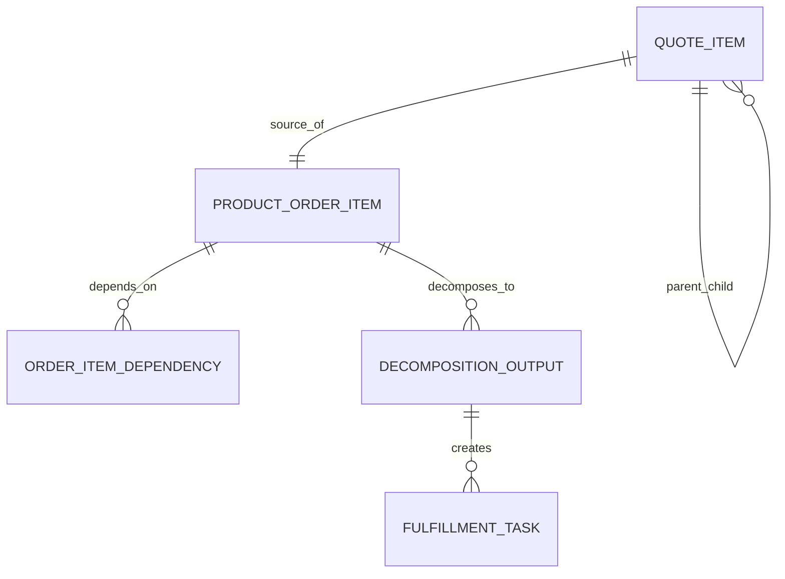

# Scenario-Based Data Modelling Lab for CPQ, Quote, Order, and Billing

## 1. Core Idea

Materi data modelling tidak cukup dipahami dari definisi entity. Senior engineer harus bisa mengambil requirement yang ambigu, memecah domain, menemukan invariant, menentukan ownership, memilih physical design, and memikirkan failure mode.

Scenario lab ini berisi latihan desain yang menyerupai problem production CPQ / Quote / Order / Billing / Telco BSS/OSS.

Mental model:

> You become strong at enterprise data modelling by repeatedly converting ambiguous business scenarios into explicit entities, relationships, lifecycles, invariants, contracts, migrations, and reconciliation rules.

Setiap scenario di bawah bisa digunakan untuk:

- self-practice,
- team design review,
- interview-style drill,
- onboarding,
- ADR preparation,
- PR review checklist,
- incident prevention exercise.

---

## 2. How to Use This Lab

Untuk setiap scenario, kerjakan dengan template:

```text
1. Clarify business meaning.
2. Identify source-of-truth.
3. Define aggregate/entity boundaries.
4. Define key fields.
5. Define lifecycle/state machine.
6. Define invariants.
7. Define API/event contracts.
8. Define persistence/constraints/indexes.
9. Define idempotency/concurrency.
10. Define migration/backfill if needed.
11. Define security/privacy/retention.
12. Define observability/support timeline.
13. Define reconciliation/data quality checks.
14. Define tests and edge cases.
15. List internal verification questions.
```

Jangan langsung menggambar table. Mulai dari truth, lifecycle, and invariants.

---

## 3. Scenario 1 — Quote Versioning and Acceptance

### Business Problem

Sales can edit a quote multiple times before customer accepts. Approval may apply only to a specific quote version. Once accepted, the quote should be immutable and converted to order.

### Questions

- What is quote family vs quote revision?
- Which version is current?
- Which version is approved?
- Which version is accepted?
- Can accepted quote be modified?
- Can customer accept expired quote?
- Can the same quote version be converted twice?
- What happens if approval arrives after quote changed?

### Expected Model Elements

Entities:

```text
quote_family
quote_revision
quote_item_revision
quote_price_snapshot
approval_request
approval_decision
quote_acceptance
product_order
```

Key fields:

```text
quote_family_id
quote_revision_id
revision_number
is_current
status
valid_until
accepted_at
source_quote_revision_id
approval_target_revision_id
```

Invariants:

- one current revision per quote family,
- accepted revision immutable,
- approval targets exact revision,
- conversion uses accepted revision,
- one order per accepted quote revision.

PostgreSQL illustrative constraint:

```sql
create unique index uq_current_quote_revision
on quote_revision (quote_family_id)
where is_current = true;

create unique index uq_order_from_quote_revision
on product_order (source_quote_revision_id)
where source_quote_revision_id is not null;
```

Events:

```text
QuoteRevisionCreated
QuotePriced
ApprovalRequested
ApprovalApproved
QuoteAccepted
QuoteConversionRequested
ProductOrderCreated
```

Edge cases:

- approval decision after revision superseded,
- quote accepted twice due to retry,
- quote expires during acceptance race,
- pricing rule changed after quote creation,
- sales user edits quote while customer accepts.

---

## 4. Scenario 2 — Bundle Quote Item to Order Item Decomposition

### Business Problem

A customer buys a bundle: internet connectivity plus managed router plus static IP. CPQ shows one commercial bundle, but fulfillment needs multiple technical tasks.

### Questions

- How to model parent/child quote items?
- Does every bundle child become order item?
- Which item carries price?
- Which item creates product instance?
- Which item creates service/resource?
- How are dependencies represented?
- How does cancellation of parent affect children?

### Expected Model Elements

Entities:

```text
quote_item
quote_item_relationship
product_order_item
order_item_dependency
decomposition_run
decomposition_output
fulfillment_task
product_instance
service_instance
resource_instance
```

Key relationships:

```text
quote_item.parent_quote_item_id
order_item.source_quote_item_id
order_item.parent_order_item_id
decomposition_output.source_order_item_id
fulfillment_task.source_decomposition_output_id
```

Invariants:

- child cannot be fulfilled before mandatory parent dependency,
- source quote item must be preserved,
- bundle price allocation must be explicit,
- cancel parent must define child cancellation/compensation behavior.

Possible model:



Reconciliation:

```text
bundle order item completed only when mandatory child items completed.
```

Edge cases:

- optional bundle add-on fails,
- partial fulfillment,
- child item priced separately,
- managed router shipped but internet activation failed,
- static IP resource unavailable.

---

## 5. Scenario 3 — Modify Existing Product

### Business Problem

Customer already has active product "Business Internet 100 Mbps" and wants upgrade to "Business Internet 500 Mbps".

### Questions

- How does quote item reference existing product?
- Is upgrade modelled as modify action or disconnect+add?
- What happens to existing charge?
- How to preserve old product history?
- How to handle effective date?
- Does service/resource change?
- Is proration needed?

### Expected Model Elements

Entities:

```text
product_instance
product_instance_version
quote_item
product_order_item
order_action
recurring_charge
charge_adjustment
service_instance
resource_assignment
```

Key fields:

```text
quote_item.action = MODIFY
quote_item.target_product_instance_id
order_item.action = MODIFY
order_item.target_product_instance_id
product_instance.effective_from
product_instance.effective_to
old_charge.effective_to
new_charge.effective_from
```

Invariants:

- modify action requires target active product,
- modification must preserve prior state/history,
- billing effective date must align with product change,
- cannot modify product already pending termination unless policy allows,
- charge transition must avoid overlap/double billing.

Potential strategies:

| Strategy | Use |
|---|---|
| Version product instance | Same product identity with new version. |
| Supersede product instance | New product instance replaces old. |
| Disconnect + add | Treat upgrade as two actions. |
| Amendment order | Existing order/product updated through controlled order. |

Edge cases:

- upgrade fails after old service changed,
- billing starts new charge before service active,
- downgrade with credit adjustment,
- product modified during open billing cycle,
- concurrent modify and disconnect order.

---

## 6. Scenario 4 — Disconnect Product and Stop Billing

### Business Problem

Customer cancels a product. Service must be disconnected and recurring billing must stop.

### Questions

- Is disconnect different from order cancel?
- What effective date stops service?
- What effective date stops charge?
- Is final invoice required?
- What if customer already paid next period?
- What if fulfillment disconnect fails?
- What happens to resource inventory?

### Expected Model Elements

Entities:

```text
disconnect_quote_item
disconnect_order_item
product_instance
service_instance
resource_assignment
recurring_charge
charge_credit
final_invoice
termination_event
```

Invariants:

- disconnect action requires active product,
- termination date must be explicit,
- charge effective_to must not exceed allowed billing stop date,
- resource release must be tracked,
- product status must not become TERMINATED before required evidence if policy requires.

Events:

```text
ProductDisconnectRequested
ServiceDisconnectCompleted
ProductTerminated
RecurringChargeTerminated
FinalInvoiceGenerated
```

Reconciliation:

```text
terminated product should not have active recurring charge after termination date.
```

Edge cases:

- backdated disconnect,
- future-dated disconnect,
- service disconnected but billing still active,
- billing stopped but service still active,
- early termination fee,
- partial month proration,
- resource release fails.

---

## 7. Scenario 5 — Usage Rating with Late and Duplicate Usage

### Business Problem

Network system sends usage events daily. Usage can arrive late and duplicates can appear due to retry.

### Questions

- What is source usage ID?
- What is idempotency key?
- How to normalize units?
- How to map usage to product/service?
- How to handle late usage after invoice?
- How to rerate?
- How to avoid double billing?

### Expected Model Elements

Entities:

```text
usage_feed_file
usage_event
metered_usage
aggregated_usage
rated_usage
usage_charge
rating_error
rerating_run
```

Key fields:

```text
source_system
external_usage_event_id
event_time
ingested_at
quantity
unit
normalized_quantity
service_instance_id
product_instance_id
rating_rule_version
billing_period
```

Unique key:

```text
source_system + external_usage_event_id
```

or domain-specific equivalent.

Invariants:

- duplicate usage event not billed twice,
- unit conversion deterministic,
- late usage policy explicit,
- rated usage references rating rule version,
- usage charge traces to rated usage.

Edge cases:

- usage before product activation,
- usage after product termination,
- service ID unmapped,
- same usage ID reused incorrectly by source,
- usage correction file,
- invoice already issued.

---

## 8. Scenario 6 — Billing Account Change

### Business Problem

Customer changes billing account for an active product. Future invoices should use new billing account, but old invoices must remain historically correct.

### Questions

- Is billing account stored on product instance?
- Is change immediate or effective-dated?
- How do charges move?
- What about open invoices?
- What about quote/order snapshots?
- What about payment terms and billing cycle?
- How to audit who changed it?

### Expected Model Elements

Entities:

```text
billing_account
billing_account_assignment
product_instance
recurring_charge
billing_profile
billing_account_change_order
billing_account_change_history
```

Key design choice:

```text
effective-dated billing account assignment
```

Example:

```text
product_billing_assignment
- product_instance_id
- billing_account_id
- effective_from
- effective_to
- source_order_id
- reason_code
```

Invariants:

- no overlapping active billing account assignment,
- invoice uses assignment effective during billing period,
- historical invoice does not change when current billing account changes,
- change requires audit/reason.

Edge cases:

- billing account inactive,
- billing cycle differs,
- mid-cycle change,
- future-dated change,
- legal entity change,
- customer hierarchy change.

---

## 9. Scenario 7 — External OSS Service Activation Callback

### Business Problem

OSS sends callback: service activation completed. The callback includes external service ID and status.

### Questions

- How to map external service ID to local service/order?
- What if callback arrives before mapping is committed?
- What if duplicate callback arrives?
- What if callback status conflicts with local state?
- What if callback is from wrong tenant/environment?
- What if callback is older than latest status?

### Expected Model Elements

Entities:

```text
external_reference
integration_message
inbox_message
service_order
service_instance
fulfillment_task
status_history
```

Key fields:

```text
source_system
external_entity_type
external_id
tenant_id
environment
correlation_id
external_status
internal_status
aggregate_version
```

Consumer flow:

```text
validate callback authenticity
normalize external ID
lookup external_reference
check tenant/environment
insert inbox idempotency
load local task/service/order
apply guarded transition
write status history
publish internal event
```

Edge cases:

- callback duplicate,
- callback out-of-order,
- mapping conflict,
- external success but local order cancelled,
- external failure but retry pending,
- stale callback after manual repair.

---

## 10. Scenario 8 — Product Active but Charge Missing

### Business Problem

Reconciliation finds active billable product with no active charge.

### Questions

- Is product actually billable?
- Was charge supposed to be generated?
- Was billing account valid?
- Was billing trigger event published?
- Was charge created but failed downstream?
- What is financial impact?
- How to repair safely?

### Expected Investigation Model

Trace:

```text
product_instance
  -> source_order_item
  -> order commercial snapshot
  -> billing readiness result
  -> billing trigger
  -> charge
  -> external billing reference
```

Data quality rule:

```text
ACTIVE_BILLABLE_PRODUCT_REQUIRES_ACTIVE_CHARGE
```

Repair:

```text
create data_repair_case
verify product/billing readiness
create/retry charge idempotently
reconcile external billing
calculate revenue leakage window
verify DQ rule passes
```

Preventive action:

- add billing trigger guard,
- add outbox/inbox monitoring,
- add reconciliation alert,
- add test scenario.

---

## 11. Scenario 9 — Order Status Redesign

### Business Problem

Current `order.status` is overloaded. It means lifecycle, fulfillment progress, and billing readiness depending code path.

### Questions

- What statuses exist now?
- Which code paths interpret them?
- Which reports use them?
- Which API clients consume them?
- Which status dimension should be split?
- How to migrate old data?
- How to keep API compatibility?

### Expected Refactoring Model

New fields:

```text
order.lifecycle_status
order.fulfillment_status
order.billing_status
order.reconciliation_status
```

Migration plan:

```text
add new nullable fields
backfill from old status with mapping table
shadow compare old derived status vs new fields
switch internal reads
keep old API field as computed compatibility field
deprecate old status
remove after consumers migrate
```

Risks:

- lossy mapping,
- reporting changes,
- client enum handling,
- state machine rules need update,
- historical status history migration.

---

## 12. Scenario 10 — Sensitive Margin Field Exposure

### Business Problem

A new API needs to expose quote summary. The entity contains margin and cost fields.

### Questions

- Who can see margin?
- Is margin returned in existing API?
- Is this API customer-facing or internal?
- Is response cached?
- Is response indexed/searchable?
- Is event payload affected?
- Is export allowed?
- Is audit needed when margin is viewed?

### Expected Model Elements

Controls:

```text
data_classification_rule
field_level_authorization
DTO mapper filtering
access audit
cache key visibility policy
export policy
```

Implementation:

```text
QuoteSummaryResponse excludes margin by default.
Margin included only if actor has VIEW_MARGIN.
Cache key includes field visibility or sensitive response not cached.
```

Tests:

- unauthorized user cannot see margin,
- authorized finance/deal desk can see,
- search index excludes margin,
- event does not include margin,
- export requires approval.

---

## 13. Scenario 11 — Tenant-Specific Product Catalog

### Business Problem

Some tenants have custom product offering availability and pricing.

### Questions

- Is product offering global or tenant-specific?
- Is price list tenant-specific?
- How does cache key include tenant?
- How does quote preserve catalog version?
- Can catalog version be shared across tenants?
- How does reporting compare across tenants?
- How does tenant migration handle catalog?

### Expected Model Elements

Entities:

```text
tenant
product_catalog
product_offering
tenant_product_offering_assignment
price_list
tenant_price_list_assignment
catalog_publication
```

Key fields:

```text
tenant_id
catalog_version
price_list_version
effective_from
effective_to
```

Invariants:

- quote item offering must be available to tenant,
- price list must be valid for tenant/account/currency,
- cache key includes tenant and version,
- accepted quote preserves tenant catalog version.

Edge cases:

- tenant config changes during quote draft,
- offering retired for tenant after quote created,
- quote accepted after catalog publish,
- tenant migration.

---

## 14. Scenario 12 — Data Migration from Legacy Order System

### Business Problem

Legacy orders and active products must be migrated into new order/product inventory model.

### Questions

- Which legacy entities map to new entities?
- Are legacy IDs preserved?
- Is product history complete?
- How to infer source order item?
- How to handle missing billing account?
- How to handle invalid status?
- How to prevent duplicate active products?
- How to validate migration?

### Expected Model Elements

Entities:

```text
legacy_entity_mapping
data_migration
data_migration_batch
data_migration_exception
product_instance
product_instance_characteristic
external_reference
reconciliation_result
```

Migration phases:

```text
extract
stage
validate
transform
load
reconcile
cutover
support legacy search
```

Validation:

- active products have billing account,
- product offering mapping exists,
- external service/resource ID mapped,
- no duplicate active product,
- charge/invoice trace if needed,
- status mapping documented.

---

## 15. Scenario 13 — Reporting KPI Dispute

### Business Problem

Sales and finance disagree on revenue number.

Sales uses accepted quote amount. Finance uses invoice amount. Product team uses active recurring charge amount.

### Questions

- What metric is each team asking for?
- What is fact grain?
- What is time basis?
- Is it quoted, booked, activated, billed, collected, or recognized?
- Which cancellations/credits are included?
- Which currency/reporting conversion?
- How are revisions handled?
- How are bundles handled?

### Expected Metric Model

Separate metrics:

```text
quoted_amount
booked_amount
activated_mrr
billed_amount
collected_amount
recognized_revenue
```

Each metric has:

```text
metric_code
definition
grain
source_fact
time_basis
filters
owner
version
```

Prevention:

- metric catalog,
- lineage,
- source fact model,
- dashboard labels precise,
- finance/product/sales owner approval.

---

## 16. Scenario 14 — Manual Repair Gone Wrong

### Business Problem

Support manually changed order status to COMPLETED. Later billing was not activated and fulfillment task remained open.

### Questions

- Why was manual repair allowed?
- Was domain command bypassed?
- Was audit captured?
- Was status aggregation recalculated?
- Were events emitted?
- Was repair verified?
- What invariant was violated?

### Expected Correct Model

Manual repair should be:

```text
data_repair_case
operational_command
reason_code
approval
before/after snapshot
domain service command
audit
events
verification
reconciliation
```

Repair should not update only `order.status`.

Correct operation may be:

```text
ResolveFulfillmentTask
RecalculateOrderAggregateStatus
TriggerBillingReadiness
VerifyOrderCompletion
```

Preventive action:

- remove direct SQL path,
- add repair workflow,
- add DQ rule for completed order with open task,
- add runbook.

---

## 17. Scenario 15 — API Contract Breaking Change

### Business Problem

A field `billingAccountId` is renamed to `payerAccountId` in API. A consumer fails in production.

### Questions

- Was this breaking change?
- Were consumers known?
- Was version bumped?
- Was old field deprecated first?
- Were contract tests run?
- Was sample payload updated?
- Was field semantic actually changed?
- Was TMF/external mapping affected?

### Expected Contract Model

Safer rollout:

```text
add payerAccountId optional
keep billingAccountId
document relationship/precedence
emit both during compatibility window
notify consumers
track usage
deprecate billingAccountId
remove only after migration
```

Contract registry should show:

```text
producer
consumers
versions
compatibility policy
deprecation deadline
```

---

## 18. Scenario 16 — Search Index Shows Deleted Contact

### Business Problem

Contact PII was anonymized in source DB, but search still returns old email.

### Questions

- Where else is contact copied?
- Is search index part of purge workflow?
- Is cache invalidated?
- Is analytics/read model updated?
- Is backup restore process aware?
- Is contact in audit/snapshot evidence?
- Is deletion/anonymization event emitted?

### Expected Model Elements

```text
data_copy_registry
privacy_request
anonymization_event
cache_invalidation_record
search_index_document_state
projection_checkpoint
```

Repair:

```text
remove/update search document
invalidate cache
update read model
verify no derived PII
record repair
```

Preventive action:

- include derived stores in purge workflow,
- add sensitive data lineage,
- add DQ check for anonymized source but indexed PII.

---

## 19. Scenario 17 — Stale Event Overwrites Projection

### Business Problem

Product projection shows status SUSPENDED after source already TERMINATED. Investigation finds old suspended event processed late.

### Questions

- Does event include aggregate version?
- Does projection store source version?
- Does consumer ignore stale events?
- Are events ordered by aggregate?
- Was projection rebuilt recently?
- Does replay mode preserve ordering?

### Expected Fix

Projection table:

```text
product_projection.aggregate_version
product_projection.last_event_id
product_projection.projected_at
```

Consumer rule:

```text
if event.aggregateVersion <= projection.aggregateVersion:
    mark event skipped as stale
else:
    apply update
```

Add metric:

```text
stale_event_skipped_count
```

Test:

- process TERMINATED v5 then SUSPENDED v4; projection remains TERMINATED.

---

## 20. Scenario 18 — Bulk Import Creates Duplicate Customers

### Business Problem

Bulk customer import creates duplicate customer/account records because matching was weak.

### Questions

- What is master data source?
- What matching key was used?
- Was duplicate detection run?
- Was import idempotent?
- Were external IDs preserved?
- Was manual review required for low-confidence matches?
- Can duplicates be merged safely?

### Expected Model Elements

```text
bulk_import_job
staging_file_row
external_reference
potential_duplicate
match_rule
merge_case
survivorship_rule
```

Prevention:

- use deterministic external ID mapping,
- use confidence score,
- require review for low confidence,
- use idempotency key per source row,
- create duplicate detection report before final load.

---

## 21. Scenario 19 — Catalog Publish Breaks Draft Quotes

### Business Problem

A new catalog version is published. Some existing draft quotes now fail pricing or validation.

### Questions

- Do draft quotes reference catalog version?
- Should draft quote be revalidated automatically?
- Can quote continue on old catalog version?
- Does product offering retire affect existing draft?
- How does quote acceptance check validity?
- Is customer-facing promise affected?

### Expected Model

```text
quote.catalog_version
quote_item.product_offering_version
quote.validation_status
catalog_publication_event
quote_revalidation_job
```

Policy options:

| Policy | Effect |
|---|---|
| Lock quote to original catalog version | Stability. |
| Revalidate draft on latest catalog | Freshness. |
| Allow grandfathered draft until expiry | Balanced. |
| Force reprice before submit | Control. |

Choose and document.

---

## 22. Scenario 20 — On-Prem Customer Upgrade with Schema Difference

### Business Problem

On-prem deployment is two versions behind. New data model migration assumes existing columns/events that do not exist.

### Questions

- Is upgrade path sequential?
- Are migrations cumulative and idempotent?
- Are feature flags compatible?
- Is data volume known?
- Are customer-specific extensions present?
- Are integration endpoints different?
- Is rollback possible?
- Is support telemetry limited?

### Expected Model

```text
deployment_topology
schema_version
tenant/deployment_feature_flag
migration_history
data_migration_exception
upgrade_runbook
```

Prevention:

- explicit supported upgrade paths,
- pre-upgrade compatibility check,
- dry run migration,
- customer-specific extension registry,
- backup/restore plan,
- post-upgrade reconciliation.

---

## 23. Design Exercise Template

For each scenario, fill:

```text
## Scenario
## Business goal
## Non-goals
## Source of truth
## Entities
## Relationships
## State machine
## Invariants
## API/commands
## Events
## PostgreSQL tables/constraints/indexes
## Idempotency/concurrency
## Security/privacy
## Observability
## Reconciliation
## Migration/backfill
## Tests
## Failure modes
## Internal verification
```

Use this template as deliberate practice.

---

## 24. Self-Assessment Rubric

Rate yourself:

| Level | Capability |
|---|---|
| 1 | Can draw tables from requirements. |
| 2 | Can define relationships and basic constraints. |
| 3 | Can model lifecycle, snapshot, and source-of-truth. |
| 4 | Can design idempotency, events, migrations, and reconciliation. |
| 5 | Can identify failure modes, tradeoffs, governance, and production repair paths. |

Goal for senior enterprise backend engineer: Level 4+ consistently.

---

## 25. Common Mistakes in Scenario Answers

Watch for:

- starting from table columns without domain meaning,
- ignoring version/snapshot,
- ignoring idempotency,
- using one status for everything,
- not preserving source references,
- forgetting billing impact,
- forgetting product/service/resource boundary,
- ignoring tenant/security,
- relying only on events without reconciliation,
- ignoring migration of existing data,
- not defining tests,
- treating reports as afterthought.

---

## 26. Team Practice Format

Suggested team exercise:

```text
1. Pick one scenario.
2. Everyone drafts model for 20 minutes.
3. Compare entities/invariants.
4. Identify disagreements.
5. Discuss failure modes.
6. Pick tradeoff and document ADR.
7. Write PR review checklist.
8. Convert into golden test scenario.
```

This improves shared modelling vocabulary.

---

## 27. Internal Verification Checklist

For every scenario, verify internally:

- What is actual CSG/team source-of-truth?
- What APIs/events/tables already exist?
- What TMF resources/extensions apply?
- What billing/OSS integration owns downstream truth?
- What existing data quality/reconciliation rules exist?
- What known incidents have happened in this area?
- What constraints are enforced in PostgreSQL?
- What support tools already expose timeline/mapping?
- What migration/on-prem constraints exist?
- What security/privacy policies apply?

Do not assume internal implementation from generic model.

---

## 28. Summary

Scenario practice turns concepts into production judgement.

A strong enterprise data modeller can handle:

- quote versioning,
- bundles,
- modify/disconnect,
- usage/rating,
- billing account changes,
- external callbacks,
- missing charge,
- status redesign,
- sensitive data exposure,
- tenant-specific catalog,
- legacy migration,
- KPI disputes,
- manual repair,
- contract evolution,
- privacy purge,
- stale projections,
- bulk import,
- catalog publish,
- on-prem upgrades.

The key principle:

> The real skill is not memorizing entity names. It is repeatedly converting messy business scenarios into models that preserve truth under change, failure, retry, scale, and integration.
