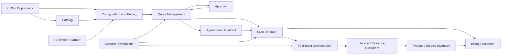

# Part 001 — CPQ, Quote-to-Order, Quote-to-Cash, and System Boundaries

## Positioning

CPQ, quote management, order management, dan quote-to-cash sering dibicarakan seolah-olah merupakan satu sistem tunggal.

Dalam praktik enterprise, keempatnya adalah kumpulan capability dan lifecycle yang saling terhubung tetapi memiliki:

- tujuan;
- owner;
- invariants;
- state;
- data source;
- failure mode;
- dan operational concern

yang berbeda.

Salah menentukan boundary akan menghasilkan:

- giant aggregate;
- duplicated business facts;
- synchronous call chains;
- unclear ownership;
- order yang tidak sesuai quote;
- dan reconciliation yang mahal.

> **Core thesis:** arsitektur Quote & Order harus menjaga kontinuitas commercial intent dari customer need sampai executable order, tanpa mencampurkan sales decision, contract commitment, fulfillment execution, inventory truth, dan billing truth ke dalam satu model yang ambigu.

---

## 1. What CPQ Means

CPQ adalah singkatan dari:

- **Configure**
- **Price**
- **Quote**

Ketiganya bukan sekadar tiga layar aplikasi.

Mereka merepresentasikan tiga problem domain:

### Configure

Menentukan kombinasi product, option, quantity, dependency, dan constraint yang valid untuk context customer tertentu.

### Price

Menghitung commercial value berdasarkan:

- catalog;
- customer;
- quantity;
- term;
- channel;
- market;
- contract;
- discount;
- dan temporal context.

### Quote

Menyusun commercial proposal yang:

- dapat direvisi;
- divalidasi;
- disetujui;
- disampaikan;
- diterima;
- dan digunakan sebagai dasar order.

---

## 2. CPQ Is Not Only a Calculator

A weak mental model:

```text
Select product
-> calculate total
-> print PDF
```

A stronger enterprise mental model:

```text
Customer intent
-> qualification
-> configuration
-> pricing
-> commercial validation
-> approval
-> proposal
-> negotiation
-> acceptance
-> executable order intent
```

CPQ mengelola commercial decision system.

---

## 3. Quote-to-Order

Quote-to-Order adalah lifecycle yang mengubah accepted commercial proposal menjadi order intent yang dapat dieksekusi.

Fokusnya meliputi:

- preservation of accepted terms;
- item transformation;
- traceability;
- order readiness;
- duplicate prevention;
- dan downstream handoff.

Quote-to-Order bukan hanya:

> Copy quote rows into order rows.

Transformation harus menjaga commercial invariants.

---

## 4. Quote-to-Cash

Quote-to-Cash memiliki scope yang lebih luas:

```text
Quote
-> acceptance or agreement
-> order
-> fulfillment
-> activation
-> billing
-> collection
-> revenue
```

Beberapa organisasi memasukkan:

- opportunity;
- contract;
- invoicing;
- payment;
- renewal;
- dan amendment

ke dalam terminology Quote-to-Cash.

Selalu verifikasi local definition.

---

## 5. Order-to-Cash

Order-to-Cash biasanya dimulai setelah order ada.

```text
Order
-> fulfillment
-> delivery
-> invoice
-> payment
```

Quote-to-Cash mencakup commercial proposal sebelum order.

Perbedaan ini penting untuk:

- ownership;
- metrics;
- data lineage;
- dan failure analysis.

---

## 6. Lead-to-Cash

Lead-to-Cash dapat mencakup:

```text
Lead
-> opportunity
-> solution design
-> quote
-> contract
-> order
-> fulfillment
-> cash
```

Quote & Order platform mungkin hanya memiliki sebagian dari lifecycle ini.

Jangan mengasumsikan platform harus menjadi source of truth untuk seluruh flow.

---

## 7. Commercial Lifecycle versus Fulfillment Lifecycle

### Commercial lifecycle

Menjawab:

- apa yang customer inginkan;
- apa yang boleh dijual;
- berapa harganya;
- siapa yang harus menyetujui;
- dan apa yang disepakati.

### Fulfillment lifecycle

Menjawab:

- bagaimana intent direalisasikan;
- task atau service apa yang dibuat;
- dependency mana yang dijalankan;
- dan kapan delivery selesai.

Keduanya terhubung tetapi tidak identik.

---

## 8. Commercial Product versus Technical Realization

Customer dapat membeli:

> Managed connectivity service for 20 sites.

Fulfillment mungkin membutuhkan:

- access service;
- network configuration;
- device shipment;
- installation visit;
- activation;
- dan billing setup.

Commercial product menyatakan **promise**.

Technical realization menyatakan **how the promise is delivered**.

---

## 9. Core Domain Questions

Sebelum membahas services atau tables, tanyakan:

```text
What commercial promise is being made?
What evidence makes it binding?
What intent must downstream execute?
What must remain consistent across the lifecycle?
What may legitimately differ after fulfillment?
```

---

## 10. Representative End-to-End Landscape



Ini adalah representative reference map.

Internal CSG boundary dapat berbeda.

---

## 11. Upstream Systems

Common upstream systems:

- CRM;
- opportunity management;
- lead management;
- customer/account master;
- identity and access;
- partner portal;
- channel management;
- product catalog;
- address or serviceability;
- credit system;
- contract repository.

Upstream bukan selalu owner dari seluruh data yang dikirim.

---

## 12. Downstream Systems

Common downstream systems:

- order orchestration;
- service order management;
- resource order management;
- provisioning;
- logistics;
- workforce management;
- product inventory;
- service inventory;
- billing;
- invoicing;
- revenue assurance;
- customer notification;
- support.

---

## 13. Sideways or Peer Systems

Some systems are neither purely upstream nor downstream.

Examples:

- approval platform;
- document generation;
- tax service;
- pricing service;
- rule engine;
- fraud/risk;
- contract management;
- enterprise event platform;
- reporting/analytics.

Their relationship depends on ownership.

---

## 14. The Platform Boundary Problem

A platform boundary determines:

- what state it owns;
- which commands it accepts;
- what events it publishes;
- what consistency it guarantees;
- and what failures it must recover.

Poor boundary:

> Quote & Order owns everything related to selling.

Better boundary:

> Quote & Order owns specific commercial and order-intent facts, while integrating with authoritative catalog, customer, fulfillment, inventory, and billing capabilities.

The exact boundary must be verified internally.

---

## 15. Bounded Context Thinking

Possible bounded contexts include:

- Product Catalog;
- Product Qualification;
- Configuration;
- Pricing;
- Quote;
- Approval;
- Agreement;
- Product Order;
- Fulfillment;
- Inventory;
- Billing.

These are candidate contexts, not mandatory microservices.

One context can contain multiple services.

One service can unfortunately contain multiple contexts.

Do not equate context with deployment unit automatically.

---

## 16. Core, Supporting, and Generic Domains

### Core domain

Creates strategic differentiation.

Possible examples:

- complex B2B configuration;
- commercial orchestration;
- quote-to-order consistency.

### Supporting domain

Necessary but not differentiating.

Possible examples:

- proposal generation;
- approval coordination;
- reconciliation.

### Generic domain

Commodity capability.

Possible examples:

- identity;
- email;
- generic document storage.

Classification is product-specific.

---

## 17. What a Quote & Order Platform May Own

Potential ownership:

- quote aggregate;
- quote revisions;
- quote lifecycle;
- commercial validation;
- approval requests;
- accepted quote reference;
- product order aggregate;
- order lifecycle;
- quote-to-order traceability;
- order decomposition;
- fallout state;
- operational audit.

This is not an assertion about CSG internals.

---

## 18. What It May Reference Instead of Own

Potential external references:

- customer identity;
- account;
- catalog offering;
- credit rating;
- tax jurisdiction;
- contract document;
- installed inventory;
- invoice;
- payment.

Reference versus snapshot is a domain decision.

---

## 19. Source of Truth

For each business fact, define one authoritative owner.

Example matrix:

| Business Fact | Possible Authority |
|---|---|
| Customer legal identity | Customer master / CRM |
| Product offering definition | Product Catalog |
| Calculated quoted price | Pricing/Quote |
| Accepted commercial commitment | Quote/Agreement |
| Requested product order | Product Order |
| Fulfillment progress | Orchestrator |
| Installed product | Product Inventory |
| Invoice amount | Billing |

Never copy this matrix blindly into internal architecture.

---

## 20. Snapshot versus Live Reference

### Live reference

Reads current external state.

Benefit:

- latest value.

Risk:

- historical quote changes when source changes.

### Snapshot

Copies relevant data at a point in time.

Benefit:

- reproducibility;
- auditability.

Risk:

- stale copy;
- duplication;
- reconciliation.

A quote often needs snapshots for commercial evidence.

---

## 21. Identity versus Description

A stable reference may contain:

- catalog entity ID;
- version;
- snapshot;
- display name;
- effective date.

Do not use display name as identity.

---

## 22. Product Catalog Boundary

Catalog commonly owns:

- offerings;
- specifications;
- characteristics;
- relationships;
- lifecycle;
- effective dates;
- and commercial metadata.

Catalog may not own:

- customer-specific configured instance;
- quote negotiation;
- order execution;
- or installed-product state.

---

## 23. Configuration Boundary

Configuration commonly owns or computes:

- selected options;
- constraints;
- compatibility;
- completeness;
- derived choices;
- and explanation.

It may be:

- a transient session;
- a persisted draft;
- or embedded in quote.

The choice affects lifecycle and performance.

---

## 24. Pricing Boundary

Pricing commonly owns or computes:

- price components;
- discount;
- adjustment;
- quantity effects;
- term effects;
- and calculated totals.

Important question:

> Is pricing authoritative for commercial output, or only a calculation service whose result becomes authoritative when snapshotted by quote?

---

## 25. Quote Boundary

Quote commonly owns:

- proposal identity;
- revisions;
- customer context;
- configured items;
- quoted price snapshot;
- commercial terms;
- validity;
- approval state;
- and acceptance evidence.

Quote should not become a full fulfillment work order.

---

## 26. Approval Boundary

Approval can be:

- embedded in Quote;
- a reusable workflow capability;
- or external enterprise process.

Approval ownership must preserve:

- policy;
- authority;
- decision;
- reason;
- and audit.

---

## 27. Agreement Boundary

Agreement or contract may own:

- binding terms;
- signatories;
- effective dates;
- obligations;
- and amendments.

Some systems use accepted quote as agreement evidence.

Others create a distinct agreement.

This distinction is legally and architecturally important.

---

## 28. Product Order Boundary

Product order owns execution intent.

It commonly includes:

- requested action;
- product/order items;
- requested dates;
- relationships;
- order state;
- and traceability.

It should not claim to be the installed inventory.

---

## 29. Fulfillment Boundary

Fulfillment converts intent into work.

It may own:

- decomposition result;
- execution plan;
- task state;
- service/resource orders;
- and recovery workflow.

---

## 30. Inventory Boundary

Inventory owns realized instances.

Possible layers:

- product inventory;
- service inventory;
- resource inventory.

Inventory answers:

> What is actually installed or active now?

Not:

> What was quoted?

---

## 31. Billing Boundary

Billing owns:

- charge activation;
- bill cycle;
- invoice;
- usage rating;
- account balance;
- and billing adjustments

depending on the platform.

Quoted price and billed price need lineage, not identity by assumption.

---

## 32. As-Quoted, As-Ordered, As-Built, and As-Billed

### As-quoted

What was proposed and priced.

### As-ordered

What was requested for execution.

### As-built

What was actually realized.

### As-billed

What billing activated and invoiced.

These views may differ legitimately.

The architecture must preserve explanation.

---

## 33. Commercial Invariants

Representative invariants:

- accepted quote revision is immutable;
- order conversion references one accepted revision;
- order does not silently change price or term;
- tenant ownership is preserved;
- one conversion command does not create duplicate orders;
- monetary totals reconcile to component breakdown.

Validate internal invariants.

---

## 34. Operational Invariants

Representative invariants:

- every long-running order has observable progress;
- every terminal failure has reason;
- every manual repair is audited;
- every downstream side effect is traceable;
- no stuck item remains invisible indefinitely.

---

## 35. Boundary Invariants

A context should not:

- mutate another context's authoritative data directly;
- infer legal acceptance from technical completion;
- infer installed state from order state;
- or recalculate accepted commercial commitment without explicit policy.

---

## 36. Lifecycle Ownership

A single lifecycle can cross contexts.

Example:

```text
Quote Accepted
-> Order Requested
-> Fulfillment Started
-> Product Activated
-> Billing Started
```

Each transition has:

- source context;
- destination context;
- command/event;
- ownership;
- and consistency model.

---

## 37. Commands versus Events

### Command

Requests an action.

Examples:

- AcceptQuote;
- CreateProductOrder;
- CancelOrder.

### Event

States a fact.

Examples:

- QuoteAccepted;
- ProductOrderCreated;
- ProductActivated.

Do not use event naming for instructions.

---

## 38. Orchestration versus Choreography

### Orchestration

A coordinator directs steps.

Benefit:

- visibility;
- explicit process state.

Risk:

- central coupling.

### Choreography

Services react to events.

Benefit:

- local autonomy.

Risk:

- invisible global process;
- difficult recovery.

Long-running commercial processes often require explicit process visibility.

---

## 39. Synchronous versus Asynchronous Boundaries

### Synchronous

Useful for:

- immediate validation;
- query;
- short command.

Risk:

- temporal coupling;
- cascading timeout.

### Asynchronous

Useful for:

- long-running execution;
- integration;
- decoupling.

Risk:

- duplicate;
- ordering;
- eventual consistency;
- and ambiguous progress.

---

## 40. Transaction Boundary

A local transaction should preserve invariants inside one aggregate/context.

Cross-system atomicity is usually unavailable.

Use:

- saga;
- outbox;
- idempotency;
- compensation;
- reconciliation.

---

## 41. The Distributed Monolith Risk

Symptoms:

- multiple services;
- shared database;
- synchronous chain;
- coordinated release;
- shared model;
- and no independent ownership.

Microservices do not guarantee domain separation.

---

## 42. Giant Canonical Model Risk

A single enterprise object containing:

- catalog;
- quote;
- order;
- fulfillment;
- inventory;
- billing

often creates:

- semantic ambiguity;
- sparse fields;
- lifecycle conflict;
- and versioning pain.

Prefer explicit translation between bounded contexts.

---

## 43. Integration Contract

A good contract states:

- identity;
- version;
- semantics;
- optionality;
- error;
- idempotency;
- temporal behavior;
- and compatibility.

---

## 44. API Boundary Questions

```text
Is this command or query?
Who owns the resource?
What state transitions are allowed?
What does success mean?
Can the request be retried?
What is the version policy?
```

---

## 45. Event Boundary Questions

```text
What fact occurred?
Is the fact stable?
What aggregate emitted it?
What key preserves order?
Can it be replayed?
How do consumers handle duplicates?
```

---

## 46. TM Forum as Reference Vocabulary

TM Forum Open APIs commonly separate capabilities such as:

- Product Catalog;
- Product Offering Qualification;
- Quote;
- Product Order;
- Product Inventory;
- Shopping Cart;
- Agreement.

Use them to:

- compare semantics;
- improve interoperability;
- and identify missing boundaries.

Do not assume conformance without internal evidence.

---

## 47. CPQ in B2B and Telecom

Complex B2B/telco characteristics may include:

- multi-site;
- long sales cycle;
- negotiated terms;
- customer-specific catalog;
- complex bundles;
- recurring and usage charges;
- serviceability;
- approval;
- contract;
- phased fulfillment;
- and on-prem/customer-specific deployment.

---

## 48. Multi-Site Deal Example

Customer asks for managed connectivity for 50 sites.

Commercial concerns:

- site grouping;
- product eligibility;
- term;
- volume discount;
- exception;
- proposal.

Execution concerns:

- site feasibility;
- access circuit;
- equipment;
- technician;
- activation;
- partial completion.

Do not model all of this as one undifferentiated quote item state.

---

## 49. Multi-Tenant Product Concern

A product may support many tenants with:

- catalog overlays;
- rules;
- localization;
- custom fields;
- and integration adapters.

Risks:

- branching;
- conditional sprawl;
- tenant leakage;
- and upgrade incompatibility.

---

## 50. Cloud versus On-Prem Boundary

Cloud deployment may support:

- faster rollout;
- centralized observability;
- frequent upgrade.

On-prem may involve:

- customer-specific topology;
- delayed upgrade;
- restricted connectivity;
- and local integration.

Domain semantics should remain stable where possible.

---

## 51. System Boundary Smells

- service owns data it cannot explain;
- quote directly mutates inventory;
- billing queries mutable catalog to reconstruct old price;
- accepted quote is editable;
- order state is inferred from UI;
- fulfillment writes quote tables;
- one ID means different entities in different contexts;
- and manual repair bypasses audit.

---

## 52. Integration Smells

- shared database integration;
- undocumented event;
- generic “status changed” event;
- no idempotency;
- no replay strategy;
- consumer-specific producer logic;
- and coordinated deployment for additive change.

---

## 53. Data Smells

- name used as identity;
- no version reference;
- duplicate authoritative fields;
- missing provenance;
- floating-point money;
- mutable historical snapshot;
- and no correction lineage.

---

## 54. Lifecycle Smells

- one state enum for all contexts;
- “COMPLETED” without business meaning;
- retry represented as new order;
- cancellation mutates history;
- and partial completion hidden.

---

## 55. Architectural Failure Modes

### Commercial drift

Order differs from accepted quote.

### Fulfillment opacity

No one can explain where the order is stuck.

### Pricing irreproducibility

Historical totals cannot be recalculated.

### Catalog breakage

New catalog version breaks in-flight quote.

### Duplicate execution

Retry creates multiple downstream effects.

### Inventory mismatch

Installed state differs from order and no reconciliation exists.

### Billing leakage

Expected charge is not activated.

---

## 56. Context Map Template

```md
## Context

Name and responsibility.

## Owns

Business facts and state.

## Receives

Commands, queries, or events.

## Publishes

APIs and events.

## Invariants

What must always be true.

## Dependencies

Upstream and downstream.

## Failure and Recovery

How failure is detected and resolved.

## Owner

Team and operational owner.
```

---

## 57. System Boundary Review Template

```text
Capability:
Authoritative data:
Aggregate:
Lifecycle:
Public contract:
Consistency:
Operational owner:
External dependencies:
Recovery:
Known ambiguity:
```

---

## 58. Core Domain Workshop

Useful participants:

- Product;
- domain SME;
- architect;
- senior engineers;
- support;
- operations;
- billing/fulfillment representatives.

Outputs:

- vocabulary;
- context map;
- source-of-truth matrix;
- lifecycle;
- and unresolved questions.

---

## 59. Senior Engineer Contribution

A senior engineer should:

- challenge semantic ambiguity;
- map data ownership;
- ask lifecycle questions;
- identify invariants;
- expose integration risk;
- preserve commercial traceability;
- and avoid premature service decomposition.

---

## 60. Senior Engineer Questions

```text
What fact does this service own?
Why does this state exist?
Who can change it?
What evidence supports the transition?
What happens after timeout?
Can the command be retried?
How do we reconcile divergence?
```

---

## 61. Worked Example: Simple Connectivity Quote

### Customer intent

One connection for one site.

### Catalog

Offering and characteristics.

### Configuration

Bandwidth and access type.

### Pricing

Setup plus monthly charge.

### Quote

Commercial proposal with validity.

### Acceptance

Customer accepts revision 3.

### Product Order

Create connectivity product.

### Fulfillment

Provision access and equipment.

### Inventory

Active installed product.

### Billing

Activate one-time and recurring charges.

---

## 62. Worked Example: Where Boundaries Fail

Suppose Quote Service:

- reads mutable catalog;
- recalculates price at order conversion;
- writes order table;
- and updates inventory after callback.

Failure:

- accepted price can drift;
- order ownership is ambiguous;
- inventory becomes projection of orchestration;
- and recovery has no clear owner.

Better:

- snapshot accepted commercial facts;
- create idempotent order command;
- keep order and inventory ownership explicit;
- preserve lineage.

---

## 63. Worked Example: Partial Fulfillment

Quote contains 10 sites.

Order is created for 10 sites.

Seven activate successfully.

Three fail serviceability.

Questions:

- Is commercial order partially complete?
- Is customer contract divisible?
- Are failed sites cancelled or amended?
- Is billing activated only for seven?
- Does quote remain historical evidence?
- What agreement change is required?

Boundary clarity determines the answer.

---

## 64. Internal Verification Checklist

### Product boundary

- What capability is officially in CSG Quote & Order?
- What is outside the product boundary?
- What differs by customer or deployment?

### Upstream

- CRM?
- customer/account?
- catalog?
- identity?
- qualification?
- contract?

### Downstream

- orchestration?
- service/resource order?
- inventory?
- billing?
- support?
- analytics?

### Ownership

- Who owns quote?
- Who owns approval?
- Who owns product order?
- Who owns fulfillment?
- Who owns installed product?
- Who owns billed charge?

### Contracts

- Which APIs are public?
- Which events are public?
- Which TM Forum contracts apply?
- What internal extensions exist?

### Lifecycle

- What states exist?
- Where are state machines implemented?
- What transitions cross system boundaries?
- What is the recovery model?

### Operations

- How is one customer journey traced?
- What dashboards and runbooks exist?
- How is mismatch reconciled?
- Who can perform manual repair?

---

## 65. Practical Exercises

### Exercise 1 — Context map

Draw the actual system context from CRM to billing.

### Exercise 2 — Source-of-truth matrix

List 20 business facts and assign authority.

### Exercise 3 — Lifecycle map

Trace one quote from draft to installed product.

### Exercise 4 — Invariant inventory

Write ten commercial, operational, and boundary invariants.

### Exercise 5 — Failure analysis

Choose one historical incident and identify the boundary ambiguity involved.

### Exercise 6 — Terminology audit

Find five terms whose meaning differs across UI, API, code, and database.

---

## 66. Part Completion Checklist

You are done if you can:

- explain CPQ beyond the acronym;
- distinguish Quote-to-Order, Order-to-Cash, and Quote-to-Cash;
- separate commercial and fulfillment lifecycles;
- map upstream, core, peer, and downstream systems;
- identify sources of truth;
- distinguish snapshot from live reference;
- define candidate bounded contexts;
- state commercial and operational invariants;
- detect boundary smells;
- and produce an internal verification backlog.

---

## 67. Key Takeaways

1. CPQ is a commercial decision system.
2. Quote-to-Order preserves accepted intent.
3. Quote-to-Cash is wider than Quote & Order.
4. Commercial promise and technical realization are different.
5. Every business fact needs an authoritative owner.
6. Historical commercial evidence usually needs snapshots.
7. Context boundaries are semantic, not merely deployment boundaries.
8. As-quoted, as-ordered, as-built, and as-billed are distinct views.
9. Integration contracts must include retry, time, and ownership semantics.
10. Internal CSG boundaries must be verified, not inferred.

---

## 68. References

Conceptual baseline:

- General Configure–Price–Quote and Quote-to-Cash domain practices.
- Domain-Driven Design bounded contexts and context mapping.
- Distributed systems, state-machine, idempotency, and eventual-consistency concepts.
- TM Forum product catalog, qualification, quote, ordering, inventory, shopping-cart, and agreement domain vocabulary.

These references are used as general architecture vocabulary and do not describe internal CSG implementation.
