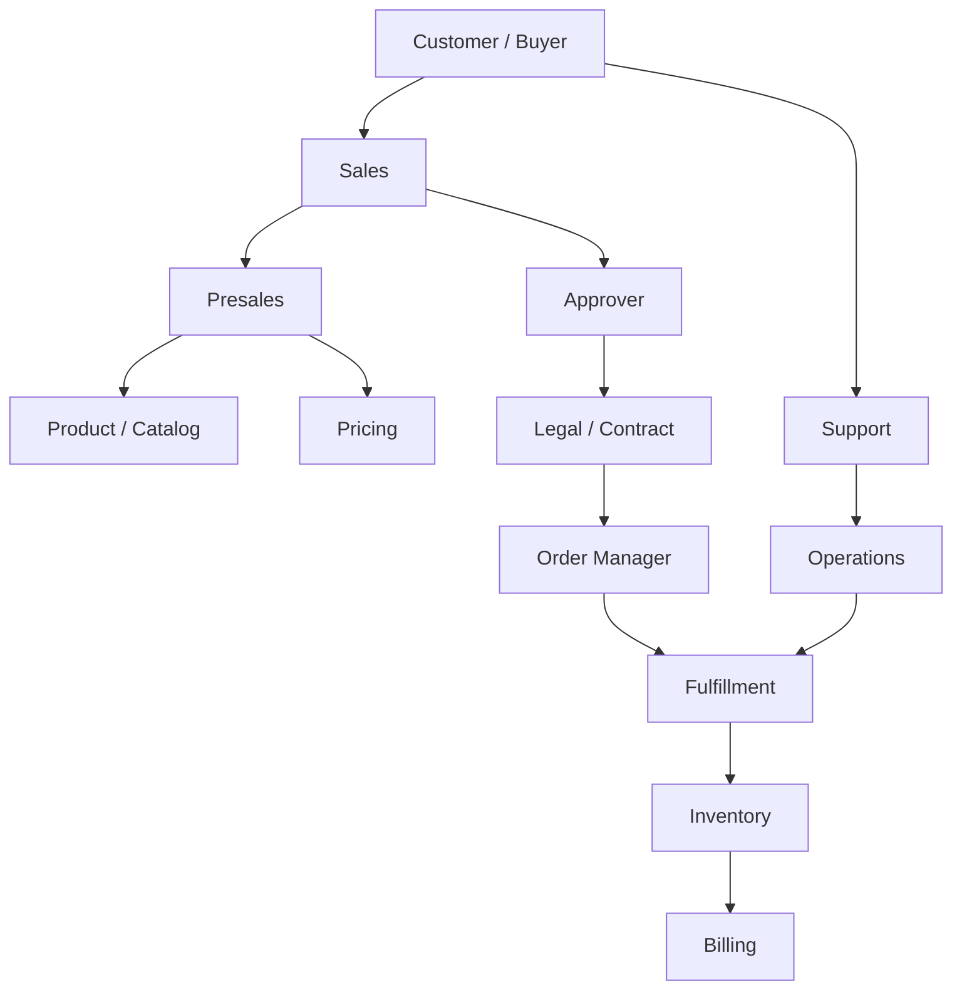

# Part 002 — Customer Intent, Commercial Actors, and End-to-End Value Flow

## Positioning

Domain architecture tidak dapat dibangun hanya dari entity dan service.

Ia harus dimulai dari:

- siapa yang mencoba mencapai outcome;
- keputusan apa yang mereka buat;
- informasi apa yang mereka perlukan;
- handoff apa yang terjadi;
- dan risiko apa yang muncul sepanjang flow.

> **Core thesis:** commercial lifecycle adalah network of decisions and commitments. Actor map yang baik menjelaskan siapa yang meminta, mengusulkan, menghitung, menyetujui, menerima, mengeksekusi, mengoperasikan, dan mempertanggungjawabkan setiap tahap.

---

## 1. Why Actors Matter

Tanpa actor clarity, sistem sering memiliki:

- permissions yang terlalu luas;
- state transition tanpa owner;
- approval yang ambigu;
- UI yang berorientasi database;
- duplicate workflow;
- dan escalation tanpa decision authority.

Actor bukan hanya user role.

Actor dapat berupa:

- manusia;
- organisasi;
- external system;
- automated policy;
- atau operational function.

---

## 2. Actor versus Persona versus Role

### Actor

Entitas yang berinteraksi dengan system.

### Persona

Representasi user dengan goal dan behavior tertentu.

### Role

Kumpulan authority atau responsibility.

Satu person dapat memiliki beberapa role.

Satu role dapat dimainkan oleh banyak actor.

---

## 3. Party versus User

A **party** dapat berupa:

- individual;
- organization;
- customer;
- partner;
- supplier.

A **user** adalah identity yang mengakses system.

Jangan menganggap user identity sama dengan legal or commercial party.

---

## 4. Commercial Value Flow

A representative flow:


Setiap tahap memiliki actor, decision, artifact, dan risk.

---

## 5. Customer Intent

Customer intent dapat berupa:

- buy new product;
- change existing product;
- expand;
- renew;
- terminate;
- move;
- add site;
- upgrade;
- downgrade;
- or request information.

Intent sebaiknya tidak langsung diterjemahkan menjadi implementation task.

---

## 6. Commercial Intent versus Requested Action

Example:

> Customer wants faster connectivity at 20 branches.

Possible commercial interpretation:

- upgrade existing products;
- replace products;
- add services;
- change contract;
- or create new site orders.

Intent requires qualification and design.

---

## 7. Primary Actor Categories

Representative categories:

1. Customer.
2. Sales.
3. Presales / solution consultant.
4. Product or catalog owner.
5. Pricing owner.
6. Approver.
7. Legal / contract.
8. Partner / reseller.
9. Order manager.
10. Fulfillment operations.
11. Billing / finance.
12. Support / customer care.
13. Platform administrator.
14. Security / compliance.
15. External systems.

---

## 8. Customer

Customer goals:

- understand offer;
- receive valid price;
- compare options;
- negotiate;
- accept;
- track delivery;
- and receive accurate bill.

Customer risks:

- unclear product;
- hidden dependency;
- price drift;
- delayed delivery;
- and billing mismatch.

---

## 9. Customer Buyer

The buyer may focus on:

- budget;
- terms;
- approval;
- and purchase commitment.

The buyer may not be the technical consumer.

---

## 10. Customer Technical Stakeholder

May care about:

- compatibility;
- site feasibility;
- security;
- implementation;
- and migration.

Their input may affect configuration but not commercial authority.

---

## 11. Customer Signatory

A signatory has legal or delegated authority to accept.

The system may need evidence of:

- identity;
- role;
- authority;
- time;
- and accepted revision.

---

## 12. Sales Representative

Sales goals:

- progress opportunity;
- create valid offer;
- negotiate;
- and close deal.

Sales needs:

- guidance;
- explainable configuration;
- price visibility;
- approval status;
- and customer-ready output.

Risk:

- bypassing validation to meet deadline.

---

## 13. Account Manager

An account manager may own:

- customer relationship;
- account strategy;
- renewal;
- and escalation.

They may not own technical configuration.

---

## 14. Presales or Solution Consultant

Presales may:

- translate need;
- design solution;
- validate feasibility;
- and coordinate specialists.

Their work often spans:

- commercial;
- technical;
- and customer communication boundaries.

---

## 15. Product Manager or Product Owner

Potential responsibilities:

- offering strategy;
- market scope;
- product lifecycle;
- backlog;
- and commercial policy.

Do not confuse software Product Owner with catalog product owner automatically.

---

## 16. Catalog Manager

Catalog manager may own:

- offering definition;
- lifecycle;
- characteristics;
- relationships;
- eligibility metadata;
- and publication.

They should not necessarily approve every individual quote.

---

## 17. Pricing Manager

Pricing owner may define:

- base price;
- price list;
- discount policy;
- effective period;
- and market/channel rules.

A pricing engine executes policy.

It does not invent commercial authority.

---

## 18. Commercial Approver

Approver evaluates exception such as:

- discount;
- margin;
- non-standard term;
- product exception;
- or delivery commitment.

Approval needs:

- evidence;
- scope;
- decision;
- and reason.

---

## 19. Legal or Contract Actor

Legal may own:

- clause;
- agreement template;
- exceptional term;
- signature policy;
- and regulatory language.

Legal approval is distinct from price approval.

---

## 20. Partner or Reseller

A partner may:

- configure;
- request price;
- receive wholesale price;
- apply markup;
- submit order;
- or manage customer.

Partner models require clear separation among:

- supplier;
- reseller;
- end customer;
- bill-to;
- and service user.

---

## 21. Channel Actor

Channel can affect:

- eligibility;
- price;
- product visibility;
- approval;
- document;
- and commission.

Channel is often part of pricing and catalog context.

---

## 22. Order Manager

Order manager may:

- validate readiness;
- coordinate order;
- resolve fallout;
- manage change;
- and communicate progress.

They may operate after sales handoff.

---

## 23. Fulfillment Orchestrator

An automated actor may:

- decompose;
- sequence;
- dispatch;
- wait;
- retry;
- and aggregate state.

Automation still needs explicit ownership and observability.

---

## 24. Fulfillment Specialist

Human fulfillment roles may:

- complete manual tasks;
- resolve exception;
- enter external result;
- and approve progression.

Manual step should be modeled as first-class state, not hidden comment.

---

## 25. Inventory Owner

Inventory actor ensures:

- installed state;
- identifiers;
- lifecycle;
- and reconciliation.

Inventory should not be inferred only from order completion.

---

## 26. Billing or Finance Actor

Billing/finance goals:

- activate correct charge;
- preserve term;
- invoice accurately;
- and reconcile revenue.

They need commercial provenance.

---

## 27. Revenue Assurance

Revenue assurance may detect:

- missing charge;
- wrong discount;
- unbilled active service;
- duplicate charge;
- or order/inventory/billing mismatch.

Their findings are architecture evidence.

---

## 28. Support or Customer Care

Support needs:

- end-to-end lookup;
- understandable state;
- reason code;
- event timeline;
- workaround;
- and safe escalation.

Support should not need database archaeology for routine diagnosis.

---

## 29. Operations or SRE

Operations may own:

- runtime health;
- incident response;
- capacity;
- observability;
- and recovery.

They need both technical and business signals.

---

## 30. Platform Administrator

Administrator may configure:

- tenant;
- role;
- workflow;
- catalog publication;
- integration endpoint;
- and operational override.

Administrative capability has high blast radius.

---

## 31. Security and Compliance

These actors may define:

- access control;
- separation of duties;
- retention;
- audit;
- privacy;
- and exception process.

They are not merely reviewers at the end.

---

## 32. External System as Actor

Examples:

- CRM creates quote request;
- tax service returns tax;
- serviceability checks location;
- billing consumes charge;
- inventory publishes installed product;
- partner system submits order.

External systems have:

- authority;
- availability;
- latency;
- and failure behavior.

---

## 33. Automated Policy as Actor

A policy engine may decide:

- eligibility;
- approval route;
- validation;
- or discount cap.

The system must explain:

- policy version;
- input;
- output;
- and reason.

---

## 34. Actor Goals Matrix

| Actor | Primary Goal | Needed Evidence |
|---|---|---|
| Sales | Produce acceptable offer | Valid configuration and price |
| Approver | Control exception | Margin, policy, reason |
| Customer | Understand and accept | Proposal, terms, validity |
| Order Manager | Execute accepted intent | Order readiness and lineage |
| Fulfillment | Complete work | Decomposition and dependencies |
| Billing | Activate correct charges | Price and effective-date provenance |
| Support | Diagnose and recover | Timeline, state, reason, correlation |

---

## 35. Decision Rights

For every decision, identify:

- proposer;
- recommender;
- approver;
- executor;
- and accountable owner.

Example:

```text
Discount exception:
Proposer = Sales
Evidence provider = Pricing / Margin
Approver = Commercial authority
Executor = Quote domain
Audit owner = Commercial governance
```

---

## 36. Responsibility versus Authority

A person may be responsible for preparing a quote but not authorized to:

- override price;
- accept on behalf of customer;
- release order;
- or repair production state.

Avoid bundling all capabilities into one “admin” role.

---

## 37. Separation of Duties

Examples:

- person requesting discount should not approve it;
- support may diagnose but not modify price;
- sales may prepare proposal but not impersonate signatory;
- operations may retry but not change commercial terms.

---

## 38. RACI-Like View

A lightweight matrix:

| Capability | Responsible | Accountable | Consulted | Informed |
|---|---|---|---|---|
| Catalog publication | Catalog admin | Product owner | Pricing, engineering | Sales |
| Discount approval | Approver | Commercial owner | Sales, finance | Customer team |
| Order recovery | Operations | Service owner | Support, engineering | Customer care |

Internal authority must be verified.

---

## 39. State Transition Ownership

For each transition:

```text
Current state:
Command:
Actor:
Required authority:
Guard:
Evidence:
Resulting event:
```

Example:

```text
Current: READY_FOR_ACCEPTANCE
Command: AcceptQuote
Actor: Customer signatory
Authority: Accepted party role
Guard: Quote valid and latest revision
Evidence: Identity, timestamp, channel
Event: QuoteAccepted
```

---

## 40. Human versus System Decision

Human decision examples:

- approve exception;
- accept terms;
- authorize cancellation.

System decision examples:

- configuration valid;
- eligibility passed;
- timeout elapsed;
- duplicate detected.

Do not hide human accountability behind automation.

---

## 41. Value Stream versus Process Flow

### Process flow

Sequence of activities.

### Value stream

Flow from demand to customer outcome, including:

- wait;
- rework;
- decision;
- and feedback.

Value-stream analysis reveals non-value-added delay.

---

## 42. Value-Adding Work

Examples:

- clarifying need;
- selecting valid product;
- producing accurate price;
- resolving commercial exception;
- delivering service.

---

## 43. Necessary Non-Value-Adding Work

Examples:

- regulatory approval;
- audit;
- security validation;
- mandatory customer documentation.

These should be efficient, not ignored.

---

## 44. Pure Waste

Examples:

- duplicate entry;
- rekeying data;
- waiting for unclear owner;
- repeated approval due to missing scope;
- and manual reconciliation caused by missing lineage.

---

## 45. Representative Value Stream

| Stage | Artifact | Decision | Common Wait |
|---|---|---|---|
| Discover | Need/opportunity | Is there a viable offer? | SME availability |
| Qualify | Qualification result | Can this customer buy it? | External feasibility |
| Configure | Configuration | Is the solution valid? | Rule ambiguity |
| Price | Price result | Is price complete? | Missing context |
| Approve | Approval request | Is exception acceptable? | Authority queue |
| Present | Proposal | Is offer understandable? | Document generation |
| Accept | Acceptance evidence | Is commitment binding? | Customer/legal |
| Order | Product order | Is intent executable? | Readiness |
| Fulfill | Execution plan | Can work complete? | Dependency |
| Bill | Charge activation | Is revenue correct? | Reconciliation |

---

## 46. Handoff

A handoff occurs when ownership or working context changes.

Examples:

- sales to presales;
- quote to approval;
- commercial to order management;
- order to fulfillment;
- fulfillment to support;
- activation to billing.

Every handoff risks information loss.

---

## 47. Handoff Contract

A healthy handoff defines:

```text
What is transferred?
What is still owned by sender?
What evidence is required?
Who accepts the handoff?
What is incomplete?
What happens if rejected?
```

---

## 48. Commercial-to-Order Handoff

Must communicate:

- accepted revision;
- parties;
- items;
- price/term snapshot;
- requested dates;
- qualification;
- agreement reference;
- and exceptions.

---

## 49. Order-to-Fulfillment Handoff

Must communicate:

- requested actions;
- dependencies;
- product/service intent;
- target sites;
- milestones;
- and recovery semantics.

Do not force fulfillment to reverse-engineer the proposal document.

---

## 50. Fulfillment-to-Inventory Handoff

Must communicate:

- realized product/service;
- identifiers;
- effective state;
- variance;
- and lineage.

---

## 51. Inventory-to-Billing Handoff

May communicate:

- activation;
- effective date;
- quantity;
- chargeable status;
- and product/account reference.

The exact billing trigger is product-specific.

---

## 52. Handoff Smells

- email attachment as source of truth;
- free-text reason;
- copied spreadsheet;
- no receiver acknowledgement;
- hidden assumptions;
- and state change without event.

---

## 53. Waiting

Common waiting sources:

- customer response;
- approval;
- qualification;
- contract review;
- environment;
- downstream capacity;
- and manual task.

Waiting should be visible as business state where material.

---

## 54. Rework

Common causes:

- wrong product;
- stale price;
- missing characteristic;
- invalid approval;
- contract mismatch;
- order decomposition gap;
- and downstream rejection.

Track where rework originates, not only where detected.

---

## 55. Feedback Loops

Useful feedback:

- configuration failure -> catalog improvement;
- repeated discount exception -> pricing policy review;
- order fallout -> quote readiness improvement;
- billing mismatch -> price handoff correction;
- support confusion -> observability improvement.

---

## 56. Actor-Oriented Use Cases

Use-case format:

```text
Actor:
Goal:
Precondition:
Command:
Business rules:
Success:
Failure:
Evidence:
Next owner:
```

---

## 57. Sales Use Case

### Goal

Create a commercially valid quote.

### Needs

- customer context;
- eligible offering;
- configuration guidance;
- price;
- approval status;
- proposal.

### Failure

- no serviceability;
- price incomplete;
- approval pending;
- stale catalog.

---

## 58. Approver Use Case

### Goal

Accept or reject exception.

### Needs

- requested exception;
- policy threshold;
- margin/impact;
- history;
- reason;
- and authority scope.

### Failure

- missing evidence;
- expired authority;
- changed quote revision.

---

## 59. Customer Use Case

### Goal

Review and accept offer.

### Needs

- clear scope;
- price;
- terms;
- validity;
- and acceptance channel.

### Failure

- wrong revision;
- expired offer;
- unauthorized signer.

---

## 60. Order Manager Use Case

### Goal

Turn accepted commitment into executable order.

### Needs

- immutable accepted revision;
- readiness;
- traceability;
- requested date;
- and downstream contract.

### Failure

- duplicate conversion;
- missing mapping;
- incomplete qualification.

---

## 61. Support Use Case

### Goal

Explain why order is delayed.

### Needs

- current stage;
- age;
- dependency;
- reason;
- owner;
- and next action.

### Failure

- generic “IN_PROGRESS” state;
- missing correlation;
- no timeline.

---

## 62. Actor Map Diagram



Use this only as a starting point.

---

## 63. Actor-to-Context Matrix

| Actor | Catalog | Configure | Price | Quote | Approval | Order | Fulfillment | Inventory | Billing |
|---|---|---|---|---|---|---|---|---|---|
| Sales | Read | Operate | Request | Own workflow | Request | View | View | View | View |
| Approver | Read | Read | Inspect | Decide | Operate | View | — | — | — |
| Customer | Browse | Provide input | View | Review/accept | — | Track | Track | View | View |
| Support | Read | Diagnose | Diagnose | Diagnose | View | Diagnose | Diagnose | View | View |
| Operations | — | — | — | Diagnose | — | Recover | Operate | Reconcile | Diagnose |

Actual permissions must be verified.

---

## 64. Permission Model

Permission should reflect:

- tenant;
- party;
- role;
- object ownership;
- lifecycle state;
- field sensitivity;
- and delegated authority.

Simple role-only access may be insufficient.

---

## 65. Field-Level Visibility

Sensitive fields may include:

- cost;
- margin;
- internal discount reason;
- credit status;
- personal data;
- and operational notes.

Customer-facing document should not expose internal data accidentally.

---

## 66. Delegated Authority

Delegation needs:

- delegator;
- delegate;
- scope;
- effective period;
- and audit.

Avoid permanent elevated role for temporary approval needs.

---

## 67. Partner Delegation

Partner users may act for:

- reseller;
- end customer;
- or both.

Party context must be explicit to prevent data leakage.

---

## 68. Impersonation and Support Access

Support impersonation has high risk.

Need:

- purpose;
- authorization;
- banner;
- limited scope;
- audit;
- and no silent customer action.

---

## 69. Lifecycle Metrics by Actor

Possible measures:

- time waiting for customer;
- approval latency;
- quote revision count;
- order-fallout queue;
- support diagnosis time;
- and manual correction frequency.

Metrics should improve system, not rank individuals.

---

## 70. Customer Experience Metrics

Examples:

- time to valid quote;
- time to accepted quote;
- quote accuracy;
- order visibility;
- time to activation;
- first-bill correctness.

---

## 71. Commercial Metrics

Examples:

- conversion rate;
- discount exception rate;
- margin leakage;
- expired quote rate;
- and reapproval frequency.

These need careful context.

---

## 72. Operational Metrics

Examples:

- order fallout rate;
- stuck order age;
- retry count;
- manual intervention;
- reconciliation mismatch;
- and billing activation delay.

---

## 73. Value-Stream Bottlenecks

Potential bottlenecks:

- product qualification;
- pricing performance;
- approval queue;
- contract review;
- document generation;
- order conversion;
- fulfillment dependency;
- and manual reconciliation.

---

## 74. Actor Ambiguity Smells

- “business user” used for every person;
- system account treated as customer;
- sales can approve own exception;
- support can edit accepted quote;
- approver authority not scoped;
- customer and bill payer conflated;
- and partner acts without party context.

---

## 75. Value-Flow Smells

- quote generated before configuration valid;
- acceptance allowed on stale revision;
- order created before agreement ready;
- fulfillment starts without order acknowledgement;
- billing starts without activation evidence;
- and support receives no handoff.

---

## 76. Decision Smells

- decision exists only in email;
- no decision owner;
- approval is generic “approved”;
- no reason;
- no policy version;
- and changed quote retains old approval.

---

## 77. Experience Smells

- user must know internal service names;
- error says only “validation failed”;
- multiple screens show different totals;
- customer cannot identify accepted revision;
- and support cannot explain next step.

---

## 78. Architecture Failure Modes from Actor Confusion

### Unauthorized commitment

Wrong person accepts or approves.

### Lost accountability

System decision has no policy owner.

### Hidden manual work

Operator action is not modeled.

### Duplicate ownership

Sales and order manager both mutate order intent.

### Broken customer context

End customer, account, partner, and bill payer are conflated.

---

## 79. Actor Mapping Workshop

Participants:

- Product;
- Sales/Presales;
- engineering;
- support;
- operations;
- pricing;
- order management;
- and downstream representative.

Activities:

1. List actors.
2. List goals.
3. List decisions.
4. List artifacts.
5. Map handoffs.
6. Mark waits and rework.
7. Assign ownership.
8. Record internal unknowns.

---

## 80. Value-Stream Mapping Template

```md
## Customer Need

## Stages

For each stage:
- Actor
- Input
- Decision
- Artifact
- Active time
- Wait time
- Failure
- Next owner

## Bottlenecks

## Rework Loops

## Missing Evidence

## Improvement Hypotheses
```

---

## 81. Actor Record Template

```md
## Actor

## Party / User / System Type

## Goals

## Responsibilities

## Decisions

## Permissions

## Data Visibility

## Commands

## Events Consumed

## Handoffs

## Failure and Escalation
```

---

## 82. Decision Record Template

```text
Decision:
Decision owner:
Proposer:
Required evidence:
Authority scope:
Policy/version:
Outcome:
Reason:
Effective time:
Affected lifecycle state:
Audit reference:
```

---

## 83. Handoff Record Template

```text
Sender:
Receiver:
Transferred artifact:
Required evidence:
Acceptance condition:
Rejected handoff behavior:
Owner after acceptance:
Timeout/escalation:
```

---

## 84. Senior Engineer Contribution

A senior engineer should:

- distinguish actor from role and party;
- expose missing authority;
- map handoffs;
- identify information loss;
- connect state transition to accountable actor;
- make manual work visible;
- and design supportability into lifecycle.

---

## 85. Questions for Sales and Presales

```text
What information is repeatedly re-entered?
Where do quotes wait?
Which product rules are unclear?
What exceptions occur most?
Which downstream rejection surprises you?
```

---

## 86. Questions for Product and Catalog Owners

```text
Who owns offering semantics?
How are lifecycle changes communicated?
Which customer variations are product versus customization?
What recurring quote failure indicates catalog gaps?
```

---

## 87. Questions for Approvers

```text
What evidence is often missing?
Which exceptions are routine?
How is authority delegated?
What changes require reapproval?
What latency is acceptable?
```

---

## 88. Questions for Order and Fulfillment Teams

```text
Which quote data is insufficient?
What causes fallout?
Which mapping is ambiguous?
What customer promise is hard to execute?
How is partial completion handled?
```

---

## 89. Questions for Billing and Finance

```text
What creates billed-versus-quoted mismatch?
Which effective dates are unclear?
What discount semantics are lost?
How are revenue leaks detected?
```

---

## 90. Questions for Support

```text
What can you not diagnose?
Which state names are meaningless?
What manual correction is common?
What customer question is hardest to answer?
```

---

## 91. Worked Example: Discount Approval

### Actors

- Sales requests discount.
- Pricing calculates result.
- Commercial approver evaluates exception.
- Quote records decision.
- Customer sees final price.
- Finance later reconciles billed outcome.

### Invariants

- requester cannot self-approve;
- decision applies to a specific quote revision;
- change to price-relevant field invalidates approval;
- reason and authority are auditable.

---

## 92. Worked Example: Multi-Site Order

### Actors

- Customer provides 20 sites.
- Presales designs solution.
- Qualification checks serviceability.
- Pricing computes volume effect.
- Approver handles exception.
- Customer accepts.
- Order manager converts.
- Fulfillment processes each site.
- Support tracks partial progress.
- Billing activates per agreed policy.

### Architecture implication

Order-level state alone is insufficient.

---

## 93. Worked Example: Partner Sale

### Parties

- Supplier.
- Reseller.
- End customer.
- Bill-to party.
- Service user.

### Risks

- wrong price visibility;
- tenant leakage;
- incorrect acceptance authority;
- unclear support ownership.

---

## 94. Worked Example: Support Recovery

Customer reports order stuck.

Support needs:

- quote reference;
- order reference;
- current item;
- last event;
- downstream dependency;
- owner;
- and safe action.

A generic error code is not enough.

---

## 95. Internal Verification Checklist

### Actors

- Who creates quotes?
- Who configures complex solutions?
- Who prices?
- Who approves?
- Who accepts?
- Who creates or releases orders?
- Who resolves fallout?
- Who corrects data?

### Authority

- What roles exist?
- Are they tenant-scoped?
- Is delegated authority supported?
- Is separation of duties enforced?
- What actions require dual control?

### Parties

- How are customer, account, partner, bill payer, and service user represented?
- Can one quote involve multiple parties?
- How is signatory authority verified?

### Handoffs

- Sales to order?
- Order to fulfillment?
- Fulfillment to inventory?
- Inventory to billing?
- Operations to support?
- What evidence is mandatory?

### Metrics

- Time to valid quote?
- Approval latency?
- Rework count?
- Fallout age?
- Billing mismatch?
- Support diagnosis time?

### Tooling

- Which workflow is represented in UI?
- Which manual steps exist outside the platform?
- Which decisions live in email/chat?
- Which spreadsheets remain authoritative?

---

## 96. Practical Exercises

### Exercise 1 — Actor map

List every human and system actor for one product lifecycle.

### Exercise 2 — Decision rights

Map ten decisions to proposer, approver, executor, and accountable owner.

### Exercise 3 — Value stream

Measure active time and wait time from need to accepted order.

### Exercise 4 — Handoff audit

Choose three handoffs and define acceptance criteria.

### Exercise 5 — Role risk

Find permissions that exceed business responsibility.

### Exercise 6 — Support journey

Trace how support diagnoses one stuck order without direct database access.

---

## 97. Part Completion Checklist

You are done if you can:

- distinguish actor, persona, role, party, and user;
- map the commercial value stream;
- identify decision rights;
- connect transitions to accountable actors;
- make handoffs and waiting visible;
- separate human and automated decisions;
- define support and operational actors;
- identify separation-of-duties requirements;
- detect actor ambiguity;
- and create an internal verification interview plan.

---

## 98. Key Takeaways

1. Commercial lifecycle is a network of decisions and commitments.
2. Actor is not the same as user or party.
3. Authority must be explicit.
4. Human and automated decisions need evidence.
5. Handoffs are major sources of delay and information loss.
6. Customer, partner, bill payer, and service user may be different parties.
7. Support and operations are first-class actors.
8. Value-stream analysis must include waiting and rework.
9. State transitions should identify who can cause them.
10. Internal actor and authority models must be verified.

---

## 99. References

Conceptual baseline:

- General B2B CPQ, Quote-to-Order, Quote-to-Cash, and telecom commercial-lifecycle practices.
- Domain-Driven Design actor, context, aggregate, and ubiquitous-language concepts.
- Value-stream mapping, responsibility mapping, separation-of-duties, and enterprise authorization practices.
- TM Forum party, customer, catalog, quote, product-order, inventory, and agreement vocabulary.

These references do not describe internal CSG workflows or authority structures.
