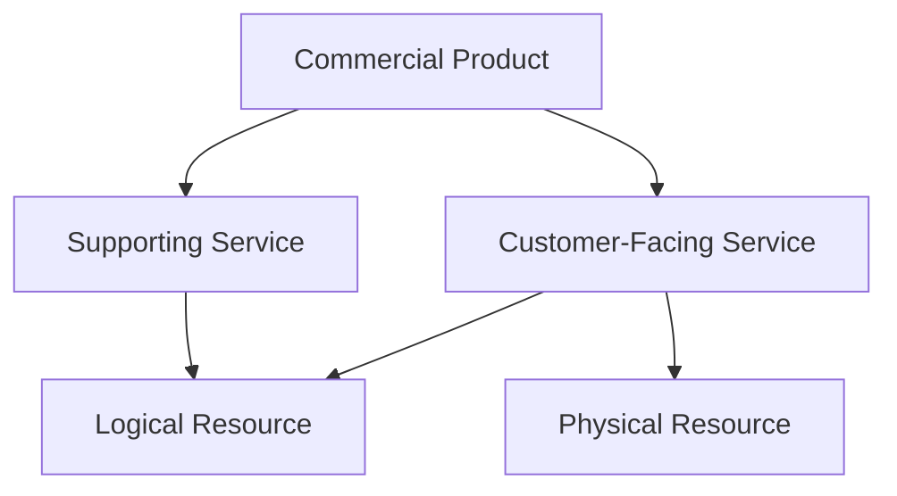

# Part 005 — Commercial Product, Service Realization, Resource Realization, and Decomposition Boundaries

## Positioning

Customer membeli commercial outcome.

Mereka tidak selalu membeli:

- workflow task;
- network command;
- database record;
- inventory row;
- atau provisioning script.

Dalam enterprise CPQ dan telecom BSS/OSS, satu commercial product dapat direalisasikan oleh:

- beberapa services;
- beberapa resources;
- partner capability;
- manual fulfillment;
- dan long-running orchestration.

> **Core thesis:** quote dan product order harus menyatakan commercial intent secara cukup presisi untuk dieksekusi, tetapi tidak boleh terikat berlebihan pada detail realization downstream yang dapat berubah secara independen.

---

## 1. Commercial Intent

Commercial intent menjawab:

```text
What has the customer chosen?
Under what terms?
For which party, site, quantity, and period?
What outcome is promised?
```

Contoh:

> Provide managed connectivity for 20 branches with 100 Mbps minimum bandwidth and 24-month term.

Ini belum menentukan semua technical implementation.

---

## 2. Technical Realization

Technical realization menjawab:

```text
How will the commercial promise be delivered?
Which services must exist?
Which resources must be allocated?
Which tasks must execute?
Which dependencies must complete?
```

Contoh realization:

- access circuit;
- managed router;
- SD-WAN configuration;
- installation appointment;
- activation;
- and monitoring setup.

---

## 3. Commercial Product

A Commercial Product is a customer-facing proposition.

It may express:

- benefit;
- characteristics;
- service level;
- price;
- term;
- and commercial conditions.

It should avoid unnecessary resource-level details.

---

## 4. Service Realization

A Service represents logical behavior or capability that realizes a product.

Examples:

- internet access;
- managed WAN;
- voice service;
- security service;
- support service.

One commercial product may map to multiple services.

---

## 5. Resource Realization

Resources are physical or logical assets enabling services.

Examples:

- device;
- port;
- circuit;
- IP allocation;
- virtual network;
- compute capacity;
- credential;
- license.

Resources may be shared across products or services.

---

## 6. Product–Service–Resource Layers



This is a conceptual reference, not a mandatory implementation.

---

## 7. Why Separation Matters

Separation allows:

- commercial evolution without reworking every downstream detail;
- technical modernization without changing customer offer;
- alternate fulfillment strategies;
- multi-vendor realization;
- and cleaner ownership.

---

## 8. Coupling Smell

A quote item stores:

- router model;
- port number;
- VLAN;
- installer task;
- billing job ID;
- and activation script name.

This indicates commercial model is coupled to execution details.

---

## 9. Under-Specification Smell

The opposite failure:

> Provide connectivity.

No bandwidth, site, term, service level, or commercial constraints exist.

Downstream must guess.

A good boundary contains enough intent, not all implementation.

---

## 10. Intent Completeness

Commercial intent may need:

- product/offering identity;
- selected characteristics;
- quantity;
- site/place;
- requested dates;
- party/account;
- term;
- service level;
- and accepted conditions.

---

## 11. Realization Completeness

Technical realization may need:

- service design;
- resource requirements;
- dependencies;
- tasks;
- sequence;
- capacity;
- and recovery behavior.

---

## 12. Commercial Invariants

Representative invariants:

- accepted characteristics cannot silently change during fulfillment;
- commercial quantity must map to execution quantity;
- customer, site, and term remain traceable;
- price-relevant attributes preserve provenance;
- and order intent does not infer unsupported implementation detail.

---

## 13. Realization Invariants

Representative invariants:

- every required service/resource is owned;
- dependencies form an executable graph;
- realization can be traced back to product order item;
- technical variance is recorded;
- and completion evidence exists.

---

## 14. Product Specification versus Service Specification

### Product Specification

Defines commercial-facing structure.

### Service Specification

Defines service behavior.

A Product Specification can map to one or more Service Specifications.

---

## 15. Service Specification versus Resource Specification

A Service Specification may require:

- capacity;
- endpoint;
- availability;
- and performance.

Resource Specifications define what technical assets can satisfy those needs.

---

## 16. Product Offering versus Service Offering

A Product Offering is sellable.

A Service Offering may be:

- an internal service construct;
- or a commercial term in another context.

Use context-qualified vocabulary.

---

## 17. Commercial Characteristic

Examples:

- bandwidth tier;
- contract term;
- support level;
- site count;
- installation option.

---

## 18. Technical Characteristic

Examples:

- VLAN ID;
- router model;
- protocol;
- port;
- internal topology.

Some technical characteristics may be customer-visible.

The boundary is based on commercial meaning, not whether the field sounds technical.

---

## 19. Derived Technical Characteristic

A commercial selection may derive technical values.

Example:

```text
Commercial:
Premium managed service

Derived:
Dual access path required
24x7 monitoring enabled
High-availability router class
```

The derivation should be explicit and versioned.

---

## 20. Commercial-to-Service Mapping

A mapping may use:

- static rules;
- catalog relationships;
- templates;
- decision tables;
- rule engine;
- or design service.

---

## 21. Service-to-Resource Mapping

Resource selection may depend on:

- location;
- capacity;
- vendor;
- inventory;
- topology;
- and runtime availability.

This often belongs downstream of commercial quote.

---

## 22. Decomposition

Decomposition transforms a parent intent into child intents or work units.

Examples:

```text
Product Order Item
-> Service Order Items
-> Resource Order Items
-> Fulfillment Tasks
```

---

## 23. Decomposition Boundary

Possible boundaries:

- in Quote & Order;
- in Product Order Management;
- in a dedicated orchestrator;
- in Service Order Management;
- in domain-specific fulfillment systems.

No single answer is universally correct.

---

## 24. Early Decomposition

Decomposing during quote may help:

- feasibility;
- cost;
- lead-time estimate;
- and risk analysis.

Risks:

- technical model becomes stale;
- quote depends on downstream availability;
- and sales flow slows.

---

## 25. Late Decomposition

Decomposing after order creation supports:

- simpler quote;
- current technical data;
- and downstream autonomy.

Risks:

- order fallout after commercial acceptance;
- lead-time uncertainty;
- and hidden infeasibility.

---

## 26. Hybrid Decomposition

A hybrid model performs:

- commercial feasibility during quote;
- executable decomposition after acceptance.

It preserves early risk detection without freezing all technical detail.

---

## 27. Feasibility versus Design

### Feasibility

Can the intent likely be delivered?

### Design

How exactly will it be delivered?

A quote may require feasibility without full design.

---

## 28. Qualification versus Decomposition

Qualification may answer:

- eligible;
- serviceable;
- possible;
- conditionally possible.

Decomposition creates execution structure.

Do not conflate them.

---

## 29. Product Configuration versus Service Design

Product configuration selects commercial options.

Service design chooses technical realization.

They may share data but have different owners.

---

## 30. Product Model Leakage

Leakage occurs when commercial product includes every downstream attribute.

Consequences:

- large catalog;
- customer-specific forks;
- frequent coordinated changes;
- and poor explainability.

---

## 31. Fulfillment Leakage into Quote

Examples:

- task IDs in quote;
- provisioning states in quote status;
- resource allocation before acceptance;
- and workflow engine details in proposal.

---

## 32. Commercial Leakage into Fulfillment

The opposite issue:

- fulfillment must interpret discount;
- proposal template controls technical sequence;
- legal clause determines code path implicitly.

Translate commercial facts into explicit execution constraints.

---

## 33. Intent Translation

A translation layer may create:

```text
Commercial intent
-> normalized product-order intent
-> service intent
-> resource intent
```

Each step should preserve lineage.

---

## 34. Anti-Corruption Layer

An anti-corruption layer protects one context from another's model.

Example:

```text
QuoteProductSelection
-> ProductOrderItem
```

The transformation should be:

- explicit;
- tested;
- and versioned.

---

## 35. Mapping Table

| Commercial Fact | Realization Interpretation |
|---|---|
| Premium resilience | Redundant access design |
| 100 Mbps minimum | Capacity constraint |
| 24x7 support | Support-service activation |
| Install before date | Fulfillment deadline |
| Managed router | Device + management service |

---

## 36. One-to-One Mapping

One product maps to one service.

Simple, but uncommon for complex enterprise solutions.

---

## 37. One-to-Many Mapping

One product maps to multiple services/resources.

Example:

```text
Managed Connectivity
-> Access Service
-> Managed CPE Service
-> Monitoring Service
```

---

## 38. Many-to-One Mapping

Several commercial products share one service/resource.

Example:

- multiple add-ons use one customer access service.

This complicates cancellation and ownership.

---

## 39. Many-to-Many Mapping

Complex bundles may share and combine services.

Need:

- explicit lineage;
- allocation;
- and lifecycle rules.

---

## 40. Shared Resource

A resource may serve multiple products.

Questions:

- Who owns lifecycle?
- What happens when one product terminates?
- How is capacity allocated?
- How is cost shared?

---

## 41. Customer-Facing Service

A customer-facing service directly contributes to promised outcome.

Examples:

- VPN service;
- voice service;
- cloud connectivity.

---

## 42. Resource-Facing Service

A resource-facing service manages technical capability.

Examples:

- device management;
- network tunnel;
- access bearer.

Vocabulary must be local and explicit.

---

## 43. Composite Product

A composite product contains multiple commercial components.

It may be:

- fixed bundle;
- configurable bundle;
- solution;
- or package.

Decomposition may preserve or flatten composition.

---

## 44. Atomic Product Myth

A product may appear atomic commercially but be complex technically.

Do not equate customer simplicity with implementation simplicity.

---

## 45. Technical Product Myth

Avoid exposing every technical capability as a sellable product.

A resource option is not automatically a commercial offering.

---

## 46. Commercial Abstraction

A commercial abstraction should be:

- stable;
- understandable;
- contractible;
- and independently valuable.

---

## 47. Realization Strategy

A realization strategy can vary by:

- geography;
- partner;
- technology;
- customer;
- installed base;
- and capacity.

The same product may have several strategies.

---

## 48. Strategy Selection

Inputs may include:

- site;
- serviceability;
- customer policy;
- existing assets;
- vendor availability;
- and requested date.

---

## 49. Realization Version

A realization plan should reference:

- mapping/rule version;
- catalog version;
- and relevant technical context.

This supports reproducibility.

---

## 50. Design-Time versus Run-Time Mapping

### Design-time

Mapping defined before order.

### Run-time

Mapping chosen dynamically based on current state.

Runtime flexibility adds operational complexity.

---

## 51. Catalog-Driven Decomposition

Catalog may encode:

- product-to-service relationships;
- service-to-resource relationships;
- and fulfillment templates.

Benefits:

- configuration-driven evolution.

Risks:

- opaque runtime behavior;
- complex publication;
- and rule conflicts.

---

## 52. Code-Driven Decomposition

Code may define mapping.

Benefits:

- strong typing;
- testing;
- and code review.

Risks:

- slower product change;
- frequent deployment;
- and customer-specific branching.

---

## 53. Rule-Driven Decomposition

Rule engine can select realization.

Need:

- determinism;
- explanation;
- versioning;
- and testability.

---

## 54. Workflow-Driven Decomposition

Workflow may create tasks dynamically.

Do not let workflow become source of product semantics without governance.

---

## 55. Decomposition Output

A decomposition output should contain:

- child intents;
- relationships;
- dependencies;
- source mapping;
- and conditions.

---

## 56. Decomposition Idempotency

Repeating decomposition should not create duplicate child orders.

Use:

- parent identity;
- decomposition version;
- and unique child keys.

---

## 57. Re-Decomposition

Re-decomposition may be required when:

- order amended;
- feasibility changed;
- downstream capability changed;
- or prior decomposition failed.

Need lineage and invalidation policy.

---

## 58. Decomposition Drift

Drift occurs when the same commercial input produces a different plan because rules changed.

Questions:

- Is that allowed?
- Must old version be preserved?
- Should the order be re-approved?

---

## 59. Technical Substitution

A technical component may be substituted without changing commercial promise.

Example:

- router vendor changes;
- access technology changes;
- internal service implementation changes.

Need policy for acceptable variance.

---

## 60. Commercial Substitution

Changing product, service level, quantity, or term may require:

- amendment;
- repricing;
- approval;
- and customer acceptance.

Do not hide as technical substitution.

---

## 61. As-Designed View

The as-designed view describes intended technical realization.

It sits between:

- as-ordered;
- and as-built.

Useful for complex fulfillment.

---

## 62. As-Built Variance

As-built may differ due to:

- resource substitution;
- field condition;
- capacity;
- and operational decision.

Variance should be:

- recorded;
- classified;
- and validated against commercial promise.

---

## 63. Promise Preservation

Ask:

```text
Does the realized outcome still satisfy:
- capacity?
- availability?
- location?
- term?
- security?
- regulatory constraints?
```

---

## 64. SLA and Service-Level Objectives

Commercial SLA may include:

- availability;
- response;
- repair time;
- latency.

Technical SLOs may support it.

Do not copy technical metrics directly into contract without ownership.

---

## 65. Commercial Terms and Fulfillment

Terms may affect:

- deadline;
- priority;
- installation window;
- acceptance criteria;
- and compensation.

Translate them into explicit constraints.

---

## 66. Requested Date

Requested date is customer preference.

It may not be committed.

Fulfillment needs:

- requested date;
- committed date;
- earliest achievable date;
- actual date.

---

## 67. Lead Time Estimate

Quote may expose lead-time estimate based on:

- product;
- site;
- capacity;
- and dependency.

Treat as estimate unless contractually committed.

---

## 68. Site Modeling

A site can influence:

- eligibility;
- design;
- resource availability;
- tax;
- and fulfillment.

Do not reduce site to postal address only.

---

## 69. Multi-Site Decomposition

A 100-site quote may decompose by:

- site;
- region;
- wave;
- product;
- or dependency group.

Need parent-level commercial lineage.

---

## 70. Order Granularity

Too coarse:

- one giant order for 100 sites.

Risks:

- no partial progress;
- difficult recovery.

Too fine:

- thousands of tiny orders.

Risks:

- coordination overhead;
- customer visibility complexity.

---

## 71. Fulfillment Unit

A fulfillment unit should be:

- independently executable;
- observable;
- recoverable;
- and traceable.

---

## 72. Milestone

Milestones represent meaningful progress.

Examples:

- design complete;
- resource reserved;
- shipped;
- installed;
- activated.

Milestone is not necessarily state.

---

## 73. Orchestration Responsibility

Orchestrator should own:

- process progression;
- dependency;
- timeout;
- and recovery coordination.

It should not own every underlying domain fact.

---

## 74. Choreography Risk

If each downstream component reacts independently:

- global process may be invisible;
- cancellation becomes difficult;
- and support cannot explain status.

---

## 75. Orchestration Risk

If central orchestrator knows every technical detail:

- coupling grows;
- changes require coordination;
- and domain autonomy decreases.

---

## 76. Process Manager

A process manager can coordinate cross-aggregate flow while preserving local ownership.

It stores:

- process state;
- correlation;
- and next action.

---

## 77. Fulfillment Completion

Completion should be based on:

- required child outcomes;
- accepted variance;
- and business rule.

Not simply “all tasks closed”.

---

## 78. Partial Fulfillment

Possible outcomes:

- partially completed;
- completed with exception;
- failed;
- or awaiting commercial decision.

Customer and billing policy must be explicit.

---

## 79. Fallout

Fallout occurs when normal fulfillment cannot continue.

Categories:

- business validation;
- resource unavailable;
- technical failure;
- external rejection;
- data mismatch;
- and manual decision.

---

## 80. Recovery Boundary

Recovery may belong to:

- orchestrator;
- domain service;
- operations;
- or support.

Avoid unclear shared ownership.

---

## 81. Manual Design

Some enterprise deals require manual solution design.

This should be represented as:

- work item;
- owner;
- input;
- output;
- and state.

Not hidden in email.

---

## 82. Human-in-the-Loop Decomposition

A system may propose a plan and human confirms or edits.

Need:

- authority;
- change reason;
- version;
- and audit.

---

## 83. External Partner Fulfillment

Partner may own realization.

Need:

- contract;
- status mapping;
- SLA;
- retry;
- and reconciliation.

---

## 84. Vendor Abstraction

Do not expose vendor-specific model directly to commercial domain unless it is part of product promise.

Use adapter or anti-corruption layer.

---

## 85. Technical Feasibility

Feasibility should return:

- result;
- conditions;
- reason;
- validity;
- and confidence.

A boolean is often insufficient.

---

## 86. Conditional Feasibility

Example:

> Feasible if new fiber build is approved and lead time extends to 90 days.

This condition affects quote and customer expectation.

---

## 87. Feasibility Expiry

Feasibility may become stale due to:

- capacity change;
- inventory change;
- site change;
- and time.

Store validity and recheck policy.

---

## 88. Cost and Technical Design

Technical realization can affect cost.

Quote may require cost estimate before pricing.

Avoid circular dependency:

```text
Price needs design
Design needs accepted order
```

Use progressive fidelity.

---

## 89. Progressive Fidelity

Possible stages:

1. coarse qualification;
2. indicative design;
3. commercial quote;
4. detailed design;
5. final realization.

At each stage, state confidence and assumptions.

---

## 90. Indicative versus Firm Quote

An indicative quote may allow:

- estimated price;
- provisional feasibility;
- and non-binding lead time.

A firm quote requires stronger evidence.

---

## 91. Architecture Trade-Off Matrix

| Choice | Benefit | Risk |
|---|---|---|
| Early full decomposition | Better feasibility | Slow, stale design |
| Late decomposition | Flexible downstream | Post-acceptance fallout |
| Catalog-driven | Faster configuration | Rule complexity |
| Code-driven | Strong testing | Slower product change |
| Central orchestration | Visibility | Coupling |
| Choreography | Autonomy | Global opacity |

---

## 92. Domain Events

Representative events:

- CommercialConfigurationCompleted;
- ProductOrderAccepted;
- FulfillmentPlanCreated;
- ServiceOrderCreated;
- ResourceReserved;
- ProductActivated;
- RealizationVarianceDetected.

Use internal event names only after verification.

---

## 93. Mapping Events

A mapping decision may emit:

- RealizationStrategySelected;
- OrderItemDecomposed;
- TechnicalSubstitutionApplied.

Events should represent stable facts.

---

## 94. Failure Modes

### Commercial intent loss

Downstream cannot tell what customer bought.

### Technical over-coupling

Catalog changes whenever implementation changes.

### Late infeasibility

Accepted quote cannot be delivered.

### Decomposition drift

Same order produces inconsistent plan.

### Hidden substitution

Technical change violates commercial promise.

### Untraceable fulfillment

Child work cannot be linked to quote/order.

---

## 95. Anti-Patterns

### One giant product object

Contains commercial, service, resource, inventory, and billing fields.

### Quote-driven provisioning

Fulfillment reads quote tables directly.

### Inventory-driven quote mutation

Installed state overwrites historical quote.

### Hard-coded customer branch

Realization selected by tenant-specific `if`.

### Technical detail in proposal

Internal IDs leak to customer-facing output.

---

## 96. Product Model Review Questions

```text
What does customer actually buy?
Which characteristics are commercial?
Which are technical?
What can change without customer consent?
What requires amendment?
```

---

## 97. Decomposition Review Questions

```text
Where does decomposition happen?
What version controls it?
Can it be repeated safely?
How are children traced?
How is drift detected?
What does failure mean?
```

---

## 98. Realization Review Questions

```text
What is the as-designed model?
How is variance recorded?
Who accepts substitution?
When does inventory become authoritative?
What activates billing?
```

---

## 99. Worked Example: Managed Connectivity

### Commercial intent

- 20 sites;
- 100 Mbps;
- managed service;
- 24-month term;
- premium support.

### Services

- access;
- managed CPE;
- monitoring;
- support.

### Resources

- circuit;
- router;
- port;
- monitoring agent.

### Fulfillment units

- site qualification;
- design;
- reservation;
- shipment;
- installation;
- activation.

---

## 100. Worked Example: Cloud Connectivity

Commercial product:

- secure cloud connection.

Possible realization:

- virtual network attachment;
- policy configuration;
- bandwidth allocation;
- monitoring.

Customer need should not depend on internal provider-specific resource name.

---

## 101. Worked Example: Technical Substitution

Original plan:

- Vendor A router.

Actual:

- Vendor B router due to shortage.

Valid if:

- performance and security meet promise;
- support policy allows;
- inventory records actual device;
- and audit records substitution.

---

## 102. Worked Example: Commercial Change

Customer changes:

- 100 Mbps to 1 Gbps;
- term 24 to 12 months.

This is not technical substitution.

It requires:

- configuration update;
- repricing;
- possible reapproval;
- and new acceptance.

---

## 103. Worked Example: Shared Resource

Two products share one access circuit.

Terminating one product must not automatically remove circuit if still required.

Need dependency and ownership rules.

---

## 104. Worked Example: Late Feasibility Failure

Quote accepted based on stale feasibility.

Fulfillment discovers no capacity.

Options:

- alternate realization;
- revised date;
- amendment;
- cancellation;
- or commercial compensation.

Architecture should preserve decision evidence.

---

## 105. Commercial Intent Model Template

```md
## Product / Offering

## Customer Outcome

## Parties

## Sites / Places

## Selected Characteristics

## Quantity

## Service Level

## Requested Dates

## Commercial Terms

## Constraints

## Accepted Variance

## Provenance
```

---

## 106. Realization Model Template

```md
## Source Product Order Item

## Realization Strategy

## Services

## Resources

## Dependencies

## Milestones

## Requested and Committed Dates

## Constraints

## Substitution Policy

## Recovery

## Lineage
```

---

## 107. Decomposition Rule Template

```text
Rule ID:
Version:
Input commercial facts:
Conditions:
Generated child intents:
Dependencies:
Fallback:
Explanation:
Owner:
Effective period:
```

---

## 108. Variance Record Template

```text
Source order item:
Expected realization:
Actual realization:
Variance type:
Commercial impact:
Approval required:
Reason:
Actor:
Time:
```

---

## 109. Senior Engineer Operating Model

### Protect commercial semantics

Keep customer promise explicit.

### Prevent technical leakage

Challenge resource details in quote/catalog.

### Expose feasibility risk

Do not defer all discovery until fulfillment.

### Make mapping explicit

Use versioned, tested transformations.

### Preserve lineage

Quote -> Order -> Service -> Resource -> Inventory.

### Design for variance

Assume real execution may differ.

### Clarify ownership

Commercial owner is not fulfillment owner.

### Keep recovery operable

Make fallout and compensation visible.

---

## 110. Internal Verification Checklist

### Commercial model

- What is considered product?
- Which characteristics are commercial?
- Which data is customer-visible?
- What is immutable after acceptance?

### Service/resource model

- Are Product, Service, and Resource separated?
- What internal specifications exist?
- Who owns each model?
- Are mappings catalog-driven or code-driven?

### Decomposition

- Where does decomposition occur?
- At quote, order, or fulfillment time?
- Is it deterministic and versioned?
- Is it idempotent?
- How is re-decomposition handled?

### Feasibility

- What checks occur before quote?
- What is indicative versus firm?
- How long are results valid?
- What happens when feasibility changes?

### Variance

- What technical substitutions are allowed?
- What requires customer approval?
- How is as-designed versus as-built tracked?
- Who approves variance?

### Operations

- Can support trace product to service/resource?
- Are fallout and recovery visible?
- Are manual design steps modeled?
- How are partner fulfillments reconciled?

---

## 111. Practical Exercises

### Exercise 1 — Product/service/resource map

Map one real offering into service and resource layers.

### Exercise 2 — Leakage audit

Find commercial objects containing technical implementation details.

### Exercise 3 — Decomposition design

Create one-to-many decomposition with lineage and dependencies.

### Exercise 4 — Feasibility policy

Define coarse, indicative, and firm feasibility stages.

### Exercise 5 — Substitution policy

List technical changes allowed without commercial amendment.

### Exercise 6 — Fallout scenario

Analyze an accepted order that cannot be realized as designed.

---

## 112. Part Completion Checklist

You are done if you can:

- distinguish commercial intent from technical realization;
- separate Product, Service, and Resource concepts;
- identify the decomposition boundary;
- compare early, late, and hybrid decomposition;
- model one-to-many and shared realization;
- preserve lineage;
- define feasibility stages;
- distinguish technical substitution from commercial change;
- model as-designed and as-built variance;
- and create an internal decomposition verification backlog.

---

## 113. Key Takeaways

1. Customers buy outcomes, not internal tasks.
2. Commercial product and technical realization are different.
3. Quote must contain enough intent but not every technical detail.
4. Decomposition is a domain process.
5. Early and late decomposition have different risks.
6. Feasibility is not full design.
7. Mapping must be versioned and explainable.
8. Technical substitution must preserve commercial promise.
9. As-designed and as-built views may differ legitimately.
10. Internal Product–Service–Resource boundaries must be verified.

---

## 114. References

Conceptual baseline:

- General CPQ, BSS/OSS, product/service/resource modeling, and order-decomposition practices.
- Domain-Driven Design bounded contexts, translation, and anti-corruption layers.
- Distributed systems and long-running orchestration concepts.
- TM Forum product, service, resource, order, and inventory vocabulary.

These references do not define internal CSG decomposition or fulfillment architecture.
