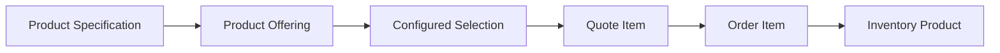

# Part 008 — Specification, Offering, Configuration, and Product Instance

## Positioning

Kata `product` sering menjadi sumber ambiguity terbesar dalam CPQ dan Quote-to-Order.

Ia dapat berarti:

- reusable specification;
- sellable offering;
- configured customer selection;
- ordered product;
- installed inventory product;
- atau technical realization.

Jika seluruhnya dimodelkan sebagai satu entity, lifecycle dan ownership akan bercampur.

> **Core thesis:** product definition, sellable proposition, configured selection, order intent, dan realized inventory instance adalah lifecycle stages yang berbeda dan harus memiliki identity serta ownership yang eksplisit.

---

## 1. The Product Semantic Ladder

A useful conceptual ladder:

```text
Product Specification
-> Product Offering
-> Configured Product Selection
-> Quote Item
-> Product Order Item
-> Inventory Product
```

Each step adds context and commitment.

---

## 2. Product Specification

A Product Specification defines reusable product semantics.

Possible content:

- characteristics;
- relationships;
- constraints;
- lifecycle;
- and technical/commercial meaning.

It should not contain customer-specific state.

---

## 3. Product Offering

A Product Offering makes a product sellable in a market context.

It may add:

- price;
- term;
- eligibility;
- channel;
- geography;
- promotion;
- and effective dates.

---

## 4. Configured Product Selection

A Configured Product Selection represents customer/context-specific choices.

It may include:

- offering reference;
- characteristic values;
- quantity;
- selected children;
- derived defaults;
- and validation state.

---

## 5. Quote Item

A Quote Item places configured selection into commercial proposal.

It adds:

- quoted price;
- terms;
- revision;
- validity;
- and commercial grouping.

---

## 6. Product Order Item

A Product Order Item expresses requested action.

It adds:

- action;
- requested dates;
- order relationships;
- execution intent;
- and source quote lineage.

---

## 7. Inventory Product

An Inventory Product records realized customer product state.

It adds:

- installed identity;
- status;
- effective dates;
- realized characteristics;
- and fulfillment references.

---

## 8. Why One `Product` Entity Fails

A single Product entity may need to support:

- mutable catalog design;
- immutable quote snapshot;
- order action;
- and installed lifecycle.

These concerns conflict.

---

## 9. Definition versus Instance

### Definition

Describes what something can be.

### Instance

Represents a specific occurrence in context.

Specification and Offering are definitions.

Configured selection and Inventory Product are instances in different lifecycle contexts.

---

## 10. Type versus Instance Identity

Type identity:

- Offering ID;
- Specification ID.

Instance identity:

- Configuration ID;
- Quote Item ID;
- Order Item ID;
- Inventory Product ID.

Do not reuse type ID as instance ID.

---

## 11. Product Specification Identity

Specification identity should remain stable across versions.

Example:

```text
Specification ID: SPEC-CONNECTIVITY
Version: 12
```

---

## 12. Product Offering Identity

Offering identity may be:

```text
Offering ID: OFFER-CONNECTIVITY-PREMIUM
Version: 7
```

Offering and Specification have independent lifecycle.

---

## 13. Version Relationship

An offering may reference a specific specification version.

Questions:

- Is the reference pinned?
- Can offering version update specification version?
- How are compatibility changes handled?

---

## 14. Specification Reuse

One specification can support multiple offerings.

Example:

```text
Business Connectivity Specification
-> 12-Month Standard Offer
-> 24-Month Premium Offer
-> Partner Wholesale Offer
```

---

## 15. Offering Composition

An offering can contain:

- direct specification;
- bundled offerings;
- commercial add-ons;
- and optional groups.

---

## 16. Specification Composition

Specification may define reusable structural components.

Avoid duplicating structure in every offering.

---

## 17. Commercial versus Structural Composition

### Structural composition

What product is made of conceptually.

### Commercial composition

How it is packaged and sold.

They may differ.

---

## 18. Product Type Taxonomy

Possible types:

- simple;
- bundle;
- package;
- add-on;
- fee;
- discount-bearing component;
- service;
- physical product;
- subscription.

Taxonomy should support behavior, not just labels.

---

## 19. Sellable versus Non-Sellable

A specification may be non-sellable directly.

It can still support:

- bundle component;
- internal decomposition;
- and inventory classification.

---

## 20. Visible versus Orderable

An offering can be:

- visible;
- configurable;
- quotable;
- orderable;
- renewable;
- modifiable.

These are distinct capabilities.

---

## 21. Offering Lifecycle

Possible states:

- Draft;
- Reviewed;
- Published;
- Active;
- Deprecated;
- Retired.

Lifecycle must define what operations remain allowed.

---

## 22. Specification Lifecycle

Specification retirement may be constrained by:

- active offerings;
- open quotes;
- inventory products;
- and downstream mapping.

---

## 23. Inventory Product Lifecycle

Possible states:

- Pending;
- Active;
- Suspended;
- Terminated;
- Failed;
- PendingRemoval.

Do not copy offering lifecycle states.

---

## 24. Configured Selection Lifecycle

Possible states:

- Draft;
- Valid;
- Invalid;
- Stale;
- CommittedToQuote.

It may be transient.

---

## 25. Offering Market Context

Offering may be scoped by:

- market;
- tenant;
- customer segment;
- channel;
- geography;
- and contract.

---

## 26. Customer-Specific Offering

Options:

- create dedicated offering;
- use overlay;
- use contract price/terms;
- use eligibility;
- or use custom configuration.

Choose based on lifecycle and reuse.

---

## 27. Offering Explosion

Creating one offering per customer variation can cause:

- huge catalog;
- duplicated rules;
- and upgrade pain.

---

## 28. Over-Generalized Offering

A single offering with hundreds of conditional fields can become equally unmanageable.

Balance reuse and clarity.

---

## 29. Specification Characteristics

Specification characteristics define:

- possible attributes;
- types;
- cardinality;
- and constraints.

---

## 30. Offering Characteristics

Offering may:

- expose subset;
- restrict values;
- set defaults;
- or hide characteristics.

---

## 31. Configured Values

Configured selection stores actual values.

Need provenance:

- user selected;
- inherited;
- defaulted;
- or calculated.

---

## 32. Inventory Characteristics

Inventory stores realized values.

They may differ from configured values due to:

- substitution;
- field conditions;
- and technical assignment.

---

## 33. Characteristic Lineage

Example:

```text
Specification bandwidth range
-> Offering allowed values
-> Quote selected 500 Mbps
-> Order requested 500 Mbps
-> Inventory realized 500 Mbps
```

---

## 34. Characteristic Drift

Drift occurs when:

- offering allows new value;
- quote uses old value;
- inventory stores technical value;
- and no mapping exists.

---

## 35. Commercial Characteristic

Examples:

- service tier;
- contract term;
- support level;
- number of sites.

---

## 36. Technical Characteristic

Examples:

- protocol;
- VLAN;
- device model;
- internal endpoint.

Some may be derived later.

---

## 37. Shared Characteristic Name Risk

`speed` may mean:

- ordered bandwidth;
- configured profile;
- measured throughput.

Use qualified semantics.

---

## 38. Product Relationship

Possible relationships:

- contains;
- requires;
- excludes;
- substitutes;
- dependsOn;
- upgradesTo;
- realizes.

---

## 39. Specification Relationship

Describes type-level relationship.

Example:

- connectivity requires access endpoint.

---

## 40. Offering Relationship

Describes sellable relationship.

Example:

- premium support available only with managed service.

---

## 41. Instance Relationship

Describes runtime relationship.

Example:

- installed add-on depends on installed base product.

---

## 42. Relationship Identity

A relationship may need:

- ID;
- type;
- direction;
- source;
- target;
- cardinality;
- and effective period.

---

## 43. Bundle Definition

A bundle groups components.

Questions:

- fixed or configurable?
- pricing at parent or child?
- lifecycle dependency?
- order decomposition?
- inventory representation?

---

## 44. Fixed Bundle

All components included.

Simpler configuration.

Still may have technical variation.

---

## 45. Configurable Bundle

Customer chooses components within constraints.

Requires:

- groups;
- cardinality;
- defaults;
- and validation.

---

## 46. Nested Bundle

Bundles can contain bundles.

Risks:

- deep hierarchy;
- recursive pricing;
- and difficult document/order mapping.

---

## 47. Bundle Identity

Parent bundle selection and child selections need separate instance identities.

---

## 48. Flattening

Some downstream systems require flat items.

Flattening must preserve:

- parent relation;
- price allocation;
- and lineage.

---

## 49. Offer without Specification

Some architectures permit lightweight commercial offers without reusable specification.

This may be valid for:

- fees;
- simple promotions;
- or non-configurable services.

But semantics must remain explicit.

---

## 50. Specification without Offering

Useful for:

- internal service model;
- future product;
- reusable component;
- and inventory classification.

---

## 51. Quote Snapshot

Quote should preserve enough offering/specification data to remain understandable.

Possible fields:

- IDs;
- versions;
- display name;
- selected characteristics;
- hierarchy;
- and terms.

---

## 52. Reference versus Snapshot Strategy

Recommended hybrid:

- stable reference;
- exact version;
- relevant commercial snapshot.

---

## 53. Order Snapshot

Order may preserve:

- source offering;
- accepted configuration;
- and commercial terms.

It should not need current catalog to interpret historical intent.

---

## 54. Inventory Reference

Inventory may reference:

- source specification;
- source offering;
- order item;
- and realized service/resource.

---

## 55. Retired Offering and Inventory

Retired offering must remain resolvable for:

- support;
- modification;
- billing;
- and audit.

---

## 56. Modify Existing Product

Modification should start from:

- current Inventory Product;
- allowed commercial changes;
- current catalog;
- and migration policy.

---

## 57. Add Action

Creates new product intent.

---

## 58. Modify Action

Changes existing product instance.

Requires existing inventory reference.

---

## 59. Delete or Terminate Action

Removes or terminates existing product.

Need dependency analysis.

---

## 60. Suspend and Resume

May affect:

- service state;
- billing;
- and contractual rules.

Not every product supports it.

---

## 61. Replace Action

Can represent:

- technology migration;
- product upgrade;
- or commercial replacement.

Need source and target lineage.

---

## 62. Upgrade Path

An upgrade path should define:

- source specification/offering;
- target;
- valid state;
- preserved characteristics;
- and commercial impact.

---

## 63. Downgrade Path

May have:

- eligibility;
- fee;
- term restriction;
- and technical feasibility.

---

## 64. Renewal

Renewal can:

- extend agreement;
- reprice;
- change offering;
- or create new quote/order.

Define semantics explicitly.

---

## 65. Amendment

Amendment modifies commercial commitment.

It should preserve original and delta.

---

## 66. Installed Base Query

To configure change, system may need:

- current products;
- relationships;
- status;
- and effective dates.

Inventory is authoritative for current instance.

---

## 67. Inventory Projection in CPQ

CPQ may maintain a read projection for performance.

It must account for:

- lag;
- tenant scope;
- and version.

---

## 68. Inventory Product as Aggregate

Possible aggregate includes:

- product;
- characteristics;
- relationships;
- status;
- and references.

Avoid loading entire customer graph for every change.

---

## 69. Product Graph

Installed products may form graph:

- parent-child;
- dependency;
- shared resource;
- and replacement.

Graph semantics affect modify/delete.

---

## 70. Product Inventory Consistency

Need invariants:

- unique active identity;
- valid relationship;
- no dangling reference;
- and lifecycle consistency.

---

## 71. As-Quoted versus As-Installed

Differences may be:

- technical substitution;
- actual identifier;
- installation date;
- and derived resource detail.

Commercially material variance must be visible.

---

## 72. As-Ordered versus As-Installed

Order requested value may not equal realized value.

Need classification:

- acceptable technical variance;
- commercial breach;
- or correction.

---

## 73. Product Inventory Creation

Possible trigger:

- order completion;
- service activation;
- resource activation;
- or dedicated inventory command.

Define authoritative event.

---

## 74. Product Inventory Update

Possible triggers:

- modify order;
- operational correction;
- synchronization;
- and reconciliation.

---

## 75. Inventory Termination

Should preserve history.

Use terminal state and effective date, not hard delete.

---

## 76. Inventory Reconciliation

Compare:

- order;
- fulfillment;
- actual service/resource;
- and billing.

---

## 77. Inventory Correction

Correction should preserve:

- previous state;
- reason;
- evidence;
- and impact.

---

## 78. Product Identity across Lifecycle

Do not use one ID for all stages.

Better lineage:

```text
Offering ID
-> Configuration ID
-> Quote Item ID
-> Order Item ID
-> Inventory Product ID
```

---

## 79. Cross-Reference Object

A lineage object can store:

- source context;
- source ID;
- source version;
- relation type.

---

## 80. External Identifier

Inventory may need:

- network service ID;
- asset tag;
- billing product ID;
- and partner reference.

Namespace every identifier.

---

## 81. Customer-Facing Identifier

Customer may need a stable product/service number distinct from internal ID.

---

## 82. Catalog Code versus Product Number

Catalog code identifies definition.

Product number identifies customer instance.

Do not conflate.

---

## 83. Product Specification Smells

- mutable published specification;
- customer data inside specification;
- one generic characteristic map;
- no version;
- and specification deleted while inventory exists.

---

## 84. Offering Smells

- one offering per customer;
- no market scope;
- price embedded without lifecycle;
- offering used as order instance;
- and offering name used as identity.

---

## 85. Configured Selection Smells

- no catalog version;
- defaults not distinguished;
- invalid state impossible to persist;
- and quote depends on live mutable offering.

---

## 86. Order Item Smells

- no source quote item;
- no action;
- current catalog required to interpret;
- and technical task mixed into product intent.

---

## 87. Inventory Product Smells

- same row mutated from quote to active product;
- no order lineage;
- hard delete;
- and no effective dates.

---

## 88. API Resource Naming

Prefer explicit resources:

- `/productOfferings`
- `/quotes`
- `/productOrders`
- `/productInventory`

Avoid generic `/products` unless context is unmistakable.

---

## 89. Event Naming

Examples:

- ProductOfferingActivated;
- QuoteItemConfigured;
- ProductOrderItemCreated;
- InventoryProductActivated.

Avoid `ProductUpdated`.

---

## 90. Data Contract

Each lifecycle entity should define:

- identity;
- version;
- owner;
- state;
- references;
- and semantics.

---

## 91. ProductOffering Read Model

Useful fields:

- ID/version;
- name;
- market;
- lifecycle;
- validity;
- specification references;
- price references;
- and eligibility metadata.

---

## 92. Configured Product Model

Useful fields:

- configuration ID;
- source offering/version;
- selected characteristic values;
- children;
- validation result;
- and context.

---

## 93. Quote Item Model

Useful fields:

- item ID;
- configured selection snapshot;
- price components;
- terms;
- hierarchy;
- and revision.

---

## 94. Product Order Item Model

Useful fields:

- item ID;
- action;
- source quote item;
- requested product state;
- dates;
- and relationships.

---

## 95. Inventory Product Model

Useful fields:

- product ID/number;
- customer/account;
- status;
- effective dates;
- realized characteristics;
- relationships;
- and source order.

---

## 96. Translation between Models

Translation should be explicit.



---

## 97. Transformation Ownership

Possible owners:

- Catalog defines offering/specification link.
- Configuration owns selected values.
- Quote owns commercial snapshot.
- Order owns requested action.
- Inventory owns realized state.

---

## 98. Transformation Version

Store transformation version when behavior may evolve.

---

## 99. Lossless versus Purposeful Transformation

Not every target needs all source fields.

A transformation can be purposeful but must preserve required lineage and invariants.

---

## 100. Worked Example: Connectivity Specification

### Specification

Business Connectivity.

Characteristics:

- bandwidth;
- access type;
- resilience;
- support tier.

---

## 101. Worked Example: Premium Offering

### Offering

Premium Connectivity 24 Months.

Adds:

- market;
- price;
- 24-month term;
- premium support default;
- eligibility.

---

## 102. Worked Example: Configured Selection

Customer selects:

- 500 Mbps;
- dual access;
- 20 sites;
- premium support.

---

## 103. Worked Example: Quote Item

Quote Item stores:

- offering v7;
- selected values;
- price;
- discount;
- validity;
- and terms.

---

## 104. Worked Example: Product Order Item

Order Item:

- action ADD;
- 20-site configuration;
- requested date;
- source quote item;
- and customer/site references.

---

## 105. Worked Example: Inventory Product

After fulfillment:

- product number;
- Active;
- realized 500 Mbps;
- site relationships;
- device/service references;
- source order item.

---

## 106. Worked Example: Upgrade

Inventory Product:

- 100 Mbps active.

Upgrade quote:

- target 500 Mbps.

Order Item:

- action MODIFY;
- existing product reference;
- target state.

Inventory updates after completion.

---

## 107. Worked Example: Retired Offering

Offering retired for new sales.

Existing Inventory Product remains active.

Allowed operations may include:

- support;
- terminate;
- migrate;
- but not new ADD.

---

## 108. Worked Example: Customer-Specific Variation

Do not clone entire specification if only:

- price;
- label;
- and eligibility

change.

Use offering or overlay.

---

## 109. Product Entity Review Template

```md
## Entity Name

## Context

## Definition or Instance

## Identity

## Version

## Lifecycle

## Owner

## References

## Characteristics

## Relationships

## Historical Behavior

## Allowed Operations
```

---

## 110. Lifecycle Mapping Template

```text
Specification:
Offering:
Configured selection:
Quote item:
Order item:
Inventory product:

For each:
- identity
- owner
- state
- version
- lineage
```

---

## 111. Relationship Template

```text
Source:
Target:
Relationship type:
Direction:
Cardinality:
Lifecycle:
Effective period:
Commercial meaning:
Operational meaning:
```

---

## 112. Senior Engineer Operating Model

### Qualify the word product

Ask which context.

### Protect identities

Do not reuse definition IDs as instance IDs.

### Separate lifecycles

Specification, offering, quote, order, inventory.

### Preserve versions

Historical interpretation matters.

### Model transformations

Do not rely on field-copy utilities.

### Keep inventory authoritative

For realized state.

### Avoid offering explosion

Use deliberate variation mechanisms.

### Preserve lineage

Across every stage.

---

## 113. Internal Verification Checklist

### Specification

- Does ProductSpecification exist?
- What does it own?
- How is it versioned?
- Can it be reused?

### Offering

- Is ProductOffering distinct?
- What adds sellability?
- How are market/channel/tenant scopes modeled?
- How are prices linked?

### Configuration

- Is there a configuration identity?
- How are selected/defaulted/calculated values represented?
- Is catalog version pinned?

### Quote

- Does Quote Item snapshot offering/configuration?
- What hierarchy is preserved?
- Is price/term attached to item or quote?

### Order

- Does ProductOrderItem carry action?
- Does it reference quote item?
- Does modify reference inventory product?
- How is requested target state represented?

### Inventory

- Who owns Inventory Product?
- How is it created?
- How are status and effective dates modeled?
- How are relationships preserved?

### Lifecycle

- What happens when offering retires?
- How are upgrades/downgrades defined?
- How are existing products modified?
- How is lineage queried?

---

## 114. Practical Exercises

### Exercise 1 — Product ladder

Map one real product across specification, offering, quote, order, and inventory.

### Exercise 2 — Identity audit

Identify where one ID is reused across lifecycle stages.

### Exercise 3 — Variation strategy

Classify customer-specific differences as specification, offering, overlay, contract, or configuration.

### Exercise 4 — Lifecycle audit

Define allowed operations after offering deprecation/retirement.

### Exercise 5 — Upgrade model

Design an upgrade from current inventory product to target offering.

### Exercise 6 — Relationship map

Model bundle, dependency, and installed-product relationships separately.

---

## 115. Part Completion Checklist

You are done if you can:

- distinguish ProductSpecification and ProductOffering;
- separate definition and instance;
- model configured selection;
- differentiate Quote Item, Order Item, and Inventory Product;
- preserve identity and version;
- model offering and inventory lifecycle independently;
- represent add/modify/delete actions;
- avoid offering explosion;
- preserve characteristic and relationship lineage;
- and create an internal product-model verification backlog.

---

## 116. Key Takeaways

1. `Product` must always be context-qualified.
2. Specification defines; offering sells.
3. Configuration selects; quote commits.
4. Order requests; inventory records reality.
5. Definition and instance identities are different.
6. Offering and specification have independent lifecycle.
7. Inventory must remain resolvable after offering retirement.
8. Modify actions require existing product lineage.
9. Customer variation should not automatically create catalog clones.
10. Internal entity semantics must be verified.

---

## 117. References

Conceptual baseline:

- General product-catalog, CPQ, product-order, and inventory modeling practices.
- Domain-Driven Design entity identity, lifecycle, aggregate, and context concepts.
- TM Forum ProductSpecification, ProductOffering, ProductOrder, and Product Inventory vocabulary.

These references do not define internal CSG entity structures or APIs.
