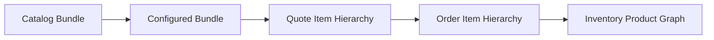

# Part 009 — Commercial Composition, Nested Bundles, and Structural Semantics

## Positioning

Bundle bukan hanya list of children.

Dalam enterprise CPQ, composition menentukan:

- apa yang dijual bersama;
- bagian mana yang mandatory;
- pilihan apa yang tersedia;
- bagaimana quantity bekerja;
- bagaimana pricing dialokasikan;
- bagaimana quote ditampilkan;
- bagaimana order dibentuk;
- dan bagaimana inventory relationship dipertahankan.

> **Core thesis:** hierarchy yang baik harus memiliki semantics yang eksplisit. Parent–child structure tanpa meaning akan menghasilkan configuration ambiguity, pricing inconsistency, dan decomposition yang sulit direproduksi.

---

## 1. What Composition Means

Composition menjawab:

```text
What is this commercial product made of?
Which parts are selectable?
Which parts are mandatory?
How do quantities relate?
What lifecycle relation exists between parent and child?
```

---

## 2. Structure versus Relationship

### Structure

Menjelaskan containment atau grouping.

### Relationship

Menjelaskan dependency atau semantic connection.

A child can be structurally contained without being operationally dependent.

---

## 3. Simple Offering

A simple offering has no configurable child composition.

It may still have:

- characteristics;
- prices;
- eligibility;
- and terms.

Simple does not mean technically simple.

---

## 4. Composite Offering

A composite offering groups multiple components.

It may be:

- fixed;
- configurable;
- conditional;
- nested;
- or dynamically assembled.

---

## 5. Bundle

A bundle is a commercial composition intended to be treated as one sellable proposition.

It may include:

- products;
- add-ons;
- services;
- fees;
- or discounts.

---

## 6. Package

Package often emphasizes commercial presentation.

Possible differences from bundle:

- packaging only;
- no lifecycle coupling;
- no independent inventory identity;
- or no child-level pricing visibility.

Internal semantics must be defined.

---

## 7. Component

A component is a child element of a composition.

It may be:

- independently sellable;
- non-sellable;
- mandatory;
- optional;
- repeatable;
- or hidden.

---

## 8. Group

A group organizes choices.

Examples:

- choose one access type;
- choose up to three add-ons;
- select at least one support package.

A group is not necessarily a product entity.

---

## 9. Parent–Child Semantics

Possible meanings:

- contains;
- composedOf;
- includes;
- requires;
- represents;
- or realizes.

Avoid generic `children` without business meaning.

---

## 10. Fixed Bundle

All children are included.

Example:

```text
Managed Connectivity Bundle
- Access Service
- Managed Router
- Monitoring
- Standard Support
```

Customer may configure characteristics but not remove components.

---

## 11. Configurable Bundle

Customer can choose among components.

Example:

```text
Cloud Connectivity Bundle
- Required: Core Connectivity
- Choose 1: AWS / Azure / GCP Connector
- Optional: Managed Firewall
- Optional: Premium Support
```

---

## 12. Optional Add-On

An add-on may require:

- a base product;
- a valid lifecycle state;
- and compatible configuration.

It may have independent price and inventory identity.

---

## 13. Mandatory Component

Mandatory means:

- always selected;
- or selected when a condition holds.

The condition must be explicit.

---

## 14. Conditional Component

Example:

> Managed Router is required when customer chooses managed mode.

This is rule-driven composition.

---

## 15. Alternative Group

A mutually exclusive group.

Example:

```text
Choose one:
- Copper Access
- Fiber Access
- Wireless Access
```

---

## 16. Cardinality Group

A group may define:

- minimum;
- maximum;
- exact count;
- and per-child limits.

---

## 17. Repeating Component

Example:

- one site component per branch;
- up to five additional static IP blocks;
- multiple user licenses.

Need identity per occurrence.

---

## 18. Nested Bundle

A bundle can contain another bundle.

Example:

```text
Enterprise Network Suite
-> Connectivity Bundle
-> Security Bundle
-> Support Bundle
```

---

## 19. Nested Bundle Benefits

- reuse;
- modularity;
- consistency;
- and simpler product authoring.

---

## 20. Nested Bundle Risks

- deep recursion;
- hidden pricing;
- circular references;
- and confusing quote/order hierarchies.

---

## 21. Depth Limit

A depth limit may be justified for:

- UI usability;
- performance;
- and downstream compatibility.

The limit should be explicit and evidence-based.

---

## 22. Composition Graph versus Tree

A tree has one parent per child.

A graph allows shared components.

Shared components introduce:

- ownership ambiguity;
- quantity allocation;
- and lifecycle complexity.

---

## 23. Shared Component

Example:

- one shared access service supports multiple add-ons.

Questions:

- who owns it;
- can one child terminate it;
- and how price is allocated.

---

## 24. Reusable Definition versus Shared Instance

A component definition can be reused safely.

A runtime instance shared by multiple parents requires stronger lifecycle semantics.

---

## 25. Composition Identity

Each component occurrence should have an identity.

Example:

```text
Bundle Selection ID
Component Selection ID
Occurrence Index
Source Offering ID/Version
```

---

## 26. Structural Identity versus Business Identity

A child’s position is not stable identity.

Avoid:

```text
parent.children[2]
```

as the only reference.

---

## 27. Quantity Propagation

Possible policies:

- child quantity equals parent quantity;
- child quantity fixed at one;
- child quantity derived;
- child quantity independently configurable.

---

## 28. Multiplicative Quantity

Example:

```text
10 sites
× 2 access links per site
= 20 access components
```

Derivation should be explicit.

---

## 29. Quantity Allocation

When parent quantity changes, decide:

- propagate;
- recompute;
- preserve manual override;
- or invalidate configuration.

---

## 30. Group Cardinality

Example:

```text
Support Add-Ons
min = 0
max = 2
```

This belongs to the group/relationship, not the child offering itself.

---

## 31. Component Cardinality

Example:

```text
Static IP Block
min = 0
max = 10
```

---

## 32. Parent–Child Lifecycle Coupling

Possible policies:

- child exists only with parent;
- child may outlive parent;
- child can be detached;
- child can be migrated independently.

---

## 33. Commercial Dependency

A child may be:

- commercially included;
- commercially optional;
- or separately priced.

---

## 34. Operational Dependency

A child may depend on another for execution.

Commercial and operational dependency are not always the same.

---

## 35. Inventory Dependency

Installed child may require active parent.

Example:

- premium support requires active managed service.

---

## 36. Pricing at Parent

Bundle price can be defined at parent level.

Benefits:

- simple presentation.

Risks:

- allocation ambiguity;
- difficult partial cancellation.

---

## 37. Pricing at Child

Each child has independent price.

Benefits:

- transparency;
- easier modification.

Risks:

- totals and discount interactions.

---

## 38. Hybrid Pricing

Parent has package price plus child adjustments.

Need:

- precedence;
- allocation;
- and explanation.

---

## 39. Price Allocation

Allocation may be required for:

- billing;
- revenue;
- cancellation;
- discount;
- and tax.

Do not infer allocation from display-only hierarchy.

---

## 40. Free Included Component

A component may have zero customer-visible price but still:

- incur cost;
- require fulfillment;
- and need inventory.

---

## 41. Discounted Bundle

A bundle discount may depend on:

- all required children present;
- quantity;
- term;
- or channel.

Removing a child may invalidate discount.

---

## 42. Bundle-Level Discount

A discount may apply to:

- parent total;
- selected child set;
- or eligible components.

Scope must be explicit.

---

## 43. Quote Representation

Possible strategies:

- preserve full hierarchy;
- flatten with relationship links;
- show parent summary plus child detail;
- or hide technical components.

---

## 44. Quote Presentation versus Quote Domain Model

The customer-facing representation may differ from internal quote hierarchy.

Do not let document layout define domain structure.

---

## 45. Order Representation

Order may:

- preserve commercial hierarchy;
- flatten;
- split;
- or create execution-specific hierarchy.

Preserve lineage regardless.

---

## 46. Inventory Representation

Inventory may preserve:

- parent product;
- child products;
- shared service relationships;
- and realization links.

---

## 47. Composition across Lifecycle



Each transition may transform structure.

---

## 48. Lossless Structural Lineage

For every child, preserve:

- source catalog relationship;
- configured occurrence;
- quote item;
- order item;
- and inventory product.

---

## 49. Flattening Strategy

When flattening, retain:

- parent reference;
- relationship type;
- occurrence ID;
- and quantity derivation.

---

## 50. Structural Normalization

A runtime model may normalize nested catalog structure into:

- nodes;
- edges;
- constraints;
- and groups.

Useful for evaluation.

---

## 51. Tree Normalization Risks

Flattening too early can lose:

- presentation grouping;
- commercial bundle identity;
- and parent-level pricing.

---

## 52. Graph Model

Graph model supports:

- shared dependency;
- cross-bundle relationship;
- and non-tree structure.

Risk:

- more complex evaluation and persistence.

---

## 53. Cycle Detection

Catalog composition should reject cycles such as:

```text
A contains B
B contains C
C contains A
```

---

## 54. Recursive Expansion

Runtime expansion must guard against:

- cycles;
- excessive depth;
- and repeated shared nodes.

---

## 55. Lazy Expansion

Large bundles may load children on demand.

Need:

- deterministic snapshot;
- and version pinning.

---

## 56. Dynamic Composition

A bundle may be assembled based on context.

Example:

- region-specific access option;
- tenant-specific mandatory add-on.

Need explainability.

---

## 57. Static versus Dynamic Composition

### Static

Structure known in publication.

### Dynamic

Structure depends on runtime context.

Dynamic composition increases test space.

---

## 58. Rule-Driven Inclusion

A child may appear if:

```text
customerSegment = Enterprise
and bandwidth >= 1 Gbps
```

Rule source and version should be visible.

---

## 59. Default Selection

Defaults may improve usability.

But defaulting should preserve:

- provenance;
- visibility;
- and override policy.

---

## 60. Hidden Component

A hidden component may still:

- price;
- fulfill;
- and inventory.

Be careful with customer transparency.

---

## 61. Read-Only Component

A component may be visible but not user-editable.

Example:

- mandatory compliance service.

---

## 62. Auto-Added Component

System adds child automatically.

Need:

- reason;
- rule;
- and removal behavior.

---

## 63. Auto-Removed Component

Changing configuration may remove child.

Need:

- user warning;
- price recalculation;
- and audit.

---

## 64. Orphan Prevention

When parent changes, detect child selections that no longer belong.

---

## 65. Structural Validation

Validate:

- required components;
- allowed children;
- cardinality;
- cycle;
- and parent-child compatibility.

---

## 66. Semantic Validation

Validate:

- meaningful combinations;
- lifecycle rules;
- and business intent.

---

## 67. Cross-Item Constraint

Example:

- premium support requires at least one managed service anywhere in bundle.

This is graph-level rule.

---

## 68. Scope of Constraint

Constraint may apply to:

- one node;
- sibling group;
- subtree;
- full quote;
- or customer portfolio.

---

## 69. Constraint Evaluation Order

Avoid relying on incidental traversal order.

Use explicit dependency graph or rule priority.

---

## 70. Composition and Eligibility

Some child options may be:

- invisible;
- visible but unavailable;
- or conditionally allowed.

Distinguish discoverability from eligibility.

---

## 71. Composition and Qualification

A technically infeasible child may invalidate only one branch.

Need partial result and alternatives.

---

## 72. Composition and Approval

Certain child selections may trigger:

- commercial approval;
- security review;
- or feasibility approval.

---

## 73. Composition and Terms

A child may impose:

- minimum term;
- notice period;
- or service condition.

Parent terms must reconcile.

---

## 74. Term Conflict

Example:

- parent bundle term 24 months;
- child minimum term 36 months.

Publication validation should detect or define resolution.

---

## 75. Effective-Date Conflict

Parent and child validity windows may not overlap.

This can make bundle unsellable.

---

## 76. Lifecycle Conflict

Parent active while child retired.

Need publication-time validation.

---

## 77. Bundle Versioning

Bundle version should identify:

- structure;
- child versions;
- relationships;
- and rules.

---

## 78. Child Version Pinning

Options:

- pin exact child versions;
- resolve compatible range;
- resolve at publication.

Exact pinning improves reproducibility.

---

## 79. Version Range Risk

Compatible ranges can produce different runtime structure over time.

Use with strong publication semantics.

---

## 80. Open Quote Compatibility

If child offering changes:

- draft quote may migrate;
- accepted quote remains pinned;
- or stale configuration is flagged.

---

## 81. Retiring a Child

Before retirement, inspect:

- parent bundles;
- open quotes;
- order mappings;
- and inventory modifications.

---

## 82. Replacing a Child

A replacement relationship does not automatically migrate configured instances.

---

## 83. Bundle Migration

Migration may:

- replace child;
- preserve values;
- reprice;
- and require approval.

---

## 84. Clone versus Reuse

Cloning bundle structure creates independence but duplicates maintenance.

Reuse creates coupling.

Choose deliberately.

---

## 85. Inheritance versus Composition

Prefer composition for:

- visible structure;
- and local reasoning.

Inheritance may be useful for shared defaults but can hide behavior.

---

## 86. Template

A template may accelerate authoring.

Once instantiated, decide whether:

- linked to template;
- or copied independently.

---

## 87. Product Family

Product family groups related offerings.

It is not necessarily a bundle.

---

## 88. Category

Category supports navigation/classification.

It should not imply composition or lifecycle dependency.

---

## 89. Taxonomy versus Hierarchy

Taxonomy organizes classification.

Composition hierarchy defines structural semantics.

Do not confuse them.

---

## 90. UI Tree versus Domain Tree

UI may group items differently for usability.

Domain structure should remain authoritative.

---

## 91. Search Facet

A search facet is not a characteristic or composition relationship by default.

---

## 92. Persistence Model

Possible representations:

- adjacency list;
- nested set;
- materialized path;
- graph database;
- normalized node/edge tables;
- document tree.

Choose based on query and mutation patterns.

---

## 93. Adjacency List

Simple parent-child storage.

Good for moderate depth.

---

## 94. Materialized Path

Fast subtree query.

Needs update handling when moving nodes.

---

## 95. Graph Database

Useful for rich relationships.

Adds operational complexity and may not be necessary.

---

## 96. Document Model

Natural for immutable published bundle.

Harder for shared nodes and cross-links.

---

## 97. Aggregate Boundary

A bundle definition may be one aggregate if:

- updates are small;
- consistency needs are local.

Large catalogs may require smaller aggregates plus publication validation.

---

## 98. Large Bundle Performance

Potential issues:

- recursive loading;
- N+1 queries;
- rule explosion;
- and large payload.

---

## 99. Incremental Configuration

Evaluate only affected subgraph when user changes one selection.

---

## 100. Memoization

Cache deterministic sub-results by:

- publication;
- context;
- node;
- and selected inputs.

---

## 101. Payload Design

Avoid returning entire catalog for every configuration session.

Use:

- summaries;
- lazy detail;
- and version-aware references.

---

## 102. API Model

A bundle API should expose:

- node identity;
- relationship semantics;
- cardinality;
- selection policy;
- and version.

---

## 103. Event Model

Possible events:

- BundleStructureChanged;
- ComponentAddedToOffering;
- BundleVersionActivated.

Do not publish giant full trees unnecessarily.

---

## 104. Composition Diff

A semantic diff should show:

- child added/removed;
- cardinality changed;
- mandatory/optional changed;
- relationship changed;
- and version changed.

---

## 105. Testing Composition

Test:

- valid minimal selection;
- valid maximal selection;
- missing mandatory child;
- too many children;
- conflicting alternatives;
- nested depth;
- and cycle prevention.

---

## 106. Property-Based Testing

Properties:

- no active bundle contains inactive required child;
- minimum cardinality always satisfiable;
- selected child belongs to valid group;
- totals preserve allocation invariants.

---

## 107. Golden Bundle Scenario

Example:

```text
Enterprise Connectivity
- 10 sites
- choose 1 access type per site
- managed router mandatory
- premium support optional
- volume discount applies
```

Verify:

- structure;
- price;
- quote;
- order;
- and inventory lineage.

---

## 108. Composition Incident

Possible incidents:

- mandatory child missing;
- hidden child billed;
- order mapping loses hierarchy;
- bundle becomes unsatisfiable;
- and removal leaves orphan inventory.

---

## 109. Operational Observability

Track:

- invalid bundle rate;
- auto-added component count;
- composition-evaluation latency;
- mapping failures;
- and orphan detection.

---

## 110. Bundle Governance

Changes affecting structure should require:

- impact analysis;
- scenario tests;
- and lifecycle review.

---

## 111. Composition Smells

- generic `children`;
- no relationship type;
- hierarchy based on display order;
- unbounded nesting;
- parent price with no allocation;
- shared instance without ownership;
- and flattening without lineage.

---

## 112. Anti-Patterns

### Bundle as folder

Grouping has no business semantics.

### Bundle as giant product

Every child collapsed into one object.

### UI-driven hierarchy

Backend mirrors current screen layout.

### Hidden mandatory components

Customer cannot explain charges or commitments.

### Versionless composition

Historical quote cannot be reproduced.

---

## 113. Bundle Definition Template

```md
## Bundle Identity

## Version

## Parent Offering

## Components

## Groups

## Cardinality

## Relationship Semantics

## Quantity Rules

## Pricing Policy

## Lifecycle Coupling

## Order Mapping

## Inventory Mapping

## Tests
```

---

## 114. Component Relationship Template

```text
Relationship ID:
Source:
Target:
Type:
Direction:
Min:
Max:
Quantity rule:
Condition:
Lifecycle coupling:
Price behavior:
Order behavior:
Inventory behavior:
```

---

## 115. Composition Review Questions

```text
Why is this child present?
Can it be removed?
Can it exist independently?
How is quantity derived?
Who owns its lifecycle?
How is price allocated?
What happens downstream?
```

---

## 116. Worked Example: Managed Connectivity Bundle

### Parent

Managed Connectivity.

### Children

- Access Service;
- Managed Router;
- Monitoring;
- Support.

### Rules

- one access per site;
- one router per site;
- monitoring mandatory;
- premium support optional.

### Downstream

- quote preserves hierarchy;
- order groups by site;
- inventory stores parent product plus child products.

---

## 117. Worked Example: Multi-Cloud Package

### Structure

- Core Connectivity;
- choose 1–3 cloud connectors;
- optional managed firewall;
- optional premium support.

### Risks

- shared core service;
- quantity allocation;
- parent-level discount;
- and child cancellation.

---

## 118. Worked Example: Shared Access

Two commercial products share one access service.

Need:

- shared instance identity;
- dependency graph;
- termination guard;
- and cost allocation.

---

## 119. Worked Example: Bundle Retirement

A mandatory child is retired.

Options:

- new bundle version with replacement;
- parent retirement;
- or temporary compatibility version.

Open quotes need migration policy.

---

## 120. Worked Example: Flattened Downstream

Downstream cannot consume nested items.

Transformation creates flat order items with:

- `parentQuoteItemId`;
- `bundlePath`;
- `relationshipType`;
- and `occurrenceId`.

Lineage remains recoverable.

---

## 121. Senior Engineer Operating Model

### Ask for semantics

Do not accept generic parent-child.

### Separate taxonomy from composition

Classification is not structure.

### Protect identity

Occurrences need stable IDs.

### Design quantity explicitly

Avoid implicit multiplication.

### Preserve lineage

Across quote, order, and inventory.

### Challenge deep nesting

Optimize for operability.

### Include pricing and lifecycle

Composition is not only UI structure.

### Test graph behavior

Not only individual nodes.

---

## 122. Internal Verification Checklist

### Structure

- What composition types exist?
- Is hierarchy a tree or graph?
- Is nesting bounded?
- Are shared components allowed?

### Relationships

- Are relationship types explicit?
- Are requires/excludes separate from containment?
- Are direction and cardinality modeled?
- Are cycles detected?

### Quantity

- How does parent quantity propagate?
- Are repeated components individually identified?
- Are overrides allowed?
- How are quantities represented downstream?

### Pricing

- Is price parent-, child-, or hybrid-based?
- How is allocation handled?
- What happens on partial cancellation?
- Are hidden components customer-visible?

### Lifecycle

- Can child outlive parent?
- What happens when child retires?
- How are open quotes migrated?
- How are installed bundles modified?

### Integration

- Does quote preserve hierarchy?
- Does order flatten?
- How is inventory represented?
- Is lineage lossless?

---

## 123. Practical Exercises

### Exercise 1 — Bundle semantics

Model one bundle with groups, cardinality, and lifecycle rules.

### Exercise 2 — Tree versus graph

Identify shared components and evaluate whether graph semantics are needed.

### Exercise 3 — Quantity derivation

Define quantity propagation for a 20-site offering.

### Exercise 4 — Pricing allocation

Design parent/child price allocation and cancellation behavior.

### Exercise 5 — Flattening

Transform nested quote hierarchy into flat order items without losing lineage.

### Exercise 6 — Retirement impact

Analyze retirement of a mandatory child.

---

## 124. Part Completion Checklist

You are done if you can:

- distinguish bundle, package, group, and component;
- define parent-child semantics;
- model fixed and configurable bundles;
- handle nested and shared components;
- define cardinality and quantity propagation;
- connect composition to pricing;
- preserve hierarchy or lineage across quote/order/inventory;
- detect cycles and unsatisfiable structures;
- version composition;
- and create an internal bundle-model verification backlog.

---

## 125. Key Takeaways

1. Bundle is a semantic composition, not a folder.
2. Structure and dependency are different.
3. Repeated occurrences need identity.
4. Quantity propagation must be explicit.
5. Parent and child lifecycle may differ.
6. Pricing strategy affects cancellation and billing.
7. Nested bundles increase test and runtime complexity.
8. Flattening must preserve lineage.
9. Taxonomy and composition should not be conflated.
10. Internal bundle semantics must be verified.

---

## 126. References

Conceptual baseline:

- General CPQ bundle, package, composition, and configurable-product modeling practices.
- Domain-Driven Design aggregate and relationship concepts.
- Graph, hierarchy, cardinality, and catalog-versioning patterns.
- TM Forum ProductOffering and ProductSpecification relationship vocabulary.

These references do not define internal CSG bundle semantics.
