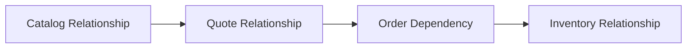

# Part 011 — Requires, Excludes, Recommends, Substitutes, and Upgrade Paths

## Positioning

Catalog relationship menentukan bagaimana offering, specification, component, characteristic, dan installed product saling berinteraksi.

Salah satu sumber complexity terbesar dalam CPQ adalah hubungan yang tidak memiliki semantics jelas.

Contoh:

- A requires B;
- A excludes C;
- D recommends E;
- F supersedes G;
- H upgradesTo I.

Jika seluruhnya disimpan sebagai generic `relatedTo`, runtime tidak dapat menjelaskan:

- apakah hubungan wajib;
- kapan berlaku;
- apakah directional;
- bagaimana quantity bekerja;
- apa dampaknya pada price;
- dan apa yang terjadi saat lifecycle berubah.

> **Core thesis:** relationship adalah executable domain semantics. Setiap relationship membutuhkan type, direction, scope, cardinality, condition, lifecycle, explanation, dan ownership yang eksplisit.

---

## 1. What a Catalog Relationship Is

Catalog relationship menghubungkan dua atau lebih domain elements.

Possible elements:

- ProductSpecification;
- ProductOffering;
- characteristic;
- bundle component;
- price definition;
- installed product type;
- order action;
- and migration path.

---

## 2. Relationship versus Rule

### Relationship

States a semantic connection.

Example:

> Premium Support requires Managed Service.

### Rule

Evaluates context and determines behavior.

Example:

> If support tier is PREMIUM and market is ID, Managed Service must be selected.

A relationship may be implemented by one or more rules.

---

## 3. Relationship Taxonomy

Common types:

- contains;
- requires;
- excludes;
- recommends;
- substitutes;
- supersedes;
- compatibleWith;
- incompatibleWith;
- upgradesTo;
- downgradesTo;
- dependsOn;
- realizes;
- and replaces.

---

## 4. Contains

`contains` expresses composition.

It does not automatically mean:

- mandatory;
- same lifecycle;
- same price;
- or same inventory identity.

Use accompanying cardinality and policy.

---

## 5. Requires

`A requires B` means A cannot be valid without B under defined context.

Questions:

- Is B auto-added?
- Must user select B?
- Can existing inventory satisfy requirement?
- Is the relationship transitive?
- What quantity is required?

---

## 6. Excludes

`A excludes B` means A and B cannot coexist within a defined scope.

Scope may be:

- one bundle;
- one quote;
- one customer account;
- one site;
- or installed base.

---

## 7. Recommends

`A recommends B` is non-blocking.

It may produce:

- suggestion;
- warning;
- or guided-selling action.

Do not model recommendation as mandatory rule.

---

## 8. Substitutes

`A substitutes B` means A can replace B under conditions.

Need to define:

- equivalent capability;
- commercial impact;
- migration;
- and customer consent.

---

## 9. Supersedes

`A supersedes B` means A is a newer or preferred successor.

It does not necessarily mean existing B instances are migrated.

---

## 10. Compatible With

Compatibility states coexistence or interoperability.

Avoid treating absence of relationship as incompatibility unless closed-world policy is explicit.

---

## 11. Incompatible With

Explicitly prohibits combination.

Need:

- scope;
- reason;
- and resolution guidance.

---

## 12. Upgrades To

Defines a permitted transition from existing product/offer to target.

May include:

- eligibility;
- migration mapping;
- preserved values;
- price;
- fee;
- and approval.

---

## 13. Downgrades To

Defines a lower-level transition.

It may be constrained by:

- contract;
- minimum term;
- resource dependency;
- and billing policy.

---

## 14. Depends On

A dependency may refer to:

- commercial validity;
- fulfillment sequencing;
- installed product lifecycle;
- or external capability.

Qualify the dependency type.

---

## 15. Realizes

`realizes` often connects:

- commercial product to service;
- service to resource;
- or specification to technical realization.

---

## 16. Replaces

Replacement may occur because of:

- product retirement;
- technology migration;
- correction;
- or commercial strategy.

Need source/target lineage.

---

## 17. Directionality

A relationship can be:

- directional;
- bidirectional;
- symmetric;
- or inverse-defined.

Example:

```text
A requires B
B isRequiredBy A
```

Do not infer inverse semantics incorrectly.

---

## 18. Symmetric Relationship

Compatibility may be symmetric.

But verify:

- A compatible with B;
- B compatible with A.

Version or context can make compatibility directional.

---

## 19. Scope

A relationship needs scope.

Possible scopes:

- catalog;
- offering;
- specification;
- configuration session;
- quote;
- order;
- inventory;
- customer;
- site;
- and market.

---

## 20. Context

Relationship evaluation may depend on:

- tenant;
- market;
- channel;
- date;
- customer segment;
- existing inventory;
- and action.

---

## 21. Condition

A conditional relationship might state:

```text
If bandwidth >= 1 Gbps
then Managed Router is required.
```

Store the condition and explanation.

---

## 22. Effective Period

A relationship may become active or expire independently from source/target entities.

Need:

- start;
- end;
- timezone;
- and overlap validation.

---

## 23. Lifecycle Compatibility

Source and target lifecycles must be compatible.

Example:

- active offering requires retired child.

This can make configuration impossible.

---

## 24. Cardinality

A relationship may define:

- min;
- max;
- exact count;
- and quantity derivation.

Example:

> One managed access requires exactly one router per site.

---

## 25. Quantity Rule

Possible rules:

- one-to-one;
- one-per-parent;
- one-per-site;
- fixed quantity;
- calculated quantity;
- or user-selected.

---

## 26. Strength

Possible strengths:

- mandatory;
- blocking;
- advisory;
- informational;
- and preferred.

---

## 27. Precedence

When relationships conflict, precedence may depend on:

- specificity;
- scope;
- priority;
- tenant override;
- contract;
- and publication order.

Precedence must not depend on random evaluation order.

---

## 28. Specificity

A more specific rule may override a generic one.

Example:

```text
Global:
Premium Support requires Managed Service.

Tenant Contract:
Premium Support is included with Dedicated Access.
```

---

## 29. Conflict

Conflict examples:

- A requires B;
- A excludes B;
- B retired;
- or two rules produce different quantity.

Publication should detect conflicts.

---

## 30. Conflict Resolution

Possible strategies:

- higher priority;
- more specific scope;
- explicit override;
- reject publication;
- or require manual adjudication.

For critical contradictions, rejecting publication is safest.

---

## 31. Cyclic Dependency

Example:

```text
A requires B
B requires C
C requires A
```

A cycle may be valid in some graph semantics but dangerous for auto-add or lifecycle.

---

## 32. Cycle Detection

Detect cycles at:

- publication;
- configuration expansion;
- and migration planning.

---

## 33. Transitive Relationship

If A requires B and B requires C, does A indirectly require C?

For `requires`, often yes.

For `recommends`, not necessarily.

Define per relationship type.

---

## 34. Transitive Closure

Precomputing transitive closure can improve performance.

Need version-aware invalidation.

---

## 35. Auto-Add

A required component can be auto-added.

Need:

- visible explanation;
- quantity;
- and removal guard.

---

## 36. User Resolution

Alternative behavior:

- show validation error;
- suggest valid option;
- and let user choose.

Better for ambiguous alternatives.

---

## 37. Auto-Remove

When a selection becomes incompatible, system may remove it.

Risk:

- silent loss;
- price changes;
- and customer confusion.

Require explicit notification.

---

## 38. Recommendation

A recommendation can be ranked by:

- relevance;
- commercial strategy;
- compatibility;
- and customer context.

Avoid mixing recommendation ranking with mandatory validation.

---

## 39. Guided Selling

Relationships can support guided selling:

- recommended add-ons;
- alternate offers;
- upgrade suggestions;
- and cross-sell.

Keep commercial goals transparent.

---

## 40. Existing Inventory Dependency

An offering may require:

- active base product;
- installed location;
- or compatible service.

Qualification must query inventory.

---

## 41. Account-Level Dependency

A rule may require:

- credit state;
- contract;
- or customer segment.

This is not catalog-static data.

---

## 42. Site-Level Dependency

Example:

- managed access add-on requires eligible connectivity at same site.

Scope identity matters.

---

## 43. Quote-Level Dependency

One quote item may require another item in same quote.

---

## 44. Portfolio-Level Dependency

A customer may already own required product.

Need policy:

- existing inventory satisfies requirement;
- or quote must include new instance.

---

## 45. Order-Level Dependency

A selected product may create execution dependency.

Do not assume catalog relation equals orchestration sequence.

Translate explicitly.

---

## 46. Inventory-Level Dependency

Installed products may have lifecycle coupling.

Example:

- add-on cannot remain active after base termination.

---

## 47. Commercial Relationship versus Technical Dependency

Commercial:

> Premium support requires managed service.

Technical:

> Monitoring activation depends on service endpoint.

They belong to different contexts.

---

## 48. Relationship Mapping across Lifecycle



Not every relationship maps one-to-one.

---

## 49. Preserving Relationship Provenance

Store:

- source relationship ID;
- version;
- scope;
- and evaluation result.

Useful for audit and troubleshooting.

---

## 50. Relationship Evaluation Result

A result may include:

- satisfied;
- unsatisfied;
- auto-resolved;
- ignored;
- or not-applicable.

---

## 51. Explanation

A user-facing explanation should answer:

```text
Why is this required?
Why is this excluded?
What can I choose instead?
What happens if I change it?
```

---

## 52. Reason Code

Use stable reason code plus localized message.

Example:

```text
REQUIRES_MANAGED_ROUTER_FOR_PREMIUM_SERVICE
```

---

## 53. Suggested Resolution

A validation result can suggest:

- add B;
- remove A;
- select alternative C;
- or request exception.

---

## 54. Exception

Some rules may allow exception with approval.

Need:

- exception type;
- approver;
- scope;
- and audit.

---

## 55. Hard versus Soft Rule

### Hard

Cannot proceed.

### Soft

Warning or recommendation.

---

## 56. Policy versus Constraint

A technical constraint may be absolute.

A commercial policy may allow approval-based override.

Model differently.

---

## 57. Rule Ownership

Possible owners:

- Product;
- Pricing;
- Architecture;
- Security;
- Fulfillment;
- and customer contract.

---

## 58. Rule Change Governance

Before changing relationship:

- identify owner;
- classify risk;
- inspect impacted offers;
- test scenarios;
- and evaluate open transactions.

---

## 59. Rule Version

A rule version should identify:

- logic;
- scope;
- and effective period.

---

## 60. Rule Evaluation Version

Runtime should record:

- catalog publication;
- rule version;
- engine version;
- and context.

---

## 61. Determinism

Same inputs and versions should produce same result.

Avoid dependence on:

- unordered iteration;
- mutable external data without snapshot;
- and hidden current time.

---

## 62. Rule Language

Possible implementations:

- declarative metadata;
- decision tables;
- DSL;
- code;
- and external rule engine.

---

## 63. Declarative Rules

Benefits:

- product agility;
- readability;
- and static analysis.

Risks:

- limited expressiveness;
- and custom interpreter complexity.

---

## 64. Decision Tables

Good for:

- eligibility;
- relationship activation;
- and precedence.

Need completeness and overlap checks.

---

## 65. DSL

A constrained DSL can encode domain semantics.

Avoid general-purpose scripting.

---

## 66. Code-Based Rules

Benefits:

- strong typing;
- tests;
- and IDE support.

Risks:

- deployment required;
- and slower product changes.

---

## 67. Hybrid Rules

Use catalog metadata for common cases and code for complex invariants.

Need clear boundary.

---

## 68. External Rule Engine

Benefits:

- centralized governance.

Risks:

- latency;
- availability;
- and semantic ownership split.

---

## 69. Rule Engine as Black Box

If support cannot explain result, the system is operationally weak.

---

## 70. Rule Compilation

Compile declarative rules into:

- graph;
- bytecode;
- optimized decision structure;
- or runtime artifact.

---

## 71. Static Analysis

Check:

- cycles;
- contradictions;
- unreachable conditions;
- duplicate priorities;
- and unsatisfiable relationships.

---

## 72. Rule Coverage

Measure which rules are exercised by:

- golden scenarios;
- test environments;
- and production.

---

## 73. Dead Rule

A rule never triggered may be:

- obsolete;
- unreachable;
- or incorrectly scoped.

---

## 74. Shadowed Rule

A rule is always overridden by higher-precedence rule.

Publication should warn.

---

## 75. Rule Explosion

Too many context-specific rules create:

- slow evaluation;
- poor explainability;
- and change risk.

Consolidate patterns.

---

## 76. Customer-Specific Rule

Use only when true product variation requires it.

Avoid per-customer forks for temporary exceptions.

---

## 77. Override Layer

An override should specify:

- base rule;
- scope;
- changed behavior;
- reason;
- and expiry.

---

## 78. Temporary Exception

Temporary rules need expiry and owner.

Otherwise exceptions become permanent debt.

---

## 79. Relationship Versioning

Changing:

- type;
- condition;
- target;
- cardinality;
- or scope

creates a semantic change.

---

## 80. Additive Relationship

Adding recommendation is often low risk.

Adding mandatory requirement can be breaking.

---

## 81. Removing Relationship

May affect:

- open configurations;
- quote validity;
- order transformation;
- and inventory lifecycle.

---

## 82. Target Replacement

Replacing required B with C needs:

- migration;
- compatibility;
- and historical preservation.

---

## 83. Open Configuration Session

When rules change, session may become:

- stale;
- invalid;
- or eligible for migration.

---

## 84. Draft Quote

A draft quote may:

- remain pinned;
- refresh;
- or require revalidation.

---

## 85. Accepted Quote

Do not reinterpret accepted quote using new rules silently.

---

## 86. Existing Inventory

Installed product relationships may outlive catalog rules.

Support old lifecycle and modification policy.

---

## 87. Upgrade Modeling

An upgrade path should define:

- source product/offering;
- target;
- eligibility;
- preserved characteristics;
- removed characteristics;
- pricing;
- order actions;
- and inventory transition.

---

## 88. Upgrade versus Replace

### Upgrade

Moves to a defined superior target.

### Replace

General substitution, not necessarily higher-level.

---

## 89. Migration Path

Migration may require:

- new quote;
- amendment;
- change order;
- technical migration;
- and billing adjustment.

---

## 90. Value Preservation

Define which values carry over.

Example:

- site;
- account;
- static IP;
- term;
- and service options.

---

## 91. Upgrade Compatibility

Check:

- existing inventory state;
- contract;
- resource capability;
- and target eligibility.

---

## 92. Downgrade Constraint

Downgrade may be disallowed:

- during minimum term;
- when dependent add-ons exist;
- or below required capacity.

---

## 93. Termination Dependency

Before terminating base product:

- inspect dependent inventory;
- cancel or migrate children;
- and update billing.

---

## 94. Alternative Suggestion

When offering unavailable, suggest compatible alternatives.

Need ranking and explanation.

---

## 95. Substitution Policy

A substitution may be:

- customer-selectable;
- system-selected;
- or fulfillment-only.

---

## 96. Commercially Equivalent

Define equivalence based on:

- outcome;
- service level;
- price;
- term;
- and customer consent.

---

## 97. Technical Equivalence

Technical implementation may differ while commercial outcome remains equivalent.

---

## 98. Relationship API Model

Expose:

```text
id
type
source
target
direction
scope
condition
cardinality
priority
effectivePeriod
version
```

---

## 99. Relationship Event

Possible events:

- CatalogRelationshipCreated;
- RelationshipRuleActivated;
- UpgradePathDeprecated.

---

## 100. Relationship Search

Queries may include:

- all requirements for offering;
- all offerings excluding target;
- valid upgrades from inventory product;
- and impacted parents before retirement.

---

## 101. Impact Analysis

Changing a relationship should identify:

- source offerings;
- target offerings;
- parent bundles;
- open sessions;
- quotes;
- order mappings;
- inventory products;
- and tenants.

---

## 102. Relationship Observability

Metrics:

- rule-trigger count;
- unsatisfied requires;
- exclusion conflict;
- auto-add rate;
- exception rate;
- and upgrade-path usage.

---

## 103. Relationship Incident

Examples:

- impossible configuration;
- hidden required product;
- incorrect upgrade;
- orphan inventory;
- and rule conflict after publication.

---

## 104. Reconciliation

Compare expected relationships with:

- quote selections;
- order dependencies;
- inventory graph.

---

## 105. Relationship Smells

- generic `relatedTo`;
- no direction;
- no scope;
- no version;
- relationship meaning inferred from code;
- cycles undetected;
- and historical rule unavailable.

---

## 106. Rule Smells

- priority magic numbers;
- hidden code overrides;
- customer IDs embedded in rules;
- no explanation;
- and current time read implicitly.

---

## 107. Anti-Patterns

### Everything is `requires`

Different semantics collapsed.

### Auto-fix without explanation

System changes customer selection silently.

### Rule as script

Unbounded side effects.

### Upgrade as catalog link only

No migration or order semantics.

### Compatibility by absence

No explicit closed/open-world policy.

---

## 108. Relationship Definition Template

```md
## Relationship ID and Version

## Type

## Source

## Target

## Direction

## Scope

## Condition

## Cardinality

## Quantity Rule

## Strength

## Priority

## Effective Period

## Explanation

## Exception Policy

## Lifecycle Mapping

## Tests
```

---

## 109. Rule Evaluation Result Template

```text
Rule:
Version:
Input context:
Outcome:
Severity:
Affected entities:
Reason code:
Explanation:
Suggested resolution:
Exception allowed:
```

---

## 110. Upgrade Path Template

```text
Source product/offering:
Target product/offering:
Eligibility:
Preserved values:
Removed values:
New required values:
Pricing:
Approval:
Order actions:
Inventory transition:
Rollback:
```

---

## 111. Worked Example: Premium Support

Rule:

> Premium Support requires Managed Service.

Behavior:

- if base exists in quote, valid;
- if active in inventory, valid;
- otherwise suggest adding Managed Service.

---

## 112. Worked Example: Access Exclusion

Fiber Access excludes Wireless Access at the same site.

Scope:

- site.

Do not prohibit wireless backup if relationship policy allows different role.

---

## 113. Worked Example: Conditional Router

If bandwidth >= 1 Gbps:

- high-capacity router required.

Quantity:

- one per site.

---

## 114. Worked Example: Upgrade Path

Source:

- Standard Connectivity 100 Mbps.

Target:

- Premium Connectivity 1 Gbps.

Preserve:

- site;
- account;
- selected IP block.

Change:

- router;
- price;
- term;
- approval.

---

## 115. Worked Example: Existing Inventory Requirement

Static IP Add-On requires active Connectivity Product.

A new quote can satisfy via:

- existing active product;
- or new base product in same quote.

---

## 116. Worked Example: Rule Conflict

Rule A:

- Premium Support requires Managed Service.

Tenant override:

- Premium Support included with Dedicated Access.

Resolution:

- explicit scoped override;
- no hidden priority.

---

## 117. Worked Example: Retired Dependency

Managed Router v2 retired.

Parent bundle requires it.

Publication must:

- replace target;
- publish new bundle version;
- and define open-quote handling.

---

## 118. Senior Engineer Operating Model

### Demand explicit semantics

Reject generic relationships.

### Separate commercial and operational dependencies

Avoid accidental coupling.

### Make scope visible

Quote, site, account, or inventory.

### Control precedence

No incidental evaluation order.

### Design explainability

Reason and resolution.

### Treat upgrades as processes

Not simple links.

### Protect history

Pin versions and preserve old rules.

### Test graph behavior

Cycles, conflicts, and migration.

---

## 119. Internal Verification Checklist

### Taxonomy

- What relationship types exist?
- Are semantics documented?
- Is direction explicit?
- Are inverse relationships stored or derived?

### Scope

- Can rules operate at site, quote, customer, or inventory level?
- How is context passed?
- Are effective dates supported?

### Evaluation

- What rule engine is used?
- How is precedence determined?
- Are cycles and conflicts detected?
- Is evaluation deterministic?

### Explainability

- Are reason codes stable?
- Can user see why item is required/excluded?
- Are alternatives suggested?
- Are auto-add/remove actions visible?

### Lifecycle

- How are rule versions pinned?
- What happens to open quotes?
- Are historical rules resolvable?
- How are retired targets handled?

### Upgrade

- Are upgrade paths first-class?
- How are inventory values preserved?
- What order actions are generated?
- What approval and pricing apply?

---

## 120. Practical Exercises

### Exercise 1 — Relationship taxonomy

Classify 20 existing links by explicit semantics.

### Exercise 2 — Scope analysis

Model one rule at bundle, site, quote, and inventory scope.

### Exercise 3 — Conflict detection

Create contradictory requires/excludes rules and define resolution.

### Exercise 4 — Upgrade path

Design a complete commercial-to-inventory upgrade.

### Exercise 5 — Explainability

Write reason codes and suggested resolutions for five rule failures.

### Exercise 6 — Historical compatibility

Define behavior for accepted quote after relationship changes.

---

## 121. Part Completion Checklist

You are done if you can:

- distinguish relationship and rule;
- model requires, excludes, recommends, substitutes, and upgrades;
- define direction, scope, cardinality, and precedence;
- detect conflicts and cycles;
- separate hard constraints from commercial policies;
- produce explainable evaluation results;
- model existing-inventory dependencies;
- create complete upgrade paths;
- version relationships;
- and build an internal relationship verification backlog.

---

## 122. Key Takeaways

1. Relationship is executable semantics.
2. Generic `relatedTo` is insufficient.
3. Direction and scope matter.
4. Commercial and technical dependencies differ.
5. Precedence must be explicit.
6. Cycles and contradictions require static analysis.
7. Auto-resolution must remain explainable.
8. Upgrade is a lifecycle process, not only a link.
9. Historical relationships must remain resolvable.
10. Internal rule semantics must be verified.

---

## 123. References

Conceptual baseline:

- General CPQ product-relationship, compatibility, and guided-selling practices.
- Graph modeling, constraint systems, rule engines, and decision tables.
- Domain-Driven Design relationships, policies, and bounded contexts.
- TM Forum ProductOffering and ProductSpecification relationship vocabulary.

These references do not define internal CSG relationship types or rule engines.
