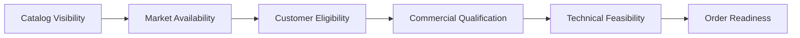

# Part 013 — Who Can Buy What, Where, When, and Under Which Conditions

## Positioning

Salah satu pertanyaan inti dalam CPQ adalah:

> Apakah offering ini dapat dijual kepada customer ini, di lokasi ini, melalui channel ini, pada waktu ini, dan dengan kondisi ini?

Masalahnya, pertanyaan tersebut sering disederhanakan menjadi:

```text
eligible = true / false
```

Padahal keputusan nyata dapat melibatkan:

- market availability;
- channel visibility;
- customer segment;
- contract entitlement;
- account status;
- product prerequisite;
- technical serviceability;
- capacity;
- compliance;
- and commercial exception.

> **Core thesis:** qualification adalah proses decisioning berlapis. Eligibility, availability, feasibility, and commercial approval harus dibedakan agar hasilnya explainable, reusable, dan tidak menyesatkan.

---

## 1. The Qualification Problem

Qualification determines whether a product or offering is:

- discoverable;
- selectable;
- configurable;
- quotable;
- orderable;
- or fulfillable.

These are not the same state.

---

## 2. Eligibility

Eligibility answers:

> Is this party or context allowed to use or buy this offering?

Possible inputs:

- customer segment;
- account type;
- contract;
- credit class;
- partner role;
- existing product;
- and policy.

---

## 3. Availability

Availability answers:

> Is this offering available in this market, channel, time, or location?

Possible inputs:

- geography;
- channel;
- launch window;
- inventory;
- service region;
- and market scope.

---

## 4. Feasibility

Feasibility answers:

> Can the requested product actually be realized?

Possible inputs:

- site;
- capacity;
- network;
- technical design;
- partner capability;
- and lead time.

---

## 5. Qualification

Qualification combines relevant decisions and produces a usable result.

It may answer:

- qualified;
- conditionally qualified;
- not qualified;
- more data required;
- or manual review required.

---

## 6. Discoverable versus Eligible

An offering may be visible for discovery but not eligible for purchase.

Example:

- user can see Premium Connectivity;
- but account does not meet minimum contract requirement.

---

## 7. Eligible versus Available

Customer may be eligible, but offering unavailable in region.

---

## 8. Available versus Feasible

Offering may be sold in the market, but a specific site is not technically feasible.

---

## 9. Feasible versus Orderable

A product may be technically feasible but not orderable because:

- price missing;
- approval pending;
- contract absent;
- or quote expired.

---

## 10. Qualification Layers

A practical layered model:



Layer order may vary by product and performance needs.

---

## 11. Catalog Visibility

Visibility controls whether offering appears to actor/context.

Inputs may include:

- tenant;
- market;
- channel;
- role;
- and launch state.

Visibility is not final qualification.

---

## 12. Market Availability

Checks:

- geography;
- brand;
- segment;
- channel;
- effective period;
- and market-specific restrictions.

---

## 13. Customer Eligibility

Checks:

- customer type;
- account state;
- contract;
- credit;
- ownership;
- and installed products.

---

## 14. Commercial Qualification

Checks:

- minimum commitment;
- product combination;
- discount policy;
- legal restrictions;
- and approval requirement.

---

## 15. Technical Feasibility

Checks:

- site serviceability;
- capacity;
- network support;
- device compatibility;
- and delivery constraints.

---

## 16. Regulatory Qualification

Checks may include:

- licensing;
- residency;
- data sovereignty;
- restricted geography;
- and industry rules.

---

## 17. Credit Qualification

Credit may determine:

- whether purchase is allowed;
- deposit required;
- payment term;
- or approval route.

Credit ownership is often external.

---

## 18. Contract Qualification

Existing agreement may:

- grant entitlement;
- restrict product;
- define price;
- or require amendment.

---

## 19. Inventory Qualification

Existing installed product may satisfy prerequisite.

Example:

- Static IP Add-On requires active Connectivity Product.

---

## 20. Channel Qualification

A product may be:

- partner-only;
- direct-only;
- marketplace-only;
- or unavailable through digital self-service.

---

## 21. Actor Qualification

Different actors may have different ability to:

- view;
- configure;
- quote;
- approve;
- and order.

---

## 22. Party Qualification

Need explicit party roles:

- buyer;
- bill-to;
- service user;
- partner;
- and legal customer.

---

## 23. Site Qualification

A site is more than address.

It may include:

- geocode;
- building;
- access point;
- existing service;
- jurisdiction;
- and local capacity.

---

## 24. Qualification Context

A request should carry:

```text
tenant
market
channel
actor
customer/account
site/place
date/time
existing products
requested action
offering/version
configuration inputs
```

---

## 25. Context Completeness

Qualification result quality depends on available context.

Missing context should not be treated as negative result automatically.

---

## 26. More Data Required

Possible result:

```text
status = NEEDS_MORE_INFORMATION
missing = [siteId, billingAccount]
```

This is better than false `NOT_ELIGIBLE`.

---

## 27. Qualification Result Model

A result may include:

- status;
- reason codes;
- conditions;
- alternatives;
- validity period;
- confidence;
- and source/version.

---

## 28. Result Status Taxonomy

Possible statuses:

- QUALIFIED;
- QUALIFIED_WITH_CONDITIONS;
- NOT_QUALIFIED;
- INDETERMINATE;
- MANUAL_REVIEW;
- NEEDS_MORE_INFORMATION.

---

## 29. Qualified with Conditions

Example:

> Qualified if customer accepts 90-day lead time and installation fee.

Conditions must be explicit.

---

## 30. Not Qualified

A not-qualified result should state:

- blocking reason;
- scope;
- and alternative where possible.

---

## 31. Indeterminate

Use when dependencies are unavailable or evidence is insufficient.

Do not conflate system failure with business ineligibility.

---

## 32. Manual Review

Use when automation cannot decide safely.

Need:

- owner;
- SLA;
- required evidence;
- and outcome semantics.

---

## 33. Reason Codes

Examples:

- MARKET_NOT_SUPPORTED;
- ACCOUNT_SUSPENDED;
- EXISTING_PRODUCT_REQUIRED;
- SITE_NOT_SERVICEABLE;
- CAPACITY_UNAVAILABLE;
- CONTRACT_REQUIRED;
- MANUAL_APPROVAL_REQUIRED.

---

## 34. Explainability

A qualification result should answer:

```text
What was checked?
Which data was used?
Which rule/version applied?
Why did it pass or fail?
What can the user do next?
```

---

## 35. Qualification Provenance

Store:

- rule version;
- source systems;
- request context;
- timestamp;
- and engine version.

---

## 36. Result Validity

Qualification can expire.

Example:

- capacity check valid for 24 hours;
- market eligibility valid until catalog change;
- credit check valid for 7 days.

---

## 37. Validity by Dimension

Different checks may have different validity periods.

Aggregate result should expose the shortest relevant validity or per-check validity.

---

## 38. Stale Qualification

A stale result should be:

- flagged;
- rechecked;
- or blocked depending on transition.

---

## 39. Requalification Trigger

Possible triggers:

- customer changed;
- site changed;
- product changed;
- quantity changed;
- date changed;
- catalog changed;
- contract changed;
- or validity expired.

---

## 40. Qualification Snapshot

A quote may snapshot:

- result;
- reasons;
- conditions;
- and validity.

Do not snapshot only boolean.

---

## 41. Live Recheck

Before acceptance or order conversion, some qualifications may need live recheck.

---

## 42. Preliminary Qualification

Used early in sales flow.

Fast, broad, possibly lower confidence.

---

## 43. Firm Qualification

Used before commitment.

Requires stronger evidence.

---

## 44. Progressive Qualification

Possible stages:

1. catalog visibility;
2. market qualification;
3. account qualification;
4. site feasibility;
5. detailed technical feasibility;
6. order readiness.

---

## 45. Indicative Result

An indicative result may support exploration but should be labeled non-binding.

---

## 46. Firm Result

A firm result may require:

- reservation;
- capacity hold;
- or validated external evidence.

---

## 47. Reservation

Qualification may reserve scarce resource temporarily.

This changes the process from query to command.

---

## 48. Query versus Reservation

### Query

Checks current possibility.

### Reservation

Mutates capacity or entitlement.

Keep contracts distinct.

---

## 49. Reservation Expiry

Reservation needs:

- owner;
- expiry;
- release;
- and idempotency.

---

## 50. Product Offering Qualification

A Product Offering Qualification request may include:

- one or many offerings;
- configuration;
- category;
- party;
- place;
- and requested action.

---

## 51. Single-Offering Qualification

Simpler response and caching.

---

## 52. Multi-Offering Qualification

Useful for:

- compare options;
- guided selling;
- and alternative suggestions.

Need partial results.

---

## 53. Batch Qualification

For large site/product combinations, batch processing may be asynchronous.

---

## 54. Per-Item Result

Each requested item should have independent status and reason.

Avoid one global failure.

---

## 55. Partial Qualification

Example:

- 17 of 20 sites qualified;
- 3 require manual feasibility.

The quote may proceed partially depending on business policy.

---

## 56. Alternative Offering

When not qualified, suggest:

- lower bandwidth;
- different access type;
- partner-delivered option;
- or successor product.

---

## 57. Alternative Ranking

Rank by:

- outcome fit;
- price;
- availability;
- and customer preference.

---

## 58. Recommendation versus Qualification

Recommendation ranks suitable options.

Qualification determines allowed/possible options.

Keep them separate.

---

## 59. Qualification Rule Types

- static catalog rule;
- account rule;
- contract rule;
- inventory rule;
- external feasibility;
- regulatory rule;
- and capacity rule.

---

## 60. Static Rule

Can be evaluated locally from catalog/context.

---

## 61. Dynamic Rule

Requires current external state.

Examples:

- capacity;
- credit;
- inventory;
- and serviceability.

---

## 62. Deterministic Rule

Same inputs produce same result.

---

## 63. Non-Deterministic Dependency

External availability may change.

Result validity must reflect this.

---

## 64. Rule Precedence

When multiple rules disagree, define:

- blocking rule;
- override;
- exception;
- or manual review.

---

## 65. Hard Eligibility Rule

Cannot be overridden.

Example:

- legal restriction.

---

## 66. Soft Commercial Rule

May allow approval-based exception.

---

## 67. Technical Feasibility Override

Be careful.

Human override does not create physical capacity.

---

## 68. Qualification Composition

Aggregate result can be computed from component checks.

Example:

```text
if any hard failure -> NOT_QUALIFIED
else if manual review -> MANUAL_REVIEW
else if conditions -> QUALIFIED_WITH_CONDITIONS
else -> QUALIFIED
```

---

## 69. Short-Circuit Evaluation

Short-circuit can improve performance.

But it may hide additional useful reasons.

Decide whether to return first failure or all failures.

---

## 70. All-Reasons Mode

Useful for user correction and batch processing.

More expensive.

---

## 71. Fast-Path Mode

Used for high-volume discovery.

May return only top-level eligibility.

---

## 72. Deep-Check Mode

Used before order commitment.

---

## 73. Qualification API

A request should be:

- idempotent;
- version-aware;
- and explicit about depth/mode.

---

## 74. Synchronous Qualification

Useful for low-latency checks.

Risk:

- external call chain;
- timeout;
- and cascading failure.

---

## 75. Asynchronous Qualification

Useful for:

- large sites;
- manual review;
- and long-running feasibility.

Need lifecycle and callback/polling.

---

## 76. Qualification Job

Possible states:

- Submitted;
- InProgress;
- PartiallyCompleted;
- Completed;
- Failed;
- Expired;
- Cancelled.

---

## 77. Timeout

Timeout should result in:

- indeterminate;
- pending;
- or retry state.

Not `NOT_QUALIFIED`.

---

## 78. Retry

Retry only transient dependency failures.

Keep original request identity.

---

## 79. Idempotency

Repeated request should not create duplicate reservation or manual review.

---

## 80. Caching

Cache static or stable qualification by:

- offering version;
- tenant;
- market;
- channel;
- context hash;
- and effective time.

---

## 81. Cache Risk

Customer/account/site-specific data can make cache unsafe.

---

## 82. Negative Caching

Not-qualified result may become stale quickly.

Use short TTL and reason-aware policy.

---

## 83. Invalidation

Possible invalidation events:

- catalog publication;
- customer/account update;
- inventory change;
- capacity change;
- contract update.

---

## 84. Privacy

Qualification may expose sensitive facts.

Example:

- credit failure;
- legal restriction;
- internal capacity.

Reason messages should be role-aware.

---

## 85. Field-Level Explainability

Sales may see:

> Additional review required.

Internal approver may see detailed reason.

---

## 86. Security

Ensure actor cannot qualify products for unauthorized tenant/customer.

---

## 87. Enumeration Attack

Public APIs can be abused to discover:

- customer products;
- serviceability;
- and market restrictions.

Use authorization and rate limits.

---

## 88. Qualification and Pricing

Price may depend on eligibility result.

But qualification should not necessarily compute price.

---

## 89. Qualification and Configuration

Configuration may need qualification at:

- offering selection;
- characteristic change;
- and final validation.

---

## 90. Qualification and Quote

Quote should preserve:

- result;
- conditions;
- and validity.

---

## 91. Qualification and Approval

A conditional result may trigger approval.

---

## 92. Qualification and Order

Order conversion may require:

- still-valid result;
- or live requalification.

---

## 93. Qualification and Inventory

Installed products may satisfy or block prerequisites.

---

## 94. Qualification and Catalog Lifecycle

Retired offering may be unqualified for ADD but qualified for MODIFY or TERMINATE.

Requested action matters.

---

## 95. Add versus Modify Qualification

### Add

Can customer acquire new product?

### Modify

Can existing product transition to target?

Different rules.

---

## 96. Upgrade Qualification

Needs:

- current product;
- target;
- contract;
- technical compatibility;
- and billing state.

---

## 97. Termination Qualification

May be blocked by:

- dependent products;
- contract term;
- and outstanding order.

---

## 98. Multi-Site Qualification

Need per-site result and aggregate policy.

---

## 99. Multi-Product Qualification

Dependencies among items may change qualification.

---

## 100. Portfolio Qualification

Customer’s installed portfolio can affect:

- bundle eligibility;
- upgrade;
- and volume terms.

---

## 101. External Feasibility Integration

Define:

- request schema;
- timeout;
- retry;
- result mapping;
- validity;
- and correlation.

---

## 102. Serviceability Provider

May return:

- serviceable;
- not serviceable;
- build required;
- manual survey;
- or unknown.

Map carefully.

---

## 103. Capacity Provider

May return:

- available;
- reserved;
- insufficient;
- or degraded.

---

## 104. Credit Provider

May return sensitive reason categories.

Do not expose raw internal response.

---

## 105. Contract Provider

May confirm:

- entitlement;
- negotiated product;
- and term.

---

## 106. Inventory Provider

May provide:

- active products;
- status;
- and relationships.

Projection lag matters.

---

## 107. Dependency Failure

If qualification dependency is unavailable:

- degrade gracefully;
- return indeterminate;
- or use bounded fallback.

---

## 108. Fallback

Possible fallback:

- cached recent result;
- manual review;
- or conservative block.

Document policy.

---

## 109. Circuit Breaker

Protect system from failing external qualification provider.

---

## 110. Bulkhead

Isolate slow provider from entire CPQ flow.

---

## 111. Qualification Metrics

Useful metrics:

- qualified rate;
- condition rate;
- manual-review rate;
- not-qualified reasons;
- latency;
- timeout;
- stale-result rate;
- and requalification rate.

---

## 112. Business Metrics

- lost opportunity by reason;
- serviceability rejection;
- approval-trigger rate;
- and alternative-offer conversion.

---

## 113. Operational Metrics

- dependency latency;
- cache hit;
- retry;
- and stuck qualification jobs.

---

## 114. Qualification SLI

Example:

> 95% of synchronous preliminary qualifications complete within 2 seconds.

Internal targets must be verified.

---

## 115. Qualification Incident

Examples:

- all customers marked ineligible;
- stale capacity result;
- wrong tenant rule;
- qualification timeout interpreted as rejection;
- and hidden manual-review queue.

---

## 116. Reconciliation

Compare qualification assumptions with:

- actual order acceptance;
- fulfillment outcome;
- and fallout.

This improves rules.

---

## 117. False Positive

Qualified but cannot fulfill.

---

## 118. False Negative

Not qualified but could have been fulfilled.

---

## 119. Qualification Accuracy

Track outcome-based accuracy carefully.

Some failures occur after qualification for unrelated reasons.

---

## 120. Qualification Smells

- one boolean result;
- no reason;
- no validity;
- timeout means false;
- all checks synchronous;
- customer-specific logic in UI;
- and no action context.

---

## 121. Anti-Patterns

### Eligibility equals visibility

User cannot discover alternatives.

### Feasibility as permanent truth

Dynamic state becomes stale.

### Manual review as dead-end

No owner or SLA.

### Reservation hidden in query

Retry creates duplicates.

### One global result

Partial site/product outcomes lost.

---

## 122. Qualification Request Template

```md
## Request Identity

## Tenant / Market / Channel

## Actor / Party / Account

## Requested Action

## Offering and Version

## Configuration

## Sites / Places

## Existing Products

## Effective Time

## Qualification Depth
```

---

## 123. Qualification Result Template

```md
## Overall Status

## Item Results

## Reason Codes

## Conditions

## Missing Information

## Alternatives

## Validity

## Confidence

## Source / Rule Versions

## Manual Review

## Reservations
```

---

## 124. Rule Result Template

```text
Rule:
Version:
Scope:
Input:
Outcome:
Blocking:
Reason:
Condition:
Validity:
Source:
```

---

## 125. Worked Example: Market Qualification

Offering available only for:

- enterprise segment;
- direct channel;
- Indonesia market;
- after launch date.

Result explains which condition failed.

---

## 126. Worked Example: Existing Product Requirement

Premium Monitoring requires active Managed Connectivity.

Qualification checks:

- inventory projection;
- same account;
- compatible site;
- active status.

---

## 127. Worked Example: Multi-Site Feasibility

20 sites:

- 15 qualified;
- 3 build required;
- 2 manual survey.

Overall result:

- QUALIFIED_WITH_CONDITIONS;
- site-level detail;
- lead-time condition.

---

## 128. Worked Example: Timeout

External feasibility times out.

Correct result:

- INDETERMINATE;
- retry scheduled;
- no false rejection.

---

## 129. Worked Example: Upgrade

Current product:

- 100 Mbps.

Target:

- 1 Gbps.

Checks:

- contract;
- router compatibility;
- access capacity;
- target offering availability;
- and approval.

---

## 130. Worked Example: Reservation

Capacity check reserves one port for 2 hours.

Request is a command with idempotency key.

Expiry releases capacity.

---

## 131. Senior Engineer Operating Model

### Separate decision types

Eligibility, availability, feasibility, and readiness.

### Avoid booleans

Use rich results.

### Preserve provenance and validity

Results age.

### Treat timeout as unknown

Not business rejection.

### Model partial outcomes

Per item/site.

### Distinguish query and reservation

Mutation requires stronger semantics.

### Secure explanations

Role-aware reasons.

### Learn from fulfillment

Reduce false positives/negatives.

---

## 132. Internal Verification Checklist

### Qualification scope

- What is visibility versus qualification?
- What checks occur before configuration?
- What checks occur before acceptance/order?
- Are ADD/MODIFY/TERMINATE handled differently?

### Rules

- Which checks are static?
- Which require external systems?
- Which are hard versus overrideable?
- How is precedence resolved?

### Result

- What statuses exist?
- Are reason codes stable?
- Are conditions and alternatives returned?
- Is confidence or completeness represented?

### Validity

- How long are results valid?
- What triggers requalification?
- Are stale results visible?
- Is live recheck required?

### Integration

- Which providers are called?
- What are timeout/retry/fallback policies?
- Is async qualification supported?
- Are reservations idempotent?

### Security

- Are reasons role-aware?
- Is tenant/account authorization enforced?
- Are sensitive credit/capacity details protected?

### Operations

- Are manual-review queues monitored?
- Are false positive/negative outcomes analyzed?
- Are qualification jobs traceable?
- What SLI/SLO exists?

---

## 133. Practical Exercises

### Exercise 1 — Layer map

Separate visibility, availability, eligibility, feasibility, and order readiness.

### Exercise 2 — Rich result

Replace boolean qualification with a complete result contract.

### Exercise 3 — Multi-site result

Design partial qualification for 100 sites.

### Exercise 4 — Timeout policy

Define behavior for unavailable feasibility provider.

### Exercise 5 — Reservation command

Model capacity reservation with idempotency and expiry.

### Exercise 6 — Requalification matrix

Map changes that invalidate each qualification dimension.

---

## 134. Part Completion Checklist

You are done if you can:

- distinguish eligibility, availability, feasibility, and qualification;
- model rich qualification results;
- handle missing information and indeterminate outcomes;
- preserve reason, provenance, and validity;
- support partial and conditional results;
- distinguish preliminary and firm qualification;
- design sync and async flows;
- separate query from reservation;
- secure role-aware explanations;
- and create an internal qualification verification backlog.

---

## 135. Key Takeaways

1. Qualification is layered decisioning.
2. Visibility is not eligibility.
3. Eligibility is not feasibility.
4. Feasibility is not order readiness.
5. Boolean results are insufficient.
6. Timeout means unknown, not rejection.
7. Qualification results expire.
8. Partial results are essential for complex deals.
9. Reservation is a command, not a query.
10. Internal qualification rules and providers must be verified.

---

## 136. References

Conceptual baseline:

- General CPQ eligibility, availability, qualification, and technical-feasibility practices.
- Decision systems, policy evaluation, cache validity, and external dependency resilience.
- TM Forum Product Offering Qualification vocabulary and request/result patterns.
- Distributed systems idempotency, timeout, retry, and asynchronous job concepts.

These references do not define internal CSG qualification workflows or providers.
