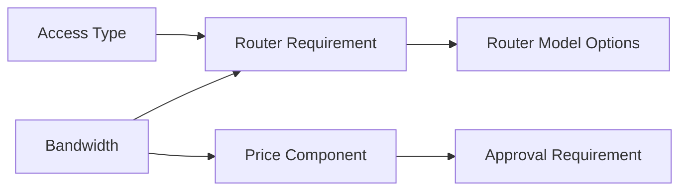

# Part 015 — Constraint Solving, Validation Taxonomy, Conflict Resolution, and Explanations

## Positioning

Configuration engine tidak cukup hanya menjawab:

```text
valid = true / false
```

Enterprise CPQ membutuhkan engine yang dapat menjawab:

- constraint mana yang dievaluasi;
- input apa yang digunakan;
- rule mana yang gagal;
- mengapa kombinasi tidak valid;
- perubahan apa yang menyebabkan invalidation;
- alternatif apa yang tersedia;
- dan apakah sistem boleh memperbaiki konfigurasi secara otomatis.

Tanpa model evaluation yang kuat, rule logic akan tersebar di:

- UI;
- catalog metadata;
- pricing;
- quote validation;
- order mapping;
- dan manual operating procedure.

> **Core thesis:** constraint evaluation harus deterministic, versioned, incrementally computable, conflict-aware, dan explainable. Validasi yang tidak dapat menjelaskan keputusan adalah production risk.

---

## 1. Constraint

A constraint defines a condition that must or should hold.

Examples:

- bandwidth must be within allowed range;
- Premium Support requires Managed Service;
- Fiber and Wireless Access cannot coexist at the same site;
- exactly one access option must be selected;
- quote total must reconcile to price components.

---

## 2. Rule

A rule is executable logic that evaluates inputs and produces:

- validation result;
- derived value;
- recommendation;
- relationship effect;
- or workflow trigger.

A rule can implement one or more constraints.

---

## 3. Constraint versus Policy

### Constraint

Represents a condition that must hold.

Example:

> A router profile cannot support more than its technical capacity.

### Policy

Represents business governance that may permit exception.

Example:

> Discount above 20% requires approval.

Do not model overrideable policy as absolute technical impossibility.

---

## 4. Hard Constraint

A hard constraint blocks progression.

Examples:

- missing required characteristic;
- mutually exclusive products selected;
- invalid quantity;
- unsupported unit;
- illegal lifecycle transition.

---

## 5. Soft Constraint

A soft constraint does not necessarily block.

Examples:

- recommendation;
- commercial warning;
- suboptimal selection;
- non-preferred supplier;
- low-margin configuration.

---

## 6. Advisory Rule

An advisory rule produces information or recommendation.

It should not silently mutate configuration.

---

## 7. Derivation Rule

A derivation rule calculates a value.

Example:

```text
premiumSupportSelected = true
-> monitoringEnabled = true
```

The derived value needs provenance.

---

## 8. Eligibility Rule

Determines whether an offering, option, or action is allowed in context.

---

## 9. Relationship Rule

Activates or validates:

- requires;
- excludes;
- recommends;
- substitutes;
- and upgrade paths.

---

## 10. Pricing-Relevant Rule

Determines whether configuration should:

- include a charge;
- select a rate;
- qualify for discount;
- or invalidate price.

Pricing calculation remains a separate concern.

---

## 11. Approval-Relevant Rule

Determines whether a commercial exception requires approval.

---

## 12. Fulfillment-Relevant Rule

Determines:

- decomposition choice;
- technical requirement;
- or order readiness.

Avoid executing fulfillment side effects inside configuration validation.

---

## 13. Validation Taxonomy

Useful validation categories:

1. Structural validation.
2. Type validation.
3. Cardinality validation.
4. Range validation.
5. Relationship validation.
6. Cross-characteristic validation.
7. Cross-item validation.
8. Context validation.
9. Eligibility validation.
10. Temporal validation.
11. Pricing completeness.
12. Commercial policy validation.
13. Orderability validation.
14. Integration readiness.

---

## 14. Structural Validation

Checks whether the configuration graph is structurally valid.

Examples:

- no orphan node;
- all mandatory parent-child relations present;
- no invalid child type;
- no cycle where cycles are forbidden.

---

## 15. Type Validation

Checks that values match declared type.

Examples:

- Integer;
- Decimal;
- Enum;
- Date;
- Quantity;
- Money;
- Reference.

---

## 16. Cardinality Validation

Checks:

- minimum;
- maximum;
- required;
- uniqueness;
- collection size;
- and component occurrence count.

---

## 17. Range Validation

Checks:

- minimum;
- maximum;
- step;
- precision;
- and allowed unit.

---

## 18. Relationship Validation

Checks:

- requires;
- excludes;
- compatibility;
- and dependency satisfaction.

---

## 19. Cross-Characteristic Validation

Example:

```text
if resilience = GEO_REDUNDANT
then regionCount >= 2
```

---

## 20. Cross-Item Validation

Example:

> All site items in one package must use the same support tier.

---

## 21. Context Validation

Checks whether required context exists and is internally consistent.

Examples:

- tenant;
- market;
- channel;
- customer;
- site;
- requested action.

---

## 22. Eligibility Validation

Checks whether offering or action is allowed.

This may invoke qualification results.

---

## 23. Temporal Validation

Checks:

- effective periods;
- quote validity;
- rule validity;
- and stale external results.

---

## 24. Pricing Completeness

Checks whether all price-relevant inputs are available.

It does not necessarily calculate the final price.

---

## 25. Commercial Policy Validation

Checks:

- discount threshold;
- contract exception;
- and approval requirements.

---

## 26. Orderability Validation

Checks whether configuration can be transformed into an executable Product Order.

---

## 27. Integration Readiness

Checks whether required external contract, reference, or identifier is available.

---

## 28. Validation Timing

Validation may occur:

- during catalog publication;
- at session creation;
- after each change;
- before pricing;
- before quote save;
- before approval;
- before acceptance;
- before order conversion;
- and before fulfillment.

---

## 29. Design-Time Validation

Executed when catalog/rules are authored.

Examples:

- contradictory relationships;
- unreachable option;
- missing reference;
- rule cycles.

---

## 30. Runtime Validation

Executed against customer-specific configuration.

---

## 31. Transition Validation

Executed before lifecycle transition.

Example:

- SubmitForApproval;
- PresentQuote;
- AcceptQuote;
- ConvertToOrder.

---

## 32. Continuous Validation

Revalidates incrementally as user changes configuration.

---

## 33. Deferred Validation

Some expensive checks run only:

- on demand;
- before commit;
- or asynchronously.

---

## 34. Validation Depth

Possible modes:

- lightweight;
- standard;
- deep;
- and production-readiness.

---

## 35. Fast Validation

Useful for interactive UI.

May check local constraints only.

---

## 36. Deep Validation

May include:

- external qualification;
- cross-item rules;
- pricing completeness;
- and order mapping.

---

## 37. Validation Scope

A validation can target:

- one value;
- one node;
- one subtree;
- one quote;
- one customer portfolio;
- or one order conversion.

---

## 38. Rule Input

Every rule should declare inputs.

Examples:

- characteristic value;
- selected component;
- market;
- customer segment;
- existing inventory;
- effective time;
- and catalog version.

---

## 39. Rule Output

Possible outputs:

- pass/fail;
- severity;
- reason;
- derived value;
- recommendation;
- auto-correction proposal;
- and dependency invalidation.

---

## 40. Rule Purity

Prefer rules that:

- read declared inputs;
- produce deterministic output;
- and have no side effects.

---

## 41. Side-Effectful Rule Risk

A rule that:

- calls external service;
- writes state;
- sends event;
- or allocates resource

is hard to replay and explain.

Separate decision from effect.

---

## 42. External Fact Adapter

If external data is required:

- fetch through adapter;
- snapshot result;
- record validity;
- and pass as explicit rule input.

---

## 43. Determinism

The same:

- inputs;
- catalog publication;
- rule versions;
- engine version;
- and time context

should produce the same output.

---

## 44. Hidden Non-Determinism

Common causes:

- current system time;
- unordered collections;
- random tie-breaking;
- live external state;
- mutable caches;
- and unspecified floating-point behavior.

---

## 45. Evaluation Context

A complete evaluation context may contain:

```text
tenant
market
channel
actor
customer/account
sites
existing products
requested action
effective time
catalog publication
rule set version
engine version
```

---

## 46. Evaluation Identity

A validation run may need identity for:

- audit;
- debugging;
- and comparison.

---

## 47. Evaluation Snapshot

Store:

- input hash;
- rule versions;
- output;
- time;
- and affected configuration version.

---

## 48. Dependency Graph

A dependency graph represents which rules or derived values depend on which inputs.



---

## 49. Dependency Node

A node can represent:

- input value;
- derived value;
- constraint;
- qualification result;
- price preview;
- or recommendation.

---

## 50. Dependency Edge

An edge states:

> Changes to A may invalidate B.

---

## 51. Dirty Propagation

When input changes:

1. mark direct dependents dirty;
2. propagate through graph;
3. recompute in dependency order;
4. update results.

---

## 52. Topological Evaluation

A directed acyclic graph can be evaluated in topological order.

---

## 53. Cyclic Dependency

A cycle may occur:

```text
A derives B
B constrains C
C changes A
```

This can cause non-termination.

---

## 54. Cycle Handling

Options:

- reject at publication;
- require fixed-point evaluation;
- break through explicit stage;
- or model one value as input.

---

## 55. Fixed-Point Evaluation

Repeatedly evaluate until no result changes.

Need:

- convergence proof;
- iteration limit;
- and diagnostic on failure.

---

## 56. Incremental Evaluation

Only recompute impacted rules.

Benefits:

- lower latency;
- better interactive experience.

Risks:

- dependency graph bugs;
- stale results;
- and hard debugging.

---

## 57. Full Evaluation

Recomputes all rules.

Benefits:

- simpler correctness model.

Risks:

- performance.

---

## 58. Hybrid Evaluation

Use incremental during editing and full validation before commit.

---

## 59. Cacheable Rule Result

Safe when key includes all declared dependencies and versions.

---

## 60. Cache Key

Possible components:

- rule ID/version;
- input hash;
- context hash;
- catalog publication;
- engine version;
- effective time bucket.

---

## 61. Cache Invalidation

Dependency graph should drive invalidation.

Avoid time-only TTL for deterministic local rules.

---

## 62. Rule Priority

Priority determines order only when order has domain meaning.

Do not use priority to hide contradictory rules.

---

## 63. Rule Phase

Better than one numeric priority:

- normalize;
- default;
- derive;
- constrain;
- qualify;
- recommend;
- summarize.

---

## 64. Phase Ordering

Example:

```text
1. Normalize values
2. Apply explicit defaults
3. Derive dependent values
4. Validate local constraints
5. Validate cross-item constraints
6. Evaluate qualification
7. Produce recommendations
```

---

## 65. Priority within Phase

Use sparingly and document semantics.

---

## 66. Conflict

A conflict exists when rules produce incompatible results.

Examples:

- one rule requires B;
- another excludes B;
- one rule derives value X;
- another derives value Y;
- two price-trigger rules claim exclusivity.

---

## 67. Conflict Types

- direct contradiction;
- unsatisfiable requirement;
- competing derivation;
- cardinality conflict;
- temporal conflict;
- scope conflict;
- and override conflict.

---

## 68. Conflict Detection Time

Detect at:

- catalog publication;
- session evaluation;
- quote validation;
- and migration.

---

## 69. Static Conflict Detection

Works when rules and inputs are finite or analyzable.

---

## 70. Dynamic Conflict Detection

Occurs only under specific runtime context.

Need contextual diagnostic.

---

## 71. Conflict Resolution

Possible strategies:

- reject configuration;
- higher-specificity rule;
- explicit override;
- ask user;
- create manual review;
- or choose safe fallback.

---

## 72. Specificity

A tenant-specific rule may override market rule only if governance permits.

---

## 73. Override

An override should reference:

- base rule;
- scope;
- reason;
- effective period;
- and owner.

---

## 74. Conflict Explanation

Explain:

```text
Rule A requires Router X.
Rule B excludes Router X for Market Y.
The selected combination has no valid solution.
```

---

## 75. Unsatisfiable Configuration

A configuration is unsatisfiable when no valid assignment exists.

---

## 76. Constraint Solving

A solver may search for assignments satisfying all constraints.

Useful for:

- large option spaces;
- capacity choices;
- and optimized recommendation.

---

## 77. Rule Evaluation versus Constraint Solver

### Rule evaluation

Applies deterministic rules to current selection.

### Constraint solving

Searches possible selections.

Do not use a solver where simple validation is enough.

---

## 78. Solver Inputs

- variables;
- domains;
- constraints;
- objective;
- and context.

---

## 79. Solver Output

- valid assignment;
- no solution;
- partial solution;
- alternatives;
- and explanation.

---

## 80. Optimization Objective

Possible objectives:

- lowest price;
- highest margin;
- shortest lead time;
- preferred vendor;
- or minimum change.

Make objective explicit.

---

## 81. Multiple Valid Solutions

Return:

- alternatives;
- ranking;
- and trade-offs.

Do not silently pick arbitrary first result.

---

## 82. Search Space

Configuration space can grow combinatorially.

---

## 83. Pruning

Reduce search using:

- early constraints;
- domain partitioning;
- and known incompatibilities.

---

## 84. Heuristics

Heuristics improve performance but may affect solution selection.

Record and test them.

---

## 85. Solver Timeout

Return:

- partial;
- indeterminate;
- or no-result.

Do not report “no valid configuration” when search merely timed out.

---

## 86. Explainability

Explainability has levels:

1. Which rule fired?
2. Which inputs caused it?
3. Why is it relevant?
4. What can user do?
5. What changed since prior result?

---

## 87. Diagnostic Result

A useful diagnostic includes:

- code;
- severity;
- scope;
- rule;
- affected entities;
- evidence;
- and suggested action.

---

## 88. Reason Code

Stable machine-readable code.

Example:

```text
REQUIRES_HIGH_CAPACITY_ROUTER
```

---

## 89. User Message

Localized and role-aware explanation.

---

## 90. Technical Detail

Support or engineering may see:

- rule ID;
- version;
- dependency trace;
- and input values.

Customer should not see internal implementation detail.

---

## 91. Explanation Tree

A result may include causal chain:

```text
Premium Support selected
-> Managed Service required
-> Managed Router required
-> Current router incompatible
```

---

## 92. Provenance Chain

For derived value:

```text
monitoringEnabled = true
because Premium Support selected
under rule SUPPORT-12 v4
```

---

## 93. Delta Explanation

Explain why validity changed after an edit.

Example:

> Configuration became invalid because bandwidth changed from 500 Mbps to 1 Gbps, which requires a high-capacity router.

---

## 94. Suggested Resolution

Possible suggestions:

- add required component;
- remove conflicting component;
- choose compatible value;
- refresh qualification;
- or request exception.

---

## 95. Recommendation Ranking

Recommendations should state ranking criteria.

---

## 96. Auto-Correction

System may automatically:

- normalize unit;
- add mandatory child;
- remove impossible default;
- or derive value.

---

## 97. Safe Auto-Correction

Safe when:

- deterministic;
- reversible;
- low impact;
- and transparent.

---

## 98. Unsafe Auto-Correction

Unsafe when it changes:

- product;
- price;
- term;
- customer commitment;
- or fulfillment outcome

without explicit confirmation.

---

## 99. Correction Proposal

Prefer:

```text
Proposed changes:
- Add Managed Router
- Remove Standard Router

Reason:
1 Gbps requires high-capacity device.
```

---

## 100. Confirmation

High-impact correction should require user confirmation.

---

## 101. Audit of Auto-Correction

Record:

- rule;
- previous state;
- new state;
- actor/system;
- and time.

---

## 102. Validation Result Lifecycle

A result can be:

- current;
- stale;
- superseded;
- or invalidated.

---

## 103. Result Version

Tie result to:

- configuration version;
- context version;
- and rule set version.

---

## 104. Result Invalidation

Triggered by:

- value change;
- context change;
- catalog change;
- qualification expiry;
- or rule update.

---

## 105. Blocking Result

Prevents specific transition.

It may not block all editing.

---

## 106. Warning Result

Allows progress but requires visibility.

---

## 107. Acknowledged Warning

Some warnings may require explicit acknowledgment.

---

## 108. Waiver

A waiver allows controlled exception.

Need:

- authority;
- scope;
- reason;
- validity;
- and audit.

---

## 109. Waiver Invalidation

Changes to affected inputs may invalidate waiver.

---

## 110. Validation and Approval

A policy result may create approval request rather than hard failure.

---

## 111. Validation and Pricing

A configuration can be structurally valid but unpriced.

---

## 112. Validation and Qualification

A configuration can be valid but not qualified.

---

## 113. Validation and Orderability

A quote can be accepted but temporarily not orderable if external readiness expired.

This requires careful business policy.

---

## 114. Centralized Rule Engine

Benefits:

- shared governance;
- consistent semantics.

Risks:

- latency;
- single bottleneck;
- and domain ownership dilution.

---

## 115. Distributed Rule Evaluation

Rules live in domain services.

Benefits:

- local ownership;
- autonomy.

Risks:

- inconsistent results;
- duplicated logic;
- and difficult global explanation.

---

## 116. Embedded Catalog Rules

Rules travel with catalog publication.

Benefits:

- version alignment.

Risks:

- interpreter complexity;
- and cross-domain leakage.

---

## 117. Hybrid Architecture

Common approach:

- catalog supplies declarative constraints;
- domain services enforce invariants;
- external qualification provides dynamic facts;
- quote validates transition readiness.

---

## 118. Rule Ownership Matrix

| Rule Type | Likely Owner |
|---|---|
| Characteristic type/range | Catalog/Product |
| Product compatibility | Product/Catalog |
| Customer eligibility | Commercial policy |
| Technical feasibility | Fulfillment/network |
| Discount approval | Pricing/Commercial |
| Aggregate invariant | Domain service |

---

## 119. Shared Rule Duplication

If same rule exists in UI, API, and order service:

- drift is likely.

Use shared source of semantics or contract tests.

---

## 120. Client-Side Validation

Useful for responsiveness.

It cannot be the only enforcement for critical rules.

---

## 121. Server-Side Validation

Authoritative for domain transitions.

---

## 122. Database Constraints

Useful defense for:

- uniqueness;
- nullability;
- and structural integrity.

Not sufficient for complex commercial rules.

---

## 123. Reconciliation Validation

Detects invalid states that escaped earlier controls.

---

## 124. Rule Testing

Test layers:

- rule unit;
- decision table;
- scenario;
- property-based;
- mutation;
- integration;
- and production shadow.

---

## 125. Rule Unit Test

Tests one rule with explicit inputs.

---

## 126. Decision Table Test

Checks:

- completeness;
- overlap;
- and output.

---

## 127. Scenario Test

Tests realistic configuration path.

---

## 128. Property-Based Test

Properties:

- invalid combination never passes;
- defaulted value always belongs to allowed domain;
- same inputs produce same outputs;
- incremental and full evaluation agree.

---

## 129. Differential Test

Compare:

- old engine versus new engine;
- current rule set versus candidate rule set;
- incremental versus full evaluation.

---

## 130. Mutation Test

Modify rule or condition intentionally to verify tests detect behavior change.

---

## 131. Golden Configuration

Critical configuration with expected:

- structure;
- validation;
- price-trigger inputs;
- qualification;
- and order mapping.

---

## 132. Combinatorial Testing

Use pairwise or risk-based combinations rather than exhaustive enumeration where space is huge.

---

## 133. Boundary Testing

Test min/max, just-below, exactly, and just-above values.

---

## 134. Conflict Test

Create deliberate contradiction and verify diagnostic.

---

## 135. Cycle Test

Verify publication rejects non-converging dependency cycle.

---

## 136. Performance Testing

Measure:

- local validation;
- full configuration;
- incremental change;
- solver;
- and explanation generation.

---

## 137. Large Configuration Test

Include thousands of sites/nodes and repeated constraints.

---

## 138. Rule Coverage

Track:

- rule executed;
- pass/fail;
- context;
- and scenario coverage.

Avoid using coverage as sole quality metric.

---

## 139. Production Shadow Evaluation

Evaluate candidate rules without affecting user outcome.

Compare result drift.

---

## 140. Rule Rollout

Use:

- publication;
- canary tenant;
- shadow;
- feature flag;
- and rollback.

---

## 141. Rule Observability

Metrics:

- evaluation latency;
- failure rate;
- rule-trigger count;
- conflict count;
- stale-result count;
- auto-correction count;
- and solver timeout.

---

## 142. Business Observability

- most common invalid combinations;
- recommendation acceptance;
- waiver rate;
- and configuration abandonment after error.

---

## 143. Diagnostic Trace

Support should retrieve:

- configuration version;
- rules evaluated;
- failures;
- and explanation chain.

---

## 144. Trace Size

Avoid retaining huge verbose traces indefinitely.

Use:

- summary;
- sampled detailed trace;
- and secure on-demand diagnostics.

---

## 145. Sensitive Data

Rule inputs may include:

- credit;
- margin;
- customer classification;
- and network detail.

Apply role-based explanation.

---

## 146. Tenant Isolation

Rule cache, trace, and diagnostics must remain tenant-scoped.

---

## 147. Rule Incident

Examples:

- every configuration invalid;
- conflicting rules after publication;
- incremental engine returns stale result;
- solver timeout misreported as no solution;
- and hidden auto-correction changes price.

---

## 148. Recovery

Options:

- roll back rule publication;
- disable problematic rule;
- force full revalidation;
- clear caches;
- migrate affected sessions.

---

## 149. Reconciliation after Rule Incident

Identify:

- open sessions;
- draft quotes;
- approved quotes;
- and created orders

affected by rule output.

---

## 150. Validation Smells

- boolean only;
- no scope;
- no reason;
- one giant validate method;
- UI-only checks;
- and no result version.

---

## 151. Rule Smells

- hidden current time;
- magic priority numbers;
- side effects;
- tenant IDs in code;
- no owner;
- and no historical version.

---

## 152. Explanation Smells

- generic “invalid configuration”;
- internal stack trace shown to user;
- no suggested action;
- and reason changes by environment.

---

## 153. Solver Smells

- arbitrary first solution;
- timeout equals unsatisfiable;
- objective undocumented;
- and no deterministic tie-breaking.

---

## 154. Anti-Patterns

### Rules Everywhere

Same policy duplicated across services.

### One Global Rule Engine

All domain ownership centralized.

### Validation as Workflow

Rules mutate state and call downstream services.

### Auto-Fix Everything

Customer intent silently changed.

### Incremental-Only Trust

No full-validation consistency check.

---

## 155. Rule Definition Template

```md
## Rule ID and Version

## Domain Owner

## Type

## Scope

## Inputs

## Condition

## Output

## Severity

## Phase / Priority

## Effective Period

## Explanation

## Suggested Resolution

## Exception Policy

## Dependencies

## Tests
```

---

## 156. Validation Result Template

```md
## Evaluation ID

## Configuration Version

## Overall Status

## Issues

For each issue:
- Code
- Severity
- Scope
- Rule/version
- Affected entities
- Evidence
- Explanation
- Suggested resolution
- Blocking transitions

## Derived Changes

## Warnings

## Stale Dependencies

## Evaluation Versions
```

---

## 157. Dependency Graph Template

```text
Node:
Type:
Depends on:
Invalidated by:
Evaluation phase:
Cacheable:
Owner:
```

---

## 158. Conflict Record Template

```text
Conflict ID:
Rules:
Context:
Affected entities:
Conflict type:
Explanation:
Resolution policy:
Owner:
```

---

## 159. Worked Example: Router Requirement

Input:

- bandwidth changes to 1 Gbps.

Evaluation:

- rule requires high-capacity router;
- current router incompatible;
- configuration becomes invalid.

Explanation:

> 1 Gbps requires Router Class H. Replace Standard Router or lower bandwidth.

---

## 160. Worked Example: Tenant Override

Global rule:

- Premium Support requires Managed Service.

Tenant contract:

- Dedicated Access includes managed operations.

Resolution:

- explicit tenant-scoped override;
- explanation references contract policy.

---

## 161. Worked Example: Cycle

Rule A derives B.

Rule B derives C.

Rule C modifies A.

Publication rejects cycle because convergence is not guaranteed.

---

## 162. Worked Example: Incremental Recalculation

User changes one site bandwidth.

Engine recalculates:

- site router;
- site price-trigger input;
- quote-level volume threshold;
- and approval requirement.

Unrelated sites remain cached.

---

## 163. Worked Example: Solver Timeout

Solver searches 10,000 combinations and reaches time limit.

Correct result:

- INDETERMINATE;
- partial alternatives;
- diagnostic timeout.

Incorrect:

- NO_VALID_CONFIGURATION.

---

## 164. Worked Example: Safe Auto-Correction

User enters 1 Gbps.

System normalizes to 1000 Mbps and records original input.

No business meaning changes.

---

## 165. Worked Example: Unsafe Auto-Correction

System replaces expensive Premium Support with Standard Support to satisfy budget.

This changes commercial intent and requires explicit user choice.

---

## 166. Senior Engineer Operating Model

### Classify rules

Constraint, policy, derivation, recommendation, or trigger.

### Demand declared inputs

Eliminate ambient state.

### Protect determinism

Version rules and context.

### Separate decision from side effect

Keep evaluation pure.

### Build dependency graph

Enable safe incremental recomputation.

### Make conflicts first-class

Do not hide them with priorities.

### Design explanations

For user, support, and audit.

### Compare incremental with full evaluation

Continuously verify correctness.

### Operate the engine

Metrics, rollback, trace, and reconciliation.

---

## 167. Internal Verification Checklist

### Architecture

- Is evaluation centralized, distributed, embedded, or hybrid?
- Which engine/DSL/library is used?
- Who owns rule semantics?
- Where are aggregate invariants enforced?

### Taxonomy

- Are hard, soft, derivation, recommendation, and approval rules distinguished?
- Are validation categories explicit?
- What lifecycle transitions use which validation depth?

### Dependency and performance

- Is a dependency graph maintained?
- Is evaluation full or incremental?
- How are cycles detected?
- How is cache invalidation handled?

### Conflict

- How are contradictions detected?
- What determines precedence?
- Are overrides explicit and versioned?
- Can publication be rejected?

### Explainability

- Are reason codes stable?
- Are explanation chains available?
- Are suggested resolutions provided?
- Are explanations role-aware?

### Testing

- Are golden configurations maintained?
- Are incremental/full results compared?
- Are combinatorial, property-based, conflict, and performance tests used?
- Is shadow evaluation available?

### Operations

- What metrics exist?
- Can rule versions be rolled back?
- How are affected sessions/quotes identified?
- Can support inspect evaluation trace safely?

---

## 168. Practical Exercises

### Exercise 1 — Validation taxonomy

Classify 30 current checks by category and timing.

### Exercise 2 — Dependency graph

Map how one bandwidth change affects router, price, approval, and orderability.

### Exercise 3 — Conflict model

Create requires/excludes contradiction with explicit diagnostic.

### Exercise 4 — Incremental versus full

Design a consistency test between both evaluation modes.

### Exercise 5 — Explanation tree

Produce user, support, and audit explanations for one invalid configuration.

### Exercise 6 — Solver boundary

Choose one problem suitable for a solver and one better handled by simple rules.

---

## 169. Part Completion Checklist

You are done if you can:

- distinguish constraint, rule, and policy;
- classify validation types;
- define validation timing and scope;
- design deterministic rule inputs and outputs;
- build dependency graphs;
- support incremental evaluation;
- detect cycles and conflicts;
- produce actionable explanations;
- distinguish safe and unsafe auto-correction;
- test and operate a production rule engine;
- and create an internal evaluation verification backlog.

---

## 170. Key Takeaways

1. Validation is richer than valid/invalid.
2. Constraints, policies, derivations, and recommendations differ.
3. Declared inputs enable determinism.
4. Dependency graphs enable incremental evaluation.
5. Priority should not hide contradiction.
6. Solver timeout is not proof of unsatisfiability.
7. Explanations are part of product behavior.
8. Auto-correction must preserve customer intent.
9. Full and incremental evaluation should agree.
10. Internal CSG rule architecture must be verified.

---

## 171. References

Conceptual baseline:

- General CPQ configuration, validation, rule-engine, and constraint-solving practices.
- Dependency graphs, incremental computation, fixed-point evaluation, and solver concepts.
- Domain-Driven Design policies, invariants, and domain services.
- Production rule governance, explainability, canary rollout, and observability practices.

These references do not define internal CSG rule-engine implementation.
