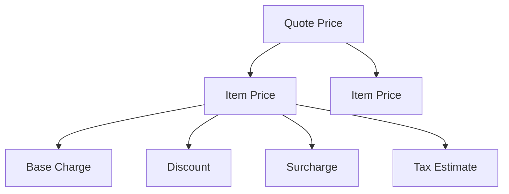

# Part 016 — Price Components, Charges, Rates, Adjustments, and Totals

## Positioning

Pricing domain sering direduksi menjadi:

```text
price = 100
```

Model tersebut tidak cukup untuk enterprise CPQ.

Commercial price dapat tersusun dari:

- base price;
- one-time charge;
- recurring charge;
- usage rate;
- allowance;
- discount;
- surcharge;
- tax estimate;
- rounding adjustment;
- and negotiated override.

Setiap komponen membutuhkan:

- type;
- source;
- quantity;
- unit;
- period;
- currency;
- effective time;
- and provenance.

> **Core thesis:** pricing model harus mempertahankan struktur dan provenance. Total adalah hasil, bukan sumber kebenaran tunggal.

---

## 1. Pricing Domain

Pricing domain determines commercial monetary output for a specific context.

It answers:

```text
What is being charged?
Why?
How much?
In which currency?
For what quantity or period?
Under which rule and validity?
```

---

## 2. Price Definition

A Price Definition describes how a price component can be calculated or selected.

Possible fields:

- identity;
- version;
- charge type;
- amount/rate;
- currency;
- unit;
- period;
- condition;
- and effective period.

---

## 3. Calculated Price

A Calculated Price is the result of evaluating price definitions in context.

It should preserve:

- source definition;
- input quantity;
- calculation;
- adjustments;
- and result.

---

## 4. Price Definition versus Calculated Price

### Definition

Reusable commercial rule.

### Calculated Price

Transaction-specific output.

Do not store them as the same entity.

---

## 5. Price Component

A Price Component is one monetary contribution to a result.

Examples:

- monthly access charge;
- installation fee;
- discount;
- surcharge;
- tax estimate;
- and rounding adjustment.

---

## 6. Charge

A Charge represents an amount or obligation associated with product or service.

Charge may be:

- quoted;
- ordered;
- activated;
- billed;
- adjusted;
- or reversed

at different lifecycle stages.

---

## 7. Rate

A Rate defines monetary amount per unit.

Example:

```text
0.05 USD per GB
```

---

## 8. Amount

A fixed monetary value.

Example:

```text
100 USD
```

---

## 9. Money

Money is a value object:

```text
amount
currency
```

Use decimal arithmetic, not binary floating point.

---

## 10. Currency

Currency should use stable code such as ISO 4217 where applicable.

Need policy for:

- minor units;
- precision;
- and conversion.

---

## 11. Quantity

Quantity includes:

- numeric value;
- unit;
- and scale.

Example:

```text
20 sites
```

---

## 12. Unit

Unit gives rate or quantity meaning.

Examples:

- site;
- user;
- device;
- Mbps;
- GB;
- month;
- transaction.

---

## 13. Charge Type

Useful categories:

- one-time;
- recurring;
- usage;
- penalty;
- fee;
- credit;
- allowance;
- and deposit.

---

## 14. One-Time Charge

Applied once for an event or setup.

Examples:

- installation;
- activation;
- equipment;
- migration.

---

## 15. Recurring Charge

Applied repeatedly by period.

Examples:

- monthly subscription;
- annual support;
- recurring site fee.

---

## 16. Usage Charge

Depends on measured consumption.

Examples:

- GB;
- minute;
- API call;
- message;
- transaction.

---

## 17. Fee

A fee may be:

- administrative;
- regulatory;
- and service-related.

Define whether it is product price, tax, or external charge.

---

## 18. Deposit

A deposit may be refundable and should not be conflated with revenue.

---

## 19. Credit

A negative monetary adjustment or obligation.

Need accounting semantics downstream.

---

## 20. Allowance

An allowance grants included quantity.

Example:

- first 100 GB included.

Allowance is not necessarily a negative price.

---

## 21. Base Price

Base Price is the price before contextual adjustments.

It may come from:

- price list;
- catalog;
- contract;
- or rate card.

---

## 22. List Price

List Price is published or standard commercial amount.

Not always equal to base calculation input.

---

## 23. Contract Price

A customer- or agreement-specific price.

It may override list price.

---

## 24. Negotiated Price

A manually or workflow-approved result.

Need:

- source;
- authority;
- and scope.

---

## 25. Effective Price

The price after applicable adjustments.

Example:

```text
base price
- discount
+ surcharge
= effective price
```

---

## 26. Net Price

Net Price should be defined locally.

It may mean:

- after discounts;
- before tax;
- or final amount.

Avoid unqualified use.

---

## 27. Gross Price

Gross Price may mean:

- before discount;
- or tax-inclusive amount.

Define precisely.

---

## 28. Subtotal

Subtotal aggregates selected components within a scope.

Examples:

- item subtotal;
- site subtotal;
- recurring subtotal.

---

## 29. Total

Total aggregates monetary components according to explicit rules.

A quote can have multiple totals:

- one-time total;
- monthly recurring total;
- annualized total;
- tax total;
- and grand total.

---

## 30. Grand Total

Grand Total is meaningful only when different charge periods are normalized or clearly separated.

Do not add one-time and monthly recurring amounts without labeling.

---

## 31. Annual Contract Value

ACV may normalize recurring value to one year.

Formula depends on business policy.

---

## 32. Total Contract Value

TCV may include:

- recurring charges over term;
- one-time charges;
- and possibly usage assumptions.

Define assumptions.

---

## 33. Monthly Recurring Charge

MRC is common shorthand.

Use explicit field name and currency.

---

## 34. Non-Recurring Charge

NRC or one-time charge.

---

## 35. Usage Estimate

Usage-based price may require estimated consumption for quote display.

Distinguish estimate from authoritative future bill.

---

## 36. Price Component Hierarchy

A price result may be hierarchical.



---

## 37. Parent Price

A bundle may have parent-level price.

---

## 38. Child Price

Components may carry independent prices.

---

## 39. Allocation

Parent price may need allocation across children for:

- billing;
- tax;
- revenue;
- and cancellation.

---

## 40. Allocation Rule

Possible methods:

- proportional list price;
- equal allocation;
- quantity-based;
- fixed assignment;
- and residual assignment.

---

## 41. Allocation Remainder

Rounding may leave remainder.

Define deterministic owner, often one designated component.

---

## 42. Price Scope

A component may apply to:

- quote;
- item;
- bundle;
- site;
- account;
- contract;
- or whole order.

---

## 43. Scope Identity

Store explicit target or scope key.

---

## 44. Quantity-Based Price

Example:

```text
20 sites × 50 USD/site = 1000 USD
```

Preserve:

- quantity;
- rate;
- unit;
- and formula.

---

## 45. Tiered Price

Rate changes by quantity range.

Detailed modeling comes later, but component should preserve tier application.

---

## 46. Volume Price

A single rate may apply to all units based on total volume.

---

## 47. Graduated Price

Different units are charged at different tier rates.

---

## 48. Minimum Charge

A minimum monetary amount applies regardless of calculated usage.

---

## 49. Maximum Charge

A cap limits total amount.

---

## 50. Price Floor

Commercial policy may prevent result below floor without approval.

---

## 51. Price Ceiling

A ceiling may apply by regulation or product policy.

---

## 52. Adjustment

An Adjustment changes a price component.

Possible types:

- discount;
- surcharge;
- waiver;
- manual override;
- promotion;
- credit;
- rounding adjustment.

---

## 53. Discount

Reduces price.

Can be:

- fixed;
- percentage;
- recurring;
- time-bounded;
- quantity-based;
- or conditional.

---

## 54. Surcharge

Increases price due to:

- risk;
- geography;
- expedited delivery;
- special handling;
- or cost.

---

## 55. Waiver

Removes or reduces a fee.

Need reason and authority.

---

## 56. Manual Override

Replaces or modifies calculated result.

Need:

- previous value;
- requested value;
- reason;
- approver;
- and validity.

---

## 57. Promotion

A campaign or offer may generate adjustments.

Promotion identity and version should be preserved.

---

## 58. Adjustment Scope

An adjustment can apply to:

- one component;
- item subtotal;
- bundle subtotal;
- quote total;
- recurring periods;
- or first N periods.

---

## 59. Adjustment Basis

Percentage adjustment requires basis.

Example:

- 10% of base recurring charge;
- not 10% of already-discounted total unless explicitly defined.

---

## 60. Adjustment Order

Order matters.

Example:

```text
Base 100
Discount 10%
Surcharge 5%
```

Different sequencing yields different result.

---

## 61. Precedence

Define deterministic order among:

- contract price;
- promotion;
- volume discount;
- manual discount;
- and surcharge.

---

## 62. Stacking

Can multiple adjustments apply together?

---

## 63. Exclusive Adjustment

A promotion may exclude other discounts.

---

## 64. Best Price

Some systems select the best among candidate adjustments.

Define whether “best” means:

- lowest customer price;
- highest margin;
- or contract-specific priority.

---

## 65. Price Override versus Adjustment

### Adjustment

Preserves base and delta.

### Override

Replaces result or rate.

Prefer adjustment when audit needs breakdown.

---

## 66. Price Candidate

Pricing may generate multiple candidate prices.

Example:

- list;
- contract;
- promotion;
- negotiated.

A selection policy chooses one or combines them.

---

## 67. Price Source

Possible sources:

- catalog;
- rate card;
- contract;
- partner;
- promotion;
- manual;
- external pricing service.

---

## 68. Price Provenance

Each calculated component should store:

- source;
- source ID/version;
- rule;
- context;
- and time.

---

## 69. Calculation Formula

Store formula or enough operands to explain result.

---

## 70. Calculation Step

A pricing trace can contain ordered steps.

Example:

```text
1. Select list rate: 100
2. Apply volume tier: 90
3. Apply contract discount: -9
4. Add site surcharge: +5
5. Effective recurring charge: 86
```

---

## 71. Price Trace

Useful for:

- audit;
- support;
- and approval.

Protect sensitive inputs.

---

## 72. Price Explanation

User-facing explanation may simplify:

> Contract discount 10% applied.

Internal trace may include exact rule IDs.

---

## 73. Price Component Identity

Every component should have stable transaction identity.

Needed for:

- adjustment;
- order mapping;
- billing;
- and reconciliation.

---

## 74. Definition Identity versus Result Identity

A result instance references a reusable definition.

---

## 75. Component Relationship

Examples:

- adjustmentOf;
- taxOn;
- allowanceFor;
- allocatedFrom;
- reverses;
- replaces.

---

## 76. Reversal

A reversal negates prior charge.

Preserve link to original.

---

## 77. Correction

Correction fixes an error.

Do not overwrite historical amount silently.

---

## 78. Price Snapshot

A quote should snapshot calculated price breakdown.

---

## 79. Price Reference

Snapshot should still reference definition/rule versions.

---

## 80. Mutable Price Risk

If quote only references current pricing service result, historical reproducibility is lost.

---

## 81. Price Validity

Calculated price may be valid for:

- period;
- quote revision;
- or context version.

---

## 82. Stale Price

Price becomes stale when relevant input changes.

---

## 83. Repricing Trigger

Examples:

- quantity;
- term;
- offering;
- characteristic;
- customer;
- contract;
- currency;
- date;
- or discount.

---

## 84. Price-Relevant Inputs

Mark explicitly rather than reprice on every cosmetic change.

---

## 85. Partial Repricing

Only affected components are recalculated.

Need dependency graph and reconciliation.

---

## 86. Full Repricing

Recalculates all components.

Safer but more expensive.

---

## 87. Price Lock

A price may be locked after:

- approval;
- presentation;
- or acceptance.

Lock semantics must be explicit.

---

## 88. Grandfathering

Existing customer may retain historical price.

Need:

- entitlement;
- effective period;
- and modification policy.

---

## 89. Quote Price versus Order Price

Order should preserve accepted commercial price unless explicit policy permits change.

---

## 90. Order Price versus Billing Price

Billing may transform commercial price into billing charges.

Lineage and reconciliation are required.

---

## 91. Estimated Tax

CPQ may provide tax estimate.

Authoritative tax may be calculated later.

Mark estimate status.

---

## 92. Tax-Inclusive Price

Price includes tax.

Need tax component breakdown where required.

---

## 93. Tax-Exclusive Price

Tax added separately.

---

## 94. Taxable Basis

Tax applies to explicit component basis.

---

## 95. Tax Jurisdiction

May depend on:

- customer;
- bill-to;
- service site;
- product;
- and regulation.

---

## 96. Tax Boundary

Pricing domain may integrate with tax service but should not invent tax policy.

---

## 97. Currency Conversion

Conversion requires:

- source currency;
- target currency;
- exchange rate;
- source;
- timestamp;
- and rounding.

---

## 98. Display Currency versus Contract Currency

A UI may display converted amount.

Binding commercial amount may remain in contract currency.

---

## 99. Multi-Currency Quote

Possible approaches:

- one currency per quote;
- currency per item;
- or display conversion.

Multi-currency increases total semantics complexity.

---

## 100. Rounding

Define:

- scale;
- mode;
- stage;
- and scope.

---

## 101. Component Rounding

Round each price component.

---

## 102. Total Rounding

Calculate unrounded components then round total.

Different outcomes are possible.

---

## 103. Regulatory Rounding

Some jurisdictions or currencies require specific behavior.

---

## 104. Rounding Adjustment

Use explicit component when necessary to reconcile displayed totals.

---

## 105. Precision

Store enough precision for rates and intermediate calculation.

Display precision may differ.

---

## 106. Charge Period

Recurring price needs period.

Examples:

- day;
- month;
- quarter;
- year.

---

## 107. Calendar Period versus Fixed Duration

One month is not always 30 days.

Use calendar semantics where needed.

---

## 108. Billing Frequency

Examples:

- monthly;
- quarterly;
- annually.

Billing frequency differs from contract term.

---

## 109. Contract Term

Term may influence rate and discount.

---

## 110. Effective Period of Charge

Charge may start/end on specific dates.

---

## 111. Delayed Start

Example:

- first three months free;
- charge starts in month four.

---

## 112. Limited Duration Discount

Adjustment applies for first N billing periods.

---

## 113. Proration

Proration handles partial periods.

Detailed semantics come later, but model must preserve:

- period;
- basis;
- and policy.

---

## 114. Usage Rate

Usage price needs:

- measure;
- unit;
- rate;
- tier;
- and time window.

---

## 115. Allowance Consumption

Quote may show included allowance but actual consumption occurs in billing/charging.

---

## 116. Estimated Usage Total

Must state assumption and non-binding status.

---

## 117. Price Aggregation

Aggregate by:

- item;
- site;
- bundle;
- charge type;
- currency;
- and period.

---

## 118. Cross-Currency Aggregation

Do not aggregate without explicit conversion.

---

## 119. Cross-Period Aggregation

Do not add monthly and annual recurring amounts without normalization.

---

## 120. Price Summary

A customer-facing summary may include:

- one-time total;
- monthly recurring total;
- estimated usage;
- tax;
- and contract value.

---

## 121. Price Detail

Internal detail may include:

- each component;
- source;
- rule;
- and adjustment.

---

## 122. Price Model Aggregate

Possible aggregate boundary:

- Price Result for one configured item;
- Quote Price Summary;
- or Pricing Calculation.

Avoid one global price aggregate for huge quote if concurrency is problematic.

---

## 123. Pricing Calculation

A calculation entity may contain:

- request;
- context;
- result;
- trace;
- status;
- and version.

---

## 124. Calculation Lifecycle

Possible states:

- Requested;
- Running;
- Completed;
- Failed;
- Stale;
- Superseded.

---

## 125. Synchronous Pricing

Useful for interactive changes.

---

## 126. Asynchronous Pricing

Useful for:

- large multi-site quotes;
- external cost inputs;
- and expensive optimization.

---

## 127. Partial Pricing Result

A large quote may price some items successfully and others fail.

Need explicit partial state.

---

## 128. Pricing Error

Should distinguish:

- missing input;
- no applicable price;
- conflicting prices;
- external failure;
- and calculation defect.

---

## 129. No Price Found

This may mean:

- offering not sellable;
- context incomplete;
- or catalog gap.

Not a technical 500 error by default.

---

## 130. Multiple Price Found

Need precedence or conflict.

---

## 131. Zero Price

Zero is a valid price and different from missing price.

---

## 132. Negative Price

May represent credit.

Validate policy.

---

## 133. Price Completeness

Every required charge component has a valid result.

---

## 134. Price Consistency

Totals reconcile and no incompatible candidates remain.

---

## 135. Price Readiness

Price can be used for target transition.

---

## 136. Price Immutability

Accepted quote price should normally be immutable.

---

## 137. Pricing and Approval

Pricing result may expose:

- discount percentage;
- margin;
- override;
- and policy trigger.

Approval domain owns the decision.

---

## 138. Pricing and Catalog

Catalog supplies definitions and references.

Pricing engine owns calculation semantics.

---

## 139. Pricing and Configuration

Configuration supplies price-relevant selections.

---

## 140. Pricing and Qualification

Eligibility may determine which price definitions apply.

---

## 141. Pricing and Agreement

Agreement may supply negotiated rates.

---

## 142. Pricing and Order

Order preserves accepted monetary commitment and component lineage.

---

## 143. Pricing and Billing

Billing converts commercial components into charge activation.

Do not assume one-to-one.

---

## 144. Pricing API Request

Possible inputs:

```text
tenant
market
channel
customer/account
offering/version
configuration
quantity
term
effective time
contract
currency
```

---

## 145. Pricing API Response

Should include:

- result identity;
- components;
- summaries;
- validity;
- versions;
- warnings;
- and trace reference.

---

## 146. Idempotency

A pure pricing query should be deterministic.

If calculation is persisted or reserves a price, use request identity/idempotency.

---

## 147. Caching

Cache only when key includes all price-relevant context and versions.

---

## 148. Cache Risk

Customer-specific contract or time-sensitive prices make broad cache unsafe.

---

## 149. Price Index

A price index may support search/display.

It is not authoritative calculation.

---

## 150. Pricing Performance

Track:

- item pricing;
- full quote pricing;
- adjustment evaluation;
- and trace generation.

---

## 151. Incremental Pricing

Reprice only affected components.

Need dependency graph.

---

## 152. Parallel Pricing

Independent items may be priced concurrently.

Preserve deterministic aggregation.

---

## 153. Pricing Trace Size

Large quote trace can be huge.

Use summary plus on-demand detail.

---

## 154. Pricing Observability

Metrics:

- calculation latency;
- missing-price rate;
- conflict rate;
- zero-price rate;
- override rate;
- stale-price rate;
- and repricing frequency.

---

## 155. Business Observability

- discount utilization;
- contract-price usage;
- price leakage;
- and quote-to-bill variance.

---

## 156. Pricing Incident

Examples:

- wrong price activated;
- duplicate discount;
- currency mismatch;
- missing recurring charge;
- and rounding divergence.

---

## 157. Pricing Reconciliation

Compare:

- expected catalog/rule result;
- quoted price;
- order price;
- and billed charge.

---

## 158. Price Drift

Drift can occur between:

- session preview;
- quote calculation;
- accepted quote;
- order;
- and billing.

Classify legitimate versus defect.

---

## 159. Price Correction

A correction may require:

- new quote revision;
- customer communication;
- order amendment;
- and billing adjustment.

---

## 160. Price Model Smells

- one `price` field;
- float/double money;
- total without breakdown;
- no source/version;
- period missing;
- and zero used for missing.

---

## 161. Adjustment Smells

- discount overwrites base price;
- no reason;
- no scope;
- no stacking rule;
- and manual override without authority.

---

## 162. Total Smells

- monthly plus one-time added into one number;
- currencies mixed;
- tax semantics unclear;
- and rounding unexplained.

---

## 163. API Smells

- untyped amount;
- missing currency;
- no component IDs;
- generic `discount`;
- and current pricing result fetched for historical quote.

---

## 164. Anti-Patterns

### Total-Only Persistence

Cannot reproduce or explain.

### Price as Catalog Field Only

Ignores context and calculation.

### Discount as Negative Price

May lose adjustment semantics.

### Billing Model Inside Quote

Commercial and billing lifecycles become coupled.

### Current Price on Read

Historical quote changes when viewed.

---

## 165. Price Definition Template

```md
## Price Definition ID and Version

## Charge Type

## Amount or Rate

## Currency

## Unit

## Charge Period

## Scope

## Conditions

## Effective Period

## Precedence

## Stackability

## Source

## Owner
```

---

## 166. Calculated Component Template

```md
## Component ID

## Definition Reference

## Component Type

## Scope

## Quantity

## Unit

## Base Amount

## Adjustments

## Effective Amount

## Currency

## Charge Period

## Validity

## Provenance

## Trace
```

---

## 167. Price Summary Template

```text
One-time total:
Recurring totals by period:
Estimated usage:
Discount total:
Surcharge total:
Tax estimate:
Grand/contract value:
Currency:
Validity:
```

---

## 168. Adjustment Template

```text
Adjustment ID:
Type:
Scope:
Basis:
Value:
Currency/percentage:
Reason:
Source:
Authority:
Stacking group:
Effective period:
Applied sequence:
```

---

## 169. Pricing Invariants

Representative invariants:

- every amount has currency;
- every rate has unit;
- component totals reconcile;
- zero differs from missing;
- accepted price snapshot is immutable;
- adjustment basis is explicit;
- and cross-currency totals require conversion provenance.

---

## 170. Worked Example: Site-Based Recurring Price

Input:

- 20 sites;
- 50 USD/site/month.

Result:

- quantity = 20 sites;
- rate = 50 USD/site/month;
- recurring amount = 1000 USD/month.

---

## 171. Worked Example: Bundle Discount

Base:

- connectivity 1000/month;
- support 200/month.

Bundle discount:

- 10% of eligible recurring subtotal.

Result:

- base subtotal 1200;
- discount -120;
- effective recurring 1080.

---

## 172. Worked Example: Installation Fee Waiver

Installation fee:

- 500 one-time.

Waiver:

- -500;
- reason: negotiated migration;
- approval reference.

Base fee remains visible.

---

## 173. Worked Example: First Three Months Free

Recurring base:

- 100/month.

Adjustment:

- 100% discount;
- applies periods 1–3.

Do not represent as base price zero forever.

---

## 174. Worked Example: Usage Allowance

Plan includes:

- 100 GB/month allowance;
- overage 0.05 USD/GB.

Quote displays:

- recurring subscription;
- allowance;
- overage rate;
- optional estimate.

---

## 175. Worked Example: Tax Estimate

CPQ receives tax estimate:

- 11 USD.

Store:

- estimated status;
- jurisdiction;
- source;
- validity;
- and taxable basis.

Billing remains authoritative for invoiced tax if that is internal policy.

---

## 176. Worked Example: Currency Conversion

Base price:

- 100 USD.

Display:

- converted to IDR using rate source/version/time.

Commercial commitment remains in USD unless agreement states otherwise.

---

## 177. Worked Example: Rounding Allocation

Bundle total:

- 100.00.

Proportional allocation yields:

- 33.33;
- 33.33;
- 33.34.

Residual rule assigns final cent deterministically.

---

## 178. Worked Example: Missing Price

Offering is eligible but no applicable rate exists for market.

Result:

- pricing status INCOMPLETE;
- reason NO_APPLICABLE_PRICE;
- quote cannot be presented.

---

## 179. Worked Example: Accepted Quote Snapshot

Accepted quote stores:

- price components;
- adjustments;
- totals;
- currency;
- validity;
- source versions;
- and trace reference.

Order conversion does not recalculate current list price.

---

## 180. Senior Engineer Operating Model

### Start with vocabulary

Price definition, calculated component, charge, rate, adjustment, and total.

### Preserve breakdown

Never treat total as enough.

### Model units and periods

Money alone is incomplete.

### Keep provenance

Source, rule, version, and context.

### Separate zero from missing

Critical for correctness.

### Define aggregation

Currency, period, scope, and rounding.

### Protect accepted snapshots

No implicit live repricing.

### Connect to billing through lineage

Not shared mutable objects.

### Operate pricing

Metrics, reconciliation, and correction workflow.

---

## 181. Internal Verification Checklist

### Domain model

- What are the pricing entities?
- Is Price Definition separate from Calculated Price?
- Are components and adjustments first-class?
- Are one-time, recurring, and usage charges distinct?

### Money and quantity

- Which decimal type is used?
- How are currency and minor units represented?
- Are rate units explicit?
- How are quantities and periods modeled?

### Calculation

- Is breakdown persisted?
- Are formulas/operands retained?
- Is precedence deterministic?
- How are multiple candidate prices resolved?

### Adjustments

- How are discounts, promotions, surcharges, waivers, and overrides differentiated?
- What stacking rules exist?
- What approval data is stored?
- Can an adjustment be reversed?

### Totals

- Which totals exist?
- Are cross-period amounts kept separate?
- How are ACV/TCV defined?
- How is rounding/allocation handled?

### Lifecycle

- What makes price stale?
- What triggers repricing?
- When is price locked?
- Can accepted quote price change?

### Integration

- How does quote map price to order?
- How does order map to billing?
- How are tax and currency services integrated?
- How is quote-to-bill variance reconciled?

### Operations

- What price incidents have occurred?
- Can support explain every component?
- Are pricing traces available securely?
- What metrics and alerts exist?

---

## 182. Practical Exercises

### Exercise 1 — Price vocabulary

Replace one total-only model with definitions, components, adjustments, and summaries.

### Exercise 2 — Charge taxonomy

Model one-time, recurring, usage, allowance, and credit.

### Exercise 3 — Adjustment order

Calculate different stacking sequences and define policy.

### Exercise 4 — Aggregation

Design totals for one-time, monthly, annual, and usage components.

### Exercise 5 — Lineage

Trace one quoted recurring component into billing charge.

### Exercise 6 — Invariants

Write 15 monetary and aggregation invariants.

---

## 183. Part Completion Checklist

You are done if you can:

- distinguish Price Definition and Calculated Price;
- model charge types;
- represent rates with quantity and unit;
- preserve component hierarchy;
- model adjustments and stacking;
- define subtotal and total semantics;
- handle periods and currencies;
- preserve pricing provenance;
- protect accepted price snapshots;
- reconcile quote, order, and billing monetary data;
- and create an internal pricing-model verification backlog.

---

## 184. Key Takeaways

1. Total is an output, not the full pricing model.
2. Price definitions and calculated prices differ.
3. Every monetary amount needs currency.
4. Every rate needs quantity and unit semantics.
5. One-time, recurring, and usage charges must remain distinct.
6. Adjustments need basis, scope, source, and sequence.
7. Zero is not missing.
8. Cross-period and cross-currency aggregation must be explicit.
9. Accepted quote price requires immutable breakdown and provenance.
10. Internal pricing and billing semantics must be verified.

---

## 185. References

Conceptual baseline:

- General enterprise CPQ, pricing, charge, rate, discount, and commercial-calculation practices.
- Money, quantity, unit-of-measure, rounding, allocation, and temporal-price modeling.
- Domain-Driven Design value objects, aggregates, provenance, and immutable transaction snapshots.
- Quote-to-order and billing lineage concepts.

These references do not define internal CSG pricing entities or calculation policy.
