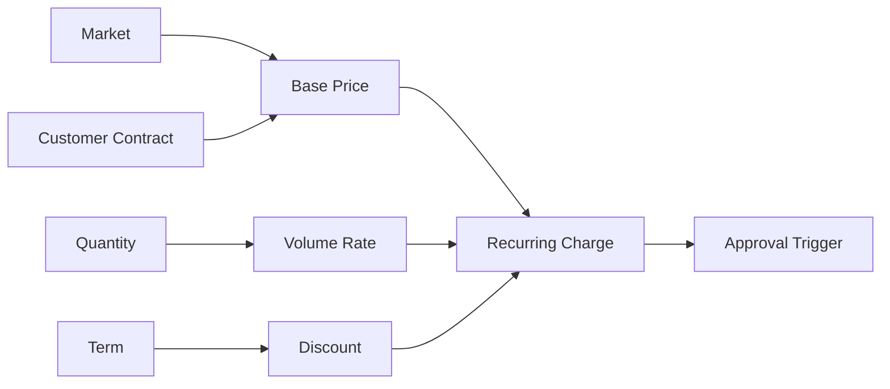

# Part 017 — Customer, Channel, Market, Quantity, Time, and Pricing Evaluation

## Positioning

Pricing engine tidak menghitung harga hanya dari product ID.

Hasil harga enterprise dapat dipengaruhi oleh:

- tenant;
- market;
- channel;
- customer;
- account;
- contract;
- segment;
- quantity;
- term;
- date;
- currency;
- existing products;
- promotion;
- and approval context.

Tanpa pricing context yang eksplisit, hasil calculation menjadi:

- sulit direproduksi;
- sulit diuji;
- sulit di-cache;
- dan sulit dijelaskan.

> **Core thesis:** pricing adalah context-sensitive evaluation pipeline. Semua inputs, selection stages, precedence, exclusions, dan versions harus eksplisit agar hasil dapat direplay, dibandingkan, dan diaudit.

---

## 1. Pricing Context

Pricing Context adalah kumpulan fakta yang memengaruhi hasil price evaluation.

A complete context may include:

```text
tenant
market
channel
actor
customer
account
contract
offering/version
configuration
quantity
term
effective time
currency
existing products
promotion context
tax context
```

---

## 2. Context Is Part of the Contract

A pricing request without complete context should not be interpreted as globally valid.

Example:

```text
price(Product A)
```

is ambiguous.

Better:

```text
price(
  Product A,
  Customer X,
  Market ID,
  Channel Direct,
  24-month term,
  effective 2026-08-01
)
```

---

## 3. Tenant Context

Tenant can influence:

- catalog overlay;
- contract model;
- pricing rules;
- supported currencies;
- and customer-specific extensions.

Tenant must be part of cache and authorization boundaries.

---

## 4. Market Context

Market can influence:

- available price list;
- currency;
- tax behavior;
- regulatory fee;
- and commercial policy.

---

## 5. Channel Context

Channel can influence:

- wholesale versus retail price;
- partner discount;
- commission;
- promotion;
- and product visibility.

---

## 6. Actor Context

Actor may affect:

- which price components are visible;
- whether overrides are allowed;
- and whether approval-sensitive values are exposed.

Actor should not change authoritative calculation unless policy says so.

---

## 7. Customer Context

Customer context may include:

- segment;
- lifetime value tier;
- negotiated terms;
- existing portfolio;
- and commercial relationship.

---

## 8. Account Context

Account may influence:

- billing arrangement;
- legal entity;
- payment term;
- contract;
- and credit policy.

---

## 9. Contract Context

Contract may provide:

- negotiated rates;
- discount entitlement;
- price protection;
- minimum commitment;
- and special conditions.

---

## 10. Product Context

Product context includes:

- offering identity;
- version;
- specification;
- selected characteristics;
- and bundle relationships.

---

## 11. Quantity Context

Quantity affects:

- rate selection;
- volume discount;
- allocation;
- and minimum commitment.

---

## 12. Term Context

Term affects:

- recurring rate;
- discount;
- one-time waiver;
- and price lock.

---

## 13. Effective Time Context

Time determines which:

- price definition;
- promotion;
- contract;
- and exchange rate

is applicable.

---

## 14. Currency Context

Currency may be:

- contract currency;
- market currency;
- billing currency;
- and display currency.

Do not conflate them.

---

## 15. Existing Product Context

Installed portfolio can affect:

- upgrade price;
- loyalty discount;
- prerequisite product;
- migration fee;
- and bundle entitlement.

---

## 16. Promotion Context

Promotion evaluation may require:

- campaign;
- code;
- customer segment;
- channel;
- and validity period.

---

## 17. Tax Context

Tax may depend on:

- bill-to;
- service location;
- product tax class;
- and jurisdiction.

Tax authority may be external.

---

## 18. Context Completeness

Pricing engine should know which context fields are mandatory.

Missing context may produce:

- INCOMPLETE;
- ASSUMED_DEFAULT;
- or ERROR

depending on policy.

---

## 19. Default Context

Defaults can be dangerous.

Example:

- default market;
- default currency;
- default customer type.

Hidden defaults make pricing non-reproducible.

---

## 20. Explicit Assumption

If a default is used, preserve:

- default source;
- reason;
- and impact.

---

## 21. Context Snapshot

A pricing result should reference or snapshot the context used.

---

## 22. Context Version

Relevant external data may need version:

- customer segment version;
- contract version;
- inventory snapshot;
- exchange-rate version;
- and catalog publication.

---

## 23. Context Hash

A deterministic hash can identify pricing input set.

Useful for:

- idempotency;
- cache;
- and comparison.

---

## 24. Context Normalization

Normalize before evaluation:

- units;
- date/time;
- customer identifiers;
- and quantity formats.

---

## 25. Evaluation Pipeline

A pricing pipeline is an ordered set of stages.

Representative stages:

```mermaid
flowchart LR
    A[Normalize Context]
    B[Resolve Price Sources]
    C[Filter Eligibility]
    D[Select Base Price]
    E[Apply Quantity and Term]
    F[Apply Contract/Promotion]
    G[Apply Adjustments]
    H[Calculate Tax Estimate]
    I[Round and Aggregate]
    J[Validate and Explain]

    A --> B --> C --> D --> E --> F --> G --> H --> I --> J
```



---

## 26. Stage 1 — Normalize Context

Normalize:

- quantity units;
- currency;
- date/time;
- and selected characteristics.

---

## 27. Stage 2 — Resolve Price Sources

Gather candidate sources:

- catalog;
- price list;
- contract;
- partner;
- promotion;
- and manual override.

---

## 28. Stage 3 — Filter Eligibility

Discard candidates that are:

- expired;
- wrong market;
- wrong channel;
- incompatible with customer;
- or invalid for action.

---

## 29. Stage 4 — Select Base Price

Choose the authoritative base candidate using precedence.

---

## 30. Stage 5 — Apply Quantity Rules

Apply:

- volume tier;
- graduated tier;
- minimum charge;
- and quantity multiplier.

---

## 31. Stage 6 — Apply Term Rules

Apply:

- contract-term rate;
- commitment discount;
- and limited-duration incentives.

---

## 32. Stage 7 — Apply Contract Rules

Contract may:

- override base;
- apply discount;
- cap price;
- or lock historical rate.

---

## 33. Stage 8 — Apply Promotion Rules

Promotion may:

- reduce charge;
- waive fee;
- add allowance;
- or create free periods.

---

## 34. Stage 9 — Apply Manual Adjustments

Manual adjustment should be explicit and authorized.

---

## 35. Stage 10 — Calculate Tax Estimate

Optional depending on domain boundary.

---

## 36. Stage 11 — Round and Aggregate

Apply:

- component rounding;
- allocation;
- and total reconciliation.

---

## 37. Stage 12 — Validate and Explain

Confirm:

- completeness;
- consistency;
- and traceability.

---

## 38. Stage Contract

Each stage should define:

- input;
- output;
- ownership;
- failure behavior;
- and trace.

---

## 39. Pipeline Immutability

Prefer each stage to return new immutable result or explicit delta.

Avoid mutating one shared object without trace.

---

## 40. Candidate Price

A candidate should include:

- source;
- type;
- amount/rate;
- scope;
- validity;
- and priority.

---

## 41. Candidate Set

Keep all considered candidates for explanation.

---

## 42. Source Resolution

Possible sources:

1. Catalog list price.
2. Market price list.
3. Customer contract.
4. Partner price.
5. Promotion.
6. Manual negotiated price.
7. External pricing service.

---

## 43. Price List

A price list can be scoped by:

- market;
- channel;
- currency;
- customer class;
- and effective period.

---

## 44. Contract Rate

A contract rate may have highest precedence for defined scope.

---

## 45. Partner Rate

Partner may receive:

- wholesale rate;
- resale discount;
- or commission-adjusted rate.

---

## 46. Promotion Rate

Promotion may replace or adjust base price.

---

## 47. Manual Negotiated Rate

Manual rate should reference:

- authority;
- reason;
- and quote revision.

---

## 48. Precedence

Precedence determines which candidate or adjustment applies.

Example:

```text
Manual approved override
> Contract rate
> Customer-specific rate
> Market price list
> Global list price
```

---

## 49. Precedence Is Domain Policy

Do not encode precedence only as numeric priority without meaning.

---

## 50. Specificity

A more specific source may win:

```text
global
< market
< channel
< customer segment
< account
< contract
```

---

## 51. Explicit Override

Override should state which source it supersedes.

---

## 52. Candidate Conflict

Conflict occurs when multiple equally authoritative prices match.

---

## 53. Conflict Handling

Options:

- fail pricing;
- require explicit selection;
- choose deterministic policy;
- or escalate to manual review.

---

## 54. Silent First-Match Risk

Using first database row or iteration order is unsafe.

---

## 55. Fallback

Fallback may use broader source when specific source missing.

Example:

- contract rate absent;
- use market list price.

Fallback should be traceable.

---

## 56. No Applicable Price

Return domain result:

```text
status = INCOMPLETE
reason = NO_APPLICABLE_PRICE
```

Not generic server error.

---

## 57. Multiple Applicable Prices

Return conflict or selected result with explanation.

---

## 58. Price Selection Trace

Example:

```text
Global list price found: 100
Market price found: 95
Contract price found: 90
Selected contract price due to precedence
```

---

## 59. Price Source Exclusion

Record why candidate was excluded:

- expired;
- wrong currency;
- wrong channel;
- or term mismatch.

---

## 60. Pipeline Version

Pricing pipeline behavior should have version.

---

## 61. Stage Version

Individual stages or rule sets may evolve independently.

---

## 62. Engine Version

Runtime implementation version can affect semantics.

---

## 63. Reproducibility

To replay result, preserve:

- full context;
- source versions;
- pipeline version;
- engine version;
- and time.

---

## 64. Deterministic Ordering

Candidate and adjustment ordering must be stable.

---

## 65. Current Time Risk

Pricing should receive explicit `effectiveAt`.

Avoid implicit `now()` in multiple stages.

---

## 66. External Mutable Data Risk

External cost or exchange rate should be snapshotted with version/time.

---

## 67. Missing Context Policy

Possible policies:

- fail;
- use default with warning;
- return indicative price;
- or request more information.

---

## 68. Indicative Pricing

May use assumptions.

Must label:

- non-binding;
- assumptions;
- and validity.

---

## 69. Firm Pricing

Requires stronger context and source evidence.

---

## 70. Progressive Pricing

Possible stages:

1. list price preview;
2. customer-specific price;
3. contract-adjusted price;
4. approved quote price;
5. accepted committed price.

---

## 71. Price Readiness

A price may be:

- indicative;
- complete;
- approved;
- locked;
- accepted.

---

## 72. Context Drift

A pricing context can become stale when:

- customer changes;
- contract changes;
- catalog changes;
- quantity changes;
- or date advances.

---

## 73. Drift Detection

Compare:

- source versions;
- validity;
- and context hash.

---

## 74. Repricing Trigger

Map each context field to affected stages.

---

## 75. Dependency Graph



---

## 76. Incremental Pricing

Re-run only affected stages.

---

## 77. Full Repricing

Use before:

- approval;
- presentation;
- acceptance;
- and order conversion

depending on policy.

---

## 78. Stage Invalidation

Example:

- changing quantity invalidates volume and discount stages;
- changing display language should not invalidate price.

---

## 79. Price-Relevant Fields

Mark fields that affect pricing.

---

## 80. Non-Price-Relevant Fields

Examples:

- display note;
- internal comment;
- proposal formatting.

---

## 81. Partial Repricing Risk

A missed dependency can produce inconsistent totals.

---

## 82. Incremental/Full Reconciliation

Compare incremental result with periodic full calculation.

---

## 83. Pricing Context and Bundles

Context can apply at:

- quote;
- bundle;
- item;
- component;
- and site level.

---

## 84. Context Inheritance

Example:

```text
Quote currency
-> inherited by items
Item site
-> overrides quote default site
```

---

## 85. Context Override

Explicit override should be visible and scoped.

---

## 86. Multi-Site Pricing

Each site may have:

- local surcharge;
- different feasibility;
- and local tax.

---

## 87. Quote-Level Volume

Volume discount may depend on total quantity across sites.

---

## 88. Cross-Item Pricing

Some discounts depend on bundle or portfolio.

---

## 89. Existing Portfolio Pricing

Customer’s installed products may grant:

- loyalty rate;
- upgrade credit;
- and add-on entitlement.

---

## 90. Portfolio Snapshot

Use explicit inventory snapshot/version for reproducibility.

---

## 91. Action Context

ADD, MODIFY, RENEW, TERMINATE, and UPGRADE may price differently.

---

## 92. Add Pricing

New acquisition price.

---

## 93. Modify Pricing

May include:

- delta charge;
- migration fee;
- and proration.

---

## 94. Renewal Pricing

May preserve or re-evaluate contract price.

---

## 95. Termination Pricing

May include:

- early termination fee;
- credit;
- and refund.

---

## 96. Upgrade Pricing

May include:

- target recurring price;
- device replacement fee;
- and credit for remaining term.

---

## 97. Currency Selection

Possible policy:

- market default;
- customer contract;
- quote-level choice;
- or billing account.

---

## 98. Currency Conversion Stage

If needed, perform at explicit stage with rate provenance.

---

## 99. Exchange Rate Source

Store:

- source;
- timestamp;
- rate;
- and version.

---

## 100. Multi-Currency Candidate

Do not compare candidate prices across currencies without conversion policy.

---

## 101. Pricing and Tax Stage Order

Tax may be calculated:

- before discount;
- after discount;
- or per jurisdiction policy.

Do not assume.

---

## 102. Pricing and Approval Stage Order

Approval trigger may depend on:

- final discount;
- margin;
- and override.

---

## 103. Pricing and Document Stage

Customer-facing formatting should not change authoritative amounts.

---

## 104. Pricing and Billing Stage

Billing may consume normalized charge instructions.

---

## 105. Price Result Model

A result may include:

- calculation ID;
- status;
- components;
- summaries;
- context;
- validity;
- trace;
- and warnings.

---

## 106. Pricing Status

Possible statuses:

- COMPLETED;
- PARTIAL;
- INCOMPLETE;
- CONFLICT;
- FAILED;
- STALE;
- SUPERSEDED.

---

## 107. Partial Result

Some items priced, others not.

Need item-level errors.

---

## 108. Incomplete Result

Missing context or source.

---

## 109. Conflict Result

Multiple incompatible candidates or rules.

---

## 110. Failed Result

Technical processing failure.

Do not conflate with no applicable price.

---

## 111. Stale Result

Context or source validity changed.

---

## 112. Superseded Result

Newer calculation replaces prior result.

---

## 113. Error Taxonomy

Examples:

- MISSING_CUSTOMER_CONTEXT;
- NO_APPLICABLE_PRICE;
- MULTIPLE_BASE_PRICES;
- EXCHANGE_RATE_UNAVAILABLE;
- INVALID_QUANTITY;
- PIPELINE_FAILURE.

---

## 114. Warning Taxonomy

Examples:

- DEFAULT_CURRENCY_USED;
- INDICATIVE_PRICE;
- CONTRACT_EXPIRING;
- TAX_ESTIMATE_ONLY;
- STALE_PORTFOLIO_SNAPSHOT.

---

## 115. Pricing Request Identity

Useful for:

- idempotency;
- trace;
- and async processing.

---

## 116. Pure Query versus Persisted Calculation

A pure pricing query may not need idempotency storage.

A persisted calculation or quote price snapshot does.

---

## 117. Async Pricing

Useful for large quotes.

Need:

- job state;
- progress;
- partial result;
- and cancellation.

---

## 118. Synchronous Pricing

Useful for interactive UI.

Need strict latency budget.

---

## 119. Hybrid Pricing

Interactive preview plus async deep/firm pricing.

---

## 120. Performance Budget

Allocate latency per stage.

Example:

- context normalization;
- source lookup;
- rule evaluation;
- tax call;
- aggregation.

---

## 121. Parallel Stage

Independent item pricing can run in parallel.

---

## 122. Sequential Stage

Precedence and aggregation may require order.

---

## 123. External Pricing Dependency

Define:

- timeout;
- retry;
- fallback;
- and result mapping.

---

## 124. Timeout

A timeout should produce:

- INCOMPLETE;
- PARTIAL;
- or technical failure

depending on scope.

---

## 125. Retry

Retry only transient failures.

---

## 126. Circuit Breaker

Protect overall CPQ flow.

---

## 127. Fallback Price

Fallback may use:

- cached rate;
- broader list price;
- or manual review.

Must be explicit.

---

## 128. Caching

Cache by complete relevant context and versions.

---

## 129. Cache Key Explosion

Highly customer-specific context can reduce cache usefulness.

---

## 130. Cache Scope

Possible:

- price definition;
- candidate resolution;
- contract lookup;
- and final result.

Cache stable sub-results rather than entire customer calculation where possible.

---

## 131. Cache Invalidation

Events:

- price publication;
- contract change;
- promotion activation;
- and exchange-rate update.

---

## 132. Negative Cache

No-applicable-price may be cached briefly with reason.

---

## 133. Observability

Track:

- stage latency;
- candidate count;
- selected source;
- cache hit;
- fallback usage;
- conflict;
- and incomplete result.

---

## 134. Stage Metrics

Per stage:

- calls;
- duration;
- errors;
- retries;
- and skipped count.

---

## 135. Business Metrics

- contract-price usage;
- promotion application;
- override frequency;
- and price source distribution.

---

## 136. Pricing SLI

Examples:

- 95% preview calculations under target latency;
- 99.9% final calculations reproducible;
- zero unexplained total mismatch.

Targets must be verified internally.

---

## 137. Traceability

Support should see:

- context;
- selected source;
- excluded candidates;
- adjustment sequence;
- and totals.

---

## 138. Sensitive Context

Pricing context may contain:

- customer tier;
- contract details;
- margin inputs;
- and confidential rates.

Apply access control.

---

## 139. Redacted Explanation

Customer-facing explanation should not reveal internal contract or cost logic unnecessarily.

---

## 140. Audit

For accepted quote, retain:

- calculation version;
- context snapshot;
- selected candidates;
- adjustment trace;
- and result.

---

## 141. Pricing Incident

Examples:

- wrong precedence;
- contract rate ignored;
- expired promotion applied;
- cache key missing tenant;
- and external timeout treated as zero price.

---

## 142. Incident Diagnosis

Ask:

```text
Which stage?
Which context?
Which candidate set?
Which precedence rule?
Which version?
Which cache entry?
```

---

## 143. Reconciliation

Compare:

- replayed calculation;
- stored quote price;
- order charge;
- and billing charge.

---

## 144. Replay

A replay should use historical versions, not current sources.

---

## 145. Differential Replay

Compare old and new pipeline versions for same context.

---

## 146. Shadow Pricing

Run candidate pipeline in parallel and measure drift.

---

## 147. Pipeline Rollout

Use:

- canary tenant;
- shadow;
- feature flag;
- and rollback.

---

## 148. Pipeline Migration

Open quotes may need:

- preserve old pipeline;
- explicit repricing;
- or controlled migration.

---

## 149. Backward Compatibility

New stage or precedence rule can be breaking even if API schema is unchanged.

---

## 150. Evaluation Smells

- hidden defaults;
- implicit current time;
- first-match precedence;
- and result without candidate trace.

---

## 151. Context Smells

- customer ID only;
- no contract version;
- no action type;
- no effective time;
- and market inferred from locale.

---

## 152. Pipeline Smells

- one giant method;
- stages mutate shared object;
- external calls embedded randomly;
- and no stage metrics.

---

## 153. Caching Smells

- cache key excludes tenant;
- current promotion not invalidated;
- customer-specific result shared;
- and no publication/version key.

---

## 154. Anti-Patterns

### Product-ID Pricing

No context.

### Hidden Precedence

Database order decides.

### Current-Time Everywhere

Replay impossible.

### Total-Only Result

No explanation.

### Full Repricing on Cosmetic Change

Waste.

### Partial Repricing without Dependency Graph

Incorrect totals.

---

## 155. Pricing Context Template

```md
## Request Identity

## Tenant / Market / Channel

## Actor

## Customer / Account

## Contract

## Offering and Version

## Configuration

## Quantity

## Term

## Requested Action

## Effective Time

## Currency

## Existing Products

## Promotion / Tax Context

## Source Versions
```

---

## 156. Pipeline Stage Template

```text
Stage:
Version:
Inputs:
Outputs:
Dependencies:
Failure behavior:
Cacheability:
Trace:
Owner:
```

---

## 157. Candidate Price Template

```text
Candidate ID:
Source:
Source version:
Scope:
Amount/rate:
Currency:
Unit:
Validity:
Specificity:
Precedence:
Exclusion reason:
```

---

## 158. Pricing Trace Template

```text
Context hash:
Pipeline version:
Candidate resolution:
Candidate exclusions:
Selected base:
Quantity/term transformations:
Contract/promotion adjustments:
Manual overrides:
Tax stage:
Rounding:
Totals:
Warnings:
```

---

## 159. Worked Example: Contract Precedence

Candidates:

- global list = 100;
- market list = 95;
- customer contract = 90.

Result:

- contract rate selected;
- trace records all candidates;
- market/list candidates excluded by precedence.

---

## 160. Worked Example: Missing Contract

Customer expected negotiated price but contract lookup unavailable.

Correct result:

- INCOMPLETE or fallback with warning;
- not silently use list price as final quote.

---

## 161. Worked Example: Quantity Change

Quantity changes from 9 to 10.

Affected:

- volume tier;
- subtotal;
- discount;
- approval trigger.

Unrelated tax jurisdiction remains unchanged.

---

## 162. Worked Example: Upgrade Action

Pricing context includes:

- current inventory product;
- remaining term;
- target offering;
- and action UPGRADE.

Pipeline applies:

- upgrade credit;
- new recurring rate;
- possible device fee.

---

## 163. Worked Example: Multi-Site Quote

Each site has:

- local access surcharge.

Quote-level quantity grants:

- volume discount.

Pipeline must aggregate site components before quote-level adjustment.

---

## 164. Worked Example: Currency Conversion

Contract price is USD.

Display requested in IDR.

Authoritative result remains USD.

Display conversion stage records exchange-rate source and time.

---

## 165. Worked Example: Shadow Pipeline

Candidate pipeline changes precedence between contract and promotion.

Shadow run reveals 3% of quotes differ.

Product and commercial owners review before activation.

---

## 166. Senior Engineer Operating Model

### Make context explicit

No hidden customer, market, or time assumptions.

### Model pipeline stages

Separate source resolution, selection, adjustment, and aggregation.

### Treat precedence as business policy

Not database order.

### Preserve candidates and exclusions

Explainability requires both.

### Version the pipeline

Schema stability does not guarantee semantic stability.

### Build dependency graphs

Support incremental repricing safely.

### Operate each stage

Metrics, fallback, and tracing.

### Use replay and shadowing

Validate changes before rollout.

---

## 167. Internal Verification Checklist

### Context

- Which fields are mandatory?
- Are tenant, market, channel, action, and effective time explicit?
- Are contract and inventory versions included?
- Are assumptions/defaults recorded?

### Source resolution

- What price sources exist?
- How are candidates discovered?
- How are expired or ineligible candidates excluded?
- Can all considered candidates be inspected?

### Precedence

- What is the explicit order?
- Is specificity defined?
- How are equal-priority conflicts handled?
- Are overrides linked to base source?

### Pipeline

- What stages exist?
- Are stages independently versioned?
- Are stages pure or side-effectful?
- Which stages call external services?

### Repricing

- Which fields are price-relevant?
- Is incremental pricing supported?
- How are dependencies modeled?
- Is full-result reconciliation performed?

### Performance

- What is the latency budget per stage?
- What is cached?
- Are cache keys tenant/context/version safe?
- Is async pricing supported?

### Operations

- Are stage metrics available?
- Can calculations be replayed?
- Is shadow/canary rollout supported?
- How are affected open quotes identified?

---

## 168. Practical Exercises

### Exercise 1 — Context inventory

List every current input affecting pricing and classify its owner/version.

### Exercise 2 — Pipeline map

Split a giant pricing method into explicit stages.

### Exercise 3 — Precedence table

Define source selection and conflict behavior.

### Exercise 4 — Dependency graph

Map which context changes invalidate which stages.

### Exercise 5 — Replay design

Specify what must be stored to reproduce accepted price.

### Exercise 6 — Shadow rollout

Design a comparison between current and candidate pricing pipelines.

---

## 169. Part Completion Checklist

You are done if you can:

- define complete pricing context;
- separate context normalization from calculation;
- model candidate sources;
- define deterministic precedence;
- classify missing and conflicting prices;
- version pricing pipeline and stages;
- support incremental repricing;
- preserve context and trace for replay;
- design caching and external dependency behavior;
- and create an internal pricing-pipeline verification backlog.

---

## 170. Key Takeaways

1. Pricing is context-sensitive.
2. Context is part of the pricing contract.
3. Candidate sources must be explicit.
4. Precedence is business policy.
5. Current time must be passed explicitly.
6. Indicative and firm pricing differ.
7. Incremental repricing needs a dependency graph.
8. Candidate exclusions are part of explanation.
9. Pipeline versions matter even when schemas do not change.
10. Internal CSG pricing context and precedence must be verified.

---

## 171. References

Conceptual baseline:

- General enterprise CPQ pricing-context, source-selection, and evaluation-pipeline practices.
- Domain-Driven Design policies, value objects, and versioned domain services.
- Incremental computation, caching, deterministic replay, and distributed-system resilience.
- Commercial pricing, contract pricing, promotion, tax, and currency-conversion concepts.

These references do not define internal CSG pricing precedence or pipeline implementation.
