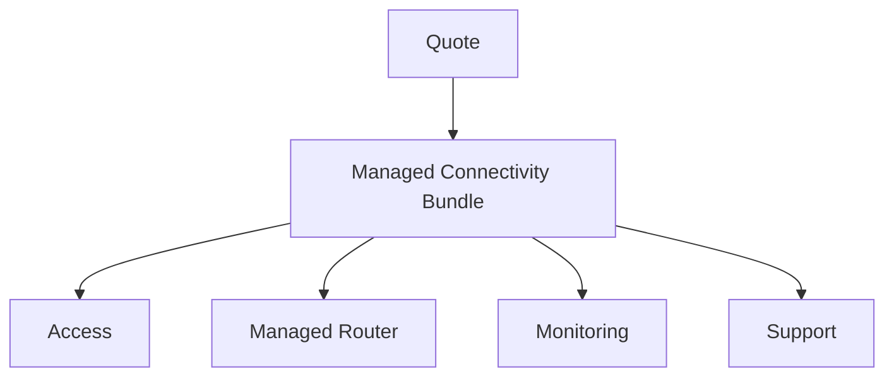

# Part 023 — Quote Identity, Quote Items, Relationships, Totals, and Commercial Context

## Positioning

Quote bukan sekadar:

- header;
- list of rows;
- subtotal;
- dan status.

Dalam CPQ enterprise, Quote adalah commercial aggregate yang mengikat:

- customer context;
- configured product selections;
- price snapshots;
- commercial terms;
- approvals;
- validity;
- parties;
- sites;
- channels;
- attachments;
- dan customer-facing commitments.

Masalah architecture muncul ketika Quote menjadi terlalu kecil sehingga invariant tersebar ke banyak service, atau terlalu besar sehingga setiap perubahan membutuhkan satu giant transaction.

> **Core thesis:** Quote aggregate harus menjaga commercial consistency dalam satu revision, tetapi tetap mereferensikan external authorities seperti Customer, Catalog, Inventory, Agreement, Tax, dan Fulfillment melalui explicit snapshot, reference, atau projection semantics.

---

## 1. What a Quote Is

A Quote is a commercial proposal for a specific customer context.

It may contain:

- one or more product selections;
- monetary components;
- commercial conditions;
- validity;
- parties;
- and evidence.

A Quote is not automatically:

- an Agreement;
- a Product Order;
- a proposal document;
- or a billing instruction.

---

## 2. Quote as Aggregate Root

The Quote aggregate root controls consistency for:

- quote identity;
- current revision;
- quote items;
- quote-level totals;
- quote-level terms;
- quote-level state;
- and internal relationships.

---

## 3. Aggregate Boundary Question

The key question is:

> Which facts must be atomically consistent when a commercial change is committed?

Potential atomic concerns:

- adding/removing an item;
- recalculating quote totals;
- applying quote-level discount;
- validating cross-item dependency;
- and incrementing revision/version.

---

## 4. What Usually Belongs Inside Quote Aggregate

Candidates:

- Quote ID and business number;
- current working revision;
- item hierarchy;
- quote-level parties;
- quote-level commercial context;
- quote-level totals;
- quote validity;
- selected terms;
- and references to price/approval evidence.

---

## 5. What Usually Remains External

Common external authorities:

- Customer master;
- Product Catalog;
- Inventory;
- Agreement/Contract;
- Approval workflow;
- Tax engine;
- Pricing engine;
- Product Order;
- Document store;
- and Fulfillment.

Quote may snapshot or reference their outputs.

---

## 6. Quote Identity

A quote should have stable identity independent of revision.

Example:

```text
Quote ID: QUO-01J7...
Quote Number: Q-2026-000123
```

---

## 7. Technical ID versus Quote Number

### Technical ID

Stable internal identifier.

### Quote Number

Human-readable business reference.

A quote number may include:

- year;
- market;
- sequence;
- or tenant prefix.

Do not use mutable display reference as technical identity.

---

## 8. Quote Revision Identity

Each revision needs identity.

Example:

```text
Quote ID: QUO-123
Revision: 7
Revision ID: QUO-123-R7
```

---

## 9. Aggregate Version

Aggregate version supports optimistic concurrency.

It may differ from commercial revision.

---

## 10. Commercial Revision versus Aggregate Version

### Commercial revision

Meaningful customer/commercial version.

### Aggregate version

Technical concurrency counter.

A save may increment technical version without creating a customer-facing revision.

---

## 11. Quote Header

Quote header may contain:

- quote number;
- name;
- description;
- customer/account;
- opportunity;
- channel;
- market;
- currency;
- validity;
- state;
- and revision metadata.

---

## 12. Quote Name

A user-facing name is mutable metadata.

It should not be identity.

---

## 13. Quote Description

Useful for business context.

Avoid storing critical commercial rules only in free text.

---

## 14. Quote Purpose

Possible purposes:

- new sale;
- upgrade;
- renewal;
- amendment;
- migration;
- termination;
- and indicative estimate.

Purpose can affect validation and lifecycle.

---

## 15. Requested Action

At quote or item level:

- ADD;
- MODIFY;
- DELETE;
- SUSPEND;
- RESUME;
- REPLACE;
- RENEW.

The scope of action must be explicit.

---

## 16. Quote Commercial Context

Typical context:

```text
tenant
market
channel
seller
customer
account
contract
effective time
requested action
catalog publication
currency
```

---

## 17. Context Snapshot versus Live Reference

Quote should often combine:

- references to authoritative entities;
- snapshots of legally/commercially relevant display data;
- versioned context.

---

## 18. Customer Reference

A quote may reference:

- legal customer;
- buyer;
- bill-to;
- service user;
- and account.

Do not use one generic `customerId`.

---

## 19. Related Party

A Related Party structure can express:

```text
partyId
partyRole
partyNameSnapshot
sourceSystem
sourceVersion
```

---

## 20. Party Roles

Examples:

- Buyer;
- Seller;
- BillTo;
- ShipTo;
- ServiceUser;
- Signatory;
- Partner;
- Reseller;
- AccountManager;
- TechnicalContact.

---

## 21. Quote Owner

Quote owner may be:

- sales user;
- team;
- opportunity;
- or account.

Ownership is not the same as seller legal entity.

---

## 22. Seller Legal Entity

Needed for:

- contract;
- tax;
- currency;
- and legal terms.

---

## 23. Sales Channel

Examples:

- direct;
- partner;
- digital;
- call center;
- marketplace.

Channel can influence price and visibility.

---

## 24. Market

Market may include:

- country;
- segment;
- brand;
- regulatory context;
- and business unit.

---

## 25. Opportunity Reference

Quote may link to CRM opportunity.

Opportunity remains external.

Quote should not depend on CRM being available to preserve its own commercial evidence.

---

## 26. Contract Reference

Contract may provide:

- negotiated rates;
- terms;
- and entitlements.

Quote should preserve version and applied effects.

---

## 27. Quote Item

A Quote Item is a commercial line or node within the quote.

It may represent:

- configured offering;
- bundle;
- component;
- fee;
- discount;
- or informational grouping.

---

## 28. Quote Item Identity

Each item occurrence needs stable identity within the quote.

Do not use array index.

---

## 29. Quote Item Business Key

Potential business-readable line number:

```text
1
1.1
1.2
2
```

Line number is presentation metadata, not stable identity.

---

## 30. Quote Item Type

Possible types:

- PRODUCT;
- BUNDLE;
- COMPONENT;
- SERVICE;
- FEE;
- DISCOUNT;
- CREDIT;
- GROUP;
- NOTE.

Avoid generic type without semantics.

---

## 31. Quote Item Hierarchy

A quote can preserve catalog composition:



---

## 32. Hierarchy Is Not Presentation Only

Hierarchy can affect:

- price allocation;
- validation;
- quantity;
- order decomposition;
- and inventory lineage.

---

## 33. Parent–Child Relationship

Store:

- parent item ID;
- relationship type;
- source catalog relationship;
- cardinality;
- and occurrence identity.

---

## 34. Relationship Types

Examples:

- CONTAINS;
- REQUIRES;
- OPTION_OF;
- DISCOUNT_OF;
- FEE_FOR;
- REPLACES;
- DEPENDS_ON.

---

## 35. Nested Items

Nested bundles require:

- bounded depth;
- cycle prevention;
- and stable path semantics.

---

## 36. Quote Item Graph

Some relationships are not hierarchical.

Example:

- one discount applies to multiple items;
- one shared service supports several components.

Represent hierarchy and cross-links separately.

---

## 37. Quote Item Path

A path may help:

- display;
- diagnostics;
- and flattening.

Do not make it the only identity.

---

## 38. Source Catalog Reference

Each item should retain:

- Product Offering ID;
- version;
- Product Specification reference;
- and catalog publication.

---

## 39. Configured Product Snapshot

Quote Item should preserve selected commercial configuration.

Potential contents:

- offering reference/version;
- characteristic values;
- value provenance;
- child selections;
- quantity;
- relationships;
- and validation state.

---

## 40. Snapshot versus Live Catalog

Historical quote should not require current catalog to explain what was selected.

---

## 41. Product Name Snapshot

Store customer-facing name/description where needed.

Catalog reference remains for lineage.

---

## 42. Characteristic Snapshot

Store:

- characteristic ID;
- definition version;
- selected value;
- unit;
- and source.

---

## 43. Configuration Provenance

Values may be:

- user-selected;
- defaulted;
- inherited;
- calculated;
- migrated;
- or corrected.

---

## 44. Item Quantity

Quantity needs:

- numeric value;
- unit;
- and derivation.

---

## 45. Parent Quantity Propagation

If parent quantity changes, child quantities may:

- follow;
- remain fixed;
- derive by rule;
- or require manual update.

---

## 46. Per-Site Item

Multi-site quote may represent:

- one item with site collection;
- one item per site;
- or grouped site batches.

Choose based on pricing, fulfillment, and update patterns.

---

## 47. Item Site Reference

An item may link to:

- one site;
- multiple sites;
- or no site.

Site is usually external authority with optional snapshot.

---

## 48. Account Reference at Item Level

One quote may contain items for multiple billing/service accounts.

This increases complexity.

---

## 49. Multi-Account Quote

Questions:

- one approval?
- one currency?
- one agreement?
- one order?
- separate tax?
- separate billing?

Do not allow casually.

---

## 50. Multi-Currency Quote

Possible but complex.

If supported, totals must be grouped by currency.

---

## 51. One-Currency Invariant

A simpler invariant:

> All binding quote components use one transaction currency.

Display conversion can remain non-binding.

---

## 52. Item Action

For modify/upgrade flows, item should state action.

---

## 53. Existing Product Reference

MODIFY/DELETE/REPLACE should reference Inventory Product identity.

---

## 54. Current versus Target Configuration

A change quote may preserve:

- current state;
- requested target state;
- and delta.

---

## 55. Delta Modeling

Possible strategies:

- full target snapshot;
- patch/delta;
- or both.

Full target is easier to reason about.

Delta preserves change intent.

---

## 56. Quote Item Price

Item price should reference immutable pricing snapshot or component set.

---

## 57. Price Components

Examples:

- one-time;
- recurring;
- usage rate;
- allowance;
- discount;
- surcharge;
- tax estimate.

---

## 58. Item Total

An item may have several totals by:

- currency;
- charge type;
- and period.

---

## 59. Quote Total

Quote total aggregates item-level monetary components.

---

## 60. Total Dimensions

Possible dimensions:

- one-time total;
- monthly recurring;
- annual recurring;
- estimated usage;
- tax;
- TCV;
- ACV;
- and grand total.

---

## 61. Total Invariant

Quote total should reconcile to included item/component totals under explicit aggregation policy.

---

## 62. Cross-Item Discount

A discount may apply across items.

Model as:

- quote-level adjustment;
- dedicated discount item;
- or allocated component.

Preserve scope and allocation.

---

## 63. Discount Allocation

Needed for:

- tax;
- order;
- billing;
- cancellation;
- and revenue analysis.

---

## 64. Shared Fee

A one-time fee may apply once per quote or site group.

Do not duplicate per item accidentally.

---

## 65. Tax Estimate

Tax estimate may be:

- quote-level;
- item-level;
- or component-level.

Store estimate/final status.

---

## 66. Quote Currency

Quote currency should be explicit.

---

## 67. Display Currency

Optional converted view should not alter binding totals.

---

## 68. Monetary Precision

Use exact decimals and explicit rounding policy.

---

## 69. Quote Terms

Terms may include:

- contract term;
- payment term;
- renewal;
- cancellation;
- service condition;
- and price validity.

---

## 70. Structured Terms

Important terms should be machine-readable.

---

## 71. Free-Text Terms

Useful for additional clauses but should not be the only source of critical behavior.

---

## 72. Term Identity

A term may reference:

- template;
- version;
- source;
- and accepted wording.

---

## 73. Term Snapshot

Presented/accepted quote must preserve exact term version.

---

## 74. Contract Term versus Payment Term

Keep separate.

---

## 75. Service-Level Term

Examples:

- availability;
- response time;
- restoration commitment.

---

## 76. Quote Validity

Quote should define:

- validFrom;
- validUntil;
- timezone;
- and expiration policy.

---

## 77. Validity Dependencies

Effective validity may depend on:

- price;
- promotion;
- tax;
- feasibility;
- and approval.

---

## 78. Requested Start Date

Customer preference.

---

## 79. Committed Date

Provider promise, if any.

Do not conflate.

---

## 80. Quote-Level Dates

Possible fields:

- createdAt;
- revisedAt;
- calculatedAt;
- presentedAt;
- acceptedAt;
- validUntil;
- requestedStart;
- and effectiveDate.

---

## 81. Attachment

Quote may reference attachments:

- customer requirement;
- design;
- proposal;
- legal document;
- and approval evidence.

---

## 82. Attachment Identity

Store:

- document ID;
- type;
- version;
- checksum;
- and visibility.

---

## 83. Attachment Ownership

Binary content usually belongs in document store.

Quote stores immutable reference.

---

## 84. Attachment Mutability

A presented/accepted attachment should not be replaced in place.

Create new version.

---

## 85. Proposal Document

Proposal is a generated representation of a quote revision.

It is not the authoritative aggregate.

---

## 86. Proposal Reference

Store:

- proposal ID;
- quote revision;
- template version;
- generatedAt;
- checksum;
- and delivery status.

---

## 87. Internal Note

Internal note should not leak to customer proposal.

---

## 88. Customer Note

Customer-facing note should be versioned with proposal.

---

## 89. Quote Annotation

Comments and collaboration may be separate from commercial revision.

---

## 90. Quote Item Lifecycle

Item may have local readiness state.

Avoid duplicating full quote lifecycle on every item unless needed.

---

## 91. Item Validation State

Possible:

- incomplete;
- invalid;
- valid;
- stale;
- and ready.

---

## 92. Item Qualification State

May be independent from quote lifecycle.

---

## 93. Item Pricing State

May be:

- unpriced;
- partial;
- complete;
- stale;
- and locked.

---

## 94. Quote Readiness

Quote-level readiness aggregates:

- item completeness;
- validation;
- qualification;
- pricing;
- approval;
- and document readiness.

---

## 95. Cross-Item Invariant

Examples:

- required related item exists;
- no mutually exclusive items;
- one quote currency;
- total reconciles;
- all sites are assigned;
- and quote-level discount has valid basis.

---

## 96. Cross-Item Dependency

Example:

- Premium Support requires at least one Managed Connectivity item.

---

## 97. Cross-Item Exclusivity

Example:

- Fiber and Wireless Primary Access cannot coexist for same site and role.

---

## 98. Cross-Item Quantity Rule

Example:

- router quantity equals site count.

---

## 99. Cross-Item Term Rule

Example:

- all items under one agreement use compatible term.

---

## 100. Cross-Item Account Rule

Example:

- all items in one quote use same bill-to account.

If not, split quote or use explicit multi-account model.

---

## 101. Cross-Item Currency Rule

Do not aggregate different currencies without conversion.

---

## 102. Cross-Item Date Rule

Requested dates may require grouping or waves.

---

## 103. Cross-Item Approval Rule

Total discount or margin can trigger quote-level approval.

---

## 104. Cross-Item Tax Rule

Tax jurisdiction may differ by item/site.

---

## 105. Aggregate Invariant Enforcement

Quote aggregate should enforce invariants that depend on current quote state.

---

## 106. External Invariant

Some checks require external systems:

- customer status;
- inventory;
- feasibility;
- tax;
- and contract.

Store evidence/results with validity.

---

## 107. Eventual Invariant

Example:

> Every accepted quote eventually creates an order or explicit conversion failure.

This belongs to process coordination, not one local transaction.

---

## 108. Aggregate Size

Large enterprise quote can contain thousands of items.

One in-memory aggregate may become impractical.

---

## 109. Large Aggregate Risks

- high load time;
- large transaction;
- concurrency conflict;
- memory pressure;
- and slow serialization.

---

## 110. Aggregate Partitioning

Possible strategies:

- quote header aggregate + item aggregates;
- quote revision aggregate + item chunks;
- site-group aggregate;
- pricing as separate immutable result;
- and summary projection.

---

## 111. Consistency Trade-Off

Splitting aggregate reduces atomicity.

Need:

- optimistic versioning;
- process manager;
- validation snapshot;
- and final commit gate.

---

## 112. Finalization Barrier

Before presentation/acceptance, perform full quote validation across partitions.

---

## 113. Working Partition

During editing, item groups may update independently.

---

## 114. Quote Summary Projection

Maintain read model for:

- totals;
- item count;
- issues;
- and readiness.

Projection is not command authority.

---

## 115. Transaction Boundary

Atomic operations may be scoped to:

- one item;
- one item group;
- or quote revision finalization.

---

## 116. Saga Is Not Aggregate

Do not use long-running saga to emulate every local invariant.

---

## 117. Locking

Long quote editing favors optimistic concurrency.

---

## 118. Header Version

Header version can detect conflicting quote-level changes.

---

## 119. Item Version

Each item or partition can have own version.

---

## 120. Revision Consistency Token

A final revision may record versions of all partitions included.

---

## 121. Snapshot Barrier

Create immutable revision snapshot from consistent partition versions.

---

## 122. Concurrent Item Edits

Two users editing different items may proceed independently.

---

## 123. Concurrent Quote-Level Edits

Currency, customer, or term changes may invalidate many items.

Use stronger coordination.

---

## 124. Conflict Detection

Detect:

- item changed;
- parent removed;
- quote context changed;
- price stale;
- and catalog migration conflict.

---

## 125. Semantic Merge

Merging quote changes requires domain understanding.

---

## 126. Quote Copy

Copying a quote creates new identity.

Preserve source lineage.

---

## 127. Clone Options

Possible:

- clone all items;
- clone selected items;
- clone without price;
- clone with current catalog migration;
- or clone as new alternative.

---

## 128. Copy Security

Do not copy:

- restricted customer data;
- expired approval;
- acceptance evidence;
- or confidential attachment blindly.

---

## 129. Quote Template

A reusable template is not a customer-specific quote.

---

## 130. Template Application

Applying template creates new configured quote items with context and validation.

---

## 131. Quote Alternative

Alternatives may share customer context but have different:

- product;
- price;
- term;
- and design.

---

## 132. Alternative Group

A group identifies mutually exclusive commercial options.

---

## 133. Selected Alternative

Only one alternative may be presented/accepted under certain policy.

---

## 134. Multi-Option Proposal

A proposal may present several alternatives.

Acceptance must identify exact selected option/revision.

---

## 135. Quote Item Ordering

Ordering is presentation metadata unless it affects domain semantics.

---

## 136. Stable Sort Key

Use explicit sort key separate from identity.

---

## 137. Item Label

Customer-facing line label may differ from catalog name.

Preserve source and override.

---

## 138. Item Description

Can include generated summary.

Do not hide configuration semantics only in description.

---

## 139. Quote Search

Search index may include:

- number;
- customer;
- state;
- owner;
- amount;
- and validity.

It is a projection.

---

## 140. Quote Read API

May return:

- header;
- summary;
- items;
- issues;
- totals;
- and links to documents/approvals.

Use pagination/subresources for large quote.

---

## 141. Quote Command API

Representative commands:

- CreateQuote;
- AddQuoteItem;
- UpdateQuoteItem;
- RemoveQuoteItem;
- SetQuoteContext;
- RecalculateQuote;
- ValidateQuote;
- CreateRevision;
- and FinalizeRevision.

---

## 142. Generic PATCH Risk

Generic JSON patch can bypass domain semantics.

Prefer domain commands for important operations.

---

## 143. Idempotency

Create/add/clone commands may need idempotency keys.

---

## 144. Error Model

Domain errors should identify:

- current quote/revision;
- failed invariant;
- affected item;
- reason code;
- and allowed action.

---

## 145. Event Model

Representative events:

- QuoteCreated;
- QuoteItemAdded;
- QuoteItemConfigurationChanged;
- QuoteTotalsUpdated;
- QuoteMarkedStale;
- QuoteRevisionFinalized.

Use stable business facts.

---

## 146. Event Granularity

Avoid broadcasting every UI keystroke.

---

## 147. Outbox

Persist state change and event intent atomically.

---

## 148. Event Ordering

Use quote or revision key where order matters.

---

## 149. Event Payload Security

Do not expose:

- margin;
- internal notes;
- confidential contract data;
- or unrestricted customer fields.

---

## 150. Audit

Material changes should record:

- actor;
- command;
- previous/new value;
- revision;
- reason;
- and timestamp.

---

## 151. Audit versus Revision

Audit captures all meaningful changes.

Commercial revision captures customer-significant version.

---

## 152. Audit Retention

Accepted and regulated records may require long retention.

---

## 153. Tenant Isolation

Apply to:

- quote storage;
- cache;
- search;
- events;
- documents;
- and attachments.

---

## 154. Field-Level Security

Examples:

- cost/margin;
- internal approval note;
- partner rate;
- and customer personal data.

---

## 155. Quote Access

Permissions may include:

- view;
- edit;
- price;
- approve;
- present;
- accept;
- cancel;
- and copy.

---

## 156. Row-Level Authorization

User may access quote by:

- tenant;
- account;
- team;
- geography;
- or ownership.

---

## 157. Customer Portal View

Expose only:

- customer-approved fields;
- selected proposal;
- price;
- terms;
- and status.

---

## 158. Internal View

May include:

- issues;
- pricing provenance;
- approval;
- and operational diagnostics.

---

## 159. Quote Metrics

Useful metrics:

- quote creation rate;
- average item count;
- validation issue count;
- repricing frequency;
- cycle time;
- and conversion rate.

---

## 160. Large Quote Metrics

- load time;
- save latency;
- finalization latency;
- and projection lag.

---

## 161. Data Quality Metrics

- missing catalog reference;
- missing price component;
- orphan item;
- total mismatch;
- and unresolved site.

---

## 162. Quote Reconciliation

Compare:

- quote snapshot;
- proposal document;
- acceptance;
- order;
- and billing.

---

## 163. Proposal Reconciliation

Document values must match structured quote revision.

---

## 164. Order Reconciliation

Accepted items and monetary components must map to order intent.

---

## 165. Quote Incident

Examples:

- quote total differs from lines;
- child item orphaned;
- customer changed without repricing;
- accepted revision references mutable attachment;
- and item from another tenant linked.

---

## 166. Incident Containment

Possible:

- block presentation;
- block acceptance;
- block order conversion;
- rebuild projection;
- and create correction revision.

---

## 167. Quote Aggregate Smells

- one table per screen;
- all relationships generic;
- live catalog read for history;
- no revision identity;
- and totals updated separately without invariant.

---

## 168. Item Hierarchy Smells

- index as identity;
- parent/child stored only by display indentation;
- flat rows with lost bundle relationship;
- and cross-item discount without scope.

---

## 169. Context Smells

- customer inferred from CRM session;
- currency inferred from locale;
- and catalog version absent.

---

## 170. Large Aggregate Smells

- every edit loads thousands of lines;
- global lock;
- and one giant JSON rewrite for minor change.

---

## 171. Anti-Patterns

### Quote as Spreadsheet

Rows and formulas without domain semantics.

### Quote as Document

PDF is the only authoritative representation.

### Quote as Current Catalog View

Historical meaning changes.

### Quote as Integration DTO

Every external field included without ownership.

### One Giant Aggregate Forever

Scale and collaboration collapse.

### Tiny Aggregate with No Finalization Barrier

Cross-item consistency is never guaranteed.

---

## 172. Quote Aggregate Template

```md
## Quote Identity

## Business Number

## Current Revision

## Aggregate Version

## Purpose / Requested Action

## Tenant / Market / Channel

## Seller / Customer / Accounts / Parties

## Currency

## Validity

## Items

## Quote-Level Terms

## Totals

## Pricing Snapshot

## Approval References

## Proposal References

## Attachments

## State

## Audit
```

---

## 173. Quote Item Template

```md
## Item Identity

## Parent / Relationships

## Type

## Action

## Source Offering / Specification / Versions

## Configured Product Snapshot

## Quantity / Unit

## Sites / Accounts / Parties

## Existing Product Reference

## Price Components

## Terms

## Validation / Qualification / Pricing State

## Order Mapping Metadata

## Audit
```

---

## 174. Related Party Template

```text
Party ID:
Party role:
Display snapshot:
Source system/version:
Effective role period:
Visibility:
Authority:
```

---

## 175. Cross-Item Invariant Template

```text
Invariant ID:
Scope:
Participating items:
Condition:
Failure reason:
Blocking transition:
Owner:
Validation timing:
```

---

## 176. Quote Summary Template

```text
Quote/revision:
Customer:
Owner:
State:
Item count:
Currencies:
One-time totals:
Recurring totals:
Usage rates:
Tax estimate:
Validity:
Readiness:
Open issues:
```

---

## 177. Worked Example: Managed Connectivity Quote

Header:

- enterprise customer;
- direct channel;
- USD;
- valid for 30 days.

Items:

- bundle parent;
- 20 access site items;
- 20 router components;
- monitoring;
- premium support.

Totals:

- one-time installation;
- monthly recurring;
- tax estimate.

---

## 178. Worked Example: Cross-Item Discount

Volume discount applies when total site count >= 20.

Quote-level adjustment references all eligible recurring access components.

Allocation is preserved for order/billing.

---

## 179. Worked Example: Modify Existing Product

Quote Item:

- action MODIFY;
- inventory product reference;
- current 100 Mbps;
- target 1 Gbps;
- new router requirement;
- price delta;
- and effective date.

---

## 180. Worked Example: Multi-Site Partition

500-site quote is partitioned by region.

Each partition has version.

Finalized revision records exact partition versions and recomputed quote-level totals.

---

## 181. Worked Example: Multi-Account Conflict

Two items use different bill-to accounts.

Policy requires one bill-to per quote.

Validation suggests splitting into two quotes.

---

## 182. Worked Example: Proposal Consistency

Proposal generated from Revision 4 and Price Snapshot P4.

Revision 5 is created later.

Customer accepting Proposal 4 accepts Revision 4, not current draft.

---

## 183. Worked Example: Item Removal

Removing base connectivity would orphan support add-on.

Command is rejected or proposes cascade according to explicit policy.

---

## 184. Worked Example: Quote Copy

Source quote copied for a different customer.

System:

- creates new quote identity;
- removes approvals and acceptance;
- refreshes customer/contract context;
- marks prices stale;
- retains source lineage.

---

## 185. Senior Engineer Operating Model

### Start with atomic commercial invariants

Define why Quote is an aggregate.

### Keep external authorities external

Use references and snapshots deliberately.

### Give every occurrence identity

Especially quote items and price components.

### Preserve hierarchy and cross-links

Do not flatten away semantics.

### Separate commercial revision from technical version

Support audit and concurrency.

### Design for large quotes

Partition editing, then finalize consistently.

### Protect accepted evidence

Terms, prices, attachments, and proposal versions.

### Make monetary totals derived and reconcilable

No manual disconnected totals.

### Secure every projection and event

Quote data is commercially sensitive.

---

## 186. Internal Verification Checklist

### Aggregate boundary

- What is the Quote aggregate root?
- Are quote items inside one aggregate or partitioned?
- Which invariants are atomic?
- What full-validation/finalization barrier exists?

### Identity and revisions

- How are quote ID, quote number, revision, and aggregate version distinguished?
- Are item identities stable?
- Are line numbers presentation-only?
- Can historical revisions be retrieved exactly?

### Context and parties

- Which party roles exist?
- Can one quote have multiple accounts, sites, legal entities, or currencies?
- What is referenced versus snapshotted?
- Is catalog publication/version retained?

### Item hierarchy

- Is catalog composition preserved?
- Are cross-item relationships first-class?
- How are shared components and discounts represented?
- Can hierarchy be flattened without losing lineage?

### Pricing and totals

- Are price components immutable per revision?
- How are quote-level adjustments allocated?
- Do totals reconcile by currency and period?
- Is tax estimate clearly identified?

### Terms and attachments

- Are important terms structured and versioned?
- Are proposal and attachments immutable per revision?
- Are internal/customer-visible artifacts separated?

### Scale and concurrency

- What is maximum quote size?
- Are items partitioned?
- How are concurrent edits and semantic merges handled?
- How is a consistent revision snapshot produced?

### Security and operations

- Are field- and tenant-level controls enforced across APIs, events, search, and documents?
- Can support diagnose hierarchy and total mismatches?
- Are proposal/order/billing reconciliations automated?
- What historical incidents reveal aggregate-boundary gaps?

---

## 187. Practical Exercises

### Exercise 1 — Aggregate boundary

List facts that must be atomic versus externally referenced.

### Exercise 2 — Item model

Model a bundle with parent, child, shared fee, and cross-item discount.

### Exercise 3 — Change quote

Represent current inventory state, target state, and delta.

### Exercise 4 — Large quote partition

Design editing and finalization for 1,000 sites.

### Exercise 5 — Multi-account rule

Define when a quote must split.

### Exercise 6 — End-to-end lineage

Trace one Quote Item into Product Order and Inventory Product.

---

## 188. Part Completion Checklist

You are done if you can:

- define Quote aggregate boundary;
- distinguish quote identity, business number, revision, and aggregate version;
- model item hierarchy and cross-links;
- preserve configured-product and pricing snapshots;
- represent parties, sites, accounts, channels, and terms;
- enforce cross-item invariants;
- aggregate totals by correct dimensions;
- handle large-quote partitioning;
- protect proposal and accepted evidence;
- and create an internal Quote aggregate verification backlog.

---

## 189. Key Takeaways

1. Quote is a commercial aggregate, not a spreadsheet.
2. Aggregate boundary is defined by consistency needs.
3. External master data should remain externally owned.
4. Item occurrence identity must be stable.
5. Hierarchy and cross-item relationships have domain meaning.
6. Quote totals are derived from structured price components.
7. Commercial revision differs from technical concurrency version.
8. Large quotes may need partitioning plus finalization barrier.
9. Proposal is a representation of an exact revision.
10. Internal CSG Quote aggregate and item hierarchy must be verified.

---

## 190. References

Conceptual baseline:

- General CPQ quote, quote-item, bundle, commercial-context, and proposal practices.
- Domain-Driven Design aggregate roots, invariants, entities, value objects, and consistency boundaries.
- Optimistic concurrency, immutable revision snapshots, outbox, and partitioned aggregate patterns.
- TM Forum Quote and Quote Item vocabulary.

These references do not define internal CSG Quote aggregate, storage, or API design.
