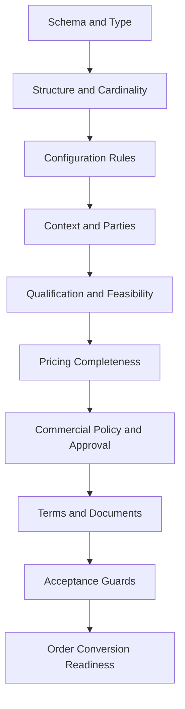
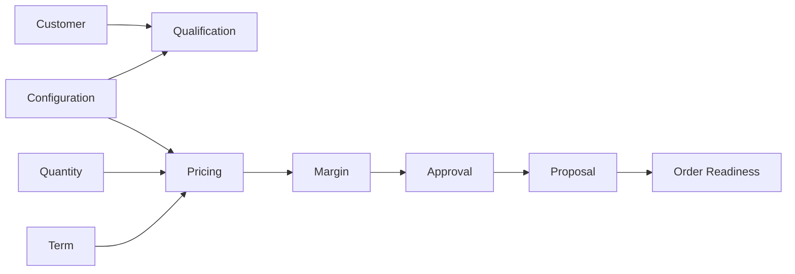

# Part 026 — Validation Layers, Completeness, Qualification, and Order Readiness

## Positioning

Sebuah Quote dapat:

- structurally valid;
- tetapi belum priced;
- priced;
- tetapi qualification expired;
- complete;
- tetapi membutuhkan approval;
- approved;
- tetapi proposal belum generated;
- presented;
- tetapi belum orderable;
- atau accepted;
- tetapi order conversion masih membutuhkan data tambahan.

Karena itu, satu boolean:

```text
quote.valid = true
```

tidak cukup.

> **Core thesis:** quote readiness adalah evidence-based, transition-specific result. Configuration validity, data completeness, qualification, pricing, approval, document readiness, acceptance readiness, dan order readiness harus dibedakan tetapi dapat dikomposisikan.

---

## 1. Validity

Validity answers:

> Are the provided values and relationships allowed?

---

## 2. Completeness

Completeness answers:

> Is all information required for a specific purpose available?

A quote can be valid but incomplete.

---

## 3. Consistency

Consistency answers:

> Do related facts agree with each other?

---

## 4. Freshness

Freshness answers:

> Are the supporting facts still current enough?

---

## 5. Qualification

Qualification answers:

> Is the offering/action allowed and feasible in context?

---

## 6. Pricing Completeness

Pricing Completeness answers:

> Does every required monetary component have a valid result?

---

## 7. Approval Readiness

Approval Readiness answers:

> Is evidence sufficient to submit for approval?

---

## 8. Presentation Readiness

Presentation Readiness answers:

> Can this exact revision be safely shown to customer?

---

## 9. Acceptance Readiness

Acceptance Readiness answers:

> Can customer acceptance be recorded now?

---

## 10. Order Readiness

Order Readiness answers:

> Can accepted commercial intent be transformed into a complete and valid Product Order?

---

## 11. Readiness Is Transition-Specific

A quote can be ready for:

- save;
- pricing;
- approval;
- presentation;
- acceptance;
- or order conversion

at different times.

---

## 12. One Global Ready Flag

A global flag hides which transition is possible and why.

---

## 13. Readiness Profile

A quote may expose:

```text
editable = true
priceable = true
approvalReady = false
presentationReady = false
acceptanceReady = false
orderReady = false
```

---

## 14. Validation Layer Model

Representative layers:



---

## 15. Layer Independence

A lower-layer failure can block higher layers.

But results should still be reported separately.

---

## 16. Validation Taxonomy

Useful categories:

- SCHEMA;
- STRUCTURE;
- CONFIGURATION;
- CONTEXT;
- PARTY;
- ACCOUNT;
- SITE;
- QUALIFICATION;
- FEASIBILITY;
- PRICING;
- MARGIN;
- APPROVAL;
- TERMS;
- DOCUMENT;
- TEMPORAL;
- ACCEPTANCE;
- ORDER_MAPPING;
- INTEGRATION.

---

## 17. Schema Validation

Checks:

- required JSON fields;
- data types;
- enum values;
- and serialization shape.

---

## 18. Domain Validation

Checks:

- business invariants;
- relationships;
- and lifecycle semantics.

Schema-valid does not mean domain-valid.

---

## 19. Structural Validation

Checks:

- parent/child relationships;
- no orphan item;
- no forbidden cycle;
- and valid item hierarchy.

---

## 20. Cardinality Validation

Checks:

- minimum/maximum selections;
- item quantity;
- characteristic collection size;
- and group choice count.

---

## 21. Characteristic Validation

Checks:

- type;
- range;
- unit;
- allowed values;
- and conditional mandatory rules.

---

## 22. Cross-Characteristic Validation

Example:

```text
if resilience = DUAL
then accessCount >= 2
```

---

## 23. Cross-Item Validation

Example:

- all items under one agreement use compatible term.

---

## 24. Relationship Validation

Checks:

- requires;
- excludes;
- substitutes;
- upgrade path;
- and inventory dependency.

---

## 25. Context Validation

Checks required:

- tenant;
- market;
- channel;
- seller;
- customer;
- account;
- currency;
- and effective time.

---

## 26. Party Validation

Checks:

- party role exists;
- legal customer identified;
- signatory known;
- and seller entity valid.

---

## 27. Account Validation

Checks:

- bill-to;
- service account;
- account state;
- and contract compatibility.

---

## 28. Site Validation

Checks:

- site identity;
- address/geocode;
- jurisdiction;
- and item assignment.

---

## 29. Inventory Reference Validation

MODIFY/DELETE/REPLACE requires:

- existing product;
- correct customer/account;
- valid lifecycle state;
- and compatible action.

---

## 30. Qualification Validation

Checks:

- market eligibility;
- customer eligibility;
- product qualification;
- and action qualification.

---

## 31. Feasibility Validation

Checks:

- technical serviceability;
- capacity;
- lead time;
- and realization constraints.

---

## 32. Priceability

Priceability means sufficient context exists to attempt pricing.

---

## 33. Pricing Completeness

Checks:

- base price exists;
- all required charges priced;
- adjustments valid;
- currency consistent;
- totals reconcile;
- and tax policy satisfied.

---

## 34. Price Freshness

Checks:

- price validity;
- promotion validity;
- exchange-rate validity;
- tax validity;
- and source versions.

---

## 35. Profitability Completeness

Checks cost/margin evidence where policy requires.

---

## 36. Approval Requirement

Determines whether approval is required.

---

## 37. Approval Validity

Checks:

- correct revision;
- current price/cost evidence;
- authority;
- conditions;
- and expiry.

---

## 38. Terms Completeness

Checks:

- contract term;
- payment term;
- renewal;
- cancellation;
- special clauses;
- and applicable term versions.

---

## 39. Document Readiness

Checks:

- proposal template;
- customer-visible content;
- exact revision;
- price/term snapshot;
- and attachments.

---

## 40. Temporal Validation

Checks:

- quote not expired;
- price current;
- approval current;
- qualification current;
- and requested dates coherent.

---

## 41. Acceptance Readiness

Checks:

- exact Presented revision;
- proposal available;
- accepter authority;
- validity;
- and no superseding revision.

---

## 42. Order Mapping Validation

Checks:

- every orderable item has mapping;
- action is supported;
- required target fields exist;
- relationships can transform;
- and version is pinned.

---

## 43. Order Data Completeness

Checks:

- requested start date;
- sites;
- accounts;
- contacts;
- existing product references;
- and fulfillment parameters.

---

## 44. Orderability versus Fulfillability

### Orderability

Can a valid Product Order be created?

### Fulfillability

Can downstream execution actually complete?

A quote may be orderable with later detailed feasibility.

---

## 45. Commercial Readiness versus Operational Readiness

Commercial readiness may tolerate:

- indicative delivery date;
- pending resource assignment;
- and later technical detail.

Operational readiness requires stronger realization data.

---

## 46. Readiness Target

Every readiness evaluation should state target.

Examples:

- SUBMIT_FOR_APPROVAL;
- PRESENT_TO_CUSTOMER;
- ACCEPT;
- CONVERT_TO_ORDER.

---

## 47. Readiness Contract

A request may include:

```text
quoteId
revision
targetTransition
validationDepth
effectiveAt
```

---

## 48. Readiness Result

A rich result may include:

- status;
- target;
- checks;
- issues;
- warnings;
- missing data;
- stale evidence;
- required actions;
- and versions.

---

## 49. Readiness Status

Possible statuses:

- READY;
- NOT_READY;
- READY_WITH_WARNINGS;
- INDETERMINATE;
- VALIDATION_IN_PROGRESS;
- STALE.

---

## 50. Check Result

Each check can be:

- PASS;
- FAIL;
- WARNING;
- NOT_APPLICABLE;
- UNKNOWN;
- PENDING;
- STALE.

---

## 51. Severity

Possible severities:

- ERROR;
- WARNING;
- INFO;
- RECOMMENDATION.

---

## 52. Blocking Transition

An issue should specify which transitions it blocks.

Example:

- missing technical contact blocks order conversion;
- but not pricing.

---

## 53. Blocking versus Warning

### Blocking

Prevents specified transition.

### Warning

Allows transition but requires visibility or acknowledgment.

---

## 54. Acknowledgement

Some warnings require explicit acknowledgment.

---

## 55. Waiver

A controlled waiver may allow progression despite an issue.

Need:

- authority;
- reason;
- scope;
- validity;
- and audit.

---

## 56. Non-Waivable Error

Examples:

- invalid currency;
- unknown legal customer;
- impossible configuration;
- and missing accepted revision.

---

## 57. Missing Data

A result should identify:

- exact field;
- scope;
- owner;
- and purpose.

---

## 58. Missing versus Unknown

### Missing

No value supplied.

### Unknown

Value is legitimately not known yet.

---

## 59. Not Applicable

The field/check does not apply in context.

---

## 60. Pending

An asynchronous check is still running.

---

## 61. Stale

A prior check exists but is no longer fresh enough.

---

## 62. Indeterminate

The system cannot reach a reliable decision.

Example:

- qualification provider unavailable.

---

## 63. Technical Failure versus Business Failure

Do not report service timeout as product ineligibility.

---

## 64. Issue Identity

Each issue needs stable identity/code.

---

## 65. Reason Code

Examples:

- MISSING_BILL_TO_ACCOUNT;
- PRICE_STALE;
- QUALIFICATION_EXPIRED;
- APPROVAL_REQUIRED;
- APPROVAL_CONDITION_VIOLATED;
- PROPOSAL_NOT_GENERATED;
- ORDER_MAPPING_MISSING;
- EXISTING_PRODUCT_NOT_FOUND;
- QUOTE_EXPIRED.

---

## 66. Issue Scope

An issue may target:

- quote;
- item;
- characteristic;
- party;
- site;
- price component;
- term;
- document;
- or integration.

---

## 67. Issue Evidence

Include:

- rule/check version;
- observed values;
- source;
- and time.

---

## 68. Suggested Resolution

Examples:

- add account;
- refresh qualification;
- reprice;
- request approval;
- regenerate proposal;
- or choose compatible offering.

---

## 69. Resolution Owner

Possible:

- Sales;
- Presales;
- Pricing;
- Finance;
- Legal;
- Customer;
- Operations;
- or System.

---

## 70. Issue Lifecycle

Possible:

- OPEN;
- ACKNOWLEDGED;
- RESOLVED;
- WAIVED;
- STALE;
- SUPERSEDED.

---

## 71. Derived Issues

Issues are usually derived from current evidence.

Avoid manually editing validation truth.

---

## 72. Issue Persistence

Options:

- calculate on demand;
- persist snapshot;
- persist issue projection;
- or hybrid.

---

## 73. On-Demand Validation

Always current if dependencies available.

Can be expensive.

---

## 74. Persisted Validation Snapshot

Useful for:

- audit;
- transition evidence;
- and support.

Can become stale.

---

## 75. Hybrid Validation

Calculate authoritative result and persist immutable snapshot for critical transition.

---

## 76. Validation Snapshot Identity

Store:

- evaluation ID;
- quote/revision;
- target;
- configuration version;
- rule versions;
- result;
- and validity.

---

## 77. Validation Version

Tied to:

- revision;
- context epoch;
- catalog publication;
- pricing snapshot;
- and rule set.

---

## 78. Invalidation

Validation becomes stale when relevant dependency changes.

---

## 79. Dependency Graph

Map input changes to checks.



---

## 80. Incremental Validation

Re-evaluate affected checks.

---

## 81. Full Validation

Run all checks for critical transition.

---

## 82. Hybrid Validation Strategy

- incremental during editing;
- full before finalization/presentation/acceptance/order conversion.

---

## 83. Validation Depth

Possible:

- LOCAL;
- QUOTE;
- COMMERCIAL;
- EXTERNAL;
- ORDER_READINESS.

---

## 84. Local Validation

Fast item/field checks.

---

## 85. Quote Validation

Cross-item and context checks.

---

## 86. Commercial Validation

Pricing, margin, approval, and terms.

---

## 87. External Validation

Qualification, tax, contract, and inventory checks.

---

## 88. Order-Readiness Validation

Transformation and mandatory operational data.

---

## 89. Short-Circuit

Can stop after critical failure for performance.

But all-reasons mode may be better for correction.

---

## 90. All-Reasons Mode

Returns all detectable issues.

Useful before finalization.

---

## 91. Fast Mode

Returns enough for interactive feedback.

---

## 92. Transition Mode

Runs authoritative checks required for one command.

---

## 93. Validation Orchestration

A readiness service may coordinate checks from multiple domains.

---

## 94. Centralized Orchestrator

Benefits:

- unified result;
- explicit target;
- and consistent user experience.

Risks:

- domain logic leakage;
- bottleneck;
- and coupling.

---

## 95. Distributed Validation

Each domain owns its check.

A coordinator composes results.

---

## 96. Validation Ownership

Examples:

- configuration engine owns product constraints;
- pricing owns monetary completeness;
- qualification owns eligibility;
- approval owns decision validity;
- quote owns aggregate and transition readiness;
- order mapping owns transformation readiness.

---

## 97. Quote Owns Final Guard

Even when checks are external, Quote transition should verify required evidence.

---

## 98. Evidence Reference

Quote can reference:

- validation snapshot;
- qualification result;
- price snapshot;
- approval decision;
- proposal;
- and mapping version.

---

## 99. Evidence Validity

Every evidence item needs:

- subject;
- version;
- result;
- validUntil;
- and source.

---

## 100. Evidence Mismatch

Example:

- approval references Price Snapshot P7;
- quote now uses P8.

Approval is invalid.

---

## 101. Evidence Completeness

All mandatory evidence for target transition must exist.

---

## 102. Evidence Freshness

All mandatory evidence must still be valid.

---

## 103. Evidence Consistency

All evidence must reference same:

- quote revision;
- configuration;
- and context.

---

## 104. Readiness Composition

A target readiness result can be computed from mandatory checks.

Example:

```text
if any mandatory FAIL -> NOT_READY
else if mandatory PENDING/UNKNOWN -> INDETERMINATE
else if warnings -> READY_WITH_WARNINGS
else -> READY
```

---

## 105. Warning Policy

Some transitions may allow warnings.

Others may require acknowledgment.

---

## 106. Waiver Policy

Only explicitly waiver-enabled checks may be waived.

---

## 107. Readiness Score

Avoid reducing readiness to arbitrary numeric score unless it has clear semantics.

---

## 108. Progress Indicator

A user-facing progress indicator can show:

- completed sections;
- missing fields;
- and blocked stages.

Do not confuse with authoritative readiness.

---

## 109. Presentation Readiness

Typical checks:

- revision finalized;
- configuration valid;
- qualification sufficient;
- price complete/current;
- approval valid;
- terms complete;
- proposal generated;
- customer parties available;
- and quote not expired.

---

## 110. Approval Submission Readiness

Typical checks:

- price complete;
- profitability evidence;
- exception reasons;
- requester authority;
- and no blocking validation issue.

---

## 111. Acceptance Readiness

Typical checks:

- exact revision presented;
- proposal evidence;
- price/approval/validity current;
- authorized accepter;
- and no superseding revision.

---

## 112. Order Conversion Readiness

Typical checks:

- accepted revision;
- item actions;
- target configuration;
- inventory references;
- product-order mapping;
- requested dates;
- accounts/sites/contacts;
- monetary lineage;
- and idempotency key.

---

## 113. Order Readiness after Acceptance

Some data may be collected after acceptance according to business design.

If so, distinguish:

- commercially accepted;
- order preparation pending;
- and orderable.

---

## 114. Conditional Orderability

Example:

> Orderable after final site contact is supplied.

---

## 115. Partial Order Readiness

In multi-site quote:

- some sites ready;
- others pending.

Policy decides:

- partial order;
- split order;
- or block all.

---

## 116. Item-Level Readiness

Each item may have readiness state.

---

## 117. Quote-Level Aggregate Readiness

Aggregate according to policy:

- all items;
- minimum subset;
- selected items;
- or wave.

---

## 118. Wave Readiness

A delivery wave can be independently order-ready.

---

## 119. Split Order Recommendation

If some items are ready, readiness result may recommend splitting.

---

## 120. Order Mapping Check

Validate each item maps to:

- ProductOrderItem;
- action;
- relationships;
- and required target fields.

---

## 121. Mapping Version

Must be pinned for reproducibility.

---

## 122. Unsupported Action

Example:

- offering supports ADD but not MODIFY.

---

## 123. Existing Product State

MODIFY requires active/allowed current product state.

---

## 124. Duplicate In-Flight Order

Order readiness should detect conflicting existing order.

---

## 125. Requested Date

Must be:

- present when required;
- within policy;
- and compatible with dependencies.

---

## 126. Contact Completeness

Installation or service contacts may be required.

---

## 127. Address Completeness

Order may need normalized address beyond quote presentation needs.

---

## 128. Billing Data Completeness

Billing account, payment profile, or tax identity may be required.

---

## 129. Contract/Agreement Readiness

Accepted quote may need:

- existing agreement;
- generated agreement;
- or contract reference.

---

## 130. Document Readiness versus Legal Readiness

A PDF exists does not mean:

- terms approved;
- signatory valid;
- or legal clauses complete.

---

## 131. Proposal Generation Race

Readiness result must reference exact revision and document checksum.

---

## 132. Acceptance Race

Acceptance command rechecks readiness atomically.

---

## 133. Order Conversion Race

Order readiness may change between check and command.

Use transition-time guards and idempotency.

---

## 134. Time-of-Check to Time-of-Use

A prior readiness result is evidence, not unconditional future authorization.

---

## 135. Atomic Guard

Critical state/version/time checks should be evaluated at transition commit.

---

## 136. External Evidence Race

Qualification or tax may expire just before transition.

Use authoritative time and validity.

---

## 137. Readiness Cache

Can cache by:

- quote revision;
- target;
- context epoch;
- evidence versions;
- and rule set.

---

## 138. Cache Invalidation

Trigger on:

- item change;
- price change;
- approval change;
- qualification expiry;
- proposal generation;
- or context change.

---

## 139. Stale Allowed-Actions Projection

UI may display an action that later fails.

Server remains authoritative.

---

## 140. Synchronous Validation

Good for local/fast checks.

---

## 141. Asynchronous Validation

Needed for:

- large quote;
- multi-site qualification;
- deep feasibility;
- tax;
- and external contract validation.

---

## 142. Validation Job

States:

- REQUESTED;
- RUNNING;
- PARTIAL;
- COMPLETED;
- FAILED;
- CANCELLED;
- SUPERSEDED.

---

## 143. Partial Validation Result

Expose progress but do not mark quote ready until mandatory checks complete.

---

## 144. Validation Supersession

New quote version supersedes older running job.

---

## 145. Cancellation

Canceling job should not delete prior valid evidence.

---

## 146. Retry

Retry transient external failures.

---

## 147. Timeout

Return:

- PENDING;
- UNKNOWN;
- or INDETERMINATE.

Not a business failure.

---

## 148. Circuit Breaker

Protect quote workflow from failing dependency.

---

## 149. Fallback

Possible:

- last valid evidence;
- manual review;
- conservative block;
- or non-binding warning.

Must be explicit.

---

## 150. Manual Review

A readiness issue can route to human review.

---

## 151. Manual Review Result

Should produce:

- decision;
- scope;
- conditions;
- validity;
- and authority.

---

## 152. Support Override

Emergency override should be rare, scoped, audited, and non-waivable checks excluded.

---

## 153. Validation API

Possible request:

```json
{
  "quoteId": "QUO-123",
  "revision": 7,
  "target": "PRESENT_TO_CUSTOMER",
  "depth": "COMMERCIAL",
  "expectedVersion": 42
}
```

---

## 154. Validation API Response

Possible structure:

```text
evaluationId
quote/revision
target
status
checks
issues
warnings
missingData
staleEvidence
requiredActions
validUntil
versions
```

---

## 155. Transition API Integration

A transition command may:

- invoke validation internally;
- or require a current evidence token.

---

## 156. Evidence Token

Opaque token can bind:

- revision;
- target;
- validation result;
- and expiry.

Transition still rechecks critical guards.

---

## 157. Validation Event

Representative events:

- QuoteValidationCompleted;
- QuoteReadinessChanged;
- QuoteMarkedNotReady;
- QuoteOrderReadinessEstablished;
- QuoteValidationSuperseded.

---

## 158. Event Noise

Avoid event per individual field warning unless consumers need it.

---

## 159. Readiness Change Event

Emit when meaningful aggregate readiness changes.

---

## 160. Issue Projection

A projection can support UI task list.

---

## 161. Issue Search

Search by:

- owner;
- severity;
- reason;
- quote;
- and age.

---

## 162. Data Quality Dashboard

Track recurring missing fields and upstream causes.

---

## 163. Validation Metrics

- evaluation latency;
- failures by category;
- warning rate;
- stale evidence rate;
- and repeated validation count.

---

## 164. Readiness Metrics

- approval-ready rate;
- presentation-ready rate;
- acceptance-ready rate;
- order-ready rate;
- and time-to-ready.

---

## 165. Funnel Analysis

Measure drop-off:

```text
Configured
-> Valid
-> Priced
-> Approved
-> Presented
-> Accepted
-> Order Ready
```

---

## 166. Blocking Reason Distribution

Identify top reasons:

- stale price;
- missing account;
- qualification failure;
- approval;
- mapping;
- and document.

---

## 167. False Blocking

A check incorrectly prevents valid deal.

---

## 168. False Readiness

System marks ready but downstream fails.

This is more dangerous.

---

## 169. Readiness Accuracy

Compare readiness decision with:

- presentation failure;
- acceptance failure;
- order fallout;
- and manual correction.

---

## 170. Validation Drift

Different services disagree on validity.

---

## 171. Contract Tests

Ensure:

- shared reason codes;
- result semantics;
- and version compatibility.

---

## 172. Differential Validation

Compare current and candidate rule sets.

---

## 173. Shadow Validation

Run candidate checks without blocking users.

---

## 174. Rule Rollout

Use:

- versioned rules;
- canary tenant;
- and rollback.

---

## 175. Validation Replay

Given historical revision and evidence versions, reproduce result.

---

## 176. Replay Limitations

External systems may not retain historical data.

Snapshot required evidence.

---

## 177. Validation Audit

For critical transition, retain:

- evaluation;
- result;
- issues;
- waivers;
- actor;
- and versions.

---

## 178. Security

Validation result can reveal:

- credit;
- margin;
- product restrictions;
- internal policy;
- and technical topology.

---

## 179. Role-Aware Issues

Customer may see:

> Additional review required.

Internal approver may see detailed reason.

---

## 180. Field-Level Redaction

Remove sensitive evidence from broad API/event.

---

## 181. Tenant Isolation

Apply to:

- validation cache;
- issue projection;
- jobs;
- events;
- and traces.

---

## 182. Large Quote Validation

Challenges:

- thousands of items;
- cross-item rules;
- external calls;
- and partial results.

---

## 183. Partitioned Validation

Validate item partitions independently, then run quote-level checks.

---

## 184. Validation Barrier

Before finalization or transition:

- ensure all partition results use expected versions;
- then run aggregate checks.

---

## 185. Incremental Partition Validation

Only changed partition revalidates.

Quote-level dependent checks rerun.

---

## 186. Bulk Issue Representation

Avoid returning millions of identical errors.

Group by:

- reason;
- item set;
- site set;
- and remediation.

---

## 187. Sample and Count

Example:

```text
MISSING_INSTALLATION_CONTACT
count = 127
sampleItems = [...]
```

---

## 188. Partial Qualification

Represent per-site results and aggregate policy.

---

## 189. Partial Pricing

Quote is not fully presentation-ready if required items are unpriced.

---

## 190. Partial Approval

Some items approved, others pending.

Policy decides if quote can split/present partially.

---

## 191. Partial Orderability

May produce multiple orders or waves.

---

## 192. Readiness Policy

Policy defines:

- mandatory checks;
- accepted warnings;
- waiver rules;
- and aggregation.

---

## 193. Policy Version

Store with readiness result.

---

## 194. Target-Specific Policy

Approval readiness and order readiness use different policies.

---

## 195. Market-Specific Policy

Different market/legal requirements may exist.

---

## 196. Product-Specific Policy

Some products need deeper feasibility or documentation.

---

## 197. Channel-Specific Policy

Self-service may require stricter automation completeness.

---

## 198. Customer-Specific Policy

Contract may add mandatory checks.

Avoid hard-coded IDs.

---

## 199. Readiness State Projection

A projection may show:

- blocked;
- waiting external;
- waiting user;
- ready;
- and expired.

---

## 200. Readiness Is Derived

Prefer deriving from evidence rather than manually setting.

---

## 201. Manual Ready Flag Anti-Pattern

User can bypass missing checks.

---

## 202. Direct Database Fix

Bypasses evidence, audit, and transition guards.

---

## 203. Validation Smells

- one giant validate endpoint;
- one boolean;
- and all failures returned as generic error.

---

## 204. Completeness Smells

- null check only;
- no purpose/transition context;
- and unknown treated as missing.

---

## 205. Readiness Smells

- ready stored manually;
- stale allowed-action cache trusted;
- and order readiness assumed from acceptance.

---

## 206. Qualification Smells

- timeout = not eligible;
- validity absent;
- and quote-level result hides site failures.

---

## 207. Pricing Smells

- total exists but components missing;
- zero used for no price;
- and stale tax ignored.

---

## 208. Approval Smells

- approval boolean;
- not tied to revision;
- and conditions not revalidated.

---

## 209. Document Smells

- any PDF means ready;
- wrong revision document accepted;
- and checksum absent.

---

## 210. Orderability Smells

- mapping checked only after acceptance;
- missing inventory references;
- and required dates collected too late without policy.

---

## 211. Anti-Patterns

### Valid Equals Complete

Missing data slips through.

### Complete Equals Ready

Stale price and invalid approval ignored.

### Accepted Equals Orderable

Order conversion fails.

### One Readiness for All Transitions

Checks are either too strict or too weak.

### External Timeout Equals Business Failure

False rejection.

### Validation Snapshot Never Invalidated

Stale evidence accepted.

### All Checks in Quote Service

Domain ownership collapses.

---

## 212. Readiness Result Template

```md
## Evaluation Identity

## Quote / Revision

## Target Transition

## Overall Status

## Policy / Rule Versions

## Checks

For each:
- Check ID
- Category
- Status
- Severity
- Scope
- Evidence
- Validity
- Blocking transitions
- Suggested resolution
- Owner

## Missing Data

## Stale Evidence

## Warnings

## Waivers

## Required Actions

## Valid Until
```

---

## 213. Issue Template

```text
Issue ID:
Reason code:
Category:
Severity:
Scope:
Observed value:
Expected condition:
Evidence source/version:
Blocking transitions:
Waiver allowed:
Suggested action:
Owner:
```

---

## 214. Evidence Template

```text
Evidence ID:
Type:
Subject quote/revision:
Result:
Source:
Source version:
Captured at:
Valid until:
Context hash:
Checksum:
```

---

## 215. Readiness Policy Template

```text
Policy ID/version:
Target transition:
Mandatory checks:
Optional checks:
Warning policy:
Acknowledgement policy:
Waiver policy:
Aggregation:
Freshness requirements:
Scope overrides:
Owner:
```

---

## 216. Order Readiness Template

```md
## Accepted Revision

## Product Order Mapping Version

## Item Actions

## Existing Product References

## Target Configuration

## Accounts / Parties / Sites

## Requested Dates

## Monetary Lineage

## Agreement / Contract

## Dependency Graph

## Partial-Order Policy

## Idempotency / Conversion Key

## Blocking Issues
```

---

## 217. Transition Readiness Matrix

| Check | Approval | Presentation | Acceptance | Order |
|---|---:|---:|---:|---:|
| Configuration valid | Required | Required | Required | Required |
| Price complete | Required | Required | Required | Required |
| Price current | Usually | Required | Required | Required |
| Approval valid | N/A | Required | Required | Required |
| Proposal generated | No | Required | Required | No |
| Accepter authority | No | No | Required | No |
| Order mapping | No | Optional | Optional | Required |
| Installation contact | Optional | Optional | Policy | Required |

---

## 218. Worked Example: Valid but Incomplete

Quote has valid product configuration.

Missing:

- bill-to account;
- requested start date.

It is:

- priceable;
- not order-ready.

---

## 219. Worked Example: Complete but Stale

All data exists.

Price validity expired.

Result:

- completeness PASS;
- price freshness FAIL;
- presentation/acceptance NOT_READY;
- action: reprice.

---

## 220. Worked Example: Approval Required

Price and configuration valid.

Margin below target.

Result:

- approval readiness READY;
- presentation readiness NOT_READY;
- action: submit approval.

---

## 221. Worked Example: Proposal Missing

Quote approved and price current.

No generated proposal.

Result:

- commercial checks pass;
- document readiness fails;
- cannot present/accept through proposal channel.

---

## 222. Worked Example: Qualification Timeout

Site feasibility provider times out.

Result:

- qualification UNKNOWN/INDETERMINATE;
- not “not serviceable”;
- order readiness blocked or manual review according to policy.

---

## 223. Worked Example: Accepted but Not Order-Ready

Customer accepted proposal.

Installation contact missing.

System preserves acceptance and creates order-preparation task.

Whether this design is allowed must be explicit.

---

## 224. Worked Example: Multi-Site Partial Readiness

100 sites:

- 90 ready;
- 10 missing feasibility.

Policy may:

- block all;
- split order;
- or create first wave.

Readiness result provides per-site and aggregate view.

---

## 225. Worked Example: Approval Evidence Mismatch

Approval references Price Snapshot P10.

Quote now uses P11.

Approval check fails with:

- APPROVAL_EVIDENCE_MISMATCH.

---

## 226. Worked Example: Mapping Missing

One new add-on has no order transformation mapping.

Quote may still be presentation-ready if policy permits, but cannot be order-ready.

High-risk organizations may block presentation earlier.

---

## 227. Worked Example: Superseded Validation Job

Validation for Revision 6 is running.

Revision 7 is created.

Revision 6 job completes but cannot update Revision 7 readiness.

---

## 228. Worked Example: Accept/Expiry Boundary

Readiness check passed one minute earlier.

At acceptance time quote is expired.

Atomic transition guard rejects acceptance.

---

## 229. Worked Example: Large Quote Grouped Issues

500 sites lack same contact type.

Response groups issue:

- reason;
- count;
- affected-site list/reference;
- and bulk remediation action.

---

## 230. Senior Engineer Operating Model

### Separate validity, completeness, and readiness

They answer different questions.

### Make readiness transition-specific

Approval, presentation, acceptance, and order need different evidence.

### Use rich results

Status, issues, evidence, owner, and resolution.

### Distinguish stale, unknown, and fail

Especially external checks.

### Compose domain-owned checks

Do not centralize all semantics.

### Persist critical evidence

Then invalidate it correctly.

### Recheck at transition time

Prevent time-of-check/time-of-use defects.

### Design partial readiness

For multi-site and large deals.

### Learn from downstream fallout

False readiness is a serious quality signal.

---

## 231. Internal Verification Checklist

### Taxonomy

- Are validity, completeness, consistency, freshness, qualification, and readiness distinguished?
- What validation categories exist?
- Are warnings, blocking errors, unknown, pending, and stale separate?
- Are issue reason codes stable?

### Transition-specific readiness

- What checks are required for approval submission?
- What checks are required for presentation?
- What checks are required for acceptance?
- What checks are required for order conversion?

### Evidence

- Are validation, qualification, pricing, approval, proposal, and mapping results first-class evidence?
- Are they bound to exact revision?
- Do they have validity and versions?
- How is evidence mismatch detected?

### Invalidation

- What changes invalidate each check?
- Is there a dependency graph?
- Are incremental and full validations both used?
- Can old async jobs overwrite new revision readiness?

### Partial results

- Is item/site-level readiness available?
- Can quote split into waves/orders?
- How are grouped issues represented?
- What does partial approval/pricing mean?

### APIs and ownership

- Is one service orchestrating or owning all checks?
- Which bounded context owns each rule?
- Does Quote own the final transition guard?
- Are readiness tokens/caches version-safe?

### Operations

- What are the top blocking reasons?
- Are time-to-ready and false-readiness measured?
- Can support inspect evidence and staleness?
- What downstream fallout indicates missing validation?

---

## 232. Practical Exercises

### Exercise 1 — Taxonomy

Classify 50 checks as validity, completeness, qualification, freshness, approval, document, or order readiness.

### Exercise 2 — Transition matrix

Define mandatory checks for approval, presentation, acceptance, and order.

### Exercise 3 — Invalidation graph

Map quote changes to stale evidence and affected readiness targets.

### Exercise 4 — Partial readiness

Design multi-site quote readiness with split-order policy.

### Exercise 5 — Rich result API

Replace boolean `valid` with an explainable contract.

### Exercise 6 — Fallout feedback

Map top order failures back to missing quote-readiness checks.

---

## 233. Part Completion Checklist

You are done if you can:

- distinguish validity, completeness, consistency, freshness, and readiness;
- define target-specific readiness;
- classify validation layers;
- model blocking, warning, unknown, pending, and stale results;
- preserve issue scope, evidence, owner, and resolution;
- compose checks from multiple bounded contexts;
- invalidate results through dependency versions;
- recheck critical guards atomically;
- support partial item/site/order readiness;
- and create an internal validation/readiness verification backlog.

---

## 234. Key Takeaways

1. Valid does not mean complete.
2. Complete does not mean ready.
3. Ready must name the target transition.
4. Qualification, price, approval, document, and order evidence are distinct.
5. Unknown is not failure.
6. Stale evidence must be invalidated.
7. Quote owns final transition guard, not every validation rule.
8. Acceptance does not automatically imply orderability.
9. Partial readiness is essential for large enterprise deals.
10. Internal CSG validation and order-readiness semantics must be verified.

---

## 235. References

Conceptual baseline:

- General CPQ quote validation, completeness, qualification, approval, presentation, acceptance, and order-readiness practices.
- Domain-Driven Design invariants, policies, domain-owned validation, and aggregate transition guards.
- Distributed systems freshness, evidence versioning, asynchronous jobs, idempotency, and time-of-check/time-of-use concepts.
- TM Forum Quote, Product Offering Qualification, and Product Order vocabulary.

These references do not define internal CSG validation or readiness implementation.
