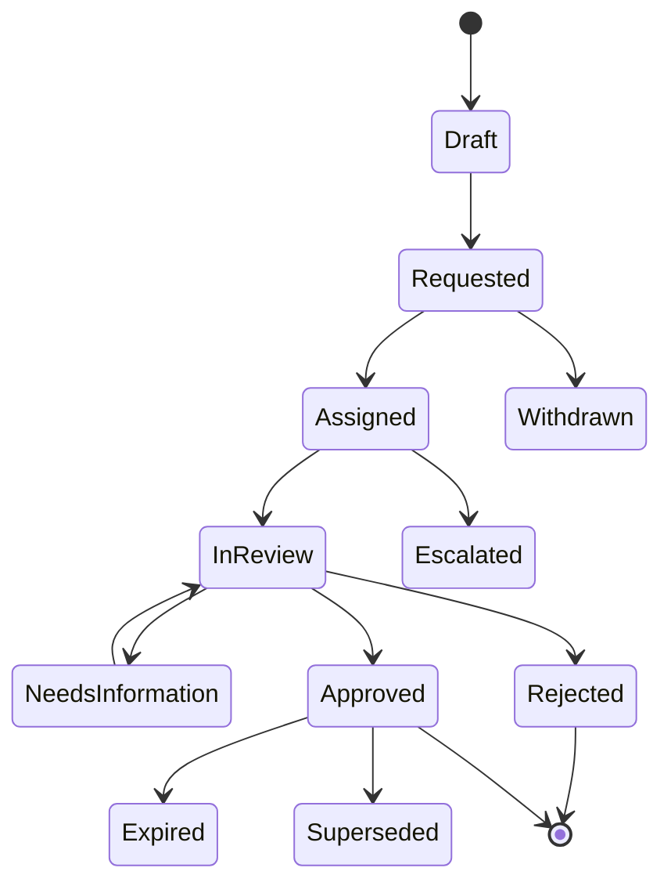

# Part 027 — Approval Requests, Authority, Delegation, Escalation, and Reapproval

## Positioning

Approval bukan sekadar field:

```text
approved = true
```

Enterprise approval adalah lifecycle yang harus menjawab:

- exception apa yang sedang diminta;
- policy mana yang memerlukan approval;
- revision dan evidence mana yang dinilai;
- siapa yang memiliki authority;
- apakah authority berasal dari role atau delegation;
- apakah keputusan bersyarat;
- apa yang menginvalidasi keputusan;
- bagaimana timeout dan escalation bekerja;
- dan apakah audit dapat merekonstruksi alasan keputusan.

> **Core thesis:** approval harus dimodelkan sebagai bounded lifecycle yang policy-driven dan evidence-bound. Quote menggunakan hasil approval, tetapi tidak seharusnya menanam seluruh workflow dan authority semantics di dalam aggregate Quote.

---

## 1. Approval Domain Purpose

Approval domain mengotorisasi exception atau commitment.

Examples:

- high discount;
- low margin;
- non-standard term;
- waived fee;
- extended validity;
- unusual payment condition;
- legal deviation;
- product exception;
- and delivery-risk acceptance.

---

## 2. Approval versus Validation

### Validation

Determines whether a rule is satisfied.

### Approval

Allows an authorized exception to a policy or confirms a governed commitment.

A failed hard technical constraint should not be “approved away” unless the domain explicitly permits it.

---

## 3. Approval versus Authorization

### Authorization

Can this actor perform the command?

### Approval

Has an authorized authority accepted the commercial exception?

Both are required.

---

## 4. Approval versus Review

### Review

A stakeholder checks content.

### Approval

A formal decision with authority and audit consequences.

A review comment is not an approval decision.

---

## 5. Approval Aggregate

An Approval Request can be its own aggregate root.

It may own:

- request identity;
- subject;
- exception lines;
- policy references;
- evidence references;
- authority requirements;
- assignments;
- decisions;
- conditions;
- expiry;
- and audit history.

---

## 6. Why Separate from Quote

Benefits:

- reusable approval engine;
- independent workflow lifecycle;
- better authority model;
- lower Quote coupling;
- and clear audit.

Risks:

- distributed consistency;
- stale evidence;
- and dual ownership.

Use exact revision/evidence binding.

---

## 7. Approval Request Identity

Example:

```text
Approval Request ID: APR-2026-000123
Quote ID: QUO-123
Quote Revision: 7
```

---

## 8. Request Version

Approval Request itself needs technical version for concurrency.

---

## 9. Request Revision

If evidence materially changes, create:

- a new request;
- or a new request revision.

Do not mutate a decided request.

---

## 10. Approval Subject

The subject may be:

- whole quote;
- quote item;
- adjustment;
- term;
- price component;
- profitability result;
- or legal clause.

---

## 11. Approval Line

One request may contain multiple approval lines.

Example:

- discount exception;
- term exception;
- margin exception.

Each line should have identity and status.

---

## 12. Request-Level versus Line-Level Decision

Possible policies:

- all lines decided together;
- each line independently;
- or grouped by authority domain.

---

## 13. Approval Scope

Scope may be:

- adjustment;
- item;
- bundle;
- quote revision;
- customer/account;
- contract;
- market;
- or time-bounded reusable policy exception.

---

## 14. Revision-Bound Scope

Most quote approvals should bind to exact:

- Quote ID;
- revision;
- pricing snapshot;
- profitability snapshot;
- and relevant terms.

---

## 15. Evidence-Bound Approval

An approval decision is meaningful only for the evidence evaluated.

---

## 16. Evidence Bundle

May include:

- quote snapshot;
- price snapshot;
- discount trace;
- cost snapshot;
- margin result;
- term diff;
- proposal draft;
- risk assessment;
- and policy evaluation.

---

## 17. Evidence Identity

Every evidence artifact needs:

- ID;
- version;
- checksum;
- capturedAt;
- and subject.

---

## 18. Evidence Checksum

Binds decision to exact content.

---

## 19. Evidence Change

If evidence changes, approval may become:

- stale;
- invalid;
- superseded;
- or still valid under conditions.

---

## 20. Policy

A Policy determines:

- whether approval is required;
- required authority;
- allowed conditions;
- expiry;
- and reapproval triggers.

---

## 21. Policy Identity

Store:

```text
policyId
policyVersion
effectivePeriod
scope
owner
```

---

## 22. Policy Evaluation

Inputs may include:

- discount percentage;
- margin;
- TCV;
- term;
- product;
- market;
- channel;
- customer classification;
- and exception type.

---

## 23. Policy Result

Possible output:

- NOT_REQUIRED;
- REQUIRED;
- BLOCKED;
- MANUAL_REVIEW;
- and MULTIPLE_APPROVALS_REQUIRED.

---

## 24. Policy Explainability

A result should explain:

```text
Why is approval required?
Which threshold was crossed?
Which authority level is needed?
Which evidence is missing?
```

---

## 25. Policy Owner

Possible owners:

- Commercial;
- Finance;
- Legal;
- Product;
- Security;
- Operations;
- and Risk.

---

## 26. Policy Change

A new policy version should not reinterpret historical approval decisions.

---

## 27. Authority Requirement

An authority requirement may include:

- authority domain;
- level;
- monetary limit;
- product scope;
- market scope;
- customer scope;
- and time validity.

---

## 28. Authority Domain

Examples:

- Commercial;
- Pricing;
- Finance;
- Legal;
- Product;
- Risk;
- Security;
- and Delivery.

---

## 29. Authority Level

Possible model:

```text
Level 1
Level 2
Level 3
Executive
```

Use meaningful internal names if available.

---

## 30. Authority Limit

A limit may apply to:

- discount;
- margin exception;
- contract value;
- liability;
- or payment term.

---

## 31. Authority Scope

An approver may have authority only for:

- one market;
- product family;
- legal entity;
- channel;
- customer segment;
- or tenant.

---

## 32. Authority Source

Possible sources:

- organizational role;
- explicit entitlement;
- delegation;
- temporary assignment;
- and committee membership.

---

## 33. Role Is Not Sufficient

A title alone may not prove authority.

Authority should be resolved from governed data.

---

## 34. Authority Resolution

The engine should determine eligible approvers using:

- policy requirement;
- organization;
- scope;
- amount;
- availability;
- and delegation.

---

## 35. Authority Snapshot

At decision time, preserve:

- approver;
- role;
- scope;
- limit;
- and authority source.

---

## 36. Separation of Duties

Common rules:

- requester cannot approve own request;
- price override creator cannot be sole approver;
- delegate cannot exceed delegator authority;
- and conflicting roles may be excluded.

---

## 37. Maker–Checker

One actor creates the exception; another checks it.

---

## 38. Four-Eyes Principle

At least two independent persons review high-risk decision.

---

## 39. Self-Approval

If allowed for low-risk thresholds, make it explicit and audited.

---

## 40. Authority Conflict

One user may hold multiple roles.

Evaluate effective authority and separation rules.

---

## 41. Delegation

Delegation allows another actor to exercise authority.

---

## 42. Delegation Identity

Store:

- delegator;
- delegate;
- authority scope;
- limit;
- start;
- end;
- reason;
- and status.

---

## 43. Temporary Delegation

Useful for:

- leave;
- workload;
- and emergency coverage.

---

## 44. Delegation Limit

Delegate cannot exceed delegated:

- monetary threshold;
- policy type;
- market;
- and duration.

---

## 45. Transitive Delegation

Usually risky.

Example:

```text
A delegates to B
B delegates to C
```

Define whether allowed.

---

## 46. Delegation Revocation

Revocation affects future decisions.

Already valid decisions remain historical facts unless policy says otherwise.

---

## 47. Delegation Expiry

Decision must check delegation validity at effective decision time.

---

## 48. Emergency Authority

Emergency approval should require:

- narrow scope;
- short expiry;
- reason;
- elevated audit;
- and post-review.

---

## 49. Approval Route

A route defines required approval steps.

---

## 50. Sequential Route

Example:

```text
Sales Manager
-> Finance
-> Commercial Director
```

---

## 51. Parallel Route

Example:

```text
Finance + Legal
```

Both can review concurrently.

---

## 52. Any-One Route

Any eligible member of authority group may decide.

---

## 53. All-Required Route

Every required authority domain must approve.

---

## 54. Quorum Route

A minimum number or combination of decisions is required.

---

## 55. Conditional Route

Additional step appears when:

- margin below floor;
- term exceeds threshold;
- or product is regulated.

---

## 56. Dynamic Route

Route is generated from policy evaluation and evidence.

---

## 57. Static Route Risk

Hard-coded workflow may not reflect product/market/customer context.

---

## 58. Route Version

Store the route definition/version used.

---

## 59. Approval Step

A step may contain:

- step ID;
- authority requirement;
- assignment rule;
- state;
- SLA;
- and decisions.

---

## 60. Step State

Possible:

- NOT_STARTED;
- READY;
- ASSIGNED;
- IN_REVIEW;
- NEEDS_INFORMATION;
- APPROVED;
- REJECTED;
- SKIPPED;
- EXPIRED;
- CANCELLED;
- SUPERSEDED.

---

## 61. Step Dependency

A step may begin after:

- prior approval;
- evidence completion;
- or another parallel group.

---

## 62. Conditional Skip

A step may be skipped when policy condition no longer applies.

Store reason.

---

## 63. Assignment

An approval step may assign to:

- user;
- authority group;
- role pool;
- queue;
- or committee.

---

## 64. Assignment Rule

Possible:

- account owner’s manager;
- regional finance queue;
- legal entity counsel;
- lowest available authority;
- or named committee.

---

## 65. Assignment Snapshot

Preserve who/what was assigned and why.

---

## 66. Claim Task

An eligible approver claims a queued task.

---

## 67. Reassignment

Possible due to:

- workload;
- leave;
- conflict of interest;
- or escalation.

---

## 68. Reassignment Audit

Record:

- from;
- to;
- reason;
- actor;
- and time.

---

## 69. Conflict of Interest

Approver may need recusal.

---

## 70. Recusal

A recused approver cannot decide the request.

---

## 71. Approval Decision

Possible decisions:

- APPROVE;
- REJECT;
- APPROVE_WITH_CONDITIONS;
- REQUEST_INFORMATION;
- ABSTAIN.

---

## 72. Decision Immutability

Once terminal, decision should not be edited.

Use correction or superseding decision process.

---

## 73. Decision Reason

Use:

- stable reason code;
- structured conditions;
- optional comment.

---

## 74. Rejection Reason

Examples:

- margin too low;
- insufficient evidence;
- unsupported term;
- customer risk;
- or authority policy.

---

## 75. Rejection Is Not Failure

It is a valid business outcome.

---

## 76. Conditional Approval

A decision may depend on:

- term remaining 36 months;
- setup fee retained;
- discount not exceeding value;
- or product scope unchanged.

---

## 77. Machine-Readable Condition

Prefer:

```text
termMonths >= 36
setupFeeWaived = false
discountPercent <= 20
```

over free text only.

---

## 78. Condition Owner

The approval domain records condition.

Quote/readiness validates it before transition.

---

## 79. Condition Evaluation

Evaluate against exact current revision/evidence.

---

## 80. Condition Violation

Approval becomes invalid or reapproval required.

---

## 81. Request Information

Approver asks for:

- cost evidence;
- customer justification;
- revised term;
- or technical review.

---

## 82. Information Response

Requester adds evidence or creates revised request.

---

## 83. Evidence Mutation Risk

Do not replace evidence on an in-review request without versioning.

---

## 84. Approval Request Lifecycle

Illustrative lifecycle:



---

## 85. Draft Request

Can be assembled before submission.

---

## 86. Requested

Officially submitted and policy-resolved.

---

## 87. Assigned

Approver/queue identified.

---

## 88. In Review

Decision work is active.

---

## 89. Needs Information

Blocked pending additional evidence.

---

## 90. Approved

All required route conditions satisfied.

---

## 91. Rejected

A required route fails.

---

## 92. Withdrawn

Requester withdraws before final decision.

---

## 93. Cancelled

System cancels due to quote cancellation or invalid context.

---

## 94. Expired

Approval validity elapsed.

---

## 95. Superseded

A newer approval request replaces it.

---

## 96. Approval Request and Quote State

Quote may remain:

- Draft;
- Pending Approval;
- or other business state.

Avoid dual authority over quote lifecycle.

---

## 97. Quote Integration Pattern

Quote references:

- approval request ID;
- decision/evidence;
- validity;
- and conditions.

---

## 98. Quote Transition Guard

Before presentation/acceptance, Quote verifies:

- required approvals exist;
- decisions are final;
- evidence matches;
- conditions hold;
- and approval not expired.

---

## 99. Approval Service Availability

A previous valid approval can be verified from local evidence/cache if designed safely.

Do not make every Quote read synchronously depend on approval service.

---

## 100. Approval Projection

Quote may maintain a projection:

- approval required;
- pending;
- approved;
- rejected;
- stale.

The approval service remains decision authority.

---

## 101. Approval Event

Representative events:

- ApprovalRequested;
- ApprovalAssigned;
- ApprovalInformationRequested;
- ApprovalGranted;
- ApprovalRejected;
- ApprovalExpired;
- ApprovalSuperseded;
- ReapprovalRequired.

---

## 102. Event Payload

Include:

- request ID;
- quote/revision;
- step;
- outcome;
- authority reference;
- conditions;
- and validity.

Avoid sensitive cost details.

---

## 103. Event Ordering

Use Approval Request ID as key.

---

## 104. Duplicate Events

Consumers must be idempotent.

---

## 105. Outbox

Persist decision and outbox atomically.

---

## 106. Approval Timeout

A step can exceed its expected decision window.

---

## 107. SLA

SLA may depend on:

- exception severity;
- quote value;
- market;
- and customer deadline.

---

## 108. Timeout Is Not Rejection

A timed-out approval remains undecided unless policy explicitly auto-rejects.

---

## 109. Reminder

Reminders can be sent before escalation.

---

## 110. Escalation

Escalation changes routing/attention.

It is not approval.

---

## 111. Escalation Target

Possible:

- manager;
- higher authority;
- alternate queue;
- or operations support.

---

## 112. Escalation Level

Multiple levels may exist.

---

## 113. Escalation Reason

Examples:

- SLA breach;
- unavailable approver;
- conflict of interest;
- and business urgency.

---

## 114. Auto-Escalation

Triggered by timer.

Must be idempotent.

---

## 115. Manual Escalation

Initiated by authorized user with reason.

---

## 116. Escalation Loop

Prevent:

```text
A -> B -> A -> B
```

Use route history and maximum levels.

---

## 117. Approval Expiry

Approval validity can depend on:

- fixed time;
- quote validity;
- price validity;
- cost validity;
- or policy.

---

## 118. Approval Valid Until

Store exact:

- instant;
- timezone;
- and reason.

---

## 119. Expiry Timer

May use:

- scheduler;
- workflow timer;
- delayed message;
- or periodic scan.

---

## 120. Expiry Guard

Even before timer persists state, Quote transition should reject expired approval by authoritative time.

---

## 121. Reapproval

Reapproval is required when approved evidence no longer matches current commercial state.

---

## 122. Reapproval Trigger Categories

- price changed;
- discount changed;
- cost changed;
- margin changed;
- quantity changed;
- term changed;
- product changed;
- currency changed;
- customer/account changed;
- clause changed;
- approval expired;
- and policy changed.

---

## 123. Semantic Diff

Reapproval should use semantic change, not any timestamp/update.

---

## 124. Materiality Rule

Small non-material differences may not invalidate approval.

Examples:

- formatting;
- internal note;
- rounding within permitted tolerance.

---

## 125. Reapproval Matrix

| Change | Reapproval |
|---|---:|
| Customer-visible price | Usually |
| Discount basis | Yes |
| Margin result | Policy-based |
| Product scope | Usually |
| Internal note | No |
| Proposal styling | No |
| Legal term | Yes |
| Tax estimate only | Policy-based |

---

## 126. Approval Carry-Forward

A decision may carry forward when:

- subject/evidence unchanged;
- condition still holds;
- policy permits;
- and validity remains.

---

## 127. Partial Carry-Forward

Some approval lines remain valid; others require new decision.

---

## 128. Reapproval Request

Should reference:

- prior request;
- changed evidence;
- semantic diff;
- and reason.

---

## 129. Reapproval Route

May be shorter if prior approver only needs to validate delta.

---

## 130. Delta Approval

Approver sees:

- original approved evidence;
- changed fields;
- new impact;
- and unchanged areas.

---

## 131. Policy Change after Approval

Possible policies:

- historical approval remains valid;
- reapproval required for unpresented quote;
- or only new requests use new policy.

Do not reinterpret silently.

---

## 132. Quote Revision after Approval

Material revision usually invalidates or supersedes approval.

---

## 133. Price Recalculation with No Amount Change

Provenance changed.

Policy decides whether reapproval is needed.

---

## 134. Cost Change with Locked Price

Can reduce margin and require internal reapproval without customer repricing.

---

## 135. Approval after Acceptance

Acceptance should not retroactively become unapproved due to ordinary policy change.

Post-acceptance correction is a separate governed process.

---

## 136. Approval Audit

Audit must answer:

```text
Who requested?
What exception?
Which evidence?
Which policy?
Who was eligible?
Who decided?
Under what authority?
What conditions?
What changed afterward?
```

---

## 137. Audit Record

Capture:

- effective time;
- recorded time;
- actor;
- command;
- request version;
- state transition;
- reason;
- correlation;
- and evidence checksum.

---

## 138. Audit versus Event

Events support integration.

Audit supports evidence and investigation.

They may overlap but are not identical.

---

## 139. Audit Immutability

Do not update historical decision records.

---

## 140. Audit Retention

Retention depends on:

- quote outcome;
- regulation;
- customer contract;
- and tenant policy.

---

## 141. Audit Search

Support queries:

- quote;
- revision;
- request;
- approver;
- policy;
- exception type;
- and date.

---

## 142. Forensic Reconstruction

A complete reconstruction uses:

- policy version;
- authority data;
- evidence;
- assignment;
- decisions;
- conditions;
- timers;
- and events.

---

## 143. Explanation View

Different audiences:

- requester;
- approver;
- support;
- auditor;
- and customer.

---

## 144. Requester Explanation

Shows:

- why approval required;
- current step;
- missing evidence;
- and expected action.

---

## 145. Approver Explanation

Shows:

- exception;
- policy threshold;
- evidence;
- alternatives;
- and authority scope.

---

## 146. Support Explanation

Shows process and reason codes without unnecessary confidential cost.

---

## 147. Auditor Explanation

Shows immutable evidence and authority trail.

---

## 148. Customer Visibility

Normally do not expose:

- internal thresholds;
- margin;
- rejection discussion;
- or approver comments.

---

## 149. Sensitive Data

Approval may contain:

- cost;
- margin;
- legal advice;
- credit status;
- and strategic classification.

---

## 150. Field-Level Security

Apply by:

- authority domain;
- role;
- tenant;
- quote ownership;
- and purpose.

---

## 151. Comment Security

Free-text comments are a leakage risk.

---

## 152. Redaction

Redact logs/events but preserve legal audit as required.

---

## 153. Encryption

Sensitive evidence may require encryption at rest.

---

## 154. Approval API Commands

Examples:

- CreateApprovalRequest;
- SubmitApprovalRequest;
- ClaimApprovalStep;
- RequestMoreInformation;
- ProvideInformation;
- Approve;
- Reject;
- Withdraw;
- Reassign;
- Escalate;
- RevokeDelegation.

---

## 155. Decision Command

Should include:

```text
requestId
stepId
expectedVersion
decision
reason
conditions
authorityReference
idempotencyKey
```

---

## 156. Command Idempotency

Repeated decision returns original outcome.

---

## 157. Approval Concurrency

Two eligible approvers may decide concurrently.

---

## 158. First-Decision-Wins

Valid for any-one route.

Use atomic terminal transition.

---

## 159. All-Required Concurrency

Each decision is independent; request completes when all required decisions exist.

---

## 160. Conflicting Decisions

Policy must define:

- reject dominates;
- quorum;
- manual resolution;
- or route-specific behavior.

---

## 161. Optimistic Locking

Approval Request and step use expected version.

---

## 162. Duplicate Approval Prevention

Unique constraint may include:

- request;
- step;
- approver;
- and decision slot.

---

## 163. Late Decision

A decision arriving after request superseded/expired should be rejected or recorded as late non-effective action.

---

## 164. Offline Decision

If approval is captured offline, preserve:

- original approver;
- recorder;
- evidence;
- effective time;
- and reason.

---

## 165. Workflow Engine

Possible implementation choices:

- custom domain workflow;
- BPM/workflow engine;
- state-machine library;
- task engine;
- or hybrid.

---

## 166. Workflow Engine Benefits

- timers;
- assignments;
- human tasks;
- escalation;
- and visibility.

---

## 167. Workflow Engine Risks

- business semantics hidden in process XML;
- dual ownership with Quote;
- opaque retries;
- and vendor-specific coupling.

---

## 168. Domain Service Boundary

Keep:

- policy;
- authority;
- decision;
- and evidence semantics

inside approval domain.

Workflow infrastructure executes process.

---

## 169. Business Rule Engine

Can evaluate authority and routing.

Need versioning and explainability.

---

## 170. Organizational Directory

May provide:

- manager;
- role;
- group;
- and availability.

Do not assume directory role equals commercial authority.

---

## 171. Approval Queue

Queue may be:

- user;
- group;
- region;
- or policy domain.

---

## 172. Queue Ordering

Possible:

- FIFO;
- priority;
- deadline;
- deal value;
- or severity.

---

## 173. Queue Fairness

Avoid starvation of low-value deals.

---

## 174. Workload Balancing

Assignment can consider active workload.

---

## 175. Approval Dashboard

Shows:

- pending;
- age;
- step;
- severity;
- customer deadline;
- and required authority.

---

## 176. Approval Metrics

- requests created;
- approval rate;
- rejection rate;
- conditional approval rate;
- and reapproval rate.

---

## 177. Latency Metrics

- submission to assignment;
- assignment to first action;
- total cycle time;
- and escalation time.

---

## 178. Policy Metrics

- trigger rate;
- exception rate;
- override rate;
- and policy-specific bottleneck.

---

## 179. Authority Metrics

- decisions by authority level;
- delegation use;
- self-approval rate;
- and recusal.

---

## 180. Queue Metrics

- depth;
- oldest age;
- SLA breach;
- and unassigned tasks.

---

## 181. Approval SLI

Examples:

- zero unauthorized approvals;
- all decisions bound to exact evidence;
- all expired approvals blocked from presentation;
- and target percentage decided within SLA.

Internal targets must be verified.

---

## 182. Stuck Approval

Examples:

- no eligible approver;
- delegation expired;
- queue has no members;
- evidence request unanswered;
- or workflow timer failed.

---

## 183. Stuck Detection

Use:

- state age;
- route position;
- assignment status;
- and timer health.

---

## 184. Reconciliation

Detect:

- Quote says approved but request not complete;
- approval references old revision;
- expired decision still used;
- missing authority evidence;
- and accepted quote without required approval.

---

## 185. Recovery Commands

Examples:

- RebuildApprovalProjection;
- ReassignApproval;
- ReconcileExpiry;
- SupersedeApprovalRequest;
- CorrectAuthoritySnapshot.

---

## 186. Direct Database Update Risk

Bypasses:

- authority;
- decision history;
- events;
- and Quote readiness.

---

## 187. Approval Incident

Examples:

- requester self-approved;
- stale approval used after repricing;
- delegation exceeded limit;
- policy version unavailable;
- or approval comments leaked externally.

---

## 188. Incident Containment

Possible:

- suspend authority;
- invalidate affected decisions;
- block quote presentation/order conversion;
- identify affected quotes;
- and preserve forensic evidence.

---

## 189. Policy Rollout

Use:

- simulation;
- shadow evaluation;
- canary market;
- and versioned activation.

---

## 190. Policy Simulation

Run candidate policy against historical/current quotes.

---

## 191. Approval Volume Impact

Stricter policy may overwhelm queues.

---

## 192. Route Simulation

Verify:

- eligible approvers exist;
- no dead end;
- and escalation chain terminates.

---

## 193. Shadow Routing

Calculate candidate route without changing active workflow.

---

## 194. Policy Rollback

New requests can use prior version.

Existing decisions remain historically bound.

---

## 195. Approval Smells

- boolean approval;
- no evidence binding;
- no policy version;
- and comments as only decision record.

---

## 196. Authority Smells

- approver chosen by email string;
- title equals authority;
- delegation never expires;
- and self-approval not checked.

---

## 197. Workflow Smells

- Quote status and workflow status both authoritative;
- timed-out means rejected;
- and escalation approves automatically.

---

## 198. Reapproval Smells

- any update invalidates everything;
- no semantic diff;
- old approval reused blindly;
- and cost change ignored.

---

## 199. Audit Smells

- mutable decision row;
- missing effective time;
- policy version not retained;
- and evidence only in transient UI.

---

## 200. Anti-Patterns

### Approval as Boolean

No subject, authority, or evidence.

### Workflow Owns Quote Truth

Dual state ownership.

### Role Equals Authority

Scope and limits ignored.

### Timeout Equals Rejection

No human decision occurred.

### Free-Text Conditional Approval

Cannot be validated.

### Approval Copied to New Revision

Evidence mismatch.

### Reapproval by Timestamp

Semantic impact ignored.

---

## 201. Approval Request Template

```md
## Request Identity and Version

## Quote / Revision

## Requester

## Exception Lines

## Policy Evaluations

## Evidence Bundle

## Authority Requirements

## Route / Steps

## Assignments

## SLA / Priority

## State

## Validity

## Audit
```

---

## 202. Approval Line Template

```text
Line ID:
Subject type/reference:
Exception type:
Requested value:
Policy threshold:
Observed value:
Required authority:
Evidence:
Decision:
Conditions:
```

---

## 203. Authority Template

```text
Authority ID:
Actor:
Domain:
Level:
Scopes:
Limits:
Source:
Valid from:
Valid until:
Delegation:
Conflicts:
```

---

## 204. Delegation Template

```text
Delegation ID:
Delegator:
Delegate:
Authority domain:
Scope:
Limit:
Valid from:
Valid until:
Reason:
Revocation:
Audit:
```

---

## 205. Approval Step Template

```text
Step ID:
Route version:
Authority requirement:
Assignment rule:
Eligible approvers:
State:
SLA:
Dependencies:
Decisions:
Escalation:
```

---

## 206. Approval Decision Template

```text
Decision ID:
Request/step:
Outcome:
Approver:
Authority snapshot:
Delegation:
Reason code:
Explanation:
Conditions:
Evidence checksum:
Effective time:
Recorded time:
Policy version:
```

---

## 207. Reapproval Assessment Template

```text
Prior request/decision:
Old revision/evidence:
New revision/evidence:
Semantic changes:
Materiality:
Conditions still valid:
Lines reusable:
Lines requiring reapproval:
Route impact:
Reason:
```

---

## 208. Audit Record Template

```text
Audit ID:
Aggregate/request:
Command:
Actor:
Authority:
From state:
To state:
Evidence:
Policy:
Effective time:
Recorded time:
Correlation:
Reason:
```

---

## 209. Approval Invariants

Representative invariants:

- decision references exact request version;
- required evidence is immutable;
- approver has valid authority;
- separation-of-duties rules hold;
- terminal decision is immutable;
- conditional approval has evaluable conditions;
- expired/superseded decision cannot authorize transition;
- and accepted quote references completed approval route.

---

## 210. Worked Example: Discount Approval

Quote requests:

- 25% recurring discount.

Policy:

- up to 10% no approval;
- 10–20% manager;
- above 20% director.

Request binds:

- Revision 7;
- Price Snapshot P7;
- Margin Snapshot M7.

---

## 211. Worked Example: Parallel Finance and Legal

A non-standard payment term and low margin trigger:

- Finance approval;
- Legal approval.

Both steps run in parallel.

Quote is approved only when both approve.

---

## 212. Worked Example: Conditional Approval

Director approves if:

- term remains 36 months;
- setup fee is retained;
- discount <= 25%.

Quote change to 24 months invalidates decision.

---

## 213. Worked Example: Delegation

Director delegates approval up to a defined value to a manager for five business days.

The decision stores both:

- delegate;
- delegator authority source.

---

## 214. Worked Example: Escalation

Approval waits beyond SLA.

Workflow:

- sends reminder;
- escalates assignment to higher queue;
- does not auto-approve or auto-reject.

---

## 215. Worked Example: Repricing after Approval

Price changes but final amount remains same due to different promotion source.

Policy determines whether provenance change is material.

The system does not assume approval remains valid.

---

## 216. Worked Example: Partial Reapproval

Quote contains:

- product exception;
- discount exception.

Only discount changes.

Product approval line carries forward; discount line is resubmitted.

---

## 217. Worked Example: Late Decision

Approver clicks Approve after request is superseded.

Command fails with:

- APPROVAL_REQUEST_SUPERSEDED.

The late action may be retained in audit as non-effective.

---

## 218. Worked Example: No Eligible Approver

Policy requires authority for a market, but directory has no eligible active approver.

Request enters operational exception state:

- assignment failure;
- not rejected;
- escalation to administration.

---

## 219. Worked Example: Accepted Quote Audit

Auditor reconstructs:

- quote revision;
- pricing and cost evidence;
- policy thresholds;
- route;
- assignments;
- delegation;
- decisions;
- conditions;
- and acceptance.

---

## 220. Senior Engineer Operating Model

### Keep approval evidence-bound

Exact revision, price, cost, and policy.

### Separate policy, authority, and workflow

Each has different ownership.

### Treat authority as governed data

Role title is not enough.

### Model delegation and separation of duties

With scope, limit, and expiry.

### Make conditions executable

Not buried in comments.

### Distinguish timeout, escalation, rejection, and expiry

They are different outcomes.

### Use semantic reapproval

Assess material changes and line-level reuse.

### Preserve forensic audit

Who, why, policy, evidence, and authority.

### Operate the queue

Metrics, dead-end detection, and capacity planning.

---

## 221. Internal Verification Checklist

### Architecture

- Is approval a separate component/bounded context?
- Which system owns policy, authority, assignment, and decision?
- How does Quote consume approval evidence?
- Is there dual ownership of Quote state?

### Request and evidence

- Is approval request tied to exact revision?
- Which snapshots/checksums are retained?
- Can one request contain multiple approval lines?
- Are decided requests immutable?

### Policy

- Where are approval policies defined?
- Are versions/effective dates retained?
- Are policies explainable and testable?
- Can candidate policies be simulated?

### Authority and delegation

- How is authority resolved?
- Are scope and monetary limits represented?
- Is separation of duties enforced?
- Can delegation expire, be revoked, and be audited?

### Workflow

- Are routes sequential, parallel, quorum, or dynamic?
- How are assignments, claims, reassignments, and recusals handled?
- What happens on timeout?
- How is escalation bounded?

### Decision and conditions

- Are rejection reasons structured?
- Are conditional approvals machine-readable?
- What makes a decision expire or become invalid?
- Can late/duplicate decisions be handled idempotently?

### Reapproval

- Which semantic changes trigger it?
- Can unaffected approval lines carry forward?
- How is cost change treated?
- What happens after policy changes?

### Audit and operations

- Can audit reconstruct policy, evidence, authority, and decision?
- Are queues, SLAs, dead ends, and stuck requests observable?
- Can missing/expired approval block downstream transitions?
- What explicit recovery commands exist?

---

## 222. Practical Exercises

### Exercise 1 — Approval line model

Split one quote approval into independently scoped exception lines.

### Exercise 2 — Authority matrix

Define domain, level, scope, limit, and separation rules.

### Exercise 3 — Dynamic route

Build sequential and parallel steps from multiple policy results.

### Exercise 4 — Conditional approval

Encode conditions that can be automatically revalidated.

### Exercise 5 — Reapproval diff

Determine which decisions carry forward after a quote change.

### Exercise 6 — Forensic audit

List all evidence required to reconstruct one approval years later.

---

## 223. Part Completion Checklist

You are done if you can:

- model approval as its own lifecycle;
- bind request and decision to exact evidence;
- distinguish policy, authority, assignment, and workflow;
- resolve scoped authority;
- enforce separation of duties;
- model delegation and escalation;
- support parallel, sequential, and conditional routes;
- make decisions immutable and idempotent;
- define semantic reapproval;
- produce a forensic audit trail;
- and create an internal approval-engine verification backlog.

---

## 224. Key Takeaways

1. Approval is not a boolean.
2. Approval and authorization are different.
3. A decision is valid only for exact evidence.
4. Policy, authority, workflow, and Quote state should not be conflated.
5. Role names alone do not prove authority.
6. Delegation needs scope, limits, and expiry.
7. Timeout is not rejection; escalation is not approval.
8. Conditional approval should be machine-checkable.
9. Reapproval should be driven by semantic change.
10. Internal CSG approval architecture and policy must be verified.

---

## 225. References

Conceptual baseline:

- General enterprise CPQ commercial approval, delegation, escalation, and reapproval practices.
- Human-task workflow, authority matrices, separation of duties, quorum, and decision-table patterns.
- Domain-Driven Design aggregates, policies, immutable evidence, commands, and events.
- Distributed systems idempotency, timers, outbox, concurrency, and auditability.

These references do not define internal CSG approval engines, authority matrices, or workflows.
