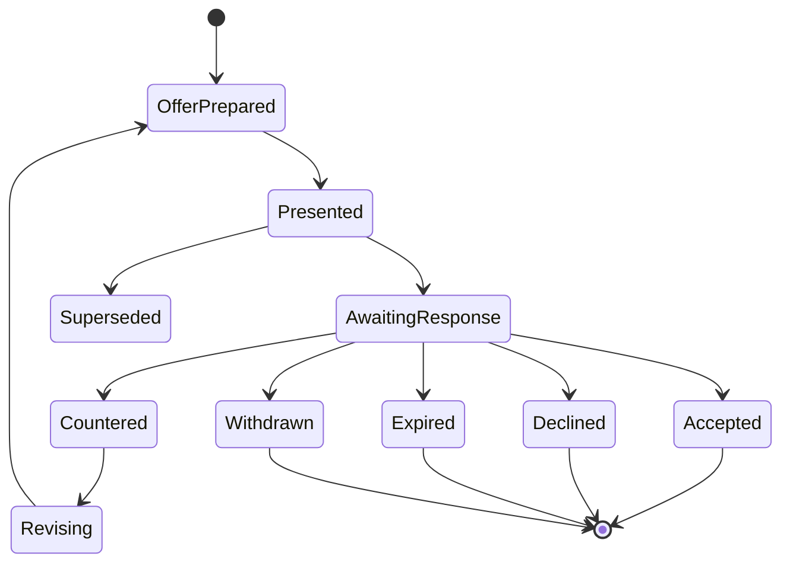

# Part 029 — Negotiation Rounds, Counteroffers, Acceptance Evidence, Expiry, and Withdrawal

## Positioning

Negotiation bukan sekadar mengubah status Quote dari:

```text
PRESENTED -> ACCEPTED
```

Enterprise negotiation dapat melibatkan:

- multiple presented revisions;
- counteroffers;
- redlines;
- commercial concessions;
- partial acceptance;
- conditional acceptance;
- customer decline;
- seller withdrawal;
- offer expiry;
- channel-specific acceptance;
- and post-acceptance corrections.

Tanpa model yang eksplisit, sistem akan kehilangan:

- revision mana yang dinegosiasikan;
- apa yang berubah di setiap round;
- siapa yang mengusulkan perubahan;
- terms apa yang diterima;
- dan apakah acceptance benar-benar mengikat exact proposal.

> **Core thesis:** negotiation harus mempertahankan lineage setiap offer dan counteroffer. Acceptance harus mengacu pada exact revision dan exact evidence; expiry, rejection, withdrawal, dan supersession adalah outcome yang berbeda dan tidak boleh dipadatkan menjadi satu generic status.

---

## 1. Negotiation Domain

Negotiation Domain menangani perubahan antara:

- seller proposal;
- customer response;
- counterproposal;
- revised offer;
- and final decision.

---

## 2. Offer

An Offer is a customer-facing commercial proposal derived from a finalized Quote revision.

It should reference:

- Quote ID;
- Revision ID;
- Proposal ID;
- terms;
- price snapshot;
- validity;
- and delivery evidence.

---

## 3. Offer Identity

A stable Offer ID avoids ambiguity when one Quote has multiple proposals.

Example:

```text
Offer ID: OFF-2026-000123
Quote: QUO-123
Revision: 7
Proposal: PROP-88
```

---

## 4. Offer versus Quote

### Quote

Internal structured commercial aggregate.

### Offer

A customer-facing commercial proposition made at a point in time.

One Quote may produce multiple Offers across negotiation rounds.

---

## 5. Offer versus Proposal Document

### Offer

Business fact and commercial content.

### Proposal Document

Rendered artifact representing the Offer.

---

## 6. Negotiation Round

A Negotiation Round is one exchange cycle.

Example:

```text
Seller Offer 1
-> Customer Counteroffer 1
-> Seller Offer 2
-> Customer Acceptance
```

---

## 7. Round Identity

Store:

- round ID;
- sequence;
- initiating party;
- input offer;
- output offer/counteroffer;
- and timestamps.

---

## 8. Round Sequence

Sequence should be deterministic and scoped to negotiation.

---

## 9. Round State

Possible states:

- OPEN;
- AWAITING_CUSTOMER;
- AWAITING_SELLER;
- RESPONDED;
- CLOSED;
- SUPERSEDED.

---

## 10. Negotiation Session

A session groups rounds for one commercial intent.

---

## 11. Session Identity

Useful when:

- multiple alternatives;
- one Quote copied;
- or proposal package changes.

---

## 12. Negotiation Participants

Possible roles:

- seller;
- buyer;
- procurement;
- legal;
- partner;
- account manager;
- and authorized signatory.

---

## 13. Participant Authority

Not every participant can:

- propose;
- counter;
- accept;
- reject;
- or withdraw.

---

## 14. Negotiation Channel

Possible:

- portal;
- email;
- CRM-assisted;
- API;
- e-signature platform;
- offline meeting;
- and partner channel.

---

## 15. Channel Evidence

Each channel provides different evidence strength.

---

## 16. Seller Proposal

A seller proposal should bind to:

- exact revision;
- exact proposal;
- exact validity;
- and exact recipient set.

---

## 17. Customer Response

A response may be:

- accept;
- reject;
- counter;
- request clarification;
- request extension;
- or request alternative.

---

## 18. Counteroffer

A Counteroffer is not merely a comment.

It proposes changed commercial terms.

---

## 19. Counteroffer Identity

Store:

- counteroffer ID;
- source offer;
- customer party;
- requested changes;
- evidence;
- and validity.

---

## 20. Structured Counteroffer

Prefer structured changes:

- quantity;
- price;
- term;
- date;
- product;
- clause;
- and payment condition.

---

## 21. Free-Text Counteroffer

Free text can supplement but should not be the only source of binding change.

---

## 22. Counteroffer Diff

Compare customer request with current Offer.

---

## 23. Counteroffer Ownership

The customer owns the request content.

Seller owns response and next Quote revision.

---

## 24. Counteroffer Validation

Validate:

- source offer still active;
- requester authorized;
- requested fields understood;
- and no tampering.

---

## 25. Counteroffer Does Not Mutate Offer

A counteroffer creates a new negotiation fact.

The original Offer remains immutable.

---

## 26. Seller Response to Counteroffer

Possible:

- accept counteroffer;
- reject;
- partially accept;
- propose new offer;
- or request clarification.

---

## 27. Accepting Counteroffer

Seller acceptance may create:

- revised Quote;
- new Offer;
- or direct Agreement

depending on domain policy.

---

## 28. Partial Acceptance of Counteroffer

Some requested changes accepted; others rejected.

Create explicit response and next offer.

---

## 29. Clarification Request

Does not change commercial terms.

---

## 30. Negotiation Comment

A comment is collaborative context, not binding acceptance.

---

## 31. Negotiation Annotation

Can reference:

- item;
- term;
- clause;
- price component;
- or document section.

---

## 32. Redline

A Redline represents proposed textual changes to terms or clauses.

---

## 33. Redline Identity

Store:

- clause version;
- proposed text;
- author;
- round;
- and status.

---

## 34. Redline Lifecycle

Possible:

- PROPOSED;
- UNDER_REVIEW;
- ACCEPTED;
- REJECTED;
- REVISED;
- SUPERSEDED.

---

## 35. Redline versus Contract Amendment

Before acceptance, redline belongs to negotiation.

After contract formation, change is amendment.

---

## 36. Clause-Level Negotiation

Each clause may have independent resolution.

---

## 37. Redline Merge

Combining redlines requires legal/semantic review.

---

## 38. Redline Conflict

Two parties may edit same clause differently.

---

## 39. Governing Text

The final accepted clause version must be explicit.

---

## 40. Negotiated Term Snapshot

Accepted Offer stores exact:

- term IDs;
- versions;
- wording;
- and exceptions.

---

## 41. Price Negotiation

Possible requests:

- lower recurring rate;
- waive fee;
- longer free period;
- volume discount;
- and fixed currency.

---

## 42. Price Counteroffer

A requested price should be represented separately from approved seller price.

---

## 43. Customer Budget Constraint

Budget can be input to recommendation, not silently mutate product/price.

---

## 44. Concession

A Concession is a seller-granted commercial adjustment during negotiation.

---

## 45. Concession Identity

Store:

- concession ID;
- type;
- value;
- scope;
- reason;
- approval;
- and round.

---

## 46. Concession Package

One round may grant multiple concessions.

---

## 47. Concession Cost

Track commercial impact without exposing internal margin to customer.

---

## 48. Concession Approval

May require approval bound to revised Quote.

---

## 49. Concession Expiry

A concession may be valid only for one Offer or period.

---

## 50. Concession Carry-Forward

Do not assume a concession applies to later revisions.

---

## 51. Term Negotiation

Possible changes:

- contract duration;
- payment term;
- renewal;
- termination;
- SLA;
- liability;
- and governing law.

---

## 52. Product Negotiation

Customer may request:

- alternative offering;
- reduced scope;
- additional component;
- or different site mix.

---

## 53. Delivery Negotiation

Possible:

- requested start date;
- milestone;
- wave;
- expedited delivery;
- and dependency.

---

## 54. Multi-Dimensional Negotiation

Price, product, term, and delivery changes can interact.

---

## 55. Negotiation Dependency

Example:

> Discount granted only if term becomes 36 months.

Store as conditional concession.

---

## 56. Negotiation State Machine



---

## 57. Awaiting Customer

Seller has presented an active Offer.

---

## 58. Awaiting Seller

Customer submitted counteroffer or clarification request.

---

## 59. Offer Prepared

New revision/proposal ready but not yet presented.

---

## 60. Offer Superseded

A newer active Offer replaces it.

---

## 61. Negotiation Closure

Closure outcomes:

- accepted;
- declined;
- expired;
- withdrawn;
- cancelled;
- or abandoned.

---

## 62. Accepted

Customer accepts exact Offer.

---

## 63. Declined

Customer rejects or declines exact Offer.

---

## 64. Expired

Offer validity elapsed without acceptance.

---

## 65. Withdrawn

Seller retracts the Offer.

---

## 66. Cancelled

Negotiation process is administratively terminated.

---

## 67. Abandoned

No active progress and business closes the negotiation.

---

## 68. Outcome Reason

Use structured reasons.

---

## 69. Negotiation Outcome versus Quote Outcome

One Offer can expire while Quote continues with a new revision.

---

## 70. Active Offer

A negotiation may allow one active Offer or multiple alternatives.

---

## 71. Single Active Offer Policy

Simplifies acceptance and supersession.

---

## 72. Multiple Active Offers

Useful for alternatives.

Acceptance must identify exact Offer and may close the rest.

---

## 73. Alternative Offer Acceptance

Customer selects one alternative.

Other alternatives become:

- not selected;
- withdrawn;
- or superseded.

---

## 74. Partial Acceptance

Customer accepts only part of an Offer.

This is dangerous unless explicitly supported.

---

## 75. Partial Acceptance Models

Possible:

1. Not allowed.
2. Creates counteroffer.
3. Creates split Quote/Order.
4. Accepts defined optional subset.
5. Accepts one alternative group.

---

## 76. Partial Acceptance Invariant

Never infer partial acceptance from unchecked items unless contract says so.

---

## 77. Conditional Acceptance

Customer says:

> Accepted subject to condition X.

This is usually not final acceptance unless policy recognizes it.

---

## 78. Conditional Acceptance as Counteroffer

Often safer to treat as counteroffer.

---

## 79. Acceptance

Acceptance is an immutable business fact for exact Offer.

---

## 80. Acceptance Identity

Store:

- Acceptance ID;
- Offer ID;
- Quote revision;
- Proposal artifact;
- accepter;
- evidence;
- and timestamps.

---

## 81. Acceptance Evidence

Possible evidence:

- authenticated portal action;
- digital signature;
- signed PDF;
- purchase order;
- email confirmation;
- API callback;
- or recorded offline evidence.

---

## 82. Evidence Strength

Different channels may have different legal/commercial strength.

---

## 83. Acceptance Method

Use explicit taxonomy:

- DIGITAL_SIGNATURE;
- PORTAL_CLICK;
- SIGNED_DOCUMENT;
- PURCHASE_ORDER;
- EMAIL_CONFIRMATION;
- OFFLINE_RECORDED;
- API_ACCEPTANCE.

---

## 84. Acceptance Actor

Store:

- authenticated user;
- customer party;
- role;
- and authority source.

---

## 85. Accepter versus Recorder

If internal operator records offline acceptance:

- accepter is customer;
- recorder is internal operator.

---

## 86. Acceptance Authority

Verify:

- signatory;
- buyer;
- procurement;
- delegated authority;
- or contract-specific role.

---

## 87. Acceptance Token

If using secure link:

- bind to Offer;
- recipient;
- expiry;
- nonce;
- and channel.

---

## 88. Acceptance Token Is Not the Acceptance

Token authorizes action.

Acceptance record is the business fact.

---

## 89. Acceptance Timestamp

Store:

- effective acceptance time;
- recorded time;
- timezone;
- and source clock.

---

## 90. Acceptance Checksum

Reference:

- proposal checksum;
- offer checksum;
- and accepted terms checksum.

---

## 91. Acceptance Atomicity

Persist atomically:

- Quote/Offer accepted state;
- Acceptance record;
- lifecycle history;
- and outbox event.

---

## 92. Acceptance Idempotency

Repeated same request returns original Acceptance.

---

## 93. Duplicate Acceptance

Only one effective acceptance per Offer.

---

## 94. Multiple Signatories

Some Offers require multiple parties.

---

## 95. Signature Set

Define:

- required signatories;
- order;
- quorum;
- and expiry.

---

## 96. Partial Signature

Not final acceptance until requirements complete.

---

## 97. Signature Withdrawal

A signer may withdraw before completion if policy permits.

---

## 98. Late Signature

Reject if Offer expired, withdrawn, or superseded.

---

## 99. Acceptance Race

Concurrent:

- accept;
- withdraw;
- expire;
- supersede;
- and counteroffer.

Use expected version and atomic state guard.

---

## 100. Acceptance versus Expiry

Define interval boundary.

Example:

```text
validUntil is exclusive
```

---

## 101. Acceptance versus Withdrawal

Only one can commit.

---

## 102. Acceptance versus Counteroffer

A counteroffer may invalidate acceptance path for that session.

---

## 103. Acceptance versus Supersession

An older Offer cannot be accepted after superseded.

---

## 104. Acceptance versus New Draft

A new internal draft does not necessarily invalidate active Offer.

---

## 105. Acceptance Confirmation

Customer receives confirmation referencing exact Offer.

---

## 106. Acceptance Event

Representative event:

```text
OfferAccepted
```

Payload includes:

- Offer;
- Quote/revision;
- Acceptance ID;
- party;
- effective time;
- and evidence reference.

---

## 107. Downstream Trigger

Acceptance may initiate:

- Agreement creation;
- Product Order creation;
- reservation confirmation;
- and notification.

---

## 108. Acceptance Does Not Guarantee Fulfillment

It commits commercial intent.

Operational execution remains separate.

---

## 109. Acceptance Correction

If evidence metadata is wrong, use correction process.

Do not overwrite original accepted content.

---

## 110. Revoking Acceptance

Unilateral revocation may be legally invalid.

Architecture must not expose casual “undo accept”.

---

## 111. Cancellation after Acceptance

Use:

- contract cancellation;
- rescission;
- amendment;
- or order cancellation

according to policy.

---

## 112. Customer Decline

A decline should reference exact Offer.

---

## 113. Decline Evidence

Store:

- party;
- method;
- time;
- and reason.

---

## 114. Decline Reason Codes

Examples:

- PRICE;
- SCOPE;
- TIMELINE;
- TERMS;
- COMPETITOR;
- NO_BUDGET;
- NO_DECISION;
- OTHER.

---

## 115. Decline versus Counteroffer

If customer proposes changes, model as counteroffer, not decline.

---

## 116. Decline Finality

Decline closes that Offer.

Quote may continue with a new revision.

---

## 117. Seller Withdrawal

Seller retracts an active Offer.

---

## 118. Withdrawal Reasons

Examples:

- pricing error;
- product unavailable;
- policy violation;
- duplicate;
- compliance risk;
- and customer request.

---

## 119. Withdrawal Authority

Only authorized seller roles can withdraw.

---

## 120. Withdrawal Evidence

Store:

- actor;
- reason;
- time;
- and affected Offer.

---

## 121. Withdrawal Notification

Customer may need notification.

Notification failure does not necessarily reverse withdrawal.

---

## 122. Withdrawal Scope

Possible:

- one Offer;
- all active alternatives;
- entire negotiation;
- or one channel artifact.

---

## 123. Withdrawal versus Revocation of Access

Business withdrawal and technical link revocation are separate.

---

## 124. Expiry

An Offer expires when validity period ends.

---

## 125. Offer Validity

Store:

- validFrom;
- validUntil;
- timezone;
- and boundary convention.

---

## 126. Quote Validity versus Offer Validity

A Quote revision may exist longer than one presented Offer.

---

## 127. Price Validity versus Offer Validity

Offer validity should not exceed mandatory price validity unless policy permits.

---

## 128. Approval Validity versus Offer Validity

Approval may constrain presentation/acceptance window.

---

## 129. Promotion Validity versus Offer Validity

Promotion may expire earlier or require reservation.

---

## 130. Validity Composition

Effective acceptance deadline may be the earliest required dependency expiry.

---

## 131. Expiry Scheduler

Possible:

- workflow timer;
- delayed message;
- scheduler;
- and reconciliation scan.

---

## 132. Read-Time Expiry Guard

Even before scheduler updates state, acceptance guard checks time.

---

## 133. Late Timer

Persisted expiry may occur later than effective expiry.

Store both effective and recorded time.

---

## 134. Missed Timer

Reconciliation detects overdue active Offers.

---

## 135. Expiry Extension

Customer may request extension.

---

## 136. Extension Is Commercial Change

It may require:

- repricing;
- reapproval;
- new Offer;
- or only new validity.

---

## 137. Extension Decision

Store:

- old validity;
- new validity;
- reason;
- authority;
- and impact assessment.

---

## 138. Extension after Expiry

Usually create new Offer/revision rather than resurrecting old Offer.

---

## 139. Automatic Renewal of Offer

Risky unless explicitly governed.

---

## 140. Grace Period

If allowed, model explicitly.

---

## 141. Grace Period Semantics

Is acceptance allowed during grace period?

Does price remain valid?

Who authorizes it?

---

## 142. Expiry Notification

Possible reminders:

- before expiry;
- at expiry;
- after expiry.

---

## 143. Reminder Is Not Validity Extension

---

## 144. Supersession

A newer Offer replaces an older one.

---

## 145. Supersession Link

Store:

- superseded Offer;
- replacement Offer;
- reason;
- and effective time.

---

## 146. Supersession Invariant

Superseded Offer cannot be accepted.

---

## 147. Supersession of Alternatives

Accepting one alternative may supersede others.

---

## 148. Replacement Offer

May change:

- price;
- product;
- term;
- date;
- or proposal artifact.

---

## 149. Negotiation Diff

A new Offer should provide semantic diff from prior Offer.

---

## 150. Customer-Facing Diff

Can show:

- price changes;
- scope changes;
- term changes;
- and validity changes.

Avoid exposing internal approval/margin.

---

## 151. Internal Diff

Can include:

- concessions;
- margin;
- approval;
- and source versions.

---

## 152. Negotiation History

Preserve chronological business facts.

---

## 153. Timeline

Example:

```text
R1 presented
Customer countered
R2 created
R2 approved
R2 presented
Customer accepted
```

---

## 154. Immutable Timeline

Do not rewrite old events to simplify UI.

---

## 155. Audit versus Timeline

Timeline is user-friendly projection.

Audit is detailed immutable evidence.

---

## 156. Negotiation API

Possible resources:

- negotiations;
- offers;
- rounds;
- counteroffers;
- responses;
- acceptances;
- withdrawals.

---

## 157. Present Offer Command

Inputs:

```text
offerId
expectedVersion
recipient
channel
idempotencyKey
```

---

## 158. Counteroffer Command

Inputs:

```text
sourceOffer
party
structuredChanges
evidence
idempotencyKey
```

---

## 159. Accept Offer Command

Inputs:

```text
offerId
proposalId
expectedVersion
accepter
evidence
idempotencyKey
```

---

## 160. Withdraw Offer Command

Inputs:

```text
offerId
expectedVersion
reason
actor
```

---

## 161. Extend Offer Command

Inputs:

```text
offerId
newValidUntil
reason
authority
expectedVersion
```

---

## 162. Generic Status Update Risk

A generic endpoint can bypass:

- evidence;
- authority;
- and guards.

---

## 163. Idempotency

Required for:

- presentation;
- acceptance;
- counteroffer submission;
- and withdrawal notification.

---

## 164. Optimistic Concurrency

Use expected Offer version.

---

## 165. Event Model

Representative events:

- OfferPrepared;
- OfferPresented;
- CounterofferSubmitted;
- NegotiationResponseRecorded;
- OfferAccepted;
- OfferDeclined;
- OfferExpired;
- OfferWithdrawn;
- OfferSuperseded;
- OfferValidityExtended.

---

## 166. Event Ordering

Use Negotiation or Offer identity.

---

## 167. Duplicate Event Handling

Consumers remain idempotent.

---

## 168. Sensitive Event Data

Do not publish full proposal, signature, or internal comments.

---

## 169. Notification

Notifications consume events.

---

## 170. Portal

Portal displays active Offer and history allowed for customer.

---

## 171. CRM Integration

CRM may receive negotiation summary.

It should not become authority over acceptance.

---

## 172. E-Signature Integration

Signing envelope maps to exact Offer.

---

## 173. Purchase Order Integration

Customer PO may serve as acceptance evidence.

---

## 174. Purchase Order Validation

Check:

- customer;
- amount;
- currency;
- scope;
- dates;
- and referenced Offer.

---

## 175. PO Mismatch

A PO with different amount/term may be a counteroffer or exception, not acceptance.

---

## 176. Email Acceptance

Email can be evidence if policy permits.

Need:

- sender validation;
- exact Offer reference;
- and immutable capture.

---

## 177. Offline Acceptance

Require:

- original accepter;
- recorder;
- document/evidence;
- effective time;
- and reason.

---

## 178. API Acceptance

Partner/customer API must authenticate party authority and bind exact Offer.

---

## 179. Replay Attack

Prevent repeated or tampered acceptance requests.

---

## 180. Nonce

Acceptance token can include nonce and one-time semantics.

---

## 181. CSRF

Portal acceptance requires CSRF protection where relevant.

---

## 182. Authentication Step-Up

High-value acceptance may require stronger authentication.

---

## 183. Signature Verification

Verify digital signature chain and signed content.

---

## 184. Evidence Retention

Accepted evidence may require long retention.

---

## 185. Legal Hold

Prevent deletion during dispute.

---

## 186. Privacy

Retain only necessary personal data.

---

## 187. Negotiation Visibility

Customer sees:

- active Offer;
- prior customer-visible Offers;
- counteroffers;
- and decisions.

Internal users may see more.

---

## 188. Internal Notes

Never expose internal negotiation strategy.

---

## 189. Partner Visibility

Partner may see wholesale or resale views, not all internal pricing.

---

## 190. Multi-Tenant Isolation

Apply to:

- Offer;
- evidence;
- document;
- event;
- portal;
- and search.

---

## 191. Metrics

Useful metrics:

- rounds per negotiation;
- time per round;
- acceptance rate;
- decline rate;
- expiry rate;
- and withdrawal rate.

---

## 192. Concession Metrics

- total concession;
- concession by round;
- and approval impact.

---

## 193. Time-to-Decision

Measure from presentation to:

- acceptance;
- decline;
- counteroffer;
- or expiry.

---

## 194. Counteroffer Rate

High rate may indicate:

- poor initial pricing;
- unclear terms;
- or product mismatch.

---

## 195. Expiry without Response

May indicate:

- wrong contact;
- poor follow-up;
- or long approval cycle.

---

## 196. Negotiation SLI

Examples:

- zero acceptance of superseded Offers;
- all acceptance evidence bound to exact Proposal;
- expiry reflected within policy window;
- and zero duplicate downstream order creation.

Internal targets must be verified.

---

## 197. Reconciliation

Detect:

- active Offer past expiry;
- accepted Offer with missing evidence;
- multiple accepted alternatives;
- withdrawn Offer still accept-enabled;
- and negotiation closed without terminal reason.

---

## 198. Recovery Commands

Examples:

- ReconcileOfferExpiry;
- CorrectAcceptanceMetadata;
- SupersedeOffer;
- RevokeOfferAccess;
- RestoreNegotiationProjection.

---

## 199. Negotiation Incident

Examples:

- customer accepted wrong revision;
- expired offer accepted;
- withdrawn proposal still active;
- PO mismatch treated as acceptance;
- and duplicate acceptance creates duplicate order.

---

## 200. Incident Containment

Possible:

- block conversion;
- freeze Offer;
- revoke acceptance link;
- preserve evidence;
- notify commercial/legal owners;
- and create correction process.

---

## 201. Negotiation Smells

- latest Quote accepted;
- no Offer identity;
- counteroffers stored as comments;
- and negotiation rounds inferred from timestamps.

---

## 202. Acceptance Smells

- boolean accepted;
- accepter not captured;
- no revision/proposal checksum;
- and “undo accept” button.

---

## 203. Expiry Smells

- one generic expiry;
- timezone implicit;
- timer failure leaves offer active;
- and extension edits old Offer.

---

## 204. Withdrawal Smells

- deleting proposal file;
- status changed without authority;
- and customer not notified.

---

## 205. Counteroffer Smells

- customer requested price overwrites seller price;
- no structured diff;
- and no source Offer reference.

---

## 206. Anti-Patterns

### Accept Current Quote

Ambiguous revision.

### Counteroffer as Comment

Binding change lost.

### Decline and Counteroffer Combined

Outcome unclear.

### Expiry as UI Label Only

Backend still accepts.

### Withdraw by Deleting Document

Business history disappears.

### Partial Acceptance by Checkbox

No contractual semantics.

### Acceptance Reversal as Edit

Post-acceptance process ignored.

---

## 207. Negotiation Session Template

```md
## Negotiation Identity

## Quote / Opportunity

## Participants

## Channels

## Alternatives

## Rounds

## Active Offers

## Counteroffers

## Redlines

## Concessions

## Terminal Outcome

## Audit
```

---

## 208. Offer Template

```md
## Offer Identity and Version

## Quote / Revision

## Proposal / Artifact Checksums

## Parties / Recipients

## Price Snapshot

## Terms / Clauses

## Validity

## Presentation Evidence

## State

## Supersession

## Acceptance / Decline / Withdrawal
```

---

## 209. Counteroffer Template

```text
Counteroffer ID:
Source Offer:
Customer party:
Submitted at:
Structured requested changes:
Redlines:
Evidence:
Validity:
Status:
Seller response:
```

---

## 210. Acceptance Template

```text
Acceptance ID:
Offer:
Quote/revision:
Proposal/artifact checksum:
Accepter party:
Authority:
Recorder:
Method:
Effective time:
Recorded time:
Evidence:
Signature/PO/reference:
Idempotency key:
```

---

## 211. Withdrawal Template

```text
Offer:
Withdrawn by:
Authority:
Reason:
Effective time:
Notification:
Access revocation:
Replacement Offer:
```

---

## 212. Validity Extension Template

```text
Offer:
Old validity:
New validity:
Reason:
Requested by:
Authorized by:
Price impact:
Approval impact:
New Offer required:
Audit:
```

---

## 213. Negotiation Invariants

Representative invariants:

- every active Offer references exact finalized Quote revision;
- counteroffer references source Offer;
- accepted Offer is not expired, withdrawn, or superseded;
- acceptance references exact artifact/evidence;
- one Offer has at most one effective acceptance;
- partial acceptance follows explicit policy;
- and terminal outcomes remain immutable.

---

## 214. Worked Example: Two Negotiation Rounds

Round 1:

- seller presents Revision 4;
- customer requests 10% lower recurring price.

Round 2:

- seller creates Revision 5;
- approval granted;
- Proposal 5 presented;
- customer accepts Proposal 5.

Revision 4 remains immutable history.

---

## 215. Worked Example: Price Counteroffer

Customer proposes 800/month instead of 900.

System records:

- requested net price;
- source Offer;
- customer party;
- and evidence.

It does not overwrite current Quote price.

---

## 216. Worked Example: Conditional Acceptance

Customer writes:

> Accepted if installation fee is waived.

System treats this as counteroffer unless policy explicitly recognizes conditional acceptance.

---

## 217. Worked Example: PO Acceptance

Customer PO references correct Offer but amount excludes a mandatory fee.

Result:

- PO_MISMATCH;
- manual review/counteroffer;
- not automatic acceptance.

---

## 218. Worked Example: Expiry Race

Acceptance arrives at validity boundary.

Atomic guard applies exclusive `validUntil`.

Only acceptance or expiry can win.

---

## 219. Worked Example: Seller Withdrawal

A pricing defect is discovered.

Seller withdraws Offer, revokes portal acceptance, notifies customer, and prepares corrected revision.

---

## 220. Worked Example: Multiple Alternatives

Fiber and wireless Offers are both active.

Customer accepts Fiber Offer.

Wireless Offer becomes not-selected/superseded according to policy.

---

## 221. Worked Example: Offline Signed Document

Customer signs printed proposal.

Operator records:

- customer signatory;
- signed document;
- artifact checksum;
- effective time;
- recorder identity.

---

## 222. Worked Example: Late Signature Callback

E-sign provider callback arrives after Offer superseded.

Handler records the callback but rejects it as non-effective acceptance.

---

## 223. Worked Example: Validity Extension

Customer asks for seven additional days.

System evaluates:

- price validity;
- promotion;
- approval;
- and tax.

If material, a new Offer is generated instead of editing old validity.

---

## 224. Senior Engineer Operating Model

### Introduce Offer identity

Do not accept a generic “current Quote”.

### Model negotiation rounds

Preserve commercial lineage.

### Treat counteroffer as structured business fact

Not a comment or overwrite.

### Bind acceptance to exact evidence

Revision, Proposal, checksum, party, and time.

### Distinguish decline, expiry, withdrawal, and supersession

Each has different semantics.

### Treat timers as domain behavior

With atomic guards and reconciliation.

### Model partial and conditional acceptance explicitly

Default to counteroffer when ambiguous.

### Separate technical delivery from business presentation

And presentation from acceptance.

### Operate negotiation

Metrics, evidence retention, and incident recovery.

---

## 225. Internal Verification Checklist

### Negotiation model

- Is Offer a first-class concept?
- Are rounds/sessions modeled?
- Are alternatives and counteroffers distinct?
- Are redlines and concessions first-class?

### Offer identity and presentation

- Does every Offer bind to exact Quote revision and Proposal?
- Can multiple active Offers exist?
- How are alternatives closed after selection?
- What is the business fact of presentation?

### Counteroffers

- Are requested changes structured?
- Is source Offer retained?
- Can seller partially accept?
- How are negotiated clause redlines handled?

### Acceptance

- What methods are supported?
- Which party roles can accept?
- Is accepter distinguished from recorder?
- Are artifact checksum, revision, and evidence stored?

### Partial/conditional acceptance

- Is partial acceptance allowed?
- Does conditional acceptance become counteroffer?
- Can multiple signatories be required?
- What constitutes final acceptance?

### Expiry and extension

- What timezone and interval convention apply?
- How are timers/reconciliation implemented?
- Can validity be extended without new Offer?
- How are price, promotion, and approval validity composed?

### Withdrawal and supersession

- Who can withdraw?
- What gets revoked technically?
- How are replacement Offers linked?
- Can a superseded Offer ever be accepted?

### Operations and security

- Are acceptance endpoints protected against replay/tampering?
- Are events idempotent?
- Are metrics and reconciliation available?
- What explicit recovery/correction commands exist?

---

## 226. Practical Exercises

### Exercise 1 — Offer model

Design Offer identity separately from Quote and Proposal.

### Exercise 2 — Counteroffer workflow

Model customer price and term changes without mutating original Offer.

### Exercise 3 — Acceptance evidence

Define evidence for portal, signed PDF, PO, email, API, and offline channels.

### Exercise 4 — Race matrix

Analyze accept, expire, withdraw, supersede, and counteroffer races.

### Exercise 5 — Alternative selection

Define what happens when one of several Offers is accepted.

### Exercise 6 — Negotiation timeline

Reconstruct a three-round negotiation with concessions and approvals.

---

## 227. Part Completion Checklist

You are done if you can:

- distinguish Quote, Offer, Proposal, and Negotiation;
- model negotiation rounds and alternatives;
- represent structured counteroffers and redlines;
- preserve concessions and approvals;
- bind acceptance to exact revision/artifact/evidence;
- distinguish acceptance methods and authority;
- handle partial/conditional acceptance;
- model expiry, extension, withdrawal, decline, and supersession;
- resolve race conditions and duplicate callbacks;
- and create an internal negotiation verification backlog.

---

## 228. Key Takeaways

1. Offer identity removes “current Quote” ambiguity.
2. Negotiation rounds preserve commercial lineage.
3. Counteroffers are structured business facts.
4. Acceptance must bind to exact revision and artifact.
5. Accepter and recorder may differ.
6. Conditional acceptance is often a counteroffer.
7. Decline, expiry, withdrawal, and supersession differ.
8. Expiry needs atomic guards and reconciliation.
9. Accepted evidence must be immutable.
10. Internal CSG negotiation and acceptance semantics must be verified.

---

## 229. References

Conceptual baseline:

- General enterprise CPQ negotiation, offer, counteroffer, concession, and customer-acceptance practices.
- Contract formation, digital evidence, e-signature, purchase-order matching, and revision lineage concepts.
- Finite-state machines, temporal guards, idempotent commands, and race-condition handling.
- Domain-Driven Design aggregates, immutable facts, commands, events, and audit history.

These references do not define internal CSG negotiation, acceptance, or withdrawal implementation.
