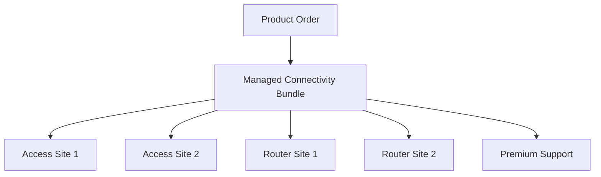

# Part 031 — Product Order Identity, Order Items, Actions, Relationships, and Commercial Lineage

## Positioning

Accepted Quote belum sama dengan Product Order.

Quote menyatakan:

- apa yang ditawarkan;
- pada harga dan terms apa;
- kepada siapa;
- dan kapan customer menerima.

Product Order menyatakan:

- action apa yang diminta;
- terhadap product instance mana;
- dengan target state seperti apa;
- dalam dependency dan sequencing apa;
- serta evidence komersial apa yang mendasarinya.

> **Core thesis:** Product Order adalah aggregate execution intent. Ia harus mempertahankan customer-requested commercial action, item relationships, target product state, accepted-price lineage, dan idempotent source identity tanpa menyerap detail Service Order atau Resource Order terlalu dini.

---

## 1. Product Order

A Product Order represents a request to create, change, or terminate customer-facing products.

Typical actions:

- ADD;
- MODIFY;
- DELETE;
- SUSPEND;
- RESUME;
- REPLACE;
- RENEW;
- and NO_CHANGE/reference-only.

---

## 2. Product Order versus Quote

### Quote

Commercial proposal and negotiated commitment.

### Product Order

Executable request based on accepted commercial intent.

The Product Order should not re-negotiate customer price.

---

## 3. Product Order versus Service Order

### Product Order

Customer/product-facing intent.

### Service Order

Technical service-realization intent.

---

## 4. Product Order versus Resource Order

### Product Order

Describes what customer product outcome is requested.

### Resource Order

Describes infrastructure or resource provisioning work.

---

## 5. Product Order Aggregate Root

The Product Order aggregate may own:

- order identity;
- source acceptance;
- order items;
- action semantics;
- requested dates;
- related parties;
- commercial references;
- item relationships;
- validation state;
- and lifecycle state.

---

## 6. Aggregate Boundary Question

Ask:

> Which facts must remain atomically consistent when the order intent is created or changed?

Likely:

- source accepted revision;
- item set;
- item action;
- relationships;
- order-level parties;
- requested timing;
- and order-level invariant state.

---

## 7. What Usually Stays External

Common external authorities:

- Quote/Acceptance;
- Agreement;
- Customer/Account;
- Product Inventory;
- Catalog;
- Pricing/Billing;
- Service Order;
- Resource Order;
- Appointment;
- and Workforce.

---

## 8. Product Order Identity

Use stable identity independent of external business number.

Example:

```text
Product Order ID: PO-01J...
Product Order Number: ORD-2026-00123
```

---

## 9. Business Number

Human-readable reference.

Do not use as database identity.

---

## 10. Source Acceptance Identity

Every Quote-derived Product Order should reference:

- Acceptance ID;
- Quote ID;
- Quote Revision;
- Offer/Proposal;
- and transformation process.

---

## 11. Idempotency Business Key

A robust key may combine:

```text
acceptanceId + conversionGroupId
```

to prevent duplicate Product Orders.

---

## 12. Order Version

Use optimistic concurrency version.

Do not conflate with order revision.

---

## 13. Product Order Revision

If Order intent changes after submission, policy may require:

- amendment;
- supplement;
- cancellation and replacement;
- or new order.

Avoid arbitrary in-place changes.

---

## 14. Product Order Header

Possible fields:

- ID;
- number;
- external references;
- source acceptance;
- requested completion/start date;
- priority;
- channel;
- state;
- parties;
- accounts;
- Agreement;
- and notes.

---

## 15. Product Order Item

An Order Item represents one requested product action or grouping node.

---

## 16. Order Item Identity

Each item occurrence needs stable identity.

Never use list index.

---

## 17. Source Quote Item

Every Quote-derived Order Item should retain:

- source Quote Item ID;
- source revision;
- mapping version;
- and accepted commercial references.

---

## 18. Item Action

Action describes requested lifecycle change.

Common actions:

```text
ADD
MODIFY
DELETE
SUSPEND
RESUME
REPLACE
RENEW
```

Exact vocabulary must be verified internally.

---

## 19. ADD

Creates a new customer product instance.

Required semantics may include:

- target offering/specification;
- target characteristics;
- requested date;
- parties/accounts/sites;
- and accepted price lineage.

---

## 20. MODIFY

Changes an existing Product Inventory instance.

Requires:

- existing product identity;
- expected current version/state;
- target product state;
- and modification scope.

---

## 21. DELETE

Terminates/removes an existing product.

May include:

- effective date;
- termination reason;
- penalty/credit references;
- and dependency handling.

---

## 22. SUSPEND

Temporarily disables or restricts product/service behavior.

Commercial charging policy may continue, reduce, or pause.

---

## 23. RESUME

Restores a suspended product.

Requires current state compatible with resume.

---

## 24. REPLACE

Replaces one product instance with another.

Semantics may combine:

- terminate source;
- add target;
- preserve selected identity/relationship;
- and coordinate cutover.

---

## 25. RENEW

Extends or refreshes commercial/product commitment.

May:

- preserve product instance;
- update Agreement;
- change price/term;
- and avoid technical reprovisioning.

---

## 26. NO_CHANGE

Useful only for context/reference nodes.

Do not create executable work unnecessarily.

---

## 27. Action Is Not CRUD

`DELETE` business action is not necessarily database deletion.

The historical Product and Order remain.

---

## 28. Action Preconditions

Each action should define:

- allowed inventory state;
- required references;
- supported offering;
- timing constraints;
- and conflict policy.

---

## 29. Action Matrix

| Current Product | Requested Action | Typical Result |
|---|---|---|
| None | ADD | New Product |
| Active | MODIFY | Updated Product |
| Active | DELETE | Terminated Product |
| Active | SUSPEND | Suspended Product |
| Suspended | RESUME | Active Product |
| Active | REPLACE | Source retired, target created |
| Near expiry | RENEW | Extended commitment |

---

## 30. Existing Product Reference

For non-ADD actions, retain:

- Inventory Product ID;
- version;
- account;
- status;
- offering/specification;
- and relationship context.

---

## 31. Optimistic Inventory Expectation

Order Item can include:

```text
expectedInventoryVersion
expectedProductState
```

to detect concurrent change.

---

## 32. Target Product State

Prefer representing intended final state, not only a patch.

---

## 33. Delta

A delta explains what changes from current to target.

---

## 34. Full Target plus Delta

Keeping both supports:

- validation;
- audit;
- and technical decomposition.

---

## 35. Product Snapshot

Order should retain enough accepted target product data to execute without relying solely on mutable current catalog.

---

## 36. Catalog References

Store:

- Product Offering ID/version;
- Product Specification ID/version;
- Catalog publication;
- and mapping/decomposition version.

---

## 37. Characteristic Values

Each characteristic should preserve:

- definition reference;
- value;
- unit;
- source;
- and whether it is customer-visible.

---

## 38. Derived Characteristics

Derived technical hints may be included if owned by versioned mapping/decomposition.

---

## 39. Hidden Technical Characteristics

Avoid leaking implementation details into customer-facing Product model unless they are genuine product attributes.

---

## 40. Product Order Item Hierarchy

A Product Order may preserve commercial bundle hierarchy.



---

## 41. Parent–Child Relationship

Possible relationship types:

- CONTAINS;
- DEPENDS_ON;
- REQUIRES;
- BUNDLED_WITH;
- REPLACES;
- MODIFIES;
- and SAME_SITE_AS.

---

## 42. Hierarchy versus Dependency Graph

Hierarchy expresses composition.

Dependency graph expresses execution or semantic dependency.

Do not conflate.

---

## 43. Cross-Item Relationship

Examples:

- router depends on access;
- support depends on managed service;
- replacement target depends on source disconnect timing.

---

## 44. Shared Component

One shared service may support several product items.

Model explicit reference rather than duplicate identity.

---

## 45. Item Group

A grouping item may represent:

- site;
- bundle;
- delivery wave;
- legal entity;
- or account.

---

## 46. Grouping Is Not Always Executable

A pure group node may not decompose into downstream order work.

---

## 47. Order Quantity

Quantity needs:

- value;
- unit;
- and meaning.

---

## 48. Quantity Source

Possible:

- accepted Quote;
- installed Product count;
- derived site count;
- or explicit customer request.

---

## 49. Multi-Site Order

Representations:

- one item with site collection;
- one item per site;
- or site groups.

Choose based on:

- independent lifecycle;
- fallout;
- pricing;
- and fulfillment.

---

## 50. Per-Site Item

Improves:

- tracking;
- partial completion;
- and fallout isolation.

Costs:

- item count;
- storage;
- and orchestration complexity.

---

## 51. Site Reference

Order Item may reference:

- site ID;
- normalized address snapshot;
- geospatial data;
- jurisdiction;
- and access instructions.

---

## 52. Account Reference

Possible roles:

- customer account;
- billing account;
- service account;
- and payer account.

---

## 53. Related Parties

Possible roles:

- Requester;
- Customer;
- Buyer;
- BillTo;
- ServiceUser;
- InstallationContact;
- TechnicalContact;
- Partner;
- and OrderManager.

---

## 54. Party Snapshot

Preserve relevant display/contact data with source/version.

---

## 55. Party Authority

Requester identity and customer authority may differ.

---

## 56. Requested Dates

Possible dates:

- requestedStart;
- requestedCompletion;
- desiredActivation;
- dueDate;
- and noEarlierThan/noLaterThan.

---

## 57. Requested versus Committed Date

Requested is customer preference.

Committed is provider promise.

---

## 58. Order Priority

Possible:

- STANDARD;
- EXPEDITED;
- CRITICAL;
- and REGULATORY.

Priority may require surcharge/approval.

---

## 59. Order Channel

Source channel may affect:

- SLA;
- notifications;
- and validation.

---

## 60. Agreement Reference

Order may reference:

- Agreement;
- Agreement Item;
- amendment;
- or Master Agreement.

---

## 61. Commercial Terms Reference

Preserve exact governing terms and accepted revision.

---

## 62. Monetary Lineage

Product Order should reference accepted price components.

It should not necessarily duplicate full pricing engine logic.

---

## 63. Order Price Snapshot

Depending on architecture, Order may retain:

- accepted monetary components;
- billing instructions;
- or references plus immutable snapshot.

---

## 64. Price Component Identity

Preserve Quote Price Component -> Order Price Component lineage.

---

## 65. Charge Type

One-time, recurring, usage, allowance, discount, and tax estimate should remain distinguishable.

---

## 66. Billing Boundary

Product Order communicates accepted monetary intent.

Billing owns activation and invoicing semantics.

---

## 67. Tax Boundary

Order may preserve quoted tax estimate but invoicing may recalculate authoritative tax.

---

## 68. Currency Invariant

Binding monetary components should have explicit currency.

---

## 69. Order Total

Totals may be useful for display/reconciliation.

Product Order aggregate should not recalculate commercial price using current rules.

---

## 70. Non-Order Commercial Component

Some accepted components may map outside Product Order.

Examples:

- legal filing fee;
- external settlement;
- informational allowance.

Mark explicit outcome.

---

## 71. Order Note

Free-text note should not contain mandatory structured fields.

---

## 72. Customer Note versus Internal Note

Separate visibility and retention.

---

## 73. External Reference

Possible references:

- CRM opportunity;
- customer PO;
- partner order;
- legacy order;
- and ticket.

---

## 74. External Reference Type

Do not use one untyped string.

---

## 75. Product Order Source

Possible:

- accepted Quote;
- direct order;
- migration;
- bulk import;
- API partner;
- or administrative correction.

---

## 76. Direct Order

If supported, it still needs:

- product/action;
- parties;
- price/Agreement basis;
- and audit.

---

## 77. Quote-Derived Order

Should be immutable with respect to accepted source.

---

## 78. Import/Migration Order

May use different validation or provenance.

Do not pretend it came from Quote.

---

## 79. Order Item Completeness

Each executable item needs:

- action;
- target product;
- required references;
- site/account/party;
- requested dates;
- and mapping/decomposition context.

---

## 80. Order-Level Completeness

Checks:

- customer;
- channel;
- Agreement;
- all item relationships;
- currency;
- and requested schedule.

---

## 81. Structural Invariants

Examples:

- no orphan item;
- no cycles where prohibited;
- parent/child references valid;
- and item IDs unique.

---

## 82. Action Invariants

Examples:

- ADD has no existing Product reference;
- MODIFY/DELETE has existing Product;
- RESUME targets Suspended Product;
- and REPLACE links source and target.

---

## 83. Commercial Invariants

Examples:

- source revision accepted;
- price lineage complete;
- governing Agreement compatible;
- and no unapproved material change.

---

## 84. Temporal Invariants

Examples:

- requested completion not before start;
- termination date compatible with Agreement;
- and dependency dates coherent.

---

## 85. Inventory Invariants

Examples:

- target Product belongs to correct customer;
- current version/state matches expectation;
- and no conflicting in-flight Order.

---

## 86. Cross-Item Invariants

Examples:

- router ADD depends on access ADD;
- bundle children use compatible account;
- all items under one group use same requested wave;
- and replacement source terminates only after target readiness.

---

## 87. Order Validation Result

Should include:

- status;
- issues;
- item scope;
- reason codes;
- and blocking transitions.

---

## 88. Order Readiness

A Product Order can be:

- draft;
- structurally valid;
- commercially valid;
- submitted;
- and execution-ready.

---

## 89. Draft Order

Can be enriched before submission if business design permits.

---

## 90. Submitted Order

Customer/commercial intent is fixed for processing.

Material change should use governed amendment.

---

## 91. Order Item State versus Order State

Each item may progress independently.

Order state should summarize under explicit aggregation policy.

---

## 92. Item-Level Fallout

A failed item should not necessarily fail all independent items.

---

## 93. Partial Order

A Product Order may contain items that complete and fail independently.

---

## 94. Atomic Commercial Group

Some item groups must succeed or fail together.

Examples:

- primary + backup access;
- source + target replacement;
- bundle minimum set.

---

## 95. Atomicity Group

Store explicit group ID and policy.

---

## 96. Best-Effort Group

Independent item outcomes allowed.

---

## 97. Dependency Group

Ordering constraints but not all-or-nothing.

---

## 98. Order Decomposition Boundary

Product Order should provide enough information for downstream decomposition.

---

## 99. Decomposition Reference

Store:

- decomposition plan/version;
- rule set;
- and execution context.

---

## 100. Early Decomposition

Can create Service Orders at Product Order creation.

---

## 101. Late Decomposition

Can defer until Order accepted/validated.

---

## 102. Decomposition Preview

Useful for validation without committing downstream work.

---

## 103. Product Order Item to Service Order Item

One-to-one, one-to-many, or many-to-one.

---

## 104. Service/Resource Lineage

Every technical work item should trace back to Product Order Item.

---

## 105. Product Inventory Outcome

On successful fulfillment:

- ADD creates Product;
- MODIFY updates Product;
- DELETE terminates Product;
- SUSPEND/RESUME changes lifecycle;
- REPLACE links old/new;
- RENEW updates commercial validity.

---

## 106. As-Ordered Product

The target product state represented by Product Order.

---

## 107. As-Built Product

Actual realized state after fulfillment.

---

## 108. As-Quoted Product

Accepted commercial configuration.

---

## 109. Lineage Chain

```text
Quote Item
-> Product Order Item
-> Service/Resource Order Items
-> Inventory Product
-> Billing Charges
```

---

## 110. Lineage Record

Store stable references at each boundary.

---

## 111. Transformation Version

Quote-to-Order mapping version must be retained.

---

## 112. Decomposition Version

Product-to-Service/Resource mapping version must be retained.

---

## 113. Inventory Update Version

Inventory mutation should retain source Order/fulfillment reference.

---

## 114. Idempotent Product Creation

ADD retry must not create duplicate Inventory Products.

---

## 115. Product Correlation Key

A correlation key may connect planned Product to realized Product.

---

## 116. Temporary Product Identity

A planned Product ID can be assigned before fulfillment.

---

## 117. Final Product Identity

May be created by Inventory.

Need mapping from temporary/planned ID.

---

## 118. Order Item Relationship to Inventory

MODIFY/DELETE use existing Product ID.

ADD obtains future Product ID/reference.

---

## 119. Bulk Order

Bulk operations may contain:

- thousands of items;
- shared context;
- repeated structures;
- and grouped validation.

---

## 120. Bulk Item Compression

Avoid losing individual identity for items that can fail independently.

---

## 121. Batch Representation

A batch can reference a generated item set.

---

## 122. Bulk Validation

Group repeated issues and preserve per-item traceability.

---

## 123. Large Order Partitioning

Possible partitioning:

- by site;
- region;
- account;
- wave;
- or product domain.

---

## 124. Aggregate Partitioning

Header aggregate plus item partitions may improve scale.

---

## 125. Final Submission Barrier

Capture exact item partition versions and full invariant result.

---

## 126. Order Manifest

Possible contents:

```text
orderId
sourceAcceptance
headerVersion
itemPartitionVersions
mappingVersions
priceSnapshotReferences
agreementReferences
contentChecksum
```

---

## 127. Optimistic Concurrency

Use expected version for draft/order commands.

---

## 128. Submitted Order Mutability

After submission, ordinary edits should be restricted.

---

## 129. Amendment Command

Material post-submission change should be explicit.

---

## 130. Cancel Item

Item cancellation differs from deleting item record.

---

## 131. Cancel Order

Cancels remaining executable work subject to policy.

---

## 132. Order Supplement

Adds new items related to existing Order.

---

## 133. Order Amendment

Changes existing pending/in-flight Order intent.

---

## 134. Replacement Order

Cancels/supersedes prior Order and creates new one.

---

## 135. Order API Commands

Examples:

- CreateProductOrder;
- AddOrderItem;
- UpdateDraftOrderItem;
- SubmitProductOrder;
- CancelProductOrder;
- CancelOrderItem;
- AmendProductOrder;
- AddOrderSupplement;
- ValidateProductOrder.

---

## 136. Generic PATCH Risk

Generic mutation can bypass:

- action invariants;
- lineage;
- and lifecycle rules.

---

## 137. Create Order Idempotency

Required for Quote conversion and partner API.

---

## 138. Submit Idempotency

Retry must not submit twice or duplicate decomposition.

---

## 139. External Client Token

Use idempotency key scoped to:

- tenant;
- client;
- operation;
- and time/retention policy.

---

## 140. API Read Model

May include:

- summary;
- items;
- states;
- issues;
- dependencies;
- and downstream references.

---

## 141. Pagination

Large item collections require pagination or subresources.

---

## 142. Expansion

Allow explicit expansion for:

- items;
- prices;
- parties;
- and relationships.

---

## 143. Event Model

Representative events:

- ProductOrderCreated;
- ProductOrderItemAdded;
- ProductOrderValidated;
- ProductOrderSubmitted;
- ProductOrderItemActionChanged;
- ProductOrderCancelled.

---

## 144. Event Granularity

Do not emit UI keystrokes.

Emit stable business facts.

---

## 145. Event Payload

Include:

- Order ID;
- item ID;
- source acceptance/Quote;
- action;
- version;
- and relevant references.

---

## 146. Sensitive Event Data

Avoid:

- full customer details;
- internal comments;
- price trace;
- and confidential Agreement text.

---

## 147. Transactional Outbox

Persist aggregate state and event intent atomically.

---

## 148. Consumer Idempotency

Downstream decomposition and billing consumers deduplicate.

---

## 149. Event Ordering

Use Order ID or Item ID depending consumer need.

---

## 150. Search Projection

Search by:

- order number;
- customer;
- state;
- source Quote;
- site;
- and Product.

---

## 151. Order Audit

Record material changes:

- command;
- actor;
- source;
- before/after;
- reason;
- and version.

---

## 152. Audit versus Event

Audit is evidence.

Event is integration contract.

---

## 153. Tenant Isolation

Apply to:

- storage;
- cache;
- search;
- event;
- and document.

---

## 154. Field-Level Security

Protect:

- price;
- internal notes;
- Agreement detail;
- and personal contact data.

---

## 155. Authorization

Possible permissions:

- create;
- edit draft;
- submit;
- cancel;
- amend;
- view price;
- and recover.

---

## 156. Customer Visibility

Customer may see:

- order summary;
- item progress;
- requested dates;
- and issues suitable for external display.

---

## 157. Internal Visibility

May include:

- mapping;
- decomposition;
- fallout;
- and technical references.

---

## 158. Product Order Metrics

- order creation rate;
- item count;
- action distribution;
- validation failures;
- and conversion latency.

---

## 159. Lineage Metrics

- missing source Quote Item;
- missing Agreement;
- missing price mapping;
- and missing Inventory outcome.

---

## 160. Data Quality Metrics

- orphan items;
- duplicate external references;
- invalid action/product state;
- and currency inconsistency.

---

## 161. Order Reconciliation

Compare:

- accepted Quote Items;
- Product Order Items;
- actions;
- quantities;
- parties;
- and price references.

---

## 162. Missing Item Reconciliation

No accepted orderable Quote Item may disappear silently.

---

## 163. Extra Item Reconciliation

Any Order Item not sourced from Quote must have explicit reason/source.

---

## 164. Action Reconciliation

Accepted target intent should match Order action.

---

## 165. Price Reconciliation

Order commercial components should match accepted pricing.

---

## 166. Agreement Reconciliation

Order references correct Agreement/version.

---

## 167. Inventory Reconciliation

Completed Order Items produce expected Inventory outcomes.

---

## 168. Product Order Incident

Examples:

- duplicate Order from one acceptance;
- MODIFY without Inventory Product;
- wrong action mapping;
- missing Quote Item;
- and current price substituted.

---

## 169. Incident Containment

Possible:

- block decomposition;
- suspend affected items;
- prevent inventory mutation;
- reconcile source lineage;
- and create correction/amendment.

---

## 170. Aggregate Smells

- Product Order as copied Quote JSON;
- one status and one flat item list;
- and no source Acceptance.

---

## 171. Action Smells

- CRUD verbs;
- DELETE means database removal;
- MODIFY without target state;
- and REPLACE modeled as two unrelated items.

---

## 172. Lineage Smells

- no source Quote Item;
- latest mapping used;
- no Agreement link;
- and Inventory Product cannot trace to Order.

---

## 173. Hierarchy Smells

- bundle flattened;
- dependencies hidden in free text;
- and site grouping used as item identity.

---

## 174. Pricing Smells

- order reprices from current catalog;
- discount source lost;
- and recurring/usage semantics flattened.

---

## 175. Large Order Smells

- every status update rewrites thousands of items;
- no partition version;
- and no grouped issue model.

---

## 176. Anti-Patterns

### Quote Copy as Order

Different semantics are ignored.

### Action as CRUD

Business lifecycle is lost.

### One Order Item per Quote Row by Assumption

Mapping complexity is ignored.

### Current Catalog on Execution

Accepted intent changes.

### Order Equals Fulfillment

Product and technical layers collapse.

### Partial Conversion without Residual Tracking

Accepted commercial scope disappears.

---

## 177. Product Order Template

```md
## Product Order Identity

## Order Number

## Source Acceptance / Quote Revision

## Agreement References

## Channel / Priority

## Requested Dates

## Related Parties / Accounts

## Items

## Commercial Price References

## Validation / Readiness

## Lifecycle State

## Downstream References

## Audit / Correlation
```

---

## 178. Product Order Item Template

```md
## Item Identity

## Source Quote Item

## Action

## Existing Product Reference

## Target Product Snapshot

## Offering / Specification / Versions

## Characteristics

## Quantity / Unit

## Sites / Accounts / Parties

## Parent / Relationships

## Requested Dates

## Price / Agreement Lineage

## Mapping / Decomposition Versions

## Atomicity Group

## State / Issues

## Inventory Outcome
```

---

## 179. Action Specification Template

```text
Action:
Allowed current product states:
Required source references:
Target state:
Required fields:
Relationship behavior:
Pricing behavior:
Billing behavior:
Inventory outcome:
Cancellation behavior:
```

---

## 180. Item Relationship Template

```text
Relationship ID:
Type:
From item:
To item:
Source:
Execution impact:
Inventory impact:
Atomicity:
```

---

## 181. Lineage Template

```text
Acceptance:
Quote revision:
Quote item:
Product Order:
Product Order item:
Agreement item:
Service Order item(s):
Resource Order item(s):
Inventory Product:
Billing charge(s):
Mapping/decomposition versions:
```

---

## 182. Order Manifest Template

```text
Order:
Source acceptance:
Header version:
Item partitions:
Context epoch:
Agreement versions:
Mapping versions:
Price references:
Content checksum:
Submitted by/at:
```

---

## 183. Product Order Invariants

Representative invariants:

- Quote-derived Order references exact Acceptance;
- every orderable accepted Quote Item has explicit outcome;
- every non-ADD action references valid Inventory Product;
- action and target state are compatible;
- item relationships are internally consistent;
- accepted price lineage is preserved;
- duplicate Order creation is prevented;
- and submitted intent is not mutated by ordinary edit.

---

## 184. Worked Example: New Connectivity ADD

Accepted Quote Item:

- Managed Connectivity;
- 20 sites;
- router and support components.

Product Order creates:

- bundle/group item;
- per-site access ADD items;
- router ADD items;
- support item;
- explicit relationships;
- and accepted price references.

---

## 185. Worked Example: MODIFY Bandwidth

Existing Product:

- Inventory Product P-100;
- 100 Mbps;
- version 8.

Order Item:

- action MODIFY;
- expected version 8;
- target 1 Gbps;
- router replacement dependency;
- effective date;
- and accepted price delta.

---

## 186. Worked Example: REPLACE

Source Product:

- legacy router.

Target:

- managed router.

Order model includes:

- source Product reference;
- target Product snapshot;
- cutover dependency;
- and source/target lineage.

---

## 187. Worked Example: Multi-Site Partial Completion

100 site items.

75 complete, 20 in progress, 5 fallout.

Order state is aggregated under explicit policy rather than simple boolean.

---

## 188. Worked Example: Existing Product Race

Order expects Inventory Product version 3.

Another Order changes it to version 4.

Submission/decomposition rejects with inventory conflict.

---

## 189. Worked Example: One Quote to Many Orders

Accepted Quote grouped by:

- two billing accounts;
- three deployment waves.

Each Product Order references same Acceptance plus grouping identity.

---

## 190. Worked Example: Non-Order Fee

A regulatory filing fee is accepted.

It receives explicit billing outcome but no executable Product Order Item.

Reconciliation marks it handled, not missing.

---

## 191. Worked Example: Duplicate Conversion Retry

Order-create call times out.

Retry uses same Acceptance/group business key.

Existing Product Order is returned instead of duplicated.

---

## 192. Worked Example: Large Order Partition

10,000 site items partitioned by region.

Submission manifest pins all partition versions.

Full aggregate validation runs before decomposition.

---

## 193. Senior Engineer Operating Model

### Define Product Order as execution intent

Not a copied Quote or technical workflow.

### Model action semantics explicitly

With preconditions and target state.

### Preserve accepted lineage

Acceptance, Quote Item, Agreement, and price.

### Separate composition and dependency

Hierarchy is not sequencing.

### Design for Inventory concurrency

Expected version/state for changes.

### Support one-to-many transformations

Never assume row-to-row mapping.

### Track residual and non-order outcomes

No accepted scope disappears.

### Partition large Orders carefully

With final submission barrier.

### Make creation and submission idempotent

Duplicate Orders are severe.

### Reconcile to Inventory and Billing

Lineage is an operational control.

---

## 194. Internal Verification Checklist

### Aggregate and identity

- What is the Product Order aggregate root?
- Are items partitioned?
- How are Order ID, number, version, and revision distinguished?
- What source Acceptance business key prevents duplicates?

### Action semantics

- Which actions are supported?
- What are preconditions and target outcomes?
- How are REPLACE and RENEW modeled?
- Are actions business semantics or CRUD?

### Item model

- Is hierarchy preserved?
- Are dependencies separate?
- Can one Quote Item create multiple Order Items?
- Are grouping/non-executable nodes explicit?

### Product and inventory

- Are existing Product references/version expectations stored?
- Is full target state preserved?
- How are Product IDs assigned for ADD?
- What happens on inventory race?

### Commercial lineage

- Are Agreement and accepted price references preserved?
- Does Order ever reprice?
- How are non-order commercial components handled?
- Can each Order Item trace to Quote Item?

### Scale and concurrency

- What is maximum item count?
- Are item/region/site partitions used?
- What finalization/submission barrier exists?
- How are concurrent draft edits handled?

### Downstream

- How are decomposition versions pinned?
- Can Service/Resource Order items trace back?
- How are Inventory outcomes reconciled?
- How is Billing lineage carried?

### Operations

- Are duplicate, missing, and extra items reconciled?
- What metrics expose action/mapping defects?
- What explicit amendment/correction commands exist?
- What historical incidents reveal aggregate gaps?

---

## 195. Practical Exercises

### Exercise 1 — Action matrix

Define supported current-state/action/target-state combinations.

### Exercise 2 — Quote-to-Order mapping

Model one commercial bundle into multiple Product Order Items.

### Exercise 3 — Inventory concurrency

Design MODIFY behavior when Product version changes.

### Exercise 4 — Partial conversion

Track ready, failed, non-order, and residual accepted items.

### Exercise 5 — Large Order

Design partitioning and submission manifest for 10,000 sites.

### Exercise 6 — End-to-end lineage

Trace Quote Item to Inventory Product and Billing Charge.

---

## 196. Part Completion Checklist

You are done if you can:

- define Product Order aggregate boundary;
- distinguish Product Order from Quote, Service Order, and Resource Order;
- model stable Order and Item identities;
- define ADD/MODIFY/DELETE/SUSPEND/RESUME/REPLACE/RENEW semantics;
- preserve current and target Product state;
- model hierarchy, dependencies, and atomicity groups;
- preserve Agreement and price lineage;
- support one-to-many transformations and partial outcomes;
- prevent duplicate Order creation;
- reconcile Order Items to Inventory and Billing;
- and create an internal Product Order model verification backlog.

---

## 197. Key Takeaways

1. Product Order is executable product intent, not a copied Quote.
2. Actions are business semantics, not CRUD.
3. MODIFY and DELETE require Inventory Product identity.
4. Full target state plus delta improves correctness.
5. Composition hierarchy and execution dependency differ.
6. Accepted price and Agreement lineage must survive transformation.
7. One Quote Item may map to many Order Items.
8. Partial conversion requires residual tracking.
9. Large Orders may need partitioning plus submission barrier.
10. Internal CSG Product Order semantics must be verified.

---

## 198. References

Conceptual baseline:

- General enterprise and telecom Product Order, Product Order Item, action, and relationship practices.
- Domain-Driven Design aggregate roots, entities, invariants, and immutable source lineage.
- Optimistic concurrency, idempotent creation, outbox, partitioning, and reconciliation.
- TM Forum Product Order, Product, Service Order, Resource Order, and Product Inventory vocabulary.

These references do not define internal CSG Product Order aggregate or action implementation.
