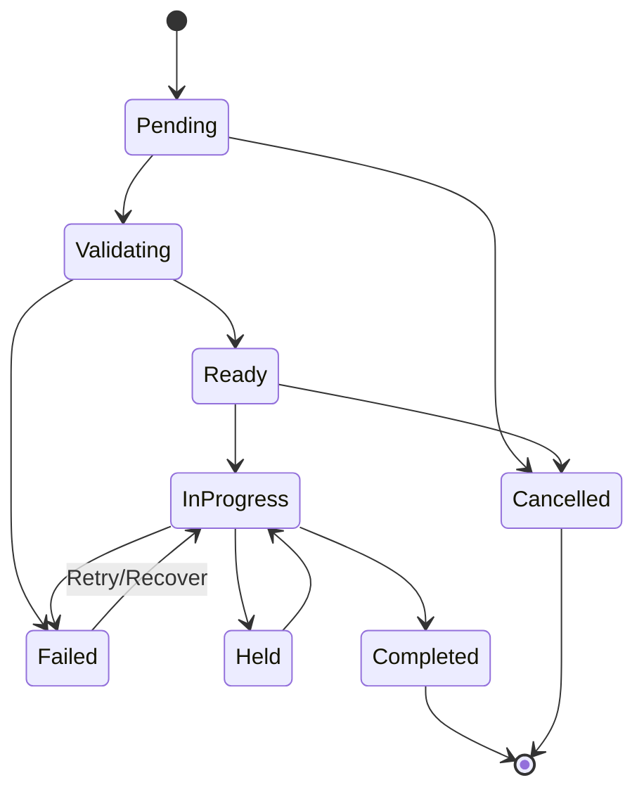

# Part 032 — Order States, Item States, Transitions, Aggregation, and Terminal Outcomes

## Positioning

Product Order lifecycle tidak cukup dimodelkan sebagai:

```text
NEW -> IN_PROGRESS -> COMPLETED
```

Enterprise Order dapat mengalami:

- acknowledgement;
- validation;
- decomposition;
- scheduling;
- partial completion;
- item fallout;
- retry;
- manual recovery;
- cancellation;
- amendment;
- and ambiguous downstream outcome.

Order-level state juga berbeda dari item-level state.

> **Core thesis:** Product Order lifecycle harus memisahkan business order state, item execution state, decomposition/orchestration state, dan integration state. Order-level state adalah policy-based aggregation atas item outcomes, bukan status yang ditulis bebas.

---

## 1. Order Business State

A representative Product Order lifecycle may include:

- DRAFT;
- SUBMITTED;
- ACKNOWLEDGED;
- VALIDATING;
- IN_PROGRESS;
- PARTIALLY_COMPLETED;
- COMPLETED;
- FAILED;
- CANCELLED;
- REJECTED;
- and SUPERSEDED.

Exact states require internal verification.

---

## 2. Item State

Order Items may progress independently.

Possible states:

- PENDING;
- VALIDATING;
- READY;
- IN_PROGRESS;
- HELD;
- COMPLETED;
- FAILED;
- CANCELLED;
- and SKIPPED.

---

## 3. Processing State

Technical process may have:

- decomposition;
- orchestration;
- callback;
- retry;
- and recovery states.

Do not merge blindly into business state.

---

## 4. Integration State

External interactions may be:

- NOT_SENT;
- SENT;
- ACKNOWLEDGED;
- RETRY_PENDING;
- FAILED;
- and UNKNOWN_OUTCOME.

---

## 5. Why Orthogonal States Matter

Avoid mega-state:

```text
IN_PROGRESS_DECOMPOSITION_FAILED_BILLING_PENDING
```

Use separate dimensions with explicit projections.

---

## 6. State versus Status

### State

Authoritative lifecycle semantics.

### Status

May be UI/reporting projection.

---

## 7. Draft

Order intent can be enriched or corrected before submission.

---

## 8. Submitted

Order is committed for processing.

Material edits now require governed operation.

---

## 9. Acknowledged

Receiving system has accepted responsibility for processing.

Acknowledged is not the same as validated or completed.

---

## 10. Validating

Order or items are being checked.

---

## 11. In Progress

At least one executable item has started and no terminal aggregation applies.

---

## 12. Partially Completed

Some required items completed while others remain failed, cancelled, or pending under a policy that permits partial outcome.

---

## 13. Completed

All required items reached successful terminal outcomes.

---

## 14. Failed

Order cannot reach required successful outcome under current process/policy.

---

## 15. Rejected

Order was not accepted for processing due to invalid request or policy.

Different from processing failure after acknowledgement.

---

## 16. Cancelled

Remaining work was cancelled through authorized business action.

---

## 17. Superseded

A replacement/amendment process takes over.

---

## 18. Held

Processing is intentionally paused.

May exist at item or process level.

---

## 19. Pending Information

Waiting for required data.

Better modeled as hold reason than giant state if possible.

---

## 20. Terminal State

Possible terminal outcomes:

- COMPLETED;
- FAILED;
- CANCELLED;
- REJECTED;
- and SUPERSEDED.

Partially Completed may be terminal or non-terminal depending policy.

---

## 21. Success Terminal State

COMPLETED means required order outcome achieved.

---

## 22. Failure Terminal State

FAILED means no further automatic progress and unsuccessful required outcome.

---

## 23. Administrative Terminal State

CANCELLED or SUPERSEDED.

---

## 24. State Machine Scope

The Order state machine governs:

- customer/product order lifecycle;
- not every low-level technical task.

---

## 25. Transition Components

For each transition define:

- command/event;
- current state;
- actor;
- guard;
- atomic changes;
- item impact;
- emitted event;
- idempotency;
- and recovery.

---

## 26. Candidate Transition Table

| Current | Command/Event | Guard | Next |
|---|---|---|---|
| Draft | SubmitOrder | Complete and valid | Submitted |
| Submitted | AcknowledgeOrder | Receiver accepts | Acknowledged |
| Acknowledged | StartProcessing | Decomposition ready | InProgress |
| InProgress | CompleteItem | Item success | Aggregated |
| InProgress | FailItem | Failure recorded | Aggregated |
| InProgress | CancelOrder | Cancellation allowed | Cancelled/Partial |
| Aggregated | AllRequiredComplete | Policy true | Completed |

---

## 27. Submit Order

Command:

```text
SubmitProductOrder
```

Guards:

- valid source;
- complete items;
- no duplicate;
- accepted commercial lineage;
- and actor/system authority.

---

## 28. Submission Atomicity

Persist:

- submitted state;
- immutable submission snapshot;
- audit;
- and outbox event.

---

## 29. Submission Idempotency

Retry returns same submitted Order.

---

## 30. Submission Freeze

Material intent becomes immutable for normal editing.

---

## 31. Acknowledge Order

A receiving/orchestrating system confirms receipt and responsibility.

---

## 32. Acknowledgement versus HTTP 200

Transport response is not necessarily business acknowledgement.

---

## 33. Acknowledgement Identity

Store:

- receiver;
- acknowledgement ID;
- time;
- and accepted scope.

---

## 34. Rejection before Acknowledgement

Invalid Order may be rejected.

---

## 35. Rejection Reason

Examples:

- invalid schema;
- unsupported action;
- stale inventory;
- duplicate;
- missing Agreement;
- and invalid party/account.

---

## 36. Validation Failure after Acknowledgement

May produce:

- fallout;
- manual review;
- or failure.

Do not call it transport rejection.

---

## 37. Start Processing

May require:

- valid decomposition;
- scheduling;
- reservations;
- and no blocking hold.

---

## 38. Decomposition State

Possible separate states:

- NOT_STARTED;
- PLANNING;
- PLANNED;
- FAILED;
- and SUPERSEDED.

---

## 39. Orchestration State

Possible:

- NOT_STARTED;
- RUNNING;
- WAITING;
- RECOVERING;
- COMPLETED;
- and FAILED.

---

## 40. Item State Machine

Illustrative:



---

## 41. Pending

No execution begun.

---

## 42. Validating

Action/current-state/dependency checks running.

---

## 43. Ready

Item can start when dependencies permit.

---

## 44. In Progress

Execution has started.

---

## 45. Held

Paused due to:

- customer;
- dependency;
- capacity;
- maintenance;
- or manual review.

---

## 46. Completed

Expected product outcome achieved and evidence recorded.

---

## 47. Failed

Attempt failed and item cannot automatically progress now.

---

## 48. Cancelled

Remaining requested work is intentionally stopped.

---

## 49. Skipped

Non-executable or conditionally omitted item.

Use only with explicit reason.

---

## 50. Unknown Outcome

External call may have succeeded but response is unknown.

This is not the same as Failed.

---

## 51. Item Attempt

One item can have multiple execution attempts.

---

## 52. Attempt Identity

Store:

- attempt ID;
- item;
- operation;
- start/end;
- result;
- external reference;
- and idempotency key.

---

## 53. Retry

Retry creates another attempt without changing original history.

---

## 54. Retryable Failure

Transient:

- timeout;
- unavailable dependency;
- rate limit;
- temporary capacity.

---

## 55. Non-Retryable Failure

Examples:

- invalid action;
- unsupported product;
- permanent data conflict;
- and rejected authorization.

---

## 56. Unknown versus Retryable

An unknown outcome requires reconciliation before retry.

---

## 57. Maximum Attempts

Set by failure type and policy.

---

## 58. Backoff

Use:

- exponential;
- bounded;
- and jittered

where appropriate.

---

## 59. Retry Budget

Protect shared systems.

---

## 60. Manual Retry

Authorized operator can retry with reason.

---

## 61. Recovery

Recovery may include:

- correct data;
- select alternate path;
- reconcile external result;
- or compensate prior step.

---

## 62. Fallout

Fallout is a business/operational exception preventing normal completion.

---

## 63. Fallout Identity

Store:

- fallout ID;
- item/process;
- reason;
- severity;
- owner;
- and state.

---

## 64. Fallout Reason Code

Examples:

- INVENTORY_CONFLICT;
- SERVICEABILITY_CHANGED;
- DOWNSTREAM_TIMEOUT;
- MAPPING_ERROR;
- MISSING_CONTACT;
- RESOURCE_UNAVAILABLE;
- BILLING_ACTIVATION_FAILED.

---

## 65. Fallout State

Possible:

- OPEN;
- ASSIGNED;
- IN_REVIEW;
- RECOVERING;
- RESOLVED;
- WAIVED;
- CLOSED_UNRESOLVED.

---

## 66. Fallout versus Failure

Failure is execution outcome.

Fallout is managed exception process.

---

## 67. Fallout Ownership

Possible:

- automated recovery;
- operations;
- product support;
- network;
- billing;
- and customer service.

---

## 68. Fallout SLA

Track age and severity.

---

## 69. Manual Intervention

Should use explicit commands and reason codes.

---

## 70. Item Dependency

An item can depend on another item state.

---

## 71. Dependency Types

Examples:

- START_AFTER;
- COMPLETE_AFTER;
- COMPLETE_BEFORE;
- SAME_TIME;
- and CANCEL_WITH.

---

## 72. Dependency Graph


---

## 73. Dependency Guard

An item starts only when required predecessor state holds.

---

## 74. Dependency Failure Propagation

Policy may:

- block dependent;
- cancel dependent;
- use alternative;
- or continue degraded.

---

## 75. Dependency Cycle

Reject before execution unless explicitly modeled as coordinated group.

---

## 76. Atomicity Group

Items that must achieve coordinated outcome.

---

## 77. All-or-Nothing Group

If one fails, compensate/cancel the group.

---

## 78. Best-Effort Group

Independent success is acceptable.

---

## 79. Quorum Group

A minimum subset must succeed.

Rare but possible.

---

## 80. Group State

Derived from member states and policy.

---

## 81. Order-Level Aggregation

Order state should be derived from item/group states.

---

## 82. Aggregation Policy

Must define:

- required items;
- optional items;
- non-order items;
- cancellations;
- and partial success.

---

## 83. Example Aggregation

```text
if all required completed -> COMPLETED
else if terminal and some required completed -> PARTIALLY_COMPLETED
else if terminal and none completed -> FAILED/CANCELLED
else -> IN_PROGRESS
```

---

## 84. Required versus Optional Item

Optional item failure may not fail Order.

---

## 85. Informational Item

Does not affect execution state.

---

## 86. Cancelled Item Aggregation

If customer cancels optional item, Order may still complete.

---

## 87. Failed Required Item

May cause:

- Order failed;
- partial completion;
- or recovery pending.

---

## 88. Partial Completion

Must state:

- completed scope;
- failed/cancelled scope;
- commercial consequences;
- and next actions.

---

## 89. Terminal Partial Completion

Use when remaining items will not progress.

---

## 90. Non-Terminal Partial Progress

Better represented as IN_PROGRESS with progress summary.

---

## 91. Progress Percentage

Useful projection, not authoritative state.

---

## 92. Progress Weight

Item count may not equal effort.

Define weighting if used.

---

## 93. Progress Monotonicity

Retries/cancellations can make naive percentage decrease.

---

## 94. Customer-Facing Progress

May simplify internal states.

---

## 95. Internal Progress

Can include decomposition and fallout detail.

---

## 96. Order Completion

Completion should require:

- required item outcomes;
- Inventory updates;
- and required downstream confirmations

according to policy.

---

## 97. Technical Completion versus Business Completion

Technical provisioning may complete before:

- billing activation;
- customer notification;
- or acceptance test.

Define which determines Product Order completion.

---

## 98. Item Completion Evidence

Examples:

- Inventory Product created/updated;
- service active;
- customer handoff;
- billing activation;
- and completion timestamp.

---

## 99. Completion Evidence Version

Retain references and checksums where relevant.

---

## 100. Completion Event

Emit after authoritative state persisted.

---

## 101. Completion Idempotency

Duplicate downstream callbacks must not complete twice.

---

## 102. Completion Race

Multiple final items may complete concurrently.

Aggregation must be concurrency-safe.

---

## 103. Compare-and-Set Aggregation

Use item/version or transactional aggregation.

---

## 104. Projection Lag

Order summary may lag item events.

Authoritative command path must use current state.

---

## 105. Order Failure

Order-level failure should be explicit and evidence-based.

---

## 106. Failure Reason

Distinguish:

- invalid request;
- external permanent failure;
- customer cancellation;
- policy block;
- and exhausted recovery.

---

## 107. Failure Is Not Timeout

Unknown outcome must reconcile first.

---

## 108. Failed Order Follow-Up

Possible:

- retry;
- amendment;
- replacement Order;
- partial close;
- compensation;
- and customer remedy.

---

## 109. Reopen Failed Order

Avoid arbitrary state reset.

Use explicit recovery command/attempt.

---

## 110. Recovered Item

State transition from Failed to InProgress may be allowed only via Recovery command.

---

## 111. Recovery Audit

Record:

- prior failure;
- resolution;
- actor;
- and new attempt.

---

## 112. Cancellation

Cancellation is a business command to stop remaining work.

---

## 113. Cancel Order Command

Inputs:

- Order ID;
- expected version;
- scope;
- reason;
- requested effective time;
- and idempotency key.

---

## 114. Cancellation Authority

May be:

- customer;
- order manager;
- operations;
- or system policy.

---

## 115. Cancellation Guard

Check:

- current state;
- completed/irreversible work;
- Agreement;
- charges;
- and downstream cancellation capability.

---

## 116. Cancellation before Processing

Usually straightforward.

---

## 117. Cancellation during Processing

May require:

- cancel downstream work;
- compensate;
- preserve completed items;
- and calculate fees/credits.

---

## 118. Cancellation after Completion

Use product termination/change Order, not cancel completed historical Order.

---

## 119. Item Cancellation

Cancel selected items if dependencies and commercial policy allow.

---

## 120. Partial Cancellation

Remaining items continue.

---

## 121. Cancellation Propagation

Downstream Service/Resource Orders receive explicit cancel commands.

---

## 122. Cancel Acknowledgement

Cancellation request and cancellation completion are different.

---

## 123. Cancellation State

Possible separate process states:

- REQUESTED;
- IN_PROGRESS;
- PARTIALLY_CANCELLED;
- COMPLETED;
- FAILED;
- and NOT_POSSIBLE.

---

## 124. Cancelled Order

Represents final outcome after remaining work stopped as far as policy requires.

---

## 125. Compensation

Compensation attempts to reverse prior effects.

---

## 126. Business Compensation

Examples:

- credit;
- cancellation fee waiver;
- and replacement service.

---

## 127. Technical Compensation

Examples:

- deprovision;
- release reservation;
- remove temporary resource.

---

## 128. Irreversible Step

Some effects cannot be fully reversed.

Record residual outcome.

---

## 129. Compensation Failure

Creates fallout and manual resolution.

---

## 130. Cancel versus Delete Product

Cancelling Order is not the same as terminating an active Product.

---

## 131. Amendment

Changes an existing Order intent through governed lifecycle.

---

## 132. Supplement

Adds additional related work.

---

## 133. Amendment State

May have its own:

- DRAFT;
- SUBMITTED;
- APPLIED;
- REJECTED;
- and CANCELLED.

---

## 134. Amendment Impact

Can affect:

- pending items;
- dependencies;
- requested dates;
- and downstream work.

---

## 135. Completed Item Amendment

Usually requires new Product Order action, not modifying history.

---

## 136. In-Flight Item Amendment

May:

- update;
- cancel/recreate;
- or be prohibited.

---

## 137. Amendment Concurrency

Use expected Order/item versions.

---

## 138. Amendment and Source Quote

A commercial amendment may require new Quote/Agreement evidence.

---

## 139. Order Hold

A Hold pauses processing without cancelling.

---

## 140. Hold Reason

Examples:

- customer dependency;
- payment;
- site access;
- maintenance window;
- compliance;
- and capacity.

---

## 141. Hold Owner

Who can release the hold?

---

## 142. Hold Expiry

A hold may expire or escalate.

---

## 143. Resume from Hold

Requires resolution evidence.

---

## 144. Customer-Caused Delay

Track separately for SLA and communication.

---

## 145. Provider-Caused Delay

Track separately.

---

## 146. Dependency-Caused Delay

Track source system/item.

---

## 147. Requested Date Change

May require amendment and re-planning.

---

## 148. Committed Date Change

Requires notification and possibly commercial remedy.

---

## 149. Milestone

Order lifecycle can expose milestones:

- received;
- validated;
- planned;
- scheduled;
- installed;
- activated;
- completed.

---

## 150. Milestone versus State

Milestone is historical achievement.

State is current lifecycle.

---

## 151. Milestone Identity

Store:

- milestone;
- item/order;
- achievedAt;
- source;
- and evidence.

---

## 152. Milestone Reversal

Avoid deleting milestone.

Record correction if it was wrong.

---

## 153. External Callback

Callbacks may arrive:

- duplicate;
- delayed;
- out of order;
- or for superseded attempt.

---

## 154. Callback Correlation

Use:

- Order Item;
- attempt ID;
- external order ID;
- and correlation ID.

---

## 155. Callback Idempotency

Store message/inbox deduplication.

---

## 156. Out-of-Order Callback

Ignore or reconcile based on attempt/version.

---

## 157. Late Success after Timeout

Do not process as failure if external operation succeeded.

---

## 158. Unknown Outcome State

Explicitly track until reconciliation.

---

## 159. Reconciliation Query

Query downstream using idempotency/business key.

---

## 160. Polling versus Callback

Either can update process state.

Use consistent ownership.

---

## 161. Scheduled Reconciliation

Find:

- stuck callbacks;
- unknown outcomes;
- and state mismatches.

---

## 162. Product Inventory Update

Inventory update may be synchronous or eventual.

---

## 163. Inventory Confirmation

Order Item completion may depend on Inventory confirmation.

---

## 164. Inventory Update Failure

Technical service can be active while Inventory update failed.

This is serious fallout.

---

## 165. Billing Activation

May be separate milestone.

---

## 166. Billing Failure

Decide whether Product Order can complete with billing fallout open.

Policy-specific.

---

## 167. Customer Notification

Notification failure should not necessarily undo completion.

---

## 168. Completion Aggregation Policy

Define which downstream confirmations are mandatory.

---

## 169. Product Order API Commands

Examples:

- SubmitProductOrder;
- AcknowledgeProductOrder;
- StartOrderProcessing;
- HoldOrderItem;
- ResumeOrderItem;
- CompleteOrderItem;
- FailOrderItem;
- RetryOrderItem;
- CancelProductOrder;
- CancelOrderItem;
- CloseOrderAsPartial;
- ReconcileOrderOutcome.

---

## 170. Generic Status Update Risk

A generic endpoint can create impossible states.

---

## 171. Command Reason Codes

Use stable domain reason codes.

---

## 172. Expected Version

All state-changing commands should protect concurrency.

---

## 173. Idempotency Key

Especially:

- submit;
- acknowledge;
- complete;
- cancel;
- and retry external effects.

---

## 174. Transition Atomicity

Persist:

- state;
- history;
- evidence;
- and outbox

atomically where local.

---

## 175. State History

Record:

```text
from
to
command/event
actor/system
reason
effectiveAt
recordedAt
version
correlation
```

---

## 176. Item History

Maintain independent item history.

---

## 177. Order Summary Projection

Aggregate item states for read.

---

## 178. Allowed Actions Projection

Expose possible commands.

Server still revalidates.

---

## 179. Event Model

Representative events:

- ProductOrderSubmitted;
- ProductOrderAcknowledged;
- ProductOrderProcessingStarted;
- ProductOrderItemStarted;
- ProductOrderItemCompleted;
- ProductOrderItemFailed;
- ProductOrderPartiallyCompleted;
- ProductOrderCompleted;
- ProductOrderCancellationRequested;
- ProductOrderCancelled.

---

## 180. Event Naming

Use past-tense business facts.

---

## 181. Event Payload

Include:

- Order;
- item;
- state;
- attempt;
- reason;
- and external references.

---

## 182. Event Ordering

Order-level and item-level keys may differ.

---

## 183. Consumer Idempotency

Required across:

- Inventory;
- Billing;
- Notifications;
- Analytics;
- and CRM.

---

## 184. Transactional Outbox

Protect local state/event consistency.

---

## 185. Inbox/Deduplication

Protect duplicate incoming callbacks.

---

## 186. State Projection Rebuild

Events or source tables should allow projection repair.

---

## 187. Search Index Lag

Search status may lag.

Do not use it for commands.

---

## 188. State Machine Testing

Test:

- every allowed transition;
- every prohibited transition;
- and every guard.

---

## 189. Transition Matrix Test

Generate automated tests from specification.

---

## 190. Model-Based Testing

Generate random command/event sequences.

---

## 191. Property-Based Testing

Properties:

- completed item never returns to pending;
- duplicate callback produces one effect;
- cancelled remaining work does not restart without explicit new Order;
- all required completed implies Order completed;
- and unknown outcome is never silently treated as failure.

---

## 192. Concurrency Testing

Test:

- completion versus cancellation;
- two final item completions;
- retry versus late success;
- amendment versus processing;
- and inventory race.

---

## 193. Temporal Testing

Test:

- hold expiry;
- retry backoff;
- SLA timers;
- and delayed callbacks.

---

## 194. Failure Injection

Inject:

- service timeout;
- duplicate event;
- lost callback;
- outbox delay;
- Inventory failure;
- and Billing failure.

---

## 195. Recovery Testing

Verify:

- restart;
- replay;
- reconciliation;
- and manual recovery commands.

---

## 196. State Metrics

- count by Order state;
- count by Item state;
- transition rate;
- illegal transition rate;
- and terminal outcome.

---

## 197. State Age

Track time in:

- Submitted;
- Validating;
- InProgress;
- Held;
- Fallout;
- and CancellationRequested.

---

## 198. Cycle Time

Measure:

- submit-to-acknowledge;
- acknowledge-to-start;
- start-to-complete;
- and acceptance-to-complete.

---

## 199. Partial Completion Rate

High rate may reveal:

- dependency design;
- product quality;
- or downstream instability.

---

## 200. Fallout Rate

Break down by:

- reason;
- product;
- market;
- downstream;
- and item action.

---

## 201. Retry Rate

High retries may hide unstable dependency.

---

## 202. Unknown Outcome Count

Should be visible and bounded.

---

## 203. Cancellation Metrics

- requested;
- accepted;
- failed;
- and partial cancellation.

---

## 204. Order Lifecycle SLI

Examples:

- zero duplicate completion effects;
- all unknown outcomes reconciled within target;
- all terminal Orders have complete item outcomes;
- and zero direct state mutations without history.

Internal targets must be verified.

---

## 205. Stuck Order

Examples:

- Submitted but not acknowledged;
- InProgress without item activity;
- Held beyond SLA;
- Unknown outcome unresolved;
- and CancellationRequested indefinitely.

---

## 206. Stuck Detection

Use:

- state age;
- last event;
- expected next transition;
- retry count;
- and owner.

---

## 207. Reconciliation

Detect:

- Order completed while required item failed;
- item completed without Inventory outcome;
- cancelled Order with active downstream work;
- unknown callback without attempt;
- and state projection mismatch.

---

## 208. Recovery Commands

Examples:

- ReconcileAcknowledgement;
- ReconcileItemOutcome;
- ResumeHeldItem;
- RetryFailedItem;
- LinkExternalOrder;
- CloseOrderAsPartial;
- CorrectStateHistoryMetadata.

---

## 209. Direct Database Update Risk

Bypasses:

- transition guards;
- downstream events;
- history;
- and aggregation.

---

## 210. Lifecycle Incident

Examples:

- completed Order reopens;
- duplicate item completion creates duplicate Product;
- cancellation races with activation;
- timeout retried after downstream success;
- and failed item hidden by Order Completed.

---

## 211. Incident Containment

Possible:

- freeze Order/item;
- pause orchestration;
- block Inventory/Billing mutation;
- reconcile external state;
- and preserve evidence.

---

## 212. State Smells

- one Order status;
- item states missing;
- and processing/integration states mixed.

---

## 213. Aggregation Smells

- Order marked complete when any item completes;
- optional/required distinction absent;
- and partial completion undocumented.

---

## 214. Retry Smells

- retry on every failure;
- no attempt identity;
- no backoff;
- and timeout treated as failure.

---

## 215. Cancellation Smells

- cancel means database delete;
- no downstream acknowledgement;
- and completed Product silently removed.

---

## 216. Recovery Smells

- failed item status manually set to completed;
- no reason/audit;
- and replay creates duplicate effects.

---

## 217. Anti-Patterns

### One Status for Order and Items

Partial progress is invisible.

### Timeout Equals Failed

Ambiguous success causes duplicate work.

### Completion by Callback Alone

No aggregate/inventory evidence.

### Cancel Completed Order

Wrong business operation.

### Retry without Idempotency

Duplicate Products/resources.

### Manual Status Fix

Guards and events bypassed.

### Order Failure Reverts Accepted Quote

Commercial truth destroyed.

---

## 218. Order State Machine Template

```md
## Order States

## Item States

## Processing/Integration States

## Commands and Events

## Transition Table

## Guards

## Aggregation Policy

## Retry / Unknown Outcome

## Hold / Fallout

## Cancellation / Compensation

## Amendment

## Completion Evidence

## Timers / SLAs

## Recovery Commands

## Metrics
```

---

## 219. Transition Specification Template

```text
Transition:
Scope: Order / Item / Group
Trigger:
Current states:
Actor/system:
Guards:
Atomic changes:
Evidence:
Next state:
Aggregation impact:
External effects:
Idempotency:
Failure reasons:
Recovery:
```

---

## 220. Aggregation Policy Template

```text
Policy ID/version:
Required item types:
Optional item types:
Ignored/informational items:
Success rule:
Partial-completion rule:
Failure rule:
Cancellation rule:
Unknown outcome behavior:
```

---

## 221. Attempt Template

```text
Attempt ID:
Order item:
Operation:
Idempotency key:
Started at:
External reference:
Outcome:
Failure type:
Retryable:
Next retry:
Reconciliation:
```

---

## 222. Fallout Template

```text
Fallout ID:
Order/item:
Reason code:
Severity:
Detected at:
Owner:
State:
Evidence:
Recovery plan:
SLA:
Resolution:
```

---

## 223. Cancellation Template

```text
Cancellation ID:
Order/item scope:
Requested by:
Reason:
Requested effective time:
Current irreversible work:
Downstream targets:
Compensation:
State:
Outcome:
```

---

## 224. Completion Evidence Template

```text
Order/item:
Expected product outcome:
Inventory reference/version:
Service/resource outcomes:
Billing activation:
Customer handoff:
Effective completion time:
Recorded time:
Evidence:
```

---

## 225. Lifecycle Invariants

Representative invariants:

- submitted intent is immutable except through governed amendment;
- Order state is consistent with item states;
- completed item has required outcome evidence;
- duplicate callbacks do not duplicate effects;
- unknown outcome is reconciled before retry;
- completed Order cannot be cancelled as if unprocessed;
- cancellation preserves completed/irreversible outcomes;
- and accepted Quote remains accepted despite Order failure.

---

## 226. Worked Example: Straight-Through ADD

```text
Draft
-> Submitted
-> Acknowledged
-> InProgress
-> Completed
```

All required items complete, Inventory Products created, and required Billing activation confirmed.

---

## 227. Worked Example: Partial Site Completion

100 sites:

- 95 completed;
- 5 permanent fallout.

Policy closes Order as PARTIALLY_COMPLETED and creates remedy process for five sites.

---

## 228. Worked Example: Retryable Timeout

Router activation times out.

State:

- UNKNOWN_OUTCOME.

Reconciliation finds activation succeeded.

Item completes without retrying activation.

---

## 229. Worked Example: Non-Retryable Failure

MODIFY action references Product already terminated.

Item fails validation with INVENTORY_STATE_CONFLICT.

Manual/commercial correction required.

---

## 230. Worked Example: Hold

Site access unavailable.

Item enters HELD with customer-dependency reason.

SLA clock and customer communication policy apply.

---

## 231. Worked Example: Cancellation during Processing

Customer cancels remaining 20 sites after 80 completed.

Completed sites remain.

Pending/in-progress sites receive cancellation/compensation.

Order closes according to partial cancellation policy.

---

## 232. Worked Example: Completion versus Cancellation Race

Final item completion and cancellation command race.

Expected version and atomic transition determine outcome.

Historical evidence shows exact ordering.

---

## 233. Worked Example: Duplicate Callback

Downstream sends completion callback three times.

Inbox deduplication and item state guard create one Inventory update and one completion event.

---

## 234. Worked Example: Inventory Failure

Service activates, but Inventory update fails.

Item remains in fallout/recovery until Inventory lineage is repaired.

---

## 235. Worked Example: Billing Failure

Product active, Billing activation failed.

Policy decides whether:

- Order remains InProgress;
- completes with billing fallout;
- or blocks completion.

---

## 236. Worked Example: Failed Order Recovery

Failed item is corrected and explicit RetryOrderItem creates new attempt.

State history preserves original failure.

---

## 237. Worked Example: Amendment

Requested activation date changes before work starts.

An amendment is submitted, version-checked, re-planned, and audited.

---

## 238. Worked Example: Order Reconciliation

Order summary says Completed, but one required item is Failed.

Reconciliation flags invariant breach and blocks downstream closure/reporting.

---

## 239. Senior Engineer Operating Model

### Separate order, item, process, and integration states

Avoid mega-enums.

### Derive Order state from item outcomes

Under versioned aggregation policy.

### Model attempts and unknown outcomes

Timeout is not failure.

### Make retries idempotent

And bounded.

### Treat fallout as managed exception

With owner, SLA, and recovery.

### Design cancellation as workflow

Not record deletion.

### Preserve irreversible outcomes

Compensation may be partial.

### Require completion evidence

Inventory and other mandated confirmations.

### Operate state age and reconciliation

Stuck and inconsistent Orders must be visible.

---

## 240. Internal Verification Checklist

### Official states

- What are authoritative Order states?
- What are Item states?
- Are decomposition/orchestration/integration states separate?
- Which states are terminal?

### Submission and acknowledgement

- What does submission freeze?
- What is business acknowledgement?
- Can an Order be rejected after submission?
- Is submission idempotent?

### Aggregation

- How is Order state derived from items?
- Are required/optional/non-order items distinguished?
- Is Partially Completed terminal?
- What happens when required item fails?

### Attempts and retries

- Are attempts first-class?
- How are retryable, permanent, and unknown outcomes distinguished?
- What backoff/budget exists?
- How are late successes reconciled?

### Dependencies and fallout

- How are item dependencies modeled?
- Are cycles prevented?
- What is the fallout lifecycle?
- Who owns recovery and SLA?

### Cancellation and amendments

- Which states allow cancellation?
- How are completed/irreversible items handled?
- Are item-level and partial cancellation supported?
- How are in-flight amendments applied?

### Completion

- What evidence is required?
- Does Inventory confirmation block completion?
- Does Billing activation block completion?
- How are duplicate callbacks handled?

### Operations

- Are state age, unknown outcomes, fallout, retries, and cancellation monitored?
- What reconciliation jobs exist?
- What explicit recovery commands exist?
- What historical incidents expose state-model gaps?

---

## 241. Practical Exercises

### Exercise 1 — State taxonomy

Separate current statuses into Order, Item, processing, and integration dimensions.

### Exercise 2 — Aggregation policy

Define Completed, Partially Completed, Failed, and Cancelled outcomes.

### Exercise 3 — Unknown outcome

Design timeout reconciliation before retry.

### Exercise 4 — Dependency and fallout

Model a four-item dependency graph and failure propagation.

### Exercise 5 — Cancellation

Handle cancellation before, during, and after processing.

### Exercise 6 — Recovery

Replace manual status edits with explicit recovery commands.

---

## 242. Part Completion Checklist

You are done if you can:

- define authoritative Order and Item state machines;
- separate process/integration state;
- define submission and acknowledgement semantics;
- aggregate Order state from item outcomes;
- model partial completion;
- distinguish failure, fallout, and unknown outcome;
- design idempotent retries and attempts;
- model holds, cancellation, compensation, and amendment;
- require completion evidence;
- reconcile stuck/inconsistent Orders;
- and create an internal Product Order lifecycle verification backlog.

---

## 243. Key Takeaways

1. Product Order and Order Item states differ.
2. Processing and integration states should remain orthogonal.
3. Order state is a policy-based aggregation.
4. Partial completion needs explicit semantics.
5. Timeout is not proof of failure.
6. Attempts and idempotency prevent duplicate effects.
7. Fallout is a managed exception lifecycle.
8. Cancellation is a governed workflow, not deletion.
9. Completion requires evidence.
10. Internal CSG Product Order lifecycle must be verified.

---

## 244. References

Conceptual baseline:

- General enterprise and telecom Product Order lifecycle, item state, partial completion, cancellation, and fallout practices.
- Finite-state machines, hierarchical/orthogonal states, guarded transitions, and aggregation policies.
- Distributed systems idempotency, retry, ambiguous outcomes, callback deduplication, outbox/inbox, and reconciliation.
- TM Forum Product Order, Product Order Item, Product Inventory, Service Order, and Resource Order vocabulary.

These references do not define internal CSG Product Order lifecycle or orchestration implementation.
