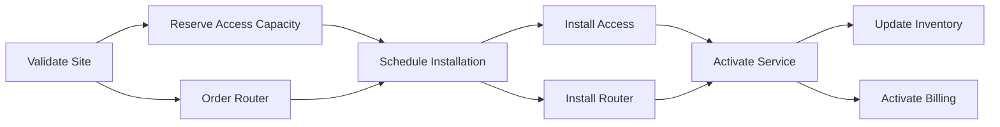

# Part 034 — Decomposition Rules, Fulfillment Units, Feasibility, Capacity, and Plan Versioning

## Positioning

Product Order menyatakan customer-facing product outcome.

Fulfillment membutuhkan detail yang berbeda:

- service actions;
- resource actions;
- external supplier tasks;
- inventory reservations;
- appointments;
- dependencies;
- sequencing;
- capacity;
- and operational milestones.

Order decomposition adalah proses menerjemahkan Product Order Items menjadi fulfillment plan.

> **Core thesis:** decomposition harus menghasilkan plan yang versioned, explainable, dan traceable dari Product Order intent menuju Service/Resource/external fulfillment units. Plan harus dapat divalidasi, direvisi, dan direkonsiliasi tanpa mengubah accepted commercial intent.

---

## 1. Decomposition

Decomposition converts Product Order intent into executable fulfillment units.

Possible outputs:

- Service Order Items;
- Resource Order Items;
- supplier orders;
- activation tasks;
- appointments;
- inventory reservations;
- billing activation instructions;
- and manual work items.

---

## 2. Fulfillment Plan

A Fulfillment Plan is an explicit graph of:

- work units;
- dependencies;
- milestones;
- owners;
- timing;
- and expected outcomes.

---

## 3. Product Order versus Fulfillment Plan

### Product Order

Customer-facing requested product action.

### Fulfillment Plan

Provider-facing realization strategy.

---

## 4. Product Intent Preservation

The plan must deliver the target Product state defined by Product Order.

---

## 5. Plan Is Not Commercial Re-Negotiation

Planning cannot silently:

- downgrade product;
- change accepted term;
- add customer charge;
- or alter product quantity.

Material commercial change requires a governed process.

---

## 6. Plan Identity

Use stable identity:

```text
Fulfillment Plan ID: FP-2026-000123
Product Order: PO-123
```

---

## 7. Plan Version

Every meaningful replan creates a new version or immutable plan revision.

---

## 8. Decomposition Run Identity

One Order may have several decomposition runs.

---

## 9. Rule-Set Version

Retain decomposition rule version.

---

## 10. Engine Version

Retain implementation version.

---

## 11. Planning Context Version

May include:

- network topology;
- capacity;
- supplier catalog;
- inventory;
- and workforce calendar.

---

## 12. Decomposition Contract

Defines:

- supported Product Order schemas;
- input facts;
- output unit types;
- rule selection;
- validation;
- and lineage.

---

## 13. Decomposition Preconditions

Typical:

- Product Order submitted/acknowledged;
- item actions valid;
- mapping version available;
- required feasibility evidence present;
- and no active conflicting plan.

---

## 14. Decomposition Result

Possible:

- PLANNED;
- PARTIALLY_PLANNED;
- WAITING_FOR_DATA;
- WAITING_FOR_CAPACITY;
- MANUAL_DESIGN;
- FAILED;
- and SUPERSEDED.

---

## 15. Early Decomposition

Occurs during:

- configuration;
- quote;
- or pre-order validation.

---

## 16. Late Decomposition

Occurs after Product Order submission.

---

## 17. Hybrid Decomposition

Use early preview for feasibility and late authoritative plan for execution.

---

## 18. Preview Plan

Non-binding but useful for:

- lead-time estimate;
- feasibility;
- cost;
- and risk.

---

## 19. Authoritative Plan

Approved/committed plan used to create fulfillment work.

---

## 20. Plan Provenance

Store:

- Product Order/item versions;
- decomposition rules;
- external context versions;
- assumptions;
- and planner/actor.

---

## 21. Fulfillment Unit

A Fulfillment Unit is one executable or coordinatable piece of work.

---

## 22. Unit Types

Examples:

- SERVICE_ORDER_ITEM;
- RESOURCE_ORDER_ITEM;
- SUPPLIER_ORDER;
- INVENTORY_RESERVATION;
- APPOINTMENT;
- ACTIVATION_TASK;
- BILLING_ACTIVATION;
- MANUAL_TASK;
- CUSTOMER_DEPENDENCY.

---

## 23. Service Order Item

Represents service realization action.

---

## 24. Resource Order Item

Represents resource provisioning/allocation action.

---

## 25. Supplier Order

Requests work from external partner/vendor.

---

## 26. Inventory Reservation

Reserves scarce product/resource capacity.

---

## 27. Appointment

Schedules customer/site activity.

---

## 28. Activation Task

Triggers or verifies activation.

---

## 29. Manual Task

Explicitly models human work.

Do not hide manual steps in comments.

---

## 30. Customer Dependency

Represents required customer action.

Example:

- provide site access;
- approve design;
- supply power;
- or confirm schedule.

---

## 31. Fulfillment Unit Identity

Each unit needs stable identity.

---

## 32. Source Product Order Item

Every unit should trace to one or more Product Order Items.

---

## 33. Many-to-One Unit

One fulfillment unit may support several Product Order Items.

---

## 34. One-to-Many Units

One Product Order Item may create many units.

---

## 35. Shared Fulfillment Unit

Example:

- one shared network access supports several products.

---

## 36. Fulfillment Domain

A unit belongs to a domain/team/system.

Examples:

- access network;
- CPE;
- cloud;
- billing;
- supplier;
- and field service.

---

## 37. Unit Owner

Identify:

- system owner;
- operational team;
- and escalation path.

---

## 38. Unit Action

Possible:

- CREATE;
- MODIFY;
- DELETE;
- RESERVE;
- RELEASE;
- ACTIVATE;
- DEACTIVATE;
- VERIFY;
- and SCHEDULE.

---

## 39. Unit Target

References:

- Service;
- Resource;
- supplier product;
- appointment type;
- or manual-work type.

---

## 40. Expected Outcome

Every unit should state expected result.

---

## 41. Completion Evidence

Examples:

- Service ID active;
- Resource allocated;
- appointment completed;
- supplier acknowledgement;
- and billing charge activated.

---

## 42. Decomposition Rule

A rule maps Product Order intent into one or more units and relationships.

---

## 43. Rule Identity

Store:

```text
ruleId
ruleVersion
scope
effectivePeriod
owner
```

---

## 44. Rule Scope

May depend on:

- product specification;
- action;
- market;
- site type;
- technology;
- supplier;
- and installed state.

---

## 45. Rule Candidate

A candidate includes:

- match predicate;
- specificity;
- priority;
- validity;
- and output pattern.

---

## 46. Deterministic Rule Selection

No arbitrary first-match.

---

## 47. Rule Conflict

Multiple incompatible rules match.

Return conflict/manual design.

---

## 48. Missing Rule

Return explicit:

```text
DECOMPOSITION_RULE_MISSING
```

---

## 49. Rule Publication

Published rules should be immutable/versioned.

---

## 50. Rule Static Analysis

Detect:

- missing target;
- invalid dependency;
- cycle;
- unsupported action;
- and orphan output.

---

## 51. Rule Test

Golden Product Order scenarios should produce expected plan graph.

---

## 52. Declarative Decomposition

Rules/data define output graph.

Benefits:

- governance;
- explainability;
- versioning.

---

## 53. Imperative Decomposition

Code constructs plan.

Benefits:

- flexibility;
- complex algorithms.

Risks:

- hidden behavior;
- harder business review.

---

## 54. Hybrid Decomposition

Declarative patterns plus coded planners for complex domains.

---

## 55. Product-to-Service Mapping

Maps target Product state to required Service outcomes.

---

## 56. Service-to-Resource Mapping

Maps Service outcomes to Resource outcomes.

---

## 57. Supplier Mapping

Selects external product/service and order contract.

---

## 58. Mapping Layer Separation

Do not collapse Product -> Service -> Resource semantics into one opaque transformation.

---

## 59. Decomposition Depth

Possible:

- Product only;
- Product + Service;
- Product + Service + Resource;
- full work breakdown.

---

## 60. Progressive Decomposition

Add detail as evidence and timing improve.

---

## 61. Plan Fidelity

Possible:

- indicative;
- feasible;
- reserved;
- scheduled;
- executable;
- and committed.

---

## 62. Indicative Plan

Uses assumptions and broad lead times.

---

## 63. Feasible Plan

Key constraints validated.

---

## 64. Reserved Plan

Capacity/resources reserved.

---

## 65. Scheduled Plan

Dates/appointments assigned.

---

## 66. Executable Plan

All mandatory units and dependencies ready.

---

## 67. Committed Plan

Provider commits operational schedule where applicable.

---

## 68. Feasibility

Determines whether target Product can be realized.

---

## 69. Feasibility Dimensions

- technical;
- geographical;
- capacity;
- supplier;
- schedule;
- regulatory;
- and operational.

---

## 70. Technical Feasibility

Can the architecture/technology support target state?

---

## 71. Geographic Feasibility

Is service available at site/location?

---

## 72. Capacity Feasibility

Is sufficient capacity available?

---

## 73. Supplier Feasibility

Can partner deliver required outcome?

---

## 74. Schedule Feasibility

Can dependencies complete within requested window?

---

## 75. Regulatory Feasibility

Are permits/licences/constraints satisfied?

---

## 76. Feasibility Evidence

Store:

- result;
- scope;
- source;
- version;
- validUntil;
- and assumptions.

---

## 77. Feasibility Validity

Feasibility can expire.

---

## 78. Feasibility Drift

Network/capacity/supplier conditions can change after quote.

---

## 79. Revalidation

Before execution, revalidate critical feasibility.

---

## 80. Feasibility Failure

Possible outcomes:

- alternate plan;
- customer change;
- manual design;
- delayed schedule;
- or commercial amendment.

---

## 81. Alternative Plan

Planner may generate multiple feasible plans.

---

## 82. Plan Selection Criteria

Possible:

- earliest completion;
- lowest cost;
- lowest risk;
- preferred supplier;
- highest resilience;
- and policy compliance.

---

## 83. Objective Function

If optimization is used, define explicit objective and constraints.

---

## 84. Multi-Objective Planning

Trade-offs among:

- cost;
- lead time;
- resilience;
- and operational complexity.

---

## 85. Plan Recommendation

System may recommend but authority may select.

---

## 86. Plan Selection Audit

Record:

- alternatives;
- scores;
- constraints;
- selected plan;
- and actor/reason.

---

## 87. Capacity

Capacity may be:

- consumable;
- reservable;
- shareable;
- and time-bound.

---

## 88. Capacity Identity

Examples:

- port;
- bandwidth pool;
- technician slot;
- license pool;
- device stock;
- supplier quota.

---

## 89. Capacity Check

A read-only check is not reservation.

---

## 90. Capacity Reservation

A state-changing command.

---

## 91. Reservation Identity

Store:

- capacity resource;
- quantity;
- window;
- owner;
- expiry;
- and source Plan.

---

## 92. Reservation Expiry

Expired reservation can invalidate Plan.

---

## 93. Reservation Release

Release on:

- cancellation;
- supersession;
- failed plan;
- or timeout.

---

## 94. Reservation Idempotency

Retry must not double-reserve.

---

## 95. Reservation Race

Two Orders compete for final capacity.

Need atomic reservation.

---

## 96. Soft Reservation

Indicative hold with lower guarantee.

---

## 97. Hard Reservation

Committed capacity.

---

## 98. Overbooking

May be allowed under explicit policy.

---

## 99. Inventory Availability

Physical stock is a capacity dimension.

---

## 100. Supplier Capacity

May be queried/reserved through external integration.

---

## 101. Capacity Snapshot

Plan should retain source/version and reservation reference.

---

## 102. Scheduling

Assigns temporal windows to fulfillment units.

---

## 103. Requested Date

Customer preference from Product Order.

---

## 104. Earliest Start

Derived from predecessors and availability.

---

## 105. Latest Finish

Constraint based on customer or SLA.

---

## 106. Duration

Expected processing duration.

---

## 107. Calendar

Team/supplier/customer calendars matter.

---

## 108. Business Days

Define holiday calendar and timezone.

---

## 109. Maintenance Window

Technical changes may require specific windows.

---

## 110. Appointment Window

Customer/site activity interval.

---

## 111. Lead Time

Expected elapsed time before completion.

---

## 112. Lead-Time Source

Can be:

- catalog;
- supplier;
- historical model;
- planner;
- and contractual SLA.

---

## 113. Lead-Time Confidence

Indicative versus committed.

---

## 114. Critical Path

Longest dependency path determines earliest completion.

---

## 115. Slack

Time a unit can slip without changing final date.

---

## 116. Milestone

Examples:

- design approved;
- capacity reserved;
- installation complete;
- activation complete.

---

## 117. Milestone Dependency

A milestone can gate later work.

---

## 118. Dependency Graph



---

## 119. Dependency Types

- START_AFTER;
- COMPLETE_AFTER;
- START_TOGETHER;
- COMPLETE_TOGETHER;
- MUTUALLY_EXCLUSIVE;
- and CONDITIONAL.

---

## 120. Conditional Dependency

Example:

- router replacement task only if current model incompatible.

---

## 121. Dependency Condition

Should be machine-readable and versioned.

---

## 122. Cycle Detection

A plan graph should be acyclic unless explicit coordinated-cycle semantics exist.

---

## 123. Topological Ordering

Used for executable sequence.

---

## 124. Parallelism

Independent units can execute concurrently.

---

## 125. Fan-Out

One predecessor enables many units.

---

## 126. Fan-In

Many predecessors required before one unit.

---

## 127. Barrier

A synchronization point.

---

## 128. Atomicity Group

Some units must be coordinated as a group.

---

## 129. Cutover Group

Source deactivation and target activation require controlled sequence.

---

## 130. Rollback/Compensation Group

Defines recovery if cutover fails.

---

## 131. Manual Gate

Human decision/checkpoint blocks progress.

---

## 132. Customer Gate

Customer approval or site-access confirmation.

---

## 133. External Gate

Supplier permit or regulatory approval.

---

## 134. Plan Validation

Check:

- all Product Order Items covered;
- dependencies valid;
- no cycles;
- owners assigned;
- feasibility current;
- capacity policy satisfied;
- and outcomes defined.

---

## 135. Coverage Invariant

Every executable Product Order Item maps to sufficient fulfillment outcomes.

---

## 136. No-Orphan Unit

Every unit has:

- source;
- owner;
- and expected outcome.

---

## 137. Dependency Invariant

Every dependency references existing units and valid type.

---

## 138. Temporal Invariant

Scheduled unit respects predecessors and calendars.

---

## 139. Capacity Invariant

Committed Plan has required reservations.

---

## 140. Product Outcome Invariant

Plan completion should produce target Product state.

---

## 141. Commercial Boundary Invariant

Plan does not change accepted product/price/term silently.

---

## 142. Supplier Boundary Invariant

Supplier unit references valid contract/catalog and service level.

---

## 143. Plan Completeness

A Plan may be:

- partial;
- complete;
- executable;
- or committed.

---

## 144. Partial Plan

Some Product Order Items or details unresolved.

---

## 145. Partial Plan Reason

Examples:

- awaiting site survey;
- missing supplier quote;
- capacity pending;
- and manual design.

---

## 146. Residual Planning Item

Tracks unresolved Product Order scope.

---

## 147. No Silent Planning Gap

Every Product Order Item has plan coverage or explicit residual.

---

## 148. Plan Revision

Create when:

- feasibility changes;
- capacity unavailable;
- supplier changes;
- date changes;
- or fulfillment unit fails.

---

## 149. Replanning

Generates new Plan version while preserving prior version.

---

## 150. Replanning Trigger

- capacity loss;
- delayed supplier;
- changed requested date;
- failed task;
- product amendment;
- and customer dependency.

---

## 151. Replanning Scope

Possible:

- one unit;
- one site;
- one dependency branch;
- one wave;
- or full Order.

---

## 152. Local Replan

Changes independent branch.

---

## 153. Global Replan

Recomputes full graph.

---

## 154. Replan Safety

Must preserve:

- completed/irreversible work;
- accepted commercial intent;
- and existing reservations/evidence.

---

## 155. Completed Unit

Do not delete from history during replan.

---

## 156. Superseded Pending Unit

Mark superseded and link replacement.

---

## 157. Reservation Transfer

May transfer or release/recreate reservation.

---

## 158. Replan Diff

Show:

- added/removed units;
- dependency changes;
- date changes;
- owner/supplier changes;
- risk;
- and commercial impact.

---

## 159. Material Commercial Impact

If replan changes:

- product outcome;
- customer date commitment;
- price;
- or term,

route to commercial change process.

---

## 160. Operational-Only Change

May be internal if accepted outcome remains unchanged.

---

## 161. Customer Notification

Schedule changes may require notification.

---

## 162. Replan Approval

High-risk or customer-impacting replan may require operational approval.

---

## 163. Plan Freeze

Near execution, certain plan sections may be frozen.

---

## 164. Freeze Scope

Possible:

- cutover group;
- supplier order;
- appointment;
- and reserved capacity.

---

## 165. Freeze Override

Requires authority and audit.

---

## 166. Plan Publication

A Plan version becomes active/executable.

---

## 167. Published Plan Immutability

Do not edit in place.

Create a new version.

---

## 168. Plan State

Possible:

- DRAFT;
- VALIDATING;
- FEASIBLE;
- RESERVED;
- SCHEDULED;
- PUBLISHED;
- EXECUTING;
- SUPERSEDED;
- COMPLETED;
- FAILED.

---

## 169. Plan versus Order State

Plan state is separate from Product Order business state.

---

## 170. Plan Execution

Orchestrator consumes active Plan.

---

## 171. Execution Snapshot

Pin exact Plan version.

---

## 172. Mid-Execution Replan

Requires coordinated handover from old to new Plan.

---

## 173. Plan Handover

Record:

- old version;
- new version;
- completed units;
- transferred units;
- cancelled units;
- and effective time.

---

## 174. Multiple Active Plans

Usually prohibited for same scope unless waves/branches are explicit.

---

## 175. Plan Partition

Large Orders may have one Plan per:

- site;
- region;
- wave;
- or fulfillment domain.

---

## 176. Master Plan

Coordinates partitions and cross-plan dependencies.

---

## 177. Plan Manifest

Captures:

- Product Order/item versions;
- child Plan versions;
- dependency summary;
- reservations;
- and checksum.

---

## 178. Distributed Planning

Each domain creates its plan fragment.

A coordinator composes them.

---

## 179. Fragment Contract

Each fragment should expose:

- inputs;
- units;
- dependencies;
- outcomes;
- validity;
- and version.

---

## 180. Fragment Ownership

Domain team owns internal decomposition.

---

## 181. Cross-Domain Dependency

Coordinator manages dependencies between fragments.

---

## 182. Fragment Replan

A domain can revise its fragment.

Coordinator evaluates impact.

---

## 183. Centralized Planner

Benefits:

- global optimization;
- simple visibility.

Risks:

- monolith;
- coupling;
- and domain leakage.

---

## 184. Federated Planner

Benefits:

- domain autonomy;
- specialized logic.

Risks:

- consistency;
- graph composition;
- and cross-domain optimization.

---

## 185. Hybrid Planner

Central coordination with domain-owned fragments.

---

## 186. Planning API

Possible commands:

- CreateFulfillmentPlan;
- ValidateFulfillmentPlan;
- ReservePlanCapacity;
- SchedulePlan;
- PublishFulfillmentPlan;
- ReplanFulfillment;
- SupersedePlan;
- CancelPlan.

---

## 187. Preview API

Returns candidate Plan without commitment.

---

## 188. Plan Read API

Returns:

- units;
- dependencies;
- milestones;
- reservations;
- schedule;
- risks;
- and lineage.

---

## 189. Graph Pagination

Large graphs may require:

- subgraphs;
- domain filters;
- and depth limits.

---

## 190. Event Model

Representative events:

- FulfillmentPlanCreated;
- FulfillmentPlanValidated;
- FulfillmentCapacityReserved;
- FulfillmentPlanScheduled;
- FulfillmentPlanPublished;
- FulfillmentPlanSuperseded;
- FulfillmentReplanningRequested.

---

## 191. Event Payload

Include:

- Plan;
- Product Order;
- version;
- scope;
- and key outcomes.

Avoid full graph in broad event.

---

## 192. Outbox

Persist plan state and event intent atomically.

---

## 193. Consumer Idempotency

Orchestrators and domain planners deduplicate.

---

## 194. Plan Correlation

Use:

- Product Order;
- Order Item;
- Plan;
- Unit;
- and attempt IDs.

---

## 195. External Supplier Integration

Supplier may expose:

- feasibility;
- quote;
- order;
- schedule;
- and status.

---

## 196. Supplier Contract

Planning should reference negotiated supplier terms/version where needed.

---

## 197. Supplier Quote

May expire before execution.

---

## 198. Supplier Order Idempotency

Avoid duplicate external orders.

---

## 199. Supplier Unknown Outcome

Reconcile before retry.

---

## 200. Appointment Integration

Plan may request appointment slots.

---

## 201. Appointment Reservation

Different from confirmed appointment.

---

## 202. Appointment Change

Can trigger replan.

---

## 203. Workforce Integration

Planner may need:

- skill;
- location;
- shift;
- and availability.

---

## 204. Resource Inventory Integration

Planner queries/reserves resources.

---

## 205. Topology Integration

Network/service topology may influence decomposition.

---

## 206. Topology Version

Retain snapshot/version for explainability.

---

## 207. Planning Observability

Track:

- plan creation latency;
- validation failures;
- manual design rate;
- and replans.

---

## 208. Feasibility Metrics

- pass/fail/unknown;
- expiry;
- and alternate-plan rate.

---

## 209. Capacity Metrics

- reservation success;
- contention;
- expiry;
- and release leakage.

---

## 210. Scheduling Metrics

- requested versus planned date;
- critical-path duration;
- and schedule slippage.

---

## 211. Plan Quality Metrics

- uncovered Product Order Items;
- orphan units;
- dependency cycles;
- and missing owners.

---

## 212. Replanning Metrics

- frequency;
- reason;
- scope;
- and customer impact.

---

## 213. Planning SLI

Examples:

- all published Plans cover every executable Product Order Item;
- zero dependency cycles;
- all hard reservations linked and released correctly;
- and target percentage planned within SLA.

Internal targets must be verified.

---

## 214. Stuck Planning

Examples:

- capacity pending;
- manual design unassigned;
- supplier feasibility timeout;
- and unresolved rule conflict.

---

## 215. Stuck Detection

Use:

- plan state age;
- residual scope;
- owner;
- and external dependency.

---

## 216. Reconciliation

Detect:

- published Plan missing Product Order Item;
- active unit from superseded Plan;
- reservation without active Plan;
- completed unit without expected outcome;
- and duplicate supplier order.

---

## 217. Recovery Commands

Examples:

- RetryDecomposition;
- ResolveRuleConflict;
- AssignManualDesigner;
- ReconcileCapacityReservation;
- LinkSupplierOrder;
- RebuildPlanManifest;
- ReplanAffectedScope.

---

## 218. Direct Graph Edit Risk

Manual database changes bypass:

- validation;
- events;
- and orchestration consistency.

---

## 219. Planning Incident

Examples:

- wrong supplier selected;
- dependency cycle;
- capacity double-reserved;
- published Plan misses Order Item;
- and replan cancels completed work.

---

## 220. Incident Containment

Possible:

- freeze Plan;
- stop orchestration;
- release/hold reservations safely;
- block supplier orders;
- preserve active work;
- and create corrective replan.

---

## 221. Decomposition Smells

- one giant rule method;
- technical tasks stored in Product Order;
- and no rule version.

---

## 222. Plan Smells

- flat task list;
- no expected outcomes;
- no Product Order lineage;
- and mutable published plan.

---

## 223. Feasibility Smells

- quote-time result assumed forever;
- timeout means infeasible;
- and assumptions not retained.

---

## 224. Capacity Smells

- check treated as reservation;
- reservation has no expiry;
- and cancellation leaks capacity.

---

## 225. Scheduling Smells

- requested date equals committed date;
- timezone/calendars implicit;
- and critical path ignored.

---

## 226. Replanning Smells

- old Plan overwritten;
- completed units removed;
- and customer-impacting change treated as internal.

---

## 227. Anti-Patterns

### Product Order as Fulfillment Plan

Commercial and technical layers collapse.

### Flat Task List

Dependencies and outcomes disappear.

### Latest Rule Wins

In-flight execution becomes non-reproducible.

### Feasibility Equals Reservation

Capacity race remains.

### Edit Published Plan

Execution evidence changes.

### Replan from Scratch

Completed and irreversible work ignored.

### Silent Alternate Product

Commercial intent changes without customer process.

---

## 228. Fulfillment Plan Template

```md
## Plan Identity and Version

## Product Order / Item Versions

## Plan Fidelity / State

## Rule Set / Engine Version

## Context / Topology / Capacity Versions

## Fulfillment Units

## Dependencies

## Atomicity / Cutover Groups

## Feasibility Evidence

## Capacity Reservations

## Schedule / Milestones

## Expected Product Outcomes

## Residual Planning Scope

## Risks / Assumptions

## Publication / Supersession

## Audit / Checksum
```

---

## 229. Fulfillment Unit Template

```text
Unit ID:
Type:
Source Product Order Item(s):
Domain/owner:
Action:
Target:
Inputs:
Expected outcome:
Dependencies:
Schedule:
Capacity/reservation:
External reference:
Completion evidence:
```

---

## 230. Decomposition Rule Template

```text
Rule ID/version:
Scope:
Product/action predicate:
Required source facts:
Generated units:
Generated relationships:
Defaults/derivations:
Feasibility requirements:
Capacity requirements:
Effective period:
Owner:
```

---

## 231. Feasibility Evidence Template

```text
Evidence ID:
Scope:
Dimension:
Result:
Source/version:
Assumptions:
Captured at:
Valid until:
Alternative:
Risk:
```

---

## 232. Capacity Reservation Template

```text
Reservation ID:
Capacity resource:
Quantity/unit:
Window:
Soft/hard:
Plan/unit:
Expires at:
External reference:
State:
Release policy:
```

---

## 233. Dependency Template

```text
Dependency ID:
From unit:
To unit:
Type:
Condition:
Failure propagation:
Timing constraint:
Source rule:
```

---

## 234. Replan Template

```text
Old Plan/version:
Trigger:
Affected scope:
Completed/irreversible units:
New/removed/replaced units:
Dependency changes:
Reservation changes:
Schedule changes:
Commercial impact:
Customer notification:
Approvals:
New Plan/version:
```

---

## 235. Plan Invariants

Representative invariants:

- every executable Product Order Item has plan coverage;
- every fulfillment unit has source and expected outcome;
- dependency graph is valid;
- published Plan is immutable;
- capacity-required units have valid reservation before commitment;
- completed work survives replan history;
- and Plan cannot silently change accepted Product outcome.

---

## 236. Worked Example: Managed Connectivity

Product Order Item:

- ADD managed connectivity at one site.

Plan units:

- validate site;
- reserve access;
- order router;
- schedule installation;
- install access;
- install router;
- activate service;
- update Inventory;
- activate Billing.

---

## 237. Worked Example: Shared Access

Three Product Order Items share one access service.

Plan creates:

- one shared access unit;
- three dependent service activation units;
- explicit many-to-one lineage.

---

## 238. Worked Example: Upgrade Cutover

MODIFY from 100 Mbps to 1 Gbps.

Plan:

- reserve new capacity;
- prepare target;
- schedule cutover;
- activate target;
- verify;
- release old capacity.

Cutover group defines compensation.

---

## 239. Worked Example: Capacity Contention

Two Orders request last port.

Only one hard reservation succeeds.

Other Plan enters WAITING_FOR_CAPACITY or chooses alternative.

---

## 240. Worked Example: Feasibility Expiry

Quote-time feasibility expired before execution.

Planner revalidates and discovers supplier lead-time change.

Plan is revised; commercial impact evaluated separately.

---

## 241. Worked Example: Alternative Plans

Candidate A:

- lower cost;
- longer lead time.

Candidate B:

- higher cost;
- faster delivery.

Selection policy/authority chooses and audits.

---

## 242. Worked Example: Partial Plan

90 sites automatically planned.

10 require manual design.

Plan status PARTIALLY_PLANNED with residual scope and assigned owner.

---

## 243. Worked Example: Replan after Supplier Delay

Supplier unit delayed.

Planner revises affected branch, preserves completed work, updates critical path, and notifies customer if committed date changes.

---

## 244. Worked Example: Published Plan Correction

Dependency cycle discovered after publication but before execution.

Plan frozen; corrected Plan version created and old version superseded.

---

## 245. Worked Example: Mid-Execution Replan

Five units completed.

Capacity source fails for remaining branch.

New Plan references completed units and replaces only pending branch.

---

## 246. Worked Example: Federated Planning

Access, CPE, and Billing domains create fragments.

Coordinator composes cross-domain dependencies and publishes master Plan.

---

## 247. Worked Example: Supplier Timeout

Supplier-order call times out.

Planner/orchestrator queries by external idempotency key before retrying.

---

## 248. Worked Example: Reservation Leak

Order cancelled but reservation remains.

Reconciliation detects reservation linked to inactive Plan and releases it.

---

## 249. Senior Engineer Operating Model

### Keep Product Order and Plan separate

Intent versus realization strategy.

### Version rules, context, and Plan

Planning must be reproducible.

### Give each unit source and expected outcome

No orphan work.

### Model dependency graph explicitly

Sequence, parallelism, barriers, and cutover.

### Distinguish feasibility, availability, and reservation

They provide different guarantees.

### Preserve completed work during replan

Never rewrite execution history.

### Make commercial impact explicit

Operational optimization cannot alter accepted outcome silently.

### Support federated domain planning

With fragment contracts and central coordination.

### Operate reservations and stuck plans

Leakage and dead ends are production concerns.

---

## 250. Internal Verification Checklist

### Architecture

- Which component owns decomposition and planning?
- Is planning centralized, federated, or hybrid?
- Are Product Order and Plan separate aggregates?
- Which downstream unit types exist?

### Rules and versions

- Where are decomposition rules defined?
- Are they versioned/effective-dated?
- Can historical rules execute?
- How are conflicts/missing rules handled?

### Plan model

- Are units, dependencies, outcomes, owners, and milestones first-class?
- Can one Order Item map to many units?
- Can units be shared across items?
- Are plan fragments supported?

### Feasibility and capacity

- Which feasibility dimensions exist?
- How long is evidence valid?
- Are capacity check and reservation distinct?
- How are reservation expiry/release/races handled?

### Scheduling

- What calendars/timezones apply?
- How are requested and committed dates distinguished?
- Is critical path computed?
- How are appointments and supplier dates integrated?

### Replanning

- What triggers replan?
- Are published Plans immutable?
- How are completed/irreversible units preserved?
- What changes require customer/commercial process?

### Execution boundary

- When are Service/Resource/Supplier Orders created?
- Which Plan version does orchestrator consume?
- How are mid-execution handovers performed?
- How are unknown downstream outcomes reconciled?

### Operations

- Are uncovered items, cycles, orphan units, and reservation leaks detected?
- What planning and capacity metrics exist?
- What explicit recovery commands exist?
- What incidents reveal planning-model gaps?

---

## 251. Practical Exercises

### Exercise 1 — Decomposition graph

Translate one Product Order Item into Service, Resource, supplier, and Billing units.

### Exercise 2 — Feasibility model

Define dimensions, validity, assumptions, and alternatives.

### Exercise 3 — Reservation design

Separate capacity check, soft hold, hard reservation, expiry, and release.

### Exercise 4 — Scheduling

Compute critical path and committed-date risk.

### Exercise 5 — Replanning

Preserve completed work while replacing one failed branch.

### Exercise 6 — Federated planning

Define fragment contracts for three fulfillment domains.

---

## 252. Part Completion Checklist

You are done if you can:

- distinguish Product Order intent from Fulfillment Plan;
- define Plan and unit identities;
- version decomposition rules, engine, and context;
- map Product Order Items to fulfillment units;
- model dependencies, barriers, and cutover groups;
- distinguish feasibility, capacity check, and reservation;
- schedule using explicit calendars and critical path;
- support partial planning and residual scope;
- replan without rewriting completed work;
- reconcile Plan coverage and reservations;
- and create an internal decomposition/planning verification backlog.

---

## 253. Key Takeaways

1. Product Order and Fulfillment Plan have different responsibilities.
2. Decomposition rules need versions and provenance.
3. Every fulfillment unit needs source and expected outcome.
4. Dependency graph is central to executable planning.
5. Feasibility, capacity check, and reservation differ.
6. Requested date is not committed date.
7. Published Plans should be immutable.
8. Replanning must preserve completed and irreversible work.
9. Operational changes must not silently alter accepted commercial outcome.
10. Internal CSG decomposition and fulfillment-planning architecture must be verified.

---

## 254. References

Conceptual baseline:

- General telecom and enterprise Product-to-Service-to-Resource decomposition and fulfillment-planning practices.
- Dependency graphs, critical path, capacity reservation, scheduling, and replanning concepts.
- Domain-Driven Design policies, aggregates, immutable plans, and bounded-context coordination.
- Distributed systems idempotency, external-order ambiguity, outbox/inbox, and reconciliation.
- TM Forum Product Order, Service Order, Resource Order, Product, Service, and Resource vocabulary.

These references do not define internal CSG decomposition, planning, or orchestration implementation.
