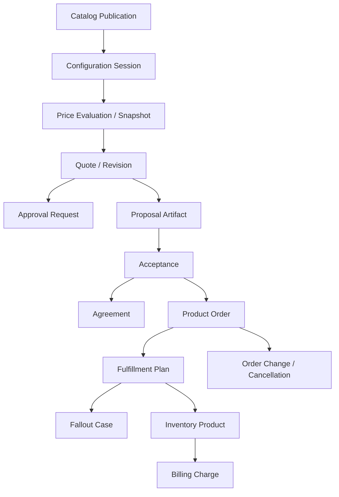
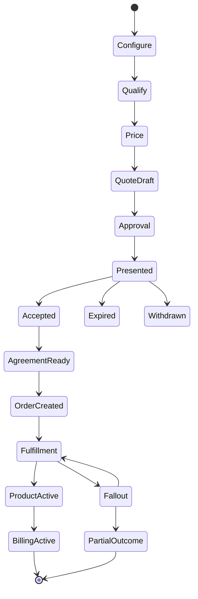
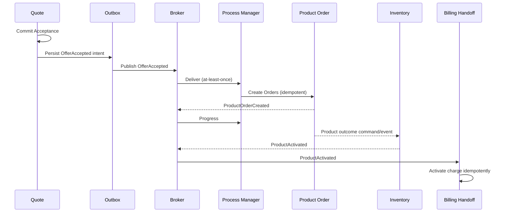
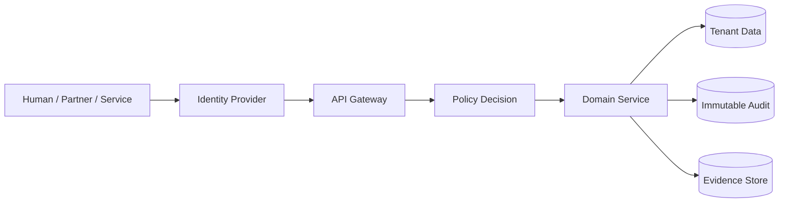
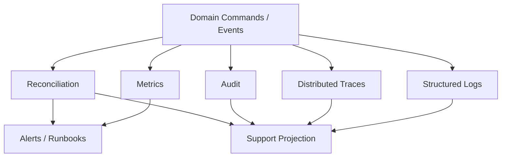

# Part 050 — End-to-End CPQ and Quote-to-Order Architecture, Review Checklist, and Mastery Map

## Positioning

Part terakhir ini tidak mencoba membuat satu “arsitektur universal”.

Tujuannya adalah menyediakan reference model untuk:

- memeriksa architecture internal;
- menemukan broken invariants;
- mengidentifikasi ownership gaps;
- memahami lifecycle end-to-end;
- dan menyusun modernization roadmap.

Reference architecture harus diperlakukan sebagai alat berpikir, bukan klaim bahwa implementasi internal CSG identik.

> **Core thesis:** architecture yang sehat menjaga customer intent dari configuration sampai Product dan Billing melalui explicit bounded contexts, immutable evidence, stable identities, versioned decisions, governed state machines, idempotent distributed workflows, reconciliation, security, observability, and evolutionary delivery.

---

# 1. The End-to-End Business Question

Arsitektur harus mampu menjawab:

> Apa yang customer minta, apa yang ditawarkan dan diterima, apa yang diperintahkan untuk direalisasikan, apa yang benar-benar dibangun, apa yang ditagihkan, dan evidence apa yang membuktikannya?

---

# 2. The Seven Core Views

1. **As-Requested** — customer/seller intent.
2. **As-Configured** — valid product configuration.
3. **As-Priced** — monetary evaluation.
4. **As-Quoted / As-Accepted** — immutable commercial promise.
5. **As-Ordered / As-Planned** — executable target and realization plan.
6. **As-Built** — installed Product and technical realization.
7. **As-Billed** — actual financial charging/invoicing.

---

# 3. Reference Context Map

```mermaid
flowchart LR
    Party[Party / Customer / Account]
    Catalog[Product Catalog]
    Config[Product Configuration]
    Qual[Qualification]
    Pricing[Pricing]
    Quote[Quote]
    Approval[Approval]
    Proposal[Proposal / Presentation]
    Accept[Acceptance]
    Agreement[Agreement]
    Transform[Quote-to-Order Transformation]
    Order[Product Order]
    Plan[Fulfillment Planning]
    Orch[Orchestration]
    Service[Service / Resource Fulfillment]
    Inventory[Product Inventory]
    BillingHandoff[Billing Handoff]
    Billing[Billing / Invoice]
    Revenue[Revenue / Accounting]
    Audit[Audit / Evidence]
    Ops[Observability / Support]

    Party --> Config
    Catalog --> Config
    Party --> Qual
    Catalog --> Qual
    Config --> Pricing
    Qual --> Pricing
    Pricing --> Quote
    Config --> Quote
    Qual --> Quote
    Quote --> Approval
    Quote --> Proposal
    Approval --> Proposal
    Proposal --> Accept
    Accept --> Agreement
    Accept --> Transform
    Agreement --> Transform
    Transform --> Order
    Order --> Plan
    Plan --> Orch
    Orch --> Service
    Service --> Inventory
    Inventory --> BillingHandoff
    Agreement --> BillingHandoff
    Quote --> BillingHandoff
    BillingHandoff --> Billing
    Billing --> Revenue

    Quote -. evidence .-> Audit
    Approval -. evidence .-> Audit
    Accept -. evidence .-> Audit
    Order -. events .-> Ops
    Inventory -. reconciliation .-> Ops
    Billing -. reconciliation .-> Ops
```



---

# 4. Context Ownership Thesis

Each fact should have one semantic authority.

| Fact | Reference Authority |
|---|---|
| Offering definition | Product Catalog |
| Configuration validity | Configuration |
| Qualification result | Qualification |
| Offered price evaluation | Pricing |
| Quote revision/lifecycle | Quote |
| Approval decision | Approval |
| Published proposal artifact | Proposal |
| Acceptance evidence | Acceptance/Quote boundary |
| Contractual commitment | Agreement |
| Requested Product action | Product Order |
| Fulfillment design | Planning |
| Execution progression | Orchestration/domain fulfillment |
| Installed Product | Product Inventory |
| Billing Charge / Invoice | Billing |
| Revenue recognition | Revenue/Accounting |

---

# 5. Context Is Not Service Count

One bounded context may use:

- modular monolith;
- one service;
- multiple services/workers;
- database;
- cache;
- event topic;
- and projections.

The semantic boundary matters more than topology.

---

# 6. Reference Aggregate Map



---

# 7. Aggregate Boundary Rule

Ask:

> What must be immediately consistent after one command?

Use local ACID for that scope.

---

# 8. Cross-Aggregate Rule

Use:

- process manager;
- saga;
- reservation;
- events;
- idempotency;
- and reconciliation.

---

# 9. Core Identity Chain

```text
Catalog Publication
-> Product Offering / Specification
-> Configuration Session
-> Price Snapshot
-> Quote / Revision / Quote Item
-> Proposal / Offer
-> Acceptance
-> Agreement / Agreement Item
-> Product Order / Order Item
-> Fulfillment Plan / Unit / Attempt
-> Inventory Product
-> Billing Charge
-> Invoice Line
-> Revenue Element
```

---

# 10. Identity Design Principles

- stable;
- opaque;
- tenant-scoped;
- type-safe;
- non-recycled;
- and preserved across history.

---

# 11. Business Number versus Technical ID

Keep both where needed.

Do not use mutable display number as sole reference.

---

# 12. Version Dimensions

Different versions may coexist:

- aggregate version;
- business revision;
- schema version;
- catalog publication;
- rule version;
- workflow definition;
- mapping version;
- event contract;
- and deployment version.

---

# 13. Time Dimensions

Preserve:

- occurred time;
- effective time;
- recorded time;
- published time;
- requested time;
- committed time;
- and completion time.

---

# 14. End-to-End Lifecycle



---

# 15. Lifecycle Is Not One State

Quote, Approval, Proposal, Agreement, Order, Product, and Billing each have separate state machines.

---

# 16. Core State-Machine Principle

Transitions occur through explicit commands/events with:

- actor;
- guard;
- expected version;
- evidence;
- timestamp;
- and reason.

---

# 17. Core Commercial Flow

```text
Customer Intent
-> Valid Configuration
-> Qualification Evidence
-> Price Snapshot
-> Quote Revision
-> Approval Evidence
-> Published Proposal
-> Acceptance
-> Agreement
```

---

# 18. Core Execution Flow

```text
Acceptance
-> Transformation Manifest
-> Product Order(s)
-> Fulfillment Plan
-> Orchestration
-> Service/Resource Outcomes
-> Inventory Product
-> Billing Handoff
```

---

# 19. Catalog Reference Architecture

Catalog should support:

- Offering;
- Specification;
- characteristic definitions;
- relationships;
- prices;
- lifecycle;
- effective dating;
- publication;
- and compatibility.

---

# 20. Catalog Publication

Published version is immutable.

New changes create a new publication/version.

---

# 21. Catalog Pinning

Quote/configuration pins exact relevant publication versions.

---

# 22. Catalog Historical Reproducibility

Existing accepted Products must not be reinterpreted using current catalog only.

---

# 23. Configuration Reference Architecture

Configuration Session owns customer-specific candidate configuration.

---

# 24. Configuration Inputs

- Offering;
- customer/account;
- site;
- installed Product baseline;
- channel;
- market;
- quantity;
- and selected characteristics.

---

# 25. Configuration Outputs

- selected product tree/graph;
- normalized characteristics;
- constraints;
- warnings;
- unresolved choices;
- and completeness evidence.

---

# 26. Configuration Correctness

Hard constraints must be satisfied.

Warnings/waivers must be explicit.

---

# 27. Qualification Reference Architecture

Qualification evaluates:

- eligibility;
- availability;
- serviceability;
- capacity;
- policy;
- and evidence validity.

---

# 28. Qualification Freshness

A valid result has:

- evaluatedAt;
- validUntil;
- source;
- and input fingerprint/version.

---

# 29. Pricing Reference Architecture

Pricing is a deterministic evaluation pipeline.

---

# 30. Pricing Inputs

- configured items;
- quantity;
- customer context;
- market/channel;
- currency;
- effective date;
- catalog/price/rule versions;
- and qualification context.

---

# 31. Pricing Outputs

Immutable Price Snapshot containing:

- one-time;
- recurring;
- usage;
- discounts;
- adjustments;
- taxes/estimates;
- totals;
- rounding;
- and provenance.

---

# 32. Monetary Identity

Every accepted charge component gets stable identity.

---

# 33. Pricing Invariant

Billing must not silently reprice accepted commercial rates from current catalog.

---

# 34. Quote Reference Architecture

Quote aggregate/revision contains:

- parties/accounts;
- context;
- item hierarchy;
- configured snapshots/references;
- Price Snapshot;
- terms;
- dates;
- and lifecycle.

---

# 35. Revision Model

Working revisions are mutable under version control.

Finalized/presented/accepted revisions are immutable.

---

# 36. Quote Readiness

Separate readiness for:

- pricing;
- approval;
- presentation;
- acceptance;
- and ordering.

---

# 37. Approval Reference Architecture

Approval Request binds:

- exact Quote revision;
- exact exception/threshold;
- policy version;
- evidence;
- approver authority;
- and decision.

---

# 38. Reapproval

Material change invalidates or supersedes previous approval.

---

# 39. Proposal Reference Architecture

Proposal generation uses:

- immutable Quote revision;
- template version;
- clause versions;
- localization;
- branding;
- and document checksum.

---

# 40. Presentation Evidence

Record what was made available to customer and when.

---

# 41. Acceptance Reference Architecture

Acceptance binds:

- Proposal/Offer identity;
- Quote revision;
- exact artifact/checksum;
- accepting party/person;
- authority;
- channel;
- time;
- and evidence.

---

# 42. Acceptance Invariant

One Offer has at most one effective binding Acceptance.

---

# 43. Agreement Reference Architecture

Agreement converts accepted commercial commitment into governed contract lifecycle.

---

# 44. Agreement Items

Reference accepted scope, terms, effective periods, and amendments.

---

# 45. Quote-to-Order Transformation

Transformation is explicit, versioned, and traceable.

---

# 46. Transformation Inputs

- Acceptance;
- accepted Quote revision;
- Agreement context;
- grouping policy;
- mapping versions;
- and tenant/market configuration.

---

# 47. Transformation Outputs

- transformation manifest;
- Product Order groups;
- item mappings;
- charge references;
- and residual/non-orderable outcomes.

---

# 48. Transformation Invariant

Every accepted orderable Item produces exactly one classified outcome:

- mapped;
- grouped;
- deferred;
- non-orderable;
- or failed with reason.

---

# 49. Product Order Reference Architecture

Product Order owns requested Product action.

---

# 50. Product Order Actions

- ADD;
- MODIFY;
- DELETE;
- SUSPEND;
- RESUME;
- REPLACE;
- RENEW;
- and domain-specific governed actions.

---

# 51. Product Order Item

Contains:

- source accepted Item;
- action;
- existing Product reference;
- target Product snapshot;
- requested dates;
- dependencies;
- and monetary references.

---

# 52. Order Lifecycle

Separate header and item states.

Aggregate state should be derived by explicit policy.

---

# 53. Order Idempotency

Acceptance/group/business key prevents duplicate Product Orders.

---

# 54. Fulfillment Planning Reference Architecture

Planner decomposes Product intent into executable units.

---

# 55. Planning Outputs

- immutable Plan version;
- nodes;
- dependencies;
- milestones;
- capabilities;
- reservations;
- and expected Product outcomes.

---

# 56. Plan Versioning

Published Plan is immutable.

Replan creates new version and handover.

---

# 57. Orchestration Reference Architecture

Orchestrator manages:

- ready nodes;
- commands;
- attempts;
- timers;
- barriers;
- retries;
- cancellation;
- compensation;
- and checkpoints.

---

# 58. Orchestration Does Not Own Domain Truth

Participants validate and own local effects.

---

# 59. Attempt Identity

Every external effect attempt has:

- operation;
- attempt;
- idempotency;
- correlation;
- and outcome classification.

---

# 60. Ambiguous Outcome

Timeout/connection loss may mean UNKNOWN, not failed.

---

# 61. Reconciliation before Retry

Query by stable business key before repeating non-local effect.

---

# 62. Fallout Reference Architecture

Fallout Case owns:

- classification;
- severity;
- affected scope;
- evidence;
- owner;
- recovery plan;
- attempts;
- and closure.

---

# 63. Recovery Commands

Explicit domain commands replace status edits and SQL repair.

---

# 64. Compensation Model

Compensation is a forward remedial action.

It may leave residual effects.

---

# 65. Order Change Reference Architecture

In-flight change is first-class:

- Amendment;
- Supplement;
- Cancellation;
- Replacement;
- Correction;
- or new Product Order.

---

# 66. Change Assessment

Assess:

- completed;
- in-flight;
- pending;
- irreversible;
- and unknown work.

---

# 67. Plan Overlay

Approved change creates new Plan version rather than editing published graph.

---

# 68. Product Inventory Reference Architecture

Product Inventory owns installed customer-facing Product.

---

# 69. Product Views

Distinguish:

- as-quoted;
- as-ordered;
- as-designed;
- as-built;
- as-billed;
- as-observed;
- and as-contracted.

---

# 70. Inventory Product Invariant

One intended ADD generation creates at most one logical Product.

---

# 71. Modify Baseline

MODIFY references exact Product ID/version.

---

# 72. Inventory History

Preserve lifecycle and effective-dated changes.

---

# 73. Billing Handoff Reference Architecture

Billing Handoff translates accepted charge intent plus Product/Agreement trigger into Billing contract.

---

# 74. Billing Charge Identity

Trace from accepted Price Component to Billing Charge and Invoice Line.

---

# 75. Billing Activation Invariant

Same accepted charge generation creates at most one logical Billing Charge.

---

# 76. Billing Start/Stop Authority

Explicit policy, not message-processing time by default.

---

# 77. Revenue Boundary

Billing timing and revenue-recognition timing are distinct.

---

# 78. Event-Driven Reference Architecture



---

# 79. Event Principles

- facts, not requests;
- context-owned;
- immutable;
- versioned;
- tenant-scoped;
- and right-sized.

---

# 80. Outbox/Inbox

Outbox protects local state + event intent.

Inbox protects consumer deduplication + local effect.

---

# 81. Delivery Assumption

Design for at-least-once delivery and effectively-once business effects.

---

# 82. Ordering Scope

Usually aggregate/resource, not global.

---

# 83. Replay Safety

Projection replay must not recreate external side effects.

---

# 84. Consistency Reference Architecture

Use:

- local ACID;
- optimistic concurrency;
- unique constraints;
- reservations;
- sagas;
- idempotency;
- and reconciliation.

---

# 85. Strong Consistency Scope

Protect safety invariants within aggregate/context.

---

# 86. Eventual Consistency Scope

Allow bounded lag across contexts with explicit convergence owner.

---

# 87. Concurrency Guard

Expected version/ETag on mutable domain resources.

---

# 88. Reservation

Use for exclusive/limited intent such as Product modification or capacity.

---

# 89. Saga

Coordinates long-running multi-context business transaction.

---

# 90. Saga Partial Outcome

Must remain explicit and auditable.

---

# 91. Security Reference Architecture



---

# 92. Authorization Inputs

- subject;
- tenant;
- action;
- resource;
- resource state;
- authority limit;
- and context.

---

# 93. Field Security

Price, cost, margin, approval comments, PII, and supplier data can have different visibility.

---

# 94. Separation of Duties

Requester, approver, publisher, accepter, and support actor may need separation.

---

# 95. Evidence Architecture

Immutable:

- Quote revision;
- Price Snapshot;
- approval;
- Proposal artifact;
- Acceptance;
- Agreement;
- and audit manifest.

---

# 96. Traceability Architecture

Forward and backward links across all critical identities.

---

# 97. Multi-Tenancy Reference Architecture

Tenant isolation applies to:

- API;
- data;
- cache;
- search;
- event;
- object storage;
- logs;
- backup;
- and support.

---

# 98. Configuration Layers

```text
platform
-> edition
-> market
-> tenant
-> channel/business unit
-> transaction override
```

---

# 99. Configuration Versioning

Long-running transactions pin relevant configuration/rule/workflow/extension versions.

---

# 100. Extension Architecture

Controlled contracts for:

- rules;
- templates;
- custom fields;
- plugins;
- connectors;
- and workflow fragments.

---

# 101. Extension Safety

- sandbox;
- timeout;
- quota;
- version;
- compatibility;
- kill switch;
- and observability.

---

# 102. Observability Reference Architecture



---

# 103. Operational Question Model

Support should answer:

- current state;
- state age;
- expected next action;
- owner;
- dependency;
- attempts;
- reason;
- evidence;
- and safe recovery.

---

# 104. Reconciliation Coverage

Critical boundaries:

- Acceptance ↔ Product Order;
- Order Item ↔ Inventory Product;
- Product ↔ Billing Charge;
- Agreement ↔ Billing/Revenue;
- Plan ↔ actual Service/Resource;
- and authoritative state ↔ projections.

---

# 105. Performance Reference Architecture

Large workloads require:

- complexity classification;
- async operations;
- partitions;
- incremental calculation;
- versioned caches;
- bounded queues;
- checkpoints;
- and capacity limits.

---

# 106. Large-Deal Manifest

Binds:

- accepted revision;
- global pricing/approval;
- partitions;
- generated Orders;
- checkpoints;
- residuals;
- Products;
- and Billing outcomes.

---

# 107. Testing Reference Architecture

Verification layers:

- unit/value;
- aggregate/state;
- decision/golden;
- property/model;
- component;
- contract;
- replay;
- migration;
- performance/security;
- E2E/synthetic;
- production fitness.

---

# 108. Evolution Reference Architecture

Use:

- compatibility contracts;
- expand–migrate–contract;
- mixed-version rollout;
- canary/shadow;
- reconciliation;
- and explicit authority cutover.

---

# 109. Cloud/On-Prem Strategy

Cloud:

- frequent centralized release.

On-prem:

- longer support windows;
- version skew;
- customer environment;
- offline diagnostics;
- and extension compatibility.

---

# 110. The Ten Most Important Invariants

A reference shortlist:

1. One Offer has at most one effective binding Acceptance.
2. Acceptance binds an exact immutable Proposal/Quote revision.
3. Accepted commercial price components remain reproducible.
4. One accepted transformation group creates at most one logical Product Order.
5. Product Order actions reference exact source and target Product identities.
6. One Order ADD outcome creates at most one logical Inventory Product.
7. One accepted charge generation creates at most one logical Billing Charge.
8. Stale commands/events cannot regress newer state.
9. Every distributed unknown outcome is reconciled before conflicting retry.
10. Every critical outcome is traceable and tenant-authorized.

Internal prioritization may differ.

---

# 111. Invariant Evidence Table

| Invariant | Preventive Control | Detective Control | Recovery |
|---|---|---|---|
| One Acceptance | unique constraint + state guard | duplicate scan | preserve first, investigate |
| One Order/group | idempotency key | acceptance/order reconciliation | link existing/retry |
| One Product outcome | unique source generation | Order/Inventory reconciliation | link/correct |
| One Billing Charge | unique accepted charge key | Product/Billing reconciliation | reverse duplicate |
| No stale regression | version/fencing | ordering violation metric | replay/reconcile |

---

# 112. Invariant Register

Every invariant should include:

- statement;
- authority;
- scope;
- enforcement;
- test;
- telemetry;
- recovery;
- and owner.

---

# 113. Reference Invariant Template

```text
Invariant:
Business harm:
Authority:
Immediate/eventual:
Preventive controls:
Detective controls:
Evidence:
Recovery:
Owner:
```

---

# 114. Architecture Review Lens: Domain

Ask:

- Is ubiquitous language precise?
- Are models context-specific?
- Is authority singular?
- Are aggregates based on invariants?
- Are state machines explicit?
- Are historical versions reproducible?

---

# 115. Architecture Review Lens: Commercial Integrity

Ask:

- Can accepted scope/price/terms be reconstructed?
- Are approvals bound to exact revision?
- Is Acceptance non-repudiable enough for context?
- Does transformation preserve commercial intent?
- Can Billing trace back to accepted charge?

---

# 116. Architecture Review Lens: Distributed Correctness

Ask:

- What happens on timeout?
- What is idempotency key?
- What is ordering scope?
- Where is outbox/inbox?
- Which steps are compensatable?
- How is UNKNOWN reconciled?

---

# 117. Architecture Review Lens: Data

Ask:

- Which system owns each field?
- Are snapshots versus live references deliberate?
- Are effective times preserved?
- Are migrations idempotent?
- Is lineage complete?
- Are projections clearly non-authoritative?

---

# 118. Architecture Review Lens: Integration

Ask:

- Are APIs commands or generic CRUD?
- Are events facts?
- Are contracts versioned?
- Are TM Forum mappings semantic?
- Are extensions governed?
- Is consumer ownership known?

---

# 119. Architecture Review Lens: Security

Ask:

- Is tenant enforced everywhere?
- Is object/field authorization server-side?
- Are privileged actions explicit?
- Are sensitive artifacts protected?
- Are approvals/acceptance/evidence auditable?
- Is support access controlled?

---

# 120. Architecture Review Lens: Operations

Ask:

- Can support explain a stuck lifecycle?
- Are state age and next action visible?
- Are reason codes actionable?
- Are reconciliation jobs present?
- Are repair commands safe?
- Are alerts linked to runbooks?

---

# 121. Architecture Review Lens: Scale

Ask:

- What is realistic workload distribution?
- Are large Quotes partitioned?
- Is calculation incremental?
- Are caches semantically keyed?
- Are queues bounded/fair?
- Is downstream capacity included?

---

# 122. Architecture Review Lens: Evolution

Ask:

- Are mixed versions supported?
- Can workflows remain pinned?
- Are migrations rehearsed?
- Is rollback genuinely possible?
- Are cloud/on-prem differences explicit?
- Is legacy retirement planned?

---

# 123. Architecture Review Severity

Possible classification:

- CRITICAL;
- HIGH;
- MEDIUM;
- LOW;
- OBSERVATION.

---

# 124. Critical Finding

Safety, financial, security, or legal invariant can be violated.

---

# 125. High Finding

Likely customer impact or operational failure at scale.

---

# 126. Medium Finding

Meaningful reliability/maintainability risk.

---

# 127. Low Finding

Localized improvement.

---

# 128. Observation

Need evidence or future concern.

---

# 129. Finding Structure

```text
Finding
Evidence
Affected invariant
Scenario
Impact
Likelihood
Current controls
Recommendation
Owner
```

---

# 130. Broken Invariant Examples

- duplicate Acceptance;
- current Catalog mutates old Quote;
- retry creates duplicate supplier Order;
- Product active without lineage;
- Billing charge lacks accepted source;
- and support sets state manually.

---

# 131. Ownership Gap Examples

- Pricing and Quote both calculate total;
- workflow engine and Order both own state;
- no team owns DLQ;
- no owner for TM Forum mapping;
- and shared database table written by multiple services.

---

# 132. Contract Gap Examples

- event meaning undocumented;
- PATCH can force terminal state;
- idempotency absent;
- enum change ungoverned;
- and callback unauthenticated.

---

# 133. Operational Gap Examples

- no state-age alert;
- no reconciliation;
- no safe repair;
- no runbook;
- and no end-to-end correlation.

---

# 134. Security Gap Examples

- tenant filter by convention;
- margin exposed;
- support global admin;
- mutable audit;
- and public Proposal URL.

---

# 135. Performance Gap Examples

- full reprice on every edit;
- unbounded Order payload;
- one giant transaction;
- scan all rules;
- and replay shares live queue.

---

# 136. Architecture Decision Record

Use ADR for material choices.

---

# 137. ADR Template

```md
## Context

## Decision

## Invariants / Forces

## Alternatives

## Consequences

## Compatibility / Migration

## Operational Impact

## Owner / Review Date
```

---

# 138. Architecture Evidence

Do not rely only on diagrams.

Collect:

- code boundaries;
- schemas;
- state tables;
- contracts;
- topics;
- metrics;
- runbooks;
- incidents;
- and sample transactions.

---

# 139. Architecture Discovery Method

1. read key code paths;
2. trace one real Quote;
3. inspect DB/event/API contracts;
4. interview domain/operations;
5. review incidents;
6. compare stated versus actual authority.

---

# 140. Transaction Walkthrough

Select representative transaction and trace end to end.

---

# 141. Walkthrough Inputs

- simple new sale;
- complex multi-site;
- Product modify;
- cancellation;
- and fallout.

---

# 142. Walkthrough Evidence

Capture:

- IDs;
- versions;
- states;
- events;
- timings;
- and ownership.

---

# 143. Architecture Map Layers

1. business/value stream;
2. bounded contexts;
3. aggregates/state machines;
4. APIs/events/data;
5. runtime/deployment;
6. operations/security;
7. evolution.

---

# 144. Context Map Deliverable

Shows authority and relationship pattern.

---

# 145. Lifecycle Map Deliverable

Shows commands, states, and evidence.

---

# 146. Data Lineage Deliverable

Shows identity chain.

---

# 147. Consistency Map Deliverable

Shows local ACID, saga, reservation, and reconciliation.

---

# 148. Failure Map Deliverable

Shows timeout, unknown, retry, fallout, and recovery.

---

# 149. Operational Map Deliverable

Shows SLOs, alerts, runbooks, and support tools.

---

# 150. Deployment Map Deliverable

Shows cloud/on-prem versions, dependencies, and upgrade path.

---

# 151. Reference Review Checklist — Catalog

- Publications immutable?
- Effective dating valid?
- Offering/specification distinct?
- Relationships/cardinality explicit?
- Historical references preserved?
- Tenant/market variation governed?

---

# 152. Reference Review Checklist — Configuration

- Session identity/version?
- Hard/soft constraints?
- Explainability?
- Incremental invalidation?
- Installed baseline?
- Deterministic result?

---

# 153. Reference Review Checklist — Qualification

- Evidence/source?
- Freshness/validity?
- UNKNOWN/PENDING modeled?
- Item/site scope?
- Retry/fallback?
- Order-time revalidation?

---

# 154. Reference Review Checklist — Pricing

- Component identity?
- Currency/unit?
- Precedence?
- Rounding?
- Snapshot/provenance?
- Repricing/materiality?

---

# 155. Reference Review Checklist — Quote

- Aggregate/revisions?
- Immutable finalized state?
- Concurrency?
- Readiness?
- lifecycle guards?
- evidence?

---

# 156. Reference Review Checklist — Approval

- policy version?
- authority matrix?
- exact revision binding?
- separation of duties?
- conditional approval?
- expiry/reapproval?

---

# 157. Reference Review Checklist — Proposal/Acceptance

- template/artifact version?
- checksum?
- presentation evidence?
- accepter identity/authority?
- replay protection?
- expiry/withdrawal race?

---

# 158. Reference Review Checklist — Agreement

- effective periods?
- accepted lineage?
- amendments?
- obligations?
- renewal/termination?
- downstream references?

---

# 159. Reference Review Checklist — Transformation

- manifest/version?
- grouping deterministic?
- every accepted Item classified?
- charge mapping?
- residual scope?
- idempotency?

---

# 160. Reference Review Checklist — Product Order

- action semantics?
- existing/target Product?
- item hierarchy?
- state aggregation?
- idempotency?
- cancellation/change model?

---

# 161. Reference Review Checklist — Fulfillment

- immutable Plan versions?
- dependency DAG?
- attempts/timers?
- unknown outcomes?
- compensation?
- manual recovery?

---

# 162. Reference Review Checklist — Inventory

- stable Product identity?
- effective history?
- source Order lineage?
- MODIFY version guard?
- as-built variance?
- Billing reconciliation?

---

# 163. Reference Review Checklist — Billing

- accepted charge identity?
- account/currency?
- start/stop authority?
- discount duration?
- usage semantics?
- reconciliation/leakage?

---

# 164. Reference Review Checklist — Events/APIs

- owner?
- command versus fact?
- idempotency?
- ordering/version?
- compatibility?
- security?

---

# 165. Reference Review Checklist — Multi-Tenancy

- authenticated tenant context?
- DB/cache/search/event isolation?
- config version?
- extension sandbox?
- quota/fairness?
- residency/backup?

---

# 166. Reference Review Checklist — Security/Audit

- object/field authorization?
- immutable audit?
- evidence package?
- privileged access?
- retention/hold?
- traceability?

---

# 167. Reference Review Checklist — Operations

- state age?
- next action?
- reason taxonomy?
- business SLO?
- reconciliation?
- safe repair/runbook?

---

# 168. Reference Review Checklist — Performance

- workload model?
- size-class SLO?
- incremental calculation?
- cache key?
- bounded queue?
- large-deal checkpoint?

---

# 169. Reference Review Checklist — Evolution

- test pyramid?
- golden/property tests?
- contract/replay tests?
- migration rehearsal?
- mixed versions?
- cloud/on-prem upgrade?

---

# 170. Architecture Health Scorecard

Possible dimensions:

| Dimension | Score 1 | Score 3 | Score 5 |
|---|---|---|---|
| Domain authority | shared/unclear | mostly clear | singular and enforced |
| Lifecycle | status fields | partial state models | explicit guarded machines |
| Distributed correctness | blind retry | some idempotency | idempotency + reconciliation |
| Traceability | manual joins | partial lineage | end-to-end evidence |
| Operations | infra-only | business metrics | diagnostics + safe repair |
| Evolution | big bang | mixed practices | tested compatibility/migration |

---

# 171. Score Caution

Scores are conversation tools, not objective truth.

Evidence matters.

---

# 172. Modernization Principles

- preserve customer continuity;
- reduce dual authority;
- strengthen invariants first;
- create observability before migration;
- and deliver incremental vertical slices.

---

# 173. Modernization Priority Formula

Consider:

```text
priority =
business harm
× likelihood
× strategic value
÷ migration risk
```

Use judgment, not arithmetic blindly.

---

# 174. Modernization Categories

- safety/invariant;
- security/compliance;
- reliability/recovery;
- domain boundary;
- performance;
- and developer productivity.

---

# 175. First Modernization Move

Often:

- establish identity/correlation;
- map authority;
- add audit/reconciliation;
- and stop direct shared writes.

---

# 176. Avoid Rewrite First

A full rewrite before understanding behavior can reproduce or worsen hidden rules.

---

# 177. Characterization Tests

Capture current behavior before extraction.

---

# 178. Legacy Incident Review

Incidents reveal real architecture.

---

# 179. Data Quality Baseline

Measure before migration.

---

# 180. Strangler Boundary

Introduce stable API/event/ACL.

---

# 181. Vertical Slice Candidate

Choose bounded product/market/tenant flow.

---

# 182. Shadow Mode

Compare new behavior without authority.

---

# 183. Authority Cutover

One explicit switch.

---

# 184. Post-Cutover Reconciliation

Proves convergence.

---

# 185. Retirement

Remove old writes, reads, data, and operational procedures.

---

# 186. Modernization Roadmap Template

```md
## Current Pain / Evidence

## Affected Invariants

## Target Context / Authority

## Boundary / Contract

## Characterization / Golden Tests

## Migration Slice

## Shadow / Canary

## Cutover / Reconciliation

## Legacy Retirement

## Operational Readiness

## Owner / Milestones
```

---

# 187. Example Roadmap: Quote Pricing

Phase 1:

- map current rules;
- build golden cases;
- identify authoritative calculation.

Phase 2:

- create Price Snapshot contract;
- shadow new engine.

Phase 3:

- canary product families;
- bind Quote to snapshot.

Phase 4:

- remove duplicate recalculation paths.

---

# 188. Example Roadmap: Order Idempotency

Phase 1:

- identify duplicate scenarios;
- add business keys and metrics.

Phase 2:

- unique constraints/idempotency records.

Phase 3:

- reconcile existing duplicates.

Phase 4:

- standardize operation status API.

---

# 189. Example Roadmap: Product Inventory

Phase 1:

- define authority and identity;
- map Orders/Products.

Phase 2:

- add lineage and reconciliation.

Phase 3:

- migrate Product families.

Phase 4:

- remove shared writes/legacy source.

---

# 190. Example Roadmap: Supportability

Phase 1:

- business ID search;
- unified timeline;
- reason codes.

Phase 2:

- state-age alerts;
- reconciliation dashboards.

Phase 3:

- safe repair commands.

Phase 4:

- remove routine production SQL.

---

# 191. Example Roadmap: Event Architecture

Phase 1:

- event catalog/owners;
- outbox for critical facts.

Phase 2:

- idempotent inbox consumers.

Phase 3:

- schema governance/replay.

Phase 4:

- retire row-change/generic events.

---

# 192. Architecture Risk Register

Track:

- risk;
- scenario;
- impact;
- likelihood;
- controls;
- owner;
- and review date.

---

# 193. Risk Example: Duplicate Charge

Cause:

- timeout + blind retry.

Controls:

- accepted charge business key;
- unique constraint;
- operation lookup;
- reconciliation.

---

# 194. Risk Example: Stale Approval

Cause:

- Quote revision changed after decision.

Controls:

- exact revision/checksum binding;
- presentation guard;
- reapproval policy.

---

# 195. Risk Example: Tenant Leak

Cause:

- cache/search key missing tenant.

Controls:

- composite key;
- server-side auth;
- negative tests;
- incident detection.

---

# 196. Risk Example: Large Quote OOM

Cause:

- full graph materialization.

Controls:

- complexity preflight;
- partition/stream;
- admission;
- memory test.

---

# 197. Risk Example: On-Prem Upgrade Failure

Cause:

- incompatible custom connector.

Controls:

- compatibility manifest;
- precheck;
- certification;
- rehearsal.

---

# 198. Mastery Map Overview

Mastery has five dimensions:

1. Domain understanding.
2. Architecture and distributed correctness.
3. Delivery and code.
4. Operations and security.
5. Leadership and organizational influence.

---

# 199. Domain Mastery Levels

### Level 1 — Vocabulary

Can define entities and lifecycle terms.

### Level 2 — Flow

Can trace one use case.

### Level 3 — Invariants

Can identify rules and authority.

### Level 4 — Architecture

Can design boundaries and contracts.

### Level 5 — Evolution

Can modernize safely across products/teams.

---

# 200. Catalog Mastery

A senior/principal engineer can:

- distinguish Offering/Specification/Product;
- model effective dating;
- version publications;
- preserve history;
- and manage variation.

---

# 201. Configuration Mastery

Can:

- model constraints;
- incremental invalidation;
- explain failures;
- handle baseline changes;
- and control combinatorial complexity.

---

# 202. Pricing Mastery

Can:

- preserve components/provenance;
- define precedence;
- reason about currency/rounding/proration;
- test golden cases;
- and reconcile Billing.

---

# 203. Quote Mastery

Can:

- design aggregate/revisions;
- control concurrency;
- define readiness;
- preserve evidence;
- and manage collaboration.

---

# 204. Approval/Acceptance Mastery

Can:

- bind decisions to exact evidence;
- model authority;
- prevent stale/self approval;
- and defend customer acceptance.

---

# 205. Order Mastery

Can:

- model action semantics;
- transform accepted intent;
- decompose;
- orchestrate;
- and handle change/fallout.

---

# 206. Inventory/Billing Mastery

Can:

- preserve Product identity/history;
- reconcile as-built/as-billed;
- prevent duplicate/missing charges;
- and reason about effective dates.

---

# 207. Distributed Systems Mastery

Can:

- classify ambiguity;
- design idempotency;
- use outbox/inbox;
- manage ordering;
- design sagas;
- and reconcile.

---

# 208. API/Event Mastery

Can:

- design published languages;
- evolve schemas/semantics;
- map TM Forum concepts;
- govern extensions;
- and operate consumers.

---

# 209. Security Mastery

Can:

- enforce tenant/object/field access;
- design evidence/audit;
- control privileged recovery;
- and handle privacy/retention.

---

# 210. Operations Mastery

Can:

- define business SLOs;
- diagnose stuck lifecycle;
- create runbooks;
- design safe repair;
- and lead incidents.

---

# 211. Performance Mastery

Can:

- model workload;
- profile bottlenecks;
- preserve deterministic results;
- partition large deals;
- and capacity-plan recovery load.

---

# 212. Evolution Mastery

Can:

- build verification portfolios;
- migrate data;
- deploy mixed versions;
- support cloud/on-prem;
- and retire legacy paths.

---

# 213. Senior Engineer Behavior

- asks for invariants;
- checks authority;
- traces concrete transaction;
- considers failure;
- writes tests;
- improves operability;
- and communicates trade-offs.

---

# 214. Principal Engineer Behavior

- shapes boundaries;
- aligns multiple teams;
- creates standards/fitness functions;
- removes systemic risk;
- sequences modernization;
- and grows other engineers.

---

# 215. Architecture Leadership

Good architecture leadership:

- clarifies decisions;
- distributes ownership;
- documents evidence;
- and enables teams to move independently.

---

# 216. Avoid Architecture Theater

Diagrams without code/data/operations evidence are insufficient.

---

# 217. Design Review Facilitation

Ask precise questions and create shared language.

---

# 218. Incident Review Facilitation

Connect failure to missing invariant/control, not individual blame.

---

# 219. Trade-Off Communication

State:

- decision;
- benefits;
- costs;
- risks;
- assumptions;
- and reversal path.

---

# 220. Uncertainty Communication

Separate:

- known;
- assumed;
- inferred;
- and must verify.

---

# 221. Internal Verification Discipline

Never infer internal CSG implementation solely from generic standards.

---

# 222. Evidence Hierarchy

Prefer:

1. running behavior;
2. authoritative code/schema/contracts;
3. official internal docs/ADRs;
4. domain expert confirmation;
5. historical assumptions.

---

# 223. Conflicting Evidence

Document discrepancy and identify authority.

---

# 224. Onboarding Verification Backlog

Create questions grouped by:

- domain;
- architecture;
- operations;
- security;
- and delivery.

---

# 225. 90-Day Learning Plan Overview

The plan should combine:

- reading;
- code tracing;
- incident review;
- production observation;
- pair sessions;
- and small improvements.

---

# 226. Days 1–15 — Domain and People

Objectives:

- understand product area;
- map actors;
- learn vocabulary;
- identify domain experts;
- and trace one simple Quote.

---

# 227. Days 1–15 Deliverables

- glossary;
- actor map;
- initial context map;
- one transaction timeline;
- and question backlog.

---

# 228. Days 16–30 — Code and Contracts

Objectives:

- trace configuration/pricing/Quote code;
- inspect APIs/events/data;
- identify aggregates and authorities;
- and understand tests.

---

# 229. Days 16–30 Deliverables

- code-path map;
- API/event inventory;
- state-machine draft;
- data-owner matrix;
- and top ten unknowns.

---

# 230. Days 31–45 — Order and Fulfillment

Objectives:

- trace Acceptance-to-Order;
- inspect decomposition/orchestration;
- understand attempts/retries/fallout;
- and map Inventory/Billing handoff.

---

# 231. Days 31–45 Deliverables

- sequence diagram;
- idempotency map;
- failure-mode map;
- and reconciliation inventory.

---

# 232. Days 46–60 — Operations and Incidents

Objectives:

- join on-call/support sessions;
- inspect dashboards/runbooks;
- review incidents;
- and reproduce one failure safely.

---

# 233. Days 46–60 Deliverables

- operational question list;
- alert/runbook gaps;
- incident pattern summary;
- and one supportability improvement.

---

# 234. Days 61–75 — Architecture Assessment

Objectives:

- compare actual architecture with reference model;
- identify broken invariants/ownership gaps;
- validate with teams;
- and prioritize risks.

---

# 235. Days 61–75 Deliverables

- evidence-based findings;
- invariant register;
- ownership map;
- and modernization options.

---

# 236. Days 76–90 — Contribution

Objectives:

- deliver one bounded improvement;
- create tests/telemetry/runbook;
- present architecture learning;
- and propose next roadmap slice.

---

# 237. Days 76–90 Deliverables

- merged production-quality improvement;
- measured before/after;
- updated documentation;
- and next-quarter proposal.

---

# 238. 90-Day Plan Guardrail

Do not attempt full redesign before enough evidence.

---

# 239. First Contribution Candidates

Good early contributions:

- missing contract test;
- reason-code improvement;
- state-age metric;
- idempotency guard;
- reconciliation query;
- runbook repair;
- or architecture test.

---

# 240. Risky Early Contribution

Large domain rewrite without understanding hidden behavior.

---

# 241. Weekly Learning Loop

```text
Observe
-> Trace
-> Ask
-> Model
-> Verify
-> Improve
-> Document
```

---

# 242. Architecture Interview Questions

Ask domain experts:

- What customer problem does this context solve?
- Which decisions are hardest?
- Which states cause support pain?
- Which rules change most?
- Which data cannot be wrong?
- Which integration fails most?
- Which customization is hardest to upgrade?

---

# 243. Codebase Questions

- Where are commands handled?
- Where are invariants enforced?
- How are transactions scoped?
- Where are events created?
- How are retries/idempotency implemented?
- What can mutate state directly?
- How are versions represented?

---

# 244. Data Questions

- Which table/store is authoritative?
- Are histories/effective times kept?
- Which shared writes exist?
- How are tenant keys enforced?
- What orphan/mismatch reports exist?
- How are migrations performed?

---

# 245. Operations Questions

- What wakes on-call?
- Which issue needs SQL?
- What is hardest to diagnose?
- Which DLQ has no owner?
- What is largest backlog?
- How are unknown outcomes resolved?

---

# 246. Product Questions

- What customer variants exist?
- Which are productized?
- Which require forks?
- What large-deal limits are promised?
- What upgrade commitments exist?
- What standards/conformance are contractual?

---

# 247. Five Bottleneck Categories

1. Domain ambiguity.
2. Ownership/coordination.
3. Distributed correctness.
4. Operability.
5. Scale/evolution.

---

# 248. Domain Ambiguity Bottleneck

Symptoms:

- overloaded terms;
- duplicate calculation;
- and unclear source of truth.

---

# 249. Ownership Bottleneck

Symptoms:

- shared tables;
- many team approvals;
- orphan contracts;
- and incident ping-pong.

---

# 250. Distributed Correctness Bottleneck

Symptoms:

- duplicates;
- blind retries;
- unknown outcomes;
- and permanent mismatch.

---

# 251. Operability Bottleneck

Symptoms:

- no correlation;
- no reason;
- direct SQL;
- and no runbook.

---

# 252. Scale/Evolution Bottleneck

Symptoms:

- large Quote timeouts;
- forks;
- breaking upgrades;
- and unbounded queues.

---

# 253. Principal-Level Architecture Review Process

1. define scope and business outcomes;
2. collect evidence;
3. map contexts and identities;
4. enumerate invariants;
5. trace representative flows;
6. inject failure scenarios;
7. inspect operations/security;
8. assess scale/evolution;
9. prioritize findings;
10. propose incremental roadmap.

---

# 254. Architecture Review Scope

Define:

- products;
- tenants;
- deployment models;
- integrations;
- and lifecycle stages.

---

# 255. Evidence Collection

Use samples from:

- normal;
- large;
- changed;
- cancelled;
- and failed transactions.

---

# 256. Invariant Workshop

Bring domain, engineering, operations, and product.

---

# 257. Failure Scenario Workshop

Ask:

- what if timeout?
- duplicate?
- stale state?
- partial completion?
- provider rejects?
- and operator makes correction?

---

# 258. Scale Workshop

Use actual size distributions and dependency limits.

---

# 259. Evolution Workshop

Review next 12–24 months of product/customer changes.

---

# 260. Architecture Review Output

- context map;
- invariant register;
- risk register;
- findings;
- target principles;
- and sequenced roadmap.

---

# 261. Review Finding Example

```md
## Duplicate Billing Charge Risk

Evidence:
- activation retries use transport request ID;
- no unique accepted charge key;
- timeout incident created duplicates.

Invariant:
- one accepted charge generation creates one logical Billing Charge.

Recommendation:
- stable charge key, unique constraint, operation lookup, reconciliation.

Rollout:
- observe -> backfill keys -> enforce -> repair duplicates.
```

---

# 262. Modernization Roadmap Horizon

- 0–30 days: visibility and safety.
- 1–3 months: bounded correctness fixes.
- 3–6 months: context/contract extraction.
- 6–12 months: deeper data/workflow modernization.
- 12+ months: strategic platform evolution.

---

# 263. 0–30 Day Actions

Examples:

- ownership catalog;
- invariant register;
- duplicate/mismatch metrics;
- runbook;
- and direct-SQL inventory.

---

# 264. 1–3 Month Actions

Examples:

- idempotency keys;
- state guards;
- contract tests;
- outbox/inbox;
- and reconciliation.

---

# 265. 3–6 Month Actions

Examples:

- Price Snapshot boundary;
- Approval extraction;
- Product identity cleanup;
- and API/event versioning.

---

# 266. 6–12 Month Actions

Examples:

- Inventory authority migration;
- workflow versioning;
- tenant configuration platform;
- and large-deal partitioning.

---

# 267. Strategic Actions

Examples:

- standard-aligned partner APIs;
- unified evidence architecture;
- and productized extension ecosystem.

---

# 268. Roadmap Dependency

Do not extract context before stable identity and contracts.

---

# 269. Roadmap Capacity

Reserve delivery capacity for migration, support, and cleanup.

---

# 270. Success Metrics

Measure business and technical outcomes.

---

# 271. Domain Success Metrics

- fewer pricing discrepancies;
- fewer stale approvals;
- and improved Quote conversion.

---

# 272. Correctness Success Metrics

- duplicate rate;
- mismatch rate;
- unknown outcome age;
- and lineage completeness.

---

# 273. Operational Success Metrics

- MTTR;
- support SQL frequency;
- alert quality;
- and manual intervention rate.

---

# 274. Delivery Success Metrics

- deployment frequency;
- change failure;
- compatibility incidents;
- and upgrade duration.

---

# 275. Scale Success Metrics

- p95/p99 by complexity;
- supported max size;
- queue age;
- and recovery capacity.

---

# 276. Security Success Metrics

- cross-tenant incidents;
- privileged access review;
- audit completeness;
- and evidence reconstruction.

---

# 277. Architecture Outcome

Good architecture enables:

- correct decisions;
- independent change;
- safe failure;
- transparent operation;
- and sustainable evolution.

---

# 278. Architecture Trade-Offs

No design maximizes all of:

- consistency;
- availability;
- latency;
- simplicity;
- flexibility;
- and cost.

---

# 279. Explicit Trade-Off Register

Document high-impact compromises.

---

# 280. Example Trade-Off: Snapshot Size

Full Price Snapshot improves reproducibility but increases storage/event size.

Choose local immutable storage plus compact integration reference.

---

# 281. Example Trade-Off: Approval Context

Separate context improves ownership but adds distributed coordination.

Use immutable evidence and async projection.

---

# 282. Example Trade-Off: Large Quote Partitioning

Improves concurrency/scale but requires finalization manifest and cross-partition validation.

---

# 283. Example Trade-Off: Multi-Tenant Pooling

Efficient but requires strong isolation, fairness, and blast-radius controls.

---

# 284. Example Trade-Off: On-Prem Support

Customer control increases version skew and compatibility cost.

---

# 285. Architecture Principles Summary

1. One authority per fact.
2. Immutable accepted evidence.
3. Explicit state machines.
4. Stable identities and versions.
5. Local transactions, distributed sagas.
6. Idempotency and reconciliation.
7. Tenant/object/field security.
8. Business observability and safe repair.
9. Versioned variability and extensions.
10. Tested evolutionary delivery.

---

# 286. Anti-Pattern Summary

- giant canonical Product;
- current Catalog rewrites history;
- generic status mutation;
- distributed ACID by hope;
- blind retries;
- last-write-wins;
- audit as logs;
- support SQL as feature;
- customer forks;
- cache without semantic version;
- unbounded large-deal processing;
- and big-bang migration.

---

# 287. Internal Verification Checklist

### Reference comparison

- Bandingkan reference model dengan architecture internal tanpa menganggap salah satunya otomatis benar.
- Which contexts/aggregates actually exist?
- Which terms differ?
- Which responsibilities are combined or split?
- What evidence supports the map?

### Invariants

- Identifikasi lima invariants terpenting dan evidence operasionalnya.
- Where are they enforced?
- How are violations detected?
- What recovery exists?
- Who owns them?

### Ownership

- Which facts have dual or no authority?
- Which tables/topics/APIs have multiple or missing owners?
- Which teams own end-to-end lifecycle versus components?
- Where does incident ownership bounce?

### End-to-end trace

- Can one accepted Quote trace to Agreement, Orders, Products, and Billing?
- Are versions and effective times preserved?
- Can timeout/duplicate/partial scenarios be reconstructed?
- Are Proposal and Acceptance artifacts immutable?

### Distributed correctness

- What are business idempotency keys?
- Which outcomes can be UNKNOWN?
- Where are outbox/inbox used?
- Which sagas/reservations exist?
- What reconciliation covers eventual invariants?

### Security and evidence

- Is tenant/object/field authorization consistent?
- Are privileged actions case-scoped and audited?
- Can evidence package be generated?
- Are retention/legal-hold rules explicit?

### Operations

- Can support diagnose without direct database mutation?
- Are state age, reason, next action, and owner visible?
- Which known failures lack safe repair?
- Are alerts/runbooks tested?

### Scale and evolution

- Petakan tiga bottleneck domain/architecture terbesar.
- What are actual size/latency/capacity limits?
- Which migrations/upgrades are risky?
- What customer forks/version skews exist?
- Which modernization slice has best risk/value ratio?

### Onboarding

- Susun onboarding verification backlog dan 90-day learning plan.
- Which experts and code paths are essential?
- What first bounded contribution can reduce real risk?
- What assumptions remain unverified?

---

# 288. Practical Exercises

### Exercise 1 — Context Map

Build actual context map from code, data, APIs, events, and teams.

### Exercise 2 — Invariant Register

Document 25 critical invariants with controls, telemetry, and recovery.

### Exercise 3 — Transaction Trace

Trace one large accepted Quote through Product and Billing.

### Exercise 4 — Failure Review

Inject timeout, duplicate, stale version, partial completion, and tenant error.

### Exercise 5 — Architecture Findings

Write five evidence-based findings with incremental recommendations.

### Exercise 6 — 90-Day Plan

Create realistic learning and contribution plan for your CSG team.

---

# 289. Final Architecture Review Checklist

You can perform a credible principal-level review when you can:

- explain business value flow and actors;
- distinguish all major Product views;
- name authoritative contexts and owners;
- identify key aggregates and transaction boundaries;
- enumerate state machines and terminal states;
- trace accepted commercial evidence;
- explain pricing components and provenance;
- map Quote-to-Order transformation;
- explain fulfillment DAG, attempts, retries, and compensation;
- reason about Product Inventory and Billing reconciliation;
- identify idempotency and concurrency controls;
- inspect API/event compatibility;
- verify tenant/security/audit controls;
- diagnose operational lifecycle;
- assess large-deal capacity;
- and propose testable incremental evolution.

---

# 290. Mastery Self-Assessment

Rate each 1–5:

| Area | 1 | 3 | 5 |
|---|---|---|---|
| Domain language | definitions | trace flows | resolve semantic conflicts |
| Invariants | recognizes | documents/enforces | designs cross-context controls |
| Pricing | reads totals | explains components | evolves engine safely |
| Quote lifecycle | uses states | designs guards | handles revisions/concurrency |
| Order lifecycle | follows flow | models actions | designs orchestration/recovery |
| Distributed systems | retries | idempotency/saga | ambiguity/reconciliation at scale |
| Security | roles | object/field auth | evidence/defensibility architecture |
| Operations | logs | SLO/runbook | business diagnostics/safe repair |
| Scale | benchmarks | workload/capacity | large-deal architecture |
| Evolution | deploys | compatibility/migration | modernization strategy |

---

# 291. Mastery Evidence

Do not self-rate only from reading.

Evidence includes:

- architecture review;
- production incident;
- migration;
- domain test suite;
- performance improvement;
- safe recovery command;
- and cross-team design adoption.

---

# 292. Personal Mastery Backlog

For each weak area:

- question;
- artifact/code to inspect;
- expert to pair with;
- exercise;
- and production contribution.

---

# 293. Suggested Capstone Deliverables

1. Actual CSG context map.
2. Actual identity/lineage map.
3. Five critical invariant register.
4. Quote-to-Order sequence diagram.
5. Failure/recovery map.
6. Reconciliation coverage matrix.
7. Operational readiness assessment.
8. Large-deal capacity profile.
9. Evolution/modernization roadmap.
10. 90-day learning report.

---

# 294. Capstone Review Session

Present to:

- domain expert;
- senior/principal engineer;
- product;
- operations/support;
- and security/data representatives.

---

# 295. Review Goal

Validate understanding and surface contradictions.

Not to “prove” the reference model correct.

---

# 296. Questions to End Every Review

- What did we assume?
- What evidence is missing?
- Which invariant is most at risk?
- What failure is hardest to recover?
- What change is hardest to deploy?
- What one improvement reduces the most risk?

---

# 297. Final Part Completion Checklist

You are done if you can:

- construct an end-to-end CPQ/Quote-to-Order context map;
- distinguish commercial, execution, Product, and Billing truths;
- assign authority and ownership;
- identify key aggregates, identities, versions, and times;
- preserve accepted evidence;
- design transformation, orchestration, and recovery;
- reason about distributed consistency and idempotency;
- map security, audit, and tenant controls;
- define business observability and reconciliation;
- assess large-deal performance;
- design verification, migration, and upgrade strategies;
- perform evidence-based architecture review;
- propose incremental modernization;
- and maintain an honest internal verification backlog.

---

# 298. Final Key Takeaways

1. CPQ and Quote-to-Order is a network of bounded contexts, not one CRUD application.
2. Customer intent must remain traceable from configuration to Billing.
3. Accepted commercial evidence must be immutable and reproducible.
4. State transitions require explicit commands, guards, versions, and evidence.
5. Distributed workflows require idempotency, sagas, and reconciliation.
6. As-quoted, as-ordered, as-built, and as-billed are distinct truths.
7. Security, audit, observability, and recovery are domain capabilities.
8. Large enterprise deals require workload-aware partitioning and capacity controls.
9. Evolution requires compatibility, migration rehearsal, and mixed-version safety.
10. The strongest senior/principal engineer distinguishes generic reference practices from verified internal behavior.

---

# 299. Series Completion Outcome

After completing Parts 001–050, you should be able to:

- build a precise CPQ and Quote-to-Order ubiquitous language;
- map Catalog, Configuration, Qualification, Pricing, Quote, Approval, Agreement, Product Order, Fulfillment, Inventory, Billing, and Revenue boundaries;
- model state machines, invariants, and temporal behavior;
- preserve commercial promise through execution;
- design APIs/events with idempotency and compatibility;
- handle multi-tenancy and customer variation;
- diagnose and recover distributed failures;
- design for large enterprise deals;
- test, migrate, deploy, and evolve safely;
- and conduct principal-level architecture reviews without inventing internal CSG facts.

---

# 300. References

Conceptual baseline across the complete series:

- Domain-Driven Design: ubiquitous language, bounded contexts, context maps, aggregates, repositories, policies, domain events, process managers, and anti-corruption layers.
- Enterprise CPQ: Catalog, Product Configuration, Qualification, Pricing, Quote, Approval, Proposal, Acceptance, Agreement, and Quote-to-Order transformation.
- Telecom/enterprise fulfillment: Product Order, Service/Resource realization, orchestration, fallout, Product Inventory, Billing, and Quote-to-Cash.
- Distributed systems: local transactions, optimistic concurrency, idempotency, outbox/inbox, event delivery, sagas, reservations, retries, timeouts, ambiguity, and reconciliation.
- Enterprise architecture: multi-tenancy, extensions, security, audit, observability, performance, testing, migration, deployment, cloud/on-prem, and evolutionary modernization.
- TM Forum concepts and Open API vocabulary as reference language where semantically appropriate.

These references do not define internal CSG architecture, product boundaries, APIs, workflows, deployment topology, team ownership, or operational procedures. Those must be verified with actual code, contracts, documentation, telemetry, incidents, and domain experts.
