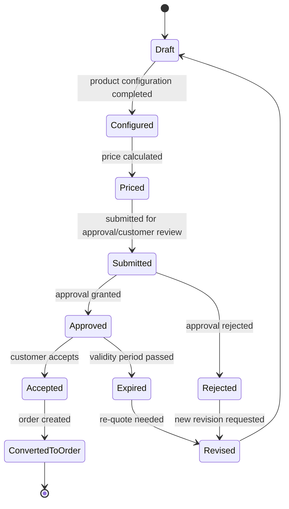
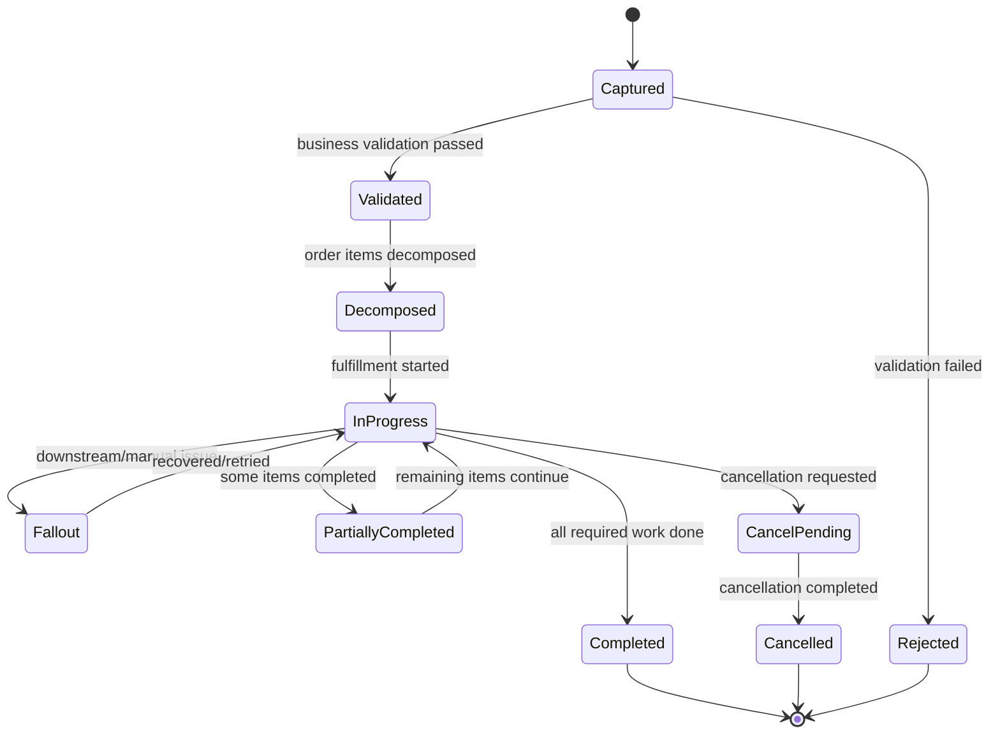
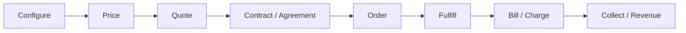
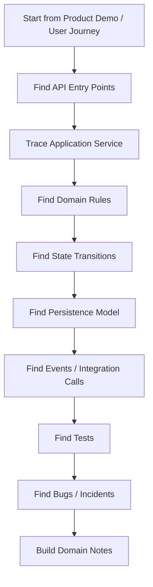

# Domain Foundation for CPQ, Quote Management, and Order Management

Part ini membangun fondasi awal untuk memahami **CSG Quote & Order** dari sisi domain. Fokusnya bukan teknologi implementasi, melainkan cara berpikir engineer terhadap lifecycle bisnis: apa yang dijual, bagaimana produk dikonfigurasi, bagaimana harga dihitung, bagaimana quote menjadi order, bagaimana order dipenuhi, dan bagaimana sistem menjaga agar janji komersial tetap konsisten sampai fulfillment dan billing.

Sebagai senior engineer, targetnya bukan sekadar tahu istilah. Targetnya adalah mampu melihat sistem CPQ/order management sebagai rangkaian **business state machines**, **business invariants**, **cross-system handoffs**, dan **failure recovery paths**.

---

## 1. Core Mental Model

CPQ/order management bukan sekadar “form sales” atau “checkout flow”. Dalam enterprise B2B dan telco, sistem ini adalah mekanisme untuk menjawab lima pertanyaan bisnis besar:

1. **Apa yang boleh dijual?**  
   Dijawab oleh product catalog, eligibility, compatibility, agreement, customer segment, geography, serviceability, dan commercial policy.

2. **Bagaimana produk itu dikonfigurasi?**  
   Dijawab oleh product offering, product specification, bundle, option, dependency, mandatory component, optional add-on, dan configuration rule.

3. **Berapa harga yang benar?**  
   Dijawab oleh price list, recurring charge, one-time charge, usage charge, discount, promotion, override, tax context, margin, contract terms, dan approval policy.

4. **Apa janji komersial yang diberikan ke customer?**  
   Dijawab oleh quote, quote line item, validity period, approval, version, accepted terms, contract/agreement, dan audit trail.

5. **Bagaimana janji itu diubah menjadi eksekusi operasional?**  
   Dijawab oleh order capture, order validation, decomposition, orchestration, fulfillment handoff, provisioning, inventory, billing activation, charging, fallout, dan reconciliation.

Mental model paling sederhana:

```mermaid
flowchart LR
  A[Customer Need] --> B[Product Discovery]
  B --> C[Configure]
  C --> D[Price]
  D --> E[Quote]
  E --> F[Approve]
  F --> G[Accept]
  G --> H[Order Capture]
  H --> I[Validate]
  I --> J[Decompose]
  J --> K[Fulfill]
  K --> L[Bill / Charge]
  L --> M[Lifecycle Change]
```

Yang membuat domain ini sulit adalah setiap panah di atas biasanya memiliki rule, state transition, exception path, audit requirement, dan integrasi lintas sistem.

---

## 2. What Is CPQ?

**CPQ** adalah singkatan dari **Configure, Price, Quote**.

Secara domain:

- **Configure** menentukan kombinasi produk, bundle, option, quantity, site, service location, dan dependency yang valid.
- **Price** menghitung harga berdasarkan catalog, price list, agreement, discount, promotion, tax context, cost/margin, dan commercial guardrail.
- **Quote** membungkus konfigurasi dan harga menjadi penawaran formal kepada customer, biasanya dengan validity period, approval status, version, dan audit trail.

CPQ ada karena enterprise sales jarang menjual satu produk sederhana. Yang dijual sering berupa kombinasi kompleks:

- multi-product,
- multi-site,
- multi-contract,
- multi-currency,
- multi-term,
- account-specific pricing,
- customer-specific agreement,
- channel/reseller-specific term,
- approval threshold,
- custom discount,
- technical feasibility dependency,
- fulfillment dependency.

Tanpa CPQ, proses sales akan mudah berubah menjadi spreadsheet, email approval manual, pricing inconsistency, dan order yang tidak bisa dipenuhi.

### CPQ as a Business Control System

CPQ bukan hanya alat bantu sales. CPQ adalah **business control system** yang menjaga agar apa yang dijual:

- valid menurut catalog,
- eligible untuk customer,
- profitable menurut commercial policy,
- approved jika melampaui threshold,
- traceable untuk audit,
- convertible menjadi order,
- tidak merusak downstream fulfillment dan billing.

### CPQ Invariant

Beberapa invariant penting dalam CPQ:

- Quote tidak boleh berisi konfigurasi produk yang invalid.
- Quote tidak boleh menggunakan harga yang sudah expired tanpa recalculation atau explicit approval.
- Discount override harus memiliki authorization/audit trail.
- Quote accepted harus mengacu ke version yang jelas dan tidak berubah diam-diam setelah customer menerima.
- Quote-to-order conversion harus membawa konfigurasi dan harga yang sama atau memiliki alasan bisnis eksplisit jika terjadi transformasi.

---

## 3. What Is Quote Management?

**Quote management** adalah domain yang mengelola lifecycle quote dari draft sampai accepted, rejected, expired, revised, atau converted to order.

Quote bukan sekadar PDF atau ringkasan harga. Quote adalah **business commitment candidate**. Artinya, quote adalah calon janji komersial yang dapat berubah menjadi kontrak/order.

### Quote Usually Contains

- customer/account reference,
- sales/opportunity context,
- quote line items,
- configured products,
- price details,
- discounts/promotions,
- contract term,
- validity period,
- approval status,
- version/revision,
- attachments atau proposal output,
- audit trail,
- acceptance information.

### Quote Lifecycle Example

State di atas hanya contoh domain. State aktual harus dicek di internal system. Jangan mengasumsikan bahwa setiap implementasi memiliki state yang sama.

### Quote Management Invariant

- Quote line harus mengacu ke catalog item/version yang valid.
- Quote price harus traceable: dari price list, discount, override, agreement, atau manual adjustment.
- Quote accepted harus immutable atau setidaknya memiliki revision mechanism eksplisit.
- Expired quote tidak boleh langsung converted ke order tanpa rule tertentu.
- Revised quote harus menjaga relationship ke quote sebelumnya.
- Quote approval decision harus bisa diaudit.

---

## 4. What Is Order Management?

**Order management** adalah domain yang mengubah janji komersial menjadi pekerjaan operasional yang dapat dieksekusi.

Order adalah instruksi bisnis untuk melakukan action terhadap produk/service customer. Dalam telco, order bisa berupa:

- add new product,
- modify existing product,
- disconnect,
- suspend,
- resume,
- move,
- change plan,
- upgrade bandwidth,
- add site,
- remove component,
- renew contract,
- amend in-flight order,
- cancel order.

Order management sulit karena order tidak selalu bisa dieksekusi secara atomik. Satu customer order bisa terpecah menjadi banyak pekerjaan downstream:

- service order,
- resource allocation,
- provisioning task,
- billing activation,
- inventory update,
- field work,
- partner task,
- manual review,
- fallout handling.

### Order Lifecycle Example

State aktual harus diverifikasi di internal CSG/team. Banyak sistem enterprise memiliki state yang lebih granular.

### Order Management Invariant

- Order harus mengacu ke customer/account/product context yang valid.
- Order item action harus legal terhadap current product inventory.
- Order tidak boleh menjalankan fulfillment jika validation gagal.
- Decomposition harus konsisten dengan product/service/resource model.
- Completion tidak boleh terjadi sebelum mandatory downstream task selesai.
- Cancellation/amendment harus memperhatikan state dan side effect yang sudah terjadi.
- Duplicate order harus dicegah atau diproses idempotently.

---

## 5. What Is Quote-to-Cash?

**Quote-to-cash** adalah lifecycle bisnis dari saat penawaran dibuat sampai revenue dapat ditagihkan, diakui, atau dimonetisasi.

Dalam bentuk sederhana:

Quote-to-cash menghubungkan beberapa domain:

- sales,
- product catalog,
- pricing,
- approval,
- contract/agreement,
- order management,
- fulfillment,
- billing,
- charging,
- revenue recognition,
- customer lifecycle.

Bagi engineer, quote-to-cash penting karena bug kecil di awal lifecycle bisa muncul sebagai kerugian besar di akhir lifecycle:

- salah konfigurasi → order tidak bisa dipenuhi,
- salah harga → revenue leakage,
- approval terlewat → commercial policy breach,
- catalog version mismatch → fulfillment rejection,
- duplicate order → double provisioning atau double billing,
- expired quote converted → dispute dengan customer,
- order completed tanpa billing activation → lost revenue,
- billing activated sebelum fulfillment → customer dispute.

---

## 6. Simple Ecommerce Checkout vs Enterprise CPQ

Kesalahan framing yang umum: menganggap CPQ/order management seperti ecommerce checkout.

| Area | Simple Ecommerce Checkout | Enterprise CPQ / Telco B2B |
|---|---|---|
| Product | SKU relatif sederhana | Product offering, bundle, option, service/resource mapping |
| Customer | Individual buyer | Organization, account hierarchy, billing account, service account, partner/channel |
| Pricing | Listed price, coupon | Price list, contract pricing, discount, margin, approval, promotion, override |
| Configuration | Size/color/quantity | Complex compatibility, dependency, eligibility, technical feasibility |
| Approval | Jarang | Sering: discount threshold, margin, legal, finance, sales management |
| Order | One shipment/transaction | Multi-item, multi-site, multi-stage, multi-system orchestration |
| Fulfillment | Warehouse/logistics | Service ordering, provisioning, inventory, billing activation, partner system |
| Error | Payment/shipping failure | Catalog mismatch, fallout, partial fulfillment, amendment conflict, billing mismatch |
| Change | Return/refund | Amend, cancel, suspend, resume, disconnect, renew, migrate |
| Audit | Basic transaction history | Full commercial audit, approval audit, contract traceability, regulatory/customer dispute evidence |

Enterprise CPQ bukan checkout yang lebih besar. Ia adalah domain yang menggabungkan sales, product modeling, pricing governance, contract enforcement, operational fulfillment, dan revenue lifecycle.

---

## 7. Commercial Complexity vs Technical Complexity

Engineer sering melihat kompleksitas dari sisi teknis: latency, scalability, persistence, concurrency, messaging, deployment. Dalam CPQ/order management, banyak kompleksitas berasal dari domain.

### Commercial Complexity

Commercial complexity muncul ketika bisnis membutuhkan rule seperti:

- customer A punya harga khusus,
- enterprise agreement berlaku hanya untuk product family tertentu,
- diskon 25% butuh approval regional director,
- bundle X hanya valid jika customer punya existing product Y,
- promo berlaku sampai tanggal tertentu,
- harga recurring berbeda dari one-time charge,
- minimum margin harus dijaga,
- contract term 36 bulan memberi discount berbeda dari 12 bulan,
- reseller punya price book berbeda,
- multi-site quote memiliki pricing aggregation.

### Technical Complexity

Technical complexity muncul dari kebutuhan sistem untuk menjalankan domain tersebut:

- state transition yang aman,
- concurrency control,
- event consistency,
- API compatibility,
- persistence model,
- integration reliability,
- observability,
- retry/reconciliation,
- data migration,
- performance pada konfigurasi/pricing besar.

### Senior Engineer Lens

Senior engineer harus menghubungkan keduanya:

> Domain rule yang ambigu akan menjadi technical complexity yang tidak terkendali.

Contoh:

- “Quote bisa direvisi” terdengar sederhana. Tetapi engineer harus bertanya:
  - Apakah revision membuat version baru?
  - Apakah approval lama tetap valid?
  - Apakah harga direcalculate?
  - Apakah quote accepted masih bisa direvisi?
  - Apakah order yang sudah dibuat ikut berubah?
  - Bagaimana audit trail-nya?

---

## 8. Domain Glossary for Engineers

Glossary ini adalah starting point. Definisi aktual harus diverifikasi terhadap internal glossary dan model CSG/team.

| Term | Working Definition | Engineer Concern |
|---|---|---|
| CPQ | Configure, Price, Quote | Rule correctness, pricing traceability, quote lifecycle |
| Product Catalog | Sumber definisi product offering dan rule komersial | Versioning, compatibility, eligibility, stale reference |
| Product Offering | Sesuatu yang dijual ke customer | Offering lifecycle, availability, price association |
| Product Specification | Definisi produk lebih mendasar/teknis-komersial | Reuse, mapping ke service/resource |
| Bundle | Kombinasi offering/component | Mandatory/optional item, dependency, decomposition |
| Eligibility | Rule apakah customer/context boleh membeli product | Customer/account/geo/channel/contract dependency |
| Compatibility | Rule kombinasi product/option yang valid | Invalid configuration, conflict detection |
| Quote | Penawaran formal/candidate commitment | Versioning, approval, validity, immutability |
| Quote Line Item | Item dalam quote | Mapping ke product/order item, pricing detail |
| Price List | Daftar harga dasar | Effective date, currency, segment, version |
| Discount | Pengurang harga | Approval, audit, stacking, conflict |
| Margin | Selisih revenue dan cost/profitability measure | Guardrail, approval, profitability |
| Approval | Keputusan otorisasi bisnis | Workflow, delegation, audit, re-approval trigger |
| Agreement | Kontrak/term komersial dengan customer | Eligibility, pricing, renewal, legal compliance |
| Order | Instruksi eksekusi bisnis | State, decomposition, fulfillment, cancellation |
| Order Item | Unit tindakan dalam order | Dependency, action, item-level status |
| Fallout | Kegagalan fulfillment/integration yang butuh recovery | Retry, manual intervention, ownership |
| Product Inventory | Produk yang dimiliki customer | Modify/disconnect validation, current state |
| Service Order | Instruksi operasional untuk service layer | Decomposition, provisioning dependency |
| Billing Activation | Aktivasi penagihan | Revenue leakage, billing dispute |
| Reconciliation | Proses membandingkan dan memperbaiki mismatch | Missing event, stuck order, downstream divergence |

---

## 9. Lifecycle Thinking

Cara membaca domain ini harus lifecycle-oriented.

Jangan hanya bertanya:

> Field apa yang harus ditambahkan?

Tanya juga:

- Field ini valid di state apa?
- Siapa yang boleh mengubahnya?
- Apakah perubahan butuh approval ulang?
- Apakah perubahan berdampak pada pricing?
- Apakah quote/order yang sudah submitted boleh berubah?
- Apakah perubahan harus menghasilkan event?
- Apakah perubahan harus masuk audit trail?
- Bagaimana jika perubahan terjadi bersamaan dengan accept/cancel/amend?
- Bagaimana migration untuk data lama?
- Bagaimana downstream system membaca field ini?

### Lifecycle Questions by Object

| Object | Lifecycle Questions |
|---|---|
| Product Offering | Kapan effective? Kapan expired? Apakah existing quote masih valid setelah offering berubah? |
| Price | Kapan dihitung? Kapan dibekukan? Kapan harus recalculated? |
| Quote | Kapan editable? Kapan immutable? Kapan expired? Kapan converted? |
| Approval | Kapan dibutuhkan? Kapan invalidated? Siapa approver? |
| Agreement | Kapan berlaku? Product/customer mana yang tercakup? |
| Order | Kapan validated? Kapan decomposed? Kapan cancellable? Kapan completed? |
| Order Item | Apakah status item bisa berbeda dari status order? Apa dependency antar item? |
| Fulfillment Task | Siapa owner? Retryable atau manual? Apa terminal state? |

---

## 10. Business Invariants

Invariant adalah kondisi yang harus selalu benar agar sistem tetap valid secara domain.

Dalam CPQ/order management, invariant lebih penting daripada sekadar validation rule di UI. UI bisa berubah, integration bisa bypass UI, batch job bisa menulis data, migration bisa mengubah data, dan external system bisa mengirim callback yang tidak sempurna.

### Examples of Business Invariants

#### Catalog Invariants

- Quote/order item harus mengacu ke catalog item yang valid atau snapshot yang dapat diaudit.
- Product option wajib tidak boleh hilang dari configured product.
- Incompatible product combination tidak boleh masuk quote accepted.

#### Pricing Invariants

- Harga final harus traceable ke source: price list, discount, agreement, override, atau manual adjustment.
- Discount yang melewati threshold harus memiliki approval.
- Quote accepted tidak boleh silently berubah harga.

#### Quote Invariants

- Quote expired tidak boleh accepted tanpa revalidation atau exception rule.
- Quote accepted harus memiliki version yang jelas.
- Quote revision harus menjaga lineage.

#### Order Invariants

- Order tidak boleh fulfill sebelum validation passed.
- Order item action harus legal terhadap current product inventory.
- Completed order harus memiliki mandatory downstream completion evidence.

#### Audit Invariants

- Approval decision harus traceable.
- Manual override harus traceable.
- State transition penting harus traceable.

---

## 11. Edge Cases That Matter Early

Edge case dalam domain ini bukan “nice to have”. Banyak edge case adalah real production scenarios.

### Quote Edge Cases

- Quote expired tepat saat customer accept.
- Quote revised setelah approval diberikan.
- Quote accepted dua kali karena retry/double click/integration retry.
- Quote line mengacu ke product offering yang sudah retired.
- Quote price berbeda setelah recalculation.
- Multi-site quote hanya sebagian site yang valid.
- Customer-specific agreement berubah saat quote masih draft.

### Pricing Edge Cases

- Discount stacking menghasilkan margin negatif.
- Promotion expired saat quote submitted.
- Manual override tidak memiliki approval.
- Currency mismatch antar line item.
- Price list version berubah saat quote direprice.

### Order Edge Cases

- Order dibuat dari quote yang sudah expired.
- Duplicate order dari retry integration.
- Order item A completed, item B failed.
- Cancellation requested ketika fulfillment sudah sebagian berjalan.
- Amendment masuk ketika order masih in-flight.
- Downstream system reject karena serviceability berubah.
- Billing activation sukses, provisioning gagal.

### Catalog Edge Cases

- Bundle definition berubah setelah quote dibuat.
- Optional component menjadi mandatory di catalog version baru.
- Product compatibility rule berubah.
- Existing customer product tidak lagi sellable tapi masih active.

---

## 12. Failure Modes

Failure mode adalah cara sistem bisa gagal secara bisnis, meskipun secara teknis request berhasil.

| Failure Mode | Example | Why It Matters |
|---|---|---|
| Invalid Configuration | Quote accepted dengan bundle tidak lengkap | Order tidak bisa fulfilled |
| Ineligible Product | Customer membeli product yang tidak allowed | Contract/compliance issue |
| Price Mismatch | Quote price berbeda dari billing price | Revenue leakage/dispute |
| Approval Bypass | Discount besar tanpa approval | Commercial policy breach |
| Catalog Mismatch | Quote memakai catalog lama yang downstream tidak kenal | Fulfillment rejection |
| Duplicate Order | Retry membuat dua order | Double provisioning/billing |
| Partial Fulfillment | Sebagian item completed, sebagian failed | Customer impact, operational complexity |
| Stuck Order | Order tidak terminal dan tidak terlihat | SLA breach, revenue delay |
| Cancellation Race | Cancel masuk saat provisioning completed | Data inconsistency |
| Amendment Conflict | Change order bertabrakan dengan in-flight order | Wrong customer/product state |
| Billing Mismatch | Billing tidak sesuai fulfilled product | Revenue loss/customer dispute |

---

## 13. How Engineers Detect Domain Problems

Senior engineer harus bisa mendeteksi domain risk dari berbagai artefact.

### From User Story

Red flags:

- Acceptance criteria hanya UI-level.
- Tidak ada state/lifecycle context.
- Tidak menjelaskan quote/order status yang terdampak.
- Tidak menyebut approval/repricing/audit.
- Tidak menyebut integration impact.
- Tidak menyebut failure path.

### From API Contract

Red flags:

- Endpoint mengubah object tanpa state guard.
- Field penting optional tanpa domain reason.
- Tidak ada version/idempotency key untuk operation yang retryable.
- Response tidak membedakan validation error, conflict, expired object, dan downstream failure.
- API menerima price final tanpa traceability.

### From Database Schema

Red flags:

- Status disimpan sebagai string bebas tanpa transition control.
- Tidak ada version/revision lineage.
- Tidak ada audit trail untuk approval/override.
- Quote line tidak punya catalog reference atau snapshot.
- Order item tidak punya action/status/dependency yang jelas.

### From Event Contract

Red flags:

- Event name ambigu: `OrderUpdated` untuk semua perubahan.
- Payload tidak cukup untuk memahami business fact.
- Tidak ada event version.
- Tidak ada correlation/business key.
- Event tidak replay-safe.

### From Production Operations

Red flags:

- Banyak order stuck tanpa owner.
- Fallout manual tidak dikategorikan.
- Retry menghasilkan duplicate effect.
- Dashboard hanya technical health, bukan business lifecycle health.
- Tidak ada reconciliation antara order, inventory, fulfillment, dan billing.

---

## 14. Impact on API, Event, Database, Workflow, Testing, and Operations

### API Impact

Domain lifecycle harus terlihat dalam API design:

- operation name harus mencerminkan business intent,
- transition harus guarded,
- error response harus domain-specific,
- idempotency perlu untuk command yang bisa di-retry,
- version/concurrency control penting untuk quote/order update,
- accepted/approved/converted object harus punya immutability policy.

### Event Impact

Event harus merepresentasikan fakta bisnis:

- `QuoteSubmitted`,
- `QuoteApproved`,
- `QuoteAccepted`,
- `OrderCaptured`,
- `OrderValidated`,
- `OrderDecomposed`,
- `OrderFalloutRaised`,
- `OrderCompleted`.

Event generic seperti `EntityUpdated` biasanya lemah sebagai business contract karena consumer tidak tahu apa yang sebenarnya berubah.

### Database Impact

Persistence harus mendukung:

- lifecycle state,
- version/revision,
- audit trail,
- relationship lineage,
- catalog snapshot/reference,
- price traceability,
- approval traceability,
- order item dependency,
- recovery/reconciliation.

### Workflow Impact

Workflow harus menjawab:

- siapa owner state ini,
- apa next valid transition,
- apa guard condition,
- apa side effect,
- apa timeout/retry policy,
- kapan manual intervention,
- kapan terminal,
- bagaimana compensation.

### Testing Impact

Testing domain harus mencakup:

- lifecycle transition tests,
- invalid transition tests,
- quote revision tests,
- pricing recalculation tests,
- approval threshold tests,
- quote-to-order conversion tests,
- duplicate command tests,
- partial fulfillment tests,
- cancellation/amendment race tests,
- event compatibility tests.

### Operations Impact

Operations harus punya visibility terhadap business health:

- quotes waiting approval,
- expired quotes,
- orders stuck by state,
- fallout by category,
- fulfillment delay,
- downstream rejection rate,
- duplicate order prevention,
- billing activation mismatch,
- reconciliation backlog.

---

## 15. How to Learn the Domain from Codebase

Jangan mulai dari controller saja. Controller menunjukkan entry point, tetapi domain behavior sering tersebar di service, workflow, rule engine, mapper, database constraint, event publisher, job, dan integration adapter.

### Codebase Reading Path

### What to Search

Search terms:

- `Quote`, `QuoteItem`, `QuoteLine`, `QuoteVersion`, `QuoteStatus`
- `ProductOrder`, `OrderItem`, `OrderStatus`, `OrderAction`
- `ProductOffering`, `ProductSpecification`, `Catalog`, `Bundle`
- `Price`, `Charge`, `Discount`, `Promotion`, `Override`, `Margin`
- `Approval`, `Approver`, `Threshold`, `Delegation`
- `Agreement`, `Contract`, `Account`, `Party`, `Customer`
- `Eligibility`, `Compatibility`, `Validation`
- `Fallout`, `Retry`, `Reconcile`, `Cancel`, `Amend`

### What to Document

For each domain object, write:

- definition,
- owner bounded context,
- lifecycle states,
- valid transitions,
- invariants,
- external references,
- events emitted,
- downstream dependencies,
- important tables/collections,
- important tests,
- known failure modes,
- open questions.

---

## 16. Requirement and PR Review Lens

Saat membaca requirement atau PR, gunakan checklist ini.

### Business Concept

- Konsep bisnis apa yang sedang diubah?
- Kenapa konsep ini ada?
- Masalah nyata apa yang ingin diselesaikan?
- Apakah istilah yang dipakai konsisten dengan glossary internal?

### Lifecycle

- Object dalam state apa saat perubahan terjadi?
- Transition apa yang ditambahkan/diubah?
- Apakah ada state yang seharusnya terminal?
- Apakah ada retry/manual intervention/compensation?

### Invariant

- Invariant apa yang harus tetap benar?
- Apakah invariant dijaga di UI saja atau di backend/domain layer juga?
- Apakah migration/data lama bisa melanggar invariant?

### Edge Case

- Apa yang terjadi jika quote expired?
- Apa yang terjadi jika harga berubah?
- Apa yang terjadi jika approval sudah diberikan lalu quote berubah?
- Apa yang terjadi jika order sebagian fulfilled?
- Apa yang terjadi jika request dikirim dua kali?

### Integration

- API contract berubah?
- Event contract berubah?
- Downstream system terdampak?
- Consumer lama masih compatible?
- Reconciliation perlu diubah?

### Operations

- Bagaimana mendeteksi failure?
- Log/metric/event apa yang harus ada?
- Apakah support team bisa memahami error?
- Apakah manual recovery path jelas?

---

## 17. Internal Verification Checklist

Gunakan checklist ini saat onboarding.

### Product and Domain

- Apakah ada official internal glossary?
- Apa happy path quote-to-order yang dianggap canonical?
- Apa customer scenario paling umum?
- Apa customer scenario paling kompleks?
- Apa top 10 domain terms yang sering muncul di backlog?

### Lifecycle

- Apa state quote yang valid?
- Apa state order yang valid?
- Apa state order item yang valid?
- Apa transition yang illegal?
- Apa terminal state?

### Catalog

- Apa perbedaan product offering, product specification, service specification, resource specification?
- Bagaimana catalog versioning bekerja?
- Apakah quote menyimpan snapshot catalog?
- Bagaimana catalog changes memengaruhi quote/order existing?

### Pricing and Approval

- Bagaimana price dihitung?
- Apa jenis charge yang didukung?
- Apa rule discount/promotion/override?
- Kapan approval dibutuhkan?
- Apakah approval invalidated oleh perubahan quote?

### Order and Fulfillment

- Bagaimana quote converted ke order?
- Bagaimana order didecompose?
- Apa downstream systems utama?
- Bagaimana fallout ditangani?
- Bagaimana cancel/amend in-flight order bekerja?

### Observability and Operations

- Dashboard domain apa yang ada?
- Apa indikator stuck order?
- Apa kategori fallout?
- Apa reconciliation process?
- Apa incident domain yang sering terjadi?

---

## 18. Practical Exercises

### Exercise 1: Build a Domain Map

Ambil satu user journey dari demo atau backlog. Buat peta:

- customer/account,
- product offering,
- configuration,
- price,
- quote,
- approval,
- order,
- fulfillment,
- billing handoff.

### Exercise 2: Build a State Transition Table

Untuk Quote:

| Current State | Action | Guard | Next State | Side Effect | Audit Required |
|---|---|---|---|---|---|
| Draft | Submit | configuration valid and priced | Submitted | approval requested | yes |
| Submitted | Approve | approver authorized | Approved | quote approved event | yes |
| Approved | Accept | not expired | Accepted | accepted event | yes |

Isi sesuai state internal yang sebenarnya.

### Exercise 3: Find One Failure Mode from Code

Pilih satu failure mode:

- duplicate order,
- expired quote,
- price mismatch,
- catalog mismatch,
- stuck fulfillment.

Cari di codebase:

- di mana dicegah,
- di mana dideteksi,
- di mana dilog,
- apakah ada metric,
- apakah ada test,
- bagaimana recovery.

---

## 19. Senior Engineer Takeaways

1. CPQ/order management adalah domain lifecycle-heavy, bukan CRUD-heavy.
2. Quote adalah candidate commercial commitment, bukan sekadar dokumen.
3. Order adalah executable business instruction, bukan sekadar record transaksi.
4. Product catalog adalah sumber rule, bukan hanya daftar produk.
5. Pricing correctness berdampak langsung ke revenue, margin, dispute, dan audit.
6. State transition harus dijaga secara eksplisit.
7. Event dan API adalah business contracts, bukan hanya integration payload.
8. Failure mode domain harus dimodelkan, bukan dianggap exception teknis biasa.
9. Senior engineer harus mampu menghubungkan requirement, model, lifecycle, invariant, test, dan operations.
10. Jangan mengasumsikan detail internal CSG tanpa verifikasi.

---

## 20. Quick Self-Assessment

Setelah membaca part ini, pastikan saya bisa menjawab:

- Apa bedanya CPQ, quote management, order management, dan quote-to-cash?
- Kenapa enterprise CPQ lebih kompleks daripada ecommerce checkout?
- Apa invariant dasar quote?
- Apa invariant dasar order?
- Apa risiko price mismatch?
- Apa risiko catalog mismatch?
- Kenapa quote accepted harus immutable atau versioned?
- Kenapa order cancellation/amendment sulit?
- Bagaimana mendeteksi domain risk dari user story?
- Apa yang harus saya cek di internal CSG sebelum menyimpulkan workflow sebenarnya?

