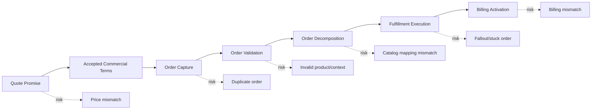
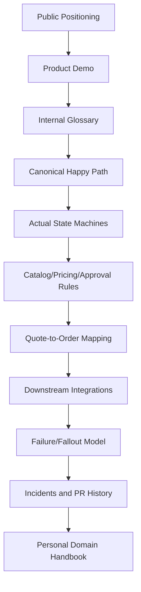

# CSG Quote & Order Context Without Internal Assumption

Part ini membangun konteks awal tentang **CSG Quote & Order** secara hati-hati. Tujuannya adalah memahami posisi produk dan domain yang mungkin relevan, tanpa mengarang detail internal architecture, data model, workflow, customer implementation, rule engine, deployment model, atau roadmap yang belum diverifikasi.

Dalam onboarding domain enterprise product, risiko terbesar bukan “tidak tahu”. Risiko terbesar adalah **merasa sudah tahu karena istilahnya familiar**, lalu membawa asumsi dari sistem lain ke sistem internal yang ternyata punya rule berbeda.

---

## 1. Context Boundary

Ada empat jenis informasi yang harus dibedakan sejak awal.

| Jenis Informasi | Contoh | Cara Memakai |
|---|---|---|
| Informasi publik tentang CSG Quote & Order | Product page, solution page, TM Forum directory, public whitepaper | Boleh dipakai sebagai orientasi awal, bukan sebagai kebenaran implementasi internal |
| Konsep industri umum | CPQ, quote-to-cash, order management, telco BSS/OSS, catalog-driven architecture | Dipakai untuk membangun mental model dan pertanyaan onboarding |
| Asumsi domain yang perlu diverifikasi | “Quote accepted immutable”, “single catalog”, “TMF-aligned API”, “cloud/on-prem behavior sama” | Ditandai sebagai hypothesis, lalu dicek di internal artefact |
| Fakta internal CSG/team | Actual workflow, codebase, customer customization, database schema, event catalog, incident pattern | Hanya boleh disimpulkan dari internal source yang valid |

Prinsipnya:

> Gunakan informasi publik dan konsep industri untuk bertanya lebih baik, bukan untuk menyimpulkan implementasi internal.

---

## 2. Publicly Known Positioning

Berdasarkan materi publik yang tersedia, CSG memosisikan Quote & Order sebagai platform CPQ dan order management untuk enterprise/telecom B2B. Product page CSG menyebut **CSG Quote & Order** sebagai CPQ dan order management platform yang membantu quote kompleks, tailored pricing, dan order management, dengan positioning kuat untuk B2B telecom dan complex enterprises.

CSG juga memosisikan quote-to-cash sebagai proses yang menghubungkan CPQ, order management, billing, dan revenue recognition, serta mencakup configure, price, quote, contract, order, orchestrate/automate, fulfill, dan bill.

TM Forum ODA Component Directory mendeskripsikan CSG Quote & Order sebagai telco-native platform dengan flow quote-to-order yang didukung oleh single catalog, dan menyebut layered catalog untuk merepresentasikan kompleksitas service compositions serta alignment quote-order-bill.

### Public Source Orientation

Sumber publik yang bisa digunakan sebagai orientasi awal:

- CSG product page: `https://www.csgi.com/products/quote-and-order`
- CSG quote-to-cash solution page: `https://www.csgi.com/solutions/quote-to-cash`
- CSG CPQ solution page: `https://www.csgi.com/solutions/quote-to-cash/configure-price-quote`
- CSG Quote & Order resource page: `https://www.csgi.com/resources/csg-quote-and-order`
- TM Forum ODA Component Directory: `https://www.tmforum.org/oda/directory/software-providers/directory/csg/products/csg-quote-and-order`

### What These Public Sources Suggest

Public positioning suggests several domain themes:

- CPQ and order management are tightly related.
- Quote-to-cash continuity matters.
- Catalog-driven approach is important.
- Telecom B2B complexity is a primary use case.
- Pricing, margin control, and quote accuracy are important business outcomes.
- Quote-to-order handoff is likely a key product capability.
- Product launch speed and reducing custom workflow brittleness are important business concerns.

### What These Public Sources Do Not Prove

Public sources do **not** prove:

- the actual internal microservice boundaries,
- actual database schema,
- actual event payloads,
- actual state machine,
- actual customer-specific customization model,
- actual deployment topology,
- actual pricing algorithm,
- actual approval workflow,
- actual TMF compliance depth,
- whether APIs are standard TMF, TMF-inspired, extended, or internally divergent,
- whether “single catalog” means one physical service, one logical source of truth, one commercial catalog, or one conceptual product model.

---

## 3. Why This Context Matters for a Senior Java Software Engineer

Sebagai senior engineer, peran saya bukan hanya menyelesaikan ticket. Saya perlu memahami bagaimana perubahan code memengaruhi:

- commercial correctness,
- customer promise,
- order fulfillment,
- billing accuracy,
- auditability,
- compatibility,
- customer-specific behavior,
- operational recovery,
- product configurability,
- release safety.

Dalam enterprise CPQ/order product, banyak bug berbahaya tidak terlihat seperti bug teknis.

Contoh:

- API sukses mengembalikan `200`, tetapi quote memakai harga salah.
- Order berhasil dibuat, tetapi tidak bisa dipenuhi downstream.
- Approval workflow selesai, tetapi discount approval tidak lagi valid setelah quote direvisi.
- Catalog update berhasil deploy, tetapi quote lama tidak lagi bisa converted.
- Event terkirim, tetapi consumer downstream menafsirkan status secara berbeda.
- Migration berhasil secara SQL, tetapi lifecycle invariant rusak.

Senior engineer harus punya radar terhadap risiko semacam ini.

---

## 4. Product Team vs Platform Team vs Customer Implementation

Produk enterprise sering memiliki beberapa layer ownership. Struktur aktual harus dicek secara internal, tetapi secara umum ada perbedaan antara:

### Product Team

Fokus pada capability produk yang reusable:

- quote lifecycle,
- order lifecycle,
- product catalog capability,
- pricing capability,
- approval capability,
- API contract,
- core workflow,
- product roadmap,
- configurable behavior.

### Platform/Engineering Team

Fokus pada technical/product foundation:

- extensibility,
- tenant/customer isolation,
- workflow framework,
- integration framework,
- observability,
- deployment model,
- reliability,
- performance,
- security,
- upgradeability.

### Customer Implementation / Solution Team

Fokus pada customer-specific delivery:

- customer process mapping,
- product catalog setup,
- integration mapping,
- custom workflow,
- data migration,
- acceptance testing,
- customer-specific rules,
- rollout support.

### Why This Matters

Jika saya membaca satu customer scenario, belum tentu itu core product behavior. Jika saya membaca satu implementation customization, belum tentu itu global rule. Jika saya membaca public product positioning, belum tentu itu exactly reflected in my team’s service boundary.

Pertanyaan yang harus ditanyakan:

- Apakah behavior ini product-standard atau customer-specific?
- Apakah rule ini configurable atau hard-coded?
- Apakah workflow ini common product flow atau implementation variant?
- Apakah API ini external public contract, internal service contract, atau customer integration contract?
- Apakah perubahan ini aman untuk semua customer/deployment?

---

## 5. Cloud, On-Prem, and Hybrid Deployment Impact on Domain Customization

Produk enterprise sering harus mendukung variasi deployment. Detail aktual CSG harus diverifikasi, tetapi secara domain ada beberapa konsekuensi umum.

### Cloud/SaaS-Oriented Concerns

- upgrade lebih terpusat,
- customer customization perlu controlled/configurable,
- compatibility antar tenant/customer menjadi penting,
- observability bisa lebih standardized,
- feature flag dan rollout strategy penting,
- data isolation dan tenant-specific config penting.

### On-Prem-Oriented Concerns

- customer environment bisa berbeda-beda,
- upgrade cadence bisa lambat,
- customer-specific extension lebih mungkin terjadi,
- supportability lebih kompleks,
- backward compatibility lebih berat,
- integration dengan legacy system customer lebih variatif.

### Hybrid/Complex Enterprise Concerns

- sebagian capability cloud, sebagian on-prem,
- event/API boundary harus jelas,
- latency dan connectivity memengaruhi orchestration,
- reconciliation menjadi lebih penting,
- version skew antar component bisa terjadi.

### Domain-Level Impact

Deployment model dapat memengaruhi:

- bagaimana catalog changes dirilis,
- bagaimana price rules diupdate,
- bagaimana customer-specific agreement dimodelkan,
- bagaimana workflow customization dikontrol,
- bagaimana order fallout direcover,
- bagaimana API compatibility dijaga,
- bagaimana migration domain dijalankan.

### Internal Verification Checklist

- Deployment model apa yang didukung produk/team saya?
- Apakah semua customer berada di platform/version yang sama?
- Apakah customer customization dilakukan lewat configuration, extension, plugin, custom code, atau fork?
- Bagaimana upgrade memengaruhi customer-specific workflow?
- Bagaimana backward compatibility dijaga untuk API/event/schema/config?

---

## 6. Multi-Customer and Domain Variability

Dalam enterprise CPQ/order management, “satu produk” bisa melayani banyak variasi customer, market, dan operating model.

### Possible Variability Dimensions

- customer segment: SMB, enterprise, wholesale, government,
- product type: connectivity, mobile, fixed, IoT, cloud, managed service,
- sales channel: direct, partner, reseller, self-service,
- geography: country, region, tax jurisdiction,
- commercial model: recurring, one-time, usage, hybrid,
- contract model: standard term, enterprise agreement, framework agreement,
- fulfillment model: automated, manual, partner-assisted,
- billing model: prepaid, postpaid, usage-based, subscription,
- regulatory/compliance constraints,
- customer-specific catalog/pricing.

### Why This Matters for Code

Domain variability creates pressure toward:

- configuration-driven behavior,
- rule engine/policy abstraction,
- extension points,
- feature flags,
- customer-specific mapping,
- versioned contracts,
- careful test matrix,
- compatibility discipline.

But too much configurability can also create risk:

- unclear ownership,
- untestable combinations,
- brittle custom workflows,
- hidden customer-specific assumptions,
- hard-to-debug production behavior,
- upgrade blockers.

### Senior Engineer Question

When seeing a conditional branch, ask:

> Is this a real domain variation, a temporary customer workaround, legacy behavior, or missing abstraction?

---

## 7. Catalog-Driven Product Perspective

Public CSG/TM Forum positioning emphasizes catalog-driven quote/order flow. Internally, the precise implementation must be verified. But as a domain concept, catalog-driven architecture means product definitions and rules influence runtime behavior.

### Catalog as More Than Master Data

A product catalog may drive:

- what can be sold,
- where it can be sold,
- who can buy it,
- which options are mandatory,
- which combinations are invalid,
- what price applies,
- what discount/promotion applies,
- what downstream service/resource decomposition is needed,
- what order action is allowed,
- what fulfillment dependency exists.

### Catalog-Driven Failure Modes

- Quote references retired offering.
- Quote created under catalog version N, order conversion uses version N+1 incorrectly.
- Bundle component changed after quote approval.
- Downstream service catalog does not recognize product component.
- Price list effective date differs from product availability date.
- Customer-specific catalog overrides global catalog unexpectedly.

### Internal Verification Checklist

- Apa arti “catalog” di product/team saya?
- Apakah ada commercial product catalog dan service/resource catalog terpisah?
- Apakah quote menyimpan catalog reference atau snapshot?
- Apakah pricing membaca catalog live atau snapshot?
- Bagaimana catalog versioning dan effective dating bekerja?
- Apakah order decomposition catalog-driven?
- Bagaimana catalog mismatch dideteksi dan direcover?

---

## 8. Quote-to-Order Continuity

Salah satu risiko utama CPQ/order adalah gap antara apa yang dijanjikan dalam quote dan apa yang dieksekusi dalam order.

### The Promise-to-Execution Gap



### Key Domain Questions

- Apa saja data quote yang dibawa ke order?
- Apakah order dibuat dari accepted quote saja?
- Apakah expired quote bisa converted?
- Apakah accepted quote immutable?
- Apakah quote price frozen atau recalculated saat order creation?
- Apakah order item memiliki lineage ke quote line item?
- Apakah cancellation/amendment bisa mengubah relationship quote-order?
- Apa yang terjadi jika quote-to-order conversion gagal sebagian?

### Internal Verification Checklist

- Cari mapping quote line item → order item.
- Cari event atau audit record saat quote converted to order.
- Cari rule untuk accepted/expired/revised quote.
- Cari idempotency handling untuk create order from quote.
- Cari tests untuk quote-to-order conversion.

---

## 9. What Not to Assume About Internal CSG Implementation

Jangan mengasumsikan hal-hal berikut sebelum diverifikasi.

### Do Not Assume the State Machine

Jangan mengasumsikan quote pasti memiliki state:

- Draft,
- Submitted,
- Approved,
- Accepted,
- Converted.

State aktual bisa berbeda, lebih granular, customer-specific, atau tersebar di beberapa field.

### Do Not Assume TMF APIs Are Implemented Literally

TM Forum Open APIs bisa digunakan sebagai:

- exact external contract,
- inspiration/reference model,
- partially aligned API,
- internal mapping target,
- customer-facing adapter,
- integration boundary,
- documentation vocabulary.

Cek apakah internal API benar-benar TMF-compliant, extended, customized, atau hanya menggunakan konsep serupa.

### Do Not Assume One Catalog Means One Service

“Single catalog” bisa berarti:

- satu logical catalog,
- satu commercial source of truth,
- satu layered catalog model,
- satu UI/catalog management experience,
- satu conceptual product model,
- atau actual shared service.

Makna internal harus dicek.

### Do Not Assume Pricing Is Purely Deterministic

Pricing bisa melibatkan:

- price list,
- agreement,
- promotion,
- discount,
- manual override,
- approval,
- external pricing service,
- cost/margin data,
- taxes/fees,
- currency conversion,
- customer-specific term.

### Do Not Assume Customization Is Harmless

Customer-specific logic bisa memengaruhi:

- upgradeability,
- test matrix,
- incident triage,
- performance,
- backward compatibility,
- product roadmap,
- support ownership.

---

## 10. Internal Verification Strategy

Gunakan strategi bertahap agar onboarding domain tidak random.



### Step 1: Ask for the Canonical Demo

Minta demo yang menunjukkan:

- create customer/account context,
- select product offering,
- configure product,
- calculate price,
- apply discount,
- trigger approval,
- accept quote,
- create order,
- track fulfillment,
- handle failure/fallout jika ada demo path.

### Step 2: Ask for the Domain Glossary

Cari definisi internal untuk:

- quote,
- order,
- product offering,
- product specification,
- agreement,
- price,
- charge,
- discount,
- approval,
- fallout,
- service order,
- product inventory.

### Step 3: Validate State Machines

Untuk quote dan order, minta:

- state list,
- transition table,
- allowed actions per state,
- terminal states,
- retryable states,
- manual intervention states,
- cancellation/amendment rule,
- audit requirement.

### Step 4: Validate Data Lineage

Cek lineage:

- catalog → configured product,
- configured product → quote line,
- quote line → order item,
- order item → service order/fulfillment task,
- order completion → inventory/billing.

### Step 5: Validate Failure Handling

Cek:

- duplicate order prevention,
- price mismatch detection,
- catalog mismatch detection,
- downstream rejection handling,
- stuck order monitoring,
- manual fallout process,
- reconciliation process.

---

## 11. Questions to Ask During Onboarding

### Questions for Product Owner

- Apa customer problem utama yang diselesaikan Quote & Order?
- Apa happy path paling penting secara bisnis?
- Apa pain point terbesar customer: quote speed, pricing accuracy, order fallout, product launch, margin, atau billing mismatch?
- Apa business metric utama: quote cycle time, order accuracy, time to revenue, margin protection, fallout reduction?
- Apa domain behavior yang paling sering disalahpahami engineer baru?

### Questions for Business Analyst

- Apa glossary domain resmi?
- Apa rule quote lifecycle yang paling penting?
- Kapan quote boleh diedit?
- Kapan quote perlu re-approval?
- Bagaimana quote version/revision bekerja?
- Apa edge case quote/order paling sering muncul?
- Apa acceptance criteria yang sering terlewat?

### Questions for Solution Architect

- Bagaimana Quote & Order ditempatkan dalam BSS/OSS landscape?
- Sistem mana yang authoritative untuk customer, catalog, pricing, agreement, inventory, billing?
- Bagaimana boundary dengan CRM, catalog, billing, provisioning, inventory?
- API mana yang TMF-aligned?
- Event apa yang menjadi business contract lintas sistem?
- Apa customer-specific extension pattern yang aman?

### Questions for Senior Engineer

- Bagian mana dari codebase yang paling domain-critical?
- PR lama mana yang bagus untuk dipelajari?
- Incident domain apa yang pernah terjadi?
- Test apa yang paling penting untuk lifecycle quote/order?
- Apa invariant yang tidak boleh dilanggar?
- Apa area legacy yang harus disentuh hati-hati?

### Questions for Support/Operations

- Order stuck biasanya karena apa?
- Fallout paling umum kategorinya apa?
- Manual recovery dilakukan di mana?
- Dashboard domain apa yang digunakan?
- Apa symptom price/catalog/billing mismatch di production?

---

## 12. Artefacts to Find Internally

Cari artefact berikut, lalu susun menjadi personal domain notebook.

### Product Artefacts

- Product overview deck.
- Demo script.
- Customer journey map.
- Domain glossary.
- Roadmap atau capability map.
- Release notes.

### Domain Artefacts

- Quote lifecycle/state diagram.
- Order lifecycle/state diagram.
- Product catalog model.
- Pricing/discounting rule documentation.
- Approval workflow documentation.
- Agreement/contract model.
- Fallout taxonomy.

### Technical-Domain Artefacts

- API contracts.
- Event catalog.
- Database schema/domain ERD.
- Integration map.
- Workflow/orchestration diagram.
- Observability dashboard.
- Reconciliation process.

### Historical Artefacts

- PR yang mengubah quote/order lifecycle.
- Bugs terkait price mismatch/catalog mismatch/order fallout.
- Incident postmortem.
- Customer escalation notes jika boleh diakses.
- Migration notes.
- Backward compatibility notes.

---

## 13. Reading Public Product Claims Critically

Public product language biasanya outcome-oriented. Engineer perlu menerjemahkannya menjadi domain questions.

| Public Claim Type | Engineer Translation |
|---|---|
| “Close deals faster” | Di mana bottleneck quote lifecycle? Configuration, pricing, approval, document generation, customer acceptance? |
| “Control margins” | Di mana margin dihitung? Apa approval threshold? Apa source cost? Apa audit trail? |
| “Simplify quote-to-cash” | Boundary sistem mana yang disatukan? CPQ-order-billing? Bagaimana handoff? |
| “Catalog-driven” | Catalog rule apa yang runtime-driven? Pricing? Eligibility? Decomposition? |
| “Launch products in days” | Product model/configuration seperti apa yang memungkinkan launch cepat? Apa limit customization? |
| “Reduce errors” | Error apa: invalid config, wrong price, order rejection, billing mismatch, manual rework? |
| “AI-powered” | AI digunakan untuk apa? Assistive recommendation, pricing insight, configuration help, anomaly detection? Apa guardrail-nya? |

Gunakan klaim publik sebagai prompt untuk investigasi internal, bukan sebagai kesimpulan.

---

## 14. Domain Risk Map for CSG Quote & Order Onboarding

Berikut risk map awal yang sebaiknya dibawa saat membaca story/PR.

| Risk Area | Example Risk | Internal Evidence to Find |
|---|---|---|
| Catalog | Offering/version mismatch | Catalog versioning docs, quote snapshot model |
| Pricing | Price recalculation mismatch | Pricing engine docs, price audit trail |
| Approval | Approval bypass after quote change | Approval workflow, re-approval rules |
| Quote | Accepted quote mutability | Quote lifecycle, revision rules |
| Order | Duplicate order creation | Idempotency handling, order natural key |
| Decomposition | Wrong service order mapping | Product-service mapping docs |
| Fulfillment | Stuck/fallout order | Fallout queue, retry/recovery docs |
| Billing | Billing activation mismatch | Billing handoff contract, reconciliation |
| Event | Consumer contract drift | Event catalog, schema versioning |
| Customization | Customer-specific behavior breaks upgrade | Extension/configuration model |

---

## 15. Example: Turning a Vague Story into Domain Questions

### Vague Story

> As a sales user, I want to revise an approved quote so that I can update the customer proposal.

### Domain Questions

- What does “revise” mean: edit same quote, create new version, clone, or amendment?
- Is approved quote mutable?
- Does revision invalidate approval?
- Does pricing need recalculation?
- Does customer acceptance link to old or new version?
- What happens if quote has already been converted to order?
- Is audit trail required?
- Should downstream systems be notified?
- Should expired validity be recalculated?
- Are attachments/proposal documents regenerated?
- Are discounts/promotions revalidated?
- Does agreement eligibility need re-check?

### Possible Domain Invariants

- Approved quote revision must create a new quote version.
- Previous approved version must remain auditable.
- If commercial terms change, approval must be recalculated or invalidated.
- Accepted quote cannot be silently changed.
- Converted quote cannot be revised without amendment process.

---

## 16. Example: Public Claim to Internal Validation

### Public Theme

“Catalog-driven quote-to-order.”

### Internal Validation Questions

- Which catalog entity drives quote configuration?
- Which catalog entity drives pricing?
- Which catalog entity drives order decomposition?
- Is there a single catalog model or layered catalog?
- Are product/service/resource layers explicitly represented?
- Is catalog version captured in quote/order?
- What happens when catalog changes after quote approval?
- How are customer-specific catalog variations handled?
- Is catalog data managed internally or imported from external system?
- What tests cover catalog-driven behavior?

### Evidence to Find

- Catalog schema/model.
- Product offering lifecycle docs.
- Quote line catalog reference fields.
- Order decomposition logic.
- Tests for catalog version mismatch.
- Incidents related to invalid catalog mapping.

---

## 17. Personal Domain Notebook Structure

Buat notebook internal pribadi dengan struktur berikut.

```text
csg-quote-order-domain-notes/
  01-glossary.md
  02-happy-path-quote-to-order.md
  03-quote-state-machine.md
  04-order-state-machine.md
  05-product-catalog-model.md
  06-pricing-discount-approval.md
  07-agreement-customer-account.md
  08-quote-to-order-mapping.md
  09-downstream-integrations.md
  10-failure-fallout-recovery.md
  11-events-and-api-contracts.md
  12-pr-review-checklist.md
  13-open-questions.md
```

Untuk setiap topic, catat:

- what I know,
- source/evidence,
- assumptions,
- open questions,
- internal owner/contact,
- code pointers,
- test pointers,
- incident examples,
- review checklist.

---

## 18. Internal Verification Checklist

### Public Context Verification

- Apakah public positioning yang saya baca masih sesuai dengan product/team scope saya?
- Apakah team saya bekerja di core Quote & Order product, extension, customer implementation, integration, atau platform foundation?
- Apakah “CPQ and order management” dalam konteks team saya berarti full lifecycle atau subset capability?

### Product Boundary Verification

- Apa boundary antara Quote & Order dan CRM?
- Apa boundary antara Quote & Order dan product catalog?
- Apa boundary antara Quote & Order dan pricing service/rule engine?
- Apa boundary antara Quote & Order dan billing/charging?
- Apa boundary antara Quote & Order dan provisioning/inventory?

### Architecture/Implementation Verification

- Apakah workflow quote/order monolith, microservice, orchestration engine, BPM, event-driven, atau kombinasi?
- Apakah state transition centralized atau tersebar?
- Apakah customer-specific behavior configuration-driven atau custom code?
- Apakah APIs external TMF, internal proprietary, atau hybrid?
- Apakah event schema versioned dan documented?

### Domain Correctness Verification

- Apa invariant paling penting di quote lifecycle?
- Apa invariant paling penting di order lifecycle?
- Apa failure mode paling sering terjadi?
- Apa manual recovery path?
- Apa domain dashboard utama?
- Apa test suite paling domain-critical?

---

## 19. Review Checklist for First PRs

Saat mulai mereview atau mengerjakan PR pertama di area ini, gunakan checklist berikut.

### Scope Clarity

- Apakah ini perubahan product-standard atau customer-specific?
- Apakah perubahan ini berlaku untuk semua product type atau hanya subset?
- Apakah ada feature flag/configuration?
- Apakah ada backward compatibility concern?

### Domain Lifecycle

- State quote/order apa yang terdampak?
- Transition apa yang berubah?
- Apa illegal transition yang harus dicegah?
- Apa terminal/retryable/manual state yang terdampak?

### Business Rule

- Rule baru berasal dari mana: PO, BA, customer, regulation, bug, incident?
- Apakah rule documented?
- Apakah rule testable?
- Apakah ada customer-specific exception?

### Data and Contract

- API berubah?
- Event berubah?
- DB schema berubah?
- Migration perlu menjaga invariant?
- Existing data masih valid?

### Operations

- Apakah failure bisa dideteksi?
- Apakah error message domain-readable?
- Apakah log/metric/event cukup?
- Apakah manual support bisa recover?

---

## 20. Senior Engineer Takeaways

1. CSG Quote & Order harus dipahami sebagai enterprise product/domain, bukan hanya codebase.
2. Public information berguna untuk orientasi, tetapi tidak cukup untuk menyimpulkan internal behavior.
3. Konsep industri seperti CPQ, quote-to-cash, catalog-driven architecture, dan TM Forum harus dipakai sebagai vocabulary dan reasoning aid.
4. Setiap klaim publik harus diterjemahkan menjadi pertanyaan internal yang dapat diverifikasi.
5. Jangan mengasumsikan state machine, API alignment, catalog model, pricing behavior, atau deployment behavior.
6. Perbedaan product-standard, platform capability, dan customer-specific implementation sangat penting.
7. Senior engineer harus membangun personal domain notebook dari demo, docs, code, PR, bugs, incidents, dan diskusi lintas role.
8. Domain onboarding yang baik dimulai dari lifecycle, invariant, failure mode, dan ownership boundary.

---

## 21. Quick Self-Assessment

Setelah membaca part ini, pastikan saya bisa menjawab:

- Apa yang boleh saya simpulkan dari informasi publik CSG?
- Apa yang tidak boleh saya simpulkan tanpa verifikasi internal?
- Apa perbedaan product-standard behavior dan customer-specific implementation?
- Kenapa deployment model bisa memengaruhi domain customization?
- Apa arti catalog-driven secara domain?
- Apa risiko utama quote-to-order handoff?
- Pertanyaan apa yang harus saya ajukan ke PO, BA, solution architect, senior engineer, dan support?
- Artefact internal apa yang harus saya cari minggu pertama?
- Bagaimana mengubah klaim publik menjadi checklist investigasi internal?

