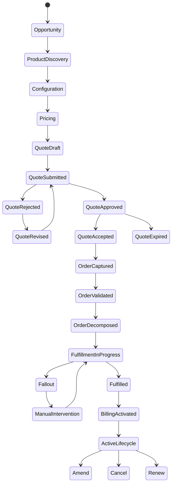
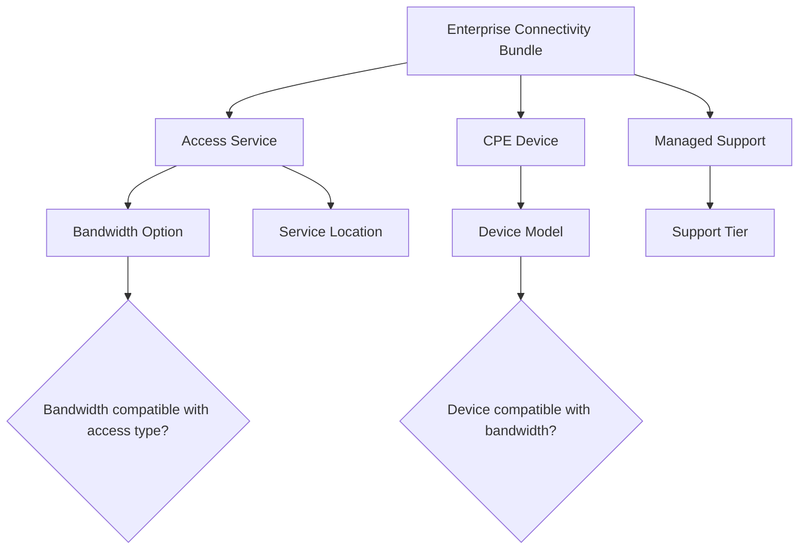
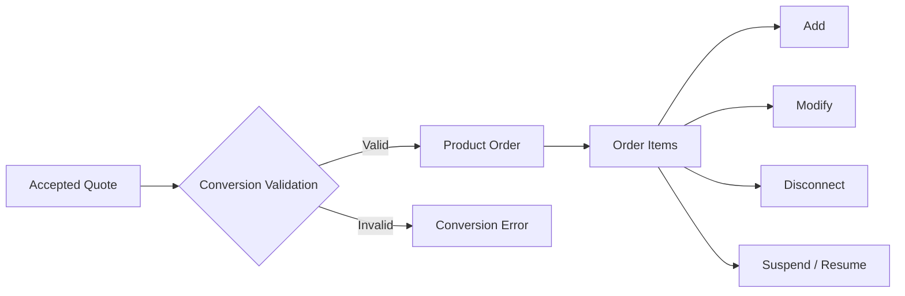
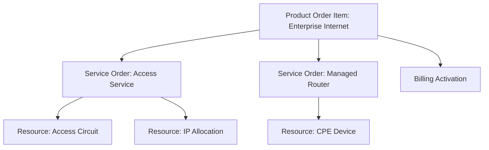
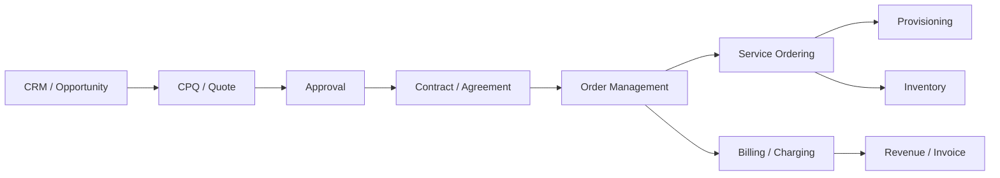

# Quote-to-Cash Lifecycle

Part ini membahas **quote-to-cash** sebagai lifecycle bisnis end-to-end. Fokusnya bukan pada implementasi teknis, melainkan pada cara membaca aliran bisnis dari kebutuhan customer sampai janji komersial berubah menjadi order, fulfillment, billing, revenue, dan perubahan lifecycle berikutnya.

Untuk senior engineer, quote-to-cash harus dilihat sebagai rangkaian **business commitments**. Setiap langkah mengubah tingkat kepastian bisnis:

- dari kebutuhan customer,
- menjadi konfigurasi produk,
- menjadi harga,
- menjadi quote,
- menjadi approval,
- menjadi acceptance,
- menjadi order,
- menjadi fulfillment,
- menjadi billing/charging,
- menjadi customer lifecycle yang terus berjalan.

Kesalahan utama engineer baru di domain ini adalah menganggap quote-to-cash sebagai flow linear sederhana. Dalam enterprise B2B dan telco, quote-to-cash adalah network of state machines, rule evaluations, handoffs, retries, reversals, amendments, dan audit boundaries.

---

## 1. Core Mental Model

Quote-to-cash menjawab satu pertanyaan besar:

> Bagaimana kebutuhan customer yang kompleks diubah menjadi janji komersial yang valid, order yang bisa dieksekusi, service yang bisa dipenuhi, dan charge yang benar secara billing?

Mental model sederhananya:

```mermaid
flowchart LR
  A[Lead / Opportunity] --> B[Product Discovery]
  B --> C[Configure Product]
  C --> D[Price]
  D --> E[Quote]
  E --> F[Approval]
  F --> G[Customer Acceptance]
  G --> H[Contract / Agreement]
  H --> I[Order Capture]
  I --> J[Order Validation]
  J --> K[Order Decomposition]
  K --> L[Fulfillment]
  L --> M[Billing / Charging Handoff]
  M --> N[Revenue / Lifecycle Continuity]
  N --> O[Change / Amend / Cancel / Renew]
```



Namun dalam sistem nyata, lifecycle ini tidak selalu satu arah. Ada revisi quote, approval ulang, expired quote, partial acceptance, order fallout, cancellation, amendment, renewal, dan reconciliation.



Hal yang harus diingat:

- **Quote** adalah calon janji komersial.
- **Approval** adalah kontrol risiko komersial.
- **Acceptance** adalah momen komitmen customer.
- **Order** adalah instruksi eksekusi terhadap janji yang sudah diterima.
- **Fulfillment** adalah realisasi operasional.
- **Billing/charging** adalah monetisasi realisasi tersebut.
- **Amend/cancel/renew** adalah bukti bahwa lifecycle tidak berhenti ketika order completed.

---

## 2. Why Quote-to-Cash Exists

Quote-to-cash ada karena enterprise selling tidak cukup diselesaikan oleh checkout sederhana.

Dalam ecommerce sederhana:

1. customer memilih item,
2. sistem menghitung harga,
3. customer bayar,
4. barang dikirim.

Dalam enterprise/telco CPQ:

1. customer mungkin organisasi besar dengan hierarchy kompleks,
2. produk mungkin bundle multi-service,
3. lokasi service bisa banyak,
4. eligibility tergantung account, agreement, geography, dan channel,
5. harga bisa berasal dari price list, discount, agreement, promotion, override, dan approval,
6. konfigurasi teknis mungkin harus feasible,
7. quote perlu dinegosiasikan,
8. approval bisa berlapis,
9. order perlu didekomposisi ke banyak downstream system,
10. fulfillment bisa partial atau gagal,
11. billing harus selaras dengan service activation,
12. perubahan setelah go-live harus menjaga continuity.

Quote-to-cash adalah mekanisme untuk menjaga agar proses tersebut tetap:

- valid,
- traceable,
- auditable,
- profitable,
- fulfillable,
- billable,
- recoverable.

---

## 3. Lifecycle Phase 1 — Lead / Opportunity Context

Lead/opportunity biasanya berasal dari CRM atau sales process. Dalam beberapa produk, Quote & Order tidak memiliki ownership penuh atas lead/opportunity, tetapi tetap harus memahami konteksnya.

### Business Concept

Opportunity merepresentasikan potensi deal. Ia biasanya memuat informasi seperti:

- customer atau prospect,
- sales owner,
- expected close date,
- deal size,
- product interest,
- segment,
- region,
- channel,
- probability,
- campaign atau source.

### Why It Exists

Opportunity membantu organisasi sales mengelola pipeline sebelum quote formal dibuat. Tidak semua opportunity menjadi quote. Tidak semua quote menjadi order.

### Engineering Relevance

Walaupun opportunity mungkin ada di luar Quote & Order, engineer harus memahami dampaknya:

- quote mungkin dibuat dari opportunity,
- quote mungkin perlu membawa reference opportunity ID,
- reporting/revenue forecast bisa menghubungkan quote ke opportunity,
- customer/account context mungkin diwariskan dari opportunity,
- sales owner atau channel bisa memengaruhi approval/pricing.

### Invariants

- Quote yang dibuat dari opportunity harus mempertahankan referensi yang cukup untuk traceability.
- Opportunity context tidak boleh diam-diam mengubah accepted quote tanpa revision boundary.
- Perubahan customer/account pada opportunity harus jelas dampaknya terhadap existing quote.

### Failure Modes

| Failure | Dampak |
|---|---|
| Opportunity customer berbeda dari quote customer | Quote bisa salah account/agreement |
| Opportunity currency berbeda dari quote currency | Pricing/reporting mismatch |
| Opportunity closed/lost tetapi quote masih aktif | Pipeline/reporting inconsistency |
| Channel tidak terbawa ke quote | Pricing atau approval rule salah |

### Internal Verification Checklist

- Apakah Quote & Order menerima opportunity context dari CRM?
- Field opportunity apa yang disimpan di quote?
- Apakah opportunity dapat berubah setelah quote dibuat?
- Apakah quote lifecycle memengaruhi opportunity status?
- Apakah ada reporting yang menggabungkan opportunity, quote, dan order?

---

## 4. Lifecycle Phase 2 — Product Discovery

Product discovery adalah fase ketika user/sales mencari produk atau offering yang relevan untuk customer.

### Business Concept

Discovery menjawab:

- produk apa yang tersedia,
- produk apa yang boleh dijual ke customer ini,
- produk apa yang cocok untuk lokasi ini,
- produk apa yang compatible dengan produk lain,
- produk apa yang available untuk segment/channel tertentu,
- produk apa yang masih effective pada tanggal quote.

### Why It Exists

Tanpa discovery yang benar, sales bisa menawarkan produk yang:

- sudah retired,
- tidak tersedia di region/customer segment,
- tidak compatible dengan existing product,
- tidak bisa dipenuhi downstream,
- tidak sesuai agreement customer.

### Engineering Relevance

Product discovery biasanya terlihat seperti search/filter API, tetapi secara domain ia adalah awal dari validation chain. Kalau discovery terlalu longgar, invalid configuration baru ketahuan di akhir, dan user experience memburuk.

### Invariants

- Produk yang ditampilkan harus effective dan sellable untuk konteks bisnis yang dimaksud.
- Eligibility rule harus konsisten antara discovery, configuration, quote validation, dan order validation.
- Discovery tidak boleh menjadi satu-satunya tempat enforcement; validasi tetap harus terjadi sebelum quote/order commit.

### Failure Modes

| Failure | Contoh |
|---|---|
| Offering retired masih muncul | Sales mengutip produk yang tidak bisa dijual |
| Eligibility tidak memakai agreement | Customer mendapat produk/harga yang tidak berhak |
| Discovery memakai catalog version terbaru, quote memakai versi lama | Mismatch saat configure/price |
| Search result tidak mempertimbangkan service location | Order gagal downstream karena tidak serviceable |

### Internal Verification Checklist

- Cek apakah discovery berbasis product catalog, search index, cache, atau kombinasi.
- Cek apakah discovery mempertimbangkan customer/account/agreement/channel/location.
- Cek apakah eligibility dihitung real-time atau precomputed.
- Cek apakah discovery dan validation memakai rule source yang sama.
- Cek bug lama terkait offering yang muncul tetapi tidak bisa dijual.

---

## 5. Lifecycle Phase 3 — Product Configuration

Configuration adalah fase memilih product offering, option, bundle, quantity, site, term, dan karakteristik produk.

### Business Concept

Configuration menjawab:

- komponen apa yang wajib,
- option apa yang boleh dipilih,
- kombinasi apa yang illegal,
- quantity/min/max apa yang valid,
- karakteristik apa yang harus diisi,
- dependency apa yang harus dipenuhi,
- apakah produk dapat dijual standalone atau harus bundle.

### Why It Exists

Enterprise/telco product jarang atomic. Satu offering bisa terdiri dari banyak komponen komersial dan teknis. Configuration menjaga agar quote tidak berisi kombinasi yang tidak masuk akal.

### Configuration Example



### Invariants

- Mandatory component harus ada.
- Mutually exclusive options tidak boleh dipilih bersama.
- Dependent option tidak boleh dipilih tanpa prerequisite.
- Configuration yang sudah priced harus punya rule context yang jelas.
- Accepted quote harus menyimpan configuration snapshot atau referensi versi yang cukup untuk audit/replay.

### Failure Modes

| Failure | Dampak |
|---|---|
| Option dependency tidak divalidasi | Order gagal saat decomposition |
| Bundle component berubah setelah quote | Quote lama tidak bisa direkonstruksi |
| Configuration rule berbeda antara UI dan backend | User melihat valid, backend menolak |
| Quantity rule tidak konsisten dengan pricing | Harga salah atau margin salah |

### Internal Verification Checklist

- Di mana configuration rule didefinisikan?
- Apakah rule ada di catalog, rule engine, code, database, atau external system?
- Apakah configuration disimpan sebagai snapshot atau reference?
- Bagaimana sistem menangani catalog update untuk quote draft yang belum submitted?
- Apakah validation rule sama antara create quote, revise quote, dan convert to order?

---

## 6. Lifecycle Phase 4 — Pricing

Pricing mengubah configuration menjadi commercial value.

### Business Concept

Pricing bisa mencakup:

- recurring charge,
- one-time charge,
- usage charge,
- installation fee,
- activation fee,
- discount,
- promotion,
- contract price,
- customer-specific price,
- tax-related context,
- margin/cost calculation,
- currency,
- term/commitment period.

### Why It Exists

Harga enterprise bukan sekadar `unit_price * quantity`. Harga bisa tergantung:

- customer segment,
- account agreement,
- geography,
- bundle relationship,
- term length,
- volume tier,
- sales channel,
- negotiated discount,
- promotion validity,
- approval policy,
- cost/margin target.

### Pricing Is a Decision, Not Just a Number

Output pricing bukan hanya angka. Output pricing adalah keputusan bisnis:

- harga ini berasal dari price list mana,
- discount ini sah karena rule apa,
- override ini disetujui oleh siapa,
- harga ini valid sampai kapan,
- margin masih acceptable atau tidak,
- apakah harga perlu approval.

### Invariants

- Harga harus traceable ke source: catalog price, price list, agreement, promotion, override, atau manual adjustment.
- Discount override harus memiliki authorization path.
- Harga accepted quote tidak boleh berubah tanpa revision/reprice boundary.
- Repricing harus eksplisit dan auditable.
- Currency dan tax context tidak boleh ambigu.

### Failure Modes

| Failure | Dampak |
|---|---|
| Quote menampilkan harga lama setelah price list update | Revenue leakage atau customer dispute |
| Discount override tanpa approval | Commercial policy violation |
| Reprice terjadi diam-diam saat order conversion | Customer trust/audit issue |
| Multi-currency rounding tidak konsisten | Billing mismatch |
| Bundle discount dihitung sebelum eligibility selesai | Harga salah |

### Internal Verification Checklist

- Apakah pricing dihitung real-time, cached, atau snapshot?
- Apakah accepted quote menyimpan calculated price breakdown?
- Apa yang terjadi jika price list berubah sebelum quote accepted?
- Apa yang terjadi jika quote direvisi setelah approval?
- Apakah pricing engine menghasilkan reason/audit trail?

---

## 7. Lifecycle Phase 5 — Quote Construction

Quote membungkus customer context, product configuration, pricing, validity, terms, dan status menjadi penawaran formal.

### Business Concept

Quote biasanya berisi:

- quote header,
- customer/account/party,
- quote line items,
- product offering references,
- configuration details,
- price breakdown,
- discount/override,
- validity period,
- terms and conditions,
- approval status,
- version/revision,
- sales owner/channel,
- attachments atau generated document,
- audit trail.

### Why It Exists

Quote adalah boundary antara exploration dan commitment. Sebelum quote, konfigurasi masih bisa dianggap work-in-progress. Setelah quote submitted/approved/accepted, sistem mulai memperlakukan isi quote sebagai janji komersial.

### Quote Is Not Just a Document

Dokumen quote/PDF hanyalah representasi. Domain object yang penting adalah quote beserta line item, state, version, price, approval, dan audit.

### Invariants

- Quote harus punya customer/account yang jelas.
- Quote line harus punya product offering/configuration yang valid.
- Quote harus punya validity period.
- Quote harus punya version/revision yang jelas.
- Quote yang submitted/approved/accepted tidak boleh dimodifikasi sembarangan.
- Quote accepted harus bisa direkonstruksi untuk audit.

### Failure Modes

| Failure | Dampak |
|---|---|
| Quote document berbeda dari quote data | Dispute dengan customer |
| Quote line item kehilangan catalog reference | Order conversion gagal |
| Quote version ambigu | Acceptance bisa menunjuk versi salah |
| Quote validity tidak dicek saat accept | Expired quote menjadi order |

### Internal Verification Checklist

- Apakah quote document generated dari data canonical quote?
- Bagaimana version/revision quote direpresentasikan?
- Apakah quote line item menyimpan snapshot price/configuration?
- Field apa yang immutable setelah submitted/approved/accepted?
- Apakah quote memiliki audit trail lengkap?

---

## 8. Lifecycle Phase 6 — Quote Validation

Validation memastikan quote siap untuk business transition berikutnya.

### Business Concept

Quote validation bisa memeriksa:

- customer/account valid,
- product configuration valid,
- eligibility valid,
- price valid,
- discount valid,
- agreement valid,
- required fields complete,
- terms valid,
- approval required atau tidak,
- quote not expired,
- catalog version compatible.

### Why It Exists

Validation mencegah sistem membuat janji bisnis yang tidak bisa dipenuhi atau tidak sah secara komersial.

### Validation Should Be Lifecycle-Aware

Validasi pada draft tidak selalu sama dengan validasi pada submit, approve, accept, atau convert-to-order.

| Moment | Validation Focus |
|---|---|
| Save draft | Minimal structural validity |
| Submit | Completeness, configuration, price, eligibility |
| Approve | Commercial policy, discount, margin, authority |
| Accept | Validity period, version, price freshness, approval state |
| Convert to order | Fulfillability, catalog mapping, order action validity |

### Invariants

- Validation rule harus konsisten dengan lifecycle transition.
- Error harus actionable, bukan sekadar generic failure.
- Validation result harus tidak stale pada transition critical.
- Validation tidak boleh hanya dilakukan di UI.

### Failure Modes

| Failure | Dampak |
|---|---|
| Draft validation terlalu ketat | Sales tidak bisa work-in-progress |
| Submit validation terlalu longgar | Quote invalid masuk approval |
| Accept tidak recheck expiry | Expired commercial term diterima |
| Convert tidak recheck orderability | Order gagal setelah customer accept |

### Internal Verification Checklist

- Cek validation rule per transition.
- Cek apakah validation result disimpan atau dihitung ulang.
- Cek error taxonomy untuk validation error.
- Cek apakah validation rule ada di satu tempat atau tersebar.
- Cek test coverage untuk invalid quote scenarios.

---

## 9. Lifecycle Phase 7 — Approval

Approval adalah kontrol risiko komersial sebelum quote diberikan atau diterima.

### Business Concept

Approval biasanya dipicu oleh:

- discount di atas threshold,
- margin di bawah batas,
- non-standard term,
- special pricing,
- unusual contract condition,
- high-value deal,
- manual override,
- risk/customer-specific rule.

### Why It Exists

Sales membutuhkan fleksibilitas, tetapi perusahaan perlu guardrail. Approval menjaga keseimbangan antara deal velocity dan commercial control.

### Approval Is State-Dependent

Approval terhadap quote version tertentu tidak otomatis berlaku untuk semua revisi.

Jika quote direvisi setelah approval, beberapa kemungkinan domain rule:

- approval tetap valid jika perubahan minor,
- approval invalid jika harga/discount berubah,
- approval perlu partial re-approval,
- approval harus diulang penuh.

Aktualnya harus diverifikasi internal.

### Invariants

- Approval harus terkait dengan quote version/revision yang jelas.
- Approval decision harus auditable.
- Approval authority harus sesuai threshold/rule.
- Quote tidak boleh accepted jika approval required tetapi belum approved.
- Perubahan material setelah approval harus memicu invalidation atau re-approval sesuai rule.

### Failure Modes

| Failure | Dampak |
|---|---|
| Approval tidak terkait quote version | Quote direvisi tapi approval lama tetap dipakai |
| Approval bypass lewat API tertentu | Policy violation |
| Approver tidak punya authority | Audit/compliance issue |
| Approval event hilang | Quote stuck atau acceptance gagal |

### Internal Verification Checklist

- Bagaimana approval required ditentukan?
- Apakah approval workflow internal atau external?
- Apakah approval melekat ke quote, quote version, line item, discount, atau deal?
- Apa yang invalidates approval?
- Apakah approval decision punya audit trail dan reason?

---

## 10. Lifecycle Phase 8 — Customer Acceptance

Acceptance adalah momen ketika customer menerima quote. Ini biasanya mengubah quote dari proposal menjadi komitmen bisnis.

### Business Concept

Acceptance bisa terjadi lewat:

- sales user menandai quote accepted,
- customer portal,
- signed document upload,
- e-signature,
- external CRM update,
- integration event.

### Why It Exists

Sistem perlu boundary formal untuk menentukan kapan quote siap menjadi order atau agreement.

### Acceptance Is a Critical Boundary

Sebelum accepted, quote masih bisa dinegosiasikan. Setelah accepted, perubahan harus dikontrol melalui revision, amendment, cancellation, atau explicit exception path.

### Invariants

- Quote harus approved jika approval required.
- Quote tidak boleh expired.
- Quote version yang accepted harus jelas.
- Accepted content harus immutable atau snapshot-able.
- Acceptance actor/time/source harus auditable.
- Acceptance tidak boleh terjadi dua kali secara konflik.

### Failure Modes

| Failure | Dampak |
|---|---|
| Dua user accept dua revision berbeda | Order dibuat dari version salah |
| Quote expired diterima | Commercial dispute |
| Acceptance event duplicate | Duplicate order |
| Acceptance tanpa approval | Guardrail bypass |
| Accepted quote masih editable | Audit dan trust issue |

### Internal Verification Checklist

- Bagaimana acceptance dilakukan di sistem?
- Apakah ada signature/document requirement?
- Apa state transition setelah acceptance?
- Apakah acceptance otomatis membuat order?
- Bagaimana duplicate acceptance dicegah?

---

## 11. Lifecycle Phase 9 — Contract / Agreement

Setelah acceptance, sistem bisa membuat atau memperbarui contract/agreement, atau hanya mereferensikan agreement yang sudah ada. Ini tergantung product dan customer implementation.

### Business Concept

Agreement dapat mengatur:

- term length,
- price commitment,
- discount entitlement,
- renewal condition,
- service level,
- customer-specific terms,
- billing arrangement,
- legal/commercial obligations.

### Why It Exists

Agreement memberi dasar legal/commercial untuk order dan billing. Tidak semua quote menghasilkan contract baru; beberapa quote menggunakan master agreement yang sudah ada.

### Invariants

- Order harus mengacu ke agreement/terms yang benar jika domain mengharuskan.
- Customer-specific pricing harus traceable ke agreement.
- Agreement validity harus dicek saat quote/order.
- Perubahan agreement tidak boleh diam-diam mengubah accepted quote tanpa rule eksplisit.

### Failure Modes

| Failure | Dampak |
|---|---|
| Quote mengacu agreement expired | Pricing/eligibility salah |
| Agreement terms tidak ikut ke order | Billing/contract compliance mismatch |
| Multiple agreements valid tapi tidak disambiguasi | Salah price/discount |
| Agreement update memengaruhi quote lama | Audit dispute |

### Internal Verification Checklist

- Apakah Quote & Order membuat agreement atau hanya consume agreement?
- Bagaimana agreement direferensikan di quote/order?
- Apakah agreement memengaruhi pricing, eligibility, atau approval?
- Apakah agreement snapshot disimpan?
- Bagaimana renewal/amendment agreement diproses?

---

## 12. Lifecycle Phase 10 — Order Capture

Order capture mengubah accepted quote atau direct order request menjadi product order.

### Business Concept

Order capture mengumpulkan semua informasi yang dibutuhkan untuk eksekusi:

- customer/account,
- order item,
- product offering/configuration,
- action: add/modify/disconnect/suspend/resume,
- service location,
- requested date,
- price/charge reference,
- agreement reference,
- fulfillment instruction,
- dependency antar item.

### Why It Exists

Quote adalah janji komersial. Order adalah instruksi operasional. Conversion dari quote ke order harus menjaga continuity.

### Quote-to-Order Boundary



### Invariants

- Order yang berasal dari quote harus traceable ke quote version accepted.
- Order item harus preserve business intent dari quote line item.
- Harga/terms tidak boleh berubah diam-diam saat conversion.
- Order action harus valid terhadap current product inventory/lifecycle.
- Conversion harus idempotent untuk mencegah duplicate order.

### Failure Modes

| Failure | Dampak |
|---|---|
| Duplicate conversion dari accepted quote | Duplicate order |
| Quote line tidak termap ke order item | Missing fulfillment |
| Harga berubah saat conversion | Customer dispute |
| Order action salah | Service disconnect/modify salah |
| Accepted quote sudah tidak compatible dengan catalog | Conversion blocked atau inconsistent |

### Internal Verification Checklist

- Apakah order selalu berasal dari quote atau bisa direct order?
- Bagaimana quote line item dimapping ke order item?
- Apa idempotency key untuk quote-to-order conversion?
- Apakah conversion menyimpan price snapshot?
- Apakah partial conversion didukung?

---

## 13. Lifecycle Phase 11 — Order Validation

Order validation memastikan order bisa dieksekusi.

### Business Concept

Order validation bisa meliputi:

- structural completeness,
- customer/account validity,
- order action validity,
- product/catalog validity,
- serviceability,
- inventory constraint,
- dependency antar order item,
- date feasibility,
- billing account readiness,
- agreement validity,
- duplicate detection.

### Why It Exists

Order yang invalid bisa menyebabkan downstream failure yang mahal. Lebih baik menolak lebih awal daripada menciptakan fallout di provisioning/billing.

### Order Validation vs Quote Validation

Quote validation memastikan janji komersial valid. Order validation memastikan instruksi operasional valid.

Contoh:

- Quote bisa valid secara harga, tetapi order gagal karena service location tidak serviceable.
- Quote bisa valid secara catalog, tetapi modify order gagal karena product inventory tidak ada.
- Quote bisa approved, tetapi order tidak valid karena billing account belum siap.

### Invariants

- Order action harus valid terhadap existing product inventory.
- Required downstream data harus lengkap sebelum handoff.
- Dependency antar order item harus jelas.
- Duplicate order harus dicegah atau terdeteksi.
- Validation failure harus menghasilkan status/error yang recoverable jika memungkinkan.

### Failure Modes

| Failure | Dampak |
|---|---|
| Modify order tanpa existing product | Invalid operation |
| Disconnect order untuk already disconnected product | Lifecycle conflict |
| Billing account missing | Billing activation gagal |
| Duplicate order tidak terdeteksi | Double provisioning/billing |
| Dependency tidak divalidasi | Downstream deadlock/fallout |

### Internal Verification Checklist

- Apa validation rule khusus order?
- Apakah validation dilakukan sebelum atau setelah order persisted?
- Apakah external validation/serviceability dipanggil?
- Apakah validation asynchronous?
- Bagaimana validation error dipresentasikan ke user/operations?

---

## 14. Lifecycle Phase 12 — Order Decomposition

Decomposition memecah product order menjadi unit eksekusi yang lebih operasional.

### Business Concept

Satu product order item bisa menghasilkan:

- service order,
- resource order,
- provisioning task,
- billing activation task,
- inventory update,
- shipping/install task,
- external system request.

### Why It Exists

Produk komersial tidak selalu sama dengan service/resource teknis. Customer membeli “Enterprise Internet Package”, tetapi fulfillment mungkin membutuhkan access line, router, IP block, installation appointment, service inventory, dan billing plan.

### Product-Service-Resource Split



### Invariants

- Decomposition harus deterministic atau setidaknya auditable.
- Setiap downstream task harus traceable ke order item.
- Dependency antar task harus eksplisit.
- Failed decomposition tidak boleh menghasilkan partial downstream side effect tanpa recovery model.
- Decomposition rule harus selaras dengan catalog/service catalog.

### Failure Modes

| Failure | Dampak |
|---|---|
| Product tidak punya decomposition mapping | Order stuck |
| Decomposition menghasilkan task tidak lengkap | Partial fulfillment |
| Dependency salah | Task dieksekusi dalam urutan salah |
| Catalog update mengubah decomposition untuk order lama | Inconsistent fulfillment |
| Decomposition partial lalu gagal | Orphan downstream task |

### Internal Verification Checklist

- Di mana decomposition rule didefinisikan?
- Apakah decomposition synchronous atau asynchronous?
- Apakah ada service catalog/resource catalog?
- Bagaimana traceability dari downstream task ke order item?
- Bagaimana rollback/compensation jika decomposition gagal di tengah?

---

## 15. Lifecycle Phase 13 — Fulfillment

Fulfillment adalah fase mengeksekusi order di downstream operational systems.

### Business Concept

Fulfillment bisa mencakup:

- service order processing,
- provisioning,
- resource reservation/allocation,
- inventory update,
- field work,
- device shipment,
- activation,
- third-party dependency,
- customer communication,
- milestone tracking.

### Why It Exists

Customer tidak membeli record order. Customer membeli hasil: service aktif, produk tersedia, perubahan terjadi, billing sesuai.

### Fulfillment Is Usually Long-Running

Fulfillment jarang selesai dalam satu transaction. Ia bisa berlangsung menit, jam, hari, atau minggu. Karena itu lifecycle harus mendukung:

- asynchronous state,
- milestone,
- retry,
- fallout,
- manual intervention,
- cancellation,
- amendment,
- reconciliation.

### Invariants

- Fulfillment status harus traceable ke order item/task.
- Partial fulfillment harus direpresentasikan dengan jelas.
- Manual intervention harus auditable.
- Retry tidak boleh menghasilkan duplicate provisioning.
- Completion harus hanya terjadi setelah required task selesai.

### Failure Modes

| Failure | Dampak |
|---|---|
| Downstream rejection | Order fallout |
| Task stuck tanpa timeout | Order menggantung |
| Retry tidak idempotent | Double provisioning |
| Partial fulfillment tidak terlihat | Customer/support bingung |
| Manual fix tidak tercatat | Audit/reconciliation gagal |

### Internal Verification Checklist

- Apa downstream fulfillment systems yang terlibat?
- Apakah fulfillment orchestrated oleh Quote & Order atau external system?
- Bagaimana milestone/status diterima?
- Apakah ada fallout queue?
- Bagaimana manual intervention dicatat?

---

## 16. Lifecycle Phase 14 — Billing / Charging Handoff

Billing/charging handoff memastikan produk/service yang sudah dijual dan/atau aktif menghasilkan charge yang benar.

### Business Concept

Billing handoff bisa mencakup:

- billing account,
- charge plan,
- recurring charge,
- one-time charge,
- usage charge setup,
- activation date,
- contract term,
- proration,
- discount,
- tax context,
- invoice grouping,
- revenue recognition context.

### Why It Exists

Kesalahan billing bisa langsung berdampak pada revenue, customer trust, dispute, dan compliance.

### Billing Is Not Just “After Fulfillment”

Beberapa charge mungkin muncul saat order submitted, saat service activated, saat milestone tertentu, atau saat billing cycle berikutnya. Domain aktual harus diverifikasi.

### Invariants

- Billing activation harus selaras dengan fulfillment state.
- Charge yang dikirim ke billing harus traceable ke quote/order/agreement.
- Price/discount harus konsisten dengan accepted quote atau approved amendment.
- Effective date harus jelas.
- Cancellation/amendment harus menghasilkan billing adjustment yang benar.

### Failure Modes

| Failure | Dampak |
|---|---|
| Billing aktif sebelum service fulfilled | Customer charged before service |
| Billing tidak aktif setelah fulfillment | Revenue leakage |
| Discount tidak terbawa | Overbilling/customer dispute |
| Wrong effective date | Proration error |
| Cancel order tidak menghasilkan billing stop | Continued charging |

### Internal Verification Checklist

- Kapan billing handoff terjadi?
- Apa data yang dikirim ke billing/charging?
- Apakah billing menerima quote price, order price, atau recalculated price?
- Bagaimana activation date ditentukan?
- Bagaimana cancellation/amendment memengaruhi billing?

---

## 17. Lifecycle Phase 15 — Revenue and Lifecycle Continuity

Quote-to-cash tidak berhenti di billing activation. Setelah service aktif, customer lifecycle berlanjut.

### Business Concept

Lifecycle continuity mencakup:

- active product inventory,
- contract term,
- renewal,
- upgrade,
- downgrade,
- add-on,
- disconnect,
- suspend/resume,
- billing adjustment,
- customer support,
- assurance,
- product migration.

### Why It Exists

Enterprise/telco customer relationship berlangsung lama. Banyak revenue berasal dari lifecycle change, bukan hanya new sale.

### Invariants

- Product inventory harus mencerminkan apa yang aktif untuk customer.
- Change order harus mengacu ke product inventory yang benar.
- Agreement/term harus dipertimbangkan saat amendment/renewal.
- Billing harus mengikuti lifecycle change.
- Historical quote/order harus tetap auditable walaupun product aktif berubah.

### Failure Modes

| Failure | Dampak |
|---|---|
| Product inventory tidak update setelah fulfillment | Modify/disconnect order gagal |
| Renewal tidak mempertimbangkan agreement term | Pricing/contract error |
| Suspend/resume tidak sinkron dengan billing | Charging salah |
| Upgrade tidak preserve dependency | Service mismatch |

### Internal Verification Checklist

- Apakah Quote & Order membaca product inventory?
- Apakah active product menjadi basis modify/disconnect?
- Bagaimana renewal diproses?
- Bagaimana product migration dimodelkan?
- Bagaimana lifecycle change dilaporkan ke billing/assurance?

---

## 18. Lifecycle Phase 16 — Change, Amend, Cancel, Renew

Change lifecycle adalah bagian paling sering diremehkan. Sistem yang hanya benar untuk new sale belum tentu benar untuk amendment/cancellation.

### Business Concept

- **Amend**: mengubah quote/order/agreement yang sudah ada.
- **Cancel**: membatalkan quote/order/service sebelum atau selama execution.
- **Renew**: memperpanjang term/agreement/product.
- **Modify**: mengubah product/service aktif.
- **Disconnect**: menghentikan product/service aktif.
- **Suspend/Resume**: menghentikan sementara dan mengaktifkan kembali service.

### Why It Exists

Customer relationship tidak statis. Customer bisa menambah site, mengurangi bandwidth, mengganti package, membatalkan order, memperpanjang kontrak, atau terminate service.

### Change Is Hard Because State Already Exists

New sale dimulai dari kosong. Change order harus mempertimbangkan:

- existing product inventory,
- active agreement,
- pending order,
- current billing state,
- service dependency,
- fulfillment in-progress,
- cancellation window,
- customer commitment.

### Invariants

- Tidak boleh ada dua change order konflik terhadap product yang sama tanpa conflict resolution.
- Cancel harus menghormati state fulfillment saat ini.
- Amend harus jelas apakah mengubah quote, order, agreement, atau product inventory.
- Renew harus preserve atau explicit update terms.
- Change harus menghasilkan billing impact yang benar.

### Failure Modes

| Failure | Dampak |
|---|---|
| Amend order saat fulfillment berjalan | Race condition |
| Cancel setelah downstream activation | Perlu compensation/billing adjustment |
| Modify terhadap product yang sudah disconnect | Lifecycle violation |
| Renew memakai price lama tanpa rule | Revenue/compliance issue |
| Dua order modify paralel | Lost update atau inconsistent inventory |

### Internal Verification Checklist

- Apa lifecycle object yang bisa di-amend?
- Apakah cancellation didukung untuk quote, order, order item, atau fulfillment task?
- Bagaimana pending order conflict dideteksi?
- Bagaimana amendment memengaruhi approval dan pricing?
- Bagaimana renewals ditangani: quote baru, order baru, agreement update, atau custom workflow?

---

## 19. Quote-to-Cash as Commitment Escalation

Cara paling berguna untuk memahami quote-to-cash adalah melihatnya sebagai eskalasi komitmen.

| Phase | Commitment Level | Main Risk |
|---|---:|---|
| Product discovery | Low | Offering salah muncul |
| Configuration | Medium | Kombinasi invalid |
| Pricing | Medium-high | Harga/discount salah |
| Quote submitted | High | Proposal tidak valid |
| Quote approved | Very high | Approval tidak sesuai rule |
| Quote accepted | Critical | Customer menerima janji salah |
| Order captured | Critical | Order tidak sesuai quote |
| Fulfillment | Operationally critical | Gagal provisioning/activation |
| Billing | Financially critical | Revenue leakage atau overbilling |
| Amendment/cancel | Lifecycle critical | Race, compensation, mismatch |

Semakin jauh lifecycle berjalan, semakin mahal koreksinya.

### Engineering Implication

- Error di discovery bisa diperbaiki dengan filter.
- Error di quote submitted bisa butuh revision.
- Error di accepted quote bisa menjadi customer dispute.
- Error di order fulfillment bisa butuh fallout/manual intervention.
- Error di billing bisa menjadi revenue leakage atau regulatory/compliance issue.

---

## 20. Lifecycle Boundaries and Ownership

Quote-to-cash melibatkan banyak boundary. Jangan mengasumsikan satu sistem memiliki semuanya.



### Common Ownership Questions

- Siapa owner customer/account data?
- Siapa owner product catalog?
- Siapa owner pricing rules?
- Siapa owner approval workflow?
- Siapa owner quote state machine?
- Siapa owner order orchestration?
- Siapa owner service order?
- Siapa owner billing activation?
- Siapa owner product inventory?
- Siapa owner reconciliation?

### Why This Matters

Banyak bug enterprise terjadi di boundary:

- field mapping salah,
- event interpretation berbeda,
- lifecycle status tidak setara,
- retry ownership tidak jelas,
- error tidak punya owner,
- reconciliation tidak lengkap.

---

## 21. Domain Invariants Across the Lifecycle

Invariants lintas quote-to-cash harus lebih diprioritaskan daripada detail implementasi.

### Identity and Traceability

- Quote harus traceable ke customer/account.
- Order harus traceable ke quote accepted jika berasal dari quote.
- Billing charge harus traceable ke order/product/agreement.
- Product inventory harus traceable ke fulfilled order.

### Version and Snapshot

- Accepted quote harus punya version yang jelas.
- Harga dan configuration pada accepted quote harus auditable.
- Catalog reference harus cukup untuk menjelaskan keputusan saat itu.
- Revisions harus tidak merusak historical record.

### Lifecycle Correctness

- State transition harus legal.
- Terminal state tidak boleh berubah tanpa explicit recovery/reopen rule.
- Manual intervention harus tercatat.
- Retry harus idempotent.
- Cancel/amend harus state-aware.

### Commercial Correctness

- Discount harus sesuai policy.
- Approval harus sesuai threshold.
- Price harus sesuai quote/agreement.
- Billing harus sesuai fulfilled product/service.

### Operational Correctness

- Order decomposition harus lengkap.
- Dependencies harus eksplisit.
- Downstream rejection harus menghasilkan fallout/recovery state.
- Completion harus berdasarkan fakta fulfillment, bukan hanya request sent.

---

## 22. API, Event, Database, Workflow, Testing, and Operations Impact

### API Impact

Lifecycle harus terlihat dalam API melalui:

- state/status,
- transition endpoint/action,
- validation endpoint/result,
- version/revision,
- idempotency key,
- error taxonomy,
- relationship references,
- audit metadata.

Review API dengan pertanyaan:

- Apakah endpoint ini membuat state transition?
- Apakah transition legal untuk current state?
- Apakah idempotent?
- Apakah caller bisa retry aman?
- Apakah error cukup domain-specific?
- Apakah response menyembunyikan failure yang sebenarnya?

### Event Impact

Event harus merepresentasikan fakta bisnis, bukan sekadar log teknis.

Contoh event domain:

- `QuoteCreated`
- `QuoteSubmitted`
- `QuoteApproved`
- `QuoteAccepted`
- `OrderCreated`
- `OrderValidated`
- `OrderDecomposed`
- `OrderFalloutRaised`
- `OrderCompleted`
- `BillingActivationRequested`

Review event dengan pertanyaan:

- Apakah event menandakan command requested atau fact occurred?
- Apakah payload cukup untuk consumer?
- Apakah event bisa duplicate?
- Apakah event bisa out-of-order?
- Apakah event compatible dengan versi lama?

### Database Impact

Database harus bisa mendukung:

- historical reconstruction,
- quote versioning,
- state transition audit,
- relationship traversal,
- idempotency,
- reconciliation,
- reporting.

Review database dengan pertanyaan:

- Apakah update menghapus data yang dibutuhkan audit?
- Apakah state transition history disimpan?
- Apakah quote accepted bisa direkonstruksi?
- Apakah order item punya traceability ke quote line?
- Apakah migration menjaga lifecycle invariant?

### Workflow Impact

Workflow harus menangani:

- approval path,
- long-running order fulfillment,
- manual intervention,
- retry,
- cancellation,
- escalation,
- timeout,
- reconciliation.

Review workflow dengan pertanyaan:

- Apa yang terjadi jika external system tidak merespons?
- Siapa yang bisa melakukan manual intervention?
- Apakah timeout menghasilkan state yang jelas?
- Apakah retry aman?
- Apakah workflow bisa stuck tanpa alert?

### Testing Impact

Testing harus mencakup lifecycle, bukan hanya endpoint happy path.

Minimal scenarios:

- valid quote to accepted to order,
- expired quote acceptance rejected,
- approval required and approved,
- approval invalidated after revision,
- duplicate quote-to-order conversion,
- order fallout and retry,
- cancellation while fulfillment in progress,
- amendment conflict,
- billing activation mismatch.

### Operations Impact

Operations membutuhkan visibility terhadap:

- stuck quote/order,
- failed validation,
- approval bottleneck,
- conversion failure,
- downstream rejection,
- fallout queue,
- retry exhaustion,
- billing mismatch,
- reconciliation gap.

---

## 23. Business Failure Model by Lifecycle Stage

| Stage | Failure Example | Detection Signal | Recovery Direction |
|---|---|---|---|
| Discovery | Ineligible product shown | Validation failure later | Fix eligibility/search rule |
| Configuration | Invalid option combination | Configure/submit validation | Correct config or catalog rule |
| Pricing | Price mismatch | Reprice diff, audit compare | Reprice, revise, approve |
| Quote | Expired quote accepted | Acceptance validation | Reject accept, create revision |
| Approval | Approval stale after revision | Version mismatch | Re-approval |
| Acceptance | Duplicate acceptance | Idempotency conflict | Return existing result |
| Conversion | Duplicate order | Existing order for quote/version | Idempotent response/reconcile |
| Validation | Missing billing account | Order validation error | Complete account setup |
| Decomposition | No mapping | Decomposition failure | Catalog/rule correction/manual fallout |
| Fulfillment | Downstream rejection | Rejection event/status | Fallout/manual intervention |
| Billing | Charge mismatch | Billing reconciliation | Adjustment/correction |
| Change | Amendment conflict | Pending order conflict | Reject, queue, or merge with rule |

---

## 24. How to Read Requirements in Quote-to-Cash

Saat membaca user story, jangan hanya mencari endpoint dan field. Cari lifecycle impact.

### Requirement Questions

- Lifecycle object apa yang berubah: quote, order, agreement, product inventory, billing?
- State apa yang boleh melakukan action ini?
- Apakah action ini transition atau hanya metadata update?
- Apakah action ini butuh approval?
- Apakah action ini memengaruhi price?
- Apakah action ini harus immutable/auditable?
- Apakah action ini menghasilkan event?
- Apakah ada downstream impact?
- Apakah ada cancellation/amendment interaction?
- Apakah ada reporting impact?

### Weak Requirement Smell

Kalimat seperti ini harus memicu pertanyaan:

- “User can update quote anytime.”
- “System should sync order to downstream.”
- “Price should be recalculated automatically.”
- “Order can be cancelled.”
- “If failed, retry.”
- “Status should be updated.”
- “Billing should be notified.”

Kalimat tersebut belum cukup. Perlu state, guard, side effect, idempotency, failure handling, dan audit rule.

---

## 25. PR and Design Review Checklist

Gunakan checklist ini saat mereview feature quote-to-cash.

### Lifecycle Correctness

- Apakah state transition legal?
- Apakah transition punya guard condition?
- Apakah terminal state dilindungi?
- Apakah revision/version ditangani?
- Apakah cancel/amend impact dipikirkan?

### Commercial Correctness

- Apakah price source jelas?
- Apakah discount/override butuh approval?
- Apakah approval terkait version yang tepat?
- Apakah quote accepted immutable?
- Apakah billing memakai price yang benar?

### Integration Correctness

- Apakah downstream contract jelas?
- Apakah event merepresentasikan fact, bukan sekadar command?
- Apakah retry/idempotency aman?
- Apakah failure menghasilkan recoverable state?
- Apakah reconciliation mungkin dilakukan?

### Auditability

- Siapa melakukan action?
- Kapan action dilakukan?
- Dari source mana action datang?
- Version apa yang berubah?
- Reason/decision apa yang disimpan?

### Regression Risk

- Apakah perubahan memengaruhi quote lama?
- Apakah order in-flight terdampak?
- Apakah customer-specific behavior berubah?
- Apakah migration menjaga historical record?
- Apakah event/API backward compatible?

---

## 26. Internal Verification Checklist

Gunakan checklist ini selama onboarding atau saat membaca codebase.

### Lifecycle Documents

- Cari quote lifecycle diagram.
- Cari order lifecycle diagram.
- Cari quote-to-order conversion flow.
- Cari approval workflow documentation.
- Cari fulfillment/fallout process.
- Cari billing handoff documentation.

### Codebase Anchors

Cari istilah:

- `Quote`
- `QuoteItem`
- `QuoteVersion`
- `QuoteStatus`
- `Order`
- `ProductOrder`
- `OrderItem`
- `OrderStatus`
- `OrderAction`
- `Approval`
- `Price`
- `Discount`
- `Agreement`
- `CatalogVersion`
- `Fallout`
- `Fulfillment`
- `BillingActivation`

### API Contracts

Cek endpoint/action untuk:

- create quote,
- update quote,
- validate quote,
- submit quote,
- approve/reject quote,
- accept quote,
- convert quote to order,
- create order,
- validate order,
- cancel order,
- amend order,
- get status,
- manual intervention.

### Database and Persistence

- Bagaimana quote version disimpan?
- Apakah price snapshot disimpan?
- Apakah state transition history ada?
- Apakah order item traceable ke quote line item?
- Apakah idempotency record ada?
- Apakah event outbox/inbox ada?

### Observability

- Dashboard quote created/submitted/approved/accepted.
- Dashboard order created/validated/completed/fallout.
- Alert untuk stuck order.
- Alert untuk downstream rejection.
- Reconciliation report quote/order/billing.
- Audit query untuk accepted quote.

### People to Ask

- PO: “Apa lifecycle happy path dan failure path paling penting?”
- BA: “Rule bisnis mana yang paling sering disalahpahami?”
- Solution Architect: “Boundary sistem mana yang paling riskan?”
- Senior Engineer: “Bug domain apa yang paling mahal historisnya?”
- Support/Ops: “Order stuck/fallout biasanya karena apa?”

---

## 27. Practical Domain Notes Template

Gunakan template ini saat mempelajari flow internal.

```md
# Flow: <name>

## Business Goal
Apa tujuan bisnis flow ini?

## Lifecycle Object
Quote / Order / Agreement / Inventory / Billing / Other

## Entry Condition
State dan data minimum apa yang dibutuhkan?

## Transition
State awal -> state akhir

## Guard Conditions
Rule apa yang harus benar sebelum transition?

## Side Effects
Event, downstream call, audit, notification, billing, inventory update.

## Invariants
Hal apa yang tidak boleh rusak?

## Failure Modes
Apa yang bisa gagal dan bagaimana recover?

## Internal Evidence
Link PR, doc, API contract, schema, incident, demo.

## Open Questions
Hal yang perlu ditanyakan ke PO/BA/SA/senior engineer.
```

---

## 28. Key Takeaways

- Quote-to-cash adalah lifecycle komitmen bisnis, bukan sekadar flow teknis.
- Setiap phase meningkatkan level commitment dan cost of correction.
- Quote adalah calon janji komersial; order adalah instruksi eksekusi; fulfillment adalah realisasi; billing adalah monetisasi.
- Domain correctness bergantung pada state, version, invariant, approval, traceability, dan recovery.
- Failure paling mahal sering terjadi di boundary: quote-to-order, order-to-fulfillment, fulfillment-to-billing, dan amendment/cancellation.
- Senior engineer harus selalu menanyakan: state apa, rule apa, invariant apa, side effect apa, failure mode apa, dan bagaimana sistem recover.

---

## 29. Completion Criteria

Saya dianggap memahami part ini jika mampu:

- menggambar lifecycle quote-to-cash end-to-end,
- menjelaskan perbedaan quote validation dan order validation,
- menjelaskan kenapa acceptance adalah commitment boundary,
- menjelaskan kenapa quote-to-order conversion harus idempotent dan traceable,
- mengidentifikasi failure mode per lifecycle stage,
- menilai requirement/PR dari sisi lifecycle impact,
- menyusun pertanyaan tajam untuk PO/BA/SA/senior engineer,
- menemukan artefact internal yang membuktikan lifecycle aktual.
