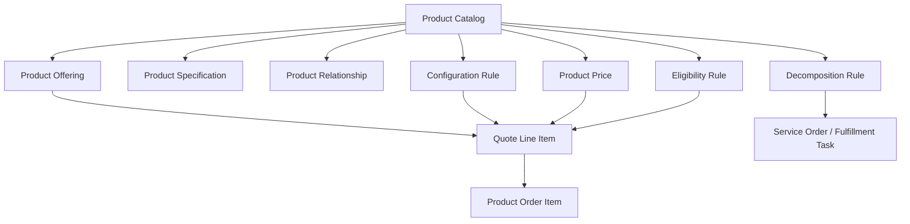
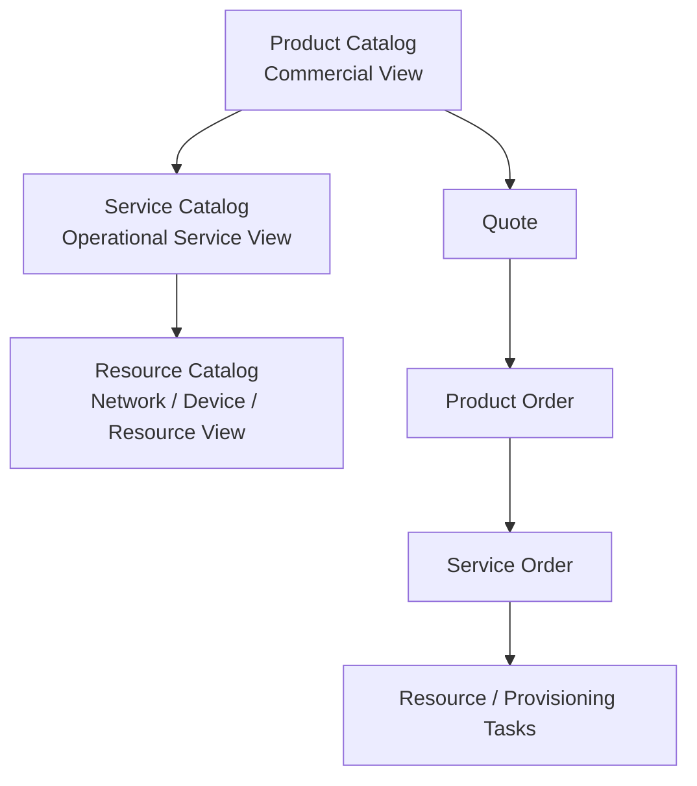
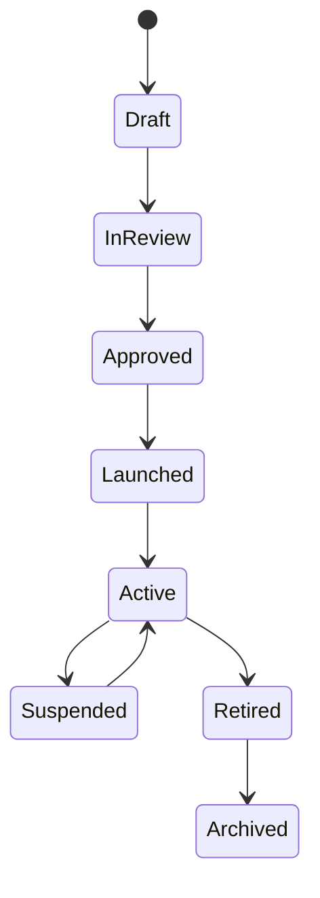
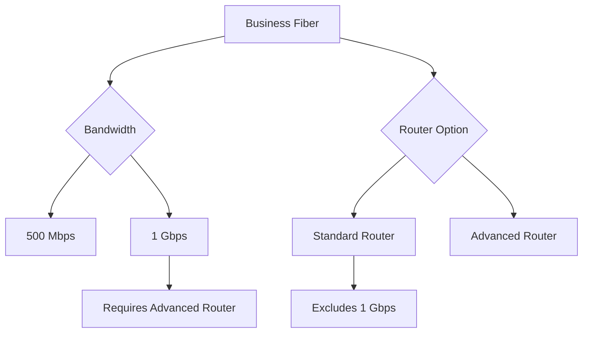
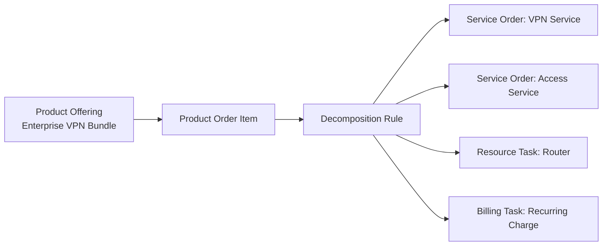

# Product Catalog and Catalog-Driven Architecture

Part ini membahas **product catalog** sebagai pusat bahasa bisnis untuk apa yang dapat dijual, bagaimana produk dikonfigurasi, bagaimana harga dan eligibility ditentukan, serta bagaimana order bisa didekomposisi ke fulfillment downstream.

Dalam enterprise CPQ/order management, product catalog bukan sekadar tabel master data. Product catalog adalah **commercial grammar**: ia menentukan kombinasi produk apa yang valid, opsi apa yang tersedia, relasi apa yang wajib, harga apa yang relevan, lifecycle apa yang berlaku, dan bagaimana produk komersial diterjemahkan menjadi eksekusi operasional.

Kesalahan umum engineer baru adalah melihat catalog sebagai “lookup data”. Dalam sistem CPQ/telco yang serius, catalog adalah salah satu sumber utama domain correctness.

---

## 1. Core Mental Model

Product catalog menjawab lima pertanyaan besar:

1. **Apa yang dijual?**  
   Product offering, bundle, add-on, plan, package, service option.

2. **Apa struktur produk itu?**  
   Product specification, characteristics, relationships, mandatory/optional components.

3. **Kepada siapa produk boleh dijual?**  
   Eligibility by customer, account, segment, agreement, channel, geography, serviceability.

4. **Bagaimana produk diberi harga?**  
   Price list, recurring charge, one-time charge, usage charge, discount, promotion, terms.

5. **Bagaimana produk dieksekusi setelah menjadi order?**  
   Mapping ke service order, service specification, resource, provisioning, inventory, billing.



Catalog-driven architecture berarti sistem tidak hardcode semua variasi produk di code. Sebagian besar variasi produk, bundle, option, price, eligibility, dan decomposition dikendalikan oleh catalog/rule/configuration data.

Namun “catalog-driven” tidak berarti semua rule otomatis aman. Catalog-driven system tetap membutuhkan governance, versioning, testing, validation, audit, deployment control, dan rollback strategy.

---

## 2. Why Product Catalog Exists

Product catalog ada karena enterprise product terlalu banyak variasi untuk dikelola lewat code branching atau manual process.

Tanpa product catalog yang baik:

- sales tidak tahu produk apa yang boleh dijual,
- konfigurasi produk mudah invalid,
- harga tidak konsisten,
- discount/promotion sulit dikontrol,
- quote tidak bisa dikonversi ke order,
- downstream fulfillment tidak tahu apa yang harus dilakukan,
- billing tidak tahu charge apa yang harus dibuat,
- perubahan produk butuh deployment code terus-menerus,
- customer-specific behavior menjadi hardcoded dan sulit diaudit.

Product catalog adalah cara untuk membuat product lifecycle lebih configurable, governed, reusable, dan traceable.

---

## 3. Product Catalog Is Not Just Master Data

Master data biasanya menjawab “data ini apa”. Product catalog menjawab “apa yang boleh dilakukan dengan data ini”.

| View | Product Catalog Sebagai Master Data | Product Catalog Sebagai Domain Control |
|---|---|---|
| Fokus | Nama produk, kode produk, deskripsi | Sellability, eligibility, compatibility, lifecycle |
| Risiko | Data salah tampil | Quote/order salah secara bisnis |
| Pengguna | UI/search/report | CPQ, pricing, validation, ordering, billing |
| Perubahan | Data maintenance | Product launch/change governance |
| Failure | Label salah | Invalid sale, failed fulfillment, billing mismatch |

Dalam CPQ/order management, catalog harus dianggap sebagai domain control plane.

---

## 4. Core Concepts

### Product Catalog

Product catalog adalah kumpulan product offering, product specification, price, relationship, rule, dan lifecycle metadata.

Catalog biasanya memiliki:

- catalog identifier,
- catalog name,
- version,
- effective date,
- expiration date,
- status,
- market/segment/channel scope,
- owner/governance metadata.

### Product Offering

Product offering adalah bentuk produk yang dijual ke customer.

Contoh konseptual:

- “Business Fiber 1Gbps”
- “Enterprise Connectivity Bundle”
- “Managed Router Add-on”
- “Premium Support Tier”
- “5G Business Plan”

Product offering adalah unit komersial. Ia bisa memiliki price, eligibility, term, dan presentation rule.

### Product Specification

Product specification menjelaskan struktur atau karakteristik produk yang lebih fundamental.

Offering bisa dianggap sebagai cara menjual specification tertentu dengan packaging, price, dan rule tertentu.

Contoh:

- Specification: Internet Access Service
- Offering A: Business Fiber 500Mbps
- Offering B: Business Fiber 1Gbps
- Offering C: Enterprise Internet Bundle with Managed Router

### Product Characteristic

Characteristic adalah atribut produk yang bisa dipilih atau ditentukan.

Contoh:

- bandwidth,
- contract term,
- service location,
- support tier,
- installation type,
- device model,
- static IP count,
- SLA level.

Characteristic bisa mandatory, optional, constrained, derived, hidden, or read-only.

### Product Relationship

Relationship menjelaskan hubungan antar produk/offering/specification.

Contoh relationship:

- contains,
- requires,
- excludes,
- depends on,
- compatible with,
- replaces,
- upgrades to,
- downgrades to,
- migrates to,
- bundled with,
- add-on for.

### Product Bundle

Bundle adalah offering yang terdiri dari beberapa komponen.

Bundle bisa:

- fixed bundle,
- configurable bundle,
- nested bundle,
- optional add-on bundle,
- promotional bundle,
- customer-specific bundle.

### Product Option

Option adalah pilihan dalam konfigurasi produk.

Option bisa mandatory atau optional. Option bisa memengaruhi price, eligibility, decomposition, dan billing.

### Product Price

Product price mendefinisikan charge atau commercial terms yang terkait dengan offering atau component.

Jenis umum:

- recurring charge,
- one-time charge,
- usage charge,
- installation fee,
- activation fee,
- termination fee,
- discount,
- promotion,
- tiered price,
- volume price.

---

## 5. Commercial Catalog vs Technical / Service Catalog

Dalam telco, penting membedakan product catalog, service catalog, dan resource catalog.



### Product Catalog

Fokus pada apa yang dijual ke customer.

Contoh:

- Enterprise Internet Package,
- Managed Connectivity Bundle,
- Premium Support Add-on.

### Service Catalog

Fokus pada service teknis/operasional yang harus dibuat untuk memenuhi produk.

Contoh:

- Access service,
- CPE management service,
- IP allocation service,
- monitoring service.

### Resource Catalog

Fokus pada resource fisik/logis yang digunakan untuk menyediakan service.

Contoh:

- router model,
- access circuit,
- port,
- IP block,
- SIM,
- network resource.

### Why This Separation Matters

Customer membeli product, bukan service/resource internal. Tetapi fulfillment membutuhkan service/resource. Jika product catalog tidak bisa dipetakan ke service/resource, quote bisa valid secara komersial tapi gagal secara operasional.

### Internal Verification Checklist

- Apakah internal CSG/team membedakan product catalog, service catalog, dan resource catalog?
- Apakah service catalog berada di produk yang sama atau downstream OSS?
- Apakah product order didekomposisi menjadi service order?
- Apakah relationship product-service-resource eksplisit atau implicit di code/rule?
- Apakah billing menggunakan product view, service view, atau mapping khusus?

---

## 6. Catalog-Driven Architecture

Catalog-driven architecture berarti behavior sistem didorong oleh catalog/rule/configuration, bukan hardcoded logic untuk setiap produk.

### What Catalog Can Drive

Catalog dapat menggerakkan:

- product discovery,
- eligibility,
- configuration,
- compatibility,
- pricing,
- discounting,
- quote line creation,
- validation,
- order action availability,
- order decomposition,
- fulfillment routing,
- billing charge setup,
- UI presentation,
- product lifecycle transition.

### What Catalog Should Not Blindly Drive

Tidak semua hal idealnya dilempar ke catalog tanpa governance.

Risiko jika terlalu banyak logic masuk catalog:

- rule sulit dipahami,
- debugging lebih sulit,
- perubahan catalog bisa merusak order in-flight,
- testing tidak cukup,
- customer-specific exception menyebar,
- governance lemah,
- performance terganggu,
- rule conflict tidak terdeteksi.

### Balanced View

Catalog-driven bukan berarti “no code”. Yang benar:

- stable domain invariant tetap dijaga oleh code/domain model,
- variable product behavior dikelola oleh catalog/rule,
- high-risk commercial rule punya approval/governance,
- catalog change diuji seperti software change.

---

## 7. Product Offering Lifecycle

Product offering biasanya memiliki lifecycle.

Contoh state konseptual:



Domain aktual harus diverifikasi internal. Tidak semua organisasi memakai state yang sama.

### Lifecycle Meaning

| State | Meaning |
|---|---|
| Draft | Offering sedang dirancang |
| In Review | Menunggu governance/approval |
| Approved | Siap diluncurkan tetapi belum active |
| Launched/Active | Boleh dijual |
| Suspended | Sementara tidak boleh dijual |
| Retired | Tidak boleh dijual baru, mungkin masih dipakai existing customer |
| Archived | Tidak aktif dan hanya untuk historical reference |

### Invariants

- Draft offering tidak boleh dijual.
- Retired offering tidak boleh dijual untuk new sale kecuali rule khusus.
- Existing quote/order harus tetap bisa direkonstruksi walau offering retired.
- Active offering harus punya price/configuration minimum yang valid.
- Effective date dan expiration date harus dihormati.

### Internal Verification Checklist

- Status offering apa saja yang ada di internal catalog?
- Apa arti business dari setiap status?
- Apakah retired product masih bisa digunakan untuk modify/renew/disconnect?
- Apakah quote draft otomatis invalid jika offering berubah status?
- Apakah launch/retire catalog membutuhkan approval?

---

## 8. Effective Date, Expiration Date, and Versioning

Catalog versioning adalah salah satu sumber kompleksitas terbesar.

### Why Versioning Exists

Product, price, compatibility, dan eligibility berubah seiring waktu. Namun quote/order lama tetap harus bisa dipahami.

Tanpa versioning:

- quote lama bisa berubah arti,
- accepted price sulit diaudit,
- order conversion gagal setelah catalog update,
- product migration tidak jelas,
- billing mismatch muncul karena price/version berubah.

### Common Versioning Dimensions

- catalog version,
- offering version,
- price version,
- rule version,
- effective date,
- expiration date,
- market/segment version,
- customer-specific override version.

### Snapshot vs Reference

Ada dua pendekatan utama.

| Approach | Benefit | Risk |
|---|---|---|
| Store reference only | Data lebih ringan, selalu melihat latest | Historical reconstruction sulit, quote lama berubah arti |
| Store snapshot | Audit kuat, quote accepted stabil | Data lebih besar, migration/mapping lebih kompleks |

Sering kali sistem butuh hybrid: menyimpan reference untuk traceability dan snapshot untuk commercial/audit-critical fields.

### Invariants

- Quote accepted harus bisa direkonstruksi sesuai konteks saat acceptance.
- Catalog update tidak boleh diam-diam mengubah commercial commitment lama.
- Effective date harus dievaluasi terhadap tanggal yang benar: quote date, order date, requested start date, atau service activation date. Domain aktual harus diverifikasi.
- Rule version harus cukup jelas untuk menjelaskan validation/pricing decision.

### Failure Modes

| Failure | Dampak |
|---|---|
| Quote draft memakai offering expired | Submit/accept gagal |
| Price version berubah tanpa reprice | Price mismatch |
| Catalog reference deleted | Historical quote/order tidak bisa dibaca |
| Effective date memakai system date, bukan requested date | Eligibility/pricing salah |
| Snapshot tidak lengkap | Audit lemah |

### Internal Verification Checklist

- Apa model versioning catalog internal?
- Apakah quote menyimpan catalog version?
- Apakah price/configuration disnapshot?
- Date mana yang dipakai untuk eligibility/pricing?
- Bagaimana catalog update memengaruhi quote draft, submitted, approved, accepted, dan order in-flight?

---

## 9. Eligibility

Eligibility menentukan apakah produk boleh dijual dalam konteks tertentu.

### Eligibility Context

Eligibility bisa bergantung pada:

- customer,
- account,
- party type,
- segment,
- agreement,
- geography,
- service location,
- channel,
- sales organization,
- existing product inventory,
- regulatory rule,
- partner/reseller,
- promotion window,
- credit/risk status.

### Why Eligibility Exists

Tidak semua customer boleh membeli semua produk. Produk yang sama bisa tersedia untuk enterprise customer tetapi tidak untuk consumer, tersedia di region A tetapi tidak region B, tersedia untuk direct sales tetapi tidak reseller, atau hanya tersedia jika customer punya agreement tertentu.

### Invariants

- Eligibility harus dievaluasi sebelum offering dianggap sellable.
- Eligibility yang digunakan saat discovery harus konsisten dengan quote validation.
- Eligibility yang berbasis agreement harus traceable.
- Eligibility error harus menjelaskan reason yang cukup agar user tahu apa yang harus diperbaiki.

### Failure Modes

| Failure | Dampak |
|---|---|
| Eligibility hanya dicek di UI | API bisa membuat quote invalid |
| Agreement-specific eligibility tidak dicek | Customer mendapat produk yang tidak berhak |
| Location eligibility berbeda dari serviceability | Quote valid tetapi fulfillment gagal |
| Eligibility cache stale | Produk salah muncul/hilang |

### Internal Verification Checklist

- Di mana eligibility rule didefinisikan?
- Apa input context untuk eligibility?
- Apakah eligibility explainable?
- Apakah eligibility real-time atau cached?
- Apakah eligibility sama antara discovery, quote validation, dan order validation?

---

## 10. Compatibility and Configuration Rules

Compatibility menentukan apakah kombinasi product/option valid.

### Rule Types

- requires,
- excludes,
- min/max quantity,
- allowed values,
- dependent characteristic,
- mutually exclusive option,
- bundle cardinality,
- upgrade/downgrade path,
- migration rule,
- add-on compatibility,
- site/location dependency.

### Example



### Invariants

- Mandatory characteristics must be present before submit.
- Invalid option combinations must be rejected before pricing/acceptance.
- Compatibility rule must be consistent across UI/backend/API.
- Bundle cardinality must be enforced.
- Configuration used for pricing must be the same configuration used for quote/order.

### Failure Modes

| Failure | Dampak |
|---|---|
| Requires rule missing | Downstream fulfillment gagal |
| Excludes rule missing | Customer membeli kombinasi invalid |
| UI rule berbeda dari backend rule | User confusion, support issue |
| Rule conflict dalam catalog | Tidak ada configuration valid |
| Cardinality tidak dicek | Quantity/pricing/order salah |

### Internal Verification Checklist

- Apakah configuration rule ada di catalog/rule engine/code?
- Apakah rule conflict dapat dideteksi sebelum launch?
- Apakah ada automated catalog validation?
- Apakah configuration rule punya test cases?
- Apakah UI dan backend consume rule source yang sama?

---

## 11. Product Bundle and Option Modelling

Bundle adalah sumber kompleksitas besar karena satu offering bisa berisi banyak component dengan hubungan berbeda.

### Bundle Types

| Type | Meaning | Risk |
|---|---|---|
| Fixed bundle | Semua component wajib | Tidak fleksibel tapi mudah validasi |
| Configurable bundle | Ada pilihan component | Rule complexity tinggi |
| Nested bundle | Bundle berisi bundle lain | Traceability/decomposition sulit |
| Promotional bundle | Bundle untuk periode tertentu | Expiry/pricing risk |
| Customer-specific bundle | Bundle khusus customer/agreement | Governance dan reusability risk |

### Bundle Questions

- Apakah harga bundle dihitung di parent, child, atau keduanya?
- Apakah child component terlihat di quote/order?
- Apakah customer bisa remove child component?
- Apakah child component fulfilled separately?
- Apakah billing mengenali bundle atau individual charge?
- Apakah cancellation parent membatalkan semua child?
- Apakah amendment child memengaruhi parent?

### Invariants

- Bundle structure harus deterministic.
- Mandatory child tidak boleh hilang.
- Parent-child price allocation harus jelas.
- Parent-child lifecycle harus konsisten.
- Decomposition harus tahu component mana yang operationally relevant.

### Failure Modes

| Failure | Dampak |
|---|---|
| Child component tidak ikut order | Fulfillment incomplete |
| Bundle price dan child price double counted | Overbilling |
| Parent cancelled tapi child aktif | Orphan product/service |
| Bundle revision tidak menjaga compatibility | Quote/order mismatch |

### Internal Verification Checklist

- Bagaimana bundle direpresentasikan di quote line/order item?
- Apakah parent-child relationship disimpan?
- Apakah child component punya price sendiri?
- Apakah bundle bisa nested?
- Bagaimana bundle didekomposisi ke fulfillment/billing?

---

## 12. Catalog-Driven Validation

Catalog-driven validation berarti quote/order divalidasi berdasarkan aturan catalog.

### Validation Moments

| Moment | Catalog Rule Needed |
|---|---|
| Product discovery | Sellability, eligibility |
| Configure | Compatibility, cardinality, required fields |
| Price | Price availability, charge applicability |
| Submit quote | Completeness, validity, expiration |
| Approve quote | Discount/margin/override thresholds |
| Accept quote | Effective date, version, approval validity |
| Convert to order | Orderability, decomposition mapping |
| Fulfillment | Service/resource mapping |

### Invariants

- Catalog validation harus lifecycle-aware.
- Draft boleh incomplete, submitted tidak boleh incomplete.
- Orderability tidak selalu sama dengan sellability.
- Validation result harus explainable.
- Rule source harus traceable.

### Failure Modes

| Failure | Dampak |
|---|---|
| Validation hanya saat quote submit | Error terlambat ditemukan |
| Validation rule tidak explainable | User tidak tahu perbaikan |
| Sellable dianggap orderable | Order gagal decomposition |
| Catalog rule berubah saat quote in-progress | Inconsistent user experience |

### Internal Verification Checklist

- Apakah validation engine menghasilkan error code domain-specific?
- Apakah validation rule version disimpan?
- Apakah validation dijalankan ulang saat transition critical?
- Apakah validation bisa partial untuk draft?
- Apakah validation error bisa dilihat di UI/API/log?

---

## 13. Catalog-Driven Pricing

Catalog sering menjadi input pricing, tetapi pricing biasanya bukan hanya catalog.

### Price Inputs

- product offering,
- product characteristic,
- quantity,
- term,
- customer/account,
- agreement,
- channel,
- price list,
- promotion,
- discount,
- cost/margin,
- geography,
- currency,
- effective date.

### Catalog Price vs Pricing Decision

Catalog price adalah candidate. Pricing decision adalah hasil final setelah rule, context, discount, agreement, dan approval.

### Invariants

- Product harus punya price yang applicable atau explicit zero-price rule.
- Price effective date harus valid.
- Price source harus traceable.
- Price override harus auditable.
- Bundle price allocation harus jelas.
- Pricing rule harus konsisten dengan eligibility dan configuration.

### Failure Modes

| Failure | Dampak |
|---|---|
| Price missing untuk offering active | Quote tidak bisa priced |
| Price expired tetapi masih dipakai | Revenue/customer dispute |
| Promotion applied outside window | Revenue leakage |
| Customer-specific agreement ignored | Salah harga |
| Bundle discount applied twice | Margin loss |

### Internal Verification Checklist

- Apakah price bagian dari catalog atau service terpisah?
- Bagaimana price list dipilih?
- Apakah quote menyimpan price breakdown?
- Apakah price recalculation automatic atau explicit?
- Apakah pricing explainability tersedia?

---

## 14. Catalog-Driven Order Decomposition

Order decomposition adalah titik di mana product catalog berhubungan dengan fulfillment.

### Concept

Product offering yang dijual harus diterjemahkan ke unit eksekusi downstream.

Contoh konseptual:



### Why It Matters

Quote bisa terlihat valid, tetapi jika catalog tidak punya mapping decomposition, order akan stuck. Decomposition adalah proof bahwa product bisa dioperasionalkan.

### Invariants

- Every orderable product must have decomposition path or explicit fulfillment owner.
- Decomposition must preserve business intent.
- Downstream task must be traceable to product/order item.
- Decomposition version must not break in-flight orders.
- Optional components must map correctly to downstream tasks.

### Failure Modes

| Failure | Dampak |
|---|---|
| Offering active tanpa decomposition mapping | Order fallout |
| Decomposition rule mismatch dengan service catalog | Downstream rejection |
| Optional component tidak dikirim downstream | Service incomplete |
| Billing task tidak dibuat | Revenue leakage |
| Old order decomposed using new rule | Historical inconsistency |

### Internal Verification Checklist

- Apakah decomposition rule berada di catalog, order management, atau downstream orchestration?
- Apakah product-service mapping versioned?
- Apakah order item menyimpan decomposition result?
- Apakah decomposition bisa diuji sebelum product launch?
- Bagaimana fallback jika decomposition gagal?

---

## 15. Catalog Mismatch Failure Modes

Catalog mismatch adalah salah satu failure paling umum di CPQ/order management.

### Common Mismatch Types

| Mismatch | Example | Impact |
|---|---|---|
| Quote vs catalog | Quote mengacu offering yang retired | Cannot submit/accept/convert |
| Price vs catalog | Offering active tapi price expired | Quote cannot price atau price wrong |
| Catalog vs service catalog | Product tidak punya service mapping | Order decomposition failure |
| Catalog vs billing | Charge code tidak dikenal billing | Billing activation failure |
| Catalog vs UI | UI menampilkan option yang backend tolak | User confusion |
| Catalog vs customer agreement | Offering tidak allowed untuk agreement | Eligibility violation |
| Catalog vs product inventory | Modify path tidak tersedia | Change order failure |

### Why It Happens

- catalog updated tanpa compatibility testing,
- price list update tidak sinkron,
- downstream system belum siap,
- rule duplicated di UI/backend,
- effective date salah,
- customer-specific override tidak ikut deploy,
- old quote tidak disnapshot cukup,
- product retirement tidak mempertimbangkan in-flight quote/order.

### Detection Signals

- spike validation error setelah catalog release,
- quote draft tiba-tiba tidak bisa submit,
- conversion failure meningkat,
- order fallout dengan reason “unknown product/service/charge”,
- billing rejection,
- support ticket dari sales,
- discrepancy antara UI dan API,
- reconciliation mismatch quote/order/billing.

### Recovery Options

- reprice quote,
- revise quote,
- restore catalog version,
- add missing mapping,
- manual fallout resolution,
- hotfix rule,
- migration/snapshot correction,
- block offering until downstream ready.

### Internal Verification Checklist

- Apakah ada catalog release checklist?
- Apakah catalog changes diuji end-to-end quote-to-order-to-billing?
- Apakah ada canary/customer-specific rollout?
- Apakah catalog rollback mungkin?
- Apakah ada dashboard catalog-related validation/fallout?

---

## 16. Catalog Governance

Catalog-driven system membutuhkan governance seperti software delivery.

### Governance Questions

- Siapa boleh membuat offering?
- Siapa boleh mengubah price?
- Siapa approve launch/retirement?
- Apakah perubahan catalog punya workflow?
- Apakah catalog changes punya test suite?
- Apakah ada review untuk downstream readiness?
- Apakah ada versioning dan rollback?
- Apakah customer-specific catalog change diaudit?

### Catalog Change Is Production Change

Mengubah catalog dapat sama berbahayanya dengan deploy code. Bahkan lebih berbahaya jika catalog change langsung memengaruhi sales/order tanpa release process yang ketat.

### Invariants

- Active offering harus complete: configuration, price, eligibility, decomposition/billing path.
- Catalog launch harus melewati validation.
- Catalog retirement harus mempertimbangkan existing quote/order/product inventory.
- Customer-specific change harus traceable.
- Catalog change harus auditable.

### Failure Modes

| Failure | Dampak |
|---|---|
| Product launched tanpa price | Quote blocked |
| Product launched tanpa service mapping | Order fallout |
| Retire product tanpa migration path | Renew/modify gagal |
| Price changed tanpa approval | Revenue/compliance risk |
| Catalog rollback tidak tersedia | Incident panjang |

### Internal Verification Checklist

- Cek catalog authoring workflow.
- Cek approval/governance untuk catalog change.
- Cek test/validation sebelum catalog publish.
- Cek release calendar catalog vs code.
- Cek siapa owner catalog quality.

---

## 17. Product Catalog and Customer-Specific Variability

Enterprise product sering memiliki customer-specific variation.

### Types of Variability

- customer-specific price,
- account-specific eligibility,
- agreement-specific offering,
- region-specific product,
- channel-specific promotion,
- partner/reseller product packaging,
- customer-specific bundle,
- custom term,
- custom serviceability rule,
- custom fulfillment mapping.

### Risk

Variability yang tidak dikelola akan berubah menjadi hidden complexity.

| Pattern | Risk |
|---|---|
| Customer-specific hardcode | Sulit maintain, sulit audit |
| Copy-paste offering per customer | Catalog explosion |
| Shared offering with too many conditions | Rule complexity tidak terbaca |
| Agreement-specific override tanpa traceability | Pricing/eligibility dispute |
| Custom mapping downstream | Order failure jika tidak diuji |

### Invariants

- Customer-specific rule harus traceable ke customer/agreement/contract.
- Override harus punya owner dan expiration/review date jika relevan.
- Variability tidak boleh merusak generic product lifecycle.
- Customer-specific behavior harus testable.

### Internal Verification Checklist

- Apakah CSG/team mendukung customer-specific catalog?
- Apakah variasi dilakukan lewat configuration, extension, implementation, atau code?
- Bagaimana customer-specific rule diuji?
- Apakah ada risiko catalog explosion?
- Apakah customer-specific behavior terdokumentasi?

---

## 18. API, Event, Database, Workflow, Testing, and Operations Impact

### API Impact

Catalog-related API harus memperhatikan:

- version,
- effective date,
- filtering context,
- eligibility explanation,
- relationship expansion,
- partial response,
- backward compatibility,
- extension fields,
- lifecycle status.

Pertanyaan review API:

- Apakah caller tahu catalog version yang dipakai?
- Apakah response membedakan active, retired, not eligible, dan not found?
- Apakah eligibility reason tersedia?
- Apakah relationship/bundle cukup jelas?
- Apakah API aman untuk quote/order lama?

### Event Impact

Catalog event bisa berdampak luas.

Contoh event konseptual:

- `ProductOfferingCreated`
- `ProductOfferingActivated`
- `ProductOfferingRetired`
- `ProductPriceChanged`
- `CatalogVersionPublished`
- `EligibilityRuleChanged`
- `DecompositionRuleChanged`

Pertanyaan review event:

- Apakah consumer tahu apa yang berubah?
- Apakah event membawa version/effective date?
- Apakah event bisa replay-safe?
- Apakah catalog change bisa membuat cache stale?
- Apakah event cukup untuk downstream sync?

### Database Impact

Catalog persistence harus mendukung:

- hierarchy,
- relationship,
- versioning,
- effective dating,
- audit,
- customer-specific override,
- historical reference,
- query performance,
- migration.

Pertanyaan review database:

- Apakah relationship model bisa merepresentasikan bundle kompleks?
- Apakah deletion dilarang untuk referenced catalog item?
- Apakah effective date indexed?
- Apakah audit trail lengkap?
- Apakah snapshot quote/order bisa direkonstruksi?

### Workflow Impact

Catalog change workflow harus mencakup:

- draft,
- review,
- approve,
- publish,
- validate,
- monitor,
- retire,
- rollback.

### Testing Impact

Catalog testing harus mencakup:

- product discovery,
- eligibility,
- configuration,
- pricing,
- quote submit,
- quote accept,
- order conversion,
- decomposition,
- billing handoff,
- retirement/migration,
- customer-specific rule.

### Operations Impact

Operations perlu memonitor:

- catalog publish failures,
- quote validation spike,
- pricing error spike,
- order fallout by product/offering,
- billing rejection by charge code,
- cache freshness,
- top failing eligibility/configuration rules,
- in-flight quote/order affected by catalog change.

---

## 19. How Engineers Should Read Catalog from Codebase

Saat membuka codebase, jangan langsung cari controller. Cari domain terms dan boundaries.

### Search Terms

- `ProductCatalog`
- `Catalog`
- `CatalogVersion`
- `ProductOffering`
- `ProductSpecification`
- `ProductCharacteristic`
- `ProductRelationship`
- `ProductPrice`
- `Eligibility`
- `Compatibility`
- `ConfigurationRule`
- `Bundle`
- `Option`
- `Decomposition`
- `ServiceSpecification`
- `PriceList`
- `Promotion`
- `EffectiveDate`
- `Retired`

### Things to Identify

- Apakah catalog owned internal atau consumed dari external system?
- Apakah catalog data immutable/versioned?
- Apakah rules encoded sebagai data atau code?
- Bagaimana quote menyimpan catalog reference?
- Bagaimana order menyimpan catalog reference?
- Apakah catalog cache ada?
- Bagaimana cache invalidation dilakukan?
- Apakah catalog changes menghasilkan event?
- Apakah ada validation suite untuk catalog?

---

## 20. Requirement Analysis Checklist

Saat membaca story terkait catalog, gunakan pertanyaan berikut.

### Product Definition

- Offering/specification apa yang berubah?
- Apakah ini new product, add-on, bundle, promotion, retirement, atau migration?
- Apakah product ini sellable, orderable, billable, fulfillable?

### Eligibility and Configuration

- Siapa yang boleh membeli?
- Option apa yang mandatory/optional?
- Kombinasi apa yang invalid?
- Apakah ada existing product dependency?
- Apakah ada location/serviceability dependency?

### Pricing

- Charge apa yang berlaku?
- Apakah ada recurring/one-time/usage charge?
- Apakah ada discount/promotion?
- Apakah agreement/customer-specific price berlaku?
- Apa yang terjadi saat price expired?

### Lifecycle

- Kapan product effective?
- Kapan product retired?
- Apa dampaknya pada quote draft/submitted/approved/accepted?
- Apa dampaknya pada order in-flight?
- Apa dampaknya pada active customer product?

### Downstream

- Apakah service catalog siap?
- Apakah decomposition mapping ada?
- Apakah billing charge code ada?
- Apakah provisioning/inventory memahami product ini?
- Apakah support/operations tahu failure path?

---

## 21. PR and Design Review Checklist

Gunakan checklist ini untuk perubahan catalog-related.

### Domain Correctness

- Apakah product/offering/specification boundary jelas?
- Apakah relationship valid?
- Apakah bundle cardinality benar?
- Apakah compatibility rule lengkap?
- Apakah eligibility rule sesuai business context?

### Lifecycle Safety

- Apakah effective/expiration date benar?
- Apakah retired product masih dibutuhkan untuk historical quote/order?
- Apakah quote/order in-flight terdampak?
- Apakah active product inventory terdampak?
- Apakah migration path diperlukan?

### Commercial Safety

- Apakah price tersedia dan effective?
- Apakah discount/promotion rule benar?
- Apakah customer/agreement-specific pricing dipertimbangkan?
- Apakah margin/approval impact ada?

### Operational Safety

- Apakah decomposition mapping ada?
- Apakah downstream service/billing/provisioning siap?
- Apakah order action add/modify/disconnect didukung?
- Apakah fallout scenario dipahami?

### Compatibility

- Apakah API/event backward compatible?
- Apakah cache invalidation aman?
- Apakah old quote/order masih bisa dibaca?
- Apakah generated client/consumer terdampak?

### Test Coverage

- Discovery test.
- Eligibility test.
- Configuration test.
- Pricing test.
- Quote submit/accept test.
- Quote-to-order conversion test.
- Decomposition test.
- Billing handoff test.
- Retirement/migration test.

---

## 22. Anti-Patterns

### Anti-Pattern 1 — Catalog as Static Lookup

Gejala:

- catalog hanya dianggap tabel produk,
- validation hardcoded di banyak tempat,
- UI dan backend punya rule masing-masing.

Dampak:

- inconsistency,
- invalid quote,
- order failure,
- sulit launch product baru.

### Anti-Pattern 2 — Hardcoded Product Logic Everywhere

Gejala:

- `if productCode == "X"` tersebar,
- customer-specific behavior masuk code tanpa traceability,
- perubahan produk butuh deploy besar.

Dampak:

- maintainability buruk,
- regression risk tinggi,
- rule tidak auditable.

### Anti-Pattern 3 — No Catalog Versioning

Gejala:

- quote hanya menyimpan product ID,
- product update mengubah arti quote lama,
- price tidak bisa diaudit.

Dampak:

- commercial dispute,
- conversion failure,
- historical reconstruction gagal.

### Anti-Pattern 4 — Sellable but Not Fulfillable

Gejala:

- offering active di catalog,
- quote bisa dibuat,
- order gagal downstream karena no service mapping.

Dampak:

- fallout,
- customer delay,
- manual workaround.

### Anti-Pattern 5 — Catalog Change Without Production Discipline

Gejala:

- product/price/rule change langsung publish,
- tidak ada test end-to-end,
- tidak ada rollback,
- tidak ada monitoring.

Dampak:

- validation spike,
- pricing error,
- order fallout,
- billing mismatch.

---

## 23. Internal Verification Checklist

Gunakan checklist ini saat onboarding.

### Catalog Ownership

- Siapa owner product catalog?
- Apakah catalog dikelola oleh product manager, catalog admin, BA, solution architect, implementation team, atau engineering?
- Apakah ada approval workflow untuk catalog change?
- Apakah catalog change diperlakukan sebagai release?

### Catalog Model

- Apa entitas utama catalog internal?
- Apakah ada product offering/specification/characteristic/relationship?
- Apakah terminology mengikuti TM Forum, custom, atau hybrid?
- Apakah model catalog sama dengan API model?
- Apakah model catalog sama dengan persistence model?

### Versioning

- Apakah catalog versioned?
- Apakah offering versioned?
- Apakah price/rule versioned?
- Apakah quote menyimpan catalog version?
- Apakah snapshot disimpan?

### Eligibility and Configuration

- Di mana eligibility rule didefinisikan?
- Di mana compatibility/configuration rule didefinisikan?
- Apakah rule explainable?
- Apakah rule diuji otomatis?
- Apakah UI/backend memakai source yang sama?

### Pricing

- Apakah price bagian dari catalog?
- Bagaimana price list dipilih?
- Apakah price effective date dipakai?
- Apakah customer/agreement-specific price didukung?
- Apakah override/discount diaudit?

### Decomposition and Downstream

- Bagaimana product offering dipetakan ke service order?
- Apakah service catalog/resource catalog ada?
- Apakah billing charge code dikontrol catalog?
- Apakah provisioning/inventory dependency dimodelkan?
- Apakah catalog publish memvalidasi downstream readiness?

### Observability

- Apakah ada dashboard validation error by product?
- Apakah ada order fallout by offering/catalog version?
- Apakah ada pricing mismatch dashboard?
- Apakah ada catalog cache freshness metric?
- Apakah ada reconciliation report quote/order/catalog/billing?

---

## 24. Questions to Ask PO, BA, Solution Architect, and Senior Engineer

### To Product Owner

- Produk mana yang paling business-critical?
- Product launch/change paling sering gagal karena apa?
- Customer-specific catalog behavior seberapa umum?
- Apa business rule yang paling sering disalahpahami?
- Apa impact jika product retired tapi customer masih punya active service?

### To Business Analyst

- Apa perbedaan internal antara offering, product, service, bundle, add-on?
- Bagaimana eligibility ditentukan?
- Bagaimana configuration rule ditulis dan diverifikasi?
- Apa contoh quote invalid karena catalog mismatch?
- Apa acceptance criteria standar untuk catalog-related story?

### To Solution Architect

- Bagaimana catalog terhubung ke quote, order, fulfillment, billing?
- Apakah catalog TMF-aligned atau custom?
- Apa boundary antara product catalog dan service catalog?
- Apakah decomposition catalog-driven?
- Apa risiko terbesar dalam catalog integration?

### To Senior Engineer

- Di codebase, bagian catalog paling rawan ada di mana?
- Rule apa yang hardcoded dan kenapa?
- Bug catalog paling mahal yang pernah terjadi apa?
- Apa test yang wajib dijalankan sebelum catalog-related change?
- Apa smell dalam PR catalog-related?

---

## 25. Practical Domain Notes Template

Gunakan template ini untuk mencatat product/catalog behavior.

```md
# Catalog Note: <Product / Offering / Rule>

## Business Meaning
Apa arti produk/rule ini bagi customer dan sales?

## Catalog Object
Offering / Specification / Characteristic / Relationship / Price / Rule

## Lifecycle
Draft / Active / Retired / Effective Date / Expiration Date

## Eligibility
Siapa yang boleh membeli? Berdasarkan customer/account/agreement/channel/location?

## Configuration
Mandatory option, optional option, compatibility, cardinality.

## Pricing
Recurring, one-time, usage, discount, promotion, agreement price.

## Quote Impact
Bagaimana ini muncul di quote dan quote line item?

## Order Impact
Bagaimana ini berubah menjadi order item/action?

## Fulfillment Impact
Service/resource/decomposition mapping apa yang dibutuhkan?

## Billing Impact
Charge code, billing account, activation date, proration.

## Invariants
Hal apa yang tidak boleh rusak?

## Failure Modes
Apa yang bisa gagal?

## Internal Evidence
Doc/API/schema/PR/test/incident/demo.

## Open Questions
Hal yang perlu ditanyakan.
```

---

## 26. Key Takeaways

- Product catalog adalah domain control plane, bukan lookup table sederhana.
- Catalog menentukan sellability, eligibility, configuration, pricing, validation, decomposition, dan billing readiness.
- Catalog-driven architecture mengurangi hardcoding, tetapi membutuhkan governance ketat.
- Versioning dan snapshot sangat penting untuk audit dan quote/order continuity.
- Product catalog harus dipahami bersama service catalog/resource catalog, terutama dalam telco.
- Catalog mismatch adalah failure mode besar yang sering muncul di boundary quote-order-fulfillment-billing.
- Senior engineer harus mereview catalog change seperti production change: lifecycle, compatibility, pricing, decomposition, billing, observability, dan rollback.

---

## 27. Completion Criteria

Saya dianggap memahami part ini jika mampu:

- menjelaskan perbedaan product catalog, service catalog, dan resource catalog,
- membedakan product offering, specification, characteristic, relationship, price, bundle, dan option,
- menjelaskan bagaimana catalog menggerakkan discovery, configuration, pricing, validation, dan decomposition,
- mengidentifikasi risiko versioning, effective date, dan snapshot/reference,
- mendeteksi catalog mismatch failure mode,
- mereview requirement/PR catalog-related dari sisi lifecycle, pricing, eligibility, orderability, fulfillment, dan billing,
- menyusun internal verification checklist sebelum percaya pada asumsi catalog.
