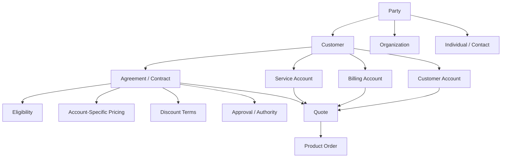
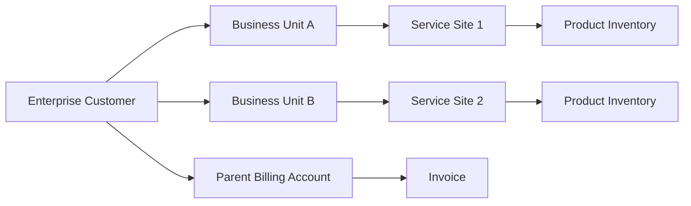
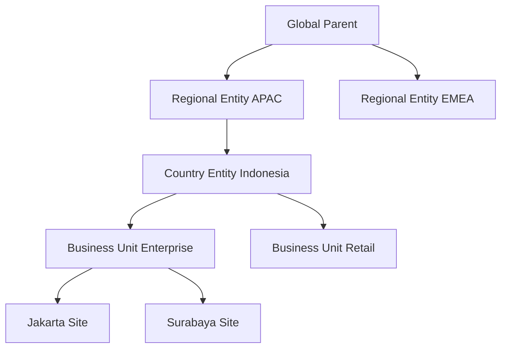
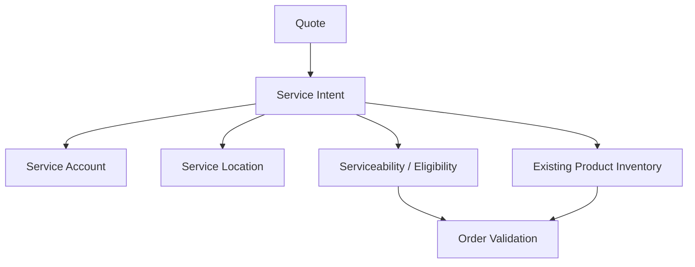
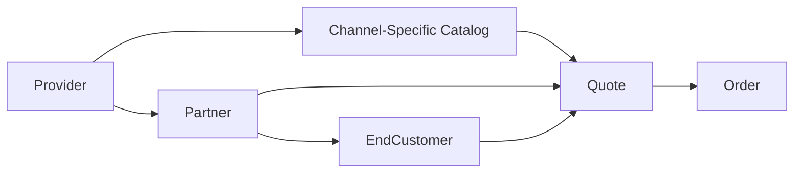
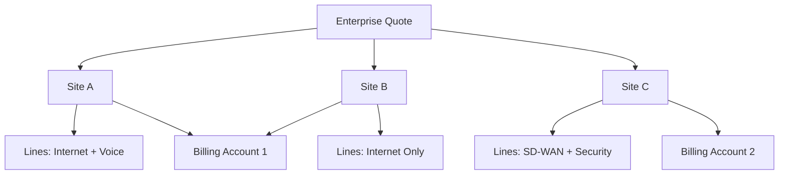
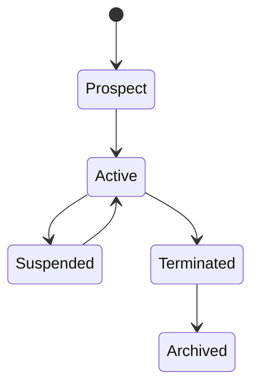
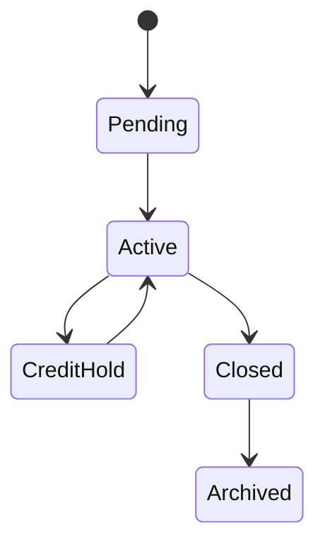
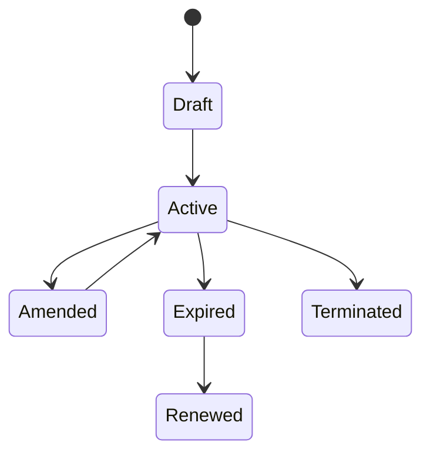
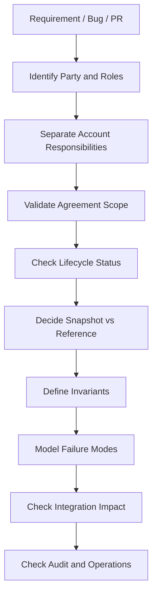

# Customer, Account, Party, and Agreement

Part ini membahas satu area yang sering diremehkan engineer baru di domain CPQ/order management: **siapa customer sebenarnya**.

Dalam ecommerce sederhana, customer sering berarti satu user, satu alamat, satu cart, satu payment method. Dalam enterprise B2B dan telco, customer bukan hanya satu record. Customer bisa berupa organization hierarchy, legal entity, buying center, billing account, service account, contact person, partner, reseller, channel, contract owner, dan agreement-specific entity.

Di CPQ/order management, struktur customer menentukan:

- produk apa yang eligible,
- harga mana yang berlaku,
- diskon apa yang boleh digunakan,
- agreement mana yang mengikat,
- siapa yang boleh approve,
- account mana yang ditagih,
- lokasi mana yang dipenuhi,
- service mana yang harus dimodifikasi,
- dan apakah quote/order sah secara bisnis.

Sebagai senior engineer, target Anda bukan sekadar tahu entity bernama `Customer`. Targetnya adalah mampu memahami **identity, relationship, responsibility, commercial entitlement, billing responsibility, service ownership, dan contractual boundary**.

---

## 1. Core Mental Model

Customer/account/party/agreement domain menjawab lima pertanyaan besar:

1. **Siapa pihak yang terlibat?**  
   Individu, organisasi, legal entity, contact, partner, reseller, agent, atau internal seller.

2. **Siapa yang membeli?**  
   Buying account, enterprise customer, organization unit, atau channel partner.

3. **Siapa yang ditagih?**  
   Billing account, invoice owner, payer, financial account, atau parent account.

4. **Siapa yang menerima service?**  
   Service account, site, location, end-user organization unit, atau subscribed product owner.

5. **Kontrak/agreement apa yang mengatur transaksi?**  
   Enterprise agreement, master service agreement, customer-specific terms, price commitment, discount schedule, minimum term, renewal rule, atau channel agreement.

A good mental model:

> Party identifies who exists. Customer/account defines commercial relationship. Agreement defines what is allowed. Billing account defines who pays. Service account defines where/for whom service is delivered.

Tidak semua sistem menggunakan istilah ini persis sama. Dalam produk enterprise, istilah bisa berbeda antar customer implementation, vertical, atau integrasi. Karena itu, part ini harus dibaca sebagai domain model industri, bukan klaim internal CSG.

---

## 2. Why This Domain Exists

Customer/account/party/agreement complexity ada karena transaksi enterprise jarang terjadi antara satu orang dan satu produk sederhana.

Contoh enterprise telco/B2B:

- perusahaan induk membeli kontrak global,
- cabang regional menggunakan produk berbeda,
- invoice dikirim ke billing account pusat,
- service dipasang di banyak site,
- discount berlaku hanya untuk unit bisnis tertentu,
- reseller membuat quote untuk end customer,
- kontrak lama masih aktif,
- upgrade hanya boleh dilakukan jika service existing memenuhi syarat,
- renew harus mengikuti agreement term,
- order modify/disconnect harus terkait product inventory existing.

Tanpa model customer/account/agreement yang benar, sistem bisa melakukan kesalahan serius:

- memberikan harga yang salah ke customer,
- menjual produk yang tidak eligible,
- mengirim invoice ke pihak yang salah,
- memodifikasi service milik account lain,
- melanggar agreement term,
- melewati approval yang seharusnya wajib,
- gagal fulfill karena service location tidak valid,
- menghasilkan audit trail yang tidak defensible.

Untuk engineer, ini berarti customer model adalah **business safety boundary**.

---

## 3. Core Concepts

### Party

**Party** adalah representasi pihak yang terlibat dalam bisnis. Party biasanya dapat berupa:

- individual,
- organization,
- legal entity,
- contact,
- partner,
- reseller,
- supplier,
- internal sales organization.

Party menjawab: “siapa entitas ini secara identitas?”

Party tidak selalu berarti customer. Seseorang bisa menjadi contact person, approver, authorized user, technical contact, billing contact, atau partner representative tanpa menjadi customer utama.

Domain invariant:

> Jangan menganggap semua party adalah customer. Party role menentukan makna bisnisnya.

### Customer

**Customer** adalah party yang memiliki hubungan komersial dengan provider.

Customer menjawab: “siapa entitas yang membeli atau berlangganan produk/jasa?”

Dalam B2B, customer sering berupa organization atau account group, bukan individual consumer.

Customer dapat memiliki:

- account,
- contact,
- billing relationship,
- agreement,
- product inventory,
- service locations,
- hierarchy,
- segment,
- channel relationship.

Domain invariant:

> Quote/order harus terikat ke customer yang valid dan aktif untuk konteks transaksi tersebut.

### Account

**Account** adalah container hubungan bisnis yang lebih operasional daripada customer. Account bisa memisahkan fungsi berbeda:

- customer account,
- billing account,
- service account,
- financial account,
- parent/child account,
- partner account,
- reseller account.

Account menjawab: “dalam kapasitas apa customer ini bertransaksi?”

Satu customer bisa memiliki banyak account. Satu account bisa terkait banyak quote/order/product inventory.

Domain invariant:

> Jangan menyamakan customer identity dengan account responsibility.

### Agreement

**Agreement** adalah kontrak, terms, atau kesepakatan komersial yang mengatur transaksi.

Agreement dapat menentukan:

- produk yang eligible,
- price list yang berlaku,
- discount schedule,
- minimum contract term,
- renewal term,
- termination fee,
- volume commitment,
- service level,
- approval exception,
- channel rights,
- customer-specific clause.

Domain invariant:

> Jika quote menggunakan agreement, price, eligibility, term, dan approval harus konsisten dengan agreement tersebut.

---

## 4. Customer Is Not Always the Payer

Salah satu kesalahan domain paling umum adalah menganggap customer yang menerima service adalah pihak yang membayar.

Dalam enterprise:

- parent company bisa membayar invoice,
- subsidiary bisa menerima service,
- procurement organization bisa menandatangani agreement,
- branch office bisa menjadi service location,
- reseller bisa membeli atas nama end customer,
- managed service provider bisa mengelola quote untuk banyak customer.

Quote/order harus tahu role masing-masing account:

| Role | Pertanyaan yang Dijawab | Dampak Domain |
|---|---|---|
| Customer account | Siapa customer komersialnya? | eligibility, relationship, ownership |
| Billing account | Siapa yang ditagih? | invoice, billing activation, tax context |
| Service account | Siapa/lokasi mana yang menerima service? | fulfillment, serviceability, inventory |
| Agreement owner | Kontrak mana yang mengikat? | pricing, discount, term, renewal |
| Contact | Siapa yang dihubungi? | notification, approval, signature |

Failure mode:

- quote valid untuk customer account, tetapi billing account tidak valid,
- service account berbeda legal entity,
- agreement milik parent tetapi order dibuat untuk child yang tidak covered,
- billing account inactive saat order activation,
- service address tidak sesuai service account.

Senior engineer harus selalu bertanya:

> Account mana yang sedang kita gunakan untuk rule ini?

---

## 5. Organization Hierarchy

Enterprise customer sering memiliki hierarchy:

- global parent,
- regional entity,
- country entity,
- business unit,
- department,
- site,
- cost center,
- legal entity,
- reseller/end-customer relationship.

Hierarchy memengaruhi banyak rule:

- apakah agreement parent berlaku ke child,
- apakah discount volume dihitung per group atau per account,
- apakah quote bisa mencakup multi-site,
- apakah approval authority berada di parent atau local entity,
- apakah invoice consolidated atau separated,
- apakah product inventory dapat dipindahkan antar account,
- apakah order modify boleh menyentuh asset milik sibling account.

Domain invariant:

> Hierarchy traversal harus eksplisit. Jangan diam-diam mewariskan agreement, pricing, atau eligibility tanpa rule yang jelas.

Pertanyaan penting:

- Apakah parent agreement berlaku ke semua child?
- Apakah child bisa override parent term?
- Apakah quote multi-site bisa mencakup beberapa legal entity?
- Apakah invoice perlu dipisah berdasarkan cost center?
- Apakah discount dihitung berdasarkan total commitment parent atau account lokal?
- Apakah tax/regulatory context berubah per country/entity?

---

## 6. Contact Is Not Authority

Contact sering hanya orang yang bisa dihubungi, bukan orang yang berwenang mengambil keputusan.

Jenis contact:

- sales contact,
- technical contact,
- billing contact,
- legal contact,
- procurement contact,
- order contact,
- site contact,
- escalation contact,
- signatory,
- approval delegate.

Kesalahan umum:

- mengirim approval ke contact yang tidak punya authority,
- menggunakan billing contact sebagai legal signatory,
- mengirim order notification ke sales contact saja,
- tidak menyimpan contact role di audit trail,
- tidak menangani perubahan contact setelah quote dibuat.

Domain invariant:

> Contact role harus sesuai dengan business action yang dilakukan.

Contoh:

| Action | Contact/Role yang Relevan |
|---|---|
| Quote discussion | sales/procurement contact |
| Price approval | authorized approver/internal approver |
| Contract acceptance | signatory/legal contact |
| Install scheduling | site/technical contact |
| Invoice issue | billing contact |
| Fulfillment fallout | technical/escalation contact |

Senior engineer perlu menghindari assumption “customer contact = semua role”.

---

## 7. Billing Account

Billing account menentukan bagaimana charge dikirim ke billing/charging/invoicing system.

Billing account biasanya terkait:

- invoice owner,
- billing address,
- payment term,
- tax profile,
- currency,
- billing cycle,
- consolidated billing,
- credit status,
- collection status,
- payer identity,
- billing hierarchy.

Dalam quote/order, billing account dapat memengaruhi:

- apakah quote boleh diterima,
- apakah order boleh dibuat,
- charge mana yang dibuat,
- effective date billing,
- invoice split,
- taxation,
- credit check,
- billing activation.

Domain invariant:

> Billing account yang digunakan pada quote/order harus valid untuk customer, agreement, currency, tax context, dan lifecycle action.

Failure mode:

- billing account inactive,
- billing account tidak belong ke customer,
- quote menggunakan currency berbeda dari billing account,
- account dalam credit hold tetapi order tetap dibuat,
- billing activation gagal karena billing account tidak dikenal downstream,
- invoice split tidak sesuai multi-site quote.

Internal check yang penting:

- Apakah billing account wajib saat quote, saat order, atau saat activation?
- Apakah billing account bisa berubah setelah quote approved?
- Apakah billing account disnapshot di quote/order?
- Apakah billing account divalidasi secara sync atau async?
- Bagaimana downstream billing rejection direpresentasikan di order lifecycle?

---

## 8. Service Account and Service Location

Service account menjawab: “service ini diberikan kepada siapa/di mana?”

Dalam telco, service account sering terkait:

- service address,
- installation site,
- product inventory,
- service inventory,
- serviceability,
- coverage area,
- network feasibility,
- technical contact,
- site access detail,
- maintenance responsibility.

Service account penting untuk order action seperti:

- add new service,
- modify existing service,
- disconnect service,
- suspend/resume,
- move service,
- upgrade/downgrade,
- renew existing product.

Domain invariant:

> Order modify/disconnect harus menunjuk inventory/service yang benar milik service account yang benar.

Failure mode:

- disconnect service milik account lain,
- modify product inventory yang sudah inactive,
- upgrade service yang tidak eligible di lokasi tersebut,
- fulfillment gagal karena site tidak serviceable,
- quote multi-site tidak memvalidasi per-site eligibility,
- billing account valid tetapi service account invalid.

Dalam review requirement, jangan hanya tanya “customer siapa?” Tanya juga:

- service account mana?
- location mana?
- existing asset mana?
- apakah product inventory active?
- apakah action add/modify/disconnect?
- apakah serviceability sudah dicek?

---

## 9. Contract and Enterprise Agreement

Contract/agreement adalah anchor untuk commercial entitlement.

Agreement bisa berupa:

- master service agreement,
- enterprise agreement,
- product-specific contract,
- pricing agreement,
- volume commitment,
- reseller agreement,
- partner agreement,
- amendment,
- renewal agreement,
- statement of work,
- service level agreement.

Agreement dapat mengatur:

- allowed product offering,
- price list,
- discount band,
- contract term,
- renewal rule,
- minimum commitment,
- early termination fee,
- approval exceptions,
- escalation rule,
- billing terms,
- service level,
- geography,
- customer hierarchy coverage,
- effective/expiration dates.

Domain invariant:

> Agreement tidak boleh hanya menjadi reference label; agreement harus memengaruhi rule yang memang diklaim berasal darinya.

Jika quote menampilkan “under agreement X”, maka sistem harus jelas:

- harga mana dari agreement,
- discount mana dari agreement,
- product eligibility mana dari agreement,
- customer/account coverage mana dari agreement,
- effective date mana dari agreement,
- term/renewal mana dari agreement,
- approval waiver/exception mana dari agreement.

Failure mode:

- expired agreement masih digunakan,
- agreement tidak mencakup child account,
- quote menggunakan agreement untuk produk yang tidak covered,
- price override melampaui allowed discount,
- renewal term tidak mengikuti agreement,
- agreement amendment tidak diterapkan ke revised quote,
- audit tidak bisa menjelaskan kenapa harga diberikan.

---

## 10. Customer-Specific Terms

Enterprise CPQ sering membutuhkan customer-specific terms.

Contoh:

- special discount,
- negotiated price,
- custom billing cycle,
- special payment term,
- non-standard SLA,
- custom termination rule,
- minimum revenue commitment,
- custom installation fee waiver,
- non-standard product option,
- customer-specific eligibility,
- exception approval.

Customer-specific terms berbahaya jika tidak dikelola dengan governance. Ia bisa membuat sistem berubah dari productized platform menjadi kumpulan exception.

Domain invariant:

> Customer-specific terms harus traceable, scoped, versioned, auditable, dan tidak diam-diam bocor ke customer lain.

Pertanyaan penting:

- Apakah term ini berlaku untuk customer, account, site, agreement, product, atau quote tertentu?
- Apakah term ini sementara atau permanen?
- Apakah term ini override catalog, price list, approval rule, atau agreement?
- Apakah term ini boleh diwariskan ke child accounts?
- Apakah term ini harus muncul di quote document?
- Apakah downstream billing/provisioning memahami term ini?

Failure mode:

- exception customer A dipakai customer B,
- custom discount tidak punya approval/audit,
- custom term tidak diteruskan ke billing,
- custom option tidak bisa fulfilled,
- renewed quote kehilangan negotiated term,
- revised quote memakai term lama yang sudah expired.

---

## 11. Partner, Reseller, and Channel

Dalam enterprise/telco, tidak semua penjualan langsung dari provider ke end customer.

Ada channel model:

- direct sales,
- partner sales,
- reseller,
- distributor,
- agent,
- system integrator,
- managed service provider,
- wholesale/B2B2X.

Channel memengaruhi:

- siapa yang membuat quote,
- siapa yang menjadi seller of record,
- siapa end customer,
- harga partner vs end-customer price,
- commission,
- allowed product catalog,
- approval path,
- contract relationship,
- billing relationship,
- fulfillment responsibility,
- support ownership.

Domain invariant:

> Channel role harus eksplisit dalam quote/order karena ia mengubah pricing, entitlement, contract, billing, dan accountability.

Failure mode:

- reseller melihat product offering yang hanya untuk direct sales,
- partner discount diperlakukan sebagai customer discount,
- end customer tidak disimpan sehingga inventory ownership salah,
- invoice dikirim ke end customer padahal partner yang harus ditagih,
- quote approval mengikuti direct sales path, bukan channel path,
- fulfillment ownership tidak jelas saat fallout.

Pertanyaan review:

- Apakah `customer` di story berarti reseller atau end customer?
- Siapa bill-to, sell-to, ship-to/service-to?
- Apakah catalog/pricing channel-specific?
- Apakah partner agreement berbeda dari customer agreement?
- Apakah downstream systems butuh partner identity?

---

## 12. Multi-Site Customer

Multi-site adalah salah satu sumber kompleksitas terbesar.

Satu quote bisa mencakup:

- beberapa lokasi,
- beberapa service accounts,
- beberapa billing accounts,
- beberapa product bundles,
- beberapa installation schedules,
- beberapa fulfillment dependencies,
- beberapa local eligibility/serviceability results,
- consolidated atau split billing.

Multi-site quote bukan sekadar quote dengan banyak line item. Ia memiliki structure, grouping, dependency, dan exception path.

Contoh:

Domain questions:

- Apakah approval dilakukan per quote atau per site?
- Apakah price discount dihitung per site atau aggregate?
- Apakah failure di satu site membatalkan seluruh order?
- Apakah partial acceptance allowed?
- Apakah billing split per site?
- Apakah serviceability dicek per location?
- Apakah contract term sama untuk semua site?
- Apakah fulfillment dapat berjalan paralel?

Domain invariant:

> Multi-site quote/order harus punya grouping semantics yang eksplisit; jangan hanya mengandalkan line item list datar.

Failure mode:

- satu site ineligible tetapi quote tetap accepted,
- price aggregation salah karena site grouping hilang,
- order decomposition tidak tahu site boundary,
- cancellation satu site membatalkan semua site,
- invoice split salah,
- fulfillment status global tidak merefleksikan partial completion.

---

## 13. Customer/Account Snapshot vs Reference

Pertanyaan penting dalam quote/order lifecycle:

> Apakah data customer/account/agreement disimpan sebagai snapshot atau reference?

Reference berarti quote/order menunjuk ke current customer/account/agreement data.

Snapshot berarti quote/order menyimpan salinan informasi penting saat transaksi dibuat/disetujui.

Keduanya punya trade-off:

| Approach | Kelebihan | Risiko |
|---|---|---|
| Reference | selalu melihat data terbaru | quote lama bisa berubah makna jika customer/agreement berubah |
| Snapshot | audit kuat, quote stable | data bisa stale jika perlu perubahan valid |
| Hybrid | stable untuk commercial facts, fresh untuk operational checks | butuh rule jelas mana yang snapshot vs live |

Untuk CPQ/order management, biasanya perlu hybrid:

- quote document perlu snapshot commercial terms,
- order fulfillment perlu validasi live untuk account/serviceability tertentu,
- audit perlu tahu data saat decision dibuat,
- downstream integration perlu identifier referential yang stabil.

Domain invariant:

> Commercial commitment harus audit-stable; operational execution boleh memerlukan live revalidation dengan rule yang jelas.

Failure mode:

- agreement berubah setelah quote approved lalu harga quote ikut berubah,
- contact berubah lalu audit signature tidak jelas,
- billing account inactive setelah quote accepted tapi sebelum order activation,
- customer hierarchy berubah dan quote menjadi ambigu,
- snapshot tidak mencakup field penting untuk audit.

Review question:

- Field mana yang harus immutable setelah quote approval?
- Field mana yang boleh refresh saat order creation?
- Perubahan customer/account mana yang membatalkan quote?
- Apakah quote perlu revalidation sebelum accept/order?
- Bagaimana audit menjelaskan data yang digunakan saat pricing/approval?

---

## 14. Lifecycle Impact

Customer/account/agreement bukan data statis. Ia punya lifecycle sendiri.

Customer lifecycle:

Account lifecycle:

Agreement lifecycle:

Dampak ke quote/order:

- Prospect mungkin boleh dibuat quote tetapi belum boleh dibuat order.
- Active customer boleh quote/order jika account valid.
- Suspended customer mungkin tidak boleh new sale tetapi boleh disconnect.
- Credit hold mungkin butuh approval atau blokir order.
- Expired agreement tidak boleh dipakai untuk new quote.
- Amended agreement mungkin memerlukan quote repricing.
- Terminated customer tidak boleh modify kecuali disconnect/settlement.

Domain invariant:

> Action yang allowed tergantung kombinasi lifecycle customer, account, agreement, quote, order, dan product inventory.

Jangan hanya cek satu status.

---

## 15. Eligibility Driven by Customer and Agreement

Eligibility bukan hanya product catalog problem. Customer/account/agreement sering menentukan eligibility.

Contoh rule:

- produk A hanya untuk enterprise segment,
- produk B hanya untuk customer dengan agreement tertentu,
- add-on C hanya untuk account yang sudah punya base product,
- discount D hanya untuk government customer,
- promo E hanya untuk new acquisition, bukan renewal,
- service F hanya untuk site dengan coverage tertentu,
- upgrade G hanya untuk inventory existing dengan technology type tertentu,
- reseller H hanya boleh menjual product family tertentu.

Eligibility input bisa berasal dari:

- customer segment,
- account type,
- agreement,
- channel,
- geography,
- service location,
- existing inventory,
- credit status,
- contract term,
- regulatory constraints.

Domain invariant:

> Eligibility decision harus explainable: sistem harus bisa menjelaskan kenapa produk boleh/tidak boleh dijual.

Failure mode:

- eligibility hanya dicek di UI, tetapi API/order bypass bisa membuat invalid sale,
- eligibility dicek saat quote draft tetapi tidak dicek ulang saat submit/accept,
- agreement coverage tidak dipertimbangkan,
- site-level eligibility diabaikan untuk multi-site quote,
- inventory-based eligibility stale.

---

## 16. Agreement-Driven Pricing

Agreement sering memengaruhi pricing:

- negotiated price,
- discount tier,
- volume commitment,
- bundle discount,
- term-based discount,
- customer-specific rate card,
- channel margin,
- installation fee waiver,
- usage charge cap,
- minimum monthly commitment.

Pricing dari agreement harus memiliki traceability.

Contoh line price harus bisa menjawab:

- base catalog price dari mana?
- agreement price dari mana?
- discount term mana yang diterapkan?
- siapa yang approve override?
- apakah price masih valid pada quote date?
- apakah price valid pada service start date?
- apakah pricing berlaku untuk account/site ini?

Domain invariant:

> Agreement-driven price harus scoped dan versioned. Tidak cukup menyimpan final amount.

Failure mode:

- final price tersimpan tetapi asalnya tidak traceable,
- agreement amended tetapi quote lama tidak jelas mengikuti versi mana,
- discount diterapkan ke product yang tidak covered,
- price list global tertimpa customer-specific price tanpa audit,
- renewal memakai price lama padahal agreement term berubah.

---

## 17. Customer/Account and Product Inventory Relationship

Untuk order action `modify`, `disconnect`, `suspend`, `resume`, sistem harus tahu product inventory existing.

Product inventory biasanya terkait ke:

- customer,
- account,
- service account,
- location,
- product offering/specification,
- service/resource inventory,
- agreement,
- billing account,
- lifecycle status,
- installed date,
- term/contract period.

Domain invariant:

> Lifecycle action terhadap existing product harus memvalidasi ownership, status, agreement, dan action compatibility.

Contoh:

| Action | Validasi Domain |
|---|---|
| Modify | inventory active, modifiable, customer owns it |
| Disconnect | inventory active/suspended, termination rule valid |
| Suspend | suspend allowed by product/agreement/status |
| Resume | previous suspension valid, account not blocked |
| Upgrade | target offering compatible, location serviceable |
| Renew | term eligible, agreement/price valid |

Failure mode:

- order modify menunjuk inventory wrong account,
- disconnect diterapkan ke product yang sudah disconnected,
- upgrade product incompatible dengan existing asset,
- renew product tanpa agreement active,
- billing tetap jalan setelah disconnect karena inventory linkage salah.

---

## 18. API, Event, Database, Workflow, Testing, and Operations Impact

### API impact

Customer/account/agreement domain memengaruhi API design:

- apakah quote create membutuhkan customer account?
- apakah billing account optional atau mandatory?
- apakah service account per line item atau quote-level?
- bagaimana agreement direferensikan?
- apakah contact role eksplisit?
- apakah channel/end customer disimpan?
- apakah customer snapshot dikembalikan di response?
- apakah validation endpoint menjelaskan eligibility failure?

Anti-pattern:

- satu field `customerId` digunakan untuk semua role,
- account references optional tanpa rule jelas,
- agreement hanya string bebas,
- contact tanpa role,
- no version/effective date pada agreement reference.

### Event impact

Event yang melibatkan customer/account/agreement harus cukup kaya untuk consumer.

Contoh event:

- QuoteCreated,
- QuotePriced,
- QuoteSubmitted,
- QuoteAccepted,
- ProductOrderCreated,
- BillingAccountValidated,
- AgreementApplied,
- CustomerEligibilityRejected.

Event harus menjawab:

- customer/account mana?
- role account apa?
- agreement mana dan versi mana?
- apakah event merepresentasikan snapshot atau reference?
- apakah consumer perlu re-fetch?
- apakah perubahan customer/account/agreement harus trigger revalidation?

### Database impact

Model persistence harus memperhatikan:

- relationship cardinality,
- hierarchy,
- role mapping,
- snapshot tables,
- audit history,
- effective-dated records,
- cross-reference external IDs,
- soft delete/status lifecycle,
- indexing untuk account lookup.

Anti-pattern:

- flatten semua account menjadi satu column,
- tidak menyimpan role,
- tidak menyimpan agreement version,
- tidak ada audit history untuk commercial data,
- menghapus account yang pernah dipakai quote/order.

### Workflow impact

Workflow harus memperhatikan status customer/account/agreement:

- quote submission blocked jika customer inactive,
- approval required jika discount di luar agreement,
- order creation blocked jika billing account invalid,
- fulfillment blocked jika service account/location invalid,
- amendment required jika agreement berubah,
- fallout jika downstream customer/account mapping mismatch.

### Testing impact

Test scenario minimal:

- customer active vs inactive,
- billing account valid vs inactive,
- service account valid vs unrelated,
- parent agreement applies vs does not apply to child,
- multi-site quote with mixed eligibility,
- partner/reseller/end customer quote,
- agreement expired after quote draft,
- customer hierarchy changed after quote approved,
- quote accepted with billing account credit hold.

### Operations impact

Operationally, team perlu bisa menjawab:

- quote/order ini milik customer/account mana?
- kenapa eligibility gagal?
- agreement apa yang dipakai?
- kenapa billing handoff ditolak?
- apakah account mapping ke downstream benar?
- apakah customer data berubah setelah quote dibuat?
- apakah failure recoverable atau butuh manual correction?

---

## 19. Business Invariants

Gunakan daftar ini saat review requirement, PR, bug, atau design:

1. **Party role must be explicit.**  
   Individual/organization/contact/partner/customer tidak boleh dicampur.

2. **Customer identity is not account responsibility.**  
   Customer account, billing account, service account, agreement owner bisa berbeda.

3. **Agreement usage must be scoped.**  
   Agreement harus valid untuk customer/account/product/site/channel/date.

4. **Commercial commitment must be audit-stable.**  
   Quote approved/accepted harus menyimpan fakta komersial yang diperlukan.

5. **Service action must validate ownership.**  
   Modify/disconnect/suspend/resume harus terkait inventory yang benar.

6. **Hierarchy inheritance must be rule-based.**  
   Parent-child account tidak otomatis mewariskan pricing/agreement.

7. **Contact authority must not be assumed.**  
   Contact role harus sesuai action.

8. **Billing and service responsibility must be separable.**  
   Bill-to dan service-to bisa berbeda dan harus divalidasi.

9. **Customer-specific terms must not leak.**  
   Scope dan version harus jelas.

10. **Lifecycle status matters.**  
   Customer/account/agreement status harus cocok dengan action.

---

## 20. Failure Modes

| Failure Mode | Gejala | Penyebab Umum | Dampak |
|---|---|---|---|
| Wrong account role | invoice/fulfillment salah | satu `accountId` dipakai untuk semua role | billing mismatch, failed fulfillment |
| Expired agreement used | price/terms tidak valid | agreement effective date tidak dicek | commercial leakage, audit issue |
| Parent-child misuse | child mendapat entitlement salah | hierarchy inheritance implicit | wrong eligibility/pricing |
| Contact authority mismatch | approval/signature invalid | contact role tidak dimodelkan | legal/audit risk |
| Billing account invalid | activation gagal | account status tidak dicek | order fallout |
| Service account mismatch | wrong location/service | quote line tidak punya service account jelas | failed provisioning |
| Customer-specific leak | customer lain mendapat term khusus | scope rule salah | revenue leakage |
| Stale customer data | quote berubah makna | reference-only model | audit inconsistency |
| Inventory ownership error | modify asset salah | product inventory relation lemah | customer-impacting incident |
| Channel confusion | partner/end customer tertukar | channel role tidak eksplisit | contract, pricing, billing issue |

---

## 21. Requirement Review Questions

Saat membaca user story terkait customer/account/agreement, tanyakan:

### Identity and role

- Siapa party yang terlibat?
- Mana customer, mana account, mana contact, mana partner?
- Apakah customer adalah legal entity, organization unit, reseller, atau end customer?
- Apakah contact punya role tertentu?

### Account responsibility

- Account mana yang digunakan untuk sell-to, bill-to, service-to?
- Apakah billing account dan service account bisa berbeda?
- Apakah quote line item butuh account berbeda per site/product?
- Apakah customer hierarchy relevan?

### Agreement and entitlement

- Agreement mana yang berlaku?
- Apakah agreement active pada quote date, acceptance date, atau service start date?
- Apakah agreement berlaku untuk child account/site/product/channel ini?
- Apakah agreement memengaruhi pricing, eligibility, approval, atau term?

### Lifecycle

- Customer/account/agreement status apa yang allowed untuk action ini?
- Apa yang terjadi jika customer/account/agreement berubah setelah quote dibuat?
- Apakah quote harus revalidated?
- Apakah order boleh lanjut jika billing account berubah status?

### Audit and operations

- Fakta apa yang harus disnapshot?
- Apa yang harus muncul di audit trail?
- Bagaimana support menjelaskan kenapa quote/order valid atau invalid?
- Bagaimana downstream rejection dikorelasikan ke account/agreement?

---

## 22. PR and Design Review Checklist

Gunakan checklist ini saat review perubahan code/design:

### Model correctness

- Apakah party/customer/account/contact/agreement dibedakan?
- Apakah account role eksplisit?
- Apakah relationship cardinality benar?
- Apakah hierarchy traversal eksplisit?
- Apakah channel/end-customer role jelas?

### Lifecycle correctness

- Apakah status customer/account/agreement divalidasi?
- Apakah effective/expiration date digunakan dengan benar?
- Apakah quote/order revalidation diperlukan?
- Apakah action add/modify/disconnect memperhatikan product inventory ownership?

### Commercial correctness

- Apakah agreement-driven price/discount traceable?
- Apakah customer-specific term scoped?
- Apakah approval rule mempertimbangkan agreement/account/channel?
- Apakah quote approved/accepted immutable untuk fakta penting?

### Integration correctness

- Apakah external customer/account IDs disimpan?
- Apakah downstream billing/service systems menerima role yang benar?
- Apakah event payload cukup untuk consumer?
- Apakah retry/reconciliation mempertahankan mapping account/agreement?

### Auditability

- Apakah snapshot cukup untuk menjelaskan decision?
- Apakah agreement version tersimpan?
- Apakah contact/signatory role tersimpan?
- Apakah perubahan customer/account/agreement historis bisa dilacak?

---

## 23. Internal Verification Checklist

Hal yang perlu dicek di internal CSG/team:

### Domain glossary

- Istilah resmi untuk Party, Customer, Account, Contact, Agreement.
- Apakah istilah berbeda antara UI, API, database, dan business team.
- Definisi customer account, billing account, service account.

### Product/demo flow

- Bagaimana user memilih customer saat membuat quote.
- Kapan billing account dipilih.
- Kapan service account/site dipilih.
- Bagaimana agreement diterapkan ke quote.
- Bagaimana quote multi-site ditampilkan dan divalidasi.

### Codebase/schema/API

- Entity/API resource untuk customer/account/party/agreement.
- Apakah account role eksplisit atau implicit.
- Apakah agreement memiliki version/effective date.
- Apakah quote/order menyimpan snapshot atau reference.
- Apakah external customer/account IDs digunakan untuk integration.

### Backlog/user story

- Story terkait enterprise customer hierarchy.
- Story terkait billing account/service account.
- Story terkait agreement-driven pricing.
- Story terkait reseller/partner/channel.
- Story terkait customer-specific terms.

### Event catalog

- Event yang membawa customer/account/agreement data.
- Apakah payload menggunakan role eksplisit.
- Apakah agreement/customer/account changes trigger revalidation.

### Incidents/bugs

- Wrong billing account.
- Wrong customer eligibility.
- Agreement expired but used.
- Multi-site quote pricing issue.
- Customer-specific discount leakage.
- Order fallout due to account mismatch.

### People to ask

- Product owner: business meaning of customer/account roles.
- Business analyst: acceptance criteria around account/agreement.
- Solution architect: downstream account mapping.
- Senior engineer: where customer/account rules live in code.
- Support/operations: common account/agreement-related fallout.

---

## 24. Senior Engineer Operating Model

Saat bekerja di area customer/account/agreement, gunakan operating model berikut:

Prinsipnya:

- Jangan percaya nama field terlalu cepat.
- Cari role, bukan hanya ID.
- Bedakan commercial responsibility dari operational responsibility.
- Cek agreement scope sebelum menerapkan pricing/eligibility.
- Tentukan data mana yang harus immutable.
- Jangan abaikan multi-site dan hierarchy.
- Pastikan failure bisa dijelaskan dan dipulihkan.

---

## 25. Key Takeaways

- Customer dalam enterprise CPQ/telco adalah struktur relasi, bukan satu object sederhana.
- Party, customer, account, contact, billing account, service account, partner, dan agreement memiliki makna domain berbeda.
- Agreement adalah sumber entitlement dan commercial constraint; penggunaannya harus scoped, versioned, dan auditable.
- Billing responsibility dan service responsibility sering berbeda.
- Organization hierarchy tidak boleh digunakan tanpa inheritance rule yang jelas.
- Customer-specific terms adalah power tool sekaligus risk source.
- Quote/order harus menjaga audit stability terhadap commercial commitment.
- Modify/disconnect/suspend/resume membutuhkan validasi ownership product inventory.
- Senior engineer harus mereview customer/account/agreement change dari sisi identity, responsibility, entitlement, lifecycle, integration, dan auditability.

Part berikutnya membahas **Pricing, Discounting, Margin, and Approval**: bagaimana commercial engine menentukan harga, diskon, margin, override, approval threshold, dan auditability dalam quote lifecycle.
