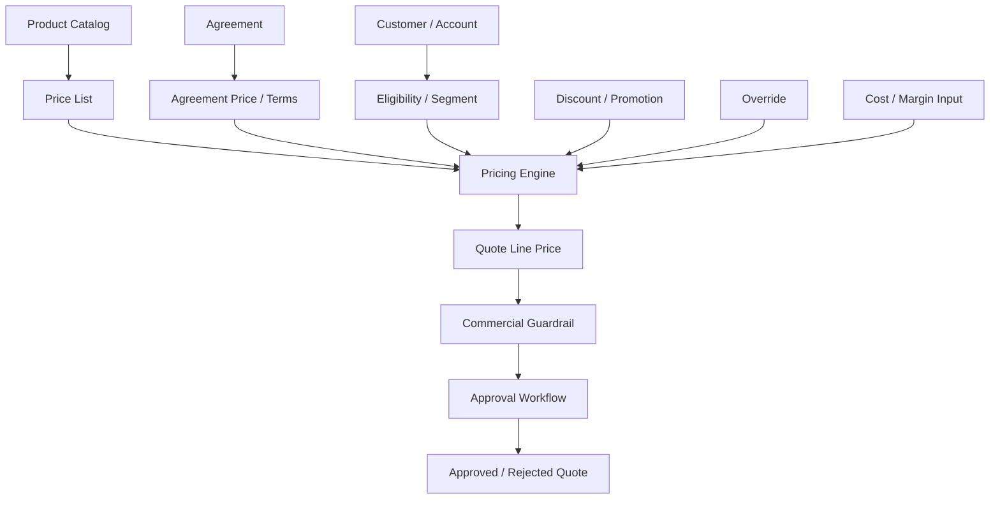
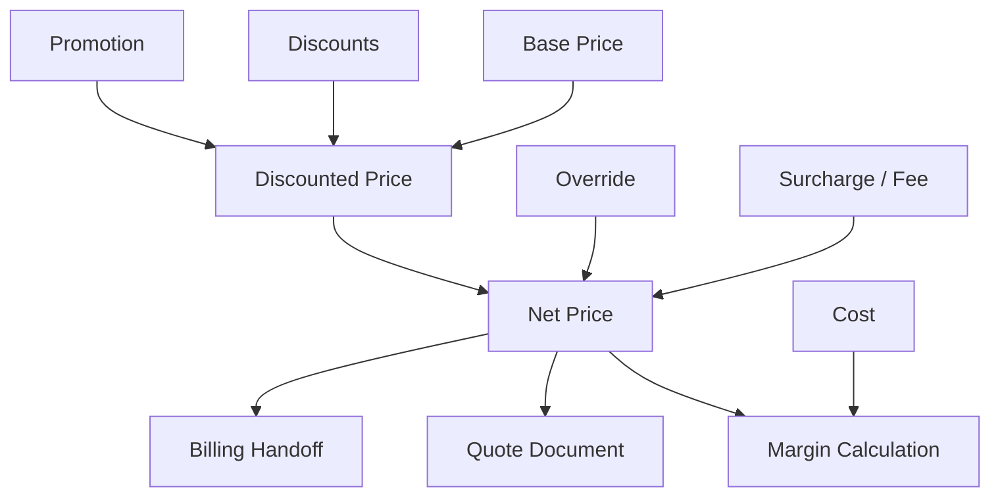
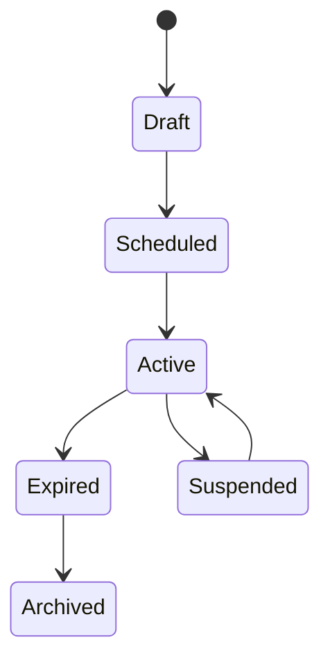
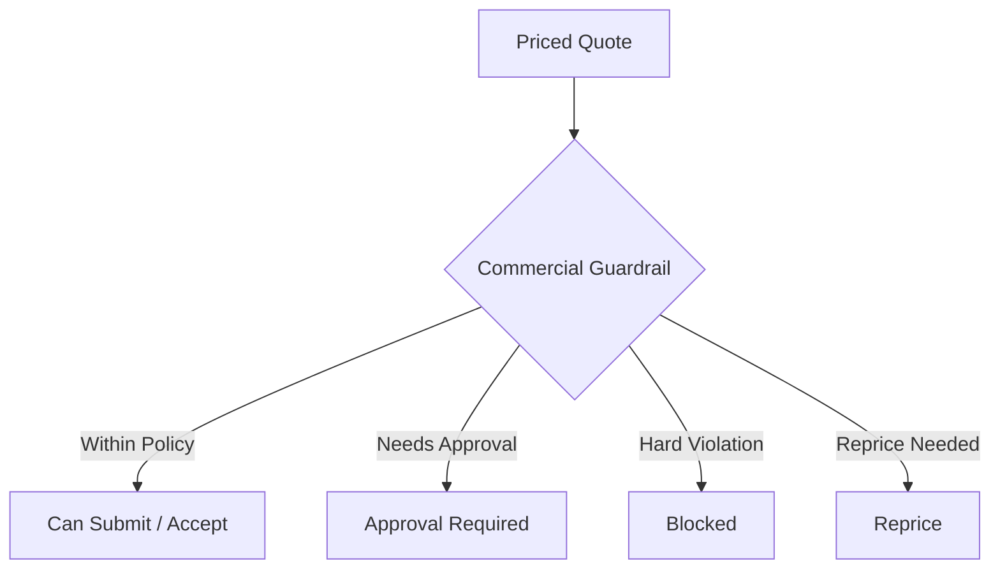
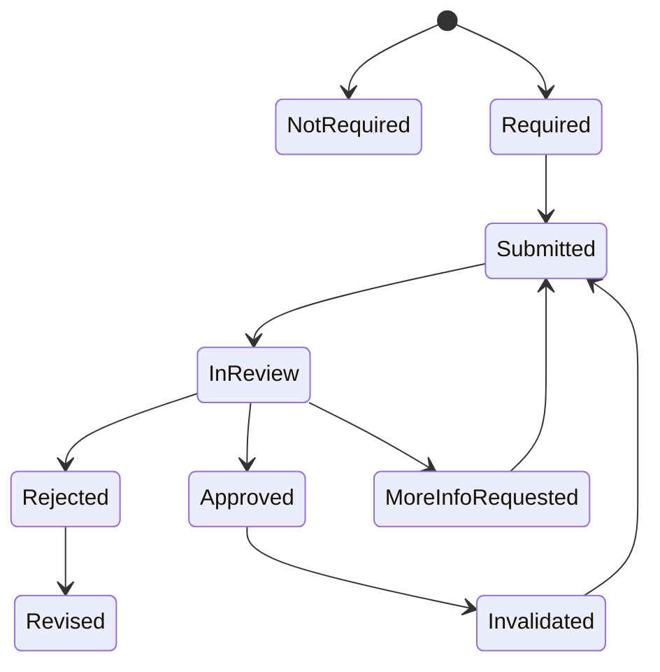
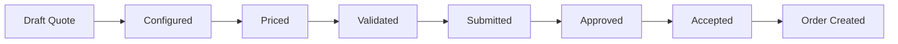
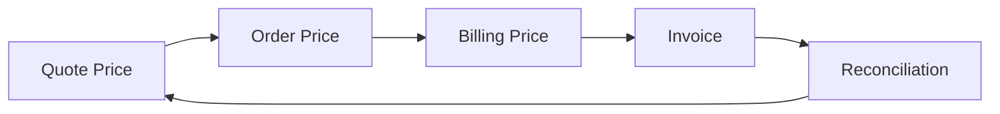
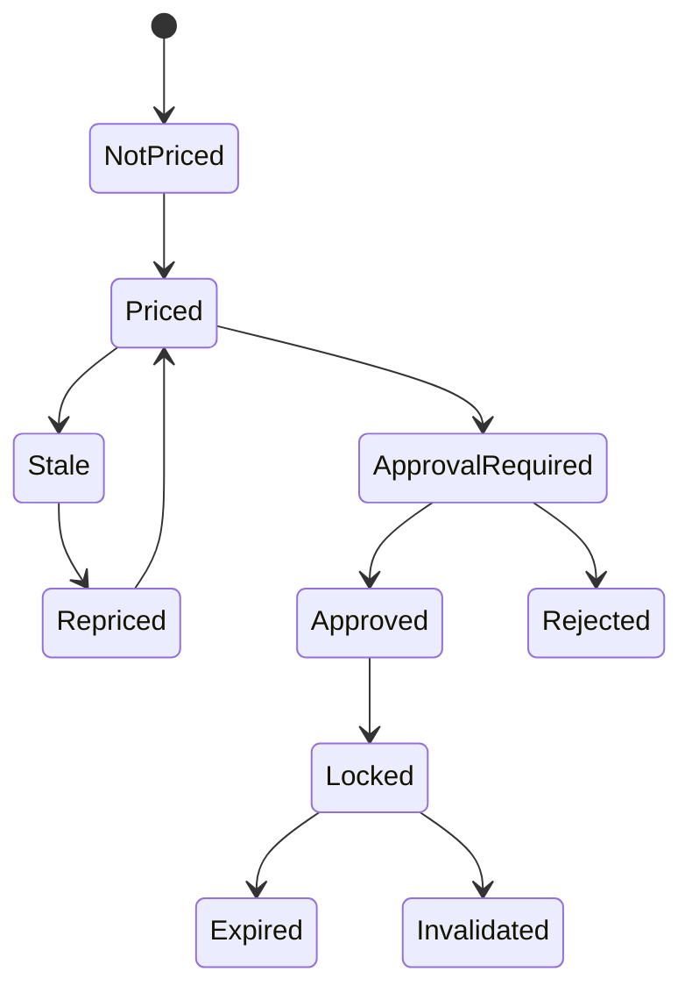
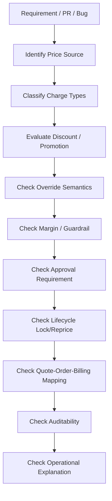

# Pricing, Discounting, Margin, and Approval

Part ini membahas bagian CPQ yang paling sensitif secara bisnis: **harga**.

Dalam sistem enterprise CPQ/order management, pricing bukan sekadar `unitPrice * quantity`. Pricing adalah hasil dari kombinasi product catalog, price list, charge type, agreement, customer segment, account context, discount, promotion, override, margin rule, approval policy, tax/billing context, effective date, dan audit requirement.

Harga yang salah bisa langsung berdampak pada revenue leakage, margin erosion, customer dispute, failed approval, quote rejection, billing mismatch, atau kontrak yang tidak defensible.

Sebagai senior engineer, target Anda bukan menjadi pricing analyst. Targetnya adalah mampu memahami **pricing lifecycle, commercial invariants, approval guardrails, recalculation risk, audit trail, and failure modes** agar perubahan code/design tidak merusak business correctness.

---

## 1. Core Mental Model

Pricing domain menjawab tujuh pertanyaan:

1. **Apa harga dasar produk?**  
   Price list, catalog price, rate card, market price, channel price.

2. **Charge type apa yang digunakan?**  
   Recurring charge, one-time charge, usage charge, consumption charge, penalty, fee, credit.

3. **Apakah customer/agreement punya harga khusus?**  
   Negotiated price, agreement price, account-specific rate, volume tier.

4. **Diskon/promosi apa yang valid?**  
   Product discount, bundle discount, term discount, promo, campaign, manual discount.

5. **Apakah override diperbolehkan?**  
   Manual price override, discount override, fee waiver, exception pricing.

6. **Apakah margin/profitability masih acceptable?**  
   Cost, floor price, margin threshold, profitability guardrail.

7. **Apakah perlu approval?**  
   Approval threshold, delegation of authority, commercial policy, audit.



Good pricing system tidak hanya menghasilkan angka. Ia juga menghasilkan **explanation**:

- harga berasal dari mana,
- rule mana yang digunakan,
- discount mana yang diterapkan,
- override mana yang dilakukan,
- approval mana yang dibutuhkan,
- margin apa yang dihasilkan,
- dan apakah harga itu masih valid pada waktu quote diterima.

---

## 2. Why Pricing Is Hard

Pricing sulit karena ia berada di pertemuan banyak domain:

- product catalog menentukan apa yang bisa dijual,
- customer/account menentukan eligibility dan commercial terms,
- agreement menentukan negotiated price atau discount,
- sales policy menentukan diskon yang boleh diberikan,
- finance menentukan margin/floor price,
- legal/contract menentukan validity dan terms,
- billing menentukan charge yang benar,
- approval workflow menentukan siapa yang boleh menyetujui exception,
- audit menentukan evidence yang harus tersedia.

Pricing failure sering bukan bug aritmatika. Biasanya failure terjadi karena konteks bisnis salah.

Contoh:

- price list benar, tetapi effective date salah,
- discount benar, tetapi tidak berlaku untuk product/site/channel itu,
- agreement benar, tetapi tidak berlaku untuk child account,
- override benar secara UI, tetapi tidak punya approval,
- margin dihitung, tetapi cost basis stale,
- quote approved, lalu repricing diam-diam mengubah commercial commitment,
- billing menerima charge berbeda dari quote.

Domain invariant:

> Harga harus benar untuk konteks customer, account, product, agreement, channel, date, quantity, term, currency, and lifecycle state.

---

## 3. Price List

**Price list** adalah daftar harga yang berlaku untuk produk/offer dalam konteks tertentu.

Price list biasanya punya:

- price list ID,
- name,
- currency,
- market/region,
- customer segment,
- channel,
- effective date,
- expiration date,
- product offering reference,
- charge type,
- unit of measure,
- tax inclusion/exclusion indicator,
- status/lifecycle.

Price list dapat berbeda berdasarkan:

- country,
- currency,
- customer segment,
- direct vs partner channel,
- enterprise vs SMB,
- contract term,
- volume band,
- product version,
- campaign period.

Domain invariant:

> Price list selection must be deterministic and explainable.

Jika dua price list sama-sama eligible, sistem harus punya precedence rule. Jika tidak ada price list yang eligible, sistem harus gagal dengan alasan yang jelas, bukan default ke harga nol atau harga random.

Failure mode:

- overlapping effective dates,
- multiple active price lists tanpa precedence,
- expired price list masih digunakan,
- wrong currency,
- wrong channel,
- price list product version mismatch,
- fallback price tidak diaudit,
- price list change mengubah quote lama.

Review questions:

- Bagaimana price list dipilih?
- Apa precedence rule jika ada lebih dari satu?
- Apakah effective date berdasarkan quote date, order date, service start date, atau billing start date?
- Apakah quote menyimpan price list version?
- Apakah price list bisa berubah setelah quote approved?

---

## 4. Charge Types

Dalam telco/enterprise, harga biasanya terdiri dari beberapa charge type.

### Recurring Charge

**Recurring charge** adalah charge berulang, misalnya monthly recurring charge.

Contoh:

- monthly subscription,
- connectivity plan,
- managed service fee,
- license fee,
- support fee.

Domain questions:

- periodenya apa: monthly, quarterly, annual?
- apakah prorated?
- kapan billing mulai?
- apakah billed in advance atau arrears?
- apakah term discount berlaku?
- apakah charge berhenti saat disconnect atau at end of billing cycle?

### One-Time Charge

**One-time charge** adalah charge sekali.

Contoh:

- installation fee,
- activation fee,
- hardware setup fee,
- migration fee,
- early termination fee,
- shipping fee.

Domain questions:

- kapan charge dikenakan?
- apakah bisa waived?
- apakah taxable?
- apakah charge muncul saat modify/upgrade?
- apakah charge dikirim ke billing saat order complete atau saat activation?

### Usage Charge

**Usage charge** tergantung konsumsi.

Contoh:

- data usage,
- call minutes,
- API usage,
- bandwidth overage,
- transaction volume.

Domain questions:

- apakah quote hanya menampilkan rate atau estimated usage?
- apakah ada usage cap?
- apakah ada tiered pricing?
- apakah billing/charging system menghitung real usage?
- apakah quote perlu menyimpan rating parameter?

### Credit / Adjustment

Credit bisa berupa:

- service credit,
- promotional credit,
- billing adjustment,
- compensation,
- migration credit.

Domain invariant:

> Charge type harus eksplisit karena memengaruhi billing, revenue recognition, tax, proration, approval, dan quote document.

Anti-pattern:

- semua harga disimpan sebagai satu `amount`,
- recurring dan one-time charge dicampur,
- usage rate disamakan dengan recurring charge,
- fee waiver diperlakukan sebagai discount biasa,
- proration tidak dimodelkan.

---

## 5. Price Components

Quote line price biasanya bukan satu angka tunggal.

Ia bisa terdiri dari komponen:

- base price,
- recurring price,
- one-time price,
- usage rate,
- product-level discount,
- bundle discount,
- account/agreement discount,
- promotional discount,
- manual override,
- surcharge,
- tax estimate,
- net price,
- total contract value,
- annual recurring revenue,
- monthly recurring revenue,
- cost,
- margin.



Domain invariant:

> Jangan kehilangan breakdown harga jika breakdown itu diperlukan untuk audit, approval, billing, or customer explanation.

Failure mode:

- final net price benar tetapi approval tidak tahu diskon asalnya,
- quote document tidak bisa menjelaskan fee waiver,
- billing butuh charge components tetapi order hanya punya total,
- margin calculation tidak tahu cost basis,
- discount stacking tidak bisa diaudit.

---

## 6. Discount

**Discount** mengurangi harga berdasarkan rule tertentu.

Jenis discount:

- product discount,
- bundle discount,
- volume discount,
- term discount,
- customer-specific discount,
- agreement discount,
- promotional discount,
- channel discount,
- loyalty/renewal discount,
- manual discount.

Discount dapat berupa:

- percentage,
- fixed amount,
- price override to target price,
- free months,
- waived fee,
- credit,
- tiered discount,
- capped discount.

Discount rule harus menjawab:

- berlaku untuk produk apa?
- berlaku untuk customer/account/channel apa?
- effective/expiration date?
- bisa stack dengan discount lain?
- punya maximum cap?
- butuh approval jika melebihi threshold?
- berlaku untuk recurring, one-time, usage, atau semua?
- berlaku quote-level atau line-level?
- apakah discount diwariskan dari bundle ke component?

Domain invariant:

> Discount must be scoped, stackable only by explicit rule, and auditable.

Failure mode:

- double discount,
- discount applied to wrong charge type,
- expired promotion used,
- discount inherited to ineligible child line,
- manual discount bypass approval,
- quote-level discount distributed salah ke line items,
- agreement discount plus promotion melebihi margin floor.

---

## 7. Promotion

Promotion adalah discount/offer yang biasanya temporary dan campaign-driven.

Promotion dapat berupa:

- limited-time discount,
- free installation,
- free months,
- bundle promo,
- migration promo,
- new customer promo,
- region/channel campaign,
- retention offer.

Promotion berbeda dari discount biasa karena sering punya lifecycle campaign:



Promotion questions:

- eligibility siapa?
- active window kapan?
- apakah quote harus accepted sebelum promo expired?
- apakah promo locked saat quote dibuat?
- apakah promo tetap berlaku jika order dibuat setelah expiration?
- apakah promo bisa digabung dengan agreement discount?
- apakah promo butuh campaign code?

Domain invariant:

> Promotion validity must define whether it is checked at quote creation, quote submission, acceptance, order creation, service activation, or billing start.

Failure mode:

- promo valid saat draft tetapi expired saat accept,
- promo tidak disnapshot sehingga quote repricing berubah,
- promo stack dengan discount yang seharusnya exclusive,
- campaign budget habis tetapi sistem tetap memberi promo,
- promotion applied ke renewal padahal hanya new acquisition.

---

## 8. Override

Override adalah manual or policy-based deviation dari harga/rule normal.

Jenis override:

- manual unit price override,
- discount percentage override,
- fee waiver,
- contract term override,
- margin exception,
- product eligibility exception,
- approval bypass exception,
- promotional exception.

Override adalah risk hotspot.

Override bisa diperlukan untuk real business, tetapi harus dikontrol:

- siapa yang membuat override,
- kapan override dibuat,
- alasan override,
- field apa yang dioverride,
- nilai sebelum dan sesudah,
- approval yang dibutuhkan,
- expiration/scope override,
- audit trail.

Domain invariant:

> Every material commercial override must have reason, scope, authority, and audit trail.

Anti-pattern:

- `isOverridden = true` tanpa detail,
- override final amount tanpa preserving base price,
- override bisa dilakukan setelah approval tanpa reapproval,
- override tidak memengaruhi margin check,
- override reason free text tanpa taxonomy,
- override tidak dikirim ke quote document/audit.

Failure mode:

- sales memberikan harga di bawah floor tanpa approval,
- fee waiver tidak muncul di billing,
- override hilang saat quote revised,
- override diterapkan ke wrong line,
- approval melihat net price tetapi tidak melihat override reason.

---

## 9. Margin and Cost

**Margin** adalah ukuran profitability. Dalam CPQ, margin dapat digunakan sebagai guardrail approval.

Basic concept:

```text
margin amount = net price - cost
margin percent = (net price - cost) / net price
```

Namun dalam enterprise domain, cost tidak selalu sederhana.

Cost bisa berupa:

- product cost,
- service delivery cost,
- installation cost,
- hardware cost,
- network cost,
- support cost,
- partner cost,
- wholesale cost,
- usage cost,
- allocated operational cost.

Margin bisa dihitung pada level:

- quote line,
- product bundle,
- site,
- quote total,
- contract term,
- annualized value,
- customer/account portfolio.

Domain questions:

- cost source dari mana?
- cost effective date kapan?
- apakah cost confidential?
- apakah semua user boleh melihat margin?
- apakah margin dihitung sebelum atau sesudah discount?
- apakah one-time dan recurring margin dipisah?
- apakah approval threshold berdasarkan margin percent, discount percent, total value, atau combination?
- apakah margin dihitung untuk usage charge atau hanya estimated?

Domain invariant:

> Margin calculation must be based on a defined cost basis and visible only to authorized roles.

Failure mode:

- cost stale,
- cost missing dianggap nol,
- margin dihitung dari gross price bukan net price,
- discount menurunkan margin tetapi approval tidak trigger,
- margin visible ke user/customer yang tidak authorized,
- quote total profitable tetapi line tertentu loss-making tanpa allowed rule.

---

## 10. Commercial Guardrail

Commercial guardrail adalah policy yang mencegah deal buruk atau tidak sah.

Contoh guardrail:

- maximum discount without approval,
- minimum margin threshold,
- floor price,
- maximum contract term exception,
- allowed fee waiver limit,
- promotion exclusivity,
- agreement compliance,
- customer credit restriction,
- channel discount cap,
- product-specific discount cap.

Guardrail bisa menghasilkan:

- allow,
- warn,
- require approval,
- block,
- require reprice,
- require contract exception.



Domain invariant:

> Guardrail outcome must be deterministic and explainable.

Failure mode:

- UI shows warning tetapi API allows submit,
- guardrail only checks quote total, not line-level violations,
- margin floor bypassed by fee waiver,
- partner discount cap not applied,
- guardrail changes after quote approval without revalidation rule,
- approval requirement not persisted.

---

## 11. Approval Threshold

Approval threshold menentukan kapan quote/deal butuh persetujuan.

Approval bisa dipicu oleh:

- discount above threshold,
- margin below threshold,
- price override,
- fee waiver,
- non-standard term,
- agreement exception,
- customer credit risk,
- large total contract value,
- special product,
- channel exception,
- legal clause deviation.

Approval threshold bisa bervariasi berdasarkan:

- user role,
- sales region,
- customer segment,
- product family,
- deal size,
- margin band,
- discount band,
- channel,
- agreement.

Domain invariant:

> Approval requirement must be derived from the actual commercial state of the quote, not from UI action alone.

Anti-pattern:

- approval hanya trigger saat user klik submit di UI tertentu,
- API import quote bypass approval,
- quote revised setelah approval tanpa reapproval,
- approval status tidak invalidated setelah price changes,
- threshold hardcoded tanpa business governance.

---

## 12. Delegation of Authority

Delegation of authority menentukan siapa boleh approve apa.

Contoh:

| Role | Bisa Approve |
|---|---|
| Sales manager | discount kecil, low deal value |
| Regional director | discount besar, regional exception |
| Finance | margin below threshold |
| Legal | non-standard contractual term |
| Product owner/commercial manager | product exception |
| Executive | strategic deal, high revenue impact |

Approval authority dapat bergantung pada:

- discount percent,
- margin percent,
- total contract value,
- annual recurring revenue,
- product family,
- region,
- customer segment,
- channel,
- exception type.

Domain invariant:

> Approval authority must match the risk being approved.

Failure mode:

- sales manager approve margin exception yang harusnya finance,
- legal term exception hanya diapprove commercial manager,
- reapproval tidak diperlukan setelah value naik,
- approver conflict of interest tidak dicek,
- approval delegation expired tetapi masih digunakan,
- parallel approval dependencies tidak dikelola.

---

## 13. Approval Workflow

Approval workflow bukan hanya status `APPROVED` atau `REJECTED`.

Lifecycle approval bisa seperti:



Approval workflow harus menangani:

- multiple approvers,
- sequential approval,
- parallel approval,
- conditional approval,
- escalation,
- delegation,
- timeout,
- rejection reason,
- revision after rejection,
- invalidation after quote change,
- audit trail.

Domain invariant:

> Approval status is only valid for the commercial facts that were approved.

Jika harga, discount, product, quantity, agreement, term, customer, atau margin berubah, approval mungkin harus invalidated.

Failure mode:

- approved quote bisa diedit tanpa reapproval,
- approval decision tidak menyimpan approved values,
- approver tidak melihat full pricing breakdown,
- rejection reason hilang,
- conditional approval tidak enforced,
- approval workflow stuck tanpa escalation,
- approval status global tidak cocok dengan line-level requirement.

---

## 14. Quote Pricing Lifecycle

Pricing lifecycle biasanya berjalan beberapa kali sepanjang quote lifecycle.



Pricing dapat terjadi saat:

- quote line ditambahkan,
- configuration berubah,
- customer/account/agreement berubah,
- discount diterapkan,
- promotion diterapkan,
- override dilakukan,
- quote submitted,
- quote approved,
- quote accepted,
- quote converted to order,
- quote revised,
- quote renewed.

Domain question paling penting:

> Kapan harga locked?

Beberapa pendekatan:

| Lock Strategy | Makna | Risiko |
|---|---|---|
| Price on view | selalu hitung ulang saat dilihat | quote tidak stabil |
| Price on submit | lock saat submit approval | perubahan sebelum accept perlu revalidation |
| Price on approval | lock saat approved | approval strong, accept bisa stale |
| Price on acceptance | lock saat customer accept | approval mungkin perlu cek ulang |
| Price on order | harga final saat order create | quote commitment lemah |

Domain invariant:

> Sistem harus mendefinisikan kapan price is indicative, calculated, approved, accepted, locked, expired, or revalidated.

Failure mode:

- sales mengirim quote PDF lalu harga berubah,
- quote approved berdasarkan harga lama,
- accepted quote repriced saat order creation,
- expired price list menyebabkan accepted quote gagal,
- quote revision tidak clear apakah price locked atau recalculated.

---

## 15. Price Recalculation

Recalculation adalah salah satu area paling berisiko.

Repricing bisa diperlukan karena:

- product configuration berubah,
- quantity berubah,
- agreement berubah,
- price list updated,
- promotion expired,
- discount changed,
- customer segment changed,
- service start date changed,
- currency changed,
- tax context changed,
- quote revision.

Namun repricing bisa merusak commercial commitment jika dilakukan sembarangan.

Domain invariant:

> Recalculation must be intentional, scoped, and lifecycle-aware.

Pertanyaan wajib:

- Apa trigger repricing?
- Apakah repricing full quote atau line tertentu?
- Apakah manual override dipertahankan?
- Apakah approval invalidated?
- Apakah quote document perlu regenerate?
- Apakah customer harus diberitahu?
- Apakah price old vs new disimpan?
- Apakah accepted quote boleh repriced?

Failure mode:

- repricing silently removes discount,
- override hilang,
- quote approved tetap approved padahal price berubah,
- partial repricing menyebabkan total tidak konsisten,
- downstream order menerima price berbeda dari quote,
- audit tidak bisa menjelaskan perubahan.

---

## 16. Price Validity and Expiration

Harga dan quote biasanya punya validity period.

Validity bisa berasal dari:

- quote expiration date,
- price list effective/expiration date,
- promotion validity,
- agreement validity,
- approval validity,
- currency rate validity,
- customer-specific offer validity.

Domain invariant:

> Quote validity is not the same as every component's validity; lifecycle rule must define which validity controls acceptance/order.

Contoh:

- quote valid 30 hari,
- promotion expired dalam 10 hari,
- agreement expired dalam 20 hari,
- price list replaced after 15 hari,
- customer accepts on day 25.

Apa yang terjadi?

Jawabannya harus didefinisikan oleh domain rule.

Possible policies:

- quote locks all prices until quote expiry,
- quote must be accepted before promotion expiry,
- quote needs reprice if price list expired before acceptance,
- approved quote holds price but order activation uses new billing rate,
- agreement expiry blocks acceptance.

Failure mode:

- user percaya quote masih valid tetapi promo expired,
- accepted quote gagal order karena price list expired,
- billing uses new price while quote shows old price,
- quote expiration tidak invalidates approval,
- renewal quote uses expired agreement price.

---

## 17. Currency, Term, Quantity, and Proration

Pricing sering berubah karena dimension non-obvious.

### Currency

Pertanyaan:

- currency ditentukan oleh customer, billing account, market, agreement, atau user?
- apakah multi-currency quote allowed?
- exchange rate source dari mana?
- apakah FX rate locked?
- apakah billing currency sama dengan quote currency?

Failure mode:

- quote in USD, billing account in IDR,
- FX changes after approval,
- discount amount fixed in one currency applied to another,
- total quote mixes currencies.

### Term

Term memengaruhi discount, total contract value, and revenue metrics.

Pertanyaan:

- contract term berapa bulan/tahun?
- apakah term discount berlaku?
- apakah early termination fee ada?
- apakah renewal term sama?
- apakah line item boleh punya term berbeda?

Failure mode:

- term discount applied tanpa term commitment,
- one line 12 months, another 36 months tetapi total tidak jelas,
- renewal quote salah term.

### Quantity

Quantity bisa sederhana atau kompleks:

- seats,
- devices,
- circuits,
- sites,
- bandwidth,
- users,
- licenses,
- SIMs,
- endpoints.

Failure mode:

- quantity unit of measure salah,
- bundle quantity tidak propagate ke components,
- volume discount dihitung dari quantity wrong level,
- minimum quantity tidak enforced.

### Proration

Proration muncul saat service mulai/tutup di tengah billing cycle.

Failure mode:

- quote menampilkan monthly price tetapi first invoice prorated,
- disconnect credit tidak dihitung,
- upgrade mid-cycle double charged,
- billing activation date beda dari order completion date.

---

## 18. Quote Price vs Order Price vs Billing Price

Salah satu invariant paling penting:

> Harga yang dikomit di quote harus konsisten dengan harga yang dikirim ke order dan billing, kecuali ada domain rule eksplisit yang menjelaskan perbedaannya.

Ada tiga tahap:

1. **Quote price**  
   Commercial offer kepada customer.

2. **Order price**  
   Price instruction yang dibawa ke order/fulfillment/billing activation.

3. **Billing price**  
   Charge yang benar-benar ditagihkan.



Failure mode:

- quote line price tidak dipetakan ke order item charge,
- order modifies charge tanpa audit,
- billing rejects charge code,
- recurring charge amount berbeda,
- one-time fee waived in quote but billed anyway,
- discount not sent to billing,
- invoice dispute karena quote PDF berbeda dari bill.

Review questions:

- Apakah order membawa price breakdown atau final price saja?
- Apakah billing menghitung ulang atau menerima price dari order?
- Apakah billing punya catalog/price list sendiri?
- Bagaimana reconciliation quote/order/billing dilakukan?
- Apa system of record untuk final charge?

---

## 19. Auditability

Pricing auditability menjawab:

- siapa menghitung harga,
- kapan harga dihitung,
- input apa yang digunakan,
- price list/agreement/promotion versi apa,
- discount/override apa yang diterapkan,
- siapa approve,
- apa reason override,
- apa harga sebelum/sesudah perubahan,
- apakah customer menerima harga itu,
- apa yang dikirim ke billing.

Domain invariant:

> Pricing decision must be reconstructable or explainable at least to the level required by business, audit, and customer dispute handling.

Audit data penting:

- base price,
- list price source,
- price list version,
- agreement ID/version,
- promotion ID/version,
- discount breakdown,
- manual override details,
- approval trail,
- quote version,
- effective dates,
- user/role who changed price,
- reason codes,
- price lock timestamp.

Anti-pattern:

- hanya menyimpan final total,
- tidak menyimpan rule/version source,
- tidak menyimpan rejected approval reason,
- price changes tidak audit logged,
- quote PDF tidak reproducible,
- manual override tidak distinguish dari system discount.

---

## 20. Pricing State and Invariants

Pricing dapat dianggap punya state sendiri, walaupun sistem tidak selalu memodelkannya eksplisit.



Useful pricing states:

- not priced,
- calculated,
- stale,
- repriced,
- approval required,
- approved,
- rejected,
- locked,
- expired,
- invalidated.

Domain invariant:

> Quote lifecycle should not allow progression if pricing state is incompatible.

Examples:

- quote cannot submit if not priced,
- quote cannot accept if price expired,
- quote cannot order if approval required but not approved,
- quote revision invalidates locked price unless explicit rule,
- order creation must use approved/accepted price version.

---

## 21. API, Event, Database, Workflow, Testing, and Operations Impact

### API impact

Pricing API/design harus jelas:

- endpoint calculate price vs persist price,
- quote price preview vs committed price,
- discount application semantics,
- override payload and reason,
- approval requirement response,
- price breakdown shape,
- idempotency for pricing request,
- price version/lock indicators,
- validation error taxonomy.

Anti-pattern:

- `price` field tanpa breakdown,
- `discount` field tanpa type/scope,
- pricing endpoint punya side effect tak jelas,
- no versioning/effective date,
- override tidak punya reason code,
- approval state tidak dikembalikan.

### Event impact

Possible pricing events:

- QuotePriced,
- QuotePriceChanged,
- DiscountApplied,
- PromotionApplied,
- PriceOverrideRequested,
- PriceOverrideApplied,
- ApprovalRequired,
- QuoteApproved,
- ApprovalInvalidated,
- QuotePriceLocked,
- QuotePriceExpired.

Event harus jelas:

- apakah event fakta final atau intermediate,
- quote version mana,
- price version mana,
- changed components apa,
- approval state apa,
- apakah consumer perlu re-fetch.

### Database impact

Persistence harus mendukung:

- price component breakdown,
- line-level and quote-level totals,
- effective dates,
- source references,
- discount stack,
- override audit,
- approval trail,
- price versioning,
- immutable snapshots,
- recalculation history.

Anti-pattern:

- overwrite price tanpa history,
- total denormalized tanpa recalculation control,
- approval table tidak linked ke approved price version,
- discount list tidak punya order/precedence,
- no immutable quote snapshot.

### Workflow impact

Workflow harus menjaga:

- price required before submit,
- approval required before accept,
- reapproval after price-affecting change,
- expiration handling,
- rejected approval revision,
- order conversion only from valid/accepted price,
- billing handoff consistency.

### Testing impact

Test scenario minimal:

- base price selection by date/channel/currency,
- no eligible price list,
- multiple eligible price lists,
- discount stacking allowed vs not allowed,
- manual override requiring approval,
- approval invalidated after price change,
- quote expiry vs promo expiry,
- agreement price expired,
- multi-line bundle discount,
- margin below threshold,
- billing price mapping,
- quote revision repricing.

### Operations impact

Support/ops harus bisa menjawab:

- kenapa harga ini muncul?
- kenapa approval dibutuhkan?
- siapa approve?
- kenapa quote tidak bisa accepted?
- kenapa billing charge berbeda?
- apakah price expired?
- apakah discount/promo masih valid?
- apakah repricing terjadi?
- apakah failure recoverable?

---

## 22. Business Invariants

Gunakan daftar ini saat review:

1. **Price source must be traceable.**  
   Harga harus menunjuk ke price list/agreement/promotion/source yang jelas.

2. **Charge type must be explicit.**  
   Recurring, one-time, usage, fee, credit tidak boleh dicampur.

3. **Discount scope must be explicit.**  
   Product, line, quote, bundle, agreement, account, channel, date.

4. **Discount stacking must be governed.**  
   Tidak boleh stack kecuali rule mengizinkan.

5. **Override must be audited.**  
   Reason, user, old value, new value, approval impact.

6. **Margin must use defined cost basis.**  
   Missing cost tidak boleh diam-diam dianggap safe.

7. **Approval must match commercial facts.**  
   Jika fakta berubah, approval mungkin invalid.

8. **Price lock must be lifecycle-defined.**  
   Harus jelas kapan price indicative/calculated/approved/accepted/locked.

9. **Repricing must be intentional.**  
   Tidak boleh diam-diam mengubah commitment.

10. **Quote/order/billing price must reconcile.**  
   Perbedaan harus punya rule, audit, dan explanation.

---

## 23. Failure Modes

| Failure Mode | Gejala | Penyebab Umum | Dampak |
|---|---|---|---|
| Price list mismatch | harga salah | wrong date/channel/currency/version | revenue leakage/customer dispute |
| Expired price used | quote/order invalid | validity tidak dicek | audit/commercial risk |
| Double discount | net price terlalu rendah | stacking rule tidak jelas | margin erosion |
| Discount wrong scope | discount diterapkan ke line/product salah | scope model lemah | wrong quote total |
| Override without approval | exception tidak sah | guardrail bypass | governance breach |
| Margin miscalculation | approval tidak trigger | cost basis salah/stale | unprofitable deal |
| Approval not invalidated | approved price berubah | revision/reprice tidak invalidate | audit failure |
| Silent repricing | quote berubah tanpa user sadar | recalculation trigger implicit | customer dispute |
| Billing mismatch | invoice beda dari quote | mapping charge salah | support escalation |
| Promotion expiry ambiguity | accept/order gagal | validity policy tidak jelas | sales/customer friction |
| Currency mismatch | total salah | quote/billing currency beda | invoice dispute |
| Fee waiver lost | customer tetap ditagih | one-time charge mapping salah | trust issue |

---

## 24. Requirement Review Questions

### Pricing source

- Harga berasal dari catalog price, price list, agreement, customer-specific rate, atau manual override?
- Price list mana yang berlaku?
- Effective date mana yang digunakan?
- Apakah currency ditentukan?
- Apakah price version perlu disimpan?

### Discount/promotion

- Discount berlaku untuk product/line/quote/bundle/account/channel apa?
- Apakah discount boleh stack dengan discount lain?
- Apakah promo harus active saat quote created, submitted, accepted, atau ordered?
- Apakah discount memengaruhi recurring, one-time, usage, atau semua?
- Apakah ada cap/threshold?

### Override

- Field apa yang bisa dioverride?
- Siapa yang boleh override?
- Apakah reason code wajib?
- Apakah override butuh approval?
- Apakah override survive repricing/revision?

### Margin

- Apakah margin dihitung?
- Cost source dari mana?
- Apakah missing cost block, warn, atau ignore?
- Apakah margin terlihat ke user ini?
- Threshold berdasarkan line, quote, product family, atau total deal?

### Approval

- Apa trigger approval?
- Siapa approver?
- Apakah approval sequential/parallel?
- Apa yang terjadi jika quote berubah setelah approval?
- Apa yang terjadi jika approval rejected?
- Apakah approval punya expiration?

### Lifecycle

- Kapan harga locked?
- Kapan quote perlu repriced?
- Apakah accepted quote boleh repriced saat order?
- Apa yang terjadi saat price list/promo/agreement expired?
- Bagaimana quote/order/billing reconciliation?

---

## 25. PR and Design Review Checklist

### Pricing correctness

- Apakah price source traceable?
- Apakah charge type eksplisit?
- Apakah effective date/currency/channel/account/product diperhitungkan?
- Apakah price component breakdown disimpan?
- Apakah total dihitung dari components yang benar?

### Discount correctness

- Apakah discount scope jelas?
- Apakah stacking/exclusivity rule diterapkan?
- Apakah quote-level discount allocation benar?
- Apakah promotion validity dicek pada lifecycle point yang benar?
- Apakah discount audit cukup?

### Override correctness

- Apakah override reason wajib?
- Apakah old/new value disimpan?
- Apakah override memicu approval jika perlu?
- Apakah override tidak hilang saat repricing?
- Apakah unauthorized role tidak bisa override?

### Approval correctness

- Apakah approval requirement derived dari current price state?
- Apakah approval linked ke quote version/price version?
- Apakah approval invalidated saat relevant change?
- Apakah rejection/revision path jelas?
- Apakah approver authority sesuai exception type?

### Lifecycle correctness

- Apakah price state kompatibel dengan quote state?
- Apakah repricing explicit dan audited?
- Apakah quote acceptance memvalidasi expiration?
- Apakah order conversion memakai approved/accepted price?
- Apakah billing handoff tidak kehilangan charge breakdown?

### Operational correctness

- Apakah support bisa menjelaskan price?
- Apakah logs/audit cukup untuk dispute?
- Apakah reconciliation quote/order/billing memungkinkan?
- Apakah failure mode punya recovery path?

---

## 26. Internal Verification Checklist

Hal yang perlu dicek di internal CSG/team:

### Domain glossary

- Definisi resmi price, rate, charge, discount, promotion, override, margin, approval.
- Perbedaan recurring charge, one-time charge, usage charge.
- Istilah resmi untuk price lock, repricing, approval invalidation.

### Product/demo flow

- Kapan pricing dihitung di UI/product flow.
- Bagaimana user melihat price breakdown.
- Bagaimana discount/promotion diterapkan.
- Bagaimana manual override dilakukan.
- Bagaimana approval muncul di quote lifecycle.

### Codebase/schema/API

- Model price component.
- Field price source/version/effective date.
- Discount and promotion model.
- Override audit model.
- Approval workflow model.
- Mapping quote price ke order/billing.

### Rules/configuration

- Price list selection rule.
- Discount stacking rule.
- Promotion validity rule.
- Margin threshold rule.
- Approval threshold/delegation rule.
- Repricing trigger rule.

### Event catalog

- QuotePriced/PriceChanged/ApprovalRequired/QuoteApproved events.
- Apakah event membawa quote version dan price version.
- Apakah approval invalidation event ada.
- Apakah billing handoff event membawa charge breakdown.

### Backlog/user story

- Story terkait discount, override, margin, approval.
- Story terkait repricing atau quote revision.
- Story terkait quote PDF/quote document.
- Story terkait billing mismatch/customer dispute.
- Story terkait promotion/price list effective date.

### Incidents/bugs

- Price mismatch.
- Double discount.
- Approval bypass.
- Quote approved but price changed.
- Billing amount different from quote.
- Expired promotion used.
- Margin threshold not triggered.

### People to ask

- Product owner: commercial policy and quote lifecycle behavior.
- Business analyst: detailed acceptance criteria for price/discount/approval.
- Solution architect: downstream billing/charging expectations.
- Senior engineer: where pricing rules live and how repricing works.
- Finance/commercial stakeholder: margin/floor price/approval authority.
- Support/operations: common price dispute and billing mismatch cases.

---

## 27. Senior Engineer Operating Model

Gunakan operating model berikut untuk perubahan pricing:



Prinsip review:

- Jangan hanya cek final total.
- Cari asal harga dan alasan perubahan.
- Pisahkan recurring, one-time, usage, credit, fee.
- Treat discount/override sebagai policy-sensitive.
- Approval valid hanya untuk fakta yang disetujui.
- Repricing harus explicit dan lifecycle-aware.
- Billing harus bisa reconcile ke quote/order.
- Audit harus cukup untuk dispute.

---

## 28. Key Takeaways

- Pricing adalah commercial decision, bukan hanya calculation.
- Price list selection harus deterministic dan explainable.
- Charge type harus eksplisit karena memengaruhi billing, proration, tax, dan customer expectation.
- Discount dan promotion harus scoped, governed, dan auditable.
- Override wajib punya reason, authority, approval impact, dan audit trail.
- Margin/floor price adalah commercial guardrail yang harus berdasarkan cost basis jelas.
- Approval workflow harus linked ke quote version dan price facts yang diapprove.
- Repricing adalah high-risk operation dan tidak boleh diam-diam mengubah commitment.
- Quote price, order price, dan billing price harus reconcile.
- Senior engineer harus mereview pricing change dari sisi source, scope, lifecycle, approval, margin, audit, dan downstream billing impact.

Part berikutnya membahas **Quote Management Lifecycle**: bagaimana draft quote menjadi configured, priced, submitted, approved, accepted, expired, rejected, revised, dan akhirnya dikonversi menjadi order dengan immutability dan auditability yang benar.
