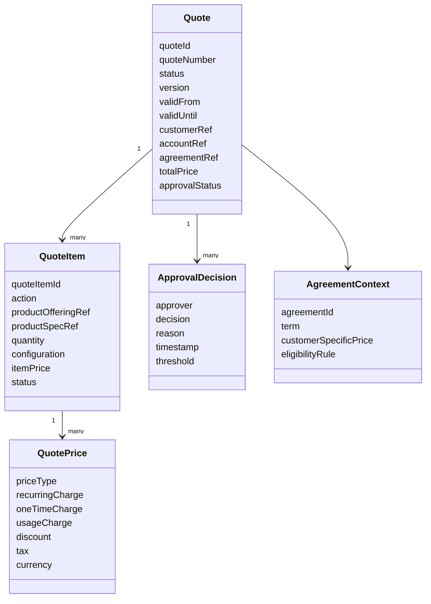
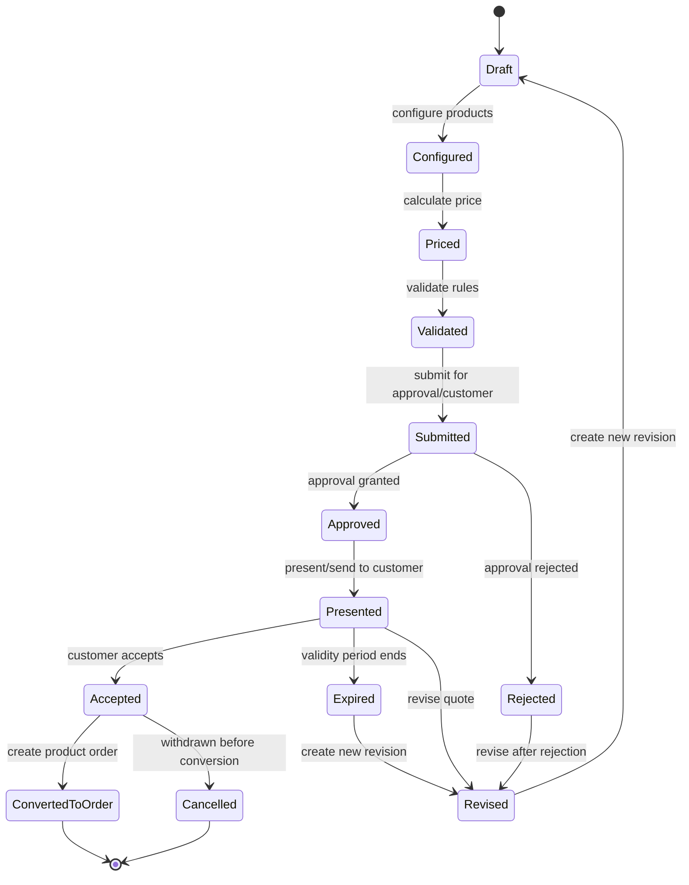
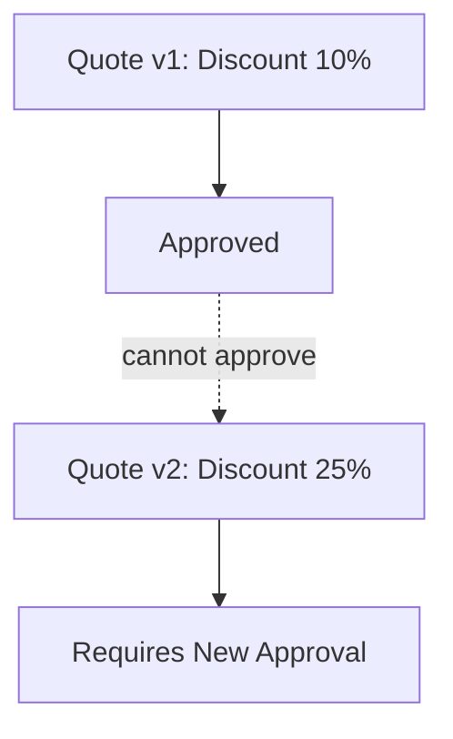
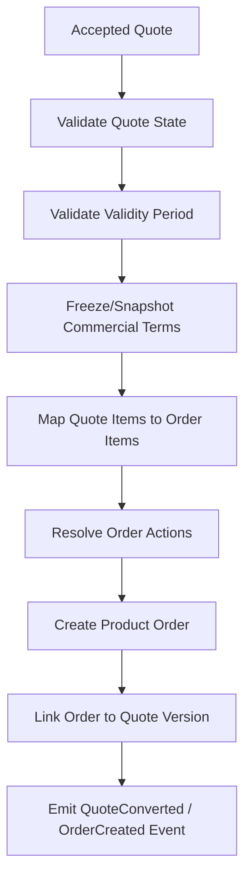

# Part 007 — Quote Management Lifecycle

Quote management adalah domain di mana **niat komersial** dibentuk, dihitung, divalidasi, dinegosiasikan, disetujui, dikunci, lalu akhirnya menjadi dasar pembuatan order. Untuk engineer, quote bukan sekadar dokumen penawaran atau kumpulan line item. Quote adalah **business object yang membawa konfigurasi produk, harga, diskon, agreement context, eligibility, approval evidence, customer intent, sales commitment, dan audit trail**.

Kesalahan umum engineer baru di domain CPQ adalah memperlakukan quote seperti shopping cart. Ini berbahaya. Cart di ecommerce biasanya ephemeral, murah untuk dibuang, dan relatif sederhana. Quote enterprise/telco bisa memiliki konsekuensi kontraktual, compliance, revenue, margin, approval, dan fulfillment. Quote yang sudah accepted dapat menjadi basis order, contract, billing expectation, dan customer commitment.

Tujuan part ini adalah membangun mental model quote management dari sudut pandang senior engineer: lifecycle, state machine, versioning, immutability, validation, approval, auditability, quote-to-order conversion, edge case, failure mode, dan cara mereview requirement/PR/design secara domain-aware.

---

## 1. Mental Model Utama

Quote adalah **commercial proposal under controlled lifecycle**.

Artinya, quote memiliki beberapa karakter penting:

1. Quote merepresentasikan proposal bisnis kepada customer.
2. Quote memiliki konteks customer/account/agreement.
3. Quote berisi line item produk/offering yang dikonfigurasi.
4. Quote membawa harga, diskon, pajak/charge, term, dan commercial condition.
5. Quote harus divalidasi terhadap catalog, eligibility, pricing, agreement, dan policy.
6. Quote dapat membutuhkan approval sebelum dikirim/diterima.
7. Quote memiliki validity period.
8. Quote dapat direvisi, tetapi revisi harus audit-safe.
9. Quote yang accepted harus cukup stabil untuk dikonversi menjadi order.
10. Quote harus bisa dijelaskan ulang saat terjadi dispute.

Quote bukan hanya data entry. Quote adalah **decision artifact**.

---

## 2. Quote dalam Quote-to-Cash

Dalam quote-to-cash, quote berada di antara discovery/configuration/pricing dan order capture.

```mermaid
flowchart LR
  A[Opportunity / Sales Intent] --> B[Product Discovery]
  B --> C[Configuration]
  C --> D[Pricing]
  D --> E[Quote Draft]
  E --> F[Validation]
  F --> G[Approval]
  G --> H[Customer Presentation]
  H --> I[Accepted Quote]
  I --> J[Quote-to-Order Conversion]
  J --> K[Product Order]
```

Quote adalah titik di mana sistem harus menjawab:

- Apakah customer eligible untuk produk ini?
- Apakah konfigurasi produk valid?
- Apakah harga masih valid?
- Apakah discount melewati threshold approval?
- Apakah quote line sesuai catalog version?
- Apakah agreement customer mengubah harga atau rule?
- Apakah quote masih dalam validity period?
- Apakah quote boleh dikonversi menjadi order?

Senior engineer harus melihat quote sebagai **contract boundary sebelum order**, bukan hanya payload.

---

## 3. Quote Bukan Order

Quote dan order sering terlihat mirip karena sama-sama punya item, price, customer, dan status. Tetapi intent-nya berbeda.

| Aspek | Quote | Order |
|---|---|---|
| Business meaning | Proposal komersial | Permintaan eksekusi/fulfillment |
| Commitment level | Belum tentu binding | Lebih binding/operational |
| Mutable? | Bisa berubah selama draft/revision | Umumnya lebih ketat setelah submission |
| Fokus utama | Configuration, pricing, approval, validity | Validation, decomposition, orchestration, fulfillment |
| Failure utama | Invalid quote, price mismatch, approval issue | Fallout, downstream rejection, stuck fulfillment |
| Audit concern | Commercial decision and negotiation trail | Execution and operational accountability |
| Output | Accepted quote | Completed/failed/cancelled fulfilled order |

Kesalahan desain sering muncul ketika sistem:

- langsung membuat order dari quote yang belum final,
- membiarkan quote accepted berubah diam-diam,
- tidak menyimpan snapshot harga/configuration saat quote disetujui,
- menganggap quote line item bisa dimapping 1:1 ke order item tanpa decomposition rule,
- tidak membedakan quote revision dengan update biasa.

---

## 4. Struktur Domain Quote

Model quote di enterprise CPQ biasanya terdiri dari beberapa konsep berikut.

Tidak semua sistem memakai nama yang sama, tetapi struktur domainnya sering mirip:

- quote header,
- quote line/item,
- product/catalog reference,
- pricing breakdown,
- approval trail,
- customer/account/agreement context,
- validity and versioning,
- conversion reference ke order.

Yang penting bukan nama class/entity-nya, tetapi **business invariant** yang dijaga.

---

## 5. Quote Lifecycle

Lifecycle quote bisa berbeda antar produk/customer, tetapi pola umum enterprise CPQ sering seperti ini.

Beberapa sistem mungkin tidak punya semua state ini. Ada yang menggabungkan `Configured` dan `Priced`, ada yang tidak punya `Presented`, ada yang menggunakan `Approved` langsung sebelum `Accepted`. Yang perlu diverifikasi adalah state actual di produk dan rule transisinya.

---

## 6. Status Quote yang Umum

### 6.1 Draft

Draft adalah quote yang masih bebas diedit.

Biasanya boleh:

- menambah/menghapus quote item,
- mengubah configuration,
- mengganti account/contact,
- menghitung ulang harga,
- menyimpan incomplete data.

Tetapi draft tetap tidak boleh melanggar invariant mendasar seperti invalid customer reference atau quote tanpa owner jika sistem mensyaratkannya.

### 6.2 Configured

Configured berarti product selection dan configuration sudah cukup lengkap untuk pricing/validation.

Risiko utama:

- konfigurasi terlihat lengkap di UI tetapi invalid terhadap catalog,
- bundle dependency belum lengkap,
- incompatible option belum ditolak,
- eligibility belum dicek.

### 6.3 Priced

Priced berarti sistem telah menghitung harga berdasarkan catalog, price list, discount, agreement, promotion, dan quantity.

Risiko utama:

- price calculation memakai catalog version yang berbeda dari configuration,
- price stale karena price list berubah,
- discount override belum masuk approval,
- currency atau tax treatment salah,
- total quote tidak konsisten dengan sum line item.

### 6.4 Submitted

Submitted berarti quote masuk tahap formal: untuk approval internal, customer review, atau workflow berikutnya.

Biasanya harus ada constraint:

- tidak semua field boleh diedit,
- perubahan commercial harus membuat revision atau trigger recalculation,
- audit trail harus mencatat submitter, timestamp, dan quote snapshot.

### 6.5 Approved

Approved berarti quote telah melewati approval rule.

Approval tidak boleh dianggap sekadar status. Approval adalah bukti bahwa quote dengan **versi, harga, diskon, margin, dan condition tertentu** telah disetujui.

Jika quote berubah setelah approved, approval lama bisa invalid.

### 6.6 Accepted

Accepted berarti customer menerima quote.

Ini adalah boundary kritikal. Setelah accepted, quote biasanya harus menjadi immutable atau hanya boleh berubah melalui controlled revision/amendment process.

Accepted quote harus cukup stabil untuk menjadi sumber product order.

### 6.7 Expired

Expired berarti quote melewati validity period.

Expired quote biasanya tidak boleh dikonversi menjadi order tanpa revalidation/repricing/revision.

Risiko umum:

- expiry dicek di UI saja, tetapi API masih bisa convert,
- timezone menyebabkan quote dianggap valid/expired berbeda,
- background job expire quote tetapi tidak publish event,
- quote expired setelah customer acceptance tetapi sebelum order creation.

### 6.8 Rejected

Rejected bisa berarti approval internal ditolak atau customer menolak quote.

Keduanya perlu dibedakan karena recovery path berbeda.

- Approval rejected: mungkin butuh discount adjustment.
- Customer rejected: mungkin butuh negotiation/revision.

### 6.9 Revised

Revised berarti ada versi baru dari quote.

Revisi harus menjaga hubungan antar versi:

- original quote,
- previous revision,
- current active revision,
- status masing-masing revision,
- audit trail alasan revisi.

### 6.10 Converted to Order

Converted to Order berarti quote telah menjadi basis order.

Setelah conversion, perubahan quote harus sangat dibatasi karena order sudah membawa operational consequence.

---

## 7. Quote Versioning

Quote versioning adalah salah satu area paling rawan bug.

Ada dua pola umum:

1. **In-place update with audit history**  
   Quote entity sama, field berubah, audit/history menyimpan perubahan.

2. **Immutable revision model**  
   Setiap revisi membuat quote version baru, versi lama tetap bisa dibaca.

Untuk enterprise CPQ, immutable revision model sering lebih aman dari sisi audit dan dispute, tetapi lebih kompleks dari sisi UI, API, relationship, dan reporting.

### 7.1 Invariant Quote Versioning

Beberapa invariant penting:

- Quote version yang sudah submitted/approved/accepted tidak boleh berubah secara diam-diam.
- Approval melekat pada quote version tertentu, bukan quote number abstrak.
- Accepted quote harus menunjuk ke exact version yang diterima customer.
- Order harus dibuat dari exact quote version, bukan latest quote yang mungkin berubah.
- Repricing harus menghasilkan version change atau explicit recalculation evidence.
- Rejected/expired quote tidak boleh diam-diam dihidupkan tanpa lifecycle event.

### 7.2 Revision vs Update

Tidak semua perubahan adalah revision.

Contoh perubahan ringan:

- update internal note,
- update contact phone,
- attach supporting document,
- fix typo non-commercial.

Contoh perubahan yang seharusnya revision/reapproval:

- mengubah product offering,
- mengubah configuration,
- mengubah quantity,
- mengubah discount,
- mengubah contract term,
- mengubah price list,
- mengubah validity period,
- mengganti billing account,
- mengganti agreement context.

Senior engineer harus memastikan requirement membedakan **metadata update** dan **commercially material change**.

---

## 8. Quote Immutability

Quote immutability berarti quote tertentu tidak bisa lagi diubah bebas setelah melewati state tertentu.

Contoh boundary:

- Setelah submitted: field commercial tertentu locked.
- Setelah approved: harga/diskon/configuration locked.
- Setelah accepted: quote immutable.
- Setelah converted: quote menjadi historical source of truth.

Immutability bukan berarti semua field tidak bisa berubah. Biasanya ada field non-material yang masih boleh berubah. Tetapi sistem harus jelas membedakan:

- material commercial fields,
- operational metadata,
- audit annotation,
- derived/calculated fields,
- external references.

### 8.1 Anti-pattern: Mutable Accepted Quote

Jika accepted quote bisa diedit langsung, risiko yang muncul:

- order dibuat dari quote yang berbeda dari yang customer setujui,
- audit trail tidak bisa menjelaskan perubahan,
- approval menjadi tidak valid,
- dispute customer sulit diselesaikan,
- downstream billing/provisioning menerima expectation yang salah.

Aturan praktis: **accepted quote should be treated as evidence, not workspace**.

---

## 9. Quote Validation

Quote validation adalah proses memastikan quote layak untuk maju ke state berikutnya.

Validasi bukan satu tahap tunggal. Validasi bisa terjadi di beberapa boundary.

| Boundary | Validasi yang dibutuhkan |
|---|---|
| Save draft | Minimal structural validity |
| Configure | Product option, bundle, compatibility |
| Price | Price list, agreement, promotion, discount |
| Submit | Required fields, customer/account, quote completeness |
| Approve | Threshold, margin, authority, policy |
| Accept | Validity period, approval status, customer confirmation |
| Convert | No expiry, no stale catalog/price, mapping to order valid |

### 9.1 Validation Types

#### Structural Validation

Memastikan data tidak rusak secara bentuk.

Contoh:

- quote memiliki customer reference,
- quote item memiliki product offering reference,
- quantity valid,
- currency valid.

#### Catalog Validation

Memastikan product offering, bundle, options, eligibility, dan compatibility valid terhadap catalog.

Contoh:

- offering masih active,
- option tersedia untuk product tersebut,
- bundle dependency lengkap,
- catalog version compatible.

#### Pricing Validation

Memastikan harga dan discount valid.

Contoh:

- price list masih berlaku,
- discount tidak melewati threshold tanpa approval,
- total price konsisten,
- margin tidak negatif kecuali explicit approval.

#### Agreement Validation

Memastikan quote sesuai agreement customer.

Contoh:

- agreement masih active,
- customer-specific terms diterapkan,
- minimum commitment terpenuhi,
- term/renewal rule sesuai kontrak.

#### Lifecycle Validation

Memastikan state transition legal.

Contoh:

- quote expired tidak boleh accepted,
- rejected quote tidak boleh convert tanpa revision,
- accepted quote tidak boleh kembali ke draft.

#### Integration Validation

Memastikan quote punya data cukup untuk order/downstream.

Contoh:

- service address lengkap,
- billing account valid,
- required fulfillment attributes tersedia,
- external references resolvable.

---

## 10. Quote Pricing Snapshot

Salah satu pertanyaan desain terpenting: **apakah quote menyimpan calculated price snapshot atau menghitung ulang setiap dibaca?**

Dalam domain quote, biasanya harus ada snapshot pada boundary tertentu.

Mengapa?

Karena harga bisa berubah:

- price list berubah,
- promotion expired,
- discount policy berubah,
- catalog version berubah,
- agreement diperbarui,
- tax/charge rule berubah,
- currency conversion berubah.

Jika quote yang sudah approved/accepted selalu dihitung ulang dari current price rule, maka nilai historis bisa berubah dan audit rusak.

### 10.1 Invariant Pricing Snapshot

- Quote submitted harus menyimpan harga yang disubmit.
- Quote approved harus menyimpan harga yang diapprove.
- Quote accepted harus menyimpan harga yang customer terima.
- Quote-to-order conversion harus memakai accepted price snapshot atau explicit repricing rule.
- Jika repricing dibutuhkan, harus ada audit event dan approval ulang jika material.

---

## 11. Quote Approval

Approval adalah mekanisme commercial governance.

Approval biasanya dipicu oleh:

- discount melebihi threshold,
- margin di bawah threshold,
- non-standard term,
- manual price override,
- customer-specific agreement exception,
- contract duration khusus,
- large deal amount,
- risky product combination,
- regulated/compliance-sensitive scenario.

### 11.1 Approval is Version-Specific

Approval harus melekat ke quote version.

Jika quote berubah material setelah approval, approval lama tidak otomatis valid.

### 11.2 Approval Evidence

Approval evidence sebaiknya menjawab:

- siapa approver,
- kapan approve/reject,
- rule apa yang dipicu,
- threshold apa yang dilanggar,
- quote version mana yang disetujui,
- alasan keputusan,
- apakah approval didelegasikan,
- apakah approval expired.

---

## 12. Quote-to-Order Conversion

Quote-to-order conversion adalah boundary kritikal dari commercial proposal menjadi operational execution.

Conversion bukan sekadar copy quote item ke order item.

Conversion harus menjawab:

- Apakah quote accepted?
- Apakah quote belum expired?
- Apakah quote version yang diterima customer masih valid?
- Apakah harga/configuration masih boleh dipakai?
- Apakah required order attributes tersedia?
- Apakah setiap quote item bisa dimapping ke order item/action?
- Apakah multi-site/multi-product quote perlu split order?
- Apakah ada dependency antar item?
- Apakah ada agreement/contract yang harus dibuat/diupdate?
- Apakah conversion idempotent?

### 12.1 Conversion Flow

### 12.2 Mapping Quote Item ke Order Item

Quote item dan order item tidak selalu 1:1.

Contoh:

- Bundle quote item bisa menjadi beberapa order item.
- Multi-site quote bisa menjadi beberapa site-specific order.
- Add-on quote item bisa bergantung pada base product order item.
- Modify/disconnect quote item membutuhkan reference ke existing product inventory.
- Quote item untuk commercial bundle bisa decompose ke service/resource downstream belakangan.

### 12.3 Idempotency Conversion

Conversion harus idempotent. Jika user/API retry karena timeout, sistem tidak boleh membuat duplicate order.

Invariant:

- Satu accepted quote version tidak boleh menghasilkan duplicate active order kecuali explicit split rule.
- Conversion request harus punya idempotency key atau deterministic quote-version-to-order relationship.
- Jika order creation partially succeeded, retry harus melanjutkan/mengembalikan existing result, bukan membuat order baru.

---

## 13. Multi-Site dan Multi-Product Quote

Enterprise/telco quote sering multi-site dan multi-product.

Contoh:

- Customer membeli connectivity untuk 200 branch.
- Customer membeli base connectivity + security + managed router + support plan.
- Setiap site punya feasibility, address, installation schedule, local regulation, dan serviceability berbeda.

Risiko domain:

- Satu site invalid membuat seluruh quote gagal atau hanya site itu?
- Price aggregation salah karena per-site charge vs global discount.
- Approval threshold dihitung per site atau total deal?
- Conversion menjadi satu order besar atau banyak order?
- Cancellation/revision sebagian site bagaimana?
- Fulfillment dependency antar site ada atau tidak?

Senior engineer harus menanyakan **granularity**: quote-level, site-level, item-level, atau service-level.

---

## 14. Quote Expiry dan Time Semantics

Quote expiry terlihat sederhana, tetapi sering menyebabkan bug.

Pertanyaan yang harus dijawab:

- Expiry dihitung berdasarkan timezone siapa?
- Valid until inclusive atau exclusive?
- Apakah quote expired otomatis oleh job atau saat dibaca?
- Apakah quote bisa accepted pada hari terakhir?
- Apa yang terjadi jika quote accepted sebelum expiry tetapi order created setelah expiry?
- Apakah approval juga punya expiry?
- Apakah price validity berbeda dari quote validity?
- Apakah catalog version validity berbeda dari quote validity?

Invariant minimal:

- Sistem harus punya satu definisi authoritative tentang quote validity.
- API dan UI harus konsisten.
- Conversion harus mengecek expiry di backend.
- Expiry decision harus audit-able.

---

## 15. Edge Cases Quote Management

### 15.1 Customer Accepts While Quote Is Being Revised

Race:

- Sales membuat revision.
- Customer menerima quote lama melalui link/email.
- Sistem harus menentukan apakah quote lama masih acceptable.

Mitigasi:

- hanya latest active quote version yang bisa accepted,
- previous version marked superseded,
- acceptance token tied to exact quote version,
- acceptance rejected jika version no longer active.

### 15.2 Price List Changes After Approval

Pertanyaan:

- Apakah approved price tetap berlaku sampai quote expiry?
- Apakah quote harus repriced?
- Apakah approval ulang dibutuhkan?

Ini harus domain rule, bukan keputusan engineer sepihak.

### 15.3 Quote Approved But Agreement Expired

Jika agreement berubah/expired sebelum quote accepted, quote mungkin harus revalidated.

### 15.4 Partial Quote Acceptance

Customer mungkin menerima sebagian item.

Pertanyaan:

- Apakah partial acceptance didukung?
- Apakah acceptance sebagian membuat revision?
- Apakah approval threshold dihitung ulang?
- Apakah discount bundle tetap valid jika sebagian item ditolak?

### 15.5 Duplicate Acceptance

Customer klik accept dua kali atau API retry.

Mitigasi:

- acceptance idempotent,
- state transition atomic,
- duplicate event handling,
- clear existing accepted timestamp.

### 15.6 Quote Converted Twice

Ini critical failure.

Mitigasi:

- unique constraint quoteVersionId -> activeOrderId jika rule 1:1,
- idempotent conversion service,
- conversion lock/state,
- reconciliation report for duplicate orders.

### 15.7 Expired Quote Reopened

Jika bisnis mengizinkan reopening expired quote, harus jelas:

- apakah status kembali draft?
- apakah version baru dibuat?
- apakah price recalculated?
- apakah approval ulang?
- apakah expiry audit dicatat?

---

## 16. Failure Modes

| Failure mode | Penyebab umum | Dampak | Deteksi | Recovery |
|---|---|---|---|---|
| Invalid quote accepted | Backend tidak revalidate | Order invalid | Acceptance/conversion validation | Reject acceptance atau create revision |
| Price mismatch | Recalculation tidak konsisten | Revenue leakage/dispute | Price snapshot comparison | Reprice + approval/audit |
| Expired quote converted | Expiry only checked in UI | Invalid order | Backend guard | Cancel order/recreate quote |
| Approval bypass | Threshold rule tidak triggered | Commercial risk | Approval audit/report | Block conversion/reapproval |
| Mutable accepted quote | No immutability boundary | Audit failure | Diff accepted snapshot | Lock fields/revision model |
| Duplicate order | Retry conversion non-idempotent | Fulfillment/billing duplicate | Quote-order uniqueness check | Cancel duplicate/reconcile |
| Catalog mismatch | Offering changed after quote | Invalid configuration | Catalog version validation | Revision/revalidation |
| Partial acceptance ambiguity | Requirement unclear | Wrong order scope | Acceptance payload audit | Define supported granularity |
| Lost approval evidence | Approval data overwritten | Compliance issue | Audit completeness check | Restore from log/manual evidence |
| Superseded quote accepted | Old acceptance link valid | Wrong commercial terms | Version status check | Reject/reissue quote |

---

## 17. Business Invariants

Gunakan daftar ini saat membaca requirement, PR, atau incident.

### 17.1 State Invariants

- Draft quote boleh incomplete, tetapi tidak boleh corrupt.
- Submitted quote harus punya minimum data lengkap.
- Approved quote harus menunjuk ke exact approved version.
- Accepted quote harus immutable terhadap material commercial fields.
- Expired/rejected quote tidak boleh converted tanpa explicit revision/revalidation.
- Converted quote harus linked ke resulting order.

### 17.2 Pricing Invariants

- Quote total harus konsisten dengan line item price breakdown.
- Approved/accepted price harus snapshot-able.
- Discount override harus memiliki approval jika melewati threshold.
- Repricing setelah approval harus jelas apakah invalidates approval.
- Currency/tax/charge treatment harus konsisten di quote header dan item.

### 17.3 Versioning Invariants

- Quote revision harus traceable ke original quote.
- Hanya satu active/latest revision jika business rule begitu.
- Approval/acceptance/conversion harus mengacu ke version tertentu.
- Superseded version tidak boleh accepted kecuali rule eksplisit.

### 17.4 Conversion Invariants

- Hanya quote eligible yang bisa dikonversi.
- Conversion harus idempotent.
- Order harus tahu quote source/version.
- Quote-to-order mapping harus audit-able.
- Duplicate active order dari quote yang sama harus dicegah kecuali split rule.

---

## 18. API, Event, Database, Workflow, Testing, Operations Impact

### 18.1 API Impact

API quote harus jelas tentang:

- allowed actions per state,
- quote version identifier,
- recalculation endpoint/action,
- submit/approve/accept/convert commands,
- optimistic locking/version conflict,
- error taxonomy untuk invalid state/expired/approval required.

Anti-pattern:

- generic `PATCH /quote/{id}` bisa mengubah semua field di semua state,
- `status` bisa di-set langsung oleh client,
- conversion endpoint tidak idempotent,
- API response tidak membedakan quote expired vs approval missing.

### 18.2 Event Impact

Event quote harus merepresentasikan fakta bisnis, bukan internal CRUD.

Contoh event yang meaningful:

- `QuoteCreated`
- `QuoteConfigured`
- `QuotePriced`
- `QuoteSubmitted`
- `QuoteApprovalRequested`
- `QuoteApproved`
- `QuoteRejected`
- `QuoteAccepted`
- `QuoteExpired`
- `QuoteRevised`
- `QuoteConvertedToOrder`

Event harus membawa cukup context atau reference agar consumer bisa reconcile.

### 18.3 Database Impact

Pertanyaan database yang harus dijawab:

- Apakah quote version disimpan sebagai row terpisah?
- Apakah quote item immutable setelah accepted?
- Apakah price snapshot normalized atau embedded?
- Apakah audit trail append-only?
- Apakah ada unique constraint untuk conversion?
- Apakah optimistic locking digunakan?

### 18.4 Workflow Impact

Quote workflow harus mengontrol:

- siapa boleh melakukan action,
- action apa yang legal di state tertentu,
- kapan approval dibutuhkan,
- kapan quote locked,
- kapan revision dibuat,
- kapan notification/event dikirim.

### 18.5 Testing Impact

Test penting:

- state transition matrix,
- quote validation by lifecycle boundary,
- pricing snapshot consistency,
- approval invalidation after material change,
- expiry edge cases,
- duplicate acceptance/conversion,
- quote-to-order mapping,
- concurrent update/revision.

### 18.6 Operations Impact

Operational signal yang berguna:

- jumlah quote stuck di submitted/approval,
- quote expired tanpa follow-up,
- quote conversion failure,
- duplicate conversion attempts,
- price mismatch warning,
- approval SLA breach,
- invalid transition attempts.

---

## 19. Domain-Aware Requirement Review

Saat membaca story quote management, tanyakan:

1. State mana yang terdampak?
2. Transition apa yang ditambah/diubah?
3. Field mana yang material commercial field?
4. Perubahan ini memerlukan revision atau update biasa?
5. Apakah approval lama tetap valid?
6. Apakah quote accepted boleh berubah?
7. Apakah quote expired behavior jelas?
8. Apakah pricing harus snapshot atau recalculated?
9. Apakah conversion ke order terdampak?
10. Apakah event/API/backward compatibility terdampak?
11. Apakah audit trail cukup untuk dispute?
12. Bagaimana race condition ditangani?

---

## 20. Domain-Aware PR Review Checklist

Gunakan checklist ini saat review PR.

### State and Lifecycle

- Apakah action baru legal hanya di state yang tepat?
- Apakah illegal transition dicegah di backend?
- Apakah status tidak bisa diubah langsung tanpa command/domain method?
- Apakah terminal state terlindungi?

### Versioning and Immutability

- Apakah perubahan material membuat revision?
- Apakah accepted/approved quote tidak berubah diam-diam?
- Apakah optimistic locking/concurrency ditangani?
- Apakah historical quote tetap bisa direkonstruksi?

### Pricing and Approval

- Apakah price recalculation eksplisit?
- Apakah approval invalidated jika rule material berubah?
- Apakah discount/margin guardrail tetap jalan?
- Apakah price snapshot disimpan di boundary penting?

### Conversion

- Apakah conversion hanya dari quote eligible?
- Apakah idempotency dijaga?
- Apakah quote version linked ke order?
- Apakah mapping item jelas?

### Audit and Observability

- Apakah transition menghasilkan audit event?
- Apakah failure reason jelas?
- Apakah operational monitoring bisa mendeteksi stuck/failure?
- Apakah customer-impacting change traceable?

---

## 21. Internal Verification Checklist

Cek hal berikut di CSG internal context sebelum menyimpulkan detail implementasi.

### Product and Domain Documentation

- Apa definisi resmi quote di produk?
- Apa daftar status quote yang benar?
- Apa lifecycle diagram resmi quote?
- Apakah quote punya revision/version model?
- Apakah quote accepted immutable?

### Codebase

- Cari entity/class/resource: `Quote`, `QuoteItem`, `QuotePrice`, `QuoteVersion`, `QuoteApproval`, `QuoteState`.
- Cari command/action: create, configure, price, submit, approve, reject, accept, expire, revise, convert.
- Cari guard condition/state transition validation.
- Cari optimistic locking/version conflict handling.
- Cari unique constraint atau mapping quote-to-order.

### API Contract

- Cek endpoints/actions untuk quote lifecycle.
- Cek apakah client bisa update status langsung.
- Cek error code untuk invalid state, expired quote, approval required, price mismatch.
- Cek version field atau ETag.
- Cek idempotency support untuk acceptance/conversion.

### Database Schema

- Cek quote header/item/price tables.
- Cek revision/version representation.
- Cek audit/history tables.
- Cek price snapshot storage.
- Cek quote-order relationship.

### Event Catalog

- Cek quote lifecycle events.
- Cek payload versioning.
- Cek consumer downstream.
- Cek duplicate/out-of-order handling.

### Product Owner / BA / Solution Architect Questions

- Quote state mana yang customer-visible?
- Apa perbedaan rejected by approval vs rejected by customer?
- Apakah partial acceptance didukung?
- Apakah expired quote bisa reopened?
- Kapan approval harus ulang?
- Apakah accepted quote bisa direvisi?
- Apa expected behavior jika price/catalog/agreement berubah setelah approval?

---

## 22. Practice Exercise

Ambil satu quote-related user story atau PR lama, lalu buat tabel berikut:

| Pertanyaan | Jawaban |
|---|---|
| Quote state yang terdampak? | |
| Transition yang berubah? | |
| Material commercial fields? | |
| Approval impact? | |
| Versioning/revision impact? | |
| Quote-to-order impact? | |
| Audit requirement? | |
| Failure mode utama? | |
| Test scenario minimal? | |
| Internal open questions? | |

Tujuannya bukan membuat dokumentasi panjang, tetapi melatih mata domain: setiap perubahan quote hampir selalu punya efek pada lifecycle, approval, pricing, audit, dan conversion.

---

## 23. Senior Engineer Takeaways

1. Quote adalah commercial decision artifact, bukan cart.
2. Lifecycle quote harus diproteksi oleh state transition guard.
3. Approval melekat pada quote version tertentu.
4. Accepted quote harus diperlakukan sebagai evidence.
5. Price snapshot adalah domain-critical untuk audit dan dispute.
6. Revision tidak sama dengan update biasa.
7. Quote-to-order conversion harus idempotent dan traceable.
8. Expiry, pricing, agreement, dan catalog validity harus didefinisikan eksplisit.
9. Review PR quote harus selalu melihat state, invariant, audit, dan conversion impact.
10. Jika ragu, tanyakan business rule sebelum menganggapnya technical detail.

---

## 24. Bridge to Next Part

Part berikutnya membahas **Order Management Lifecycle**. Jika quote adalah commercial proposal, order adalah operational execution. Di order management, kompleksitas berpindah dari pricing/approval/acceptance ke validation, decomposition, orchestration, dependency, fulfillment, fallout, amendment, cancellation, dan reconciliation.
