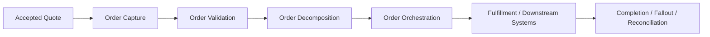
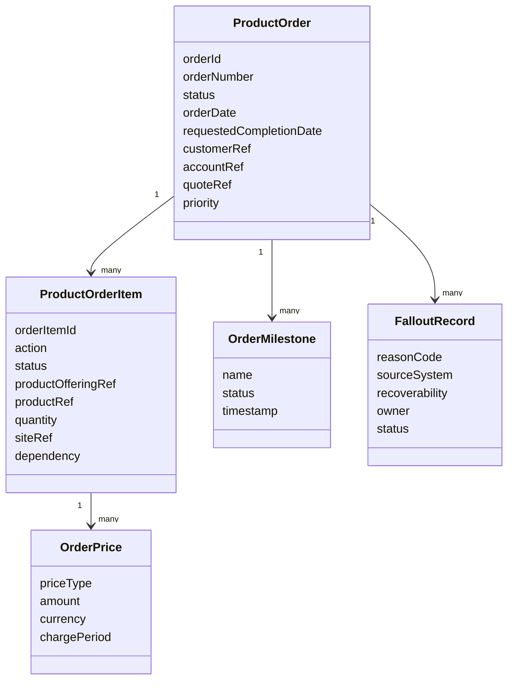
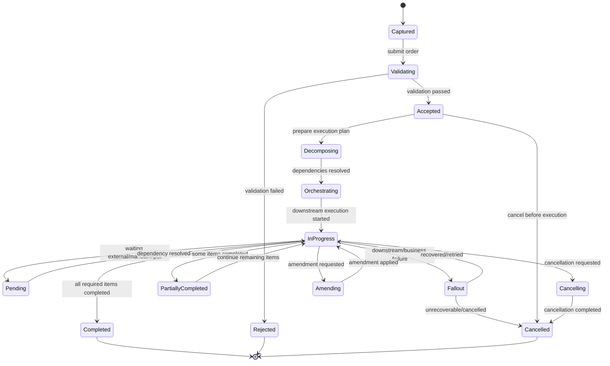
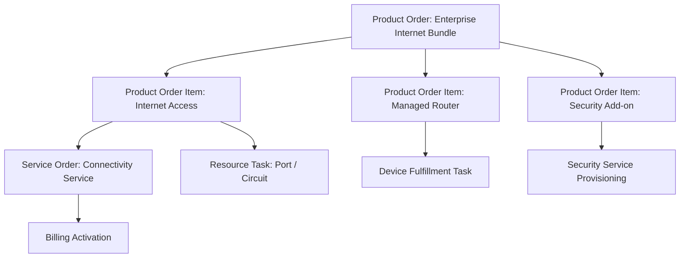
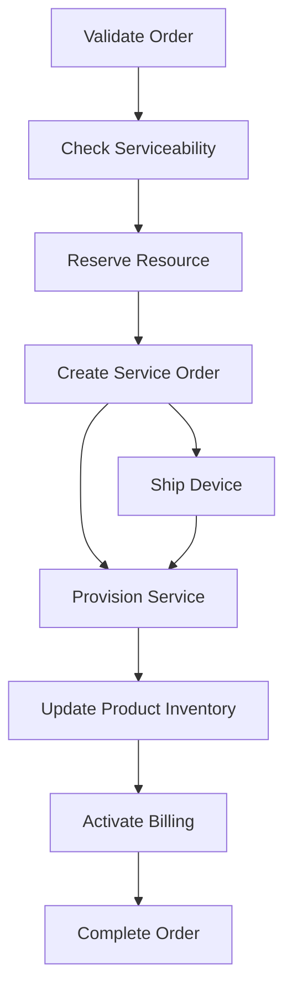
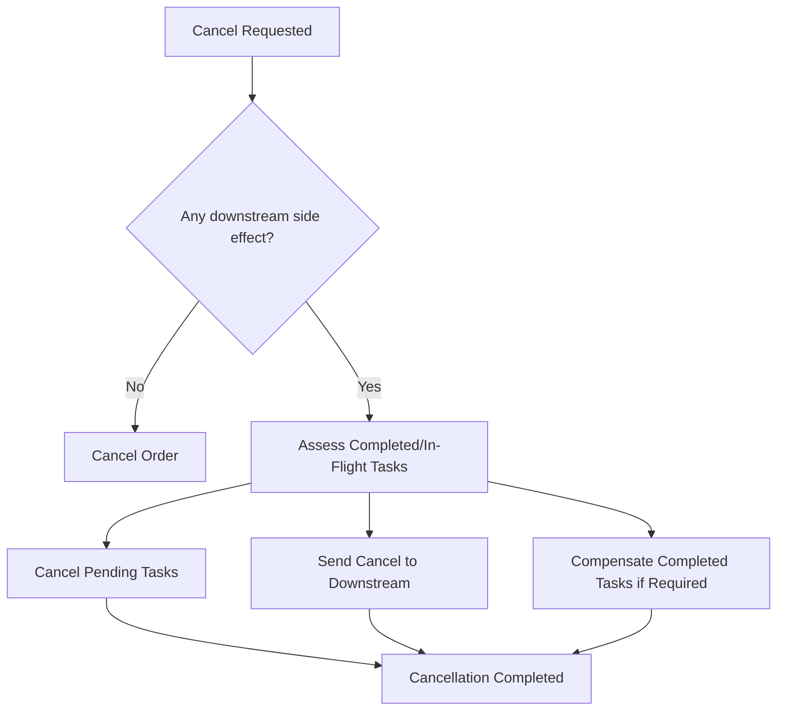

# Part 008 — Order Management Lifecycle

Order management adalah domain di mana customer commitment berubah menjadi **permintaan eksekusi operasional**. Jika quote menjawab “apa yang ditawarkan dan disetujui secara komersial?”, maka order menjawab “apa yang harus dilakukan sistem dan organisasi untuk memenuhi komitmen tersebut?”

Di enterprise/telco, order management bukan hanya create order lalu selesai. Order bisa melalui validation, decomposition, orchestration, dependency resolution, service ordering, inventory update, provisioning, billing activation, fallout handling, manual intervention, cancellation, amendment, retry, dan reconciliation. Banyak kegagalan besar di CPQ/order management bukan karena code tidak jalan, tetapi karena lifecycle order tidak dimodelkan dengan benar.

Tujuan part ini adalah membangun mental model order management untuk senior engineer: product order, order item, order action, order state machine, decomposition, orchestration, partial completion, fallout, cancel/amend, idempotency, reconciliation, dan cara mereview requirement/PR/design secara domain-aware.

---

## 1. Mental Model Utama

Order adalah **controlled execution request**.

Order membawa intent yang lebih kuat daripada quote. Ketika order dibuat, downstream system bisa mulai melakukan aksi nyata:

- reserve resource,
- create service order,
- schedule technician,
- provision service,
- update inventory,
- activate billing,
- notify customer,
- trigger partner/vendor process.

Karena itu, order harus lebih ketat daripada quote.

Order management harus menjawab:

- Apakah order valid secara commercial dan operational?
- Apa item yang harus dieksekusi?
- Apa dependency antar item?
- Mana item yang bisa jalan paralel?
- Mana item yang harus menunggu feasibility/provisioning/billing?
- Apa status order dan item saat ini?
- Apa yang terjadi jika downstream menolak?
- Apa yang bisa di-retry?
- Apa yang butuh manual intervention?
- Bagaimana cancel/amend order yang sedang berjalan?
- Bagaimana memastikan completion benar dan reconcile-able?

Order adalah tempat domain bertemu operasi nyata.

---

## 2. Quote vs Order: Boundary of Commitment

Quote adalah proposal; order adalah execution commitment.

Boundary penting:

- Quote bisa dinegosiasikan.
- Order harus dieksekusi, dibatalkan, diamend, atau difallout-kan dengan kontrol.
- Quote primarily commercial.
- Order commercial + operational.
- Quote correctness berfokus pada price/configuration/approval.
- Order correctness berfokus pada state/dependency/downstream execution/recovery.

---

## 3. Product Order dan Order Item

Dalam TM Forum-style telco domain, konsep **Product Order** sering digunakan untuk merepresentasikan order dari perspektif produk komersial. Product Order bisa berisi banyak Product Order Item.

Order item adalah unit penting karena status order header sering terlalu kasar. Order bisa `In Progress` sementara beberapa item completed, satu item fallout, dan satu item waiting for downstream.

---

## 4. Order Action

Order item biasanya memiliki action. Action menjelaskan apa yang ingin dilakukan terhadap produk/customer asset.

Action umum:

| Action | Meaning | Contoh |
|---|---|---|
| Add | Menambahkan produk/service baru | Customer membeli broadband baru |
| Modify | Mengubah existing product | Upgrade bandwidth |
| Disconnect | Menghentikan produk/service | Terminate circuit |
| Suspend | Menangguhkan service | Non-payment suspension |
| Resume | Mengaktifkan kembali service | Resume setelah payment |
| Move | Memindahkan service | Relokasi site |
| Change Owner | Mengubah ownership/account | Transfer enterprise account |

Tidak semua produk mendukung semua action.

### 4.1 Action Invariants

- `Add` biasanya tidak membutuhkan existing product inventory reference.
- `Modify`, `Disconnect`, `Suspend`, `Resume` biasanya membutuhkan existing product/service reference.
- Action harus compatible dengan product lifecycle state.
- Action harus compatible dengan customer/account/agreement.
- Action harus compatible dengan downstream capability.
- Action harus jelas efeknya pada billing dan inventory.

Bug sering muncul ketika order action dianggap string biasa, bukan domain operation.

---

## 5. Order Lifecycle

Lifecycle order umum bisa dimodelkan seperti ini.

Actual state di produk harus diverifikasi. Namun mental model ini membantu membaca order sebagai state machine yang memiliki happy path dan recovery path.

---

## 6. Order Capture

Order capture adalah proses menerima order intent.

Sumber order bisa berbeda:

- accepted quote,
- CRM order entry,
- self-service channel,
- partner/reseller channel,
- migration/bulk order,
- amendment order,
- disconnect request,
- automated lifecycle trigger.

Order capture harus memastikan order punya context cukup:

- customer/account,
- product/order items,
- action,
- location/site,
- requested date,
- billing account,
- agreement/contract reference,
- quote reference jika berasal dari quote,
- contact and delivery information,
- required configuration/fulfillment attributes.

### 6.1 Capture Is Not Fulfillment

Anti-pattern: order langsung dikirim downstream begitu dibuat tanpa validation boundary.

Capture sebaiknya memisahkan:

- menerima intent,
- memvalidasi intent,
- membuat execution plan,
- memulai fulfillment.

Ini penting untuk audit, error handling, customer feedback, dan recovery.

---

## 7. Order Validation

Order validation memastikan order layak dieksekusi.

Jenis validasi:

### 7.1 Structural Validation

- order punya customer,
- item tidak kosong,
- action valid,
- required references ada,
- dates valid,
- quantity valid.

### 7.2 Commercial Validation

- order berasal dari quote accepted jika required,
- price/term sesuai quote/agreement,
- customer eligible,
- approval/commercial guardrail sudah terpenuhi.

### 7.3 Catalog Validation

- product offering masih valid untuk order action,
- configuration sesuai catalog,
- bundle/dependency valid,
- required characteristics lengkap.

### 7.4 Inventory Validation

Untuk modify/disconnect/suspend/resume:

- existing product exists,
- product belongs to customer/account,
- product state memungkinkan action,
- no conflicting active order.

### 7.5 Operational Validation

- address serviceable,
- required technical feasibility tersedia atau bisa dilakukan,
- downstream system mampu menerima request,
- billing account valid,
- resource capacity tersedia jika perlu.

### 7.6 Lifecycle Validation

- order tidak duplicate,
- action legal di current state,
- amendment/cancellation tidak melanggar state,
- dependency order tidak conflict.

---

## 8. Order Decomposition

Order decomposition adalah proses memecah product order menjadi unit execution yang lebih operasional.

Contoh decomposition:

Decomposition menjawab:

- item mana menghasilkan service order,
- item mana menghasilkan provisioning task,
- item mana butuh inventory update,
- item mana butuh billing activation,
- dependency antar execution step,
- apakah execution bisa paralel atau harus serial,
- siapa owner tiap task/system.

### 8.1 Commercial Product vs Service/Resource

Di telco, customer membeli product offering. Tetapi fulfillment membutuhkan service dan resource.

Contoh:

- Product: Enterprise Internet 1Gbps
- Service: IP connectivity service
- Resource: circuit, port, CPE/router, IP block

Order management sering berada di boundary antara commercial product layer dan operational service/resource layer.

### 8.2 Decomposition Failure

Decomposition bisa gagal karena:

- product catalog tidak punya mapping ke service catalog,
- required technical attribute missing,
- bundle relationship ambiguous,
- action tidak didukung downstream,
- catalog version mismatch,
- site-specific data incomplete,
- manual/custom product tidak punya automation path.

---

## 9. Order Orchestration

Orchestration mengatur urutan execution.

Pertanyaan orchestration:

- Task mana harus dilakukan dulu?
- Task mana bisa paralel?
- Apa prerequisite billing activation?
- Kapan inventory diupdate?
- Kapan customer notification dikirim?
- Apa yang terjadi jika satu item gagal?
- Apakah order bisa partial complete?
- Apa compensation jika downstream sudah melakukan aksi sebagian?

### 9.1 Dependency Model

Dependency harus eksplisit. Jika dependency hanya tersirat di code path, sistem sulit dioperasikan dan di-debug.

### 9.2 Milestones

Milestone membantu domain dan operations melihat progress.

Contoh milestone:

- order captured,
- validation completed,
- feasibility completed,
- decomposition completed,
- service order submitted,
- provisioning completed,
- billing activated,
- customer notified,
- order completed.

Milestone berbeda dari status. Status adalah current lifecycle state; milestone adalah event/progress marker.

---

## 10. Order Status vs Order Item Status

Order header status tidak cukup.

Contoh:

- Order header: `In Progress`
- Item A: `Completed`
- Item B: `In Progress`
- Item C: `Fallout`
- Item D: `Pending Customer Input`

Pertanyaan domain:

- Bagaimana header status dihitung dari item status?
- Apakah satu item fallout membuat order header fallout?
- Apakah completed item boleh rollback jika item lain gagal?
- Apakah partial completion customer-visible?
- Apakah billing aktif untuk completed item meskipun order header belum complete?

### 10.1 Header Rollup Rule

Rollup harus eksplisit.

Contoh rule sederhana:

- Jika semua item completed -> order completed.
- Jika ada item fallout unrecoverable -> order fallout/cancelled depending policy.
- Jika ada item in progress -> order in progress.
- Jika semua remaining item cancelled dan minimal satu completed -> partially completed/cancelled.

Jangan biarkan rollup status menjadi efek samping query adhoc yang berbeda antar service/UI/report.

---

## 11. Partial Order

Partial order terjadi ketika sebagian item berhasil dan sebagian gagal/tertunda/dibatalkan.

Ini umum di enterprise/telco:

- sebagian site serviceable, sebagian tidak,
- sebagian product provisioned, add-on gagal,
- device shipment berhasil, service activation gagal,
- billing activated untuk item tertentu tetapi bukan semua.

Pertanyaan penting:

- Apakah partial completion allowed?
- Apakah customer boleh menerima sebagian?
- Apakah billing mulai untuk item completed?
- Apakah order tetap open sampai semua item selesai?
- Bagaimana cancellation untuk item yang belum selesai?
- Bagaimana amendment terhadap order partial?
- Bagaimana reporting revenue/fulfillment SLA?

Partial order adalah area domain, bukan sekadar technical error.

---

## 12. Fallout

Fallout adalah kondisi ketika order tidak bisa lanjut normal dan membutuhkan recovery, retry, correction, manual intervention, atau cancellation.

Fallout bukan sekadar exception. Fallout adalah **business-operational state**.

### 12.1 Fallout Sources

- validation failure setelah submission,
- downstream rejection,
- missing data,
- serviceability failed,
- resource unavailable,
- provisioning failed,
- billing activation failed,
- inventory mismatch,
- duplicate/conflicting order,
- timeout/no response,
- manual task overdue,
- customer information incomplete.

### 12.2 Fallout Classification

| Type | Meaning | Example | Recovery |
|---|---|---|---|
| Data fallout | Data incomplete/invalid | Missing service address | Correct data and retry |
| Business fallout | Rule conflict | Product not eligible | Revise/cancel/escalate |
| Technical fallout | System/integration failure | Downstream timeout | Retry/reconcile |
| Operational fallout | Manual process stuck | Technician schedule missing | Manual intervention |
| Irrecoverable fallout | Cannot proceed | Resource unavailable permanently | Cancel/amend |

### 12.3 Fallout Ownership

Fallout harus punya owner.

- Product team?
- Operations team?
- Customer support?
- Implementation team?
- Downstream system owner?
- Business analyst?
- Solution architect?

Tanpa ownership, order stuck menjadi silent revenue/customer issue.

---

## 13. Retry

Retry dalam order management harus domain-aware.

Tidak semua failure aman untuk retry.

### 13.1 Safe Retry

Biasanya aman jika:

- request belum diterima downstream,
- operation idempotent,
- failure karena transient timeout,
- no irreversible side effect,
- correlation ID bisa memastikan duplicate tidak terjadi.

### 13.2 Dangerous Retry

Berbahaya jika:

- downstream mungkin sudah provisioning,
- billing activation mungkin sudah terjadi,
- inventory reservation mungkin sudah dibuat,
- external order mungkin sudah ada,
- response hilang tetapi side effect sukses.

Dalam situasi seperti ini, retry harus didahului reconcile/status check.

### 13.3 Retry Invariant

- Retry tidak boleh membuat duplicate downstream order.
- Retry harus preserve correlation/idempotency key.
- Retry harus audit-able.
- Retry harus punya limit dan escalation path.
- Retry failure harus menghasilkan fallout yang jelas.

---

## 14. Manual Intervention

Manual intervention adalah bagian normal domain enterprise.

Contoh:

- operations memperbaiki data,
- support menghubungi customer,
- solution architect menentukan mapping custom product,
- downstream team memperbaiki provisioning error,
- billing team menyelesaikan mismatch.

Manual intervention harus dimodelkan, bukan disembunyikan.

Sistem perlu tahu:

- reason,
- owner,
- SLA,
- allowed actions,
- required evidence,
- resume point,
- audit trail.

Anti-pattern:

- manual fix langsung di database tanpa lifecycle event,
- order status diubah manual tanpa reason,
- retry dilakukan tanpa correlation,
- customer tidak tahu order stuck.

---

## 15. Cancel Order

Cancellation sederhana jika order belum dieksekusi. Sulit jika order sudah berjalan.

### 15.1 Cancellation Before Execution

Jika order baru accepted/captured/validated tetapi belum downstream execution:

- bisa cancel order,
- emit event,
- release reservation jika ada,
- mark quote/order relationship sesuai rule.

### 15.2 Cancellation During Execution

Jika order sudah in progress:

- task yang belum mulai bisa dibatalkan,
- task yang sedang berjalan mungkin harus cancel request ke downstream,
- task yang selesai mungkin butuh compensation/disconnect/reversal,
- billing activation mungkin harus reversed,
- inventory mungkin harus updated.

### 15.3 Cancellation Race

Race condition umum:

- User cancel order.
- Downstream completes fulfillment at same time.
- Billing activation starts.
- Order system receives completion event after cancellation request.

Sistem harus punya rule:

- which event wins,
- whether cancellation becomes compensation,
- whether order becomes completed then disconnect order created,
- who is notified,
- how audit records both facts.

---

## 16. Amend Order

Amendment adalah perubahan terhadap order yang sudah dibuat.

Amendment bisa berarti:

- mengubah requested date,
- mengubah service address,
- menambah item,
- menghapus item,
- mengubah configuration,
- mengganti contact,
- memperbaiki missing data,
- mengubah billing account,
- mengubah product action.

Tidak semua amendment boleh di semua state.

### 16.1 Amendment Impact

Amendment harus dievaluasi terhadap:

- quote/agreement validity,
- pricing impact,
- approval impact,
- decomposition impact,
- downstream execution impact,
- inventory/billing impact,
- customer communication,
- SLA reset atau tidak.

### 16.2 Amend vs Cancel + Reorder

Kadang lebih aman cancel order dan create new order daripada amend in-flight order.

Pertimbangan:

- Apakah downstream mendukung amend?
- Apakah side effect sudah terjadi?
- Apakah price berubah?
- Apakah approval harus ulang?
- Apakah inventory reservation bisa diubah?
- Apakah billing sudah aktif?

Senior engineer harus challenge requirement “just allow edit order” karena order bukan draft quote.

---

## 17. Order Completion

Order completion berarti semua required business outcome telah terpenuhi.

Completion bukan sekadar semua downstream API return success.

Completion bisa mensyaratkan:

- product inventory updated,
- service activated,
- resource assigned,
- billing activated,
- customer notified,
- milestones completed,
- no unresolved fallout,
- reconciliation passed.

### 17.1 Completion Invariants

- Order tidak boleh completed jika required item masih in progress/fallout.
- Completed order harus punya completion timestamp.
- Completed order harus traceable ke downstream evidence.
- Completed order harus menghasilkan inventory/billing/customer-visible state yang konsisten.
- Completion event harus published once or idempotently.

---

## 18. Reconciliation

Reconciliation adalah proses memastikan state order internal konsisten dengan downstream systems.

Dibutuhkan karena:

- event bisa hilang,
- response timeout,
- downstream update manual,
- retry menciptakan uncertainty,
- order stuck karena integration issue,
- billing/inventory/provisioning state drift.

### 18.1 Reconciliation Questions

- Apa source of truth untuk status fulfillment?
- Bagaimana mencocokkan order item dengan downstream task/order?
- Apa correlation ID yang digunakan?
- Apa yang dilakukan jika downstream completed tetapi internal in progress?
- Apa yang dilakukan jika internal completed tetapi downstream failed?
- Apa yang dilakukan jika billing active tetapi product inventory missing?

### 18.2 Reconciliation Output

Reconciliation bisa menghasilkan:

- status correction,
- fallout creation,
- retry command,
- manual task,
- duplicate cleanup,
- audit record,
- incident alert.

---

## 19. Business Invariants

### 19.1 Order Creation Invariants

- Order harus punya valid customer/account.
- Order item tidak boleh kosong.
- Order action harus valid untuk product/context.
- Order dari quote harus link ke exact quote version.
- Duplicate order harus dicegah dengan idempotency/correlation.

### 19.2 Order State Invariants

- Terminal state tidak boleh berubah tanpa explicit compensation/reopen rule.
- Illegal transition harus dicegah backend.
- Header status harus konsisten dengan item status rollup.
- Fallout state harus punya reason dan owner.
- In-flight cancellation/amendment harus punya controlled transition.

### 19.3 Fulfillment Invariants

- Downstream request harus traceable ke order/order item.
- Completed item harus punya fulfillment evidence.
- Billing activation tidak boleh terjadi tanpa required service/product state, kecuali explicit business rule.
- Inventory update harus konsisten dengan action.
- Retry tidak boleh menciptakan duplicate downstream side effect.

### 19.4 Amendment/Cancellation Invariants

- Amendment material harus mengevaluasi pricing/approval/decomposition impact.
- Cancellation setelah side effect harus punya compensation strategy.
- Cancelled order tidak boleh silently complete tanpa audit of race.
- Completed order biasanya tidak boleh amended directly; gunakan change order baru.

---

## 20. Failure Modes

| Failure mode | Penyebab umum | Dampak | Deteksi | Recovery |
|---|---|---|---|---|
| Duplicate order | Retry non-idempotent | Duplicate fulfillment/billing | Unique quote/order correlation | Cancel duplicate/reconcile |
| Invalid action | Action tidak compatible | Downstream rejection | Action validation | Reject/amend order |
| Missing fulfillment data | Capture incomplete | Stuck order | Validation/fallout report | Correct data and retry |
| Decomposition failure | Catalog mapping missing | Order cannot proceed | Decomposition error | Manual mapping/revision |
| Downstream rejection | External rule/capability conflict | Fallout | Rejection event | Correct/retry/cancel |
| Stuck in progress | Missing event/timeout | SLA breach | Aging monitor | Reconcile/retry/escalate |
| Partial fulfillment mismatch | Some items complete | Billing/customer confusion | Item status audit | Partial completion policy |
| Cancellation race | Completion and cancel concurrent | Wrong final state | Event ordering audit | Compensation/manual resolution |
| Amendment conflict | Modify in-flight item | Invalid execution plan | Amendment validation | Reject amendment/cancel+reorder |
| Billing mismatch | Billing active but order not complete | Revenue/customer dispute | Billing-order reconciliation | Correct billing/inventory/order |
| Inventory drift | Product state mismatch | Future modify/disconnect fails | Inventory reconciliation | Repair inventory/update order |
| Manual fallout lost | No owner/SLA | Silent stuck order | Fallout queue aging | Assign/escalate |

---

## 21. API, Event, Database, Workflow, Testing, Operations Impact

### 21.1 API Impact

Order API should expose **commands**, not arbitrary status mutation.

Better actions:

- submit order,
- validate order,
- cancel order,
- amend order,
- retry fallout,
- complete manual task,
- get order status,
- get order item status.

Risky anti-pattern:

- generic update order can change status,
- cancel endpoint ignores downstream state,
- amend endpoint edits completed item,
- retry endpoint creates new downstream request without correlation,
- API hides item-level status.

### 21.2 Event Impact

Meaningful events:

- `OrderCreated`
- `OrderValidated`
- `OrderRejected`
- `OrderDecomposed`
- `OrderSubmittedToFulfillment`
- `OrderItemStarted`
- `OrderItemCompleted`
- `OrderItemFallout`
- `OrderCancellationRequested`
- `OrderCancelled`
- `OrderAmended`
- `OrderCompleted`
- `OrderReconciled`

Event must include enough correlation to tie together:

- order,
- order item,
- quote/version,
- downstream task/order,
- product inventory,
- customer/account.

### 21.3 Database Impact

Important storage questions:

- order header vs order item status,
- lifecycle history/audit table,
- downstream correlation table,
- fallout table,
- retry attempt table,
- milestone table,
- idempotency key storage,
- amendment/cancellation history,
- product inventory linkage.

### 21.4 Workflow Impact

Workflow must manage:

- state transition legality,
- task dependency,
- owner assignment,
- SLA timers,
- escalation,
- retry policy,
- compensation,
- manual intervention,
- completion rule.

### 21.5 Testing Impact

Critical tests:

- order action validation,
- state transition matrix,
- quote-to-order idempotency,
- decomposition rule,
- item status rollup,
- partial fulfillment,
- fallout recovery,
- retry idempotency,
- cancellation before/after downstream side effect,
- amendment conflict,
- reconciliation correction,
- duplicate/out-of-order downstream events.

### 21.6 Operations Impact

Operational dashboards should answer:

- how many orders stuck by state,
- average time in each milestone,
- fallout count by reason/source/owner,
- retry success/failure rate,
- orders pending manual intervention,
- downstream rejection rate,
- cancellation race cases,
- billing/inventory mismatch count,
- orders breaching SLA.

---

## 22. Domain-Aware Requirement Review

Saat membaca story order management, tanyakan:

1. Apakah ini order header change atau order item change?
2. Action apa yang terdampak: add/modify/disconnect/suspend/resume?
3. State mana yang boleh melakukan action ini?
4. Apakah order sudah downstream/in-flight?
5. Apakah decomposition berubah?
6. Apakah downstream contract berubah?
7. Apakah item dependency berubah?
8. Apakah partial completion didukung?
9. Apa fallout/retry/manual intervention behavior?
10. Apakah cancel/amend behavior jelas?
11. Apakah billing/inventory/provisioning terdampak?
12. Apakah reconciliation dibutuhkan?
13. Bagaimana customer-visible status berubah?
14. Apa audit evidence yang dibutuhkan?

---

## 23. Domain-Aware PR Review Checklist

### Lifecycle and State

- Apakah illegal transition dicegah?
- Apakah state header dan item konsisten?
- Apakah terminal state terlindungi?
- Apakah in-flight order tidak diedit seperti draft?

### Action Semantics

- Apakah add/modify/disconnect/suspend/resume punya validation berbeda?
- Apakah modify/disconnect membutuhkan existing inventory reference?
- Apakah action compatible dengan product state?

### Decomposition and Orchestration

- Apakah decomposition rule jelas dan testable?
- Apakah dependency eksplisit?
- Apakah partial failure ditangani?
- Apakah downstream side effect traceable?

### Fallout and Retry

- Apakah failure menjadi fallout dengan reason/owner?
- Apakah retry idempotent?
- Apakah retry limit/escalation ada?
- Apakah manual intervention audit-able?

### Cancellation and Amendment

- Apakah cancellation mempertimbangkan downstream side effect?
- Apakah amendment mengecek state/dependency/pricing/approval impact?
- Apakah cancellation race ditangani?
- Apakah compensation/reconciliation ada?

### Observability and Audit

- Apakah order lifecycle event dipublish?
- Apakah correlation ID lengkap?
- Apakah milestone bisa diobservasi?
- Apakah stuck/fallout bisa dimonitor?

---

## 24. Internal Verification Checklist

Cek hal berikut di CSG internal context sebelum menyimpulkan detail implementasi.

### Product and Domain Documentation

- Apa definisi resmi product order?
- Apa daftar status order dan order item?
- Apa action yang didukung?
- Apakah ada state transition diagram?
- Apakah ada order decomposition model?

### Codebase

- Cari entity/class/resource: `Order`, `ProductOrder`, `OrderItem`, `OrderAction`, `OrderState`, `Fallout`, `Milestone`.
- Cari command/action: submit, validate, decompose, orchestrate, cancel, amend, retry, complete.
- Cari status rollup logic.
- Cari downstream correlation handling.
- Cari retry/idempotency mechanism.

### API Contract

- Cek endpoints/actions untuk product order.
- Cek apakah order status bisa diubah langsung oleh client.
- Cek item-level status exposure.
- Cek cancel/amend/retry API behavior.
- Cek idempotency keys/correlation IDs.

### Database Schema

- Cek order header, order item, milestone, fallout, retry attempt, audit/history.
- Cek quote-order linkage.
- Cek downstream external reference table.
- Cek constraints untuk duplicate order.
- Cek representation of partial completion.

### Event Catalog

- Cek order lifecycle events.
- Cek item-level vs header-level events.
- Cek downstream event consumption.
- Cek reconciliation-related events.
- Cek compatibility/versioning policy.

### Observability

- Cek dashboard order stuck.
- Cek fallout queue.
- Cek SLA/aging monitor.
- Cek downstream rejection metrics.
- Cek reconciliation reports.

### Product Owner / BA / Solution Architect Questions

- Apa definisi business completion?
- Apakah partial fulfillment allowed?
- Kapan billing boleh aktif?
- Apakah cancel in-flight order didukung?
- Apakah amend in-flight order didukung?
- Apa recovery path untuk downstream rejection?
- Siapa owner fallout?
- Apakah customer melihat item-level status atau hanya order-level status?

---

## 25. Practice Exercise

Ambil satu order-related bug, incident, atau PR lama. Isi tabel berikut:

| Pertanyaan | Jawaban |
|---|---|
| Order state saat masalah terjadi? | |
| Order item mana yang terdampak? | |
| Action apa? | |
| Downstream system terlibat? | |
| Apakah ada decomposition/dependency? | |
| Apakah failure recoverable? | |
| Apakah retry aman? | |
| Apakah fallout punya owner? | |
| Apakah billing/inventory terdampak? | |
| Apakah reconciliation dibutuhkan? | |
| Invariant apa yang dilanggar? | |
| Test apa yang seharusnya ada? | |

Latihan ini membangun kemampuan membaca order issue sebagai lifecycle/invariant problem, bukan sekadar stack trace.

---

## 26. Senior Engineer Takeaways

1. Order adalah execution request, bukan sekadar data record.
2. Order item sering lebih penting daripada order header.
3. Order action menentukan validation, decomposition, inventory, billing, dan downstream behavior.
4. Decomposition harus eksplisit dan traceable.
5. Orchestration harus mengelola dependency, parallelism, milestone, dan failure.
6. Fallout adalah business-operational state, bukan sekadar exception.
7. Retry harus idempotent dan domain-aware.
8. Cancel/amend in-flight order adalah salah satu area paling berisiko.
9. Completion harus berdasarkan business outcome, bukan hanya success response.
10. Reconciliation adalah bagian inti production-grade order management.

---

## 27. Bridge to Next Part

Part berikutnya membahas **Fulfillment and Downstream Integration**. Setelah order didecompose dan diorchestate, sistem harus berinteraksi dengan service ordering, inventory, provisioning, billing, charging, dan external operational systems. Fokus berikutnya adalah ownership boundary, downstream rejection, serviceability, technical feasibility, operational recovery, dan reconciliation lintas sistem.
