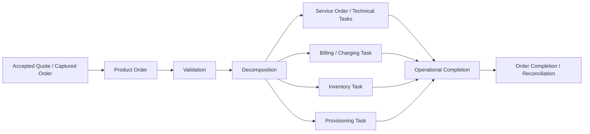
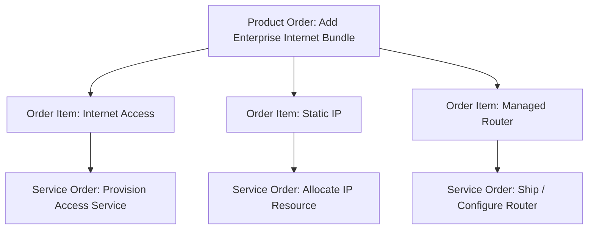
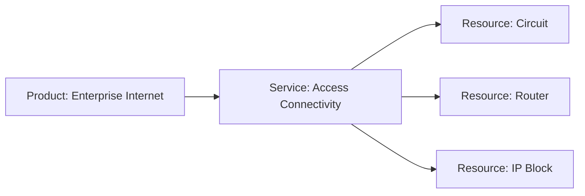
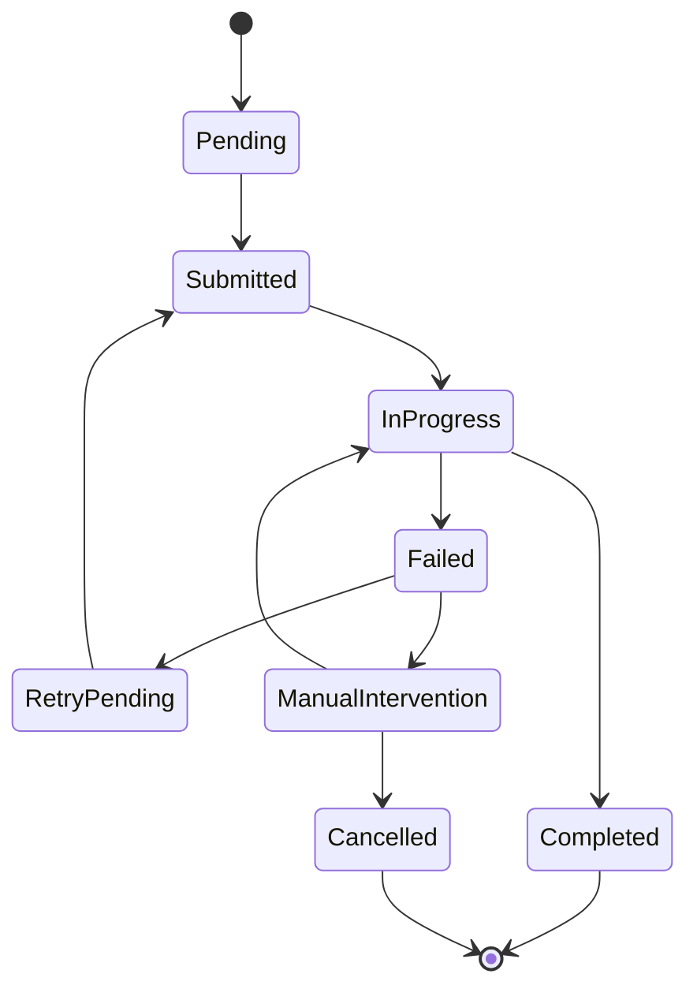
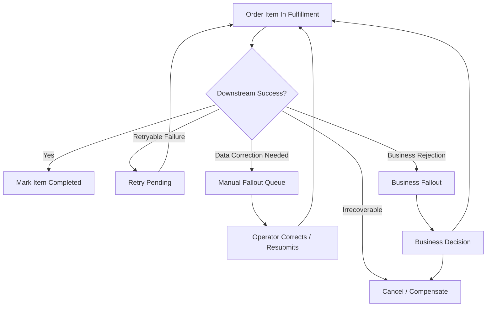
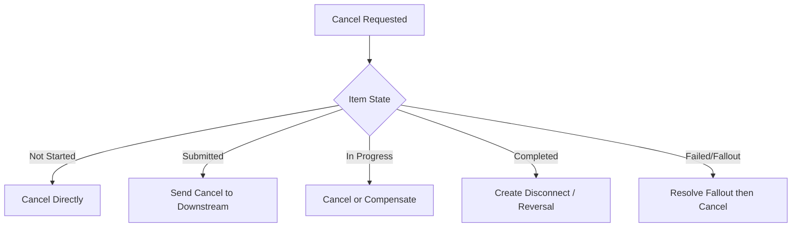

# Part 009 — Fulfillment and Downstream Integration

Fulfillment adalah fase ketika order tidak lagi hanya menjadi intent bisnis, tetapi mulai menyentuh operasi nyata: service ordering, service inventory, resource inventory, provisioning, activation, partner/vendor process, billing activation, charging setup, appointment, dispatch, atau downstream operational workflow lain.

Untuk senior engineer di CPQ/order management, fulfillment harus dipahami sebagai **domain boundary paling rawan**. Di boundary ini, sistem commercial bertemu sistem operational. Banyak kegagalan produksi bukan terjadi karena quote salah dibuat, tetapi karena sistem gagal menerjemahkan commercial promise menjadi operational execution yang konsisten.

Part ini membahas fulfillment dari sudut pandang domain/application: apa yang diserahkan, ke siapa, kapan dianggap sukses, kapan dianggap gagal, bagaimana fallout dipulihkan, bagaimana reconciliation dilakukan, dan bagaimana engineer mereview design agar tidak menghasilkan order yang “secara teknis terkirim” tetapi secara bisnis tidak terpenuhi.

---

## 1. Mental Model Utama

Fulfillment adalah **controlled execution of accepted customer commitment through downstream operational systems**.

Order management biasanya tidak melakukan semua pekerjaan fulfillment sendiri. Ia mengorkestrasi, menerjemahkan, dan memantau pekerjaan yang dilakukan downstream systems. Downstream systems bisa berupa:

- service ordering,
- service inventory,
- resource inventory,
- provisioning,
- network activation,
- billing,
- charging,
- CRM/customer notification,
- workforce management,
- partner/vendor system,
- assurance/monitoring,
- legacy platform,
- customer-specific integration layer.

Mental model yang penting:

Fulfillment bukan satu API call. Fulfillment adalah **multi-system lifecycle**.

---

## 2. Kenapa Fulfillment Kompleks di Enterprise/Telco

Fulfillment kompleks karena order commercial biasanya tidak sama dengan pekerjaan operasional.

Contoh sederhana:

Customer membeli paket enterprise connectivity untuk 20 site. Di quote, ini mungkin terlihat seperti satu bundle. Di fulfillment, ini bisa menjadi:

- feasibility check per site,
- address validation,
- access technology selection,
- circuit provisioning,
- router shipment,
- technician appointment,
- service inventory creation,
- billing account linkage,
- recurring charge activation,
- SLA attachment,
- monitoring configuration,
- customer notification.

Satu order commercial bisa menjadi banyak pekerjaan downstream.

Kompleksitas muncul karena:

1. **Product-to-service translation** tidak selalu satu-ke-satu.
2. **Dependency antar task** bisa kompleks.
3. **Downstream systems punya lifecycle sendiri**.
4. **Order bisa partial complete**.
5. **Beberapa task bisa retryable, beberapa tidak**.
6. **Customer bisa minta cancel/amend saat fulfillment berjalan**.
7. **Billing activation harus sesuai actual fulfillment**.
8. **Inventory harus merefleksikan keadaan operasional, bukan hanya niat bisnis**.
9. **Manual intervention sering menjadi bagian normal proses, bukan exception langka**.
10. **Legacy integration bisa memiliki semantic gap terhadap domain modern**.

---

## 3. Fulfillment Handoff

Fulfillment handoff adalah momen ketika order management menyerahkan pekerjaan kepada sistem operasional.

Handoff yang baik harus menjawab:

- Apa business intent yang sedang dieksekusi?
- Apa product/order item sumbernya?
- Apa action-nya: add, modify, disconnect, suspend, resume?
- Apa technical/service representation yang harus dibuat?
- Apa dependency antar item?
- Apa customer/account/site/agreement context-nya?
- Apa target completion atau milestone-nya?
- Apa yang harus dilakukan jika downstream reject?
- Apa correlation id yang mengikat proses end-to-end?

Handoff yang buruk biasanya hanya “mengirim payload” tanpa menjaga semantic continuity.

### Domain invariant

Setiap fulfillment task harus bisa ditelusuri balik ke:

- order,
- order item,
- product/offering,
- customer/account,
- requested action,
- catalog/agreement context,
- downstream target,
- lifecycle state,
- audit/correlation id.

Jika traceability hilang, reconciliation dan support akan sulit.

---

## 4. Product Order vs Service Order

Dalam banyak domain telco, product order dan service order dibedakan.

**Product order** merepresentasikan permintaan dari sisi commercial/customer-facing product.

**Service order** merepresentasikan pekerjaan operasional untuk membuat, mengubah, atau menghentikan service teknis.

Contoh:

Product order menjawab “customer membeli apa”. Service order menjawab “operasi harus melakukan apa”.

### Kesalahan umum

Kesalahan desain yang sering terjadi:

- mencampur product order dan service order menjadi satu model,
- menganggap setiap product item menghasilkan tepat satu service order,
- menganggap status service sama dengan status product,
- menganggap product completion bisa ditentukan tanpa downstream confirmation,
- menyimpan technical resource detail langsung di commercial quote tanpa boundary jelas.

---

## 5. Service Inventory

Service inventory adalah catatan service yang sudah aktif, sedang berubah, suspended, disconnected, atau dalam lifecycle operasional lain.

Dalam konteks order management, service inventory penting untuk:

- modify existing service,
- disconnect service,
- suspend/resume service,
- validate whether customer owns a service,
- determine current configuration,
- avoid duplicate activation,
- perform reconciliation,
- map product instance to service instance.

### Contoh domain scenario

Customer meminta upgrade bandwidth dari 100 Mbps ke 1 Gbps.

Order management harus tahu:

- apakah customer memiliki service aktif,
- service instance mana yang dimodifikasi,
- konfigurasi saat ini,
- apakah upgrade eligible,
- apakah perubahan butuh provisioning ulang,
- apakah billing harus diubah saat completion atau saat activation.

Tanpa service inventory yang benar, modify order bisa salah target.

### Domain invariant

Modify/disconnect/suspend/resume tidak boleh hanya berbasis product offering baru. Ia harus mereferensikan existing service/product inventory instance yang valid.

---

## 6. Resource Inventory

Resource inventory merepresentasikan resource fisik/logis yang digunakan untuk menyediakan service.

Contoh resource:

- circuit,
- port,
- VLAN,
- IP address,
- SIM,
- router,
- phone number,
- device,
- network element,
- capacity slot.

Resource inventory berbeda dari product inventory dan service inventory.

Untuk CPQ/order management, resource inventory biasanya bukan sumber utama commercial decision, tetapi sangat penting untuk feasibility, serviceability, fulfillment, dan assurance.

### Failure mode

Jika resource inventory stale:

- order bisa diterima padahal resource tidak tersedia,
- provisioning bisa gagal,
- duplicate allocation bisa terjadi,
- customer bisa dijanjikan delivery yang tidak feasible,
- billing bisa aktif sebelum service benar-benar siap.

---

## 7. Provisioning

Provisioning adalah proses mengaktifkan atau mengubah layanan di sistem/network/platform teknis.

Provisioning bisa berupa:

- membuat account teknis,
- mengaktifkan service,
- mengkonfigurasi network element,
- mengalokasikan resource,
- mengirim command ke vendor platform,
- melakukan activation test,
- mengembalikan technical completion status.

Provisioning bukan sekadar downstream call. Provisioning memiliki lifecycle sendiri:

### Domain invariant

Order item tidak boleh dianggap fulfilled hanya karena provisioning request berhasil dikirim. Fulfillment success harus berdasarkan downstream business/operational confirmation yang disepakati.

---

## 8. Billing Activation

Billing activation adalah momen ketika charge mulai berlaku di billing/charging system.

Kesalahan billing activation sangat berisiko:

- customer ditagih sebelum service aktif,
- customer tidak ditagih meskipun service sudah aktif,
- recurring charge salah tanggal,
- one-time charge terduplikasi,
- discount tidak terbawa,
- agreement term tidak diterapkan,
- disconnect tidak menghentikan billing,
- suspend/resume tidak sinkron dengan charging.

### Billing trigger patterns

Beberapa pola umum:

| Pattern | Penjelasan | Risiko |
|---|---|---|
| Billing on order submission | Charge dimulai saat order submitted | Risiko menagih sebelum fulfillment |
| Billing on service activation | Charge dimulai saat service aktif | Butuh confirmation reliable |
| Billing on scheduled date | Charge dimulai sesuai tanggal yang disetujui | Risiko mismatch dengan actual activation |
| Billing on manual milestone | Charge dimulai setelah operator menandai complete | Risiko human error |
| Billing on partial completion | Sebagian charge aktif saat sebagian item selesai | Kompleks untuk bundle dan dependency |

### Domain invariant

Billing activation harus memiliki business basis yang eksplisit: submission date, activation date, completion date, contract effective date, atau agreed start date. Jangan biarkan tanggal billing muncul sebagai efek samping teknis yang tidak bisa dijelaskan.

---

## 9. Charging Integration

Billing dan charging sering dibedakan.

**Billing** biasanya terkait invoice, account balance, statement, tax, recurring charge, one-time charge, dan customer-facing bill.

**Charging** biasanya terkait rating/charging penggunaan, balance, real-time usage, prepaid/postpaid charging, atau usage event.

Untuk CPQ/order management, charging integration penting untuk:

- usage-based product,
- add-on data/voice/SMS,
- threshold/bundle allowance,
- prepaid/postpaid behavior,
- promotion validity,
- activation/deactivation of chargeable service,
- usage entitlement.

### Failure mode

Jika product order selesai tetapi charging entitlement belum aktif, customer bisa punya service tetapi usage gagal. Jika charging aktif tetapi service tidak aktif, customer bisa dikenakan charge tanpa manfaat.

---

## 10. Technical Feasibility and Serviceability

Sebelum atau selama fulfillment, sistem sering perlu memastikan service bisa diberikan.

**Serviceability** menjawab: apakah lokasi/customer/site bisa dilayani?

**Technical feasibility** menjawab: apakah konfigurasi yang diminta bisa direalisasikan secara teknis?

Contoh:

- alamat customer berada di coverage area atau tidak,
- capacity tersedia atau tidak,
- bandwidth feasible atau tidak,
- perangkat compatible atau tidak,
- existing service bisa di-upgrade atau tidak,
- lokasi membutuhkan survey/manual check atau tidak.

### Where feasibility happens

Feasibility bisa terjadi di beberapa titik:

1. saat product discovery,
2. saat quote configuration,
3. saat pricing/approval,
4. sebelum order submission,
5. saat order validation,
6. saat fulfillment downstream,
7. saat manual survey.

### Domain issue

Semakin lambat feasibility dilakukan, semakin besar risiko customer sudah menerima quote/order yang ternyata tidak bisa dipenuhi.

Namun feasibility terlalu awal bisa mahal, lambat, atau bergantung pada data downstream yang tidak selalu tersedia.

---

## 11. Downstream Rejection

Downstream rejection terjadi ketika sistem downstream menolak fulfillment request.

Penyebab umum:

- payload tidak valid,
- mandatory field hilang,
- unknown product/service code,
- customer/account tidak dikenali,
- resource tidak tersedia,
- duplicate request,
- invalid state,
- order action tidak didukung,
- dependency belum selesai,
- downstream maintenance/outage,
- catalog mapping mismatch,
- authorization/entitlement mismatch,
- business rule downstream berbeda dari upstream.

### Rejection bukan selalu technical error

Downstream rejection bisa berarti:

- upstream salah mengirim,
- downstream rule berbeda,
- data master tidak sinkron,
- order secara bisnis tidak feasible,
- request duplicate,
- request datang terlalu cepat,
- manual decision dibutuhkan.

Senior engineer harus menolak simplifikasi “downstream error = retry saja”.

---

## 12. Fallout Management

Fallout adalah kondisi ketika fulfillment tidak bisa lanjut secara otomatis dan membutuhkan recovery, retry, correction, atau manual intervention.

Fallout bukan sekadar exception. Di telco/enterprise order management, fallout sering menjadi domain workflow resmi.

### Fallout harus memiliki taxonomy

Minimal taxonomy:

| Fallout Type | Contoh | Recovery |
|---|---|---|
| Technical transient | timeout, unavailable | retry |
| Technical permanent | invalid endpoint, unsupported payload | fix integration/config |
| Data mismatch | unknown customer, stale catalog mapping | data correction |
| Business rejection | ineligible, no capacity | amend/cancel/business decision |
| Dependency failure | parent item not complete | wait/resequence |
| Manual required | site survey, document check | operator action |
| Unknown | inconsistent status | investigation/reconciliation |

### Domain invariant

Setiap fallout harus memiliki owner, reason, current state, next possible action, audit trail, dan customer-impact visibility.

---

## 13. Retry Semantics

Retry dalam fulfillment harus domain-aware.

Pertanyaan wajib sebelum retry:

- Apakah request idempotent?
- Apakah downstream mungkin sudah memproses request sebelumnya?
- Apakah retry bisa membuat duplicate service/order/resource?
- Apakah state downstream diketahui?
- Apakah payload masih valid?
- Apakah retry harus memakai same correlation id atau new attempt id?
- Apakah business time window masih valid?
- Apakah manual correction terjadi sebelum retry?

### Retry categories

| Retry Type | Kapan dipakai | Risiko |
|---|---|---|
| Automatic retry | transient technical failure | duplicate jika idempotency buruk |
| Manual retry | operator memutuskan setelah inspeksi | human error |
| Correct-and-retry | data diperbaiki lalu request dikirim ulang | payload drift |
| Rebuild-and-retry | request dibuat ulang dari source of truth | inconsistency jika source berubah |
| Compensating retry | memperbaiki side effect lama | kompleks dan audit-sensitive |

### Domain invariant

Retry tidak boleh mengubah business intent tanpa mencatat amendment/revision. Retry adalah usaha ulang untuk intent yang sama, bukan kesempatan diam-diam mengganti order.

---

## 14. Manual Intervention

Manual intervention terjadi ketika sistem tidak dapat menentukan langkah aman secara otomatis.

Manual intervention bisa dibutuhkan untuk:

- feasibility exception,
- data correction,
- customer clarification,
- approval exception,
- provisioning correction,
- billing adjustment,
- site survey,
- partner follow-up,
- fallout resolution,
- reconciliation conflict.

### Manual intervention bukan kegagalan desain sepenuhnya

Dalam enterprise/telco, beberapa proses memang membutuhkan manusia. Yang buruk bukan adanya manual step, tetapi manual step yang:

- tidak punya owner,
- tidak punya SLA,
- tidak punya audit trail,
- tidak punya allowed action,
- tidak bisa dilihat oleh support/ops,
- tidak mengembalikan state yang konsisten,
- bypass invariant.

### Checklist manual workflow

- Siapa owner queue?
- Apa reason code?
- Apa allowed action?
- Apa data yang boleh diubah?
- Apa yang tidak boleh diubah?
- Apakah action menghasilkan event?
- Apakah customer notification dibutuhkan?
- Apakah SLA/aging dimonitor?
- Apakah action bisa diulang?
- Apakah audit trail lengkap?

---

## 15. Reconciliation

Reconciliation adalah proses membandingkan state antar sistem untuk memastikan business reality konsisten.

Reconciliation dibutuhkan karena:

- event bisa hilang,
- downstream response bisa timeout,
- order bisa stuck,
- manual operation bisa terjadi di downstream,
- billing bisa diverge dari fulfillment,
- inventory bisa stale,
- duplicate request bisa membuat duplicate record,
- asynchronous workflow tidak selalu menghasilkan single source of truth yang langsung konsisten.

### Reconciliation targets

| Source | Compared With | Tujuan |
|---|---|---|
| Order management | Service ordering | memastikan task fulfillment benar |
| Order management | Service inventory | memastikan service instance created/updated |
| Order management | Billing | memastikan charge activation sesuai |
| Order management | Provisioning | memastikan activation status benar |
| Product inventory | Service inventory | memastikan product-service mapping benar |
| Event log | Database state | memastikan event tidak hilang/drift |

### Domain invariant

Setiap state penting yang bergantung pada downstream harus memiliki cara untuk diverifikasi ulang. Jika sistem hanya percaya event sekali lewat tanpa reconciliation path, operasi produksi akan rapuh.

---

## 16. Operational Ownership Boundary

Fulfillment melibatkan banyak sistem dan tim. Boundary ownership harus jelas.

Pertanyaan ownership:

- Siapa owner product order state?
- Siapa owner service order state?
- Siapa owner fallout queue?
- Siapa owner retry policy?
- Siapa owner manual correction?
- Siapa owner billing activation issue?
- Siapa owner downstream mapping?
- Siapa owner catalog alignment?
- Siapa owner customer communication?
- Siapa owner reconciliation report?

Boundary yang tidak jelas menghasilkan masalah klasik: order stuck tetapi tidak ada tim yang merasa memilikinya.

### Domain anti-pattern

“Downstream sudah menerima request, jadi tanggung jawab kita selesai.”

Ini sering salah. Tanggung jawab sistem order management biasanya belum selesai sampai ada business-level completion, rejection, cancellation, or compensated terminal state.

---

## 17. Completion Semantics

Order completion harus didefinisikan secara domain, bukan hanya technical success.

Pertanyaan penting:

- Apakah order complete ketika semua downstream request terkirim?
- Apakah complete ketika semua downstream task completed?
- Apakah complete ketika service inventory updated?
- Apakah complete ketika billing active?
- Apakah complete ketika customer notified?
- Apakah partial completion allowed?
- Apakah completion bisa reversed?
- Apa arti completed untuk add vs modify vs disconnect?

### Completion levels

| Level | Meaning | Risiko Jika Disalahgunakan |
|---|---|---|
| Request submitted | downstream menerima request | terlalu awal dianggap complete |
| Technical provisioned | service teknis aktif | billing/customer belum sinkron |
| Inventory updated | service tercatat | provisioning mungkin belum benar |
| Billing activated | charge aktif | service mungkin belum siap |
| Customer fulfilled | customer dapat manfaat | butuh cross-system proof |
| Commercially closed | semua commercial obligation selesai | bisa terlambat untuk operational status |

### Domain invariant

Status completed harus memiliki definisi bisnis eksplisit dan konsisten lintas UI, API, event, reporting, SLA, dan support process.

---

## 18. Partial Fulfillment

Partial fulfillment terjadi ketika sebagian order item berhasil dan sebagian gagal, tertunda, atau dibatalkan.

Contoh:

- 18 dari 20 site berhasil provisioned,
- router shipped tetapi internet access belum aktif,
- base plan aktif tetapi add-on gagal,
- disconnect selesai untuk satu service tetapi modify gagal untuk service lain,
- billing aktif untuk sebagian item.

Partial fulfillment bukan edge case langka. Dalam multi-site, bundle, dan telco order, partial state adalah normal.

### Design questions

- Apakah order bisa completed partially?
- Apakah customer boleh ditagih sebagian?
- Apakah item yang berhasil bisa tetap aktif jika item lain gagal?
- Apakah bundle harus atomic?
- Apakah cancellation harus membatalkan semua item atau hanya failed item?
- Apakah approval/contract mengizinkan partial delivery?
- Bagaimana SLA dihitung?

### Domain invariant

Atomicity order harus didefinisikan. Jangan mengasumsikan semua order harus all-or-nothing atau semua bisa partial. Keputusan ini adalah business rule.

---

## 19. Cancellation During Fulfillment

Cancel order saat fulfillment berjalan adalah salah satu area paling berisiko.

Pertanyaan wajib:

- Item mana yang belum dimulai?
- Item mana yang sedang berjalan?
- Item mana yang sudah selesai?
- Downstream mana yang bisa cancel?
- Downstream mana yang butuh compensation?
- Billing sudah aktif atau belum?
- Inventory sudah dibuat atau belum?
- Resource sudah dialokasikan atau belum?
- Customer sudah diberi notifikasi atau belum?

### Domain invariant

Cancellation harus menghormati actual execution state. Cancel tidak boleh hanya mengubah status order di upstream sementara downstream tetap melanjutkan provisioning.

---

## 20. Amendment During Fulfillment

Amendment adalah perubahan terhadap order yang sudah dibuat atau sedang berjalan.

Contoh amendment:

- ubah delivery date,
- tambah order item,
- hapus item,
- ubah bandwidth,
- ubah site address,
- ubah billing account,
- ubah contact,
- ubah device option,
- ubah promotion/discount,
- ubah dependency.

Amendment lebih sulit daripada cancellation karena ia tidak hanya menghentikan intent lama, tetapi mengubah intent di tengah eksekusi.

### Pertanyaan wajib

- Apakah amendment dilakukan terhadap quote, order, atau service inventory?
- Apakah order lama direvisi atau dibuat order baru?
- Apakah downstream task yang sudah berjalan bisa diubah?
- Apakah amendment memerlukan approval ulang?
- Apakah pricing harus dihitung ulang?
- Apakah agreement masih valid?
- Apakah customer harus menerima perubahan?
- Apakah audit trail menunjukkan before/after?

### Domain invariant

Amendment tidak boleh menghancurkan traceability dari original commitment ke revised commitment. Harus ada hubungan jelas antara order awal, perubahan, dan final execution.

---

## 21. Fulfillment Data Contract

Fulfillment payload harus membawa data yang cukup untuk downstream menjalankan pekerjaan, tetapi tidak boleh sembarangan mengirim seluruh upstream object.

Data contract yang baik biasanya memuat:

- order id,
- order item id,
- action,
- customer/account/site,
- product/offering/spec reference,
- service/resource specification reference,
- configuration attributes,
- effective date/requested completion date,
- dependency/correlation,
- agreement/pricing references jika dibutuhkan,
- callback/correlation information,
- versioning/schema metadata,
- reason code untuk modify/cancel/disconnect.

### Anti-pattern

- Payload terlalu miskin sehingga downstream harus menebak konteks.
- Payload terlalu kaya sehingga downstream bergantung pada model internal upstream.
- Field teknis digunakan untuk membawa business meaning tersembunyi.
- Tidak ada idempotency/correlation key.
- Tidak ada versioning/compatibility strategy.

---

## 22. Observability from Domain Perspective

Observability fulfillment bukan hanya latency dan error rate.

Metric domain yang penting:

- order stuck by state,
- average time in fulfillment,
- fallout rate by reason,
- retry count by downstream,
- manual intervention aging,
- downstream rejection rate,
- partial completion rate,
- cancel during fulfillment rate,
- billing activation mismatch,
- service inventory mismatch,
- reconciliation discrepancy count,
- SLA breach by milestone,
- duplicate downstream request count.

### Useful dashboards

1. **Order lifecycle dashboard**: jumlah order per state dan aging.
2. **Fallout dashboard**: reason, owner, SLA, retry outcome.
3. **Downstream health dashboard**: rejection, timeout, latency, error class.
4. **Billing sync dashboard**: fulfilled but not billed, billed but not fulfilled.
5. **Inventory sync dashboard**: product/service/resource mismatch.
6. **Reconciliation dashboard**: discrepancy type dan aging.

### Domain invariant

State yang bisa stuck harus bisa terlihat. Jika tidak terlihat, ia bukan state; ia adalah hidden operational debt.

---

## 23. Testing Fulfillment Domain

Testing fulfillment harus mencakup happy path dan failure path.

### Scenario matrix

| Scenario | Yang diuji |
|---|---|
| Single item add order | basic handoff and completion |
| Multi-item dependency | ordering and dependency handling |
| Multi-site partial success | partial fulfillment semantics |
| Downstream timeout | retry/idempotency behavior |
| Downstream rejection | fallout classification |
| Manual correction | state transition after operator action |
| Cancel before submission | safe direct cancel |
| Cancel after downstream submit | cancel/compensation |
| Amend in progress | revision and traceability |
| Billing activation failure | completion vs billing mismatch |
| Inventory mismatch | reconciliation behavior |
| Duplicate callback | idempotent completion |
| Out-of-order callback | state guard correctness |

### Test quality bar

A good test does not only assert status code. It asserts:

- state transition,
- event emitted,
- downstream request shape,
- retry/fallout behavior,
- audit trail,
- idempotency,
- customer-visible status,
- reconciliation expectation.

---

## 24. Requirement Review Checklist

Saat membaca requirement fulfillment/downstream integration, tanyakan:

1. Apa business outcome yang diinginkan?
2. Apa downstream system yang bertanggung jawab?
3. Apa yang dikirim ke downstream?
4. Apa yang diterima kembali?
5. Apa state sebelum, selama, dan setelah handoff?
6. Apa definisi success?
7. Apa definisi failure?
8. Apa yang retryable?
9. Apa yang butuh manual intervention?
10. Apa yang harus di-reconcile?
11. Apa yang terjadi jika downstream duplicate/out-of-order?
12. Apa customer-visible impact?
13. Apa billing/inventory impact?
14. Apa audit requirement?
15. Apa operational owner?

---

## 25. PR / Design Review Checklist

Untuk PR/design terkait fulfillment, review hal berikut:

- Apakah product order dan service/technical task boundary jelas?
- Apakah mapping product-to-service eksplisit?
- Apakah idempotency dan correlation benar?
- Apakah retry aman secara domain?
- Apakah fallout reason cukup informatif?
- Apakah state transition guard mencegah illegal callback?
- Apakah cancel/amend mempertimbangkan downstream state?
- Apakah partial completion semantics jelas?
- Apakah billing activation tidak terlalu awal?
- Apakah inventory update sesuai actual completion?
- Apakah audit trail cukup untuk support/dispute?
- Apakah observability mencakup stuck state?
- Apakah reconciliation path tersedia?
- Apakah downstream contract versioning aman?
- Apakah backward compatibility dijaga?

---

## 26. Internal Verification Checklist

Gunakan checklist ini saat onboarding atau saat mulai menyentuh area fulfillment:

### Downstream system map

- Sistem apa saja yang menerima order/fulfillment task?
- Mana yang internal product, mana customer-specific integration?
- Mana legacy, mana modern API/event-driven?
- Apa ownership tiap downstream?

### Lifecycle and state

- Apa status order item selama fulfillment?
- Apa status service order/task?
- Apa terminal state?
- Apa retryable state?
- Apa manual intervention state?
- Apa cancellation/amendment state?

### Contract and mapping

- Bagaimana product order didecompose menjadi service/technical task?
- Mapping disimpan di mana?
- Apakah mapping catalog-driven?
- Apakah mapping versioned?
- Apakah ada customer-specific mapping?

### Fallout and recovery

- Apakah ada fallout queue?
- Apa reason code yang dipakai?
- Siapa owner resolution?
- Apa SLA manual intervention?
- Apakah retry otomatis/manual?
- Apakah ada compensation process?

### Billing and inventory

- Kapan billing activation terjadi?
- Apakah billing bergantung pada service activation?
- Bagaimana product inventory/service inventory diupdate?
- Apa reconciliation process?
- Bagaimana mismatch dideteksi?

### Observability

- Dashboard apa yang dipakai support/ops?
- Alert apa yang ada untuk stuck order?
- Apakah ada report aging by state?
- Apakah ada trace/correlation end-to-end?
- Apakah customer-impact bisa dilihat?

---

## 27. Key Takeaways

Fulfillment adalah tempat order management diuji oleh realitas operasional.

Hal yang harus selalu diingat:

1. Fulfillment bukan satu API call, tetapi lifecycle lintas sistem.
2. Product order dan service/technical execution tidak selalu satu-ke-satu.
3. Downstream success harus didefinisikan secara bisnis, bukan hanya HTTP success.
4. Fallout adalah domain workflow, bukan sekadar exception.
5. Retry harus idempotent dan domain-safe.
6. Manual intervention harus punya owner, reason, action, audit, dan SLA.
7. Billing activation harus sinkron dengan business basis yang eksplisit.
8. Inventory harus merefleksikan actual operational state.
9. Partial fulfillment adalah realitas normal di enterprise/telco.
10. Cancel/amend saat fulfillment berjalan adalah area high-risk.
11. Reconciliation adalah safety net wajib untuk asynchronous multi-system workflow.
12. Observability harus menjawab pertanyaan bisnis, bukan hanya metrik teknis.

Sebagai senior engineer, kontribusi terbesar Anda bukan hanya membuat integration call berhasil. Kontribusi terbesar adalah memastikan handoff, state, failure, recovery, billing, inventory, dan audit tetap benar saat realitas downstream tidak rapi.
