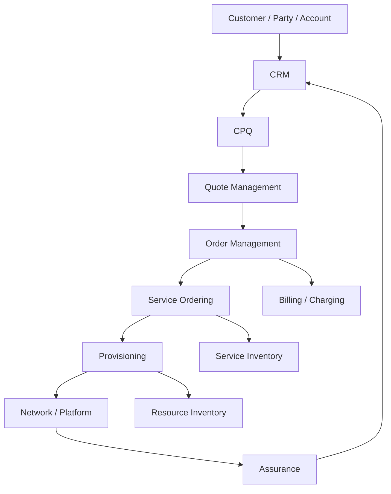
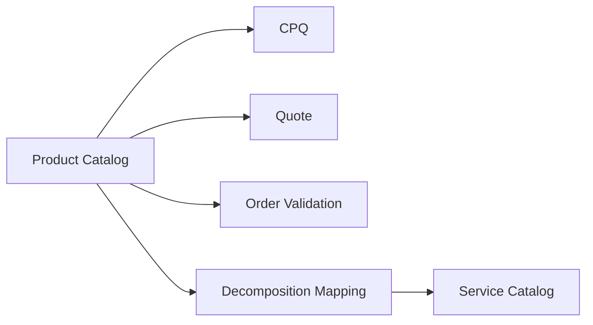
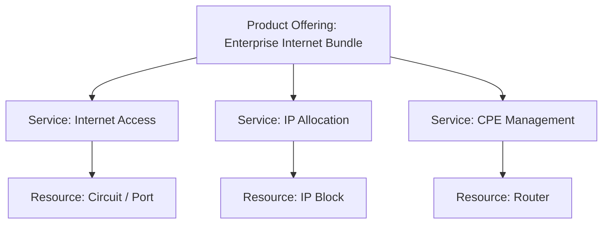
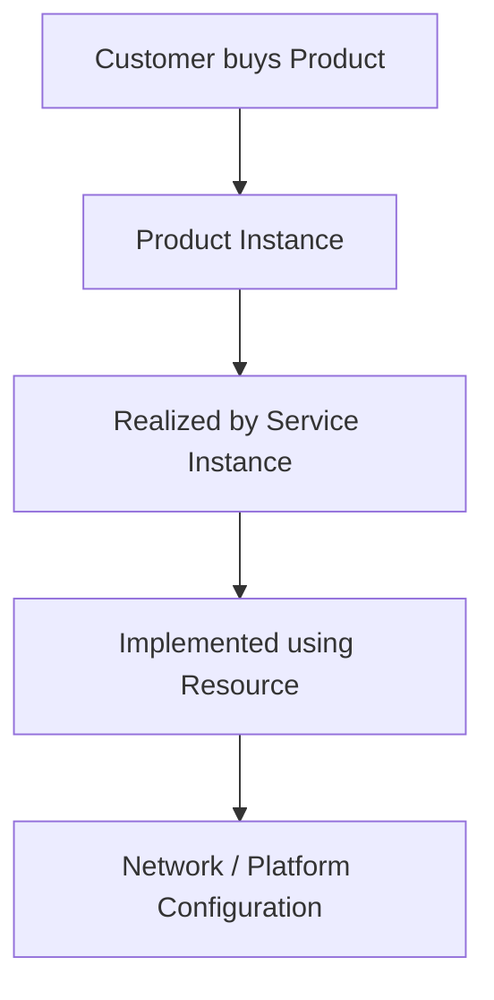
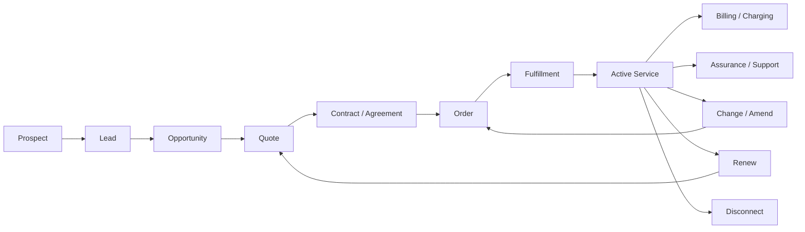
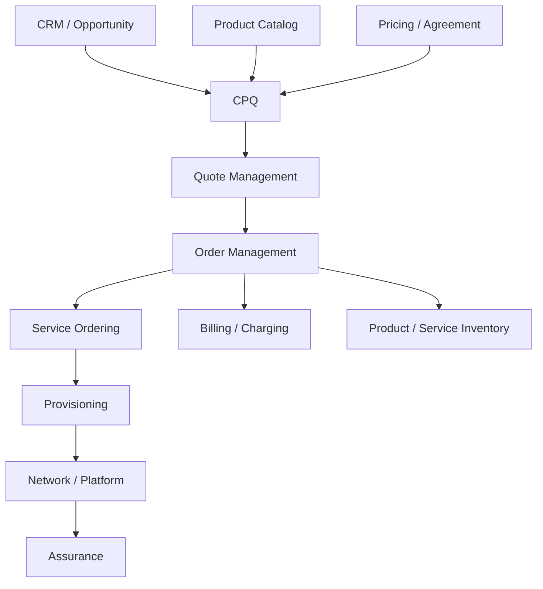

# Part 010 — Telco BSS/OSS Mental Model

Telco BSS/OSS adalah landscape domain yang besar, historis, dan berlapis. Untuk engineer yang baru masuk ke CPQ/order management, kesalahan awal yang umum adalah melihat sistem hanya sebagai aplikasi penjualan/order. Dalam telco, CPQ dan order management berada di tengah hubungan rumit antara customer, product, service, resource, network, billing, charging, assurance, dan operations.

Part ini membangun mental model BSS/OSS agar Anda bisa memahami posisi Quote & Order dalam landscape besar. Fokusnya bukan menghafal semua sistem telco, tetapi memahami **kenapa lapisannya banyak, apa tanggung jawab tiap lapisan, bagaimana data mengalir, dan di mana CPQ/order management harus menjaga boundary domain**.

---

## 1. Mental Model Utama

Telco memisahkan beberapa jenis realitas:

1. **Customer reality**: siapa customer, account, contact, organization, agreement.
2. **Commercial reality**: produk apa yang dijual, harga, diskon, kontrak, quote.
3. **Order reality**: apa yang diminta untuk dieksekusi.
4. **Service reality**: layanan teknis apa yang aktif atau berubah.
5. **Resource reality**: resource fisik/logis apa yang dipakai.
6. **Network/platform reality**: konfigurasi teknis di network atau platform.
7. **Billing/charging reality**: apa yang ditagih, kapan, dan berdasarkan usage apa.
8. **Assurance reality**: apakah layanan berjalan dan bagaimana gangguan ditangani.

BSS/OSS bukan sekadar kumpulan sistem. Ia adalah pemisahan tanggung jawab antara commercial/customer domain dan operational/network domain.

---

## 2. Apa Itu BSS

**BSS** biasanya berarti Business Support Systems.

BSS mendukung aktivitas bisnis/customer-facing seperti:

- customer management,
- sales,
- CRM,
- product catalog,
- CPQ,
- quote management,
- order capture,
- order management,
- contract/agreement,
- billing,
- charging,
- revenue management,
- partner/channel management,
- customer care,
- self-service.

BSS menjawab pertanyaan:

- Siapa customer?
- Produk apa yang bisa dijual?
- Harga dan diskonnya apa?
- Apa yang customer setujui?
- Order apa yang harus diproses?
- Apa yang harus ditagih?
- Apa status customer-facing service/product?

BSS dekat dengan customer, revenue, contract, dan commercial lifecycle.

---

## 3. Apa Itu OSS

**OSS** biasanya berarti Operations Support Systems.

OSS mendukung aktivitas operational/network-facing seperti:

- service catalog,
- service ordering,
- service inventory,
- resource inventory,
- activation/provisioning,
- network inventory,
- fault management,
- performance management,
- assurance,
- field workforce,
- topology,
- capacity management,
- monitoring,
- mediation.

OSS menjawab pertanyaan:

- Service teknis apa yang harus dibuat?
- Resource apa yang tersedia?
- Network element mana yang harus dikonfigurasi?
- Apakah service aktif?
- Apakah ada fault?
- Apakah performa sesuai SLA?
- Apakah capacity cukup?

OSS dekat dengan network, platform, resource, service, dan operational execution.

---

## 4. BSS vs OSS: Perbedaan yang Harus Diingat Engineer

| Aspek | BSS | OSS |
|---|---|---|
| Fokus | customer, product, revenue | service, resource, network |
| Bahasa | customer-facing product | technical service/resource |
| Contoh object | quote, order, billing account | service, circuit, port, device |
| Primary concern | commercial correctness | operational correctness |
| Failure impact | wrong price, wrong contract, wrong bill | service not provisioned, network fault |
| User utama | sales, care, billing, product | operations, network, provisioning |
| Lifecycle | sell, order, bill, support | design, activate, monitor, repair |

CPQ/order management biasanya berada di BSS, tetapi harus berinteraksi kuat dengan OSS.

---

## 5. CRM dalam Landscape Telco

CRM adalah sistem yang mengelola interaksi dan konteks customer.

CRM biasanya menangani:

- lead,
- opportunity,
- customer profile,
- account,
- contact,
- interaction history,
- sales pipeline,
- customer care case,
- campaign,
- channel interaction.

Dalam quote-to-cash, CRM sering menjadi titik awal:

### Boundary penting

CRM mengetahui konteks customer dan sales opportunity. CPQ mengetahui konfigurasi produk, pricing, quote, dan commercial proposal. Order management mengetahui execution request.

Jangan campur semua tanggung jawab ke CRM atau ke CPQ.

---

## 6. CPQ dalam BSS

CPQ adalah domain yang menjawab:

- produk apa yang bisa dikonfigurasi,
- opsi apa yang compatible,
- customer eligible atau tidak,
- harga apa yang berlaku,
- diskon apa yang boleh diberikan,
- approval apa yang diperlukan,
- quote apa yang valid untuk customer.

CPQ biasanya berinteraksi dengan:

- CRM untuk customer/opportunity context,
- product catalog untuk offering/configuration,
- pricing engine untuk charge/discount,
- agreement/contract untuk terms,
- approval workflow untuk guardrail,
- order management untuk conversion.

### CPQ bukan hanya UI konfigurasi

CPQ adalah **commercial decision engine**. Ia menjaga agar sales intent menjadi proposal yang valid, priced, approved, explainable, dan convertible.

---

## 7. Product Catalog

Product catalog menyimpan definisi commercial product yang bisa dijual.

Ia menjawab:

- offering apa yang tersedia,
- product specification apa yang mendasari offering,
- bundle apa yang bisa dijual,
- option apa yang compatible,
- eligibility rule apa yang berlaku,
- price reference apa yang dipakai,
- lifecycle/status product apa,
- version apa yang valid.

Product catalog berada di sisi BSS/commercial, tetapi sering menjadi input ke OSS melalui mapping ke service catalog.

---

## 8. Order Management dalam BSS/OSS Boundary

Order management adalah jembatan antara commercial promise dan operational execution.

Order management harus memahami:

- product order,
- order item,
- order action,
- validation,
- decomposition,
- orchestration,
- dependency,
- fallout,
- downstream handoff,
- completion,
- cancellation,
- amendment,
- reconciliation.

Order management berada dekat dengan BSS, tetapi efeknya menyebar ke OSS dan billing.

### Boundary utama

Order management tidak boleh hanya menjadi message router. Ia harus menjaga lifecycle, invariant, dan business meaning dari order.

---

## 9. Service Catalog

Service catalog mendefinisikan service teknis/operasional yang bisa dibuat atau dikelola.

Product catalog menjelaskan apa yang dijual. Service catalog menjelaskan service apa yang harus ada agar product tersebut bisa diberikan.

Contoh:

| Product Catalog | Service Catalog |
|---|---|
| Enterprise Internet 1Gbps | Access Connectivity Service |
| Static IP Add-on | IP Allocation Service |
| Managed Router | CPE Management Service |
| Voice Plan | Voice Service |
| IoT Connectivity Package | SIM/Data Connectivity Service |

### Product-to-service mapping

Mapping ini bisa sederhana atau sangat kompleks.

### Domain risk

Jika product catalog berubah tetapi service catalog/mapping tidak selaras, order bisa valid secara commercial tetapi gagal secara operational.

---

## 10. Service Inventory

Service inventory mencatat service instance yang dimiliki customer atau sedang aktif/berubah.

Ia penting untuk:

- modify existing service,
- disconnect,
- suspend/resume,
- trouble ticket correlation,
- assurance,
- billing validation,
- customer care,
- reconciliation.

### Product inventory vs service inventory

Product inventory menyatakan customer memiliki product instance tertentu. Service inventory menyatakan service teknis tertentu aktif/berubah untuk mendukung product tersebut.

| Product Inventory | Service Inventory |
|---|---|
| Customer has Enterprise Internet Plan | Access service active at site X |
| Customer has Static IP Add-on | IP block allocated |
| Customer has Managed Router | Router management service active |

Keduanya harus terhubung, tetapi tidak sama.

---

## 11. Resource Inventory

Resource inventory mencatat resource yang dipakai untuk menyediakan service.

Contoh:

- phone number,
- SIM,
- IP address,
- circuit,
- port,
- device,
- router,
- VLAN,
- capacity,
- network element.

Resource inventory adalah domain OSS yang sangat penting untuk feasibility dan provisioning.

### Kenapa CPQ/order engineer perlu peduli?

Karena order bisa gagal jika resource tidak tersedia. Quote bisa salah jika eligibility/serviceability tidak mempertimbangkan resource. Provisioning bisa duplicate jika resource reservation tidak idempotent.

---

## 12. Provisioning

Provisioning mengubah network/platform state agar service benar-benar tersedia.

Provisioning bisa melibatkan:

- activation command,
- configuration push,
- device setup,
- account creation,
- SIM activation,
- network element update,
- partner/vendor request,
- activation confirmation.

Provisioning adalah titik di mana order menyentuh realitas teknis.

### Invariant penting

Order completion tidak boleh didasarkan hanya pada provisioning request submitted. Harus jelas apakah completion butuh provisioning completed, service inventory updated, billing active, atau kombinasi beberapa milestone.

---

## 13. Billing

Billing adalah domain yang menghasilkan tagihan customer.

Billing biasanya menangani:

- invoice,
- recurring charge,
- one-time charge,
- tax,
- adjustment,
- credit,
- billing account,
- payment,
- dunning/collection,
- billing cycle,
- bill presentation.

CPQ/order management berkontribusi ke billing dengan membawa:

- product/price information,
- charge type,
- discount,
- effective date,
- billing account,
- agreement/contract term,
- activation/completion signal,
- disconnect/suspend/resume signal.

### Domain failure

Billing mismatch adalah salah satu failure paling sensitif. Salah tagih bisa menjadi dispute, revenue leakage, compliance issue, dan customer trust problem.

---

## 14. Charging

Charging adalah proses menentukan charge berdasarkan usage, entitlement, balance, atau real-time event.

Charging penting untuk:

- usage-based plan,
- prepaid/postpaid,
- data/voice/SMS,
- roaming,
- overage,
- allowance,
- throttling,
- real-time credit control,
- rating.

CPQ/order management perlu memastikan entitlement/charging configuration sesuai dengan product yang dijual.

Contoh failure:

- customer membeli add-on data tetapi entitlement tidak aktif,
- plan disconnect tetapi charging masih berjalan,
- usage charge tidak mengikuti agreement discount,
- promo berlaku di quote tetapi tidak di charging.

---

## 15. Assurance

Assurance adalah domain yang memastikan service berjalan sesuai expectation dan menangani gangguan.

Assurance mencakup:

- monitoring,
- fault management,
- performance management,
- SLA tracking,
- incident/ticket,
- alarm correlation,
- service impact analysis,
- customer notification,
- repair workflow.

Assurance biasanya masuk setelah service aktif, tetapi data dari order dan inventory sangat penting untuk assurance.

### Hubungan dengan CPQ/order

Jika order/inventory salah, assurance bisa salah mengidentifikasi customer terdampak, service terdampak, SLA, atau entitlement support.

---

## 16. Mediation

Mediation adalah lapisan yang mengumpulkan, menormalisasi, memperkaya, dan meneruskan usage/event dari network/platform ke billing, charging, assurance, atau analytics.

Contoh mediation:

- mengambil usage record dari network,
- menormalisasi format vendor,
- menghubungkan usage ke customer/product/account,
- meneruskan usage ke charging/billing,
- memfilter duplicate,
- memperkaya record dengan metadata.

CPQ/order engineer tidak selalu menyentuh mediation langsung, tetapi perlu tahu bahwa usage-based product bergantung pada rantai ini.

### Failure mode

Jika mediation mapping salah, customer bisa ditagih salah, usage hilang, duplicate usage terjadi, atau entitlement tidak sesuai.

---

## 17. Product / Service / Resource Separation

Ini adalah salah satu mental model paling penting dalam telco.

### Product

Customer-facing commercial object.

Contoh:

- Mobile Plan,
- Enterprise Internet,
- Managed Router,
- Static IP Add-on,
- Cloud Voice Package.

### Service

Technical capability used to deliver product.

Contoh:

- connectivity service,
- voice service,
- IP allocation service,
- device management service.

### Resource

Physical/logical asset used by service.

Contoh:

- SIM,
- phone number,
- port,
- router,
- circuit,
- IP address.

### Kenapa pemisahan ini penting?

Karena commercial change tidak selalu sama dengan technical change.

Contoh:

- Customer upgrade plan: product changes, service may modify bandwidth, resource may stay same.
- Customer changes billing package: product/billing changes, service/resource may not change.
- Network migration: resource changes, product customer sees may stay same.
- Device replacement: resource changes, product and service may stay same.

---

## 18. Customer Lifecycle dalam Telco

Customer lifecycle telco biasanya panjang dan berulang:

CPQ/order management bukan hanya acquisition. Ia juga mendukung:

- add product,
- modify service,
- upgrade/downgrade,
- suspend/resume,
- renew,
- cancel,
- disconnect,
- migrate,
- transfer ownership,
- move site.

---

## 19. Why Telco Has Many Layers

Telco memiliki banyak lapisan karena:

1. **Produk customer-facing tidak sama dengan service teknis**.
2. **Service teknis tidak sama dengan resource fisik/logis**.
3. **Network/platform vendor berbeda-beda**.
4. **Legacy system hidup lama**.
5. **Regulasi dan audit penting**.
6. **Billing dan charging sangat kompleks**.
7. **Customer lifecycle panjang**.
8. **Enterprise customer punya kontrak dan hierarchy rumit**.
9. **Change order lebih umum daripada one-time checkout**.
10. **Assurance dan SLA penting setelah fulfillment**.
11. **Data consistency lintas sistem sulit**.
12. **Downtime/service impact langsung terlihat customer**.

Layering bukan sekadar overengineering. Ia muncul karena domain telco memiliki realitas bisnis dan operasional yang berbeda.

---

## 20. CPQ/Order Management Positioning

Quote & Order berada di tengah:

- di atasnya ada CRM/opportunity/customer interaction,
- di sampingnya ada catalog/pricing/agreement/approval,
- di bawahnya ada service ordering/provisioning/inventory/billing,
- setelahnya ada assurance/support/change lifecycle.

### Senior engineer perspective

Ketika mengubah CPQ/order feature, tanyakan:

- Apakah perubahan ini hanya commercial?
- Apakah perubahan ini memengaruhi service decomposition?
- Apakah perubahan ini memengaruhi billing?
- Apakah perubahan ini memengaruhi inventory?
- Apakah perubahan ini memengaruhi provisioning?
- Apakah perubahan ini memengaruhi customer-visible status?
- Apakah perubahan ini memengaruhi assurance/support?

---

## 21. Data Flow End-to-End

Secara sederhana:

1. CRM membawa customer/opportunity context.
2. CPQ menggunakan catalog/pricing/agreement untuk membentuk quote.
3. Quote disetujui customer dan/atau approval internal.
4. Order dibuat dari quote atau capture langsung.
5. Order divalidasi.
6. Order didecompose menjadi downstream tasks.
7. Service ordering/provisioning menjalankan activation/change.
8. Inventory diperbarui.
9. Billing/charging diaktifkan atau diubah.
10. Assurance/support memakai inventory dan customer/product context.

### Data continuity

Hal penting bukan hanya data berpindah, tetapi meaning tetap konsisten.

Contoh continuity:

- Product offering di quote harus bisa ditelusuri ke order item.
- Order item harus bisa ditelusuri ke service order.
- Service order harus bisa ditelusuri ke service inventory.
- Billing charge harus bisa ditelusuri ke product/price/agreement.
- Support case harus bisa melihat product/service/customer context.

---

## 22. Common Integration Patterns

Dalam landscape BSS/OSS, integrasi bisa berbentuk:

| Pattern | Contoh | Risiko |
|---|---|---|
| Synchronous API | validate customer, check eligibility | coupling, timeout |
| Asynchronous event | order submitted, service activated | eventual consistency |
| Batch file | billing feed, inventory sync | latency, reconciliation |
| Adapter/connector | legacy system integration | semantic mismatch |
| Workflow orchestration | order decomposition/execution | stuck state |
| Data replication | customer/product mirror | stale data |
| Manual queue | fallout resolution | SLA and audit risk |

Tidak ada pattern yang selalu benar. Yang penting adalah domain semantics: timing, ownership, consistency, recovery, and audit.

---

## 23. Common Failure Modes Across BSS/OSS

| Failure | Root Cause | Impact |
|---|---|---|
| Quote valid but order rejected | catalog/order rule mismatch | sales delay |
| Order accepted but provisioning fails | service/resource infeasible | fulfillment fallout |
| Billing active before service | wrong activation trigger | customer dispute |
| Service active but billing missing | missing billing event | revenue leakage |
| Inventory says active but network not active | stale/inaccurate inventory | support confusion |
| Network active but product inventory missing | reconciliation failure | support/billing gap |
| Product changed but service mapping stale | catalog drift | downstream rejection |
| Duplicate order sent downstream | idempotency failure | duplicate service/resource |
| Cancel upstream but downstream continues | cancellation race | unwanted activation/billing |
| Assurance cannot identify impacted product | broken product-service-resource mapping | poor incident response |

Senior engineer harus melihat failure ini sebagai cross-domain consistency problem, bukan hanya defect lokal.

---

## 24. Domain Invariants Across BSS/OSS

Beberapa invariant lintas landscape:

1. Customer/account identity harus konsisten lintas CRM, CPQ, order, billing, support.
2. Product sold harus bisa ditelusuri ke quote/order/billing/inventory.
3. Service activated harus punya basis order atau migration yang valid.
4. Billing charge harus punya basis product/price/agreement/activation yang bisa dijelaskan.
5. Disconnect harus menghentikan fulfillment/service dan billing sesuai rule.
6. Modify harus mengacu pada existing product/service instance yang valid.
7. Resource allocation tidak boleh duplicate.
8. Order completion harus align dengan fulfillment, inventory, dan billing semantics.
9. Product/service/resource mapping harus version-aware.
10. Customer-visible status tidak boleh berbohong terhadap operational state.

---

## 25. How to Read a BSS/OSS Architecture Diagram

Saat melihat diagram internal, jangan hanya catat kotak dan panah. Baca dengan pertanyaan domain:

- Sistem mana owner customer?
- Sistem mana owner product catalog?
- Sistem mana owner quote?
- Sistem mana owner order?
- Sistem mana owner product inventory?
- Sistem mana owner service inventory?
- Sistem mana owner billing account?
- Sistem mana owner pricing?
- Sistem mana owner agreement?
- Sistem mana owner provisioning state?
- Sistem mana owner customer-visible status?
- Panah mana command?
- Panah mana event?
- Panah mana replication?
- Panah mana lookup?
- Panah mana manual process?
- Mana source of truth, mana cache/projection?

### Important distinction

Panah di diagram tidak cukup. Anda perlu tahu semantic-nya:

- request/response,
- event notification,
- state synchronization,
- ownership transfer,
- data replication,
- orchestration command,
- manual escalation.

---

## 26. Requirement Review Checklist

Saat requirement menyentuh BSS/OSS landscape, tanyakan:

1. Domain mana yang berubah: CRM, CPQ, order, catalog, billing, inventory, provisioning, assurance?
2. Apakah perubahan commercial atau operational?
3. Apakah ada product-service-resource mapping impact?
4. Apakah billing/charging berubah?
5. Apakah lifecycle state berubah?
6. Apakah event/API contract berubah?
7. Apakah downstream perlu data baru?
8. Apakah customer-visible status berubah?
9. Apakah support/assurance perlu data ini?
10. Apakah reconciliation perlu diperbarui?
11. Apakah ada migration/backfill untuk existing customer/service?
12. Apakah multi-customer/customer-specific behavior terdampak?
13. Apakah ada compliance/audit implication?

---

## 27. PR / Design Review Checklist

Untuk PR/design yang menyentuh BSS/OSS boundary:

- Apakah ownership data jelas?
- Apakah source of truth tidak dilanggar?
- Apakah mapping product/service/resource eksplisit?
- Apakah perubahan catalog berdampak ke decomposition?
- Apakah order lifecycle tetap konsisten?
- Apakah billing trigger tidak berubah diam-diam?
- Apakah inventory update sesuai real operational state?
- Apakah downstream contract compatible?
- Apakah event schema mempertahankan business meaning?
- Apakah idempotency/correlation cukup untuk trace end-to-end?
- Apakah failure/retry/fallout/reconciliation dipikirkan?
- Apakah support/ops bisa melihat status yang benar?
- Apakah ada risiko customer ditagih salah?
- Apakah ada risiko service aktif tanpa product/billing?
- Apakah ada risiko product aktif tanpa service?

---

## 28. Internal Verification Checklist

Gunakan checklist ini untuk memahami landscape internal CSG/team/product Anda tanpa mengarang detail:

### Landscape

- Minta diagram BSS/OSS atau system context diagram.
- Identifikasi sistem CRM, CPQ, quote, order, catalog, billing, charging, inventory, provisioning, assurance.
- Tandai mana bagian produk CSG, mana external/customer system, mana integration adapter.

### Ownership

- Siapa source of truth customer?
- Siapa source of truth product catalog?
- Siapa source of truth quote?
- Siapa source of truth order?
- Siapa source of truth product inventory?
- Siapa source of truth service inventory?
- Siapa source of truth billing account?

### Integration

- API apa yang synchronous?
- Event apa yang asynchronous?
- Batch/file feed apa yang ada?
- Adapter legacy apa yang ada?
- Apa correlation id end-to-end?
- Apa reconciliation path?

### Product/service/resource mapping

- Apakah ada service catalog?
- Apakah product-to-service mapping catalog-driven?
- Apakah mapping customer-specific?
- Apakah mapping versioned?
- Apakah mapping diuji otomatis?

### Operations

- Bagaimana order stuck dideteksi?
- Bagaimana fallout diselesaikan?
- Bagaimana billing mismatch dideteksi?
- Bagaimana inventory mismatch dideteksi?
- Bagaimana support melihat customer/product/service state?

---

## 29. Key Takeaways

Telco BSS/OSS harus dipahami sebagai landscape layered, bukan satu aplikasi besar.

Hal yang harus selalu diingat:

1. BSS dekat dengan customer, product, revenue, contract, quote, order, billing.
2. OSS dekat dengan service, resource, network, provisioning, assurance.
3. Product, service, dan resource adalah lapisan berbeda.
4. CPQ menjaga commercial correctness.
5. Order management menjaga execution lifecycle.
6. Service ordering/provisioning menjaga operational execution.
7. Billing/charging menjaga monetization.
8. Assurance menjaga post-activation service quality.
9. Mapping antar lapisan adalah sumber kompleksitas dan failure.
10. Cross-system consistency lebih penting daripada local code elegance.
11. Requirement kecil di CPQ bisa berdampak ke order, billing, inventory, provisioning, dan support.
12. Senior engineer harus mampu membaca landscape sebagai jaringan ownership, lifecycle, invariant, dan failure mode.

Jika Part 009 memperdalam fulfillment boundary, Part 010 memberi peta besar tempat boundary itu berada. Setelah ini, seri akan masuk ke TM Forum sebagai reference model industri untuk memahami bagaimana telco mencoba menstandarkan domain yang kompleks ini.
