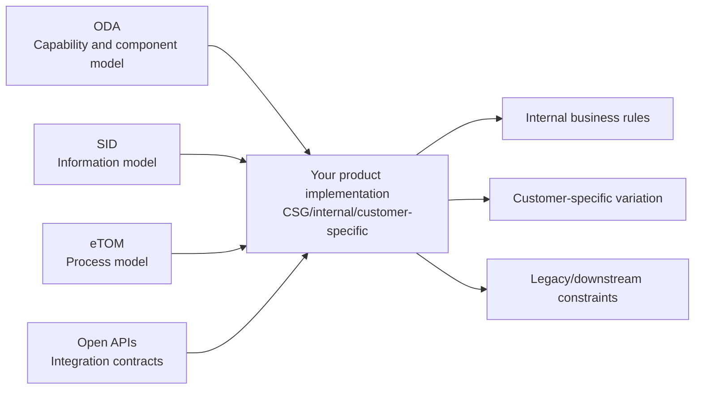
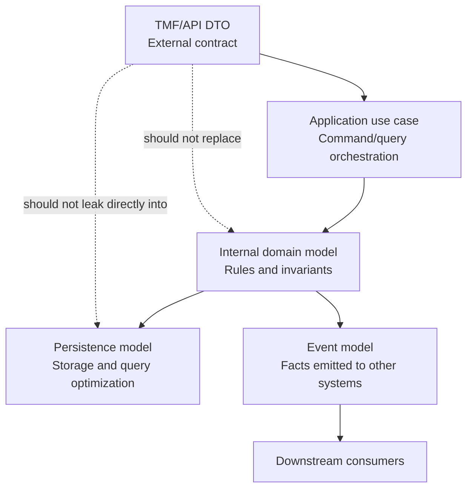

# Part 011 — TM Forum Reference Model

> Goal: understand TM Forum not as a magic implementation blueprint, but as a shared industry reference model that helps engineers reason about telco business capabilities, domain entities, process boundaries, and integration contracts.

This part is intentionally domain-focused. It does not teach how to implement TMF APIs in Java, how to generate clients, or how to configure API gateways. The purpose is to help a senior engineer use TM Forum as a lens for domain correctness.

---

## 1. Why TM Forum matters in quote and order domains

In enterprise telco systems, teams often struggle with the same problem under different names:

- What exactly is a customer?
- Is an order a commercial request, a fulfillment request, or both?
- Is a product the same as a service?
- Is product inventory the same as service inventory?
- Does quote acceptance create an order, a contract, or both?
- Which system owns catalog, pricing, inventory, billing, or provisioning data?
- Which lifecycle status is internal, external, commercial, operational, or technical?

TM Forum exists because telco ecosystems are multi-vendor, multi-system, long-lived, integration-heavy, and full of overlapping business concepts. Without a shared language, every integration becomes a translation war.

For a senior engineer in CPQ/order management, TM Forum is useful because it gives you:

1. **A vocabulary** for customer, product, service, resource, order, inventory, agreement, and process concepts.
2. **A separation model** between commercial product, customer-facing service, resource-facing service, and physical/logical resources.
3. **A process frame** for how sales, ordering, fulfillment, assurance, billing, and operations relate.
4. **API resource patterns** for integrating systems without inventing every contract from scratch.
5. **A review baseline** when evaluating whether internal models are aligned, extended, or drifting.

But TM Forum is not a substitute for your product's actual rules. It is a reference model, not a complete business answer.

---

## 2. The four TM Forum pieces you need to separate

When people say "TM Forum", they may mean different things:

| TM Forum asset | What it answers | Engineer mental model |
|---|---|---|
| ODA | What business/platform capabilities should exist and how components should fit together | Capability and component architecture |
| SID | What business entities exist and how concepts relate | Information/data reference model |
| eTOM | What business processes exist and how work flows across the enterprise | Process reference model |
| Open APIs | How systems can expose standardized API resources and operations | Integration contract model |

The common mistake is treating these four as one thing. They are related, but they operate at different levels.

The right question is not "Are we TMF compliant?" in a vague sense.

The better questions are:

- Which TM Forum APIs do we expose, consume, or map to?
- Which version of each API is relevant?
- Which resources are implemented as-is, extended, or adapted?
- Which lifecycle statuses are aligned vs internally specific?
- Which internal entities map to SID concepts?
- Which eTOM process area does this feature affect?
- Which ODA component boundary does this capability belong to?

---

## 3. ODA: capability and component thinking

ODA stands for Open Digital Architecture. For this learning series, treat ODA as a capability/component reference model for digital telco operations.

ODA helps you reason about:

- What capabilities belong together.
- What systems/components should own which responsibilities.
- Where APIs should exist between components.
- How modularity and interoperability should be structured.
- How telco BSS/OSS systems can move away from monolithic, hardwired integration.

In a Quote & Order context, ODA is useful when you ask:

- Is product catalog a separate capability or embedded inside quote?
- Is pricing owned by CPQ, catalog, policy, or external rating/charging systems?
- Is product ordering separate from service ordering?
- Is product inventory separate from service/resource inventory?
- Does Quote & Order own fulfillment orchestration, or only order capture and commercial order management?
- Which downstream systems should be called directly, and which should be behind domain APIs?

### ODA as a boundary discussion tool

ODA does not tell you your exact internal module names. It gives you a way to challenge blurry ownership.

Bad framing:

> "This API should call whatever service has the data."

Better framing:

> "Which ODA/domain capability owns this business fact, and are we consuming it through the correct contract?"

Bad framing:

> "Order needs inventory data, so order service should query inventory tables."

Better framing:

> "Product ordering needs inventory state as a business input; the inventory-owning capability should expose it through a stable contract or event."

### ODA smell list for engineers

Watch for these smells:

- Quote module updates catalog data directly.
- Order management mutates product inventory without clear ownership.
- Fulfillment orchestration performs pricing recalculation.
- Billing activation logic is hidden inside quote acceptance.
- Customer-specific extensions leak into generic domain models without isolation.
- API DTOs become the internal domain model everywhere.
- One canonical model is forced across all contexts.
- Status fields are reused across quote, product order, service order, and fulfillment even when semantics differ.

These are not automatically wrong, but they deserve architectural scrutiny.

---

## 4. SID: information model and common vocabulary

SID is the TM Forum Information Framework. For engineers, its most useful role is to clarify domain concepts and relationships.

SID helps answer:

- What are the important business entities?
- Which entities belong to customer, product, service, resource, market/sales, partner, enterprise, or common domains?
- How do product, service, and resource concepts differ?
- Which concepts should be modeled as business facts rather than technical implementation details?

### The product/service/resource separation

This is one of the most important telco domain separations.

| Layer | Meaning | Example mindset |
|---|---|---|
| Product | What is sold to the customer | Business/commercial offer |
| Service | What is delivered to satisfy the product | Customer-facing or resource-facing service |
| Resource | What is used to realize the service | Network, SIM, number, port, device, logical resource |

In CPQ/order management, the product layer dominates. In OSS/provisioning, service/resource layers dominate. Many integration problems happen when teams collapse these layers.

Example:

- A customer buys a broadband product.
- The product order captures the commercial request.
- The service order describes what service must be activated/changed.
- Resource provisioning allocates technical resources.
- Product inventory records the customer-owned product instance.
- Service inventory records the realized service.

If the product order starts pretending to be a service order, the domain boundary becomes fragile.

### SID as a glossary anchor, not a database schema

SID is not your database schema. Do not treat it as a command to name every table exactly after SID entities.

Use SID to:

- Clarify ambiguous terms.
- Compare internal entities against industry concepts.
- Identify missing relationships.
- Detect overloaded objects.
- Structure integration discussions.

Do not use SID to:

- Blindly force internal model rewrites.
- Remove customer-specific rules.
- Pretend all telco products behave the same.
- Ignore performance, migration, or legacy constraints.
- Collapse runtime workflow concerns into static entity diagrams.

### SID review questions

When reviewing an entity/model/design:

- Is this concept commercial, customer, service, resource, partner, or common?
- Is the name aligned with industry language or an internal alias?
- Is the object carrying responsibilities from multiple SID domains?
- Is this relationship stable, or customer-specific?
- Is this entity a business concept or a persistence artifact?
- Does the model preserve product/service/resource separation?
- Are agreement, customer, account, product offering, product instance, and service instance properly separated?

---

## 5. eTOM: process and operating model thinking

The eTOM Business Process Framework helps classify business activities and understand how processes connect across a service provider.

For Quote & Order, eTOM is useful because it reminds you that a feature is rarely isolated. A quote or order change can affect:

- Selling.
- Customer management.
- Product lifecycle management.
- Order handling.
- Service configuration and activation.
- Resource provisioning.
- Billing and revenue management.
- Assurance and support.
- Partner/channel management.
- Reporting and compliance.

### Process view vs system view

A common mistake is to map one eTOM process to one system. Real systems usually cut across process areas.

Example:

A "submit quote" capability may involve:

- Sales process: capture customer intent.
- Product process: validate offerings and configuration.
- Pricing process: calculate charges and discounts.
- Approval process: enforce commercial authority.
- Contract process: bind agreement terms.
- Ordering process: prepare conversion into product order.
- Reporting process: preserve audit trail.

The system endpoint may be one API call, but the process impact is multi-domain.

### eTOM as a requirement analysis tool

When reading a story, ask:

- Which process area does this story claim to affect?
- Which adjacent process areas are implicitly affected?
- Does the story describe only UI behavior, or also business process responsibility?
- Does the story change sales behavior, order handling, fulfillment, billing, or support?
- Does the story introduce new process ownership or handoff?
- Does it require operational reporting or exception handling?

Example weak user story:

> As a sales user, I want to cancel an order.

Better domain analysis:

- Is the order already submitted?
- Has fulfillment started?
- Are any order items completed?
- Is cancellation commercial, operational, or technical?
- Does cancellation reverse product inventory?
- Does it notify billing?
- Does it create fallout if downstream rejects cancellation?
- Is the cancellation request auditable?
- Can cancellation be partial?

This is eTOM-style thinking: understand the business activity and its enterprise process consequences.

---

## 6. Open APIs: integration contracts, not internal truth

TM Forum Open APIs define standardized REST API resources and operations for many telco capabilities.

For Quote & Order, relevant APIs include:

- TMF620 Product Catalog Management.
- TMF648 Quote Management.
- TMF622 Product Ordering Management.
- TMF629 Customer Management.
- TMF637 Product Inventory Management.
- TMF641 Service Ordering Management.

Open APIs help systems interoperate, but they are not automatically your internal domain model.

### API resource model vs internal domain model

A TMF API resource is an integration-facing shape. Your internal product may need:

- More granular aggregates.
- Internal state machines.
- Customer-specific extensions.
- Persistence-optimized models.
- Event models.
- Policy/rule models.
- Workflow/orchestration models.
- Audit and compliance structures.

Do not confuse these layers:

### What Open APIs are good for

Use them to:

- Standardize external integration.
- Reduce vendor-specific contract invention.
- Provide familiar resource names.
- Structure interoperability with CRM, catalog, order, inventory, and service systems.
- Drive conformance and partner alignment discussions.
- Improve API review vocabulary.

### What Open APIs are not good for

Do not use them as:

- A complete business rule specification.
- A full workflow/state-machine definition for your product.
- A persistence model.
- A replacement for internal acceptance criteria.
- A guarantee that two vendors implement semantics identically.
- A reason to ignore backward compatibility or migration risk.

---

## 7. Standard model vs product implementation

A real enterprise product rarely implements a standard exactly as-is. There are several possible relationships to a standard.

| Relationship | Meaning | Review implication |
|---|---|---|
| Aligned | Internal concept closely matches TMF concept | Keep naming and lifecycle consistent |
| Extended | TMF concept is used with extra fields/rules | Ensure extensions are documented and compatible |
| Adapted | Internal concept maps to TMF but differs semantically | Need explicit mapping and anti-corruption layer |
| Inspired-by | TMF influenced design but contract is not compatible | Do not claim conformance casually |
| Divergent | Internal model solves a different problem | Document reason and integration impact |

Senior engineers should avoid both extremes:

- **Blind standard worship**: forcing a standard even when product reality differs.
- **Local invention bias**: ignoring standards and inventing isolated models that hurt integration.

The mature position is explicit mapping.

---

## 8. How to use TM Forum in CSG Quote & Order onboarding

Use TM Forum as a comparison framework while onboarding.

Do not ask:

> "Do we use TM Forum?"

Ask:

> "Which TMF APIs or concepts are relevant to our product boundaries, and where do we align, extend, adapt, or diverge?"

Better questions:

- Does Quote & Order expose or consume TMF620, TMF648, TMF622, TMF629, TMF637, or TMF641?
- Which versions are supported?
- Are the APIs customer-facing, internal, partner-facing, or adapter-layer contracts?
- Does the internal quote lifecycle match TMF Quote lifecycle semantics?
- Does product order status match TMF ProductOrder status semantics?
- Do we separate product order from service order?
- How do we map product catalog entities to internal catalog concepts?
- Where are extension fields documented?
- Do we have conformance tests or customer-specific mappings?
- Which customers require strict TMF alignment vs customized contracts?

---

## 9. Alignment matrix template

Use this matrix when studying internal documentation or PRs.

| Area | TMF reference | Internal concept | Relationship | Risk | Owner to ask |
|---|---|---|---|---|---|
| Product catalog | TMF620 | TBD | Aligned/Extended/Adapted/Divergent | Catalog mismatch, version drift | Catalog owner |
| Quote | TMF648 | TBD | TBD | Quote lifecycle mismatch | CPQ/Quote owner |
| Product order | TMF622 | TBD | TBD | Order status mismatch | Order owner |
| Customer | TMF629 | TBD | TBD | Customer/account ambiguity | Customer/CRM owner |
| Product inventory | TMF637 | TBD | TBD | Installed product state ambiguity | Inventory owner |
| Service order | TMF641 | TBD | TBD | Product/service boundary leak | Fulfillment/OSS owner |

This template is intentionally simple. Its value is not the table; its value is forcing explicit domain mapping.

---

## 10. Common TM Forum misuse patterns

### Misuse 1: "TMF says this, therefore our product must do it"

A standard is not your product backlog. Customer-specific commercial rules, legacy integrations, deployment constraints, regulatory requirements, and product strategy may require different behavior.

Correct approach:

- Identify the TMF baseline.
- Identify the internal requirement.
- Document the difference.
- Assess interoperability impact.

### Misuse 2: "We have fields with TMF names, so we are aligned"

Naming similarity does not guarantee semantic alignment.

Check:

- Lifecycle semantics.
- Cardinality.
- Relationship meaning.
- Status values.
- Ownership.
- Event behavior.
- Error behavior.
- Extension behavior.

### Misuse 3: "Open API resource equals aggregate root"

An API resource may be a coarse integration payload. Your domain aggregate may need different boundaries.

Example:

A ProductOrder API payload may include many order items. Internally, order item orchestration may need separate state, retry, fallout, dependency, and compensation rules.

### Misuse 4: "TMF is only API work"

TM Forum is broader than APIs. For domain reasoning, SID and eTOM are often more important than API syntax.

### Misuse 5: "Conformance means business correctness"

API conformance may prove contract shape and behavior at the API level. It does not prove customer-specific pricing, approval, catalog, or fulfillment correctness.

---

## 11. Domain invariants TM Forum helps protect

TM Forum does not enforce these automatically, but it gives vocabulary to express them.

### Product/service/resource separation

A commercial product should not be treated as the same thing as a technical service or resource.

Violation examples:

- Product order directly allocates network resources.
- Quote line item stores provisioning-specific resource state.
- Product inventory is used as service inventory without mapping.

### Lifecycle ownership separation

Each lifecycle has its own owner:

- Quote lifecycle: commercial negotiation.
- Product order lifecycle: commercial order request and orchestration.
- Service order lifecycle: service-level fulfillment.
- Product inventory lifecycle: installed product/customer-owned product state.
- Billing lifecycle: charging and invoicing responsibility.

### Contract boundary stability

External contracts should not change every time internal models change.

Violation examples:

- Internal enum rename breaks external API.
- Persistence field leaks into TMF response.
- Customer-specific extension becomes mandatory globally.

### Semantic mapping explicitness

If internal states differ from TMF states, mapping must be deliberate.

Violation examples:

- Internal `IN_PROGRESS` maps inconsistently to multiple external statuses.
- `completed` means order accepted in one context and fulfilled in another.
- `cancelled` means commercial cancellation in one system and downstream technical rollback in another.

---

## 12. Failure modes caused by weak reference-model thinking

| Failure mode | Root cause | Detection signal |
|---|---|---|
| Product/service confusion | Commercial and technical layers collapsed | Product order contains provisioning-only fields |
| Status mismatch | Internal lifecycle mapped loosely to external API | Consumers interpret status differently |
| Catalog mismatch | Product offering relationship/version not preserved | Quote accepted using stale or invalid offering |
| Inventory ambiguity | Product inventory vs service/resource inventory confused | Customer sees product active while service not provisioned |
| API drift | Internal changes leak into external contract | Breaking changes in partner integrations |
| Extension sprawl | Customer-specific fields added without governance | API payload becomes inconsistent across customers |
| Process gap | Requirement ignores downstream process | Order completes commercially but billing/provisioning not reconciled |
| Over-standardization | Team forces TMF structure where product needs differ | Internal model becomes awkward and rule leakage increases |
| Under-standardization | Team ignores TMF reference entirely | Integration becomes vendor-specific and costly |

---

## 13. Review checklist for TM Forum-related design

Use this during design review or PR review.

### Concept alignment

- Which TM Forum concept is being used?
- Is it ODA, SID, eTOM, or Open API related?
- Is the internal concept actually equivalent?
- Are we using standard terminology accurately?

### Boundary alignment

- Which capability owns the business fact?
- Does this design preserve product/service/resource separation?
- Is the API contract separated from the internal domain model?
- Is there an anti-corruption layer where semantics differ?

### Lifecycle alignment

- Which lifecycle is affected: quote, product order, service order, product inventory, billing, or agreement?
- Are statuses mapped explicitly?
- Are terminal, retryable, and fallout states clear?
- Are events emitted using business semantics?

### Extension alignment

- Are custom fields documented?
- Are custom fields optional or required?
- Are extensions customer-specific or product-wide?
- Will extensions break conformance or compatibility?

### Operational alignment

- Can support teams explain the status shown externally?
- Can failures be reconciled across systems?
- Is audit trail preserved?
- Are integration errors classified as technical errors, domain errors, or process exceptions?

---

## 14. Internal verification checklist

Use this checklist during onboarding.

### Documentation to find

- TM Forum alignment or conformance documentation.
- API contract documentation for quote/order/catalog/customer/inventory/service ordering.
- Product architecture overview.
- System landscape diagram.
- Event catalog.
- Domain glossary.
- State transition diagrams.
- Customer-specific extension guidelines.
- API versioning and compatibility policy.

### Questions for product owner/business analyst

- Which customer journeys rely on TMF-style APIs?
- Which concepts are industry-standard vs product-specific?
- Which lifecycle states are visible to users?
- Which statuses drive business decisions, reporting, or SLA?
- Which variations are customer-specific?

### Questions for solution architect

- Which TMF APIs are exposed, consumed, adapted, or ignored?
- Are we aligned to specific versions?
- Where are extension fields governed?
- Which systems own catalog, customer, order, inventory, and service state?
- Which mappings are implemented in adapters vs core product logic?

### Questions for senior engineers

- Which domain terms are misleading in the codebase?
- Where does API model leak into domain or persistence model?
- Which statuses have caused bugs?
- Which integration contracts are hardest to change?
- Which TMF mappings are known compromises?

### Codebase/documentation search terms

Search for:

- `TMF620`, `TMF648`, `TMF622`, `TMF629`, `TMF637`, `TMF641`
- `ProductOffering`, `ProductSpecification`, `ProductOrder`, `Quote`, `ServiceOrder`
- `Customer`, `Account`, `Party`, `Agreement`
- `ProductInventory`, `ServiceInventory`, `ResourceInventory`
- `externalId`, `href`, `@type`, `@baseType`, `@schemaLocation`
- `status`, `state`, `lifecycleStatus`, `orderItemState`
- `extension`, `customFields`, `characteristic`

---

## 15. Senior engineer takeaway

TM Forum should make you more precise, not more dogmatic.

Use it to:

- Ask better domain questions.
- Separate product, service, and resource layers.
- Clarify lifecycle ownership.
- Compare internal concepts against industry models.
- Review API contracts with semantic rigor.
- Detect integration drift early.
- Avoid accidental coupling between quote, order, catalog, inventory, and fulfillment.

Do not use it to bypass internal discovery. A standard tells you what the industry commonly means. Your product, customer contracts, internal architecture, and operational reality tell you what the system must actually do.

---

## 16. Quick self-test

Answer these without looking back:

1. What is the difference between ODA, SID, eTOM, and Open APIs?
2. Why is SID not the same as a database schema?
3. Why is eTOM useful when reviewing a user story?
4. Why should TMF API resources not automatically become internal aggregates?
5. What is the difference between aligned, extended, adapted, inspired-by, and divergent?
6. Why is product/service/resource separation central in telco systems?
7. What internal documents would you look for to verify TMF alignment?
8. What are three signs that an implementation is only superficially TMF-aligned?
