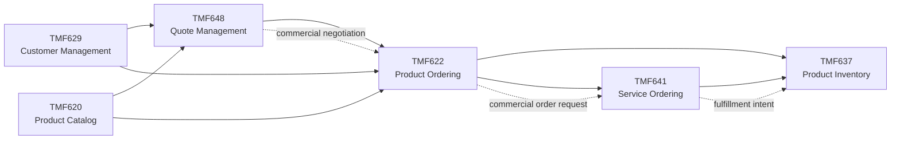
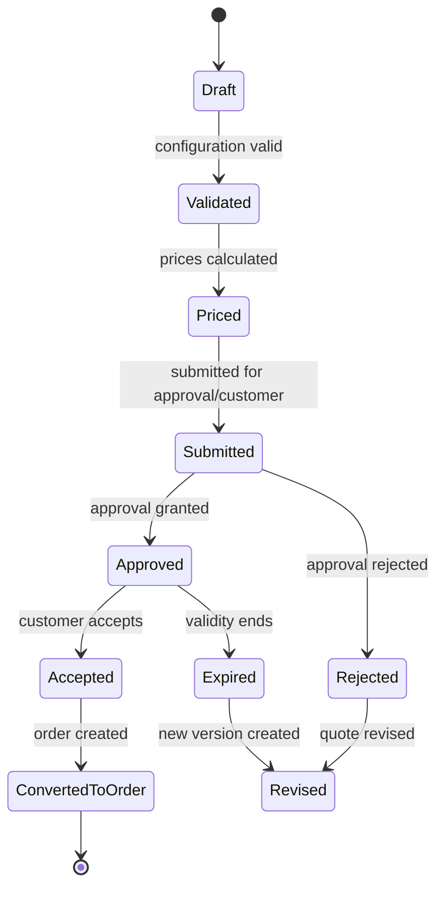
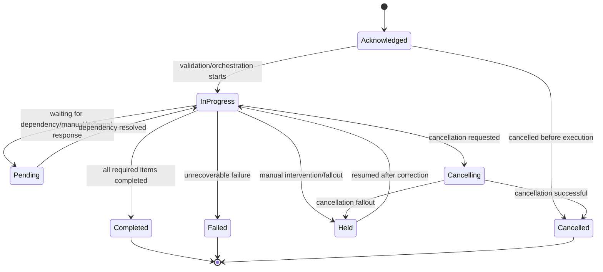
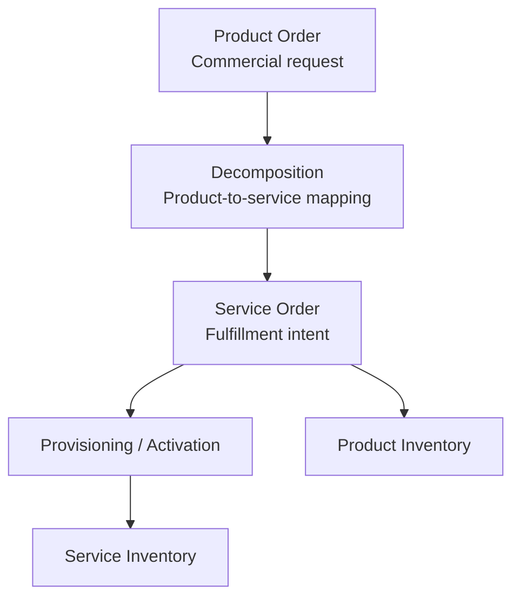
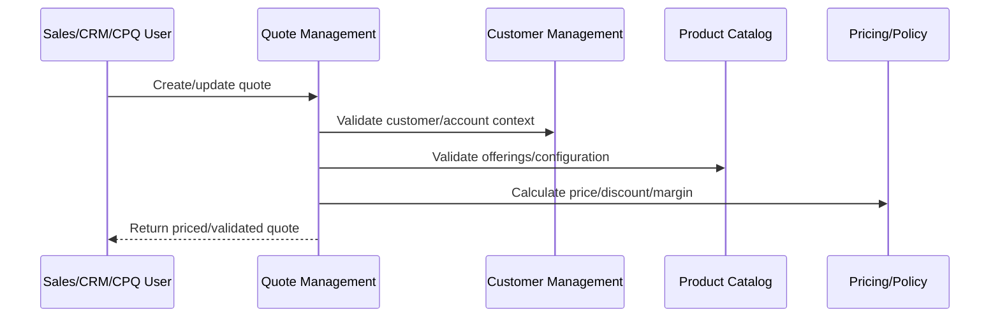
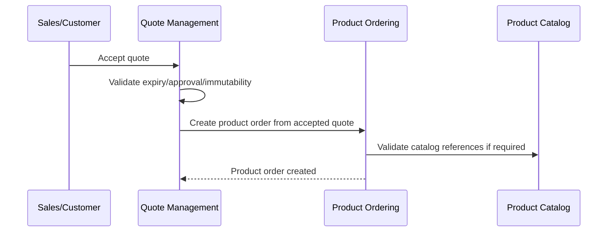
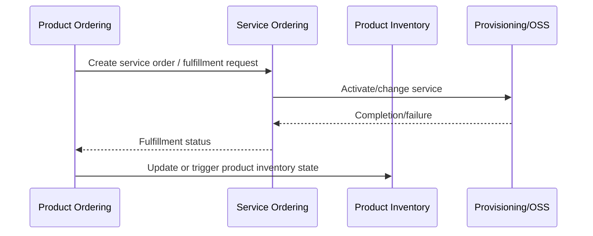
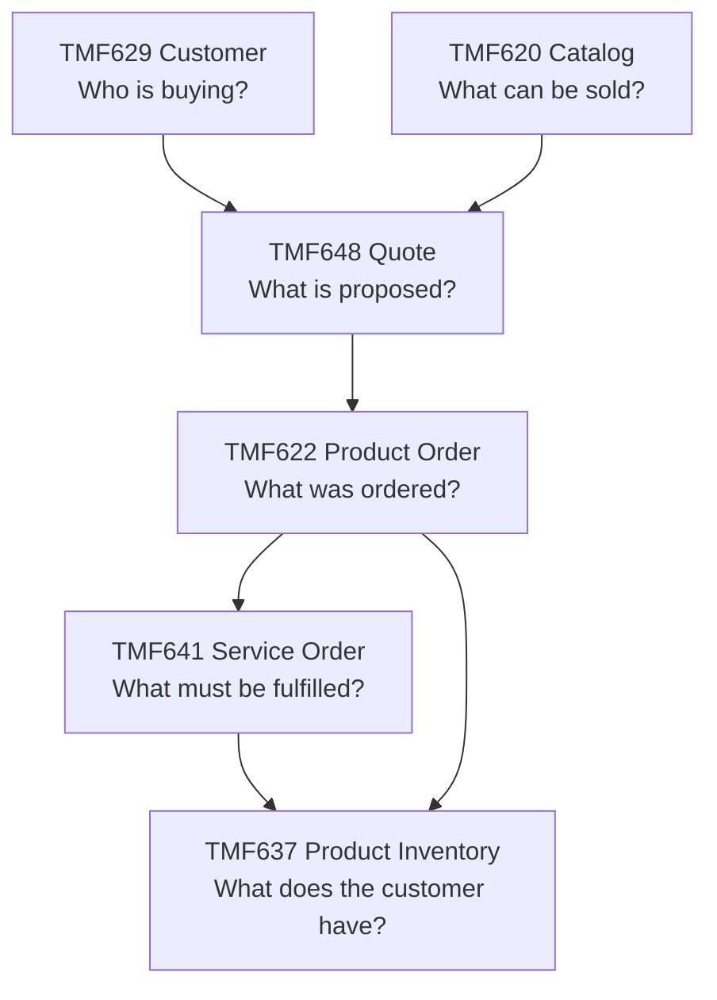

# Part 012 — TM Forum Open APIs for Quote and Order

> Goal: understand the main TM Forum Open APIs around CPQ and order management as business contracts between telco capabilities, not merely as REST endpoints.

This part focuses on six APIs that are highly relevant to quote and order reasoning:

- TMF620 — Product Catalog Management
- TMF648 — Quote Management
- TMF622 — Product Ordering Management
- TMF629 — Customer Management
- TMF637 — Product Inventory Management
- TMF641 — Service Ordering Management

The point is not to memorize every field. The point is to understand what each API is responsible for, how they relate, and where implementation mistakes usually happen.

---

## 1. The API map in one picture

This diagram is simplified. Real implementations may include product offering qualification, agreement management, party management, billing, service inventory, resource inventory, trouble ticketing, appointment, payment, notification, and assurance APIs.

For Quote & Order, these six APIs give you the core map:

| API | Domain responsibility | Main lifecycle question |
|---|---|---|
| TMF620 | What can be sold? | Is the product offering valid, available, and structured? |
| TMF648 | What is being commercially proposed? | Is the quote configured, priced, approved, accepted, or expired? |
| TMF622 | What has the customer ordered? | Is the product order captured, validated, in progress, completed, cancelled, or failed? |
| TMF629 | Who is buying and under which customer/account context? | Is the customer/account identity and relationship valid? |
| TMF637 | What product instances does the customer have? | What installed/owned product state exists after order fulfillment? |
| TMF641 | What service-level work must be performed? | What service actions must be fulfilled downstream? |

---

## 2. TMF620 Product Catalog Management

### Business meaning

TMF620 represents the product catalog capability. It is about the lifecycle and consultation of catalog elements used by sales, ordering, campaign, and related processes.

For CPQ/order management, the catalog is not passive reference data. It is the source of commercial structure:

- Product offerings.
- Product specifications.
- Prices or price references.
- Bundles.
- Options.
- Relationships.
- Eligibility and market constraints.
- Lifecycle validity.
- Versioning.

### What TMF620 should help answer

- Which product offerings can be sold?
- Which product specification does an offering instantiate?
- Which characteristics are configurable?
- Which products can be bundled together?
- Which options are mandatory, optional, compatible, or incompatible?
- Which offerings are active, retired, or future-dated?
- Which catalog version was used at quote/order time?

### Quote & Order impact

Quote and order correctness depends heavily on catalog correctness.

A quote line usually points to a product offering. An order item usually preserves the commercial intent captured from a product offering. If catalog references are ambiguous, stale, or mutable without version awareness, downstream correctness becomes fragile.

### Key invariant

A quote/order item must be traceable to the catalog definition used to configure and price it.

This does not always mean storing the entire catalog snapshot, but it does mean the system must preserve enough identity/version/context to explain why the quote/order was valid at the time.

### Common failure modes

| Failure | Description | Engineering signal |
|---|---|---|
| Stale offering | Quote uses an offering that has expired or changed | Accepted quote fails order validation |
| Version ambiguity | Quote references product offering ID without version/context | Recalculation produces different result |
| Bundle mismatch | Bundle rule differs between quote and order | Order decomposition fails |
| Characteristic drift | Configurable attribute changed after quote | Downstream rejects order item |
| Catalog lifecycle leak | Retired offering still orderable | Inconsistent sales behavior |

### Internal verification checklist

- Which internal service/module owns product catalog?
- Are product offering and product specification separate concepts?
- Is catalog version or validity captured on quote/order line items?
- How are bundles/options/compatibility represented?
- Does quote validation call catalog at runtime, use snapshots, or both?
- What happens when catalog changes between quote creation and quote acceptance?
- Are catalog extensions customer-specific?

---

## 3. TMF648 Quote Management

### Business meaning

TMF648 represents quote management. A quote is a commercial proposal to a customer, usually created before a product order.

A quote captures:

- Customer/account context.
- Product offering selections.
- Configuration choices.
- Price, discount, and charge details.
- Agreement references.
- Validity period.
- Approval state.
- Quote items.
- Terms and conditions.
- A path toward order creation after acceptance.

### What TMF648 should help answer

- What is being proposed to the customer?
- Is the proposed configuration valid?
- Has the quote been priced?
- Is approval required?
- Has approval been granted or rejected?
- Is the quote still valid?
- Has the customer accepted it?
- Can it be converted into a product order?

### Quote lifecycle reasoning

A simplified lifecycle:

Actual internal systems may use different statuses. The important thing is the semantic boundary.

### Key invariant

An accepted quote must represent a valid, priced, approved-if-required, non-expired commercial proposal.

If your system allows quote-to-order conversion from an invalid, unpriced, unapproved, or expired quote, the domain is broken.

### Quote-to-order boundary

The transition from quote to product order is not a simple copy operation.

It must preserve:

- Customer/account context.
- Selected product offerings.
- Configuration.
- Pricing commitments.
- Discount and approval evidence.
- Agreement references.
- Catalog identity/version.
- Quote acceptance evidence.
- Audit trail.

It may transform:

- Quote item into order item.
- Proposed action into order action.
- Commercial terms into order fulfillment constraints.
- Pricing details into billing/charging handoff attributes.

### Common failure modes

| Failure | Description | Engineering signal |
|---|---|---|
| Quote accepted after expiry | Validity not enforced at acceptance/conversion | Order created from stale commercial offer |
| Price mismatch | Price recalculated differently at order time | Customer dispute or approval bypass |
| Approval bypass | Discount/override accepted without required approval | Audit/compliance defect |
| Quote mutation after acceptance | Accepted proposal changes | Non-repudiation/audit issue |
| Partial conversion ambiguity | Only some quote items become order items without explicit rule | Missing product/order item traceability |

### Internal verification checklist

- Which statuses exist for quote and quote item?
- Is quote acceptance separate from order creation?
- Are accepted quotes immutable?
- How is quote revision/versioning handled?
- Is quote validity enforced at submit, approve, accept, and convert?
- Is price locked or recalculated at order creation?
- How are approval decisions stored and audited?
- Are quote items traceable to order items?

---

## 4. TMF622 Product Ordering Management

### Business meaning

TMF622 represents product ordering. A product order captures what the customer has ordered at the commercial product layer.

A product order is not the same thing as a service order. Product ordering is about the customer-facing commercial order. Service ordering is about fulfillment work required to realize the product.

### What TMF622 should help answer

- What product offerings/products has the customer ordered?
- What action is requested for each order item?
- Is the order valid against catalog, customer, agreement, and business rules?
- What is the order state?
- What dependencies exist between order items?
- Can the order be amended or cancelled?
- Has the order completed, failed, or entered fallout?

### Order item actions

Common order item actions include:

- Add.
- Modify.
- Delete/disconnect.
- Suspend.
- Resume.
- No-change/contextual reference.

Actual action semantics must be verified internally. Do not assume action names are universal.

### Product order lifecycle

Internal systems may use different names; the key is to understand which states are terminal, retryable, manually recoverable, externally waiting, or compensation-related.

### Key invariant

A product order must represent a coherent customer request whose items, actions, dependencies, and lifecycle state are explainable and auditable.

### Product order vs quote

| Concern | Quote | Product order |
|---|---|---|
| Meaning | Commercial proposal | Customer order/request |
| Mutability | Often mutable before acceptance | More constrained after submission |
| Pricing | Proposed/negotiated | Committed or fulfillment/billing-relevant |
| Approval | Commercial guardrail | Usually precondition inherited from quote/order capture |
| Lifecycle focus | Negotiate and accept | Execute and reconcile |
| Failure type | Invalid proposal, expired, approval rejection | Fallout, downstream rejection, partial completion |

### Common failure modes

| Failure | Description | Engineering signal |
|---|---|---|
| Duplicate order | Same accepted quote creates multiple orders | Missing idempotency/business key |
| Illegal amendment | Order changed after irreversible fulfillment | Downstream inconsistency |
| Cancellation race | Cancel request conflicts with in-progress fulfillment | Divergent order/service/product inventory states |
| Partial completion ambiguity | Some items complete, others fail | Order-level status hides item-level truth |
| Dependency violation | Child item executes before parent | Fulfillment failure or invalid product inventory |

### Internal verification checklist

- Which product order statuses and order item statuses exist?
- Are order-level and item-level states independent?
- How is quote-to-order idempotency enforced?
- What actions are supported per product type?
- Are dependencies explicit or implicit?
- How are amend/cancel handled after fulfillment starts?
- What is the fallout/manual intervention model?
- What events are emitted for order and order item transitions?

---

## 5. TMF629 Customer Management

### Business meaning

TMF629 represents customer and customer account management. In enterprise CPQ/order management, customer context is not just a name on a quote. It affects eligibility, agreement, pricing, tax, billing, fulfillment, legal responsibility, and service location.

A customer may be:

- A person.
- An organization.
- Another service provider.
- A complex enterprise with hierarchy and multiple accounts.

### What TMF629 should help answer

- Who is the customer?
- What customer account is involved?
- Is the customer valid and active?
- Which billing/service/account structure applies?
- Which organization hierarchy or party relationship matters?
- Which customer-specific terms apply?

### Customer context in quote/order

A quote or order without correct customer context is unsafe.

Customer context can affect:

- Product eligibility.
- Regional availability.
- Account-specific pricing.
- Agreement terms.
- Tax and billing responsibility.
- Shipping or service address.
- Credit or risk policy.
- Approval routing.
- Partner/reseller/channel behavior.

### Key invariant

Quote and order operations must bind to the correct customer/account/party context, not merely a display name or loose customer ID.

### Common failure modes

| Failure | Description | Engineering signal |
|---|---|---|
| Account ambiguity | Quote uses customer ID but not billing/service account | Billing or fulfillment handoff fails |
| Wrong hierarchy | Enterprise parent/child relationship ignored | Agreement/pricing applied incorrectly |
| Stale customer status | Inactive customer can place order | Compliance or operational defect |
| Channel confusion | Partner/reseller context lost | Wrong commercial terms |
| Customer merge/split issue | Customer IDs change across CRM systems | Quote/order traceability breaks |

### Internal verification checklist

- Does the product distinguish customer, account, party, organization, and contact?
- Which customer/account object is used by quote and order?
- How are billing account and service account represented?
- Are customer hierarchy and enterprise agreements supported?
- Is customer data mastered internally or consumed from CRM?
- How are customer identity changes reconciled?

---

## 6. TMF637 Product Inventory Management

### Business meaning

TMF637 represents product inventory: the products that exist for or are owned/used by a customer after ordering/fulfillment.

Product inventory is not the same as product catalog.

| Concept | Meaning |
|---|---|
| Product catalog | What can be sold |
| Product order | What the customer has ordered |
| Product inventory | What product instances exist for the customer |

### What TMF637 should help answer

- What products does the customer currently have?
- What is the lifecycle state of each product instance?
- Which product was created, modified, suspended, resumed, or disconnected?
- Which product instance is being modified by a new order?
- What installed base must be considered for eligibility or change orders?

### Product inventory in change orders

For add orders, product inventory may be created after fulfillment.

For modify/disconnect/suspend/resume orders, product inventory is often an input:

- You modify an existing product instance.
- You disconnect an active product instance.
- You suspend/resume an existing product instance.
- You add an option to an installed product.
- You renew or amend an existing product relationship.

### Key invariant

Change orders must reference the correct existing product instance when the action depends on installed base state.

### Common failure modes

| Failure | Description | Engineering signal |
|---|---|---|
| Inventory stale at quote time | Quote proposes change against outdated installed base | Order rejected downstream |
| Product instance ambiguity | Multiple installed products match selection | Wrong product modified/disconnected |
| Product/service mismatch | Product inventory says active, service inventory disagrees | Customer/support inconsistency |
| Missing inventory update | Order completes but product inventory not updated | Future quote eligibility wrong |
| Premature inventory update | Inventory updated before fulfillment commitment | Customer sees product that is not actually delivered |

### Internal verification checklist

- Does Quote & Order read product inventory for change orders?
- Who owns product inventory state?
- Is product inventory updated by order completion, service fulfillment, billing activation, or another event?
- Is there reconciliation between product inventory and service/resource inventory?
- What states exist for product instances?
- How are installed base references captured in quote/order items?

---

## 7. TMF641 Service Ordering Management

### Business meaning

TMF641 represents service ordering: the service-level work needed to realize or change services.

In telco, product ordering and service ordering should be conceptually separated:

- Product order: customer/commercial product request.
- Service order: operational/technical service fulfillment request.

### What TMF641 should help answer

- What service needs to be created, changed, suspended, resumed, or removed?
- Which service order items are required?
- Which services are customer-facing vs resource-facing?
- What service catalog definitions apply?
- What is the service order lifecycle state?
- How does service ordering report completion/failure back to product ordering?

### Product order to service order transformation

The decomposition step is domain-critical. It converts commercial intent into fulfillment intent. If decomposition is wrong, the order may be commercially valid but operationally impossible.

### Key invariant

A service order should be traceable to the product order item or fulfillment intent that caused it.

Without traceability, fallout and reconciliation become extremely difficult.

### Common failure modes

| Failure | Description | Engineering signal |
|---|---|---|
| Decomposition gap | Product order item does not map to required service work | Fulfillment missing or incomplete |
| Serviceability miss | Product sold where service cannot be delivered | Downstream technical rejection |
| CFS/RFS confusion | Customer-facing and resource-facing service mixed | Provisioning model unclear |
| Completion mismatch | Service order completes but product order remains stuck | State reconciliation failure |
| Cancellation failure | Product order cancelled but service order continues | Customer gets unwanted service |

### Internal verification checklist

- Does Quote & Order generate service orders, call a service ordering system, or publish events for fulfillment?
- Where does product-to-service decomposition happen?
- Is decomposition catalog-driven?
- Are service order IDs traceable from product order items?
- How are service order failures mapped back to product order fallout?
- How are cancellation/amendment scenarios handled once service order exists?

---

## 8. API relationship patterns

### Pattern 1: Quote references catalog and customer

A quote usually needs:

- Customer/account context from customer management.
- Product offering definitions from product catalog.
- Pricing/discount/agreement context.
- Eligibility and configuration validation.

### Pattern 2: Accepted quote becomes product order

Important: this must be idempotent. Retrying quote acceptance or order creation must not create duplicate product orders.

### Pattern 3: Product order drives fulfillment and inventory

Actual ownership may differ. Some systems update product inventory from product order completion; others update it from service fulfillment or billing activation events. Verify internally.

---

## 9. Lifecycle mapping matrix

Use this matrix to avoid status confusion.

| Business moment | Quote | Product order | Service order | Product inventory |
|---|---|---|---|---|
| Customer explores offer | Draft/configuring | N/A | N/A | Existing installed base may be read |
| Commercial proposal ready | Priced/submitted | N/A | N/A | Existing installed base may constrain eligibility |
| Commercial approval done | Approved | N/A | N/A | N/A |
| Customer accepts | Accepted | Pending creation | N/A | N/A |
| Order captured | Converted/closed | Acknowledged | N/A | N/A |
| Fulfillment starts | Closed | In progress | Acknowledged/in progress | Possibly pending |
| Service activated | Closed | In progress/completing | Completed | Pending/active update |
| Product instance exists | Closed | Completed | Completed | Active/installed |
| Failure occurs | Closed or revised only by rule | Failed/held/fallout | Failed/held | Unchanged, partial, or rollback state |
| Cancellation | Usually not after acceptance unless revision rule | Cancelled/cancelling | Cancelled/cancelling | Unchanged or disconnected depending stage |

Do not copy this table into implementation blindly. Use it to ask better questions.

---

## 10. Contract drift and semantic drift

Contract drift happens when the API shape changes unexpectedly.

Semantic drift happens when the API shape stays the same but meaning changes.

Semantic drift is more dangerous.

Examples:

| Drift type | Example | Impact |
|---|---|---|
| Field drift | `orderDate` renamed/removed/changed | Client compatibility issue |
| Enum drift | `completed` added or reused differently | Consumer misinterprets state |
| Relationship drift | Quote item no longer maps one-to-one to order item | Traceability issue |
| Extension drift | Customer-specific field becomes assumed globally | Cross-customer regression |
| Lifecycle drift | `accepted` means customer accepted in one flow, internally approved in another | Business correctness defect |

### Defensive review questions

- Is this change backward compatible?
- Does it change shape, meaning, or both?
- Are consumers relying on undocumented behavior?
- Are enum values stable and well-defined?
- Are optional fields becoming de facto required?
- Are null/missing/empty values semantically distinct?
- Is there a migration path for existing quotes/orders?
- Are events affected?

---

## 11. Extension strategy

TMF-style APIs often allow extension patterns. Extensions are necessary in real products, but unmanaged extensions create long-term integration debt.

### Good extension principles

- Extension has a named business reason.
- Extension owner is clear.
- Extension is documented.
- Extension is optional unless contract explicitly requires it.
- Extension is versioned or governed.
- Extension does not redefine standard field semantics.
- Extension does not leak customer-specific behavior into global assumptions.

### Bad extension patterns

- `customField1`, `customField2`, `customField3` with no semantics.
- Customer-specific required fields in a shared API without tenant/customer scoping.
- Standard status values overloaded for internal workflow states.
- Arbitrary JSON blobs used to bypass domain modeling.
- Extensions consumed by downstream systems without contract tests.

### Extension review checklist

- Why is this not represented by the standard resource?
- Is the extension domain-specific, customer-specific, or implementation-specific?
- Is it read-only, writable, calculated, or lifecycle-dependent?
- Does it affect validation, pricing, approval, fulfillment, billing, reporting, or audit?
- Is it included in events?
- Who owns compatibility when it changes?

---

## 12. Event and notification thinking

TMF APIs often include event/notification concepts. From a domain perspective, events are not just integration noise. They are business facts.

Important event categories:

- Quote created/updated/state changed.
- Quote accepted/expired/rejected.
- Product order created/state changed/item state changed.
- Product inventory created/updated/state changed.
- Service order created/state changed.
- Customer/account updated.
- Catalog element changed.

### Event invariant

An event must represent a fact that is true from the owning domain's perspective.

Do not emit events for intentions as if they were completed facts.

Bad:

- Emit `ProductOrderCompleted` before downstream fulfillment is confirmed.
- Emit `ProductInventoryActive` before service activation is committed.
- Emit `QuoteAccepted` before expiry/approval validation succeeds.

Better:

- Emit explicit intermediate facts: `ProductOrderSubmitted`, `FulfillmentRequested`, `ServiceOrderCompleted`, `ProductInventoryActivated`.
- Preserve correlation IDs and business IDs.
- Make event consumers resilient to duplicates and out-of-order delivery.

### Internal verification checklist

- Which events exist for quote/order/customer/catalog/inventory/service order?
- Are events aligned with API resource lifecycle statuses?
- Are events domain facts or technical notifications?
- Are status changes emitted consistently?
- Are event schemas versioned?
- Are consumers documented?
- Is replay supported?
- How are duplicate/out-of-order events handled?

---

## 13. API-by-API PR review checklist

### TMF620 Product Catalog

- Does the change preserve product offering/specification separation?
- Does it respect catalog lifecycle/versioning?
- Does it affect quote/order validation?
- Are bundle/option/compatibility rules changed?
- Are retired/future-dated offerings handled?

### TMF648 Quote

- Does the change affect quote validity, pricing, approval, expiry, or immutability?
- Can a quote be accepted only when valid?
- Is quote-to-order conversion traceable and idempotent?
- Are quote item changes audited?
- Are revisions/versioning handled safely?

### TMF622 Product Order

- Does the change affect order or order item state transitions?
- Are item dependencies preserved?
- Are cancel/amend/fallout scenarios handled?
- Is quote-to-order duplicate creation prevented?
- Are status values semantically clear to consumers?

### TMF629 Customer

- Does the change preserve customer/account/party distinction?
- Are billing/service account contexts correct?
- Are customer hierarchy and agreement impacts considered?
- Are inactive/merged/split customer cases handled?
- Are CRM/external master data constraints respected?

### TMF637 Product Inventory

- Does the change affect installed product state?
- Are change orders tied to correct product instances?
- Is inventory update timing correct relative to fulfillment?
- Is reconciliation with service/resource inventory considered?
- Are product instance lifecycle states clear?

### TMF641 Service Ordering

- Does the change preserve product order vs service order separation?
- Is decomposition traceable?
- Are service order failures mapped back to product order fallout?
- Are serviceability and feasibility failures modeled?
- Are cancel/amend races handled?

---

## 14. Internal implementation checklist

When joining or reviewing CSG Quote & Order work, verify these directly.

### API exposure and consumption

- Which of TMF620, TMF648, TMF622, TMF629, TMF637, TMF641 are exposed?
- Which are consumed from other systems?
- Which are only adapter-layer mappings?
- Which versions are supported?
- Are v4 and v5 differences relevant?
- Are APIs customer-facing, partner-facing, internal, or implementation-specific?

### Resource mapping

- What internal entity maps to each TMF resource?
- Is mapping one-to-one, one-to-many, many-to-one, or computed?
- Are resource IDs internal, external, customer-specific, or composite?
- Are `externalId`, `href`, `@type`, `@baseType`, and extension fields used consistently?
- Are relationships preserved across quote/order/inventory/service order?

### Lifecycle mapping

- What are internal statuses?
- How do they map to external statuses?
- Are mappings documented?
- Are terminal/retryable/manual/fallout states clear?
- Do events use internal statuses, external statuses, or both?

### Compatibility and testing

- Are there contract tests?
- Are conformance test kits used where applicable?
- Are backward compatibility rules documented?
- Are customer-specific API variations tested?
- Are payload size and performance risks handled for large B2B quotes/orders?

### Operations and support

- Can support trace a quote to product order to service order to inventory update?
- Are correlation IDs visible?
- Are fallout states searchable?
- Are API failures mapped to business-readable errors?
- Are reconciliation jobs documented?

---

## 15. Practical domain scenarios

### Scenario A: Customer accepts an expired quote

Questions:

- Does TMF648 acceptance validate quote expiry?
- Is quote expiry based on quote header, quote item, pricing validity, or agreement validity?
- Does the API return business validation error or silently recalculate?
- Can the user revise the quote instead?
- Is an event emitted for failed acceptance?

Invariant:

> Expired quote must not create a product order unless explicit business policy allows renewal/revalidation.

### Scenario B: Quote accepted twice because of retry

Questions:

- Is quote acceptance idempotent?
- Is product order creation idempotent?
- Is there a business key linking quote to product order?
- Does retry return existing order or fail with duplicate?
- Are events deduplicated?

Invariant:

> One accepted quote acceptance intent must not create duplicate commercial orders.

### Scenario C: Product order completes but inventory is not updated

Questions:

- Who owns product inventory update?
- Does product order completion depend on inventory update?
- Is inventory updated from service order completion, product order completion, or billing activation?
- Is reconciliation available?
- What does the customer see?

Invariant:

> Completed order and installed product state must be reconcilable, even if update is asynchronous.

### Scenario D: Service order fails after product order item partially completes

Questions:

- Is product order item state separate from order state?
- Is failure recoverable?
- Is manual intervention allowed?
- Are completed items rolled back, compensated, or preserved?
- Is customer communication triggered?

Invariant:

> Partial fulfillment must be explicit and auditable; it must not be hidden behind a simplistic order-level status.

### Scenario E: Catalog changes after quote creation

Questions:

- Does quote store catalog version/reference?
- Does order creation revalidate against current catalog or quote snapshot?
- Are retired offerings allowed if quoted before retirement?
- Does pricing validity differ from catalog validity?
- Is customer commitment preserved?

Invariant:

> Quote/order must preserve enough catalog context to explain the commercial commitment.

---

## 16. Senior engineer mental model

Think of these APIs as a chain of business responsibility:

Each API represents a boundary. Boundary quality determines whether the product remains understandable as customer variation, catalog complexity, pricing complexity, and downstream integration complexity grow.

A weak engineer sees these as endpoints.

A strong senior engineer sees:

- Ownership.
- Lifecycle.
- Invariant.
- Mapping.
- Traceability.
- Extension governance.
- Failure recovery.
- Compatibility risk.
- Operational visibility.

---

## 17. Quick self-test

Answer these without looking back:

1. What is the difference between TMF620 and TMF637?
2. What is the difference between TMF622 and TMF641?
3. Why is TMF648 not just a shopping cart API?
4. Why can quote-to-order conversion not be treated as a simple copy?
5. What customer/account ambiguity can break quote/order correctness?
6. Why is product inventory important for modify/disconnect orders?
7. What is contract drift vs semantic drift?
8. What makes a TMF extension safe vs dangerous?
9. Which lifecycle statuses must be mapped explicitly?
10. What traceability would you expect from quote item to order item to service order to inventory?
