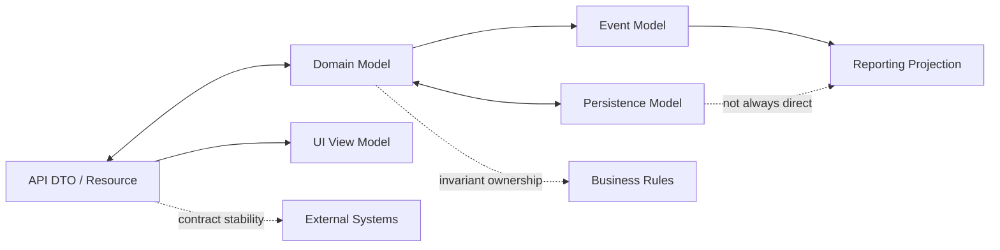
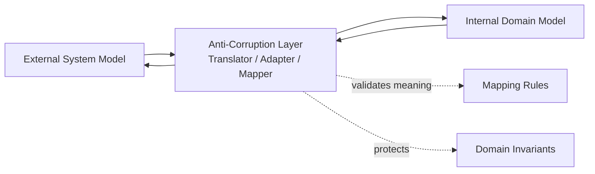

# Part 013 — Domain Modelling and Bounded Context

> Goal: learn how to reason about CPQ and order management models as business structures with ownership, invariants, and lifecycle boundaries, not as arbitrary database tables or API DTOs.

A senior engineer in Quote & Order needs more than vocabulary. You need to know where a concept belongs, who owns its truth, which rules must be protected, which models can drift, and which mappings are intentionally lossy.

This part is about that skill.

We are not claiming CSG internal architecture. Treat every concrete internal detail as something to verify in codebase, product documentation, API contracts, design docs, and conversations with product/architecture leads.

---

## 1. Why domain modelling matters in CPQ and order management

CPQ/order management systems are full of objects that look similar but mean different things:

- A product offering in a catalog.
- A product configured in a quote.
- A product ordered by a customer.
- A product instance installed for a customer.
- A service order item derived from a product order item.
- A billing charge activated from a fulfilled product.

If you flatten these concepts into one generic `Product` model, the system may look simpler at first, but correctness collapses later.

The real problem is not naming. The real problem is ownership of truth.

| Concept | Wrong mental model | Better mental model |
|---|---|---|
| Product offering | Product being bought | Commercial sellable definition in catalog |
| Quote item | Product row | Commercial proposal line under negotiation |
| Order item | Quote item copy | Customer commitment to perform an action |
| Product inventory item | Order output | Installed/subscribed product instance |
| Service order item | Product order line | Fulfillment work request in OSS/service layer |
| Agreement | Static attachment | Commercial constraints and entitlements |
| Price | Number | Calculated/auditable commercial decision |
| Status | UI label | Lifecycle state with legal transitions |

Domain modelling helps you avoid hidden coupling between these concepts.

---

## 2. The modelling trap: API shape is not domain shape

In enterprise products, it is common to see the same business concept represented in multiple shapes:

- API resource shape.
- UI view model.
- Domain object.
- Persistence table/document.
- Event payload.
- Reporting projection.
- Integration canonical object.

These shapes are not equivalent.

The API may expose a stable contract for integration. The domain object may enforce behavior and invariants. The database may optimize persistence and query. The event may preserve a business fact. The reporting projection may denormalize for analytics.

A frequent design failure is assuming that one model should serve all needs.



The senior-engineer question is not, "Can we reuse the same object?" The better question is:

> Which model owns the invariant, and which models are only representations?

---

## 3. Core domain modelling terms

### Entity

An entity has identity that matters over time.

Examples in CPQ/order management:

- Quote.
- Quote item.
- Product order.
- Product order item.
- Customer account.
- Agreement.
- Product offering.
- Product inventory item.

The key is not whether it has an ID column. The key is whether continuity over time matters.

A quote can change from draft to submitted to approved. It remains the same quote identity across lifecycle transitions.

### Value object

A value object is defined by its values, not identity.

Examples:

- Money amount.
- Currency.
- Address snapshot.
- Date range.
- Price component.
- Product characteristic value.
- Discount percentage.
- Eligibility result.
- Validation message.

A value object should usually be immutable. Changing it means replacing it with another value.

### Aggregate

An aggregate is a consistency boundary. It groups objects that must be modified together to preserve invariants.

Potential aggregates:

- Quote with quote items, quote price summary, approval state.
- Product order with order items, dependencies, milestones, lifecycle state.
- Product offering with offering terms, relationships, characteristics, and lifecycle validity.

The aggregate boundary is not necessarily the same as the database transaction boundary, but it strongly influences it.

### Domain service

A domain service represents domain logic that does not naturally belong to one entity or value object.

Examples:

- Price calculation.
- Eligibility evaluation.
- Quote validation.
- Order decomposition.
- Approval policy evaluation.
- Agreement applicability calculation.

### Application service

An application service coordinates use cases. It should orchestrate domain operations, persistence, external calls, and events, but should not become the place where core business rules hide.

Example: `SubmitQuoteApplicationService` may load a quote, request validation, evaluate approval requirement, persist state change, and emit an event. But the rule "quote cannot be submitted if it has unpriced mandatory items" should be explicit in domain logic/policy, not buried in orchestration glue.

### Policy or rule

A policy is a named business decision rule.

Examples:

- Discount approval policy.
- Product eligibility policy.
- Catalog compatibility policy.
- Quote expiry policy.
- Cancellation allowed policy.
- Amendment conflict policy.

Policies should be visible and testable because they are often the real product behavior.

---

## 4. Conceptual map of CPQ/order bounded contexts

A bounded context is a boundary where a model has a specific meaning.

The same word may mean different things in different contexts. `Product` in catalog is not the same as `Product` in product inventory. `Order` in product ordering is not the same as `ServiceOrder` in fulfillment.

```mermaid
flowchart TB
  subgraph Commercial[Commercial / BSS-Oriented Contexts]
    Customer[Customer / Account]
    Agreement[Agreement]
    Catalog[Product Catalog]
    Pricing[Pricing]
    Quote[Quote Management]
    ProductOrder[Product Order Management]
  end

  subgraph Operational[Operational / OSS-Oriented Contexts]
    ServiceCatalog[Service Catalog]
    ServiceOrder[Service Ordering]
    ServiceInventory[Service Inventory]
    ResourceInventory[Resource Inventory]
    Provisioning[Provisioning]
  end

  subgraph Revenue[Revenue Contexts]
    Billing[Billing]
    Charging[Charging]
    Revenue[Revenue Recognition / Reporting]
  end

  Customer --> Quote
  Agreement --> Quote
  Catalog --> Quote
  Pricing --> Quote
  Quote --> ProductOrder
  ProductOrder --> ServiceOrder
  Catalog --> ServiceCatalog
  ServiceOrder --> ServiceInventory
  ServiceOrder --> Provisioning
  ProductOrder --> Billing
  ProductOrder --> Charging
  Billing --> Revenue
```

This map is conceptual. In a real product, boundaries may be implemented as services, modules, schemas, packages, teams, or merely conceptual ownership boundaries.

The important point: do not assume a single model owns everything.

---

## 5. Bounded context responsibilities

### Product Catalog context

Owns what can be sold.

Typical concepts:

- Product offering.
- Product specification.
- Product offering price.
- Product relationship.
- Product bundle.
- Product characteristic definition.
- Lifecycle validity.
- Market/channel/customer segment applicability.

Core invariants:

- Inactive offerings should not be newly sold unless explicitly allowed by migration/back-office policy.
- Mandatory characteristics must be defined and validated.
- Bundle relationships must be internally consistent.
- Effective dates must not create ambiguous active definitions.

### Customer/Account context

Owns who the commercial relationship is with.

Typical concepts:

- Customer.
- Party.
- Account.
- Billing account.
- Service account.
- Organization hierarchy.
- Contact.
- Channel/partner relationship.

Core invariants:

- A quote/order must reference a valid buying context.
- Billing responsibility must be clear before billing activation.
- Service location or account context must be sufficient for fulfillment.
- Customer hierarchy must not be ignored when agreement or eligibility depends on it.

### Agreement context

Owns commercial commitments and contractual terms.

Typical concepts:

- Contract.
- Enterprise agreement.
- Term.
- Entitlement.
- Committed spend.
- Customer-specific pricing.
- Renewal/cotermination condition.

Core invariants:

- A quote claiming agreement benefits must be traceable to applicable agreement terms.
- Contractual eligibility must be evaluated in the correct customer/account hierarchy.
- Quote/order should preserve agreement reference used during decision making.

### Pricing context

Owns commercial calculation.

Typical concepts:

- Price list.
- Charge.
- Discount.
- Promotion.
- Override.
- Margin.
- Approval threshold.
- Price explanation.

Core invariants:

- Quoted price must be explainable and auditable.
- Manual override must have authority and audit trail.
- Recalculation must not silently change accepted commercial commitments.
- Currency, tax, effective dates, and charge frequency must be consistent.

### Quote Management context

Owns commercial proposal lifecycle.

Typical concepts:

- Quote.
- Quote item.
- Quote version/revision.
- Quote validation.
- Quote status.
- Quote approval.
- Quote acceptance.
- Expiry.

Core invariants:

- Submitted/approved/accepted quote states must not be casually mutable.
- Quote-to-order conversion must use an eligible quote state.
- Quote version history must explain what the customer approved or accepted.
- Quote line prices must remain traceable to catalog/pricing/agreement context.

### Product Order Management context

Owns customer order intent and orchestration at product level.

Typical concepts:

- Product order.
- Order item.
- Order action.
- Order dependency.
- Milestone.
- Fallout.
- Cancel/amend request.
- Completion/reconciliation.

Core invariants:

- Order items must represent explicit customer/product actions.
- Dependency order must be respected.
- Completed/cancelled/failed states must have clear business meaning.
- Retried work must not create duplicate fulfillment or duplicate billing activation.

### Fulfillment/Service Ordering context

Owns service-level work required to satisfy product order intent.

Typical concepts:

- Service order.
- Service order item.
- Service specification.
- Technical feasibility.
- Service inventory.
- Provisioning task.
- Resource allocation.

Core invariants:

- Service work must be traceable back to product order intent.
- Downstream rejection must be surfaced as meaningful fallout.
- Technical completion must reconcile with product order completion.

### Billing/Charging context

Owns monetization activation and recurring/usage charging behavior.

Typical concepts:

- Billing account.
- Charge activation.
- Recurring charge.
- One-time charge.
- Usage rating/charging.
- Billing start date.
- Suspension/disconnection impact.

Core invariants:

- Billing activation should not happen before required fulfillment/commercial conditions are satisfied.
- Billing and product inventory must not diverge silently.
- Amend/cancel/disconnect must produce correct billing impact.

---

## 6. Entity vs value object examples

### Money

Money should usually be a value object:

```text
amount + currency + precision/rounding context
```

A naked decimal is dangerous. It hides currency and rounding rules.

Common failure mode:

- Quote total is calculated in one currency.
- Discount is applied in another implicit currency.
- Rounding differs between quote UI, order payload, and billing system.

Senior-engineer invariant:

> Any commercial amount must carry enough context to be interpreted, recalculated, audited, and compared safely.

### Product characteristic value

A configured characteristic value is usually a value object, but it is tied to catalog definition identity.

Example:

```text
characteristicDefinitionId + name + value + valueType + source + validation result
```

Failure mode:

- Quote stores only characteristic name.
- Catalog later renames it.
- Order validation cannot prove whether the value is still valid.

Better model:

- Preserve catalog characteristic identity/version if the characteristic participates in validation, pricing, decomposition, or fulfillment.

### Address snapshot

A service address may come from customer/account data, but an order may need a snapshot.

Failure mode:

- Customer address changes after quote acceptance.
- Order fulfillment uses the new address unintentionally.
- The order no longer matches what was sold.

Better model:

- Distinguish reference to customer location from snapshot used for a specific quote/order.

---

## 7. Aggregate design in quote management

A quote aggregate usually protects the commercial proposal.

Potential contents:

- Quote header.
- Customer/account reference.
- Agreement reference.
- Quote items.
- Price summary.
- Approval state.
- Version/revision metadata.
- Expiry.
- Validation status.

Important design question:

> Should quote item changes and quote total updates be committed atomically?

Often yes, because a quote item mutation can invalidate price totals, approval status, and acceptance eligibility.

Possible aggregate invariants:

- A quote cannot be submitted with invalid required fields.
- A quote cannot be accepted unless it is approved or does not require approval.
- An expired quote cannot be converted into an order unless there is an explicit revalidation/reapproval path.
- A submitted quote cannot have line items modified without creating a revision or returning to draft.
- A price override must produce audit metadata.

Possible modelling smell:

- `Quote.status = APPROVED` is updated in one transaction.
- Approval record is written separately.
- Event is emitted before approval audit exists.
- Downstream consumers treat the quote as approved but audit cannot explain who approved it.

The model needs a coherent approval transition, not scattered field updates.

---

## 8. Aggregate design in order management

A product order aggregate protects customer order intent and orchestration state.

Potential contents:

- Order header.
- Customer/account reference.
- Source quote reference.
- Order items.
- Order item actions.
- Dependencies.
- Milestones.
- Fallout records or references.
- Lifecycle status.
- Cancellation/amendment metadata.

Important design question:

> Is order completion derived from item states, or can it be independently set?

If both are allowed without a clear rule, the system will drift.

Possible aggregate invariants:

- Order cannot complete while mandatory order items are still in progress.
- Parent bundle item cannot complete if required child item failed.
- Cancellation cannot be accepted after irreversible downstream activation unless a compensating order is created.
- Retrying a failed item must preserve idempotency against downstream systems.
- Amendment must be evaluated against current order state, not only original quote state.

Common modelling smell:

- Order header status says `completed`.
- One child order item says `failed`.
- Billing activation event has already been emitted.
- Product inventory does not show installed product.

This is not a technical inconsistency only. It is a business contradiction.

---

## 9. Domain service vs application service

### Example: quote submission

Application service responsibilities:

- Receive submit command.
- Authenticate/authorize actor.
- Load quote.
- Call quote validation/domain policy.
- Persist transition.
- Emit event.
- Return result.

Domain responsibilities:

- Determine whether quote can be submitted.
- Validate required quote fields.
- Ensure quote items are configured and priced.
- Determine whether approval is required.
- Protect illegal transition from accepted/expired/cancelled states.

Poor design:

```text
SubmitQuoteController
  if status != DRAFT then error
  if priceTotal == null then error
  if discount > 20 then status = PENDING_APPROVAL
  else status = SUBMITTED
```

Better design:

```text
SubmitQuoteApplicationService
  quote = repository.load(quoteId)
  decision = quoteSubmissionPolicy.evaluate(quote, actor, context)
  quote.submit(decision)
  repository.save(quote)
  eventPublisher.publish(QuoteSubmitted(...))
```

The point is not object-oriented purity. The point is making business rule ownership visible, testable, and reviewable.

---

## 10. Rules and policies as first-class domain concepts

In CPQ/order management, the actual value of the system often lives in rules:

- Which products can be sold to which customer?
- Which discount requires approval?
- Which catalog version is valid for quote conversion?
- Which order item action is allowed against an existing product inventory item?
- Which cancellation request is still reversible?
- Which downstream rejection is recoverable?

Rules become dangerous when they are:

- Hidden in UI forms only.
- Duplicated between frontend and backend.
- Embedded in SQL filters without names.
- Implemented as magic constants.
- Split across API, workflow, and event consumers.
- Changed without regression scenarios.

A domain-aware engineer asks:

1. What is the business rule called?
2. Who owns it?
3. What input facts does it require?
4. What output decision does it produce?
5. Is the decision explainable?
6. Is the rule versioned or effective-dated?
7. What happens if rule inputs change after quote/order creation?
8. Which tests prove the rule?

---

## 11. Anti-corruption layer

An anti-corruption layer protects one bounded context from another context's model.

In Quote & Order, this matters because external systems may have different concepts:

- CRM customer model differs from internal account model.
- Catalog management system exposes product offering differently from quote engine needs.
- Billing system charge model differs from quoted price components.
- OSS service order model differs from product order model.
- TM Forum API resource differs from internal domain object.

Without translation, foreign assumptions leak into your core model.



### Example: billing charge translation

Quote price component:

- Commercial line item price.
- Discounted recurring monthly charge.
- Promotional period.
- Effective date.
- Tax treatment maybe excluded.

Billing charge:

- Billing account.
- Charge code.
- Billing frequency.
- Start date.
- End date.
- Rating/charging behavior.

These are related, but not the same. A mapper that blindly copies fields is not enough. The translation must preserve commercial meaning and downstream activation requirements.

### Anti-corruption layer questions

- What external concept is being translated?
- What internal concept does it map to?
- Is the mapping one-to-one, one-to-many, many-to-one, or lossy?
- Which fields are authoritative externally?
- Which fields are authoritative internally?
- What happens to unmapped values?
- How are extensions handled?
- How is mapping compatibility tested?

---

## 12. Shared kernel and canonical model risk

A shared kernel is a small shared model used by multiple bounded contexts. It can be useful, but dangerous.

Good candidates:

- Money.
- Currency.
- Date range.
- Identifier value objects.
- Audit metadata.
- Common lifecycle event envelope.

Bad candidates:

- Generic `Product` used by catalog, quote, order, inventory, service ordering, billing.
- Generic `Status` used for unrelated lifecycles.
- Generic `Price` used by quote calculation and billing activation without preserving meaning.
- Generic `Customer` used across CRM, billing, service account, and agreement contexts without context boundaries.

The phrase "canonical model" sounds safe but often becomes a hidden coupling mechanism.

Canonical model risk:

| Risk | What happens |
|---|---|
| Semantic overload | One field means different things to different systems |
| Slow evolution | Every change requires coordination across many teams |
| Weak invariants | The common model cannot enforce context-specific rules |
| Extension sprawl | Custom fields become dumping ground |
| Backward compatibility pain | Old consumers depend on accidental semantics |

A senior engineer does not reject canonical models automatically. But you should ask where canonical helps integration and where it damages domain clarity.

---

## 13. Mapping matrix: API, domain, persistence, event

For any important concept, create a mapping matrix.

Example: Quote

| Model type | Purpose | Should optimize for | Common mistake |
|---|---|---|---|
| API resource | External contract | Stability, compatibility, integration clarity | Treating it as internal aggregate |
| Domain model | Business behavior | Invariants, lifecycle, rule enforcement | Making it an anemic data bag |
| Persistence model | Storage | Query, transaction, history, performance | Letting schema shape business language |
| Event model | Business fact | Meaning, replay, consumer compatibility | Emitting internal implementation details |
| UI model | User task | Usability, workflow, task context | Letting UI status become source of truth |
| Reporting model | Analysis | Denormalized read, trend, audit | Using reporting projection as command input |

Example mapping questions:

- Is API `status` the same as internal lifecycle state?
- Does the database store derived totals or recalculate them?
- Does the event contain snapshot, delta, or reference?
- Does the UI show simplified status that hides item-level details?
- Does reporting rely on eventual consistency?

---

## 14. Context mapping examples

### Catalog to Quote

Catalog owns the sellable definition. Quote captures a commercial proposal based on catalog information.

Key mapping issue:

- Catalog can evolve after quote creation.
- Quote must remain explainable.

Possible strategies:

| Strategy | Description | Trade-off |
|---|---|---|
| Reference only | Quote stores catalog IDs | Lightweight but fragile if catalog changes |
| Reference plus version | Quote stores catalog ID and version/effective date | Better traceability, requires version discipline |
| Snapshot | Quote stores selected catalog data | Strong audit, larger payload and migration questions |
| Hybrid | Quote stores IDs/version plus commercial snapshot | Often practical for enterprise CPQ |

Senior-engineer question:

> If a customer disputes a quote three months later, can we explain what catalog definition was used?

### Quote to Order

Quote owns the commercial proposal. Order owns the customer commitment and execution request.

Key mapping issue:

- Accepted quote is not merely copied into order.
- Order must express actions, dependencies, fulfillment intent, and downstream handoff.

Mapping should preserve:

- Source quote ID and version.
- Quote item to order item relationship.
- Accepted price context.
- Customer/account/agreement context.
- Product offering references.
- Configured characteristic values.
- Order actions.
- Eligibility/validation results relevant to conversion.

Failure mode:

- Order loses quote version.
- Later audit cannot prove which quote was accepted.
- Customer-specific discount appears unauthorized.

### Product Order to Service Order

Product order owns commercial product intent. Service order owns technical service work.

Key mapping issue:

- One product order item may decompose into multiple service order items.
- Some product actions require existing inventory state.
- Failure at service level must be translated back into product-order fallout.

Mapping should preserve:

- Correlation ID.
- Product order item reference.
- Service specification reference.
- Action semantics.
- Dependency graph.
- Rejection/error reason.
- Recovery path.

Failure mode:

- Service order fails but product order remains `inProgress` forever.
- No domain-level fallout reason is visible to support teams.

---

## 15. Invariant placement

An invariant is a rule that must always hold true within a defined boundary.

Not every rule belongs in the same place.

| Invariant | Likely owner | Why |
|---|---|---|
| Quote cannot be accepted after expiry | Quote Management | Quote lifecycle rule |
| Product offering must be active for new quote | Catalog/Quote validation | Catalog validity affects quote creation |
| Discount above threshold requires approval | Pricing/Approval policy | Commercial governance rule |
| Order cannot complete while mandatory item failed | Order Management | Order lifecycle consistency |
| Billing activation requires fulfilled commercial order | Order/Billing integration | Cross-context coordination |
| Service order must correlate to product order item | Fulfillment integration | Reconciliation and traceability |

Wrong placement examples:

- UI prevents expired quote acceptance, but API still allows it.
- Database constraint prevents null price, but cannot explain pricing validity.
- Event consumer rejects invalid order state after the source system already committed it.
- Reporting job detects contradiction weeks later.

Good systems use multiple layers, but source-of-truth invariant ownership must be clear.

---

## 16. Domain model smells

### Smell 1: One giant transaction object

Everything is stored under `Transaction` with type fields:

- Quote.
- Order.
- Cancellation.
- Amendment.
- Renewal.
- Fallout.

Problem:

- Lifecycle rules become conditional spaghetti.
- State transitions become ambiguous.
- Reporting and audit become hard.

Better:

- Model distinct lifecycle concepts explicitly, even if they share infrastructure.

### Smell 2: Status-driven design without transition model

The system has status values but no explicit transition rules.

Problem:

- Any code can set status.
- Illegal transitions appear under race or retry.
- Support cannot explain how state was reached.

Better:

- Model transition commands, guard conditions, side effects, and audit.

### Smell 3: Foreign API resource as internal domain object

Internal logic directly mutates a TMF-like API resource or external DTO.

Problem:

- API compatibility concerns leak into domain logic.
- Internal invariants are constrained by integration shape.
- Extensions become difficult to reason about.

Better:

- Translate at boundary, then operate on internal domain concepts.

### Smell 4: Rule hidden in mapper

Mapper decides important business behavior while "just mapping".

Problem:

- Tests miss business rule.
- Reviewers overlook change.
- Different mappers implement different semantics.

Better:

- Move business decision into named policy/rule; mapper only translates decided facts.

### Smell 5: Event as database row dump

Event emits entire persistence object.

Problem:

- Consumers depend on internal fields.
- Schema changes break integration.
- Business meaning is unclear.

Better:

- Emit named business facts with stable semantics.

---

## 17. Failure modes caused by poor boundaries

| Failure mode | Boundary issue | Symptom |
|---|---|---|
| Price mismatch | Pricing and quote models disagree | Accepted quote total differs from order/billing total |
| Catalog mismatch | Quote references mutable catalog without version | Order validation fails after catalog update |
| Duplicate fulfillment | Order retry lacks idempotent domain identity | Downstream provisions twice |
| Audit gap | Approval state split from approval evidence | Cannot prove who approved discount |
| Stuck order | Service failure not mapped to product-order fallout | Order remains in progress indefinitely |
| Wrong customer terms | Agreement context not preserved | Discount applied outside eligible account hierarchy |
| Unsafe cancellation | Product order does not know irreversible downstream milestone | Cancel succeeds after activation |
| Contract drift | API model evolves separately from domain behavior | Integrations pass contract tests but business semantics break |

---

## 18. Domain modelling review checklist

Use this when reviewing design, PR, API change, event change, or database migration.

### Context boundary

- Which bounded context owns this concept?
- Is this concept being reused across contexts with different meanings?
- Are we leaking external system semantics into internal domain logic?
- Is there an anti-corruption layer where meaning changes?

### Model shape

- Is this an entity or value object?
- Does identity matter over time?
- Should this value be immutable?
- Is this a snapshot, reference, or derived value?
- Does the model preserve enough context for audit and dispute resolution?

### Aggregate and invariant

- What aggregate owns this change?
- Which invariants must hold before and after mutation?
- Can two concurrent commands violate the invariant?
- Does persistence enforce only structure, or also business truth?
- Does the code make illegal states unrepresentable or merely hope they do not occur?

### Lifecycle

- Which lifecycle state is affected?
- Is the state transition explicit?
- Are guard conditions named and testable?
- Are side effects tied to a successful transition?
- Are terminal states protected?

### Integration

- Is the API model different from the domain model?
- Is the event a business fact or an implementation dump?
- Is mapping lossy?
- Are downstream consumers relying on internal semantics?
- Is compatibility tested at the right boundary?

### Operational and audit

- Can support explain the resulting state?
- Can we reconstruct why a quote/order was valid?
- Can we reconcile with downstream systems?
- Can we detect and repair drift?
- Is the failure mode visible through observability?

---

## 19. Internal verification checklist

Use this part as a structured onboarding task.

### Codebase

- Find quote, order, catalog, pricing, agreement, and customer packages/modules.
- Identify whether API DTOs, domain models, persistence models, and event models are separated.
- Find mapper/translator classes and inspect whether they hide business decisions.
- Find state transition logic and identify whether status can be updated freely.
- Find validation policies and approval policies.

### Documentation

- Look for domain model diagrams.
- Look for bounded context diagrams.
- Look for API resource documentation.
- Look for event catalog and schema registry documentation.
- Look for data model/entity relationship diagrams.
- Look for integration mapping documents.

### Product/process

- Ask PO/BA which concepts are product terms vs customer-specific terms.
- Ask solution architect where TM Forum APIs are used as standard contract vs inspiration.
- Ask senior engineer which models are legacy and which are strategic.
- Ask support/operations which boundary mistakes produce incidents.
- Ask implementation/customer teams where customization usually changes model assumptions.

### Concrete artifacts to collect

- Quote lifecycle/state diagram.
- Product order lifecycle/state diagram.
- Quote-to-order mapping doc.
- Catalog-to-quote mapping doc.
- Product-order-to-service-order mapping doc.
- Pricing explanation/audit document.
- Event schema for quote/order transitions.
- Common fallout/reconciliation playbook.

---

## 20. Mini exercises

### Exercise 1: classify model types

Pick five objects from the codebase:

- Quote.
- QuoteItem.
- ProductOffering.
- ProductOrderItem.
- PriceComponent.

For each, write:

- Entity or value object?
- Aggregate root or child?
- Which bounded context owns it?
- Which invariants does it protect?
- Which models represent it: API, domain, DB, event, UI?

### Exercise 2: trace one business fact

Choose one fact:

> Customer accepted quote version X with price Y for product offering Z.

Trace where that fact appears:

- API payload.
- Domain model.
- Database.
- Event.
- Order conversion.
- Audit log.
- Reporting.

Ask whether the fact remains explainable after catalog/pricing changes.

### Exercise 3: find one hidden rule

Search for one rule implemented as conditional logic:

- Discount threshold.
- Quote expiry.
- Product eligibility.
- Cancel allowed.
- Order completion.

Rewrite it as a named policy with inputs, decision, explanation, and tests.

---

## 21. Senior engineer mental model

Domain modelling is not about creating beautiful class diagrams.

It is about protecting business meaning across time, state transitions, integrations, persistence, events, and people.

For Quote & Order, the most important modelling discipline is separation of meaning:

- Catalog definition is not quoted product.
- Quoted product is not ordered product.
- Ordered product is not installed product.
- Product order is not service order.
- Quoted price is not billing charge.
- Customer is not always billing account.
- API resource is not always domain model.
- Status field is not state machine.

When those distinctions are clear, the system becomes reviewable.
When they are blurred, every feature becomes risky.

A domain-aware senior engineer should constantly ask:

> What business meaning are we preserving, and where can it be corrupted?
