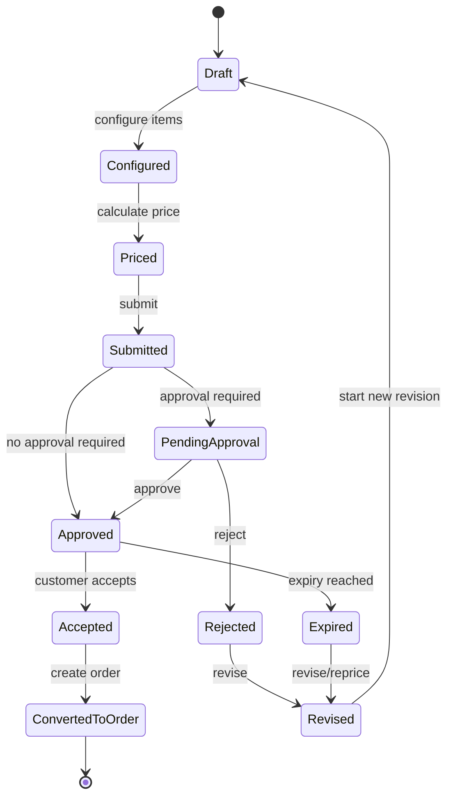
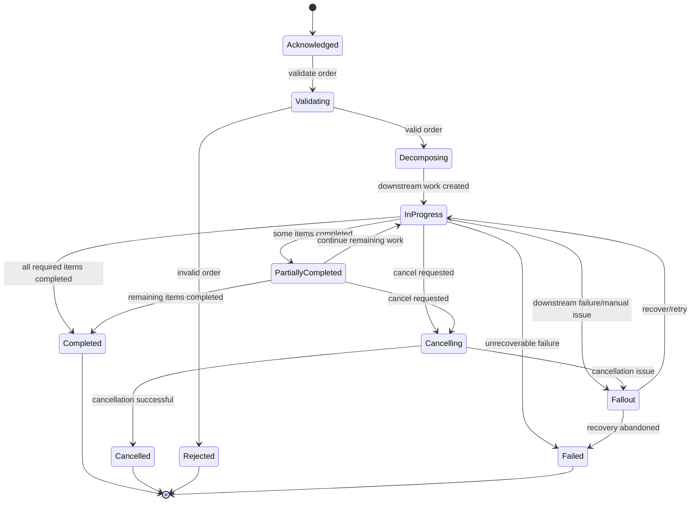

# Part 014 — State Machines and Lifecycle Invariants

> Goal: learn to reason about quote and order lifecycles as state machines with guarded transitions, side effects, auditability, concurrency risk, and failure recovery.

In CPQ/order management, state is not decoration. State is business truth.

A quote can be draft, submitted, approved, accepted, expired, rejected, or revised. A product order can be acknowledged, validated, in progress, partially completed, completed, cancelled, failed, or stuck in fallout.

These states are not merely labels for UI. They determine what actions are legal, what side effects can happen, which downstream systems are called, whether billing can start, whether the customer has committed, and whether support teams can intervene.

This part builds the lifecycle reasoning skill expected from a senior engineer.

---

## 1. State is a contract

A lifecycle state answers three questions:

1. What is true about the business object now?
2. What actions are legal from here?
3. What obligations or side effects have already happened?

If a state cannot answer those questions, it is probably not a real domain state. It may be a UI label, progress marker, or reporting category.

Example:

| State | Weak meaning | Strong meaning |
|---|---|---|
| `Submitted` | User clicked submit | Quote is locked for editing and is waiting for approval or acceptance path |
| `Approved` | Someone approved | Required approval decisions are complete and recorded with authority/audit |
| `Accepted` | Customer said yes | Customer accepted a specific quote version, making it eligible for order conversion |
| `InProgress` | Order is running | At least one required fulfillment activity is active or pending |
| `Completed` | Workflow ended | Required order items have reached successful terminal state and required handoffs are complete |
| `Failed` | Something went wrong | Order cannot progress without explicit recovery, compensation, or manual decision |

A senior engineer should treat state names as business contracts.

---

## 2. Status field is not a state machine

A status field is just data. A state machine is a controlled model of legal transitions.

Poor model:

```text
quote.status = request.status
save(quote)
```

Better model:

```text
quote.submit(actor, validationResult, approvalDecision)
quote.approve(actor, approvalRecord)
quote.accept(actor, acceptanceContext)
quote.expire(clock.now())
quote.revise(actor, revisionReason)
```

The difference is not syntax. The difference is where business correctness lives.

A real state machine defines:

- States.
- Commands/actions.
- Legal transitions.
- Guard conditions.
- Side effects.
- Terminal states.
- Retryable states.
- Manual intervention states.
- Audit facts.
- Compensation behavior.
- Concurrency protection.

---

## 3. Quote lifecycle as state machine

A simplified quote lifecycle may look like this:



This diagram is intentionally generic. Your internal lifecycle may have different states, merged states, additional states, or customer-specific variants.

The important reasoning pattern:

- A quote begins editable.
- It becomes increasingly constrained as it is priced, submitted, approved, and accepted.
- Acceptance should bind to a specific quote version.
- Conversion to order should be allowed only from a valid accepted state.
- Expiry/revision must not erase history.

---

## 4. Product order lifecycle as state machine

A simplified product order lifecycle may look like this:



Product order lifecycle is more operational than quote lifecycle. It often needs to model partial progress, downstream dependency, fallout, retry, manual intervention, and reconciliation.

Quote lifecycle is mainly commercial commitment. Order lifecycle is execution commitment.

---

## 5. Transition anatomy

Every important transition should be understood as a unit.

A transition has:

| Element | Question |
|---|---|
| Source state | Where can this transition start? |
| Command/action | What business action is requested? |
| Actor/system | Who or what initiated it? |
| Guard condition | What must be true before it is allowed? |
| Mutation | What state/data changes? |
| Side effect | What events/calls/tasks are triggered? |
| Audit fact | What must be recorded? |
| Failure behavior | What happens if side effect fails? |
| Idempotency rule | What happens if command is repeated? |
| Concurrency rule | What happens if another transition happens at the same time? |

Example: quote acceptance

| Element | Example reasoning |
|---|---|
| Source state | Approved |
| Command | Accept quote |
| Actor/system | Customer, sales user, channel system, or integration |
| Guard condition | Quote not expired, approval still valid, version unchanged, customer/account valid |
| Mutation | Status becomes Accepted; acceptance timestamp and actor recorded |
| Side effect | QuoteAccepted event; order eligibility becomes true |
| Audit fact | Accepted quote version and commercial terms |
| Failure behavior | If event fails, transition must not be lost or must be recoverable |
| Idempotency | Repeated acceptance should not create multiple accepted versions/orders |
| Concurrency | Acceptance racing with expiry/revision must be resolved deterministically |

---

## 6. Guard conditions

A guard condition decides whether a transition is legal.

Guard conditions are where many business rules live.

Examples:

### Submit quote guards

- Quote is in editable/submittable state.
- Required customer/account context exists.
- Required product configuration is complete.
- Required prices are calculated.
- Required eligibility checks pass.
- Quote has not expired.
- No unresolved validation errors remain.

### Approve quote guards

- Quote is pending approval.
- Actor has approval authority.
- Approval threshold and delegation-of-authority rules are satisfied.
- Quote version has not changed since approval request.
- Approval decision is recorded with reason/comment where required.

### Convert quote to order guards

- Quote is accepted.
- Accepted quote version is the current conversion target.
- Quote has not expired or has valid acceptance exception.
- Customer/account/agreement context is still valid or has explicit snapshot semantics.
- Required order mapping rules exist.
- No duplicate order has already been created for the same acceptance event.

### Complete order guards

- Mandatory order items are completed.
- Required downstream confirmations are received.
- No unresolved fallout exists.
- Billing/activation handoff requirement is satisfied where applicable.
- Product inventory reconciliation has passed where required.

Guards should be named, tested, and observable. They should not be invisible conditional fragments scattered across UI, controller, mapper, workflow engine, database trigger, and event consumer.

---

## 7. Side effects

State transitions often trigger side effects:

- Emit event.
- Create approval task.
- Call pricing engine.
- Generate quote document.
- Create product order.
- Decompose order.
- Create service order.
- Notify downstream system.
- Activate billing.
- Update product inventory.
- Create fallout task.

The dangerous design question:

> Is the state transition committed before, after, or together with the side effect?

This matters because distributed systems fail between steps.

Example problem:

1. Quote status becomes `Accepted`.
2. System tries to emit `QuoteAccepted` event.
3. Event publishing fails.
4. No order is created.
5. UI shows quote accepted, but downstream flow never starts.

This is not merely a Kafka problem. It is a domain consistency problem.

Better reasoning:

- The accepted state must be durable.
- The required side effect must be durable or recoverable.
- There must be a way to detect and replay missing side effect.
- Audit must show what happened.

Common patterns include transactional outbox, workflow engines, durable task queues, reconciliation jobs, and idempotent consumers. The specific mechanism is technical; the requirement is domain-level: do not lose business obligations.

---

## 8. Terminal states

Terminal states are states from which normal lifecycle progression ends.

Quote terminal states may include:

- Accepted and converted.
- Rejected.
- Expired.
- Cancelled/withdrawn.

Order terminal states may include:

- Completed.
- Cancelled.
- Rejected.
- Failed.

But terminal does not always mean immutable in every dimension.

Example:

- A completed order should not return to in progress casually.
- But a completed order may receive reconciliation metadata.
- A rejected quote should not become approved directly.
- But it may be revised into a new quote version.

Design question:

> Which fields are immutable in terminal state, and which operational metadata can still be appended?

Terminal state invariants:

- No business action should resurrect a terminal object without explicit new lifecycle object or revision.
- Terminal state should have a reason or completion evidence.
- Terminal state should be auditable.
- Terminal state should not conflict with child item states.

---

## 9. Retryable and manual intervention states

Order management often needs states that are neither success nor final failure.

### Retryable state

A retryable state means the system can attempt the transition or side effect again safely.

Examples:

- Downstream timeout.
- Temporary service ordering failure.
- Billing activation retry pending.
- Event publication pending.

Retry requires idempotency. Retrying without idempotency can create duplicate orders, duplicate provisioning, duplicate charges, or duplicate notifications.

### Manual intervention state

A manual intervention state means human decision or correction is required.

Examples:

- Technical feasibility conflict.
- Missing service address.
- Downstream rejection requiring classification.
- Product inventory mismatch.
- Billing account conflict.

Manual intervention should not be a black hole.

It needs:

- Reason code.
- Owner/queue.
- SLA/age.
- Allowed actions.
- Audit trail.
- Re-entry transition.
- Escalation path.

Weak model:

```text
status = ERROR
```

Stronger model:

```text
status = FALLOUT
falloutReason = SERVICEABILITY_REJECTED
ownerQueue = FULFILLMENT_SUPPORT
allowedActions = [CORRECT_ADDRESS, RETRY_FEASIBILITY, CANCEL_ITEM]
```

---

## 10. Compensation

Compensation is a business action that offsets or reverses a previous action when direct rollback is impossible.

In distributed enterprise systems, many actions cannot be rolled back technically:

- Service already provisioned.
- Billing charge already activated.
- Customer notification already sent.
- Contract document already issued.
- Inventory already allocated.

So the system needs compensating actions:

- Disconnect service.
- Reverse charge.
- Issue credit.
- Cancel pending downstream order.
- Create amendment order.
- Create correction order.

Compensation must be modelled explicitly. Do not pretend distributed business processes have database-style rollback.

Compensation questions:

- What irreversible side effects can occur from this transition?
- What compensating action exists?
- Is compensation automatic or manual?
- Does compensation create a new order/request?
- How is customer/account/billing impact handled?
- How is audit preserved?

---

## 11. Idempotent transitions

Idempotency means repeating the same command or event does not create duplicate business effects.

In Quote & Order, idempotency is domain-critical.

Examples:

### Quote acceptance

Repeated accept request should not:

- Accept multiple quote versions.
- Create multiple orders.
- Emit conflicting acceptance facts.

### Order creation from quote

Repeated quote-to-order conversion should not:

- Create duplicate product orders.
- Reserve inventory twice.
- Create duplicate service orders.

### Fulfillment retry

Repeated downstream request should not:

- Provision the same service twice.
- Activate billing twice.
- Create inconsistent product inventory.

Idempotency keys should usually be tied to business identity, not random technical retries.

Possible keys:

- Quote acceptance ID.
- Quote ID plus quote version plus conversion attempt.
- Product order item ID plus downstream action.
- Service order item ID plus action.
- Billing activation request ID.

Senior-engineer invariant:

> Retrying a business transition must repeat intent, not duplicate outcome.

---

## 12. Illegal transitions

Illegal transitions are not edge cases. They are the main reason to have a state machine.

Examples:

| Illegal transition | Why it is dangerous |
|---|---|
| Draft quote to accepted | Skips pricing/approval/customer acceptance evidence |
| Expired quote to order | Customer may receive invalid price/terms |
| Approved quote to draft without revision | Destroys approval audit meaning |
| Completed order to in progress | Breaks fulfillment/billing/inventory truth |
| Failed order to completed without recovery evidence | Hides operational failure |
| Cancelled order to active fulfillment | Creates customer/service contradiction |
| Billing activated before order fulfillment | Customer may be charged before service delivery |

When reviewing code, search for direct status assignment. Direct assignment is often where illegal transitions enter.

Better approaches:

- Transition methods.
- State transition table.
- Workflow engine with guard policies.
- Database constraints for coarse protection.
- Domain tests for legal/illegal transitions.
- Audit log enforcement.

---

## 13. Race conditions in lifecycle systems

Race conditions are not only technical concurrency issues. They create business contradictions.

### Race: accept vs expire quote

Scenario:

1. Quote expires at 12:00.
2. Customer accepts at 12:00.
3. Expiry job also runs at 12:00.
4. One process marks quote accepted; another marks it expired.

Questions:

- Which timestamp source is authoritative?
- Is acceptance allowed at exact expiry time?
- Does expiry job use optimistic locking?
- What does customer see?
- Can order be created?

### Race: revise vs approve quote

Scenario:

1. Sales revises quote item.
2. Approver approves old version.
3. System records approval on current quote incorrectly.

Invariant:

> Approval must bind to a specific quote version and commercial content.

### Race: cancel vs complete order

Scenario:

1. Customer cancels order.
2. Downstream service completes activation.
3. Billing activation is triggered.
4. Cancellation flow also continues.

Questions:

- Which milestones make cancellation irreversible?
- Does cancellation create compensation if activation already happened?
- Are downstream completion events ignored, compensated, or reconciled?

### Race: retry vs manual fix

Scenario:

1. Order item enters fallout.
2. Support corrects address.
3. Automated retry uses old address from stale payload.

Invariant:

> Retry must use the current authoritative corrected facts, or explicitly use the original snapshot if that is the business rule.

---

## 14. Parent-child lifecycle consistency

Quote/order objects often have hierarchy:

- Quote header and quote items.
- Bundle item and child items.
- Product order and order items.
- Order item and downstream service order items.
- Service order and service order items.

Header state may be derived, independently stored, or both.

Dangerous contradiction:

| Header state | Child state | Problem |
|---|---|---|
| Quote approved | Quote item unpriced | Approval invalid |
| Quote accepted | Quote item changed after acceptance | Customer accepted different content |
| Order completed | Required item failed | Completion false |
| Order cancelled | Child service order completed | Cancellation semantics unclear |
| Order in progress | All items terminal | Header not reconciled |

Design question:

> Is parent state derived from child states, or does parent state command child behavior?

Often both exist, but the derivation rule must be explicit.

Example order completion rule:

```text
ProductOrder can become Completed only when:
- every mandatory order item is Completed or intentionally Skipped by an allowed business rule;
- no unresolved blocking fallout exists;
- required downstream completion confirmations have been received;
- required billing/inventory handoff conditions are satisfied.
```

---

## 15. Lifecycle invariants catalog

Use these as examples. Internal rules may differ.

### Quote invariants

- Quote must have valid customer/account context before submission.
- Quote must have configured mandatory product characteristics before pricing.
- Quote must have valid price before approval/acceptance.
- Accepted quote must refer to a specific quote version.
- Expired quote cannot be accepted without explicit exception/revalidation.
- Revised quote must preserve history of previous version.
- Converted quote must link to created order.

### Pricing/approval invariants

- Price override must be auditable.
- Discount above threshold must require valid approval.
- Approval must bind to quote version and price content.
- Price recalculation must not silently alter accepted quote.
- Currency and charge frequency must remain consistent across quote and order.

### Order invariants

- Product order must have valid customer/account context.
- Product order item must express a valid action.
- Product order cannot complete with blocking failed mandatory items.
- Order decomposition must be traceable to order item intent.
- Duplicate quote conversion must not create duplicate orders.
- Cancel/amend must respect current order milestone.
- Retry must be idempotent.

### Fulfillment invariants

- Service order must correlate to product order item.
- Downstream rejection must map to business fallout reason.
- Product inventory update must be consistent with completed fulfillment.
- Billing activation must align with fulfilled product/order state.
- Manual intervention must have owner, reason, and allowed next actions.

---

## 16. Audit as lifecycle evidence

Audit is not just logging.

Lifecycle audit must explain:

- Who requested the transition.
- What state changed.
- When it changed.
- Why it changed.
- Which version/content was affected.
- Which rule/approval allowed it.
- Which side effects were produced.
- Which correlation IDs connect downstream work.

Important audit examples:

### Quote approval audit

Should answer:

- Which quote version was approved?
- What were the prices/discounts/margins at approval time?
- Who approved?
- Under what authority?
- Was approval delegated?
- Did quote change after approval?

### Order cancellation audit

Should answer:

- Who requested cancellation?
- What order/item state existed at request time?
- Which downstream tasks were already active/completed?
- Was cancellation fully successful, partially successful, rejected, or compensated?
- Was billing impacted?

### Fallout audit

Should answer:

- Which downstream system rejected or failed?
- What reason code was returned?
- Who owned resolution?
- What correction was made?
- Was retry successful?
- Did any customer-impacting delay occur?

---

## 17. Observability for lifecycle correctness

Logs and metrics should help detect lifecycle contradictions.

Useful signals:

- Orders stuck in non-terminal state beyond SLA.
- Quote accepted but no order created.
- Order completed but required item failed.
- Billing activation event without fulfilled order.
- Product inventory update missing after completed service order.
- Repeated retry attempts for same order item.
- Manual fallout aging by reason/owner.
- Illegal transition attempts.
- Optimistic lock conflicts on quote/order update.
- Event replay causing duplicate side effects.

Observability should be domain-aware. A metric like `http_500_count` is useful, but it does not tell you whether customers are stuck between accepted quote and missing order.

Better metrics:

```text
quote_accepted_without_order_count
order_in_fallout_by_reason
order_item_retry_count_by_action
order_completed_with_failed_item_count
quote_approval_version_conflict_count
billing_activation_before_fulfillment_count
```

Exact metric names do not matter. Domain signal does.

---

## 18. State transition PR review checklist

Use this when reviewing any PR that touches quote/order status, workflow, approval, pricing, order decomposition, fulfillment, fallout, cancel, amend, retry, or event handling.

### State model

- Is this a real domain state or a UI/reporting status?
- Is the transition legal from the source state?
- Are illegal transitions explicitly blocked?
- Is parent-child state consistency protected?
- Are terminal states protected from accidental mutation?

### Guards

- Are guard conditions named and testable?
- Are validation, pricing, approval, expiry, catalog, and agreement rules checked at the correct time?
- Are guard failures returned as meaningful business errors?
- Are guards duplicated inconsistently across UI/backend/workflow?

### Side effects

- What side effects happen after transition?
- Are side effects durable or recoverable?
- Could event publication/callout fail after state commit?
- Is there reconciliation for missing side effects?
- Are downstream calls idempotent?

### Concurrency

- What happens if two commands hit the same quote/order concurrently?
- Is approval bound to quote version?
- Is acceptance protected from expiry/revision race?
- Is cancellation protected from completion race?
- Is retry protected from manual correction race?

### Audit

- Is transition audit recorded?
- Does audit include actor/system, reason, version, previous/new state, and correlation IDs?
- Can support explain why the object is in this state?
- Can compliance/audit reconstruct price and approval decisions?

### Testing

- Are legal transitions tested?
- Are illegal transitions tested?
- Are race-sensitive scenarios tested?
- Are idempotency scenarios tested?
- Are failure/retry/manual intervention paths tested?
- Are downstream/event side effects tested?

---

## 19. Internal verification checklist

Use this as a concrete onboarding checklist.

### Codebase

- Locate quote state enum/table/workflow definition.
- Locate order state enum/table/workflow definition.
- Search for direct status updates.
- Identify whether transitions are centralized or scattered.
- Find guard condition implementations.
- Find approval transition logic.
- Find quote-to-order conversion logic.
- Find order decomposition and completion logic.
- Find cancellation/amendment logic.
- Find retry/fallout/manual intervention logic.

### Database/schema

- Check whether state is stored on header, item, or both.
- Check audit/history tables for state transitions.
- Check optimistic locking/version columns.
- Check idempotency keys or unique constraints for quote-to-order conversion.
- Check correlation IDs linking quote, order, service order, billing, and inventory.

### Events/integration

- List events emitted during major transitions.
- Check whether events represent commands, facts, or mixed semantics.
- Check outbox/retry/replay behavior if available.
- Check downstream idempotency contract.
- Check reconciliation process for missing/failed side effects.

### Product/operations

- Ask PO/BA for official lifecycle diagrams.
- Ask solution architect for cross-system lifecycle ownership.
- Ask support which states cause most production tickets.
- Ask operations how stuck orders are detected and resolved.
- Ask team lead which lifecycle transitions are most risky to modify.

---

## 20. Scenario drills

### Drill 1: accepted quote but no order

A customer accepts a quote. UI shows accepted. No product order appears.

Analyze:

- Was `QuoteAccepted` event emitted?
- Was quote-to-order conversion synchronous or asynchronous?
- Is there an outbox/task stuck?
- Is the acceptance idempotency key present?
- Can the order be safely recreated?
- Does audit show accepted version and actor?

### Drill 2: order completed with failed item

Order header is completed, but one mandatory item is failed.

Analyze:

- Is header state derived or directly assigned?
- Is the item mandatory or optional?
- Was failure compensated or intentionally skipped?
- Did completion guard check child states?
- Did a race occur between failure and completion events?
- Did reporting projection lag behind source state?

### Drill 3: customer cancels while provisioning completes

Cancellation and downstream completion happen close together.

Analyze:

- What is the irreversible milestone?
- Which event arrived first?
- Which event should win from domain perspective?
- Is compensation required?
- Is billing activation already triggered?
- Does support have a clear next action?

### Drill 4: approval on old quote version

Approver approves while sales revises the quote.

Analyze:

- Is approval linked to quote version?
- Did revision invalidate approval task?
- Are approval decisions content-addressed or status-only?
- Can accepted quote differ from approved quote?
- Is there audit evidence for the approved price/discount?

---

## 21. Senior engineer mental model

A lifecycle-heavy system should be reviewed like a control system.

For every quote/order change, ask:

1. What state is this object in?
2. What transition is being requested?
3. Is the transition legal?
4. What business facts must be true before it happens?
5. What business facts become true after it happens?
6. What side effects are required?
7. What if the side effect fails?
8. What if the command is repeated?
9. What if another transition races with it?
10. Can support, audit, and downstream systems explain the outcome?

The core principle:

> State transitions are where business truth changes. Treat them as first-class domain operations, not as field updates.
