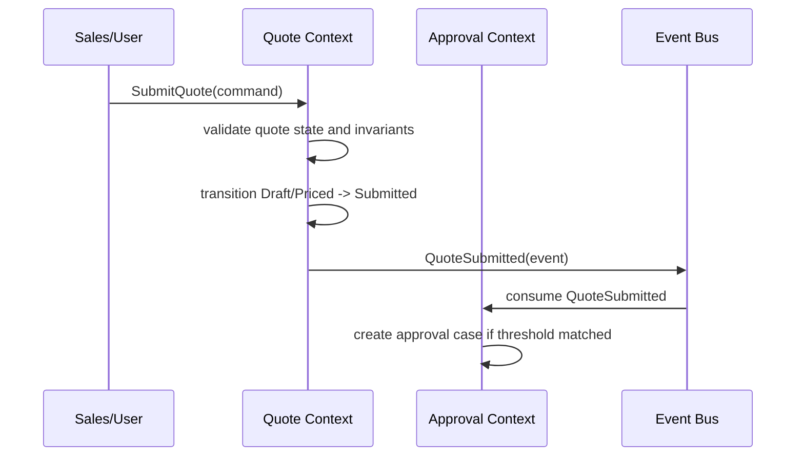
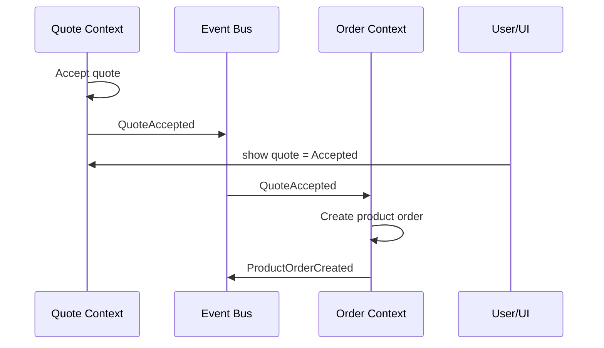
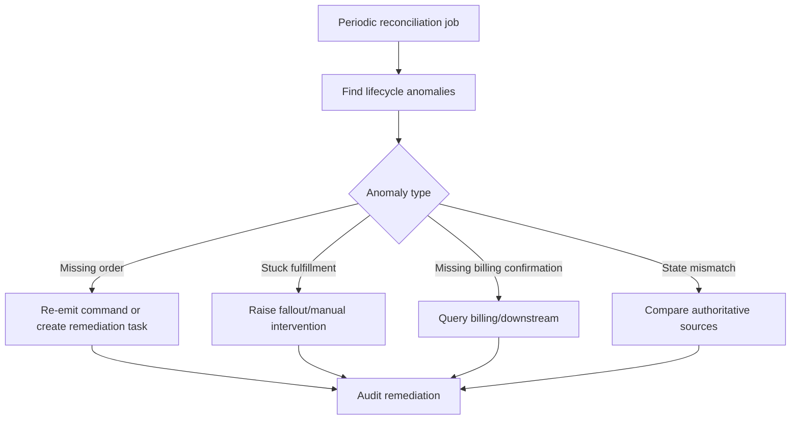
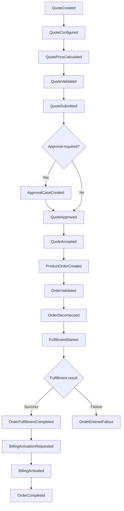

# Part 015 — Event-Driven Domain Consistency

> Fokus part ini bukan Kafka, broker, consumer group, partition, atau serialization secara teknis. Fokusnya adalah **apa arti event dari sudut pandang domain**, fakta bisnis apa yang sedang dikomunikasikan, invariant apa yang harus tetap benar, dan bagaimana engineer mencegah lifecycle quote/order menjadi tidak konsisten ketika sistem bergerak secara asynchronous.

Dalam CPQ, quote management, order management, dan telco BSS/OSS, event bukan sekadar pesan antar service. Event adalah **pernyataan bahwa sesuatu yang bermakna secara bisnis telah terjadi**.

Contoh:

- quote sudah disubmit;
- quote sudah approved;
- quote sudah accepted oleh customer;
- product order sudah dibuat dari quote;
- order item sudah decomposed;
- fulfillment task gagal;
- billing activation berhasil;
- order masuk fallout;
- order selesai sebagian;
- agreement berubah;
- catalog version berubah;
- price recalculation menghasilkan nilai baru.

Masalahnya: event-driven architecture membuat sistem lebih loosely coupled, tetapi juga membuat domain correctness lebih sulit dijaga. Quote/order lifecycle tidak lagi bergerak dalam satu transaction boundary kecil. Satu business process bisa tersebar di banyak service, banyak event, banyak state, banyak retry, dan banyak downstream system.

Senior engineer harus bisa bertanya:

- event ini menyatakan **fakta bisnis** atau hanya notifikasi teknis?
- event ini boleh diterbitkan pada state apa?
- consumer boleh mengambil keputusan bisnis dari event ini atau harus fetch ulang?
- kalau event duplicate, apa efek domain-nya?
- kalau event out-of-order, state mana yang menang?
- kalau event hilang, bagaimana reconciliation bekerja?
- kalau event direplay, apakah order akan berubah secara tidak sah?
- apakah event schema ini menjadi business contract jangka panjang?

---

## 1. Mental Model: Event Is a Business Fact, Not Just a Message

Dalam domain quote-to-cash, event yang baik harus menjawab:

1. **What happened?**
2. **To what business object?**
3. **At what lifecycle point?**
4. **Under which version/state?**
5. **With what business-relevant data?**
6. **What should downstream systems be allowed to infer?**

Contoh event yang lemah:

```text
QuoteUpdated
```

Masalah:

- updated apa?
- price berubah?
- status berubah?
- line item berubah?
- approval berubah?
- customer berubah?
- apakah update ini boleh memicu recalculation?
- apakah update ini boleh memicu notification?

Contoh event yang lebih domain-aware:

```text
QuotePriceCalculated
QuoteSubmittedForApproval
QuoteApproved
QuoteAcceptedByCustomer
QuoteExpired
QuoteRevisionCreated
ProductOrderCreatedFromQuote
OrderItemDecomposed
OrderEnteredFallout
OrderFulfillmentCompleted
BillingActivationRequested
```

Event yang baik tidak harus panjang, tetapi harus cukup spesifik untuk tidak membuat consumer menebak arti bisnisnya.

### Domain rule

> Event name harus merepresentasikan business fact yang sudah terjadi, bukan perintah, harapan, atau detail teknis internal.

Buruk:

```text
SendOrderToBilling
ProcessQuoteMessage
UpdateStatusEvent
SyncPayload
```

Lebih baik:

```text
BillingActivationRequested
QuoteStatusChanged
OrderFulfillmentCompleted
ProductInventoryUpdated
```

---

## 2. Command vs Event

Command adalah permintaan untuk melakukan sesuatu. Event adalah fakta bahwa sesuatu sudah terjadi.

| Concept | Meaning | Example | Failure interpretation |
|---|---|---|---|
| Command | Request/action intent | `SubmitQuote`, `CancelOrder`, `ActivateBilling` | Command may be rejected |
| Event | Business fact after success | `QuoteSubmitted`, `OrderCancelled`, `BillingActivated` | Event should not be casually undone |

### Example: quote submission



`SubmitQuote` dapat gagal jika quote invalid. `QuoteSubmitted` tidak seharusnya diterbitkan jika validasi gagal.

### Common anti-pattern

Mengirim event sebelum fakta bisnis committed.

```text
1. Publish QuoteSubmitted
2. Save quote status = SUBMITTED
3. Database save fails
```

Akibat domain:

- approval service percaya quote sudah submitted;
- quote service masih melihat quote sebagai draft/priced;
- user melihat status berbeda antar layar;
- retry dapat membuat duplicate approval case;
- audit trail menjadi tidak defensible.

### Senior engineer review question

> Pada titik mana event diterbitkan relatif terhadap state transition dan persistence commit?

---

## 3. Domain Event vs Integration Event

Tidak semua event memiliki audience yang sama.

### Domain event

Domain event biasanya digunakan di dalam bounded context atau sekitar domain core.

Example:

```text
QuoteLineItemAdded
QuotePriceCalculated
QuoteSubmittedForApproval
ApprovalThresholdExceeded
```

Ciri-ciri:

- dekat dengan internal domain model;
- granular;
- dapat berubah jika domain internal berubah;
- sering dipakai untuk memicu rule internal;
- tidak selalu aman sebagai external contract.

### Integration event

Integration event dipakai sebagai kontrak antar bounded context atau antar sistem.

Example:

```text
QuoteApproved
ProductOrderCreated
OrderFulfillmentCompleted
BillingActivationRequested
ProductInventoryChanged
```

Ciri-ciri:

- lebih stabil;
- merepresentasikan milestone bisnis;
- schema compatibility penting;
- harus jelas bagi consumer eksternal/internal lain;
- perlu versioning strategy.

### Comparison

| Dimension | Domain Event | Integration Event |
|---|---|---|
| Audience | Internal context | Other contexts/systems |
| Stability | Lower | Higher |
| Granularity | Fine-grained | Milestone-oriented |
| Coupling risk | Internal | Cross-system |
| Versioning burden | Medium | High |
| Business contract | Local | Shared |

### Practical rule

> Jangan expose semua domain event sebagai integration event. Pilih event yang merepresentasikan stable business milestone.

---

## 4. Eventual Consistency in Quote-to-Cash

Dalam domain quote-to-cash, immediate consistency sering tidak realistis karena banyak sistem terlibat:

- quote system;
- pricing engine;
- approval workflow;
- product catalog;
- customer/account management;
- order management;
- service ordering;
- inventory;
- provisioning;
- billing;
- charging;
- assurance;
- reporting.

Eventual consistency berarti sistem dapat berada dalam kondisi sementara yang belum sinkron, tetapi harus memiliki mekanisme untuk mencapai konsistensi bisnis yang dapat diterima.

### Contoh

Quote accepted, lalu product order dibuat asynchronous.



Dalam gap waktu antara `QuoteAccepted` dan `ProductOrderCreated`:

- quote sudah accepted;
- order mungkin belum ada;
- UI tidak boleh salah mengklaim order sudah created;
- user experience perlu status antara, misalnya `Order creation pending`;
- reconciliation perlu mendeteksi accepted quote tanpa order.

### Domain invariant

> Eventual consistency boleh menciptakan temporary inconsistency, tetapi tidak boleh menciptakan ambiguous business truth yang tidak bisa direkonsiliasi.

---

## 5. Business Operation Ordering

Beberapa domain operation harus terjadi dalam urutan tertentu.

Contoh quote-to-order:

```text
Configure product
→ Validate eligibility
→ Calculate price
→ Submit quote
→ Approve quote if needed
→ Accept quote
→ Create product order
→ Validate order
→ Decompose order
→ Fulfill service/resource work
→ Activate billing/charging
→ Complete order
```

Jika event out-of-order, downstream bisa membuat keputusan salah.

### Example failure

```text
ProductOrderCreated arrives before QuoteAccepted
```

Possible causes:

- async publishing order;
- retry from previous attempt;
- consumer lag;
- replay;
- split topics;
- missing causal metadata;
- consumer processing order not aligned with business order.

Downstream question:

> Apakah order boleh diproses jika quote acceptance belum terlihat?

Jawaban domain tergantung rule internal. Pilihan desain:

1. trust `ProductOrderCreated` as sufficient business fact;
2. check quote status synchronously;
3. wait until `QuoteAccepted` observed;
4. use correlation/causation metadata;
5. make order creation command carry accepted quote snapshot.

### Invariant

> Consumer tidak boleh mengasumsikan event arrival order sama dengan business causality order kecuali sistem secara eksplisit menjamin itu.

---

## 6. Correlation, Causation, and Business Traceability

Dalam distributed quote-to-cash, setiap event harus bisa ditelusuri.

### Important identifiers

| Identifier | Purpose |
|---|---|
| `eventId` | Unique event identity for deduplication |
| `correlationId` | Groups events belonging to one business journey |
| `causationId` | Points to command/event that caused this event |
| `quoteId` | Business object identity |
| `quoteVersion` | Quote version/revision identity |
| `productOrderId` | Order identity |
| `orderItemId` | Order item identity |
| `customerId` / `accountId` | Customer/account context |
| `catalogVersion` | Product rule context |
| `agreementId` | Contract/commercial context |

### Example causal chain

```text
SubmitQuote(commandId=C1)
→ QuoteSubmitted(eventId=E1, causationId=C1, correlationId=QTC-123)
→ ApprovalCaseCreated(eventId=E2, causationId=E1, correlationId=QTC-123)
→ QuoteApproved(eventId=E3, causationId=E2, correlationId=QTC-123)
→ QuoteAccepted(eventId=E4, correlationId=QTC-123)
→ ProductOrderCreated(eventId=E5, causationId=E4, correlationId=QTC-123)
```

Tanpa traceability:

- sulit mencari kenapa order dibuat;
- sulit audit approval decision;
- sulit membedakan duplicate order vs retry;
- sulit melakukan support investigation;
- sulit membuat timeline customer-impacting incident.

### Review question

> Bisakah kita merekonstruksi timeline bisnis dari quote creation sampai order completion menggunakan event metadata dan audit trail?

---

## 7. Idempotency from Domain Perspective

Idempotency bukan hanya “consumer aman menerima message dua kali”. Dari sudut pandang domain, idempotency berarti repeated processing tidak boleh menciptakan business effect ganda.

### Duplicate event examples

- `QuoteAccepted` diterima dua kali;
- `ProductOrderCreated` diterima dua kali;
- `BillingActivationRequested` diterima dua kali;
- `OrderCancelled` diterima ulang saat order sudah cancelled;
- `FulfillmentCompleted` direplay setelah order sudah completed.

### Bad outcome

Duplicate `QuoteAccepted` menyebabkan dua product order.

```text
QuoteAccepted(E1) -> Create Order O-100
QuoteAccepted(E1 duplicate) -> Create Order O-101
```

Ini bukan sekadar bug teknis. Ini business incident:

- customer bisa menerima dua fulfillment;
- billing bisa aktif dua kali;
- inventory bisa salah;
- support harus melakukan manual correction;
- audit trail sulit dijelaskan.

### Domain idempotency keys

| Scenario | Idempotency key candidate |
|---|---|
| Create order from quote acceptance | `quoteId + quoteVersion + acceptanceId` |
| Create approval case | `quoteId + quoteVersion + approvalPolicyId` |
| Request billing activation | `orderId + orderItemId + chargeId` |
| Create fulfillment task | `orderId + orderItemId + serviceSpecId + action` |
| Apply inventory update | `eventId` plus business target version |

### Invariant

> One accepted quote version must not create more than one authoritative product order unless the business explicitly supports split orders.

---

## 8. Duplicate Event Handling

Duplicate event handling harus dipahami pada dua level:

1. message-level duplicate;
2. business-effect duplicate.

Message-level duplicate berarti event yang sama datang lagi. Business-effect duplicate berarti event berbeda menyebabkan efek bisnis yang sama secara tidak sah.

### Example 1: same event duplicate

```text
eventId = E1, type = QuoteAccepted, quoteId = Q1
eventId = E1, type = QuoteAccepted, quoteId = Q1
```

Handling relatif jelas: dedupe by `eventId`.

### Example 2: semantic duplicate

```text
eventId = E1, type = QuoteAccepted, quoteId = Q1, quoteVersion = 3
eventId = E2, type = QuoteAccepted, quoteId = Q1, quoteVersion = 3
```

Ini lebih sulit. Bisa saja:

- bug publisher;
- retry yang membuat eventId baru;
- re-acceptance tidak sah;
- replay dari source berbeda;
- quote accepted dua kali karena concurrency race.

Handling harus berdasarkan business key:

```text
quoteId + quoteVersion + acceptance milestone
```

### Review checklist

- Apakah deduplication hanya menggunakan eventId?
- Apakah ada business idempotency key?
- Apakah duplicate menghasilkan no-op atau error?
- Apakah duplicate dicatat sebagai audit/security/support signal?
- Apakah duplicate dapat menyebabkan downstream side effect ulang?

---

## 9. Out-of-Order Event Handling

Out-of-order event terjadi saat consumer menerima event dalam urutan berbeda dari urutan business causality.

### Example

```text
OrderCompleted arrives before OrderItemFulfillmentCompleted
```

Kemungkinan:

- event topic berbeda;
- consumer lag berbeda;
- retry partial;
- replay;
- producer menerbitkan milestone terlalu awal;
- downstream event race.

### Strategies

#### 1. Ignore stale event

Jika event membawa version/sequence dan consumer sudah lebih maju.

```text
Current order version = 9
Incoming event version = 7
Decision: ignore or store as stale
```

#### 2. Buffer until prerequisite arrives

Jika event valid tetapi prerequisite belum terlihat.

```text
Received OrderFulfillmentCompleted
But OrderDecomposed not observed
Decision: hold pending causal dependency
```

#### 3. Fetch authoritative state

Consumer menerima event sebagai signal, lalu mengambil state terbaru dari source of truth.

```text
Received QuoteUpdated
Fetch quote by quoteId
Apply based on current state
```

#### 4. Reconcile later

Jika immediate correction terlalu mahal, tandai anomaly untuk reconciliation.

### Domain invariant

> Out-of-order event tidak boleh menyebabkan lifecycle regression.

Buruk:

```text
Current order status = COMPLETED
Incoming old event = ORDER_IN_PROGRESS
Consumer sets status = IN_PROGRESS
```

Benar:

```text
Current order status = COMPLETED
Incoming old event = ORDER_IN_PROGRESS
Consumer rejects/ignores/stores as historical event
```

---

## 10. Missing Event and Silent Domain Drift

Missing event adalah salah satu failure paling berbahaya karena sistem bisa terlihat “baik-baik saja” padahal lifecycle bisnis terputus.

### Example

Quote accepted, tetapi event `QuoteAccepted` tidak pernah sampai ke order management.

Akibat:

- quote status accepted;
- order tidak pernah dibuat;
- customer menunggu;
- sales mengira proses berjalan;
- downstream tidak tahu apa-apa;
- incident baru terlihat dari complaint.

### Why this happens

- publishing failed;
- transaction committed tetapi event tidak tersimpan;
- event stored tetapi relay failed;
- consumer permanently failed;
- poison message;
- schema incompatibility;
- ACL/permission issue;
- filter/routing salah;
- manual data correction tanpa event.

### Reconciliation pattern

Reconciliation mencari business object yang berada pada state yang tidak lengkap.

Examples:

```text
Accepted quote without product order after X minutes
Approved quote with no acceptance/expiry after validity window
Order in IN_PROGRESS without milestone update after X hours
Order item completed but parent order not recalculated
Billing activation requested but no billing confirmation after X hours
Fulfillment completed but inventory not updated
```

### Mermaid: reconciliation loop



### Invariant

> Every important asynchronous business milestone needs either delivery guarantee, reconciliation, or explicit manual operational ownership.

---

## 11. Replay: Useful, Dangerous, Necessary

Replay berarti event lama diproses ulang. Replay bisa dipakai untuk:

- rebuild read model;
- recover from consumer outage;
- reprocess failed integration;
- migrate projection;
- audit reconstruction;
- backfill downstream state.

Namun replay berbahaya jika consumer tidak membedakan:

- historical fact;
- current command;
- already-applied side effect;
- external irreversible operation.

### Safe replay example

Rebuild reporting projection:

```text
QuoteCreated
QuotePriced
QuoteSubmitted
QuoteApproved
QuoteAccepted
ProductOrderCreated
```

Projection dapat dihitung ulang dari awal.

### Dangerous replay example

Replay `BillingActivationRequested` dan memanggil billing system lagi.

Akibat:

- duplicate activation;
- duplicate charge;
- mismatch billing/product inventory;
- manual correction.

### Replay classification

| Consumer type | Replay safety |
|---|---|
| Pure projection/read model | Usually safe if deterministic |
| Audit timeline builder | Usually safe |
| Notification sender | Risky; can send duplicate messages |
| External system caller | High risk |
| Billing/charging trigger | Very high risk |
| Fulfillment/provisioning trigger | Very high risk |

### Rule

> Consumer with external side effects must be replay-aware and idempotent by business key.

---

## 12. Event Schema as Business Contract

Event schema bukan hanya payload teknis. Ia adalah kontrak bisnis antar sistem.

Schema harus menjawab:

- business object apa yang berubah?
- state sebelumnya dan state baru apa?
- version berapa?
- effective date apa?
- customer/account/agreement context apa?
- catalog/pricing context apa?
- apakah event ini snapshot atau delta?
- apakah consumer boleh mengambil action dari event saja?

### Snapshot vs delta

#### Snapshot event

```json
{
  "type": "QuoteApproved",
  "quoteId": "Q-1001",
  "quoteVersion": 4,
  "status": "APPROVED",
  "approvedAt": "2026-07-10T10:15:00Z",
  "approvedBy": "user-123",
  "totalRecurringCharge": 1200.00,
  "currency": "USD"
}
```

Pros:

- consumer dapat mengambil keputusan tanpa banyak fetch;
- robust terhadap source unavailability;
- bagus untuk audit/read model.

Cons:

- payload lebih besar;
- schema compatibility lebih berat;
- risiko stale embedded data.

#### Delta event

```json
{
  "type": "QuoteStatusChanged",
  "quoteId": "Q-1001",
  "fromStatus": "SUBMITTED",
  "toStatus": "APPROVED"
}
```

Pros:

- ringan;
- lebih stabil untuk perubahan field non-critical.

Cons:

- consumer harus fetch state;
- lebih rentan source unavailable;
- consumer bisa membaca state yang sudah lebih maju.

### Senior engineer decision

Gunakan pertanyaan ini:

> Apakah consumer perlu event ini sebagai **fact snapshot** atau hanya sebagai **signal to fetch**?

---

## 13. Event Compatibility and Evolution

Event schema akan berubah. Domain juga berubah. Masalahnya, consumer lama mungkin masih bergantung pada schema lama.

### Compatible changes

Biasanya aman:

- tambah optional field;
- tambah enum baru jika consumer robust;
- tambah metadata;
- tambah nested optional object.

### Dangerous changes

Berisiko tinggi:

- rename field;
- ubah semantic field;
- ubah required/optional behavior;
- hapus field;
- ubah enum meaning;
- ubah lifecycle status mapping;
- ubah key identity;
- ubah meaning monetary amount.

### Example: semantic drift

Field lama:

```text
totalPrice = total recurring + one-time
```

Field baru:

```text
totalPrice = recurring only
```

Nama sama, arti berubah. Ini sangat berbahaya.

Akibat:

- approval threshold salah;
- reporting salah;
- billing pre-check salah;
- customer quote display salah;
- margin calculation salah.

### Rule

> Breaking semantic change lebih berbahaya daripada breaking structural change, karena sering tidak terdeteksi compile/test contract sederhana.

---

## 14. Quote/Order Event Lifecycle Map

Berikut contoh lifecycle event map generik. Ini bukan klaim implementasi internal CSG; ini mental model industri yang perlu diverifikasi.



### What to verify internally

- event names;
- lifecycle states;
- which events are domain vs integration;
- whether quote acceptance directly creates order;
- whether billing activation is part of order completion;
- whether fulfillment completion can be partial;
- how fallout is represented;
- whether manual intervention emits events;
- whether cancel/amend has separate event streams.

---

## 15. Consistency Boundaries

Tidak semua data harus consistent pada waktu yang sama. Senior engineer harus membedakan consistency boundary.

### Stronger consistency candidates

- quote line total vs quote header total;
- approved price vs accepted price;
- quote version converted to order;
- order item status vs allowed next transition;
- duplicate product order from same accepted quote;
- approval decision attached to quote version.

### Eventual consistency candidates

- reporting projection;
- search index;
- customer notification status;
- analytics;
- downstream inventory reflection;
- fulfillment milestone projection;
- UI dashboard counters.

### Dangerous assumption

> “Everything is eventually consistent” is not a design. It is often an excuse for unclear invariants.

Be precise:

- which invariant must be immediate?
- which projection can lag?
- how much lag is acceptable?
- who detects violation?
- who owns correction?

---

## 16. Event-Driven Testing from Domain Perspective

Testing event-driven domain bukan hanya test producer/consumer.

### Test categories

| Test type | What it proves |
|---|---|
| Event emission test | Correct event emitted after valid state transition |
| No-event test | Invalid operation does not emit business event |
| Idempotency test | Duplicate event does not duplicate business effect |
| Out-of-order test | Old event does not regress lifecycle |
| Replay test | Consumer replay does not trigger unsafe side effect |
| Contract test | Producer/consumer schema remains compatible |
| Reconciliation test | Missing milestone is detected and recoverable |
| Audit test | Event timeline can reconstruct business journey |

### Example scenarios

```text
Given quote Q1 version 3 is already accepted
When QuoteAccepted for Q1 version 3 is consumed again
Then no second product order is created
And duplicate is logged/ignored according to policy
```

```text
Given order O1 is COMPLETED
When older OrderInProgress event arrives
Then order status remains COMPLETED
And stale event is ignored or stored as historical
```

```text
Given quote Q2 is ACCEPTED but no product order exists after SLA window
When reconciliation runs
Then anomaly is detected
And remediation workflow is created or order creation is retried
```

---

## 17. Observability for Business Consistency

Technical metrics are not enough. Need business consistency metrics.

### Useful metrics

- accepted quotes without orders;
- submitted quotes stuck awaiting approval;
- approved quotes approaching expiry;
- orders stuck in validation;
- orders stuck in decomposition;
- orders in fallout by reason;
- duplicate event count by event type;
- stale/out-of-order event count;
- replayed event count;
- reconciliation anomalies found/resolved;
- billing activation requested but not confirmed;
- fulfillment completed but order not completed.

### Useful logs/audit fields

- quoteId;
- quoteVersion;
- orderId;
- orderItemId;
- customer/account;
- eventId;
- correlationId;
- causationId;
- source system;
- previous state;
- new state;
- rule/policy version;
- catalog version;
- actor/user/system.

### Senior engineer question

> If a customer asks “why is my order stuck?”, can we reconstruct the business timeline without guessing?

---

## 18. Common Anti-Patterns

### 18.1 Event name too generic

```text
EntityUpdated
StatusChanged
DataSynced
```

These force consumers to inspect payload and invent meaning.

### 18.2 Event emitted for failed operation

Publishing `QuoteSubmitted` before validation/commit succeeds.

### 18.3 Consumer owns source-of-truth state incorrectly

Consumer overwrites authoritative state based on stale event.

### 18.4 No business idempotency key

Deduplication only by eventId, causing semantic duplicate side effects.

### 18.5 Event payload contains ambiguous money fields

`amount`, `price`, `total`, `charge` without charge type, currency, tax inclusion, period, or discount context.

### 18.6 Replay triggers external side effect

Backfill re-sends billing/provisioning/notification request.

### 18.7 Eventual consistency without reconciliation

The system accepts asynchronous failure but has no mechanism to detect broken lifecycle.

### 18.8 State regression

Old event changes completed/cancelled/expired object back to active state.

---

## 19. Domain Event Review Checklist

Use this when reviewing user story, design, API/event contract, or PR.

### Event meaning

- What business fact does this event represent?
- Is it a command disguised as event?
- Is the name specific enough?
- Is the event emitted only after business success?
- Is it domain event or integration event?

### Lifecycle correctness

- From which state can this event be emitted?
- What state transition caused it?
- Can it happen more than once?
- Is it terminal, intermediate, retryable, or compensating?
- Does it represent partial or full completion?

### Payload correctness

- Does payload contain stable business identifiers?
- Does it include version/revision where needed?
- Does it include money/currency/charge semantics clearly?
- Does it include customer/account/agreement/catalog context if relevant?
- Is it snapshot, delta, or signal-to-fetch?

### Consistency and failure

- What happens if event is duplicate?
- What happens if event is missing?
- What happens if event is out-of-order?
- What happens if consumer fails halfway?
- Can event be replayed safely?
- Is there reconciliation?

### Compatibility

- Is schema backward compatible?
- Are enum values extensible?
- Is semantic change documented?
- Are consumers known?
- Are contract tests or compatibility checks present?

---

## 20. Internal Verification Checklist

Cek secara internal, jangan asumsi.

### Event catalog

- Daftar event untuk quote, order, catalog, pricing, approval, fulfillment, billing.
- Mana domain event dan mana integration event.
- Event owner per bounded context.
- Event lifecycle map.
- Event schema versioning policy.

### Event publication

- Apakah event diterbitkan setelah commit?
- Apakah memakai outbox/inbox pattern atau mekanisme sejenis?
- Bagaimana event relay failure ditangani?
- Apakah ada dead-letter/fallout event handling?
- Apakah manual correction menerbitkan event?

### Consumer behavior

- Idempotency key yang digunakan.
- Handling duplicate event.
- Handling out-of-order event.
- Handling replay.
- External side effect guard.
- Consumer retry policy.

### Business reconciliation

- Accepted quote without order.
- Order stuck in validation/decomposition/fulfillment.
- Billing requested without billing confirmation.
- Fulfillment completed but inventory not updated.
- Product order completed but quote/order summary mismatch.

### Observability

- Correlation ID across quote-to-cash.
- Business timeline dashboard.
- Fallout metrics.
- Reconciliation metrics.
- Event lag and processing error by business object type.

---

## 21. How This Affects API, Database, Workflow, Testing, and Operations

### API

- API response should not imply asynchronous downstream completion unless confirmed.
- API may need status like `pendingOrderCreation`, `awaitingFulfillment`, `fallout`.
- API contract should expose stable lifecycle states, not technical processing states unless intentionally designed.

### Database

- Need store state, version, audit, idempotency records, event publication records.
- Need business keys to prevent duplicate order/activation/task.
- Need lifecycle timestamps for reconciliation.

### Workflow

- Workflow must account for pending, retryable, manual intervention, compensation, cancellation, amendment.
- Workflow should not rely only on event arrival order.

### Testing

- Must include duplicate, stale, replay, missing event, and reconciliation scenarios.
- Must verify no unsafe external side effect during replay.

### Operations

- Need dashboards for stuck lifecycle, fallout, missing milestones.
- Need support-friendly timeline reconstruction.
- Need manual remediation with audit trail.

---

## 22. Senior Engineer Takeaways

Event-driven domain consistency requires discipline at the domain boundary.

The most important principles:

1. Event is a business fact, not just a message.
2. Command and event must not be confused.
3. Domain event and integration event have different audiences and stability needs.
4. Eventual consistency requires explicit reconciliation.
5. Duplicate events must not create duplicate business effects.
6. Out-of-order events must not regress lifecycle state.
7. Replay must not trigger unsafe external side effects.
8. Event schema is a business contract.
9. Correlation and causation are necessary for audit and support.
10. Senior review must focus on lifecycle correctness, not only payload shape.

If a PR introduces or changes an event, review it as if it changes the business contract of the system. Because in quote-to-cash, it probably does.
