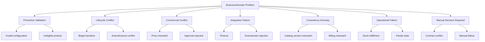
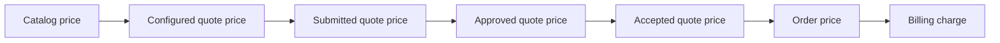
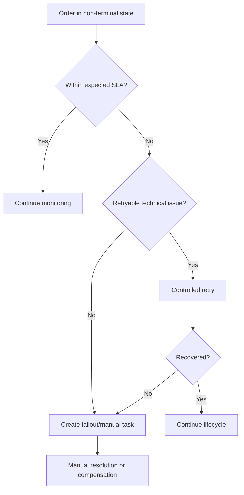

# Part 016 — Business Error and Failure Modelling

> Fokus part ini adalah melihat error sebagai **business state and lifecycle problem**, bukan sekadar exception, HTTP status code, stack trace, atau retry. Dalam CPQ/order management, error yang salah dimodelkan bisa berubah menjadi duplicate order, harga salah, billing mismatch, stuck fulfillment, manual fallout yang tidak jelas ownership-nya, atau customer-impacting incident.

Dalam sistem enterprise CPQ dan telco order management, banyak kegagalan bukan murni “technical failure”. Banyak kegagalan adalah **business failure**:

- konfigurasi produk tidak valid;
- produk tidak eligible untuk customer/lokasi tertentu;
- price berubah antara quote dan order;
- quote sudah expired tapi masih dicoba dikonversi;
- approval ditolak;
- contract/agreement conflict;
- catalog version mismatch;
- duplicate order dari quote yang sama;
- order sebagian berhasil dan sebagian gagal;
- downstream menolak service order;
- fulfillment stuck;
- cancellation race;
- amendment conflict;
- billing activation mismatch;
- inventory tidak sinkron;
- manual fallout tidak terselesaikan.

Senior engineer harus bisa membedakan:

- error mana yang harus mencegah operasi;
- error mana yang harus menjadi state bisnis;
- error mana yang bisa retry;
- error mana yang perlu manual intervention;
- error mana yang perlu compensation;
- error mana yang harus diaudit;
- error mana yang harus terlihat ke customer/sales/support;
- error mana yang hanya internal technical detail.

---

## 1. Error Is Not Always Failure

Tidak semua error berarti proses harus gagal total.

Dalam quote/order domain, beberapa error adalah:

| Type | Meaning | Example |
|---|---|---|
| Validation error | Input/business object tidak memenuhi rule | Invalid product combination |
| Eligibility error | Customer/lokasi/channel tidak memenuhi syarat | Product unavailable for site |
| Commercial error | Harga/diskon/margin/approval bermasalah | Discount exceeds authority |
| Lifecycle error | Operasi tidak valid pada state saat ini | Cancel completed order |
| Integration error | Downstream tidak tersedia/menolak | Provisioning timeout |
| Consistency error | State antar sistem tidak cocok | Billing active but order not completed |
| Fallout | Error operasional yang perlu resolusi | Service order rejected due to missing resource |
| Recoverable anomaly | Bisa diperbaiki dengan retry/reconciliation | Missing callback |
| Irrecoverable business conflict | Perlu keputusan manusia/contractual correction | Agreement terms conflict |

### Important distinction

```text
Exception != business failure
Business failure != technical failure
Retryable technical failure != retryable business failure
```

Contoh:

- timeout ke downstream mungkin retryable;
- downstream rejection karena service not feasible bukan retryable tanpa perubahan data/rule;
- expired quote bukan technical error;
- duplicate order bukan kondisi yang cukup di-retry;
- approval rejected bukan system failure.

---

## 2. Failure Taxonomy

Tanpa taxonomy, semua error akan diperlakukan sama: log error, retry, return 500, atau masuk queue. Ini berbahaya.

### Proposed taxonomy for CPQ/order management



### Why taxonomy matters

Setiap kategori membutuhkan treatment berbeda.

| Category | Typical response | Retry? | State change? | Audit? |
|---|---|---:|---:|---:|
| Validation | Reject before commit | No | Usually no | Sometimes |
| Eligibility | Reject or require alternate offer | No | Usually no | Yes if quote-impacting |
| Commercial | Block/approval/reprice | Sometimes | Yes | Yes |
| Lifecycle | Reject illegal operation | No | No or conflict state | Yes |
| Integration timeout | Retry/fallout after threshold | Yes | Pending/retryable | Yes |
| Downstream rejection | Fallout/manual correction | Not blindly | Fallout | Yes |
| Consistency anomaly | Reconcile/remediate | Depends | Maybe | Yes |
| Manual decision | Queue/task/workflow | No automatic | Manual state | Yes |

---

## 3. Invalid Configuration

Invalid configuration terjadi ketika product selection tidak memenuhi rule catalog/configuration.

Examples:

- bundle mandatory component missing;
- mutually exclusive options selected;
- product option incompatible with access type;
- quantity outside allowed range;
- location does not support selected technical option;
- parent product missing required child product;
- add/modify/disconnect action inconsistent with current installed base.

### Domain impact

Invalid configuration harus ditangkap sedini mungkin, idealnya sebelum quote submitted atau order created.

Jika lolos:

- pricing bisa salah;
- approval bisa approve quote yang tidak fulfillable;
- order decomposition gagal;
- downstream provisioning menolak;
- manual fallout meningkat;
- customer menerima janji layanan yang tidak bisa dipenuhi.

### Invariant

> A submitted quote must not contain known-invalid product configuration for the selected customer/site/catalog context.

### Detection points

- during product configuration;
- before pricing;
- before quote submission;
- before quote acceptance;
- before order creation;
- during order validation;
- during decomposition.

### Review questions

- Rule ini berasal dari product catalog, eligibility service, agreement, atau downstream feasibility?
- Apakah rule dievaluasi saat quote saja, order saja, atau keduanya?
- Apakah validation snapshot disimpan untuk audit?
- Apa yang terjadi jika catalog rule berubah setelah quote dibuat?

---

## 4. Ineligible Product

Product bisa valid secara konfigurasi tetapi tidak eligible untuk customer, account, channel, region, site, agreement, atau segment tertentu.

Examples:

- product hanya untuk enterprise segment tertentu;
- offer hanya berlaku di negara/region tertentu;
- customer tidak memiliki agreement untuk product tersebut;
- channel partner tidak boleh menjual offering tertentu;
- site tidak serviceable;
- customer credit/risk status tidak eligible;
- installed base prerequisite tidak terpenuhi.

### Configuration vs eligibility

| Concept | Question |
|---|---|
| Configuration | Can these product options fit together? |
| Eligibility | Is this customer/site/channel allowed to buy it? |

### Failure mode

Ineligible product sering terlihat seperti validation error biasa, tetapi dampaknya lebih komersial/contractual.

Example:

```text
Product configuration is structurally valid.
But customer agreement does not allow discounted enterprise bundle.
Quote is accepted anyway.
Order later rejected by fulfillment/billing policy.
```

### Invariant

> Eligibility must be evaluated against the correct customer/account/agreement/channel/site context, not only product catalog structure.

### Internal verification checklist

- Di mana eligibility rule disimpan?
- Apakah eligibility evaluated during quote, order, or both?
- Apakah customer-specific eligibility override ada?
- Apakah agreement-driven eligibility ada?
- Apakah eligibility result version/audit disimpan?

---

## 5. Price Mismatch

Price mismatch adalah salah satu failure paling sensitif di CPQ.

### Common scenarios

- quote displayed price berbeda dari approved price;
- approved quote berbeda dari accepted quote;
- order price berbeda dari quote price;
- billing charge berbeda dari order charge;
- discount hilang saat conversion;
- promotion expired tapi masih diterapkan;
- catalog price berubah setelah quote dibuat;
- tax/fee/surcharge dihitung berbeda antar sistem;
- currency atau rounding berbeda;
- recurring charge dan one-time charge tercampur.

### Price lifecycle risk



Setiap transisi bisa menyebabkan mismatch.

### Invariants

- Approved quote should reference the price basis approved.
- Accepted quote should not silently reprice without explicit business rule.
- Order created from quote should preserve commercially binding price terms unless reprice is explicitly allowed.
- Billing activation should receive charge semantics consistent with accepted/order terms.

### Dangerous ambiguity

`totalPrice` tanpa semantic clarity.

Harus jelas:

- recurring vs one-time vs usage;
- before discount vs after discount;
- before tax vs after tax;
- per unit vs total quantity;
- monthly vs annual;
- contract term;
- currency;
- rounding;
- effective date.

### Review questions

- Kapan price recalculation boleh terjadi?
- Apakah accepted quote immutable?
- Apakah order boleh reprice?
- Apa yang terjadi jika catalog price berubah sebelum order created?
- Siapa authoritative untuk billing charge?

---

## 6. Expired Quote

Quote biasanya memiliki validity period. Setelah expired, quote tidak boleh accepted kecuali ada explicit renewal/revision/revalidation rule.

### Failure scenario

```text
Quote approved on July 1.
Valid until July 7.
Customer accepts on July 10.
System creates order using old price.
```

Dampak:

- commercial terms mungkin tidak lagi valid;
- promotion sudah berakhir;
- catalog offering sudah berubah;
- approval decision sudah tidak valid;
- billing bisa menolak;
- customer dispute bisa muncul.

### Invariant

> A quote cannot be accepted after expiry unless the domain explicitly supports grace period, renewal, or revalidation.

### Expiry handling options

| Option | Meaning |
|---|---|
| Hard expiry | Acceptance blocked after expiry |
| Grace period | Acceptance allowed within configured window |
| Revalidation | Quote must be repriced/revalidated |
| Revision required | New quote version must be created |
| Approval renewal | Approval must be requested again |

### Internal verification checklist

- Apa field validity quote?
- Timezone apa yang dipakai?
- Apakah expiry checked at UI, API, workflow, or order conversion?
- Apakah expiry affects approval validity?
- Apakah quote expiry emits event?
- Apakah expired quote bisa revised?

---

## 7. Approval Rejected

Approval rejection bukan technical failure. Itu valid business outcome.

### Common mistake

Memodelkan approval rejected sebagai exception/error flow yang tidak jelas state-nya.

Benar:

- quote masuk state `Rejected` atau `ApprovalRejected`;
- reason disimpan;
- actor/approver dicatat;
- quote dapat revised jika allowed;
- sales/user diberi path berikutnya;
- audit trail lengkap.

### Invariant

> A quote requiring approval cannot be accepted until approval is granted for the same quote version and commercial terms.

### Failure mode

- quote approved version 3;
- user modifies discount creating version 4;
- system still uses approval from version 3;
- quote accepted with unapproved terms.

Ini bukan bug UI. Ini domain correctness failure.

### Review questions

- Approval melekat ke quote ID atau quote version?
- Apakah price/discount changes invalidate approval?
- Apakah approver authority threshold dihitung berdasarkan net price, margin, discount, or total contract value?
- Apakah rejection reason structured?
- Apakah rejected quote bisa revised?

---

## 8. Contract or Agreement Conflict

Agreement conflict terjadi ketika quote/order terms bertentangan dengan existing contract, enterprise agreement, customer-specific term, atau negotiated commercial rule.

Examples:

- customer agreement only allows certain product families;
- discount exceeds contractual cap;
- minimum term not met;
- early termination rules conflict with disconnect order;
- renewal quote violates existing agreement;
- billing account not covered by agreement;
- site not included in enterprise contract;
- reseller/channel term conflict.

### Why this is hard

Agreement sering berada di boundary antara sales, legal, billing, and delivery. Banyak rule tidak sepenuhnya berada di product catalog.

### Invariant

> Quote/order commercial terms must be compatible with the applicable agreement context at the time of commitment.

### Handling options

- block quote submission;
- require approval/legal review;
- create exception request;
- force quote revision;
- allow with audit and override authority;
- route to manual review.

### Internal verification checklist

- Apakah agreement model ada di system atau external?
- Apakah agreement-driven pricing/eligibility diterapkan?
- Apakah contract exception workflow ada?
- Apakah legal/commercial approval berbeda dari price approval?
- Apakah agreement snapshot disimpan di quote/order?

---

## 9. Catalog Version Mismatch

Catalog mismatch terjadi ketika quote/order mengacu pada offering/rule/version yang tidak lagi sama dengan current catalog.

### Scenarios

- quote dibuat dengan catalog version 10;
- catalog berubah ke version 11;
- quote accepted setelah perubahan;
- order validation menggunakan version 11;
- selected option tidak lagi valid;
- decomposition rule berubah;
- price berubah;
- downstream rejects order.

### Invariant

> Quote/order must clearly know whether it is evaluated against original catalog snapshot, current catalog, or revalidated catalog version.

### Strategies

| Strategy | Meaning | Trade-off |
|---|---|---|
| Snapshot | Quote keeps catalog terms as captured | More audit-safe, heavier data |
| Reference by version | Quote references catalog version | Requires version availability |
| Always current | Revalidate against latest catalog | Less stale, but can break accepted terms |
| Hybrid | Snapshot commercial terms, revalidate technical feasibility | More complex but common in enterprise |

### Failure smell

Code fetches “current product offering” during order conversion without considering quote's original catalog version.

### Review questions

- Does quote store product offering version?
- Are configuration rules versioned?
- Are price rules versioned?
- Are decomposition rules versioned?
- What happens when catalog version is retired?

---

## 10. Duplicate Order

Duplicate order is among the most serious failures in quote-to-cash.

### Common causes

- duplicate `QuoteAccepted` event;
- retry after timeout without idempotency;
- user double-click/submits twice;
- API client retries POST without idempotency key;
- async consumer processes same message twice;
- quote accepted concurrently by two sessions;
- reconciliation creates order while delayed original process also creates order;
- manual support action duplicates automated action.

### Domain invariant

> One accepted quote version should produce one authoritative product order unless explicit split-order logic exists.

### Detection keys

- quoteId;
- quoteVersion;
- acceptanceId;
- customer/account;
- product order source reference;
- external correlation/reference;
- idempotency key.

### Safe response

If duplicate create is attempted:

- return existing order if same business request;
- reject if conflicting request;
- log/audit duplicate attempt;
- avoid creating second downstream fulfillment/billing action.

### Review questions

- Does order have source quote reference?
- Is there uniqueness constraint or business idempotency enforcement?
- What happens if order creation times out but actually succeeds?
- Can reconciliation duplicate order creation?
- Can manual operations bypass duplicate guard?

---

## 11. Partial Fulfillment

Partial fulfillment occurs when some order items complete and others fail, wait, or require manual intervention.

### Example

Enterprise customer buys:

- internet access for Site A;
- SIP trunk for Site A;
- managed router for Site A;
- security service for Site B.

Possible result:

- internet fulfilled;
- SIP pending number allocation;
- router shipment delayed;
- security service rejected due to missing prerequisite.

### Why this matters

Order status cannot be reduced to simple success/failure.

Need distinguish:

- parent order status;
- order item status;
- service order status;
- milestone status;
- billing readiness;
- customer-visible readiness;
- partial completion policy.

### Invariants

- Parent order cannot be completed if mandatory order item is unresolved.
- Billing activation must align with item/product readiness policy.
- Partial fulfillment must have clear customer/support visibility.
- Failed optional item may or may not block parent completion depending on product dependency.

### Handling options

| Case | Possible behavior |
|---|---|
| Mandatory item failed | Parent order in fallout/blocked |
| Optional add-on failed | Continue core fulfillment; mark add-on fallout |
| Dependency item pending | Dependent items wait |
| Billing-relevant item complete | Activate charges for completed item if allowed |
| Customer-visible bundle incomplete | Hold completion until bundle ready |

---

## 12. Downstream Rejection

Downstream rejection means another system refuses the requested work.

Examples:

- service ordering rejects invalid service spec;
- provisioning rejects missing resource;
- inventory rejects unavailable resource;
- billing rejects account/charge mismatch;
- charging rejects unsupported offer;
- external partner rejects incomplete address;
- feasibility system rejects site.

### Technical retry is not enough

If downstream rejects because data/rule is invalid, retrying will repeat failure.

### Classification

| Rejection type | Retry? | Action |
|---|---:|---|
| Temporary unavailable | Yes | Retry with backoff |
| Validation rejection | No | Correct data/rule |
| Capacity/resource unavailable | Maybe | Replan, reserve alternative, manual review |
| Contract/account mismatch | No | Correct account/agreement/billing setup |
| Unknown/ambiguous | Controlled retry then fallout | Manual investigation |

### Invariant

> Downstream rejection must be represented as a domain-operational state, not hidden as a technical exception only.

### Internal verification checklist

- Are downstream error codes mapped to business fallout reasons?
- Are retryable vs non-retryable errors classified?
- Is rejection visible in order timeline?
- Is there manual task ownership?
- Are downstream payloads stored for audit/support?

---

## 13. Stuck Order

Stuck order is an order that remains in non-terminal state beyond expected SLA/window.

### Common stuck states

- pending validation;
- pending decomposition;
- awaiting fulfillment response;
- awaiting inventory reservation;
- awaiting billing activation;
- awaiting manual intervention;
- cancellation pending;
- amendment pending;
- fallout unresolved.

### Why stuck order is dangerous

No explicit failure means no one owns it.

A stuck order can cause:

- customer waiting without update;
- sales/support confusion;
- billing not activated;
- service not provisioned;
- inventory reservation leak;
- reporting mismatch;
- SLA breach.

### Detection

```text
order status = IN_PROGRESS
last milestone update older than threshold
no active retry
no manual task assigned
no downstream correlation status received
```

### Invariant

> Every non-terminal order state must have an owner, timeout expectation, and next recovery path.

### Operational model



---

## 14. Cancellation Race

Cancellation race terjadi ketika cancel request bersaing dengan fulfillment progress.

### Example

```text
T1: Order is IN_PROGRESS
T2: User requests cancellation
T3: Fulfillment completes item
T4: Cancel command reaches orchestrator
T5: Billing activation already requested
```

Pertanyaan domain:

- Apakah cancellation masih boleh?
- Apakah cancellation berarti stop pending tasks only?
- Apakah completed service harus disconnected?
- Apakah billing harus reversed?
- Apakah customer dikenai fee?
- Apakah inventory reservation dilepas?
- Apakah cancellation menjadi separate order?

### Simple status is not enough

`CANCELLED` bisa berarti banyak hal:

- fully cancelled before fulfillment;
- partially cancelled;
- cancellation requested;
- cancellation rejected;
- cancellation completed with compensation;
- cancellation converted to disconnect order.

### Invariant

> Cancellation must respect the current fulfillment/billing state and must not erase completed business facts.

### Review questions

- Is cancellation synchronous or asynchronous?
- Can order be cancelled after decomposition?
- Can individual order items be cancelled?
- What if fulfillment completes during cancellation?
- Is compensation required?
- Is cancellation auditable?

---

## 15. Amendment Conflict

Amendment modifies an existing in-flight or completed order/quote/agreement/product.

### Common amendment scenarios

- change quantity;
- change site/address;
- change product option;
- add service;
- remove item;
- modify install date;
- change billing account;
- change contact;
- revise quote after approval;
- amend order during fulfillment.

### Conflict examples

- amend quote after approval invalidates approval;
- amend order item already fulfilled;
- amend parent product while child service order in progress;
- amend pricing after billing activation requested;
- amend customer/account after downstream tasks created;
- two amendments concurrently target same order item.

### Invariant

> Amendment must be evaluated against current lifecycle state, dependencies, and already-committed downstream facts.

### Handling models

| Model | Meaning |
|---|---|
| In-place amend | Modify existing object if safe |
| Revision | Create new quote/order version |
| Supplemental order | New order changes installed product/in-flight order |
| Cancel-and-replace | Cancel previous request and create new one |
| Manual review | Human decides due to complex impact |

### Internal verification checklist

- Is amendment supported for quote, order, or product inventory?
- Which states allow amendment?
- Does amendment create new version?
- Does amendment invalidate approval/pricing?
- Does amendment trigger re-decomposition?
- Is concurrent amendment blocked?

---

## 16. Billing Mismatch

Billing mismatch terjadi ketika order/quote/product inventory tidak konsisten dengan billing/charging.

### Scenarios

- billing activated but order not completed;
- order completed but billing not activated;
- billing account wrong;
- charge amount differs from accepted quote;
- recurring charge start date wrong;
- one-time charge duplicated;
- discount not passed to billing;
- disconnected product still billed;
- suspended service still charged incorrectly;
- tax/currency/rounding mismatch.

### Why this is severe

Billing mismatch langsung berdampak pada customer trust, revenue, compliance, support cost, dan dispute.

### Invariants

- Billing activation should be triggered only when product/order item reaches billing-ready state.
- Charge semantics passed to billing must match accepted/order commercial terms.
- Disconnect/suspend/resume must produce correct billing/charging effects.
- Billing confirmation should be correlated back to order/product lifecycle.

### Detection

- compare order completed vs billing active;
- compare accepted quote charges vs billing charges;
- reconcile product inventory active status vs billed services;
- detect duplicate one-time charges;
- detect charges without product/order reference;
- detect active product without billing record.

### Review questions

- When exactly is billing activation requested?
- Is billing activation item-level or order-level?
- Who owns charge calculation: CPQ, order, billing, or catalog?
- What happens when billing rejects charge?
- Is billing confirmation required before order completion?

---

## 17. Manual Fallout

Fallout adalah kondisi ketika order/process tidak dapat otomatis lanjut dan perlu intervensi manusia atau workflow khusus.

### Fallout must not be a black hole

Fallout yang buruk:

```text
status = FAILED
log error
support manually checks later
```

Fallout yang baik:

- memiliki reason code;
- memiliki owner/queue;
- memiliki SLA;
- memiliki remediation action;
- memiliki audit trail;
- memiliki customer/support visibility;
- dapat resume lifecycle setelah diperbaiki;
- tidak menghilangkan original business context.

### Fallout reason examples

- invalid downstream payload;
- missing resource;
- site not serviceable;
- billing account mismatch;
- customer data incomplete;
- provisioning rejected;
- manual approval required;
- inventory reservation failed;
- external partner response ambiguous;
- dependency order item failed.

### Invariant

> Fallout state must preserve enough context to recover, compensate, or close the business process defensibly.

### Internal verification checklist

- Is there fallout queue/task model?
- Are fallout reason codes structured?
- Who owns fallout resolution?
- Can fallout be resumed automatically after correction?
- Is customer notified or hidden?
- Is SLA tracked?
- Are repeated fallout causes analyzed?

---

## 18. Recovery Models

Recovery is not one thing. Different failures need different recovery model.

### Recovery types

| Recovery model | Use when | Example |
|---|---|---|
| Reject | Operation should not proceed | Invalid quote configuration |
| Retry | Temporary technical failure | Downstream timeout |
| Resume | Process stopped but can continue after correction | Fallout resolved |
| Revalidate | Rule/data may have changed | Expired quote, catalog change |
| Revise | New version needed | Price/discount changed after approval |
| Compensate | Side effect already happened | Cancel after fulfillment |
| Reconcile | Systems disagree | Billing active but order not complete |
| Manual decision | Business ambiguity | Contract conflict |
| Close/abandon | Process cannot continue | Customer withdraws order |

### Retry is not recovery

Retry only helps when the original operation is still valid and failure is transient.

Bad retry:

```text
Downstream rejected because product not serviceable.
System retries every 5 minutes.
```

This creates noise, not recovery.

Good recovery:

```text
Downstream rejected: NOT_SERVICEABLE.
Order item enters fallout.
Sales/support selects alternative product/site or cancels item.
```

---

## 19. Error State Design

Error should often become explicit lifecycle state.

### Weak model

```text
status = IN_PROGRESS
lastError = "Provisioning failed"
```

Problem:

- status hides business reality;
- no ownership;
- no SLA;
- no valid transitions;
- UI/support ambiguity.

### Better model

```text
status = FALLOUT
falloutReason = PROVISIONING_REJECTED
falloutOwnerQueue = SERVICE_DELIVERY
lastSuccessfulMilestone = SERVICE_ORDER_CREATED
nextAllowedActions = [RETRY_AFTER_CORRECTION, CANCEL_ITEM, ESCALATE]
```

### State design checklist

- Is this a terminal state?
- Is it retryable?
- Is it manually resolvable?
- Can customer see it?
- Does it block parent object?
- What transitions are allowed?
- What event is emitted?
- What audit fields are required?

---

## 20. API Error Design from Domain Perspective

API error should not leak only technical details. It should communicate domain result correctly.

### Examples

#### Invalid configuration

```json
{
  "code": "INVALID_PRODUCT_CONFIGURATION",
  "message": "Selected product options are not compatible.",
  "target": "quote.items[2]",
  "details": [
    {
      "rule": "MUTUALLY_EXCLUSIVE_OPTIONS",
      "conflictingOptions": ["STATIC_IP", "DYNAMIC_IP_ONLY"]
    }
  ]
}
```

#### Illegal lifecycle transition

```json
{
  "code": "ILLEGAL_QUOTE_TRANSITION",
  "message": "Expired quote cannot be accepted without revalidation.",
  "currentState": "EXPIRED",
  "attemptedAction": "ACCEPT_QUOTE",
  "allowedActions": ["CREATE_REVISION"]
}
```

#### Duplicate order attempt

```json
{
  "code": "DUPLICATE_ORDER_REQUEST",
  "message": "An order already exists for this accepted quote version.",
  "quoteId": "Q-1001",
  "quoteVersion": 3,
  "existingOrderId": "O-9001"
}
```

### API design rules

- Use stable domain error codes.
- Include object state/version where relevant.
- Include allowed next actions when possible.
- Do not expose stack traces or downstream internals to external consumers.
- Preserve detailed diagnostic data internally.
- Distinguish validation rejection, conflict, not found, unauthorized, downstream pending, and fallout.

---

## 21. Event Design for Failure

Failure events must be meaningful.

Bad:

```text
OrderFailed
```

Better:

```text
OrderValidationFailed
OrderDecompositionFailed
OrderEnteredFallout
FulfillmentTaskRejected
BillingActivationRejected
OrderCancellationRejected
```

### Failure event payload should include

- business object ID;
- current lifecycle state;
- failed action;
- reason code;
- retryable flag or recovery category;
- owner/system;
- correlation ID;
- downstream reference if applicable;
- timestamp;
- affected order item/service/charge;
- customer impact if known.

### Invariant

> Failure events should help downstream/support understand the recovery path, not merely announce that something broke.

---

## 22. Testing Business Failures

Failure scenarios must be first-class tests.

### Required test categories

| Category | Scenario |
|---|---|
| Configuration | Invalid bundle cannot be submitted |
| Eligibility | Ineligible customer cannot accept offer |
| Pricing | Accepted quote preserves approved price |
| Approval | Modified quote invalidates prior approval |
| Expiry | Expired quote cannot convert to order |
| Catalog | Retired offering blocks/revalidates conversion |
| Duplicate | Duplicate quote acceptance does not create duplicate order |
| Partial fulfillment | Optional item failure does not incorrectly complete parent |
| Downstream rejection | Non-retryable rejection enters fallout |
| Stuck order | Reconciliation detects missing milestone |
| Cancellation race | Completed item is not erased by cancel request |
| Amendment conflict | In-flight fulfilled item cannot be mutated unsafely |
| Billing mismatch | Billing confirmation mismatch creates anomaly/fallout |

### Example test wording

```text
Given quote Q1 version 4 is approved for price P1
When user changes discount producing version 5
Then approval from version 4 cannot be reused
And version 5 requires re-approval if threshold applies
```

```text
Given accepted quote Q2 version 3 already created order O1
When duplicate QuoteAccepted event is consumed
Then no second order is created
And existing order O1 remains the authoritative order for Q2 version 3
```

```text
Given order item I1 is fulfilled and billing activation requested
When cancellation request is received
Then system must not simply mark I1 as cancelled
And must follow compensation/disconnect/reversal policy
```

---

## 23. Observability for Business Failure

Operational visibility must be business-aware.

### Metrics

- quote validation failures by reason;
- eligibility rejection rate;
- price mismatch count;
- approval rejection and revision count;
- expired quote acceptance attempts;
- duplicate order prevention count;
- order fallout count by reason;
- stuck orders by lifecycle state;
- downstream rejection count by system/reason;
- cancellation race incidents;
- amendment conflict count;
- billing mismatch anomalies;
- average fallout resolution time;
- manual task backlog.

### Dashboards should answer

- Which business processes are stuck?
- Which failure reasons dominate?
- Which downstream systems reject most often?
- Which catalog/pricing changes caused failures?
- Which customer/account/site/product is affected?
- Which failures are retryable vs manual?
- Which anomalies are unresolved beyond SLA?

### Logs/audit should include

- quote/order/order item ID;
- customer/account/site;
- product offering/spec;
- catalog version;
- price/approval/agreement context;
- current state;
- attempted action;
- failure reason code;
- retryable/recoverable classification;
- correlation ID;
- actor/system;
- downstream reference.

---

## 24. Domain-Aware Failure Review Checklist

Use this for requirements, PRs, designs, and incident reviews.

### Classification

- Is this validation, eligibility, commercial, lifecycle, integration, consistency, or fallout?
- Is it retryable?
- Is it recoverable?
- Is manual intervention required?
- Is compensation required?

### State and lifecycle

- What state does object move to after failure?
- Is state terminal, retryable, or manual?
- What transitions are allowed next?
- Does failure affect parent/child item state?
- Does failure need event emission?

### User/customer/support impact

- Who sees the failure?
- Is message actionable?
- Is there a support timeline?
- Does customer need notification?
- Does sales need a revision path?

### Audit and compliance

- Is actor/system captured?
- Is reason structured?
- Is old/new state captured?
- Are price/approval/agreement details preserved?
- Can the decision be defended later?

### Recovery

- Is retry safe?
- Is idempotency enforced?
- Is there reconciliation?
- Is manual ownership clear?
- Is compensation path defined?

### Testing

- Are negative scenarios covered?
- Are duplicate/retry/race scenarios covered?
- Are downstream rejection cases covered?
- Are billing/fulfillment mismatch cases covered?
- Are state transition tests present?

---

## 25. Internal Verification Checklist

Cek secara internal, jangan asumsi.

### Error taxonomy

- Apakah ada daftar domain error codes?
- Apakah error dibedakan antara validation, conflict, fallout, technical failure?
- Apakah retryable/non-retryable diklasifikasikan?
- Apakah downstream error code dimapping ke domain reason?

### Quote failures

- Invalid configuration.
- Ineligible product.
- Price mismatch.
- Expired quote.
- Approval rejected.
- Approval invalidated by revision.
- Agreement conflict.
- Catalog version mismatch.

### Order failures

- Duplicate order.
- Invalid order action.
- Decomposition failure.
- Partial fulfillment.
- Downstream rejection.
- Stuck order.
- Cancellation race.
- Amendment conflict.
- Manual fallout.

### Billing/fulfillment failures

- Billing activation rejected.
- Billing mismatch.
- Fulfillment callback missing.
- Inventory update missing.
- Provisioning timeout.
- Service order rejected.
- Product inventory mismatch.

### Operational process

- Fallout queue ownership.
- SLA/aging for stuck orders.
- Manual correction audit.
- Reconciliation jobs.
- Support escalation flow.
- Incident postmortem examples.

---

## 26. How This Affects API, Event, Database, Workflow, Testing, and Operations

### API

- API must return stable domain error codes.
- API should expose allowed next actions for lifecycle conflicts.
- API must distinguish validation failure, conflict, duplicate, pending, and fallout.
- API should not hide business failure as generic 500.

### Event

- Failure events should be structured and recovery-aware.
- Duplicate/retry/fallout events must carry business identifiers.
- Failure event names should specify lifecycle point.
- Event consumers must not retry non-retryable business failure blindly.

### Database

- Store reason codes, state transitions, audit history, idempotency records, and remediation tasks.
- Preserve quote/order/catalog/pricing/agreement context.
- Track timestamps needed for stuck detection and SLA aging.

### Workflow

- Failure states must have valid next actions.
- Manual intervention should be a designed state, not operational guesswork.
- Compensation should preserve completed facts.
- Cancellation/amendment must respect in-flight downstream state.

### Testing

- Negative tests should be treated as core domain tests.
- Include duplicate, retry, race, expired, mismatch, and fallout scenarios.
- Test recovery and reconciliation, not only rejection.

### Operations

- Dashboards should show business stuckness and fallout reasons.
- Support needs business timeline, not only logs.
- Incident analysis should map technical symptom to domain failure category.

---

## 27. Senior Engineer Takeaways

Business failure modelling is where senior domain ownership becomes visible.

Key principles:

1. Do not treat all failures as exceptions.
2. Classify failure by domain meaning and recovery path.
3. Retry only when the business operation remains valid.
4. Model fallout explicitly with owner, reason, SLA, and next action.
5. Preserve audit context for price, approval, agreement, catalog, and lifecycle decisions.
6. Protect against duplicate order and unsafe replay/retry.
7. Cancellation and amendment must respect already-completed business facts.
8. Billing mismatch is a high-severity domain inconsistency, not just integration noise.
9. Stuck lifecycle states need detection and operational ownership.
10. Every serious failure should be reviewable through state, event, API, data, and support timeline.

A good senior engineer does not only ask, “What exception should we throw?”

They ask:

> What business truth is now uncertain, who owns the next decision, and how do we recover without corrupting quote-to-cash lifecycle?
