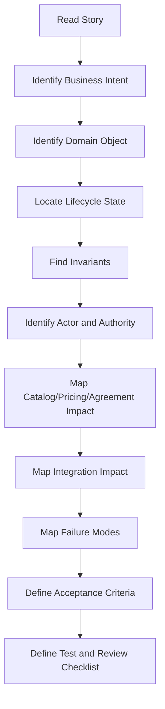
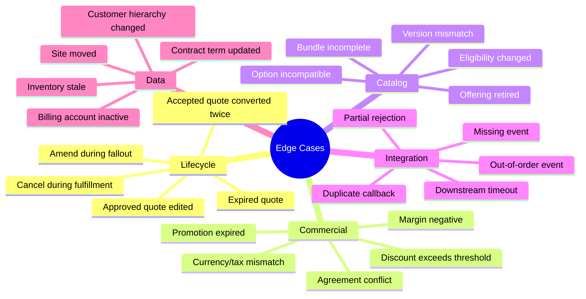
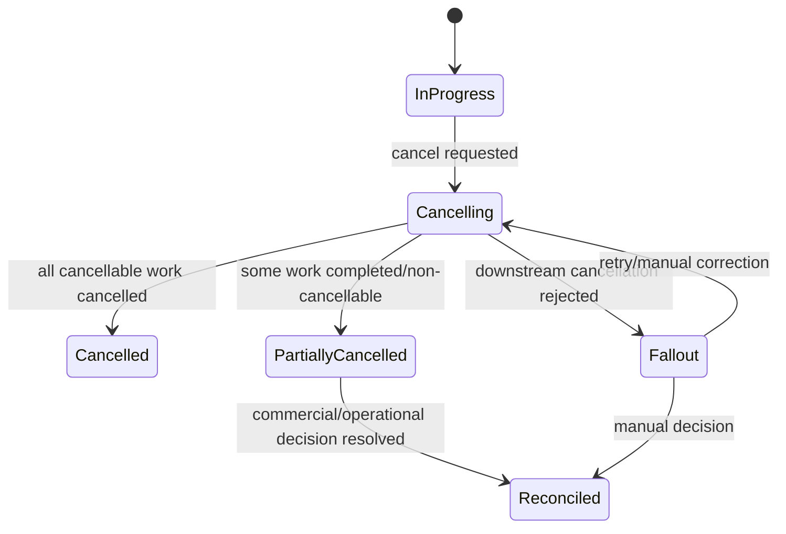

# Part 017 — Requirement and User Story Analysis

> Fokus part ini adalah mengubah cara membaca requirement dari “apa yang harus di-code?” menjadi “business behavior apa yang harus benar, pada state apa, dengan invariant apa, untuk actor siapa, terhadap downstream system mana, dan failure mode apa yang harus aman?”.

Di CPQ, quote management, order management, dan telco BSS/OSS, requirement jarang hanya berarti perubahan UI atau endpoint. Requirement biasanya menyentuh:

- lifecycle quote/order;
- pricing, discount, margin, approval;
- product catalog dan eligibility;
- customer/account/agreement;
- downstream fulfillment, billing, inventory, provisioning;
- auditability dan compliance;
- event contract dan integration behavior;
- operational recovery ketika ada fallout.

Senior engineer yang kuat secara domain tidak hanya bertanya:

```text
Endpoint apa yang perlu dibuat?
Table apa yang perlu ditambah?
Field apa yang perlu dikirim?
```

Pertanyaan yang lebih tepat:

```text
Business decision apa yang sedang dimodelkan?
State mana yang boleh berubah?
Invariant apa yang tidak boleh rusak?
Apakah perubahan ini aman terhadap quote revision, order amendment, cancellation, retry, dan reconciliation?
Apa dampaknya ke pricing, approval, downstream, billing, audit, dan reporting?
```

---

## 1. User Story Is a Compression, Not the Truth

User story adalah ringkasan kebutuhan, bukan seluruh domain rule.

Contoh user story:

```text
As a sales user,
I want to apply an additional discount to a quote,
so that I can offer a competitive price to the customer.
```

Kalau dibaca dangkal, story ini terlihat sederhana: tambah field discount, validasi angka, hitung total.

Tapi secara domain, story ini bisa menyentuh:

- apakah discount boleh di level quote atau line item;
- apakah discount boleh digabung dengan promotion;
- apakah discount memengaruhi recurring charge, one-time charge, usage charge, atau semua;
- apakah margin harus dihitung ulang;
- apakah approval perlu dipicu ulang;
- apakah quote yang sudah approved boleh diubah;
- apakah quote revision harus dibuat;
- apakah audit trail harus mencatat before/after;
- apakah customer-specific agreement membatasi discount;
- apakah order conversion boleh memakai discount tersebut;
- apakah downstream billing menerima discount structure yang sama.

### Prinsip dasar

```text
A user story describes intent.
A domain analysis discovers constraints.
Acceptance criteria must encode observable business correctness.
```

Kalau requirement hanya diterjemahkan ke field dan endpoint, banyak failure domain akan lolos.

---

## 2. Requirement Analysis Pipeline

Gunakan pipeline berikut setiap membaca requirement CPQ/order management.



### Step 1 — Identify business intent

Jangan mulai dari solution. Mulai dari alasan bisnis.

Pertanyaan:

- Masalah bisnis apa yang ingin diselesaikan?
- Apakah ini untuk sales speed, price accuracy, order reliability, compliance, customer experience, operational recovery, atau integration alignment?
- Apakah requirement ini mengubah business policy atau hanya presentation?
- Apakah requirement ini memperbaiki defect domain atau menambah capability baru?

Contoh:

```text
"Allow sales to revise an approved quote"
```

Business intent mungkin:

- memperbaiki quote tanpa membuat quote baru dari nol;
- menjaga audit trail terhadap approved commercial terms;
- memungkinkan perubahan selama quote belum accepted;
- mencegah sales mengubah approved quote secara silent.

### Step 2 — Identify domain object

Tentukan object utama dan object terdampak.

| Requirement says | Possible domain object |
|---|---|
| Apply discount | Quote, QuoteItem, Price, Discount, Approval |
| Cancel order | ProductOrder, OrderItem, FulfillmentTask, ServiceOrder |
| Validate product | ProductOffering, ProductSpecification, EligibilityRule |
| Add site | CustomerSite, ServiceAccount, QuoteItem, OrderItem |
| Use agreement price | Agreement, ContractTerm, PriceList, CustomerAccount |
| Retry failed fulfillment | OrderItem, Fallout, DownstreamRequest, ServiceOrder |

### Step 3 — Locate lifecycle state

Requirement harus dipetakan ke state.

Contoh untuk quote:

```text
Draft -> Configured -> Priced -> Submitted -> Approved -> Accepted -> Ordered
```

Pertanyaan:

- Requirement berlaku di state mana?
- Apakah berlaku sebelum atau sesudah approval?
- Apakah berlaku sebelum atau sesudah quote acceptance?
- Apakah berlaku setelah order dibuat?
- Apakah operasi ini boleh dilakukan pada terminal state?
- Apakah operasi ini perlu membuat revision baru?

### Step 4 — Find invariants

Invariant adalah kondisi yang harus tetap benar setelah operasi.

Contoh invariant:

- accepted quote tidak boleh berubah secara silent;
- order tidak boleh dibuat dua kali dari quote acceptance yang sama;
- total price harus konsisten dengan quote line items;
- approved price tidak boleh berubah tanpa reapproval;
- quote expiration harus dihormati saat acceptance;
- order cancellation tidak boleh membuat service/billing state ambigu;
- catalog version yang dipakai quote harus traceable;
- approval decision harus auditable.

### Step 5 — Identify actor and authority

Dalam enterprise CPQ, siapa yang melakukan aksi sering sama pentingnya dengan aksi itu sendiri.

Pertanyaan:

- Actor-nya sales user, manager, approver, back-office, system, customer portal, integration user, atau batch job?
- Apakah actor punya authority?
- Apakah authority berbeda berdasarkan discount level, customer segment, product, region, channel, atau agreement?
- Apakah delegated approval diperlukan?
- Apakah action system-generated harus dibedakan dari user action?

### Step 6 — Map domain impact

Setiap requirement perlu dicek dampaknya ke area domain berikut:

| Area | Question |
|---|---|
| Catalog | Apakah product offering/spec/version berubah atau perlu validasi ulang? |
| Pricing | Apakah price harus dihitung ulang? |
| Discount | Apakah stacking/override diperbolehkan? |
| Margin | Apakah profitability berubah? |
| Approval | Apakah approval existing masih valid? |
| Agreement | Apakah customer-specific terms berlaku? |
| Quote | Apakah quote perlu revision/version baru? |
| Order | Apakah order conversion/decomposition terdampak? |
| Fulfillment | Apakah downstream task/service order berubah? |
| Billing | Apakah charge/activation/discount structure compatible? |
| Audit | Apakah before/after dan decision trail harus dicatat? |
| Reporting | Apakah metric/pipeline membutuhkan field/state baru? |

---

## 3. Requirement Smell: Tanda Story Lemah

Requirement yang lemah biasanya punya sinyal tertentu.

### Smell 1 — UI-only wording

```text
Add a button to resubmit failed order.
```

Masalah: tidak menjelaskan domain behavior.

Pertanyaan domain:

- Failed order state apa yang boleh di-resubmit?
- Apakah semua order item di-resubmit atau hanya failed item?
- Apakah downstream request harus idempotent?
- Apakah resubmit membuat attempt baru?
- Apakah harus ada audit trail?
- Apakah manual approval dibutuhkan?

### Smell 2 — “Update status” without transition rule

```text
Allow user to update order status to completed.
```

Masalah: status bukan sekadar field; status adalah lifecycle fact.

Pertanyaan domain:

- Siapa yang boleh menyatakan order completed?
- Apakah semua order item harus completed?
- Apakah billing activation sudah sukses?
- Apakah downstream inventory sudah updated?
- Apakah completed bisa dibatalkan?
- Apakah completion event harus diterbitkan?

### Smell 3 — “Recalculate price” without price authority

```text
Recalculate quote price when user changes product configuration.
```

Pertanyaan domain:

- Apakah recalculation memakai current catalog price atau frozen quote price?
- Apakah manual override dipertahankan atau dihapus?
- Apakah approval harus reset?
- Apakah expired promotion masih boleh dipakai?
- Apakah customer agreement price berubah?
- Apakah audit harus mencatat old/new price?

### Smell 4 — “Allow edit” without immutability rule

```text
Allow editing approved quote.
```

Pertanyaan domain:

- Edit apa yang boleh?
- Apakah edit membuat revision?
- Apakah approved quote lama tetap tersimpan?
- Apakah approval lama invalidated?
- Apakah customer sudah menerima quote lama?
- Apakah order sudah dibuat?

### Smell 5 — “Send event” without business fact

```text
Send an event when quote is changed.
```

Pertanyaan domain:

- Event ini merepresentasikan fakta bisnis apa?
- Apakah event dikirim untuk draft changes atau hanya submitted/approved/accepted?
- Apakah event payload harus berisi full snapshot atau delta?
- Apakah consumer butuh version?
- Apakah event duplicate-safe?
- Apakah event ordering penting?

---

## 4. Acceptance Criteria Must Encode Business Correctness

Acceptance criteria yang baik tidak hanya menyebut UI behavior. Ia harus menyebut observable domain behavior.

### Weak acceptance criteria

```text
Given a user edits a quote
When they click save
Then the quote is saved successfully
```

Ini terlalu lemah.

Tidak jelas:

- state quote;
- field apa yang diedit;
- apakah quote sudah approved;
- apakah pricing recalculated;
- apakah approval reset;
- apakah audit dibuat;
- apakah event diterbitkan;
- apakah invalid transition ditolak.

### Stronger acceptance criteria

```text
Given a quote is in Approved state
And the quote has not been accepted by the customer
When a sales user changes a price-impacting line item
Then the system creates a new quote revision
And the previous approved revision remains immutable
And the new revision returns to Priced state
And existing approval decision is not reused
And the change is recorded in audit history
And the quote cannot be converted to order until re-approved if approval thresholds are exceeded
```

Ini lebih baik karena menyebut:

- state;
- guard;
- transition;
- immutability;
- approval impact;
- audit;
- order conversion guard.

### Acceptance criteria pattern

Gunakan format berikut:

```text
Given <domain object> is in <state>
And <business precondition>
When <actor/system> performs <action>
Then <state transition/business result> happens
And <invariant> remains true
And <side effect/event/audit/integration> happens if required
And <forbidden behavior> does not happen
```

Contoh tambahan:

```text
Given a quote has expired
When a user attempts to accept the quote
Then the system rejects the acceptance
And no product order is created
And the rejection reason is recorded as quote expired
And no order-created event is published
```

---

## 5. Converting Business Rule Into Technical Invariant

Business rule sering datang dalam bahasa natural.

Contoh:

```text
Sales should not be able to submit a quote with invalid product combinations.
```

Ubah menjadi invariant:

```text
A quote cannot transition from Configured/Priced to Submitted unless all quote items satisfy catalog compatibility and eligibility rules for the customer, site, channel, and effective catalog version.
```

Lalu turunkan ke design/test:

| Layer | Implication |
|---|---|
| API | Submit quote harus bisa return domain validation errors |
| Domain | Transition guard harus mengecek compatibility/eligibility |
| Database | Quote harus menyimpan validated configuration atau reference validation result |
| Event | QuoteSubmitted tidak boleh published jika invalid |
| UI | User harus melihat reason yang actionable |
| Test | Invalid product combination tidak boleh masuk Submitted |
| Operations | Validation failure harus bisa dianalisis tanpa stack trace-only error |

### Another example

Business rule:

```text
Orders must not be created twice for the same accepted quote.
```

Invariant:

```text
For a given accepted quote revision, at most one active product order may be created unless the business explicitly supports multiple orders from the same quote and tracks the split relationship.
```

Design implications:

- quote revision ID harus menjadi part of idempotency/business key;
- order creation harus atomic terhadap quote acceptance/order link;
- duplicate submit harus return existing order or reject safely;
- event replay tidak boleh membuat order baru;
- audit harus menunjukkan attempt duplicate.

---

## 6. Lifecycle Impact Analysis

Setiap requirement harus dicek terhadap lifecycle.

### Quote lifecycle impact questions

| State | Questions |
|---|---|
| Draft | Apakah user bebas edit? Apakah validation soft atau hard? |
| Configured | Apakah configuration complete? Apakah eligibility sudah dicek? |
| Priced | Apakah price frozen? Apakah price bisa expire? |
| Submitted | Apakah edit dilarang? Apakah approval sedang berjalan? |
| Approved | Apakah boleh direvisi? Apakah approval reusable? |
| Accepted | Apakah immutable? Apakah order harus dibuat? |
| Ordered | Apakah quote hanya reference? Apakah bisa amend melalui order? |
| Expired | Apakah bisa reprice/reopen/revise? |
| Rejected | Apakah bisa resubmit? Dengan revision atau same quote? |

### Order lifecycle impact questions

| State | Questions |
|---|---|
| Captured | Apakah order valid tapi belum decomposed? |
| Validated | Apakah catalog/customer/agreement sudah final? |
| Decomposed | Apakah order item dependency sudah dibuat? |
| In Progress | Apakah amend/cancel boleh? |
| Fallout | Apakah manual intervention atau retry? |
| Partially Completed | Apakah billing boleh partial? |
| Completed | Apakah terminal? Apakah reconciliation masih mungkin? |
| Cancelled | Apakah cancellation propagated downstream? |
| Failed | Apakah recoverable atau terminal? |

### Lifecycle impact matrix

Gunakan matriks seperti ini dalam story grooming:

| Requirement | Quote impact | Order impact | Fulfillment impact | Billing impact | Audit impact |
|---|---|---|---|---|---|
| Edit approved quote | Revision, approval reset | Conversion guard | None until accepted | None until ordered | Required |
| Cancel in-flight order | None | State transition/cancel request | Cancel downstream task | Stop/prevent activation | Required |
| Retry failed item | None | Attempt state | Re-send service order | Maybe none | Required |
| Reprice expired quote | Expired -> revision/priced | Prevent old order conversion | None | None | Required |
| Apply agreement pricing | Price calculation | Order carries terms | Billing must understand terms | Charge terms | Required |

---

## 7. Edge Case Discovery

Edge cases di CPQ/order management biasanya muncul dari kombinasi lifecycle, commercial rule, integration, dan concurrency.

### Edge case categories



### How to discover edge cases

Gunakan teknik berikut:

1. **State inversion** — coba action di semua state, bukan hanya happy path.
2. **Time shift** — apa yang terjadi kalau quote expired, catalog berubah, agreement diperbarui, promotion berakhir?
3. **Duplicate action** — apa yang terjadi kalau user klik dua kali, event replay, retry job berjalan ulang?
4. **Concurrent action** — apa yang terjadi kalau cancel dan fulfill terjadi bersamaan?
5. **Partial success** — apa yang terjadi kalau satu order item sukses dan item lain gagal?
6. **Authority variation** — apa yang terjadi jika actor tidak punya approval authority?
7. **External rejection** — apa yang terjadi jika downstream menolak karena data tidak feasible?
8. **Version drift** — apa yang terjadi jika API/event consumer masih memakai versi lama?

### Edge case example: duplicate quote acceptance

Requirement:

```text
As a sales user, I want to accept a quote and generate an order.
```

Edge cases:

- user double-clicks accept;
- browser retries request;
- API gateway retries;
- event consumer receives duplicate QuoteAccepted;
- first order creation succeeds but response times out;
- second attempt tries again;
- order-created event is replayed;
- quote acceptance and order creation are not atomically linked.

Expected invariant:

```text
A single accepted quote revision must not produce duplicate active product orders.
```

Acceptance criteria should include duplicate safety.

---

## 8. Integration Impact Analysis

Requirement yang terlihat lokal sering berdampak ke integrasi.

### Integration questions

- Apakah perubahan field harus masuk API contract?
- Apakah event schema berubah?
- Apakah downstream billing/provisioning/inventory membutuhkan field baru?
- Apakah consumer lama akan rusak?
- Apakah field baru optional, mandatory, derived, atau customer-specific?
- Apakah mapping ke TM Forum-style resources berubah?
- Apakah ada correlation ID/business key untuk traceability?
- Apakah retry/replay akan tetap aman?
- Apakah reconciliation perlu update?

### Example: adding order cancellation reason

Kelihatannya sederhana:

```text
Add cancellation reason to order cancellation.
```

Domain questions:

- Apakah reason mandatory?
- Apakah reason taxonomy fixed atau free text?
- Apakah reason berbeda untuk customer cancellation, feasibility failure, duplicate order, commercial issue, fraud, billing issue?
- Apakah reason perlu diteruskan ke downstream service ordering?
- Apakah reason memengaruhi charge/penalty?
- Apakah reason muncul di reporting?
- Apakah reason perlu audit?
- Apakah existing cancelled orders punya null reason?
- Apakah cancellation event schema berubah?

### Integration impact map

| Change | API impact | Event impact | Downstream impact | Data impact | Ops impact |
|---|---|---|---|---|---|
| Add cancellation reason | Request/response field | Cancellation event field | Service order cancel reason | nullable/backfill | dashboard/reporting |
| Add approval override | Quote API | Approval event | None or CRM/BI | audit table | compliance investigation |
| Add site eligibility | Quote validation API | Validation failed event maybe | Serviceability system | cache/reference data | failure dashboard |
| Add order retry | Action API | Retry attempt event | Re-send downstream | attempt history | fallout queue |

---

## 9. Audit and Reporting Impact

Banyak requirement gagal bukan karena fungsi utama salah, tetapi karena audit/reporting tidak dipikirkan.

### Audit questions

- Siapa melakukan action?
- Kapan action terjadi?
- Object apa yang berubah?
- State sebelum dan sesudah apa?
- Business reason apa?
- Approval decision apa?
- Price before/after apa?
- Apakah perubahan customer-visible?
- Apakah external system menerima perubahan?
- Apakah action system-generated atau user-generated?

### Reporting questions

- Apakah perubahan ini memengaruhi sales pipeline?
- Apakah status baru harus muncul di operational dashboard?
- Apakah fallout reason baru harus di-report?
- Apakah approval cycle time berubah?
- Apakah quote conversion rate terdampak?
- Apakah order completion SLA terdampak?
- Apakah billing activation success rate terdampak?

### Example: approval rejected

Acceptance criteria tidak cukup mengatakan:

```text
Then quote is rejected.
```

Harus jelas:

- apakah quote state menjadi Rejected atau ApprovalRejected;
- apakah quote bisa direvisi;
- apakah rejection reason mandatory;
- apakah approver identity tercatat;
- apakah sales user mendapat actionable message;
- apakah notification/event diterbitkan;
- apakah reporting approval rejection reason terisi.

---

## 10. Requirement Question Bank

Gunakan pertanyaan ini saat grooming atau refinement.

### Questions for Product Owner

- Business outcome apa yang ingin dicapai?
- Customer/user pain apa yang sedang diselesaikan?
- Apakah requirement ini berlaku untuk semua customer/tenant/deployment atau hanya skenario tertentu?
- Apakah ada contractual/commercial implication?
- Apakah ada reporting/SLA/compliance expectation?
- Apa contoh real customer scenario?
- Apa yang lebih penting: speed, correctness, auditability, configurability, atau operational recovery?

### Questions for Business Analyst

- State apa saja yang terlibat?
- Rule lengkapnya seperti apa?
- Apa exception dari rule ini?
- Apa negative scenario yang harus ditolak?
- Apa reason/error message yang harus ditampilkan?
- Apakah ada data dependency dari catalog, agreement, customer, site, inventory, atau billing?
- Apakah ada existing process manual yang sedang diotomasi?

### Questions for Solution Architect

- Sistem mana saja yang terdampak?
- Apakah API/event contract berubah?
- Apakah ada canonical model atau TMF mapping yang harus dijaga?
- Apakah downstream support capability ini?
- Apakah extension/customer-specific behavior diperlukan?
- Apakah ada backward compatibility constraint?
- Apakah deployment mode tertentu memengaruhi behavior?

### Questions for Senior Engineer

- Di mana rule seharusnya tinggal?
- Apa invariant yang harus dijaga?
- Apa race condition yang mungkin terjadi?
- Apa risiko data migration?
- Apa test paling penting?
- Apa failure mode paling mahal?
- Apa observability yang dibutuhkan?
- Apa existing bug/incident yang mirip?

---

## 11. How to Challenge Requirement Safely

Senior engineer harus bisa menantang requirement tanpa terlihat menghambat.

Buruk:

```text
This requirement is unclear.
```

Lebih baik:

```text
I think the implementation depends on which lifecycle states this applies to. If the quote is Draft, direct edit seems safe. If it is Approved, direct edit may break approval auditability unless we create a new revision and reset approval. Can we confirm the expected behavior for Approved and Accepted quotes?
```

Buruk:

```text
This will break downstream.
```

Lebih baik:

```text
This change adds a new cancellation reason. We should confirm whether the downstream service order API accepts this reason or whether we need a mapping layer. Otherwise the order may cancel locally while downstream cancellation fails or loses reason fidelity.
```

Buruk:

```text
We need more requirements.
```

Lebih baik:

```text
Before implementation, we need three decisions: which quote states allow the action, whether approval is invalidated, and whether an audit record is mandatory. Without these, two engineers could implement different but plausible behaviors.
```

### Safe challenge pattern

```text
The open domain decision is <decision>.
If we choose <option A>, consequence is <impact>.
If we choose <option B>, consequence is <impact>.
My recommendation is <recommendation> because it preserves <invariant/business outcome>.
```

---

## 12. Worked Example — Edit Approved Quote

### Requirement

```text
As a sales user, I want to edit an approved quote so that I can correct mistakes before sending it to the customer.
```

### Naive interpretation

- allow edit fields;
- save changes;
- keep status approved.

This is dangerous.

### Domain analysis

Affected objects:

- Quote;
- QuoteRevision;
- QuoteItem;
- Price;
- ApprovalDecision;
- AuditHistory.

Lifecycle states:

- Approved;
- possibly Accepted;
- possibly Ordered.

Key invariants:

- approved commercial terms must be auditable;
- approval decision applies to a specific quote version/content;
- price-impacting changes must not silently reuse old approval;
- accepted quote should not be mutated if customer has accepted it;
- ordered quote should remain a historical source of truth.

### Domain questions

- Is this allowed only before customer acceptance?
- Does every edit create a new revision?
- Are non-commercial edits treated differently from commercial edits?
- Does price recalculation happen automatically?
- Does approval reset for all edits or only threshold-impacting edits?
- What happens to quote document already sent to customer?
- Is old approval still visible?

### Better acceptance criteria

```text
Given a quote is Approved but not Accepted
When a sales user changes a price-impacting field
Then a new quote revision is created
And the previous approved revision remains immutable
And the new revision is moved to Priced or Draft according to validation completeness
And approval is required again if approval thresholds are exceeded
And the edit is recorded in audit history
And the previous approved quote document remains traceable
```

### Test scenarios

| Scenario | Expected result |
|---|---|
| Edit draft quote | Save normally, maybe revalidate/reprice |
| Edit approved quote price | New revision, approval invalidated |
| Edit approved quote typo only | Depends on business decision, must be explicit |
| Edit accepted quote | Reject or create amendment flow, not silent edit |
| Edit ordered quote | Reject direct mutation |
| Duplicate edit submit | One revision or deterministic conflict |

---

## 13. Worked Example — Cancel In-Flight Order

### Requirement

```text
As an operations user, I want to cancel an order that is in progress.
```

### Domain complexity

An in-flight order may already have:

- decomposed order items;
- service order created;
- provisioning started;
- inventory reserved;
- billing activation scheduled;
- partial item completion;
- downstream tasks in non-cancellable state.

### Domain questions

- Which order states allow cancellation?
- Is cancellation all-or-nothing or item-level?
- What if one item already completed?
- What if downstream refuses cancellation?
- Does cancellation require reason?
- Is cancellation customer-requested, system-triggered, or operations-triggered?
- Does cancellation create charges/penalties?
- What events are emitted?
- Does order become Cancelling before Cancelled?

### Better lifecycle



### Invariants

- completed service must not disappear silently;
- cancellation must be propagated or reconciled downstream;
- billing must not activate cancelled service accidentally;
- cancellation reason and actor must be auditable;
- partial cancellation must be explicit, not hidden as success;
- retrying cancellation must not duplicate downstream cancel requests unsafely.

---

## 14. Worked Example — Reprice Quote After Catalog Change

### Requirement

```text
When catalog price changes, update quote price.
```

This is dangerously ambiguous.

### Domain questions

- Does this affect draft quotes only?
- Does this affect submitted quotes?
- Does this affect approved quotes?
- Does this affect accepted quotes?
- Are quotes price-frozen after submission?
- Do quotes have price validity date?
- Is there a grace period?
- What if promotion expired?
- What if customer agreement guarantees old price?
- Does reprice require user action or batch job?
- Does reprice trigger approval again?

### Possible policies

| Policy | Meaning | Risk |
|---|---|---|
| Always reprice | Quotes reflect current catalog | Breaks commercial commitment |
| Reprice draft only | Safe for uncommitted quotes | Draft can drift unexpectedly |
| Freeze after submit | Protects sales process | Stale prices may persist |
| Freeze after approval | Approval applies to fixed price | Submitted quote may change |
| Use validity date | Commercially explicit | Requires accurate validity modelling |
| Manual reprice action | User controls change | More operational friction |

### Strong invariant

```text
A customer-visible or approved quote must not change commercial terms automatically unless the product policy explicitly allows it and the change is auditable.
```

---

## 15. Turning Requirement Into Test Matrix

Untuk requirement domain-heavy, jangan hanya tulis unit test berdasarkan method. Buat test matrix berdasarkan lifecycle dan invariant.

Example: quote discount change.

| Quote State | Actor | Discount Type | Expected Behavior |
|---|---|---|---|
| Draft | Sales | within authority | save, reprice |
| Draft | Sales | exceeds authority | save but requires approval / block submit |
| Submitted | Sales | any | reject edit or create revision |
| Approved | Sales | non-price-impacting | explicit policy required |
| Approved | Sales | price-impacting | create revision, reset approval |
| Accepted | Sales | any | reject direct edit |
| Expired | Sales | any | require revision/reopen/reprice |

Example: order retry.

| Order State | Failed Component | Retry Allowed? | Expected Behavior |
|---|---|---|---|
| Fallout | downstream timeout | yes | new attempt, same business key |
| Fallout | invalid service data | no automatic retry | manual correction required |
| Completed | any | no | reject retry |
| Cancelled | any | no | reject retry |
| Partially Completed | failed item only | maybe | retry only failed item if dependency allows |

---

## 16. Requirement Review Checklist

Use this checklist before accepting a story into implementation.

### Business clarity

- [ ] Business outcome is clear.
- [ ] Actor/user/system is clear.
- [ ] Object being changed is clear.
- [ ] Customer scenario is available.
- [ ] Requirement is not only UI wording.

### Lifecycle clarity

- [ ] Applicable states are listed.
- [ ] Forbidden states are listed.
- [ ] State transitions are defined.
- [ ] Terminal states are respected.
- [ ] Revision/amend/cancel behavior is explicit.

### Rule clarity

- [ ] Catalog impact is known.
- [ ] Pricing impact is known.
- [ ] Discount/margin impact is known.
- [ ] Approval impact is known.
- [ ] Agreement/customer-specific terms are considered.

### Integration clarity

- [ ] API contract impact is known.
- [ ] Event contract impact is known.
- [ ] Downstream systems are identified.
- [ ] Retry/idempotency behavior is known.
- [ ] Reconciliation behavior is known.

### Audit/operations clarity

- [ ] Audit trail requirement is explicit.
- [ ] Error/fallout behavior is explicit.
- [ ] Operational ownership is known.
- [ ] Monitoring/reporting impact is known.
- [ ] Support troubleshooting data is available.

### Testability

- [ ] Happy path is testable.
- [ ] Negative path is testable.
- [ ] Edge cases are identified.
- [ ] Concurrency/duplicate action is considered.
- [ ] Regression scenarios are listed.

---

## 17. Internal Verification Checklist

Saat onboarding di CSG Quote & Order, verifikasi hal-hal berikut. Jangan asumsikan dari konsep industri umum.

### Requirement and backlog process

- [ ] Bagaimana user story ditulis: domain-heavy, UI-heavy, API-heavy, atau implementation-heavy?
- [ ] Apakah acceptance criteria biasanya menyebut lifecycle state?
- [ ] Apakah BA/PO menyediakan business rule detail terpisah?
- [ ] Apakah edge case dan negative scenario dicatat di story?
- [ ] Apakah customer-specific behavior diberi label jelas?

### Domain references

- [ ] Di mana domain glossary resmi?
- [ ] Di mana quote/order state transition didokumentasikan?
- [ ] Di mana pricing/approval rule didokumentasikan?
- [ ] Di mana catalog eligibility/compatibility rule didokumentasikan?
- [ ] Di mana TM Forum/API alignment didokumentasikan jika ada?

### Engineering artifacts

- [ ] Apakah PR template memiliki domain checklist?
- [ ] Apakah design doc template memiliki lifecycle/invariant section?
- [ ] Apakah test plan mencakup failure/fallout scenario?
- [ ] Apakah event catalog mencatat business meaning?
- [ ] Apakah observability dashboard dikaitkan dengan business state?

### People to ask

- [ ] PO: real customer scenario dan business priority.
- [ ] BA: detailed rule, exceptions, examples.
- [ ] Solution architect: integration and deployment variability.
- [ ] Senior engineer: invariant, race, legacy behavior.
- [ ] Support/operations: common fallout and production pain.

---

## 18. How This Part Should Change Your Behavior

Sebelum part ini, engineer sering membaca story seperti ini:

```text
Need to implement X.
```

Setelah part ini, baca seperti ini:

```text
This story proposes a business behavior change.
I need to identify the object, state, actor, invariant, rule, integration, failure mode, and audit impact.
Only then can I judge whether the implementation is correct.
```

Dalam CPQ/order management, seniority terlihat dari kemampuan menemukan missing domain decisions sebelum code ditulis.

---

## 19. Practical Exercises

Gunakan latihan berikut dengan backlog internal atau story lama.

### Exercise 1 — Rewrite weak AC

Ambil satu acceptance criteria yang UI-centric. Rewrite menjadi lifecycle-aware AC dengan format:

```text
Given <state/precondition>
When <action>
Then <business result>
And <invariant>
And <side effect>
And <forbidden behavior>
```

### Exercise 2 — Build impact matrix

Untuk satu story pricing/quote/order, isi matrix:

| Area | Impact | Unknown | Owner to ask |
|---|---|---|---|
| Catalog |  |  |  |
| Pricing |  |  |  |
| Approval |  |  |  |
| Quote lifecycle |  |  |  |
| Order lifecycle |  |  |  |
| Downstream |  |  |  |
| Audit |  |  |  |
| Reporting |  |  |  |

### Exercise 3 — Find missing negative scenarios

Untuk satu story, tulis minimal 10 negative scenarios:

- wrong state;
- expired object;
- duplicate request;
- unauthorized actor;
- invalid catalog version;
- price mismatch;
- downstream timeout;
- partial failure;
- missing event;
- concurrent update.

### Exercise 4 — Ask better questions

Ambil satu requirement ambigu. Tulis 5 pertanyaan ke PO/BA/architect dalam format:

```text
The open decision is...
The risk if unspecified is...
The options are...
My recommendation is...
```

---

## 20. Summary

Requirement analysis di CPQ/order management bukan proses administratif. Ini adalah aktivitas domain modelling.

Yang harus dijaga:

- user story adalah compression, bukan truth;
- acceptance criteria harus encode business correctness;
- setiap requirement perlu dipetakan ke state, actor, invariant, rule, integration, failure mode, audit, dan reporting;
- requirement yang terlihat sederhana sering menyentuh pricing, approval, agreement, catalog, order conversion, fulfillment, dan billing;
- senior engineer harus menantang ambiguity dengan alternatif dan konsekuensi, bukan hanya mengatakan “kurang jelas”.

Prinsip terakhir:

```text
A good requirement tells you what users want.
A good domain analysis tells you what must remain true.
```
