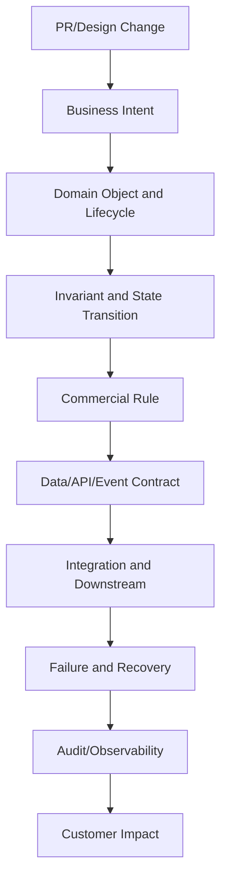
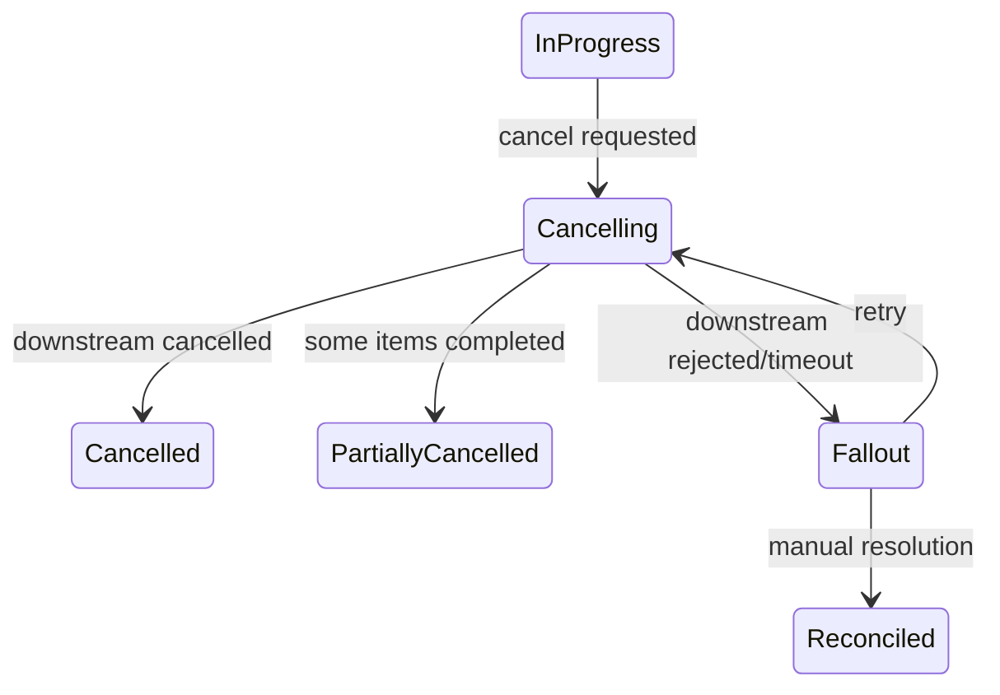
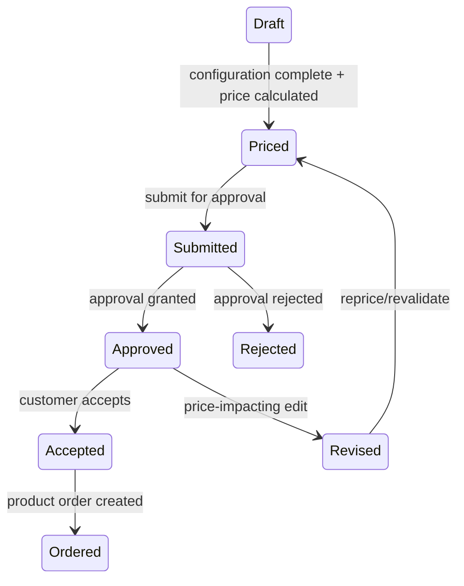

# Part 018 — Domain-Aware PR and Design Review

> Fokus part ini adalah kemampuan senior engineer untuk mereview perubahan bukan hanya dari sisi code quality, tetapi dari sisi **business correctness**. Dalam CPQ/order management, PR yang clean secara teknis tetap bisa salah jika merusak lifecycle, pricing invariant, approval auditability, quote immutability, order decomposition, event contract, atau recovery behavior.

Di domain enterprise CPQ dan telco order management, review yang hanya melihat style, naming, null handling, dan test coverage tidak cukup.

Senior engineer perlu bertanya:

```text
Apakah perubahan ini benar secara bisnis?
Apakah state transition-nya legal?
Apakah invariant lifecycle tetap terjaga?
Apakah pricing/approval/audit tetap defensible?
Apakah event/API contract tetap compatible?
Apakah downstream behavior tetap aman?
Apakah failure dan recovery path jelas?
Apakah customer impact dipahami?
```

PR/design review adalah titik terakhir untuk mencegah domain bug sebelum masuk production.

---

## 1. What Makes CPQ/Order PR Review Different

Pada banyak aplikasi CRUD, review bisa fokus pada:

- correctness function;
- validation;
- database query;
- performance;
- readability;
- error handling.

Pada CPQ/order management, review juga harus fokus pada:

- state transition legality;
- lifecycle immutability;
- commercial correctness;
- approval authority;
- quote/order versioning;
- catalog version traceability;
- duplicate prevention;
- idempotency as business safety;
- downstream consistency;
- audit trail;
- reporting impact;
- customer-specific behavior;
- migration of historical business records.

Contoh: perubahan kecil pada field `discountAmount` bisa berdampak pada:

- margin threshold;
- approval requirement;
- quote document;
- order conversion;
- billing charge mapping;
- revenue reporting;
- audit/compliance.

Jadi PR review harus membaca code sebagai **business behavior diff**.

---

## 2. Review Layers

Gunakan layer review berikut.



### Layer 1 — Business intent

- Masalah bisnis apa yang diselesaikan?
- Apakah PR sesuai dengan user story?
- Apakah ada behavior tersembunyi yang tidak disebut AC?
- Apakah code mengubah policy bisnis atau hanya implementation detail?

### Layer 2 — Domain object and lifecycle

- Object utama apa yang berubah?
- State mana yang boleh berubah?
- Apakah PR mengubah terminal state?
- Apakah PR memperkenalkan state baru?
- Apakah transition table perlu update?

### Layer 3 — Invariant

- Invariant apa yang harus tetap benar?
- Apakah PR menegakkan invariant di boundary yang benar?
- Apakah invariant bisa dilanggar melalui API lain, event replay, batch job, atau manual operation?

### Layer 4 — Commercial rule

- Apakah price, discount, margin, cost, approval, agreement terdampak?
- Apakah recalculation behavior eksplisit?
- Apakah approval lama masih valid setelah perubahan?
- Apakah commercial audit tetap lengkap?

### Layer 5 — Contract

- Apakah API backward compatible?
- Apakah event schema backward compatible?
- Apakah database migration aman untuk historical records?
- Apakah DTO/domain/persistence/event mapping masih konsisten?

### Layer 6 — Integration

- Apakah downstream system menerima behavior/data baru?
- Apakah retry/replay aman?
- Apakah correlation/business key tetap ada?
- Apakah reconciliation job perlu update?

### Layer 7 — Failure and recovery

- Apa yang terjadi jika downstream menolak?
- Apa yang terjadi jika request duplicate?
- Apa yang terjadi jika event missing/out-of-order?
- Apa yang terjadi jika cancellation/amendment race?
- Apa manual fallback-nya?

### Layer 8 — Audit and observability

- Apakah actor, timestamp, reason, old/new state tercatat?
- Apakah operational dashboard bisa melihat state baru/failure baru?
- Apakah support bisa troubleshoot tanpa membaca database langsung?

### Layer 9 — Customer impact

- Customer mana yang terdampak?
- Apakah behavior configurable per customer/deployment?
- Apakah historical quote/order berubah makna?
- Apakah release note atau migration communication diperlukan?

---

## 3. Domain Correctness Review

Domain correctness berarti code menjaga business truth.

### Questions

- Apakah object berada di state yang benar sebelum action?
- Apakah transition legal?
- Apakah business precondition dicek?
- Apakah forbidden action ditolak?
- Apakah side effect hanya terjadi setelah state valid?
- Apakah duplicate action aman?
- Apakah concurrent update aman?
- Apakah error dikembalikan sebagai domain error, bukan generic technical failure?

### Example: quote acceptance PR

Code terlihat benar:

```text
POST /quotes/{id}/accept
creates order
returns 201
```

Review domain:

- Apakah quote masih valid/not expired?
- Apakah quote revision adalah latest approved revision?
- Apakah quote sudah customer-accepted sebelumnya?
- Apakah accepted quote immutable?
- Apakah order duplicate dicegah?
- Apakah order link ke quote revision, bukan hanya quote ID?
- Apakah QuoteAccepted dan OrderCreated event sequence aman?
- Apakah failure setelah quote accepted tapi sebelum order created bisa direcover?

### Review comment example

```text
The current implementation creates an order after setting the quote to Accepted, but I do not see a guard preventing duplicate acceptance for the same quote revision. If this endpoint is retried after a timeout, it may create a second order. Can we enforce an invariant that one accepted quote revision maps to at most one active product order, ideally using a business key/idempotency guard?
```

---

## 4. State Transition Review

State bug adalah salah satu sumber defect paling mahal di order management.

### State transition review checklist

- [ ] Semua transition baru tercatat di state transition table.
- [ ] Transition memiliki guard condition.
- [ ] Illegal transition ditolak eksplisit.
- [ ] Terminal state tidak berubah tanpa rule khusus.
- [ ] Retryable state dibedakan dari failed terminal state.
- [ ] Manual intervention state memiliki ownership jelas.
- [ ] Side effect tidak terjadi sebelum transition valid.
- [ ] Audit mencatat transition.
- [ ] Event hanya dipublish untuk transition yang committed.
- [ ] Concurrent transition ditangani.

### Example: order cancellation

PR menambahkan:

```text
InProgress -> Cancelled
```

Review domain:

- Apakah perlu intermediate `Cancelling`?
- Apakah downstream cancel sudah sukses?
- Apakah partial completion mungkin?
- Apakah billing activation perlu dihentikan?
- Apakah cancellation bisa gagal?
- Apakah cancellation reason mandatory?
- Apakah event `OrderCancelled` hanya boleh dipublish setelah semua downstream cancel sukses?

Mungkin transition yang lebih benar:



### Review comment example

```text
Moving directly from InProgress to Cancelled may hide downstream cancellation failure. Since fulfillment may already have created service orders, should we introduce or reuse a Cancelling/Fallout state so the local order does not appear fully cancelled before downstream cancellation is confirmed?
```

---

## 5. Pricing Rule Review

Pricing PR harus dianggap high-risk secara domain.

### Pricing review questions

- Apakah charge type jelas: recurring, one-time, usage, adjustment?
- Apakah discount diterapkan di level yang benar: quote, line item, charge component?
- Apakah manual override dipertahankan saat reprice?
- Apakah promotion stacking diatur?
- Apakah agreement/customer-specific price diprioritaskan benar?
- Apakah price validity/expiration dihormati?
- Apakah tax/currency/context diperhitungkan jika relevan?
- Apakah rounding rule konsisten?
- Apakah margin/approval threshold dihitung ulang?
- Apakah before/after price diaudit?

### Price recalculation anti-pattern

```text
Every save recalculates all prices using current catalog.
```

Risiko:

- approved quote berubah diam-diam;
- promotion lama hilang;
- customer agreement price tertimpa;
- manual discount hilang;
- approval decision menjadi tidak valid;
- quote document tidak cocok dengan stored price;
- order conversion menghasilkan harga berbeda dari accepted quote.

### Safer review framing

```text
Which quote states are price mutable, and which states are price frozen?
```

### Review comment example

```text
This recalculates quote totals whenever a line item is saved, but the PR does not distinguish Draft/Priced quotes from Approved or Accepted quotes. For Approved quotes, automatic recalculation may change commercial terms after approval. Can we either restrict recalculation to mutable states or create a new revision and reset approval when price-impacting fields change?
```

---

## 6. Approval Rule Review

Approval logic adalah business authority model.

### Approval review questions

- Apa trigger approval?
- Apakah approval threshold berdasarkan discount, margin, total value, product, customer segment, region, atau agreement?
- Apakah approval berlaku untuk quote version tertentu?
- Apakah approval invalidated jika price/configuration berubah?
- Apakah approver authority dicek?
- Apakah delegated approval didukung?
- Apakah approval rejection reason wajib?
- Apakah approval decision auditable?
- Apakah approval event/schema mencerminkan decision?

### Approval invariant

```text
An approval decision must apply to a specific business content version, not to a mutable quote shell.
```

Kalau quote berubah setelah approval, approval lama tidak otomatis berlaku.

### Review comment example

```text
The PR stores approval status on the quote, but the approved commercial content can still change through line item updates. Should approval be associated with quote revision/version instead of the mutable quote aggregate, so we can prove which terms were actually approved?
```

---

## 7. Quote and Order Immutability Review

Immutability dalam CPQ bukan dogma teknis. Ini mekanisme defensibility.

### Quote immutability

Pertanyaan:

- Kapan quote menjadi immutable?
- Apakah approved quote immutable?
- Apakah accepted quote immutable?
- Apakah ordered quote immutable?
- Apakah revision dibuat untuk perubahan?
- Apakah old revision tetap accessible?
- Apakah quote document cocok dengan stored quote revision?

### Order immutability

Order tidak selalu immutable, tetapi historical intent harus tidak hilang.

Pertanyaan:

- Apakah order amendment membuat new version/action?
- Apakah original order item tetap traceable?
- Apakah cancel/modify/disconnect disimpan sebagai action, bukan overwrite?
- Apakah downstream task history tetap ada?
- Apakah completed order bisa diubah?

### Review comment example

```text
This update overwrites order item action from Add to Modify. That may lose the original commercial intent of the order. Should amendment be represented as a new order item/action or version so the original order remains auditable?
```

---

## 8. Auditability Review

Auditability bukan fitur opsional di commercial lifecycle.

### Audit fields to check

- actor/user/system;
- timestamp;
- reason;
- old value;
- new value;
- old state;
- new state;
- source channel;
- correlation ID;
- approval decision;
- external reference;
- quote/order revision;
- catalog version;
- price calculation version or context.

### Changes that almost always require audit

- price override;
- discount change;
- approval/rejection;
- quote revision;
- quote acceptance;
- order creation;
- order cancellation;
- order amendment;
- manual fallout resolution;
- retry after failure;
- customer/account/agreement selection change;
- catalog version override.

### Review comment example

```text
This allows operations users to manually mark a fallout item as resolved, but I do not see actor, reason, previous state, or resolution note being persisted. Since this changes the business lifecycle manually, we should capture an audit record to support supportability and later incident analysis.
```

---

## 9. API Contract Review

API review bukan hanya schema shape. Ia adalah behavior contract.

### API review questions

- Apakah endpoint action-oriented atau resource mutation biasa?
- Apakah domain errors eksplisit?
- Apakah status code cukup mewakili business failure?
- Apakah field baru optional atau mandatory?
- Apakah enum baru backward compatible?
- Apakah existing clients akan break?
- Apakah idempotency key diperlukan?
- Apakah response mengembalikan state terbaru?
- Apakah API bisa membedakan validation failure vs lifecycle conflict vs authorization failure?

### Example domain error mapping

| Situation | Bad response | Better response |
|---|---|---|
| Expired quote accepted | 500 | 409 lifecycle conflict / domain error QUOTE_EXPIRED |
| Invalid product combo | 500 | 422 validation error with incompatible items |
| Discount exceeds authority | 400 generic | 403/422 with approval required/authority exceeded |
| Duplicate order create | 201 new order | 200 existing order or 409 duplicate business key |
| Downstream rejection | 500 | order fallout state + actionable reason |

### Review comment example

```text
The endpoint returns 500 when quote acceptance is attempted for an expired quote. Since this is an expected business conflict, can we return a domain-specific error and ensure no order creation/event publication happens?
```

---

## 10. Event Compatibility Review

Event schema adalah business contract lintas sistem.

### Event review questions

- Event merepresentasikan business fact apa?
- Apakah nama event jelas: command-like atau fact-like?
- Apakah event dipublish setelah commit?
- Apakah event duplicate-safe?
- Apakah event order penting?
- Apakah event berisi business key/correlation ID?
- Apakah schema evolution backward compatible?
- Apakah consumer lama bisa mengabaikan field baru?
- Apakah enum baru akan merusak consumer?
- Apakah replay akan aman?

### Bad event names

```text
ProcessQuote
UpdateOrder
SendToBilling
```

Nama tersebut terdengar seperti command.

### Better event names

```text
QuoteSubmitted
QuoteApproved
QuoteAccepted
ProductOrderCreated
OrderCancellationRequested
OrderItemFulfillmentFailed
OrderCompleted
```

### Event review comment example

```text
The new event OrderUpdated is too broad for consumers to reason about. Since this change specifically represents a cancellation request, can we publish a more explicit domain event such as OrderCancellationRequested with order ID, reason, actor, state, and correlation ID?
```

---

## 11. Data Migration Domain Risk

Data migration di CPQ/order systems berbahaya karena historical records punya makna bisnis.

### Migration review questions

- Apakah field baru mandatory untuk historical data?
- Apa default value-nya secara domain?
- Apakah default value bisa menyesatkan reporting?
- Apakah historical quote/order boleh diubah?
- Apakah migration mengubah state meaning?
- Apakah migration memengaruhi audit trail?
- Apakah external references tetap valid?
- Apakah rollback aman secara domain?
- Apakah migration perlu customer-by-customer strategy?

### Example: adding `cancellationReason`

Bad migration:

```text
Set cancellationReason = 'CUSTOMER_REQUEST' for all existing cancelled orders.
```

Masalah: ini mengarang alasan bisnis.

Better:

```text
Set cancellationReason = 'UNKNOWN_LEGACY' or null with explicit reporting handling.
```

### Review comment example

```text
Backfilling all historical cancelled orders with CUSTOMER_REQUEST may create false business reporting. Since we do not know the actual reason for legacy records, can we use UNKNOWN_LEGACY and make reporting handle it explicitly?
```

---

## 12. Customer-Impact Assessment

Setiap perubahan domain perlu dinilai dampaknya ke customer.

### Impact dimensions

| Dimension | Questions |
|---|---|
| Behavior | Apakah user akan melihat behavior berbeda? |
| Commercial | Apakah price/discount/approval berubah? |
| Contractual | Apakah agreement/customer terms terdampak? |
| Operational | Apakah support/fallout process berubah? |
| Integration | Apakah customer/external integration perlu adaptasi? |
| Reporting | Apakah customer reports/dashboard berubah? |
| Migration | Apakah historical data berubah makna? |
| Deployment | Apakah behavior sama untuk cloud/on-prem/customer-specific setup? |

### Review comment example

```text
This changes default quote expiration from 30 to 14 days. Do we know whether this is global, customer-configurable, or customer-specific? It may affect active sales pipelines and quote acceptance behavior, so we should confirm rollout and migration expectations.
```

---

## 13. Regression Scenario Review

Domain PR harus punya regression scenario yang berbasis lifecycle, bukan hanya method-level coverage.

### Regression matrix example — quote pricing change

| Scenario | Expected |
|---|---|
| Draft quote repriced | Price updates |
| Submitted quote repriced | Explicit policy: reject or revision |
| Approved quote price-impacting edit | Approval invalidated/new revision |
| Accepted quote edit | Reject direct edit |
| Expired quote acceptance | Reject, no order |
| Discount exceeds threshold | Approval required |
| Agreement price applies | Customer-specific price used |
| Promotion expired | Rule-specific behavior |
| Duplicate submit | No duplicate quote submission |

### Regression matrix example — order cancellation

| Scenario | Expected |
|---|---|
| Captured order cancelled | Cancelled safely |
| In-progress order cancelled | Cancelling/Fallout path |
| Completed order cancelled | Reject or return business conflict |
| Partial fulfillment cancellation | Partial/compensation path |
| Downstream cancel timeout | Retry/fallout |
| Duplicate cancel request | Idempotent result |
| Cancel then complete race | Deterministic resolution |
| Billing already activated | Reversal/compensation required |

### Review comment example

```text
The tests cover cancelling a captured order, but not in-progress or partially fulfilled orders. Since cancellation behavior differs once downstream work starts, can we add regression cases for downstream rejection, duplicate cancel request, and completed-order conflict?
```

---

## 14. Observability and Supportability Review

Production correctness membutuhkan visibility.

### Observability questions

- Apakah state baru muncul di dashboard?
- Apakah failure reason searchable?
- Apakah correlation ID tersedia dari quote sampai order sampai downstream?
- Apakah support bisa melihat current lifecycle state?
- Apakah manual fallout queue mendapat data cukup?
- Apakah metric berubah?
- Apakah alert perlu update?
- Apakah runbook perlu update?

### Useful domain metrics

- quote submission failure rate;
- approval cycle time;
- quote expiration rate;
- quote-to-order conversion failure rate;
- duplicate order prevention count;
- order fallout count by reason;
- downstream rejection rate;
- cancellation failure rate;
- amendment conflict rate;
- billing mismatch count;
- reconciliation backlog.

### Review comment example

```text
This introduces a new fallout reason for downstream serviceability rejection, but the operational dashboard currently groups all downstream failures together. Should we add this reason to the fallout taxonomy/dashboard so support can triage it without database inspection?
```

---

## 15. Design Review Template for Domain Changes

Untuk design doc yang menyentuh CPQ/order lifecycle, minimal harus ada section berikut.

```text
1. Business intent
2. Current behavior
3. Proposed behavior
4. Domain objects affected
5. Lifecycle states and transitions
6. Invariants
7. Pricing/approval/agreement impact
8. API contract impact
9. Event contract impact
10. Persistence/migration impact
11. Downstream integration impact
12. Failure and recovery model
13. Audit and observability
14. Backward compatibility
15. Test and regression plan
16. Rollout/customer impact
17. Open domain decisions
```

### Design review diagram expectation

Minimal diagram yang berguna:

- lifecycle state diagram;
- sequence diagram happy path;
- sequence diagram failure path;
- entity relationship/domain object diagram jika model berubah;
- integration boundary diagram;
- event flow diagram.

Example lifecycle diagram:



### Design review comment example

```text
The design explains the API and database changes, but it does not define lifecycle transitions or invariants. Since this changes quote revision behavior after approval, can we add a state transition table and explicitly state when approval is invalidated?
```

---

## 16. Review Comments That Improve Team Thinking

Review comments should not only block defects; they should teach the domain model.

### Less useful

```text
This is wrong.
```

### Better

```text
This may violate quote immutability. Once a quote is accepted, it becomes the commercial basis for order creation. Instead of mutating the accepted quote, should this use an amendment/revision flow so the original accepted terms remain auditable?
```

### Less useful

```text
Need idempotency.
```

### Better

```text
This action can be retried by the client or gateway. Without an idempotency/business key based on quote revision, duplicate acceptance may create duplicate product orders. Can we make the operation return the existing order if the same quote revision was already converted?
```

### Less useful

```text
Add more tests.
```

### Better

```text
The tests cover the happy path for draft quotes. Because this logic also affects submitted and approved quotes, can we add cases for approved quote price change, expired quote, and approval invalidation? Those are the states where domain regression is most likely.
```

---

## 17. Common PR Anti-Patterns

### Anti-pattern 1 — Status as free mutable field

```text
order.status = request.status
```

Problem:

- bypasses transition guard;
- hides side effects;
- breaks audit;
- allows illegal state.

Better:

```text
order.cancel(reason, actor)
order.markFulfillmentFailed(reason, downstreamRef)
order.complete(completionContext)
```

### Anti-pattern 2 — Price total stored without components

Problem:

- cannot audit calculation;
- cannot explain price to customer;
- cannot map to billing;
- cannot evaluate discount/margin.

### Anti-pattern 3 — Approval status not tied to version

Problem:

- approval can apply to changed terms;
- audit cannot prove what was approved.

### Anti-pattern 4 — Generic event for domain-specific behavior

Problem:

- consumers cannot reason about business fact;
- contract becomes unstable;
- replay behavior unclear.

### Anti-pattern 5 — Migration invents business truth

Problem:

- reports become false;
- audit loses credibility;
- support trusts wrong data.

### Anti-pattern 6 — Retry all failures

Problem:

- retries business rejection;
- duplicates downstream requests;
- hides manual fallout requirement.

### Anti-pattern 7 — Treat customer-specific behavior as global

Problem:

- breaks other customers/deployments;
- creates hidden configuration debt;
- makes product behavior unpredictable.

---

## 18. Release Readiness for Domain Changes

Before merging/releasing domain-heavy change, validate:

- [ ] Requirement decisions are documented.
- [ ] Lifecycle/state transition is documented.
- [ ] Invariants are tested.
- [ ] API/event changes are compatible.
- [ ] Migration does not invent business facts.
- [ ] Observability/dashboard/runbook are updated.
- [ ] Support/fallout handling is clear.
- [ ] Customer-specific behavior is configured/guarded.
- [ ] Rollback behavior is safe.
- [ ] Product/BA/architecture sign-off is obtained if needed.

### Rollback question

```text
If we rollback code after data/state/event has changed, what business state remains?
```

Rollback is not always technically simple in lifecycle systems.

Example:

- new state already persisted;
- event already consumed downstream;
- billing activation already triggered;
- quote revision already sent to customer;
- approval decision already recorded.

A domain-aware release plan accounts for irreversible business side effects.

---

## 19. Internal Verification Checklist

Saat onboarding di CSG Quote & Order, cek praktik review aktual. Jangan asumsikan semua checklist ini sudah ada.

### PR review process

- [ ] Apakah PR template punya domain correctness section?
- [ ] Apakah reviewer wajib mengecek lifecycle/state transition?
- [ ] Apakah pricing/approval/catalog changes membutuhkan reviewer khusus?
- [ ] Apakah event/API contract changes membutuhkan architecture review?
- [ ] Apakah migration changes membutuhkan domain/product review?

### Design review process

- [ ] Apakah design doc menyertakan state diagram?
- [ ] Apakah design doc menyertakan failure path?
- [ ] Apakah design doc menyertakan downstream impact?
- [ ] Apakah design doc menyertakan rollout/customer impact?
- [ ] Apakah open domain decisions dilacak?

### Testing and regression

- [ ] Apakah test suite mencakup lifecycle negative scenarios?
- [ ] Apakah ada contract tests untuk API/event?
- [ ] Apakah ada regression suite untuk quote/order conversion?
- [ ] Apakah pricing/approval rules memiliki scenario coverage?
- [ ] Apakah fallout/retry/reconciliation behavior diuji?

### Operations and support

- [ ] Apakah support dapat melihat state/failure reason?
- [ ] Apakah manual intervention punya audit trail?
- [ ] Apakah dashboard mencakup new state/error?
- [ ] Apakah runbook ada untuk fallout baru?
- [ ] Apakah incident lama digunakan sebagai review input?

### People to involve

- [ ] PO/BA untuk business rule dan customer scenario.
- [ ] Solution architect untuk integration/deployment variability.
- [ ] Senior engineer/principal engineer untuk invariant/race/compatibility.
- [ ] QA untuk regression matrix.
- [ ] Support/operations untuk fallout and recovery.

---

## 20. Practical PR Review Checklist

Gunakan checklist singkat ini saat review PR harian.

### Domain intent

- [ ] Saya paham business behavior yang diubah.
- [ ] Saya paham object dan lifecycle state yang terdampak.
- [ ] Saya paham invariant yang harus dijaga.

### Correctness

- [ ] Legal transition enforced.
- [ ] Illegal transition rejected.
- [ ] Duplicate/retry behavior safe.
- [ ] Concurrent update considered.
- [ ] Terminal state respected.

### Commercial

- [ ] Pricing impact clear.
- [ ] Discount/margin impact clear.
- [ ] Approval impact clear.
- [ ] Agreement/customer-specific rule considered.
- [ ] Audit of commercial change present.

### Contracts

- [ ] API compatible.
- [ ] Event compatible.
- [ ] DB migration safe.
- [ ] Historical data meaning preserved.
- [ ] External/downstream mapping considered.

### Failure/ops

- [ ] Domain errors explicit.
- [ ] Fallout/retry/recovery path clear.
- [ ] Observability present.
- [ ] Supportability considered.
- [ ] Regression tests cover lifecycle and negative paths.

---

## 21. How This Part Should Change Your Review Style

Sebelum part ini, PR review mungkin berbunyi:

```text
Looks good. Maybe rename variable and add null check.
```

Setelah part ini, review harus bisa berbunyi:

```text
The code is clean, but the business transition is not safe yet. This changes approved quote pricing without creating a revision or invalidating approval. That can make the stored approval no longer match the commercial terms later converted into an order. We should either restrict this action to mutable quote states or introduce revision + approval reset behavior.
```

Senior engineer yang domain-aware tidak hanya membuat code lebih rapi. Ia membuat sistem lebih benar.

---

## 22. Practical Exercises

### Exercise 1 — Review one historical PR

Ambil PR lama yang mengubah quote/order/pricing/catalog behavior. Tulis review ulang dengan layer:

- business intent;
- object/lifecycle;
- invariant;
- API/event/data impact;
- failure/recovery;
- audit/observability;
- missing test.

### Exercise 2 — Build regression matrix

Untuk satu PR domain-heavy, buat matrix:

| Scenario | State | Expected Behavior | Test Exists? |
|---|---|---|---|
| Happy path |  |  |  |
| Wrong state |  |  |  |
| Duplicate request |  |  |  |
| Concurrent update |  |  |  |
| Downstream failure |  |  |  |
| Audit required |  |  |  |
| Event replay |  |  |  |

### Exercise 3 — Rewrite review comments

Ubah komentar dangkal menjadi komentar domain-aware.

```text
Need more validation.
```

Menjadi:

```text
This transition should validate that the quote is the latest approved revision and has not expired. Otherwise an older approved revision may still be accepted and converted into an order after newer commercial terms exist.
```

### Exercise 4 — Add design review section

Ambil design doc internal. Tambahkan section:

```text
Lifecycle and Invariants
Failure and Recovery
Audit and Observability
Contract Compatibility
Customer Impact
```

---

## 23. Summary

Domain-aware PR/design review adalah kemampuan penting senior engineer di CPQ/order management.

Yang harus dijaga:

- review code sebagai business behavior diff;
- state transition harus legal dan auditable;
- quote/order immutability harus dihormati;
- pricing/approval/agreement harus defensible;
- API/event schema adalah business contract;
- migration tidak boleh mengarang historical business facts;
- failure/retry/fallout/reconciliation harus jelas;
- observability harus mendukung support dan operations;
- customer impact harus dipahami sebelum release.

Prinsip terakhir:

```text
Clean code can still be domain-wrong.
A senior review protects business truth, not just code style.
```
