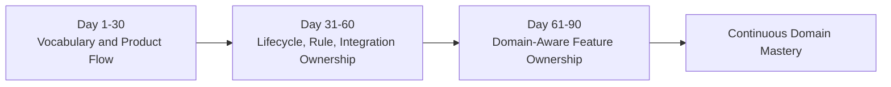
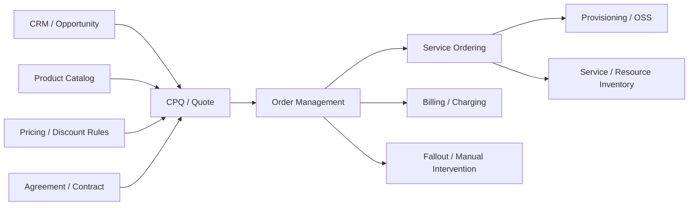

# Part 019 — Domain Onboarding and 30/60/90-Day Plan

> Fokus part ini adalah membuat onboarding domain menjadi sistematis. Targetnya bukan sekadar cepat memahami istilah CPQ/order management, tetapi mampu bergerak dari **domain vocabulary** menuju **lifecycle ownership**, lalu menuju **domain-aware feature ownership** dalam 90 hari pertama.

Sebagai senior engineer, onboarding domain tidak boleh berhenti di level:

```text
Saya tahu endpoint-nya.
Saya tahu table-nya.
Saya tahu service-nya.
Saya bisa mengubah code-nya.
```

Target yang lebih tepat:

```text
Saya tahu perilaku bisnis apa yang sedang dijaga.
Saya tahu state dan invariant mana yang tidak boleh rusak.
Saya tahu customer scenario mana yang terdampak.
Saya tahu integration boundary mana yang ikut berubah.
Saya tahu pertanyaan apa yang harus diajukan sebelum implementasi.
```

Di CPQ, quote management, order management, quote-to-cash, dan telco BSS/OSS, domain onboarding adalah proses membangun peta kerja: terminology, lifecycle, actor, rule, integration, failure mode, audit, dan operating model.

---

## 1. Why Domain Onboarding Is Different for Senior Engineers

Engineer junior biasanya onboarding dengan pertanyaan:

- code ada di mana;
- cara menjalankan service apa;
- endpoint mana yang dipakai;
- test apa yang harus lewat;
- ticket ini minta perubahan apa.

Senior engineer harus menambahkan pertanyaan yang lebih struktural:

- domain object apa yang sedang berubah;
- lifecycle state mana yang terdampak;
- invariant apa yang harus dijaga;
- apakah rule ini global atau customer-specific;
- apakah behavior ini berasal dari product, customer implementation, regulatory/commercial policy, atau integration constraint;
- apakah data historis harus tetap valid;
- apakah downstream system punya ekspektasi terhadap event/API/data shape;
- apakah failure path dan recovery path jelas.

Dalam enterprise CPQ/order management, banyak bug production bukan karena engineer tidak paham syntax, melainkan karena engineer tidak melihat konsekuensi domain.

Contoh sederhana:

```text
Requirement:
Allow user to revise an accepted quote.
```

Pertanyaan senior engineer:

```text
Apakah accepted quote sudah menjadi basis order?
Jika order sudah dibuat, apakah quote revision boleh mengubah harga?
Apakah revision membuat quote baru atau mengubah quote lama?
Apakah approval harus diulang?
Apakah quote document lama tetap harus dapat diaudit?
Apakah billing atau agreement sudah terikat pada versi quote tertentu?
Apakah customer-facing identifier berubah?
```

Tanpa domain onboarding yang benar, engineer akan membaca ini sebagai update biasa. Dengan domain onboarding yang benar, engineer akan melihat ini sebagai lifecycle decision.

---

## 2. Onboarding Goal by Time Horizon

Gunakan 30/60/90 sebagai struktur mental, bukan aturan birokratis.



### First 30 days

Tujuan utama:

```text
Understand the language, product flow, main lifecycle, and team operating context.
```

Pada akhir 30 hari, Anda harus mampu menjelaskan:

- apa itu CPQ dalam konteks produk;
- apa perbedaan quote, order, product catalog, agreement, pricing, approval, fulfillment;
- happy path quote-to-order;
- high-level system landscape;
- actor utama;
- sumber dokumentasi domain;
- area yang masih harus diverifikasi.

### Days 31–60

Tujuan utama:

```text
Understand lifecycle rules, invariants, integration boundaries, and common failure modes.
```

Pada akhir 60 hari, Anda harus mampu:

- membaca user story dan menemukan domain ambiguity;
- menjelaskan quote/order state machine;
- mengidentifikasi invariant pricing, approval, catalog, conversion, fulfillment;
- memahami downstream dependencies;
- mereview PR kecil/sedang dari sisi domain correctness.

### Days 61–90

Tujuan utama:

```text
Own features with domain awareness and contribute to product/design discussions.
```

Pada akhir 90 hari, Anda harus mampu:

- mengambil feature dengan lifecycle impact;
- menulis domain notes sebelum design;
- mengajukan pertanyaan domain yang tepat ke PO/BA/architect;
- membuat regression scenario berbasis lifecycle dan failure mode;
- memberi PR/design review yang membantu tim menjaga business correctness.

---

## 3. First 30 Days — Vocabulary and Product Flow

### 3.1 Build the domain vocabulary map

Jangan mulai dari code. Mulai dari bahasa bisnis.

Buat daftar istilah inti:

- CPQ;
- product catalog;
- product offering;
- product specification;
- quote;
- quote line item;
- price list;
- recurring charge;
- one-time charge;
- discount;
- override;
- margin;
- approval;
- agreement;
- customer;
- account;
- billing account;
- service account;
- product order;
- order item;
- service order;
- fulfillment;
- fallout;
- amendment;
- cancellation;
- renewal.

Untuk setiap istilah, catat:

```text
Business meaning:
Why it exists:
Where it appears in product flow:
Related lifecycle state:
Related API/event/table/module:
Open questions:
Internal source of truth:
```

Contoh domain note:

```text
Term: Quote
Business meaning:
A commercial proposal offered to a customer for selected products/services under specific pricing, terms, validity, and approval conditions.

Why it exists:
To separate commercial negotiation from executable order commitment.

Lifecycle:
Draft -> Configured -> Priced -> Submitted -> Approved -> Accepted/Rejected/Expired/Revised

Important invariants:
Accepted quote should preserve commercial terms used for order creation.
Expired quote should not be converted without explicit revalidation or revision.

Open questions:
When exactly does quote become immutable internally?
Can an accepted quote be revised after order creation?
```

### 3.2 Learn the product flow through demos

Ask for demos in this order:

1. end-to-end quote creation;
2. product configuration;
3. pricing and discounting;
4. approval workflow;
5. quote acceptance;
6. order creation from quote;
7. order validation;
8. order decomposition/orchestration;
9. fulfillment handoff;
10. fallout/manual intervention;
11. amend/cancel scenario;
12. renewal/change scenario.

While watching demo, do not only take screenshots. Capture decisions.

Use this note format:

```text
Step:
Actor:
Business decision:
System validation:
State before:
State after:
Data created/changed:
Events emitted:
Downstream system affected:
Failure possibility:
Open question:
```

### 3.3 Identify actors and responsibility boundaries

Typical actors may include:

- sales user;
- sales manager;
- pricing manager;
- approver;
- product manager;
- catalog manager;
- order manager;
- fulfillment operator;
- support/operator;
- customer care;
- solution architect;
- implementation/configuration team;
- external CRM;
- billing system;
- provisioning/OSS;
- customer-facing channel.

Important question:

```text
Who owns the decision, who owns the data, and who owns the recovery?
```

Example:

```text
Discount override
Decision owner: sales/pricing authority
Data owner: CPQ/pricing domain
Approval owner: approval workflow/business policy
Audit owner: quote/commercial record
Downstream dependency: order/billing must receive approved commercial terms
Recovery owner: depends on whether mismatch is before or after order activation
```

### 3.4 Build high-level landscape map

Create a first rough map:



This map will be wrong at first. That is acceptable. The point is to create a structure for questions.

### 3.5 First 30-day deliverables

By the end of first 30 days, produce these artifacts:

1. **Domain glossary v1**
   - 30–50 terms;
   - each term with business meaning and internal source.

2. **Quote-to-order happy path diagram**
   - actor;
   - state;
   - business decision;
   - external systems.

3. **Open questions list**
   - categorized by quote, order, catalog, pricing, approval, integration.

4. **Product flow notes**
   - from demo, PRs, docs, and conversations.

5. **Risk map v1**
   - top 10 areas where misunderstanding domain would create bugs.

---

## 4. Days 31–60 — Lifecycle, Rule, and Integration Ownership

The second phase is where you stop being only a listener and start becoming a useful reviewer.

### 4.1 Build lifecycle maps

Create lifecycle maps for at least:

- quote;
- quote line item;
- approval;
- product order;
- order item;
- fulfillment task/service order;
- fallout case;
- amendment/cancellation.

Use this structure:

```text
State:
Allowed incoming transitions:
Allowed outgoing transitions:
Actor/system allowed to transition:
Guard condition:
Side effects:
Events emitted:
Audit requirement:
Illegal transitions:
Recovery path:
```

Example:

```text
State: Quote Accepted
Allowed incoming transitions:
- Approved -> Accepted

Allowed outgoing transitions:
- Accepted -> ConvertedToOrder
- Accepted -> Expired? [verify]
- Accepted -> Revised? [verify]

Guard condition:
- Quote not expired
- Required approvals completed
- Customer/account/agreement still valid
- Pricing not invalidated by catalog/rule change [verify]

Side effects:
- Customer-facing acceptance recorded
- Quote may become immutable
- Order creation becomes possible

Open questions:
- Is accepted quote itself terminal?
- Is conversion state separate from accepted state?
```

### 4.2 Identify business invariants

For each lifecycle, extract invariants.

Categories:

- identity invariant;
- state invariant;
- pricing invariant;
- approval invariant;
- catalog invariant;
- agreement invariant;
- conversion invariant;
- fulfillment invariant;
- audit invariant;
- integration invariant.

Example invariants:

```text
A quote should not be submitted if required product configuration is incomplete.
A quote should not be accepted if it is expired.
A quote should not be converted to order if required approval is missing.
An order should not be decomposed using a catalog version different from the accepted commercial basis unless explicit revalidation occurs.
A cancellation should not silently ignore already-completed downstream fulfillment.
A manually recovered fallout should leave an auditable reason and actor.
```

### 4.3 Map rule ownership

Rules have sources. Do not assume all rules belong in code.

Rule sources may include:

- product catalog;
- pricing configuration;
- agreement terms;
- customer/account eligibility;
- regulatory/compliance policy;
- approval authority matrix;
- downstream system capability;
- customer-specific implementation;
- operational runbook;
- historical migration constraint;
- TM Forum alignment or external API contract.

For each rule, ask:

```text
Who owns this rule?
Where is it configured?
Can it change without code deployment?
Is it global or customer-specific?
Is it versioned?
Is it auditable?
Does it affect existing quotes/orders?
How is it tested?
```

### 4.4 Understand integration boundaries

For each integration, capture:

```text
System name:
Business role:
Data sent:
Data received:
Command/event/API:
Synchronous/asynchronous:
Idempotency strategy:
Retry strategy:
Failure state:
Manual recovery:
Reconciliation process:
Owner:
```

Important systems to map:

- CRM/opportunity;
- customer/account management;
- product catalog;
- pricing engine/configuration;
- agreement/contract store;
- quote document generation;
- approval workflow;
- order management;
- service ordering;
- inventory;
- provisioning;
- billing/charging;
- notification;
- reporting/analytics;
- observability/operations.

### 4.5 Study bugs and incidents

Production bugs are domain lessons.

Look for incidents involving:

- price mismatch;
- invalid configuration accepted;
- quote converted after expiry;
- duplicate order;
- order stuck in intermediate state;
- downstream rejection;
- cancellation race;
- amendment conflict;
- missing event;
- partial fulfillment;
- billing mismatch;
- customer-specific rule not applied.

For each incident, write:

```text
What business invariant failed?
What state transition allowed the failure?
What rule was missing, duplicated, stale, or ambiguous?
What integration boundary contributed?
Could better acceptance criteria have caught it?
Could a domain-aware PR review have caught it?
What observability signal was missing?
What regression scenario should exist now?
```

### 4.6 Days 31–60 deliverables

By day 60, produce:

1. **Lifecycle maps v1**
   - quote;
   - approval;
   - product order;
   - fulfillment/fallout.

2. **Invariant catalog v1**
   - 20–40 invariants;
   - categorized by lifecycle.

3. **Integration boundary map**
   - key systems;
   - business role;
   - failure/recovery.

4. **Incident learning notes**
   - at least 5 bugs/incidents analyzed.

5. **Requirement question bank**
   - reusable questions for PO/BA/architect.

---

## 5. Days 61–90 — Domain-Aware Feature Ownership

The third phase is where you become trusted to own meaningful work.

### 5.1 Own a feature by writing domain notes first

Before implementation, write a short domain design note.

Template:

```text
Feature:
Business problem:
Affected actors:
Affected domain objects:
Affected lifecycle states:
Allowed transitions:
Illegal transitions:
Business invariants:
Pricing/approval impact:
Catalog/agreement/customer impact:
Integration impact:
Events/API/data changes:
Failure modes:
Recovery behavior:
Audit/observability:
Regression scenarios:
Open decisions:
Recommendation:
```

This note should be written before code design if the change touches lifecycle, pricing, approval, conversion, order orchestration, fulfillment, or customer/account/agreement behavior.

### 5.2 Become useful in refinement

In backlog refinement, avoid only asking:

```text
Which endpoint should we change?
What field should we add?
When is this due?
```

Ask:

```text
Which lifecycle state does this apply to?
Is the rule global or customer-specific?
What happens to existing quotes/orders?
Does this require re-pricing, re-approval, or re-validation?
What is the failure behavior?
What does support/operator need to see?
What should be auditable?
Which downstream systems need this information?
How do we detect mismatch after release?
```

### 5.3 Review PRs by domain diff

When reviewing, summarize the PR as business behavior:

```text
This PR changes when a quote can move from Submitted to Approved.
This PR changes how discount override contributes to approval threshold.
This PR changes the data passed from accepted quote to product order.
This PR changes retry behavior for downstream order submission.
This PR changes how cancellation interacts with already-started fulfillment.
```

Then review impact:

```text
Is the new behavior valid for all states?
Is historical data safe?
Is the event/API contract still compatible?
Is the audit trail sufficient?
Are regression scenarios complete?
Is failure behavior explicit?
```

### 5.4 Own regression scenarios

Build test thinking around lifecycle, not only methods.

For a quote feature, test:

- draft quote;
- configured but unpriced quote;
- priced quote;
- submitted quote;
- approved quote;
- rejected quote;
- accepted quote;
- expired quote;
- revised quote;
- accepted quote already converted to order;
- quote with customer-specific agreement;
- quote with discount override;
- quote with catalog version changed after creation.

For an order feature, test:

- order capture;
- validation failure;
- decomposition success;
- decomposition failure;
- partial order;
- downstream rejection;
- retry;
- manual intervention;
- cancellation before fulfillment;
- cancellation during fulfillment;
- cancellation after partial completion;
- amend while original order is in progress;
- duplicate submission;
- out-of-order event.

### 5.5 Become a bridge between product and engineering

A senior engineer should translate both directions.

From business to engineering:

```text
Business says: quote should be editable after customer feedback.
Engineering translation:
We need a revision model, immutability boundary, approval re-triggering rule, accepted-version preservation, and order conversion guard.
```

From engineering to business:

```text
Engineering says: we cannot simply update this row.
Business translation:
Changing this value would alter the commercial record that was used for approval and customer acceptance. We need a new revision so auditability and order consistency remain intact.
```

### 5.6 Days 61–90 deliverables

By day 90, produce:

1. **Feature domain note**
   - for at least one meaningful feature.

2. **PR review checklist customized to team**
   - lifecycle;
   - pricing;
   - approval;
   - audit;
   - integration;
   - failure.

3. **Regression scenario library v1**
   - quote scenarios;
   - order scenarios;
   - integration/failure scenarios.

4. **Internal domain map v2**
   - validated with PO/BA/architect/senior engineer.

5. **Open decisions register**
   - unresolved domain ambiguity;
   - owner;
   - consequence;
   - recommendation.

---

## 6. Questions to Ask Product Owner

Ask PO questions that clarify business intent and product behavior.

### Product behavior

```text
What customer problem does this solve?
Which persona uses this capability?
Is this behavior standard product behavior or customer-specific?
Which product flow should demonstrate this behavior?
What is the expected happy path?
What is the expected exception path?
```

### Lifecycle

```text
Which quote/order states does this apply to?
Is this allowed before approval, after approval, after acceptance, or after order creation?
Does this behavior create a new revision/version?
Does it require revalidation, repricing, or reapproval?
What should happen to already-created orders?
```

### Commercial correctness

```text
Does this affect price, discount, margin, or approval authority?
Should this be visible in quote documents?
Should this be auditable?
Can users override it?
Who is allowed to override it?
```

### Customer and agreement

```text
Is this rule customer-specific, account-specific, agreement-specific, or global?
Does it depend on customer hierarchy?
Does it depend on channel/partner/reseller?
Does it apply to existing customers, new customers, or both?
```

### Release and customer impact

```text
Will existing quotes/orders be affected?
Does this change historical reporting?
Does this need migration?
Should customers be notified?
What is the fallback if behavior is wrong after release?
```

---

## 7. Questions to Ask Business Analyst

Ask BA questions that turn business intent into precise rule and acceptance criteria.

### Rule precision

```text
What is the exact condition for this rule?
What are the boundary cases?
What data determines eligibility?
What happens when required data is missing?
What is the precedence if multiple rules apply?
Can rules conflict?
Who resolves conflict?
```

### Acceptance criteria

```text
Can we express the AC as Given/When/Then with explicit state?
Can we include negative scenarios?
Can we include expired/invalid/rejected states?
Can we include duplicate submission or retry?
Can we include customer-specific agreement cases?
Can we include downstream failure behavior?
```

### Audit and reporting

```text
What needs to be recorded?
Who needs to see the reason?
Does this affect operational reporting?
Does this affect revenue/commercial reporting?
Is there a compliance or audit requirement?
```

### Data semantics

```text
Is this field input, derived, copied, snapshot, or reference?
Can it change after submission?
Can it change after approval?
Can it change after acceptance?
Does it represent current value or historical value at decision time?
```

---

## 8. Questions to Ask Solution Architect

Ask architect questions that connect domain behavior to system boundaries.

### Boundary and ownership

```text
Which system owns this domain concept?
Is our service source of truth or consumer?
Is this a command, query, event, or replicated state?
Is there an anti-corruption layer?
Is the external model aligned with our internal model?
```

### Integration contract

```text
Which API/event changes are required?
Is the contract backward compatible?
Do downstream systems need the new field/rule/state?
Is ordering guaranteed?
How do we handle duplicate or out-of-order messages?
What is the reconciliation mechanism?
```

### Deployment/customer variability

```text
Is this behavior configurable per customer?
Does it vary by deployment model?
Can it be enabled gradually?
Does it require migration?
Does it require feature flag/configuration?
```

### TM Forum alignment

```text
Is this concept mapped to a TM Forum resource?
Are we following standard lifecycle/status values or extending them?
Is divergence intentional and documented?
Does extension affect interoperability?
```

---

## 9. Questions to Ask Senior Engineers

Ask senior engineers for practical reality.

```text
Which parts of this domain are most dangerous to change?
Which states are often misunderstood?
Which rules are duplicated across modules?
Which tests are trustworthy?
Which tests give false confidence?
Which incidents taught the team the most?
Which docs are outdated?
Which product demo is closest to production reality?
Which customer scenarios are special but important?
What should I never assume about quote/order lifecycle here?
```

Senior engineers often know the difference between documented design and operational truth.

Capture that difference explicitly:

```text
Documented behavior:
Observed behavior:
Reason for difference:
Risk:
Owner to verify:
```

---

## 10. Documents to Look For

Search for these internal artifacts:

### Product/domain artifacts

- domain glossary;
- product overview deck;
- quote-to-order demo script;
- CPQ product flow;
- order management flow;
- catalog management flow;
- pricing/discounting rule guide;
- approval workflow guide;
- agreement/contract model;
- customer/account model;
- fallout handling guide.

### Engineering/domain artifacts

- architecture overview;
- bounded context/module map;
- API contracts;
- event catalog;
- state transition diagrams;
- database schema/domain ERD;
- integration map;
- runbooks;
- observability dashboard links;
- support troubleshooting guide;
- data migration notes;
- ADRs;
- release notes.

### Delivery artifacts

- backlog epics;
- user stories;
- acceptance criteria examples;
- product demo recordings;
- customer scenario documents;
- implementation notes;
- known limitations;
- incident postmortems;
- regression test plan.

Do not trust any single document as complete truth. Use documents to form hypotheses, then verify with code, tests, demos, and people.

---

## 11. Demos to Request

Request demos that include both happy path and failure path.

### Core demos

```text
1. Create quote for new customer
2. Create quote for existing customer/account
3. Configure product bundle
4. Apply discount/promotion
5. Trigger approval
6. Approve/reject quote
7. Accept quote
8. Convert quote to order
9. Validate order
10. Decompose order
11. Fulfillment success
12. Billing/charging handoff
```

### Failure demos

```text
1. Invalid product configuration
2. Ineligible product
3. Expired quote
4. Discount exceeds approval threshold
5. Approval rejected
6. Catalog version mismatch
7. Downstream order rejection
8. Partial fulfillment
9. Order stuck in fallout
10. Cancellation during fulfillment
11. Amendment conflict
12. Billing mismatch/reconciliation
```

### Operational demos

```text
1. Support investigates stuck order
2. Operator resolves fallout
3. Reconciliation job detects mismatch
4. Audit history for quote approval
5. Event trace for quote-to-order
6. Dashboard for fulfillment failure
```

Operational demos are often more valuable than polished sales demos because they reveal recovery behavior.

---

## 12. PRs, Bugs, and Incidents to Study

### PRs to study

Prioritize PRs that changed:

- quote state;
- order state;
- pricing calculation;
- discount approval;
- catalog reference/versioning;
- quote-to-order conversion;
- order decomposition;
- retry/idempotency;
- event schema;
- API contract;
- data migration;
- customer-specific behavior;
- fallout/recovery.

Study each PR with this structure:

```text
Business behavior before:
Business behavior after:
Domain objects affected:
States affected:
Invariants changed:
Tests added:
Edge cases missed:
Review comments worth remembering:
```

### Bugs to study

Prioritize bugs where the root cause is domain misunderstanding:

- quote allowed illegal transition;
- price changed unexpectedly;
- approval not triggered;
- expired quote converted;
- duplicate order created;
- wrong customer/account used;
- agreement terms ignored;
- downstream rejected order;
- event consumer interpreted state incorrectly;
- fallout not recoverable;
- billing activation mismatch.

### Incidents to study

For incidents, ask:

```text
What did the system believe was true?
What was actually true in the business process?
Where did the mismatch begin?
Why was it not detected earlier?
What manual recovery was needed?
What invariant should have prevented it?
What observability should have exposed it?
```

---

## 13. Personal Domain Notebook Structure

A personal domain notebook is not a diary. It is your working model of the product.

Recommended structure:

```text
/domain-notebook
  /00-open-questions.md
  /01-glossary.md
  /02-quote-lifecycle.md
  /03-order-lifecycle.md
  /04-product-catalog.md
  /05-pricing-approval.md
  /06-customer-account-agreement.md
  /07-integrations.md
  /08-events.md
  /09-failure-modes.md
  /10-review-checklists.md
  /11-product-demos.md
  /12-incidents-and-lessons.md
  /13-tm-forum-mapping.md
  /14-team-specific-conventions.md
```

Each note should answer:

```text
What is the concept?
Why does it exist?
Who owns it?
Where does it appear?
What lifecycle does it follow?
What invariants matter?
What can fail?
How is it observed?
What is still unknown?
```

### Open questions register

Use this structure:

```text
Question:
Area: quote/order/catalog/pricing/approval/integration/etc.
Why it matters:
Risk if unanswered:
Possible answers:
Recommended assumption:
Owner to verify:
Status:
Date verified:
Source:
```

### Decision log

Use this structure:

```text
Decision:
Context:
Options:
Chosen behavior:
Reason:
Affected lifecycle:
Affected integrations:
Audit/testing implications:
Date:
Source:
```

This prevents rediscovering the same domain decision repeatedly.

---

## 14. Anti-Patterns During Domain Onboarding

### Anti-pattern 1 — Starting from database tables only

Tables show persistence. They do not explain business meaning.

A table named `quote_status` does not tell you:

- who is allowed to change the status;
- which transitions are legal;
- what side effects occur;
- what audit is required;
- whether historical states are migrated;
- whether UI/API/event use the same status semantics.

### Anti-pattern 2 — Treating API shape as domain truth

API resources are contracts, not necessarily internal domain model.

A field may be:

- input;
- output;
- derived;
- snapshot;
- reference;
- deprecated;
- extension;
- customer-specific;
- pass-through;
- compatibility artifact.

### Anti-pattern 3 — Assuming happy path is enough

Enterprise CPQ/order systems live in edge cases:

- invalid configuration;
- expired quote;
- rejected approval;
- partial fulfillment;
- downstream timeout;
- cancellation race;
- amendment conflict;
- reconciliation mismatch.

Happy path teaches product flow. Failure path teaches system truth.

### Anti-pattern 4 — Asking vague questions

Weak question:

```text
How does approval work?
```

Better question:

```text
When a quote with discount override above threshold is revised after approval, does the system require reapproval, preserve the old approval, or create a new approval chain? Which states and audit records are expected?
```

### Anti-pattern 5 — Believing all customers behave the same

Enterprise products often have variability:

- customer-specific pricing;
- customer-specific catalog;
- agreement-specific terms;
- deployment-specific integration;
- channel-specific flow;
- regulatory/localization behavior;
- migrated legacy data.

Always verify whether a rule is global or customer-specific.

---

## 15. 90-Day Scorecard

Use this scorecard to check readiness.

### Domain vocabulary

You are ready if you can:

- define 50+ domain terms;
- explain difference between product offering, product specification, service, resource;
- explain quote vs order vs service order;
- explain customer/account/party/agreement differences;
- explain pricing/discount/approval/margin relation.

### Lifecycle reasoning

You are ready if you can:

- draw quote lifecycle from memory;
- draw order lifecycle from memory;
- identify terminal, retryable, manual, and illegal states;
- explain quote-to-order conversion boundary;
- explain amend/cancel race risks.

### Invariant awareness

You are ready if you can name invariants for:

- quote submission;
- quote approval;
- quote acceptance;
- quote expiry;
- quote revision;
- order validation;
- order decomposition;
- downstream fulfillment;
- cancellation;
- billing handoff.

### Integration awareness

You are ready if you can explain:

- which systems feed quote;
- which systems consume order;
- where customer/account/catalog/pricing/agreement data comes from;
- where events are emitted/consumed;
- what happens on downstream rejection;
- how reconciliation works or should work.

### Review capability

You are ready if your review comments include:

- domain object affected;
- lifecycle state affected;
- invariant risk;
- integration/event/API compatibility;
- test scenario gap;
- audit/observability consideration;
- customer impact.

---

## 16. Internal Verification Checklist

Use this checklist throughout the 90 days.

### Product and domain

- Verify official product flow for quote-to-order.
- Verify domain glossary and canonical terms used by the team.
- Verify which flows are standard product and which are customer-specific.
- Verify supported quote lifecycle states.
- Verify supported order lifecycle states.
- Verify amendment and cancellation behavior.
- Verify fallout/manual intervention process.

### Catalog and pricing

- Verify product catalog structure.
- Verify product offering/specification relationship.
- Verify bundle/option/eligibility rules.
- Verify catalog versioning strategy.
- Verify price list/charge/discount/promotion model.
- Verify approval threshold and authority matrix.
- Verify price recalculation behavior.

### Customer and agreement

- Verify customer/account/party model.
- Verify billing account vs service account semantics.
- Verify enterprise agreement usage.
- Verify customer-specific terms and eligibility.
- Verify partner/channel/reseller behavior if relevant.

### Integration and operations

- Verify CRM/customer/catalog/pricing/agreement integrations.
- Verify service ordering/provisioning/inventory/billing handoff.
- Verify event catalog and event ownership.
- Verify retry/idempotency/reconciliation behavior.
- Verify observability dashboards.
- Verify operational runbooks.

### Delivery workflow

- Verify requirement refinement process.
- Verify PR review expectations.
- Verify testing strategy for domain lifecycle.
- Verify release/migration/customer-impact process.
- Verify incident learning loop.

---

## 17. Practical Weekly Routine

A good 90-day onboarding is built through weekly rhythm.

### Weekly domain review

Pick one domain concept and answer:

```text
What did I learn this week?
What assumption changed?
What invariant did I discover?
What failure mode did I understand?
What question is still unresolved?
Who can verify it?
```

### Weekly PR study

Pick one PR and write:

```text
Business behavior changed:
Lifecycle affected:
Invariant protected or weakened:
Tests added/missing:
Review lesson:
```

### Weekly stakeholder question

Ask one high-quality question to PO/BA/architect/senior engineer.

Good questions are specific, consequence-aware, and option-aware.

```text
I see three possible behaviors for expired approved quotes.
Option A is block conversion.
Option B is allow conversion with warning.
Option C is force revalidation/reapproval.
Which one is intended, and is it global or customer-specific?
```

---

## 18. Summary

Domain onboarding for CSG Quote & Order should produce more than familiarity. It should produce operating judgment.

The 30/60/90 progression:

```text
Day 1-30:
Understand vocabulary, product flow, actors, and high-level system landscape.

Day 31-60:
Understand lifecycle, rules, invariants, integrations, and failure modes.

Day 61-90:
Own features, review domain correctness, ask better questions, and contribute to design/product decisions.
```

The senior engineer outcome is not:

```text
I know where the code is.
```

It is:

```text
I know what the system must keep true while the business changes.
```
