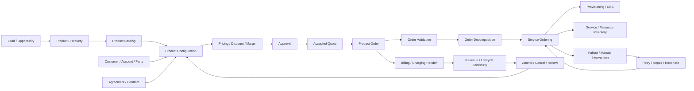
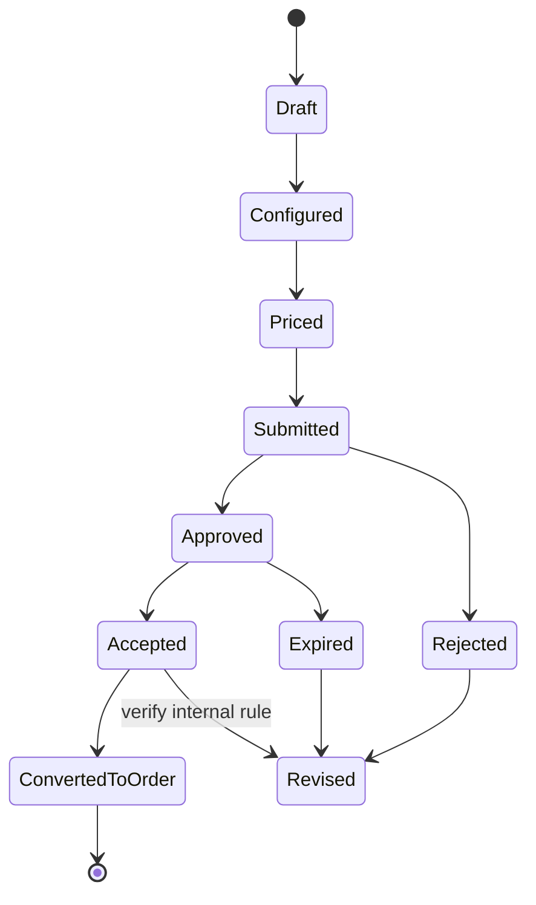
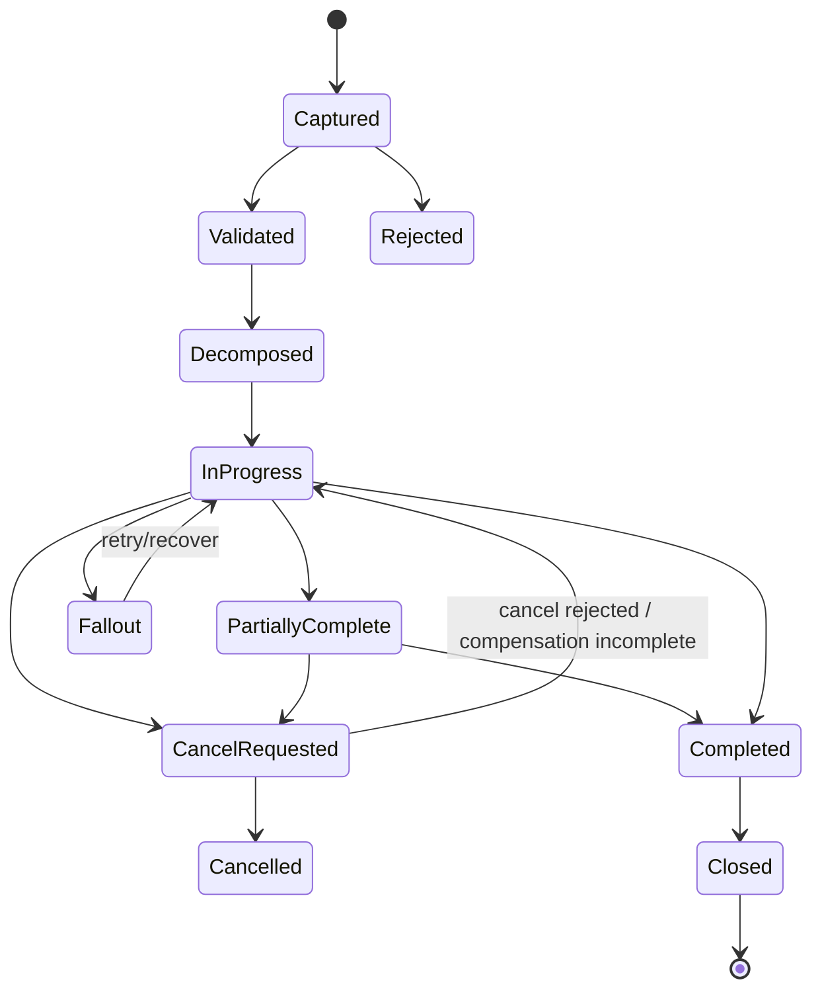
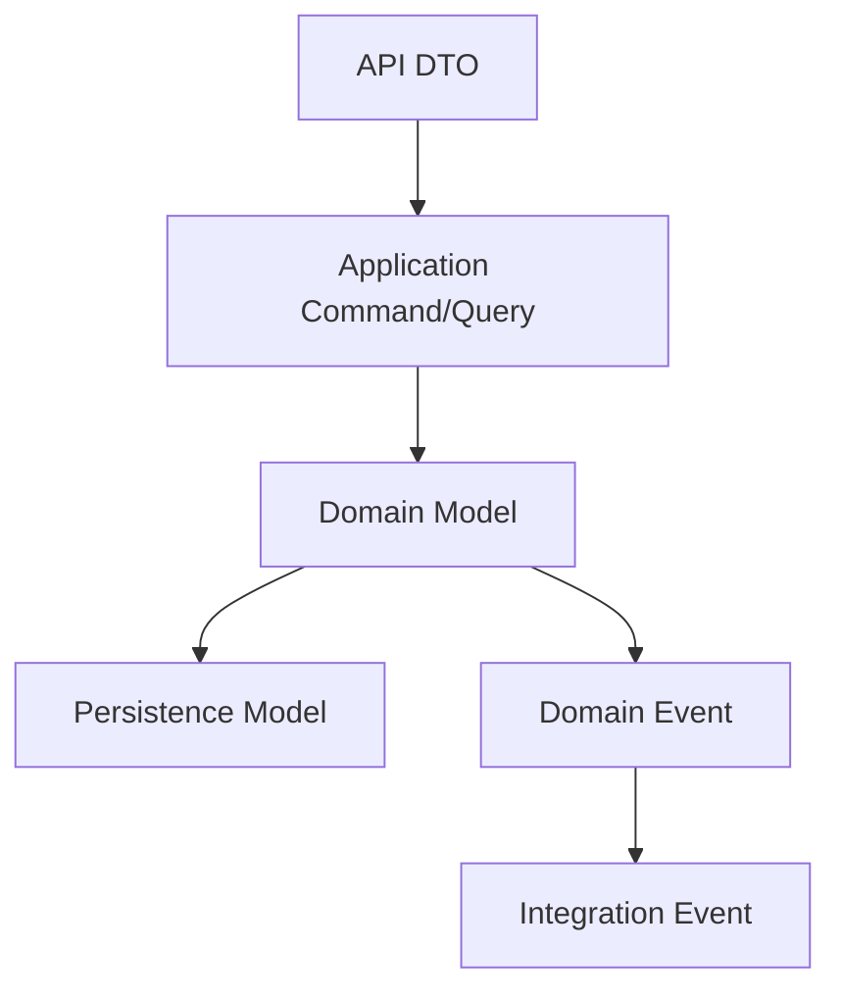

# Part 020 — Domain Mastery Map for Senior Engineer

> Ini adalah final part. Tujuannya adalah menyatukan seluruh seri menjadi satu peta kerja: bagaimana memahami CPQ/order management sebagai domain lifecycle-heavy, rule-heavy, integration-heavy, audit-sensitive, dan failure-prone; lalu bagaimana memakai pemahaman itu dalam requirement analysis, design, PR review, testing, dan operasi production.

Domain mastery bukan berarti hafal semua istilah. Domain mastery berarti mampu menjawab:

```text
Apa yang sedang terjadi secara bisnis?
State mana yang berubah?
Invariant apa yang harus tetap benar?
Rule mana yang diterapkan?
Data mana yang menjadi source of truth?
Integration mana yang terdampak?
Failure apa yang mungkin terjadi?
Bagaimana recovery dan audit dilakukan?
Bagaimana saya mereview perubahan ini sebagai senior engineer?
```

Dalam CPQ, quote management, order management, quote-to-cash, dan telco BSS/OSS, sistem yang baik bukan hanya sistem yang memproses request. Sistem yang baik menjaga janji komersial, lifecycle operasional, dan konsistensi lintas sistem.

---

## 1. The Complete Domain Map

Gunakan peta berikut sebagai ringkasan mental model.



This map should be read as business flow, not as implementation architecture.

Key separation:

```text
Catalog defines what can be sold.
Configuration selects how it is sold.
Pricing defines commercial value.
Approval protects commercial authority.
Quote records the commercial proposal.
Order executes the accepted commercial intent.
Fulfillment realizes the service/product operationally.
Billing/charging monetizes the activated commitment.
Amend/cancel/renew keeps lifecycle continuous after initial sale.
```

---

## 2. The Core Mental Model

The core mental model of enterprise CPQ/order management:

```text
A customer wants a business outcome.
The business offers a configured product under specific commercial terms.
The customer accepts or rejects the offer.
An accepted offer becomes an executable order.
The order coordinates downstream systems to deliver the product/service.
Billing/charging must reflect what was commercially accepted and operationally fulfilled.
Changes after initial sale must preserve auditability, correctness, and lifecycle continuity.
```

This is why quote/order domains are difficult:

- sales wants flexibility;
- pricing wants control;
- finance wants margin and auditability;
- operations wants executable orders;
- support wants recoverability;
- customers want correctness and predictability;
- downstream systems want stable contracts;
- product wants reusable configuration;
- customer implementations often need variation.

The system sits between commercial intent and operational execution.

---

## 3. CPQ and Order Management in One Sentence Each

Use these compact definitions.

### CPQ

```text
CPQ is the domain capability that helps users choose valid products, configure them correctly, calculate defensible prices, and produce a commercial proposal that can be approved, accepted, and converted into an executable order.
```

### Quote management

```text
Quote management controls the lifecycle of the commercial proposal: draft, configuration, pricing, validation, submission, approval, acceptance, expiry, rejection, revision, and conversion readiness.
```

### Order management

```text
Order management controls the lifecycle of execution: capture, validation, decomposition, orchestration, dependency management, fulfillment tracking, fallout, retry, amendment, cancellation, completion, and reconciliation.
```

### Quote-to-cash

```text
Quote-to-cash is the business lifecycle from commercial proposal to executable order, fulfillment, billing/charging, revenue recognition, and post-sale change.
```

### Telco BSS/OSS context

```text
In telco, CPQ/order management connects BSS commercial processes with OSS operational delivery through product/service/resource separation, catalog-driven behavior, fulfillment orchestration, inventory, provisioning, billing, and assurance.
```

---

## 4. Master Lifecycle Recap

### 4.1 Quote lifecycle recap

Common conceptual lifecycle:



Important: this is a conceptual map. Internal CSG lifecycle must be verified.

Core quote questions:

```text
When does quote become immutable?
When is pricing snapshotted?
When does approval become required?
When does approval become invalid?
When can quote be revised?
When can quote expire?
When can quote be converted to order?
What happens if catalog/pricing/customer/agreement changes after quote creation?
```

### 4.2 Order lifecycle recap

Common conceptual lifecycle:



Core order questions:

```text
What is source of truth for order state?
Is state managed at order level, order item level, or both?
Can order be partially complete?
Can order be amended while in progress?
Can cancellation be accepted after downstream fulfillment started?
What is retryable and what requires manual intervention?
How does reconciliation repair mismatch?
```

---

## 5. The Senior Engineer Domain Checklist

Use this checklist whenever you touch a feature, requirement, PR, design, incident, or production issue.

### 5.1 Business concept

```text
What business concept is this?
Why does it exist?
Who uses it?
Who owns it?
Is it standard product behavior or customer-specific?
```

### 5.2 Lifecycle

```text
Which lifecycle does it belong to?
Which state does it start from?
Which state does it move to?
Which transitions are legal?
Which transitions are illegal?
Is it terminal, retryable, reversible, compensatable, or manual?
```

### 5.3 Invariant

```text
What must always remain true?
Where is the invariant enforced?
Can another API/event/batch/manual path bypass it?
Is the invariant tested?
Is violation observable?
```

### 5.4 Rule

```text
Is this a product rule, pricing rule, approval rule, agreement rule, customer rule, operational rule, or integration rule?
Who owns the rule?
Can the rule change dynamically?
Is the rule versioned?
Is the rule auditable?
```

### 5.5 Data semantics

```text
Is the data input, derived, copied, snapshotted, referenced, or replicated?
Is it current-state data or decision-time data?
Can it change after submission/approval/acceptance/order creation?
What is source of truth?
```

### 5.6 Integration

```text
Which upstream systems provide data?
Which downstream systems consume data?
Is the exchange synchronous or asynchronous?
What happens on timeout/rejection/duplicate/out-of-order/missing event?
How is reconciliation done?
```

### 5.7 Audit and operation

```text
Who needs to see what happened?
What reason/actor/timestamp must be recorded?
Can support diagnose the issue?
Can operations repair it safely?
Can customer impact be explained?
```

---

## 6. Invariant Master Map

### 6.1 Catalog invariants

```text
A quote/order should reference a product offering that was valid for the relevant selling context.
A configured product should satisfy compatibility, eligibility, and mandatory option rules.
A product bundle should not contain invalid child combinations.
A catalog version change should not silently alter already accepted commercial records.
Catalog-driven decomposition should be traceable to the commercial product selected.
```

### 6.2 Customer/account/agreement invariants

```text
A quote should be associated with a valid customer/account/party context.
Billing account and service account semantics should not be mixed.
Customer-specific agreement terms should be applied consistently to pricing/eligibility.
Agreement-driven pricing should be auditable.
Customer hierarchy should not accidentally apply parent terms to invalid child accounts.
```

### 6.3 Pricing and approval invariants

```text
A submitted quote should have complete and valid pricing.
A price override should be traceable to actor, reason, and authority.
A discount above threshold should trigger required approval.
An approved quote should preserve the commercial basis that was approved.
A price recalculation should not silently change an already accepted quote.
Margin/profitability guardrails should not be bypassed through alternate flows.
```

### 6.4 Quote invariants

```text
A quote should not be accepted if expired, rejected, or missing required approval.
A quote revision should preserve the auditability of prior versions.
Quote-to-order conversion should use the accepted quote version.
Accepted quote data used for order creation should be stable or explicitly revalidated.
Quote documents should match stored commercial terms.
```

### 6.5 Order invariants

```text
An order should not be created from an invalid or unauthorized quote.
An order item should preserve intended action: add, modify, disconnect, suspend, resume.
Order decomposition should not lose dependency relationships.
Order status should reflect item-level progress accurately enough for operations.
Cancellation should not ignore already-completed downstream work.
Amendment should not conflict with in-flight fulfillment without explicit handling.
```

### 6.6 Fulfillment and billing invariants

```text
Fulfillment should execute what was commercially accepted and order-validated.
Downstream rejection should be represented as recoverable or terminal business state.
Billing activation should align with fulfilled service/product state.
Manual fallout recovery should leave auditable trace.
Reconciliation should detect and repair cross-system mismatch.
```

---

## 7. Failure Mode Master Map

The most dangerous bugs are often cross-boundary bugs.

```mermaid
flowchart TD
  A[Business Failure] --> B[Invalid Configuration]
  A --> C[Commercial Mismatch]
  A --> D[Lifecycle Violation]
  A --> E[Integration Failure]
  A --> F[Operational Fallout]
  A --> G[Audit/Reporting Failure]

  B --> B1[Ineligible product]
  B --> B2[Catalog version mismatch]
  B --> B3[Invalid bundle]

  C --> C1[Price mismatch]
  C --> C2[Discount approval bypass]
  C --> C3[Agreement term ignored]

  D --> D1[Expired quote converted]
  D --> D2[Illegal state transition]
  D --> D3[Amend/cancel race]

  E --> E1[Duplicate event]
  E --> E2[Out-of-order event]
  E --> E3[Downstream rejection]

  F --> F1[Stuck order]
  F --> F2[Partial fulfillment]
  F --> F3[Manual repair incomplete]

  G --> G1[Missing approval trail]
  G --> G2[Historical record mutated]
  G --> G3[Billing/reporting mismatch]
```



For every failure mode, ask:

```text
Can we prevent it?
If not, can we detect it?
If detected, can we recover it?
If recovered, can we audit it?
If not recoverable, can we explain customer impact?
```

---

## 8. TM Forum Alignment Checklist

TM Forum is useful as reference language, not as a replacement for internal domain understanding.

### 8.1 Questions for TMF620 Product Catalog

```text
How do internal product offering/specification models map to TMF620?
Are bundle, relationship, eligibility, and versioning represented similarly?
Are extensions documented?
Does product catalog drive quote validation, pricing, and order decomposition?
```

### 8.2 Questions for TMF648 Quote Management

```text
How does internal quote lifecycle map to TMF648 Quote states?
Are quote items aligned with product offering references?
How are pricing, validity, approval, and revision represented?
Are extensions compatible with external consumers?
```

### 8.3 Questions for TMF622 Product Ordering

```text
How does internal product order map to TMF622 ProductOrder?
How are order item actions represented?
How are item dependencies and milestones represented?
How does internal lifecycle differ from TMF622 status values?
```

### 8.4 Questions for TMF629 Customer Management

```text
How does internal customer/account/party model map to TMF629 resources?
Where are billing account and service account represented?
How is customer hierarchy handled?
What external system is source of truth?
```

### 8.5 Questions for TMF637 Product Inventory

```text
How does fulfilled product state become product inventory?
How are active/disconnected/modified product instances represented?
How does product inventory relate to order history and billing?
```

### 8.6 Questions for TMF641 Service Ordering

```text
How does product order decomposition map to service ordering?
Which system owns service order state?
How are service order failures propagated back to product order?
How is fallout represented?
```

### 8.7 Alignment rule

Use this rule:

```text
Align where it improves interoperability and shared language.
Extend where product/customer reality requires it.
Diverge only intentionally, document why, and protect contract compatibility.
```

---

## 9. Domain Model Review Map

Whenever reviewing model design, evaluate four layers.



### 9.1 API DTO

Ask:

```text
Is this external contract stable?
Is it aligned with TMF or internal API convention?
Does it expose internal implementation accidentally?
Are extension fields controlled?
Is backward compatibility preserved?
```

### 9.2 Domain model

Ask:

```text
Does the model express business meaning?
Are invariants close to the domain object/rule owner?
Are lifecycle transitions explicit?
Are invalid states representable too easily?
Is customer-specific behavior isolated or leaking globally?
```

### 9.3 Persistence model

Ask:

```text
Is persistence optimized without distorting domain semantics?
Are snapshots and references clear?
Are historical records protected?
Does migration preserve business meaning?
```

### 9.4 Event model

Ask:

```text
Does the event represent a business fact?
Is it safe to replay?
Is it idempotent for consumers?
Does schema evolution preserve compatibility?
Can reconciliation rebuild state?
```

---

## 10. Requirement Review Master Checklist

Before implementation, requirement should answer:

```text
What business outcome is required?
Which actor performs it?
Which domain object changes?
Which lifecycle state is required before action?
Which lifecycle state results after action?
What validation is required?
What pricing/approval/agreement impact exists?
What catalog/customer/account context matters?
What external systems are involved?
What happens if external systems reject or timeout?
What should be auditable?
What should be observable?
What happens to existing data?
What regression scenarios are required?
```

A requirement is weak if it only says:

```text
Add field X.
Allow user to update Y.
Send event Z.
Call API A.
```

A requirement is stronger if it says:

```text
In state S, actor A may perform action X if conditions C are true.
The system transitions object O to state T, preserves invariant I, emits event E, records audit A, and handles failures F1/F2/F3.
```

---

## 11. PR Review Master Checklist

A domain-aware PR review should include these layers.

### Business behavior diff

```text
What business behavior changed?
Is that behavior intended by requirement?
Is the change global or customer-specific?
```

### Lifecycle diff

```text
Are new transitions introduced?
Are old transitions removed?
Are terminal states affected?
Are retry/manual states affected?
Are concurrent transitions safe?
```

### Rule diff

```text
Are pricing/approval/catalog/agreement/customer rules changed?
Is rule precedence clear?
Is rule ownership clear?
Is rule versioning/audit considered?
```

### Contract diff

```text
Are API/event schemas changed?
Is backward compatibility maintained?
Are consumers/producers updated?
Are missing/duplicate/out-of-order scenarios handled?
```

### Data diff

```text
Is historical data affected?
Is migration needed?
Are snapshots/references preserved?
Are indexes/constraints aligned with business uniqueness?
```

### Failure diff

```text
What new failure modes exist?
Can they be detected?
Can they be retried or repaired?
Is manual intervention supported?
Is observability sufficient?
```

---

## 12. Production Readiness Map

A change touching CPQ/order domain is production-ready only when these questions are answered.

```text
Can support explain what happened?
Can operations recover from partial failure?
Can product explain the business behavior?
Can customer impact be scoped?
Can engineering trace the event/API/data path?
Can finance/commercial audit pricing and approval?
Can downstream systems remain compatible?
Can old data still be interpreted correctly?
```

### Observability signals to expect

- quote state transition metrics;
- quote validation failure count;
- pricing recalculation mismatch;
- approval pending/failed/rejected metrics;
- order capture failure;
- order decomposition failure;
- downstream rejection;
- stuck order age;
- retry count;
- fallout queue age;
- reconciliation mismatch;
- duplicate command/event detection;
- billing activation mismatch.

### Operational views to expect

- search by customer/account/quote/order ID;
- full lifecycle timeline;
- state transition history;
- actor and reason history;
- event trace;
- downstream request/response trace;
- fallout reason;
- recovery action;
- reconciliation status.

---

## 13. How to Contribute in Product Discussions

A domain-aware senior engineer improves product discussions by adding structure.

### Instead of asking only “what should we build?”

Ask:

```text
Which business decision is this feature encoding?
Which lifecycle state does this decision belong to?
What should be impossible after this change?
What behavior should be preserved for historical records?
What is the failure/recovery model?
```

### Instead of saying “this is complex”

Say:

```text
This is complex because it changes accepted quote immutability, approval validity, order conversion behavior, and downstream billing alignment. We need to decide whether this creates a revision or mutates the existing quote.
```

### Instead of saying “we need more requirements”

Say:

```text
The open decision is whether expired approved quotes can be converted. If yes, we need revalidation/repricing rules. If no, we need a blocked state and user-facing recovery path. My recommendation is to require explicit revision because it preserves auditability.
```

Good product discussion contribution is specific, consequence-aware, and option-aware.

---

## 14. How to Keep Learning Continuously

Domain mastery does not finish at Part 020. It becomes a routine.

### Weekly

- study one PR for domain behavior;
- update glossary or lifecycle note;
- ask one targeted domain question;
- review one incident/bug;
- add one regression scenario.

### Monthly

- validate domain map with PO/BA/architect;
- review open decisions register;
- revisit top failure modes;
- inspect observability dashboard;
- study one customer scenario deeply.

### Per feature

- write domain note;
- map lifecycle impact;
- list invariants;
- list failure modes;
- review integration impact;
- define regression scenarios;
- validate assumptions.

### Per incident

- identify failed invariant;
- identify state where detection should have happened;
- identify missing observability;
- identify missing test/AC;
- update review checklist.

---

## 15. Domain-Aware Senior Engineer Maturity Levels

### Level 1 — Code executor

```text
Can implement requested changes but relies on others to define domain behavior.
```

Risk:

- misses lifecycle edge cases;
- implements ambiguous requirements literally;
- trusts happy path too much.

### Level 2 — Domain participant

```text
Can explain major flows and ask basic clarification questions.
```

Strength:

- understands terminology;
- can follow product discussion;
- can spot obvious state/rule issues.

### Level 3 — Domain reviewer

```text
Can review PR/design for business correctness, invariant safety, compatibility, and failure behavior.
```

Strength:

- catches subtle domain regressions;
- writes better tests;
- protects auditability and lifecycle consistency.

### Level 4 — Domain owner

```text
Can own features end-to-end with product, architecture, QA, support, and downstream integration awareness.
```

Strength:

- translates business intent into safe implementation options;
- drives decisions when requirements are ambiguous;
- anticipates operational impact.

### Level 5 — Domain shaper

```text
Can improve the product/domain model itself: simplify lifecycle, clarify boundaries, reduce inconsistency, improve recovery, and make the system easier to reason about.
```

Strength:

- influences roadmap/design;
- improves team checklists and language;
- reduces repeated classes of bugs.

---

## 16. Final Internal Verification Checklist

Before considering this series internalized, verify these with CSG/team context.

### Product scope

- What exactly is in scope for CSG Quote & Order in your team?
- Which flows are product-standard vs customer-specific?
- What are the main personas and operational roles?
- Which deployment/customization patterns matter?

### Lifecycle

- What are official quote states?
- What are official order states?
- Are order item states separate?
- What states are terminal?
- What states are retryable?
- What states require manual intervention?

### Catalog/pricing/agreement

- What is source of truth for product catalog?
- How are catalog versions handled?
- How is pricing configured/calculated?
- How are discount override and approval authority handled?
- How are enterprise agreements applied?

### Integration

- Which systems are upstream of quote?
- Which systems are downstream of order?
- Which events are business-critical?
- What is replay/idempotency/reconciliation strategy?
- What are common integration failure modes?

### Operations

- How is fallout handled?
- What dashboards exist?
- What runbooks exist?
- How does support diagnose customer/order issues?
- What incidents should new senior engineers study?

### Delivery

- How are user stories refined?
- Who resolves domain ambiguity?
- What PR review standards exist?
- What regression scenarios are mandatory?
- What release/customer-impact process exists?

---

## 17. Final Series Recap

This series covered:

```text
Part 001 — Domain foundation
Part 002 — CSG Quote & Order context
Part 003 — Quote-to-cash lifecycle
Part 004 — Product catalog and catalog-driven architecture
Part 005 — Customer, account, party, and agreement
Part 006 — Pricing, discounting, margin, and approval
Part 007 — Quote management
Part 008 — Order management
Part 009 — Fulfillment and downstream integration
Part 010 — Telco BSS/OSS mental model
Part 011 — TM Forum reference model
Part 012 — TM Forum Open APIs for quote and order
Part 013 — Domain modelling and bounded context
Part 014 — State machines and lifecycle invariants
Part 015 — Event-driven domain consistency
Part 016 — Business error and failure modelling
Part 017 — Requirement and user story analysis
Part 018 — Domain-aware PR and design review
Part 019 — Domain onboarding and 30/60/90-day plan
Part 020 — Domain mastery map for senior engineer
```

The progression is intentional:

```text
Vocabulary -> Lifecycle -> Catalog/Customer/Pricing -> Quote/Order -> Fulfillment/BSS/OSS -> TM Forum -> Modelling/State/Event/Failure -> Requirement/Review -> Onboarding/Mastery
```

This is the path from learning terms to exercising senior engineering judgment.

---

## 18. Final Operating Model

Use this operating model in daily work.

```text
When reading a requirement:
Find the lifecycle, invariant, rule, integration, failure, and audit implication.

When designing a change:
Make state transitions explicit and preserve business history.

When writing code:
Keep business meaning visible and enforce invariants at the right boundary.

When reviewing PR:
Review behavior, not only implementation.

When debugging production:
Ask which business fact the system got wrong.

When discussing product:
Frame ambiguity as options, consequences, and recommendation.

When learning domain:
Turn every bug, demo, PR, and story into a reusable mental model.
```

---

## 19. Final Summary

The most useful senior engineer in CPQ/order management is not the person who memorizes the most acronyms.

It is the person who can protect correctness while the business evolves.

That means understanding:

- what can be sold;
- to whom it can be sold;
- under which terms;
- at what price;
- with whose approval;
- through which quote version;
- into which order;
- decomposed into which fulfillment actions;
- recovered through which fallout path;
- billed through which downstream process;
- audited through which history;
- changed through which amendment/cancellation/renewal lifecycle.

The final principle:

```text
A domain-aware senior engineer does not merely ask, “Does the code work?”

They ask, “Does the system preserve the business truth it is responsible for?”
```

This is the final part of the series.
