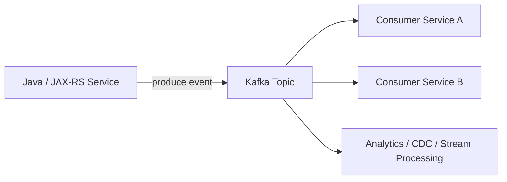
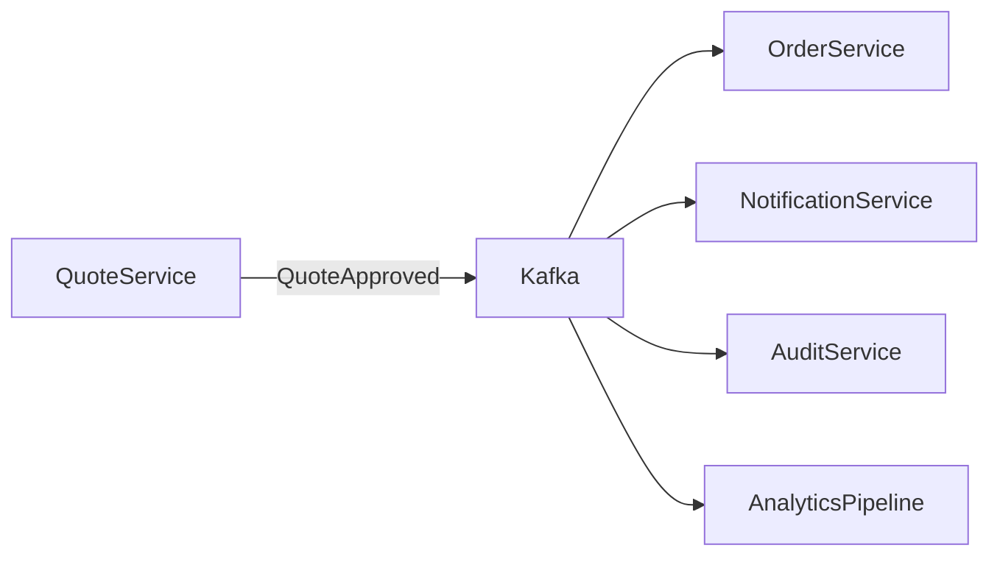
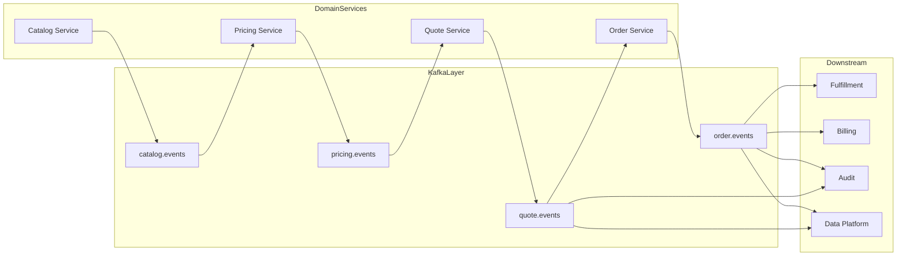
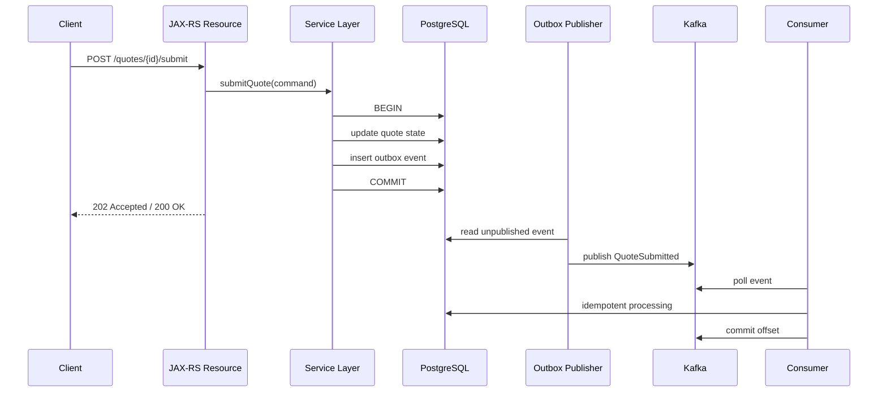

# Part 001 — Kafka Foundation

## 1. Tujuan Part Ini

Part ini membangun fondasi mental model Apache Kafka untuk engineer backend Java/JAX-RS yang bekerja di sistem enterprise. Fokusnya bukan “cara kirim message”, tetapi memahami **Kafka sebagai infrastructure untuk event, log, integration, replay, dan distributed data movement**.

Setelah part ini, Kafka seharusnya tidak lagi terlihat seperti “queue yang lebih cepat”, tetapi sebagai:

- distributed commit log
- event streaming platform
- message broker-like system
- integration backbone
- replayable event history
- coordination boundary antar service
- sumber risiko consistency, ordering, schema, idempotency, observability, dan operational incident jika digunakan tanpa disiplin

## 2. Apa Itu Apache Kafka?

Apache Kafka adalah platform event streaming terdistribusi. Kafka menerima record dari producer, menyimpannya dalam topic yang dipartisi, lalu mengizinkan consumer membaca record tersebut berdasarkan offset.

Secara sederhana:



Namun model di atas terlalu sederhana. Yang penting adalah Kafka menyimpan event sebagai log. Consumer tidak “mengambil lalu menghapus” message seperti queue tradisional. Consumer membaca posisi tertentu di log dan menyimpan progress melalui offset.

Mental model paling penting:

> Kafka bukan sekadar tempat transit message. Kafka adalah log event terdistribusi yang bisa dibaca oleh banyak consumer secara independen.

Implikasinya besar:

- event dapat dikonsumsi oleh banyak consumer
- consumer dapat tertinggal dan mengejar lagi
- event dapat direplay selama masih berada dalam retention
- ordering dijamin hanya dalam partition
- offset adalah posisi baca, bukan status pemrosesan bisnis
- consumer harus siap menghadapi duplicate event
- event schema menjadi public contract
- retention dan compaction menjadi keputusan arsitektur, bukan konfigurasi ops biasa

## 3. Kafka sebagai Distributed Commit Log

Commit log adalah struktur append-only. Data baru ditambahkan di akhir log, bukan di-update di tempat.

Contoh log sederhana:

```text
offset 0 -> QuoteCreated
offset 1 -> QuotePriced
offset 2 -> QuoteSubmitted
offset 3 -> QuoteApproved
offset 4 -> OrderCreated
```

Kafka memperluas konsep ini secara terdistribusi:

- log dibagi menjadi topic
- topic dibagi menjadi partition
- partition direplikasi ke broker lain
- producer menulis record ke partition
- consumer membaca record berdasarkan offset
- Kafka menyimpan record sampai retention/compaction menghapusnya

Dalam sistem CPQ/order management, log ini bisa merepresentasikan stream perubahan penting:

- quote created
- quote priced
- quote approved
- order submitted
- order decomposed
- fulfillment started
- fallout detected
- amendment requested
- cancellation completed

Tetapi hati-hati: Kafka log bukan otomatis menjadi source of truth bisnis. Source of truth biasanya tetap berada di database domain service, kecuali arsitektur secara eksplisit memakai event sourcing. Jangan menyamakan event streaming dengan event sourcing.

## 4. Kafka sebagai Event Streaming Platform

Kafka disebut event streaming platform karena mendukung aliran event yang terus berjalan. Data tidak hanya dikirim sebagai message satuan, tetapi diproses sebagai stream.

Ada tiga pola besar:

### 4.1 Event distribution

Satu service menghasilkan event, banyak service mendengarkan.



### 4.2 Data integration

Kafka menjadi backbone perpindahan data antar sistem.

Contoh:

- PostgreSQL CDC ke Kafka menggunakan Debezium
- Kafka ke data lake
- Kafka ke search index
- Kafka ke downstream fulfillment system
- Kafka ke cache invalidation pipeline

### 4.3 Stream processing

Event tidak hanya dipindahkan, tetapi dihitung, digabung, difilter, atau diagregasi.

Contoh:

- menghitung status order lifecycle
- membuat materialized view
- mendeteksi fallout pattern
- join order event dengan catalog/pricing stream
- membangun projection untuk read model

Kafka Streams dan ksqlDB masuk di area ini, tetapi jangan langsung memakai stream processing sebelum memahami producer/consumer correctness, ordering, idempotency, dan schema governance.

## 5. Kafka sebagai Message Broker-like System

Kafka sering dipakai seperti message broker karena producer mengirim record dan consumer menerima record. Tetapi Kafka berbeda dari queue tradisional.

Dalam queue klasik:

- message biasanya dikirim ke queue
- satu consumer mengambil message
- message di-ack
- message lalu hilang dari queue
- fokusnya work distribution

Dalam Kafka:

- event disimpan di log
- banyak consumer group bisa membaca event yang sama
- offset disimpan per consumer group
- event tidak hilang hanya karena dibaca
- fokusnya durable event history dan fan-out

Perbandingan ringkas:

| Aspek | Queue Tradisional | Kafka |
|---|---|---|
| Penyimpanan message | Biasanya sementara sampai ack | Disimpan sesuai retention |
| Consumer | Competing consumer | Consumer group + replayable offset |
| Replay | Tidak natural | Natural selama data masih ada |
| Ordering | Queue-level atau terbatas | Partition-level |
| Fan-out | Perlu exchange/routing/subscription | Banyak consumer group membaca topic sama |
| Unit scaling | Queue/consumer | Partition/consumer group |
| Fokus | Work dispatch | Event log, integration, streaming |

Kesalahan umum adalah membawa ekspektasi queue ke Kafka. Misalnya:

- berharap message hilang setelah sukses diproses
- menganggap DLQ otomatis menyelesaikan poison event
- menganggap ordering global
- menganggap retry aman tanpa idempotency
- menganggap offset commit sama dengan transaksi bisnis selesai
- menganggap consumer group seperti worker queue biasa tanpa memahami rebalance

## 6. Kafka sebagai Integration Backbone

Di enterprise, Kafka sering menjadi integration backbone. Artinya Kafka menjadi jalur standar untuk menyebarkan perubahan antar domain dan sistem.

Contoh arsitektur:



Keuntungan integration backbone:

- producer tidak perlu tahu semua consumer
- consumer bisa ditambah tanpa mengubah producer
- event history bisa dipakai untuk replay
- integrasi batch/polling bisa dikurangi
- data movement lebih observable jika dikelola baik

Tetapi risiko juga meningkat:

- event schema menjadi contract lintas tim
- breaking change dapat merusak consumer yang tidak terlihat
- duplicate event dapat memicu side effect ganda
- topic menjadi shared infrastructure yang perlu governance
- consumer lag dapat menyebabkan stale read atau business delay
- event replay bisa merusak state jika consumer tidak idempotent
- ownership event bisa kabur

Kafka sebagai backbone hanya sehat jika ada governance. Tanpa governance, Kafka menjadi “distributed coupling bus”.

## 7. Kafka dalam Enterprise Java/JAX-RS System

Dalam aplikasi Java/JAX-RS, Kafka biasanya muncul di beberapa titik:

### 7.1 HTTP command menghasilkan event

Client memanggil endpoint:

```text
POST /quotes/{quoteId}/submit
```

Service melakukan:

1. validate request
2. authorize actor
3. load quote dari PostgreSQL
4. ubah state quote
5. simpan perubahan ke database
6. publish `QuoteSubmitted` event
7. return response

Masalah besar ada di langkah 5 dan 6. Jika database commit sukses tetapi publish Kafka gagal, sistem menjadi inconsistent. Jika publish Kafka sukses tetapi database rollback, consumer melihat event palsu.

Solusi umum: transactional outbox.

### 7.2 Consumer Kafka melakukan update database

Consumer membaca event:

```text
QuoteApproved
```

Lalu melakukan:

1. parse event
2. validate schema/version
3. check idempotency
4. update state order/projection/cache
5. commit database transaction
6. commit Kafka offset

Masalah besar:

- duplicate event
- consumer crash setelah DB commit sebelum offset commit
- offset commit sebelum DB commit
- external side effect dipanggil dua kali
- event lama direplay dan merusak state baru
- ordering antar aggregate disalahpahami

Solusi umum:

- idempotent consumer
- inbox/processed event table
- state transition guard
- retry/DLQ strategy
- reconciliation

### 7.3 Kafka sebagai integration layer

JAX-RS service tetap menyediakan API synchronous, tetapi business workflow berjalan asynchronous via Kafka.

Contoh:

```text
POST /orders
-> 202 Accepted
-> OrderCreated event
-> Fulfillment consumer
-> Billing consumer
-> Status projection updated
-> GET /orders/{id}/status
```

API harus jujur: response 202 berarti request diterima, bukan seluruh downstream process selesai.

## 8. Kafka dalam Microservices

Kafka cocok untuk microservices jika digunakan untuk memisahkan lifecycle antar domain. Tetapi Kafka tidak otomatis membuat sistem menjadi loosely coupled.

Loose coupling terjadi jika:

- event merepresentasikan business fact, bukan internal database row dump
- schema stabil dan backward compatible
- consumer tidak mengandalkan urutan global
- producer tidak tahu consumer internal
- consumer idempotent
- failure dapat diretry/replay dengan aman
- observability lintas service tersedia
- ownership jelas

Kafka justru menciptakan tight coupling jika:

- event schema berubah mengikuti table internal
- topic menjadi dumping ground semua event
- consumer bergantung pada field yang tidak terdokumentasi
- event tidak punya versioning
- producer mengubah semantic event tanpa notice
- consumer membutuhkan ordering yang tidak dijamin
- replay tidak aman
- DLQ tidak dimonitor

## 9. Kafka dalam CPQ/Order Management Context

Dalam CPQ/order management, event-driven architecture sangat menggoda karena workflow-nya panjang dan melibatkan banyak domain:

- catalog
- pricing
- quote
- approval
- order capture
- order decomposition
- fulfillment
- billing
- fallout
- amendment
- cancellation
- audit

Kafka dapat membantu karena domain-domain ini tidak selalu harus berjalan synchronous dalam satu request. Tetapi domain ini juga penuh dengan invariants.

Contoh invariant:

- quote tidak boleh menjadi order jika belum approved
- order tidak boleh fulfilled jika decomposition belum selesai
- cancellation tidak boleh memproses fulfillment yang sudah irreversible
- price snapshot harus konsisten dengan quote version
- amendment harus merujuk order state yang valid
- audit event tidak boleh hilang

Dalam domain seperti ini, event bukan hanya “notifikasi”. Event adalah bagian dari lifecycle bisnis. Karena itu correctness lebih penting daripada sekadar throughput.

## 10. Kafka vs RabbitMQ

RabbitMQ sangat kuat untuk routing, work queue, command dispatch, dan message acknowledgement. Kafka kuat untuk durable log, replay, stream, dan fan-out.

Gunakan Kafka jika:

- perlu replay event
- perlu banyak consumer group independen
- perlu event history dalam retention
- perlu throughput tinggi
- perlu stream processing
- perlu CDC/data integration
- event menjadi backbone antar domain

Gunakan RabbitMQ jika:

- butuh complex routing/exchange pattern
- butuh work queue semantics yang jelas
- message bersifat task/command ephemeral
- consumer acknowledgement dan retry per message lebih cocok
- replay history bukan kebutuhan utama
- ordering dan durability log bukan pusat desain

Hybrid sering masuk akal:

- Kafka untuk domain event dan integration stream
- RabbitMQ untuk task command, dispatch, atau workflow-specific queue

Yang berbahaya adalah memilih Kafka hanya karena “lebih modern” atau RabbitMQ hanya karena “lebih familiar”.

## 11. Kafka vs Redis Stream

Redis Stream juga punya konsep stream dan consumer group. Namun Redis dan Kafka berbeda dalam tujuan operasional.

Kafka lebih cocok untuk:

- durable event backbone
- retention besar
- high-throughput append-only log
- multi-consumer replay
- ecosystem Kafka Connect/Streams/Debezium
- cross-service integration platform

Redis Stream lebih cocok untuk:

- lightweight stream di sekitar Redis-based application
- low-latency internal pipeline
- sistem dengan operational scope kecil
- workload yang tidak membutuhkan Kafka ecosystem

Pertanyaan arsitektural:

- Apakah data perlu direplay berhari-hari/minggu?
- Apakah ada banyak consumer group lintas tim?
- Apakah schema governance diperlukan?
- Apakah ada CDC/connectors/stream processing?
- Apakah Redis sudah menjadi dependency kritis?
- Apakah Redis persistence/retention cukup untuk kebutuhan bisnis?

## 12. Kafka vs Database Queue

Database queue biasanya dibuat dengan table seperti:

```text
job_queue(id, type, payload, status, created_at, locked_at)
```

Atau outbox table:

```text
outbox_event(id, aggregate_id, event_type, payload, status, created_at)
```

Database queue cocok untuk:

- workload kecil
- transactional coupling kuat dengan database
- job internal satu service
- tidak butuh fan-out luas
- tidak butuh replay lintas service

Kafka lebih cocok untuk:

- event lintas domain
- high throughput
- banyak consumer independen
- retention/replay
- stream processing
- decoupled integration

Namun outbox table bukan pesaing Kafka. Dalam banyak sistem production, outbox table justru melengkapi Kafka untuk menyelesaikan dual-write problem.

## 13. Kafka vs HTTP Polling

HTTP polling sederhana:

```text
Consumer -> GET /changes?since=...
```

Polling cocok jika:

- perubahan jarang
- consumer sedikit
- near-real-time tidak penting
- integrasi sederhana
- producer ingin tetap mengontrol API contract secara request/response

Kafka lebih cocok jika:

- perubahan sering
- consumer banyak
- latency event penting
- replay dibutuhkan
- producer tidak ingin melayani polling berat
- sistem butuh push-based integration

Tetapi Kafka membawa overhead governance, security, schema, topic, consumer lag, dan operations. Jangan memakai Kafka untuk mengganti endpoint sederhana jika polling sudah cukup.

## 14. Kafka vs gRPC Streaming

gRPC streaming cocok untuk koneksi service-to-service dengan stream aktif. Kafka cocok untuk durable asynchronous event distribution.

gRPC streaming:

- connection-oriented
- low latency
- strong API contract
- tidak otomatis durable log
- tidak natural untuk replay
- cocok untuk live data channel

Kafka:

- broker-mediated
- durable
- replayable
- asynchronous
- many consumer groups
- cocok untuk event backbone

Jika event harus tetap ada walau consumer down, Kafka lebih cocok. Jika butuh interactive streaming session, gRPC streaming bisa lebih cocok.

## 15. Kafka vs ESB

Traditional ESB sering menjadi pusat orchestration dan transformation. Kafka lebih dekat ke distributed log dan event backbone.

Kafka bukan ESB modern secara otomatis. Kafka tidak seharusnya menjadi tempat semua business logic transformation yang tidak punya owner.

Risiko “Kafka sebagai ESB baru”:

- topic menjadi dumping ground
- transformasi business logic pindah ke connector/stream query tanpa ownership jelas
- event contract tidak terdokumentasi
- monitoring tersebar
- consumer tidak diketahui
- schema berubah tanpa governance
- incident menjadi lintas tim tanpa owner

Kafka sehat jika logic ownership tetap jelas di service/domain masing-masing.

## 16. When to Use Kafka

Gunakan Kafka ketika minimal beberapa kondisi ini benar:

- perlu publish business event lintas service
- perlu banyak consumer independen
- perlu event replay
- perlu durable integration stream
- perlu throughput tinggi
- perlu CDC dari database
- perlu stream processing
- perlu asynchronous workflow
- perlu audit/event trail dengan retention
- perlu decouple producer dari consumer lifecycle

Contoh valid:

- `QuoteApproved` memicu order creation, audit, notification, analytics
- PostgreSQL outbox dipublish ke Kafka untuk downstream integration
- order status projection dibangun dari event stream
- fulfillment update dikonsumsi banyak domain
- CDC digunakan untuk data platform atau search indexing

## 17. When Not to Use Kafka

Jangan gunakan Kafka jika:

- hanya butuh request/response synchronous sederhana
- hanya ada satu consumer dan tidak butuh replay
- message adalah command kecil yang harus diproses sekali oleh worker
- ordering global wajib
- team belum siap idempotency dan schema governance
- tidak ada observability consumer lag/DLQ
- failure recovery belum jelas
- operational ownership Kafka tidak jelas
- latency harus ultra-low dan connection-oriented
- event payload mengandung data sensitif tanpa security/privacy model

Kafka yang dipasang tanpa governance akan memperbesar blast radius.

## 18. Request-to-Event Lifecycle di Java/JAX-RS

Contoh lifecycle yang sehat:



Key point:

- event dibuat sebagai bagian dari business transaction
- publish ke Kafka tidak dilakukan sebagai dual-write langsung setelah DB update tanpa guard
- consumer idempotent
- offset commit dilakukan setelah processing aman
- event punya metadata untuk tracing dan audit

## 19. Failure Modes Dasar

Kafka-based system gagal bukan hanya saat broker down. Failure mode lebih sering terjadi di boundary.

### Producer-side failure

- producer timeout
- broker unavailable
- serialization failure
- authorization failure
- retry menghasilkan duplicate
- publish sukses tetapi response callback gagal
- DB commit sukses tetapi publish gagal
- partition key salah menyebabkan ordering rusak

### Broker/runtime failure

- broker down
- under-replicated partition
- ISR shrink
- disk full
- network partition
- controller issue
- retention misconfiguration
- topic tidak ada
- ACL salah

### Consumer-side failure

- deserialization failure
- poison event
- consumer lag meningkat
- rebalance loop
- offset commit salah
- duplicate processing
- out-of-order handling buruk
- DLQ tidak dimonitor
- consumer crash setelah side effect

### Governance failure

- schema breaking change
- topic ownership tidak jelas
- event versioning tidak ada
- consumer tersembunyi
- replay tidak aman
- observability tidak cukup

## 20. Detecting and Debugging Failure

Minimal sinyal observability:

- producer send rate
- producer error rate
- producer retry rate
- producer request latency
- consumer lag per group/topic/partition
- consumer processing latency
- rebalance rate
- DLQ count
- deserialization error count
- broker under-replicated partition
- broker request latency
- disk usage
- topic throughput
- partition skew
- outbox lag
- CDC replication slot lag
- trace correlation from HTTP request to event to consumer

Debugging harus dimulai dari pertanyaan:

1. Apakah event berhasil dibuat di domain service?
2. Apakah event tersimpan di outbox?
3. Apakah event berhasil dipublish ke topic yang benar?
4. Apakah key/partition sesuai?
5. Apakah schema bisa dibaca consumer?
6. Apakah consumer group menerima partition assignment?
7. Apakah consumer lag meningkat?
8. Apakah processing gagal?
9. Apakah masuk DLQ?
10. Apakah offset sudah commit?
11. Apakah database consumer berubah?
12. Apakah ada duplicate atau out-of-order event?

## 21. Correctness Concerns

Correctness di Kafka bukan hanya “message terkirim”.

Concern utama:

- producer tidak boleh kehilangan event setelah DB commit
- consumer harus aman terhadap duplicate
- event schema harus kompatibel
- partition key harus menjaga ordering yang dibutuhkan
- retry tidak boleh menciptakan side effect ganda
- DLQ harus bisa direplay dengan aman
- replay tidak boleh merusak state
- offset commit harus sesuai dengan processing result
- event metadata harus cukup untuk audit/debug
- retention harus cukup untuk recovery window

Kafka memberi primitive. Correctness tetap tanggung jawab aplikasi.

## 22. Performance Concerns

Performance Kafka dipengaruhi oleh:

- batch size
- linger.ms
- compression
- acks
- partition count
- partition key distribution
- message size
- producer throughput
- consumer processing time
- consumer parallelism
- broker disk IO
- broker network IO
- replication factor
- retention
- page cache
- cross-zone traffic
- serialization cost

Jangan tuning performance sebelum semantics benar. Sistem yang cepat tetapi tidak idempotent akan mempercepat corruption.

## 23. Security and Privacy Concerns

Kafka event sering menyebar ke banyak consumer. Karena itu data dalam event harus diperlakukan sebagai data yang berpotensi luas distribusinya.

Perhatikan:

- PII di payload
- PII di header
- secrets tidak boleh masuk event
- log redaction
- encryption in transit
- encryption at rest
- ACL topic
- ACL consumer group
- schema registry access
- DLQ access
- replay access
- retention vs privacy requirement
- audit log untuk akses topic sensitif

DLQ sering terlupakan. Padahal DLQ dapat menyimpan payload gagal yang sangat sensitif.

## 24. Trade-Off Utama

Kafka memberikan:

- decoupling
- durability
- replay
- fan-out
- throughput
- stream processing ecosystem

Tetapi membayar dengan:

- eventual consistency
- duplicate handling
- schema governance
- operational complexity
- consumer lag
- ordering limitation
- security surface lebih luas
- debugging lintas service
- replay safety requirement
- topic lifecycle management

Kafka cocok jika organisasi siap membayar biaya engineering tersebut.

## 25. PR Review Checklist

Gunakan checklist ini saat mereview perubahan yang menyentuh Kafka:

### Event design

- Apakah event merepresentasikan business fact?
- Apakah event bukan sekadar dump table internal?
- Apakah event type jelas?
- Apakah event owner jelas?
- Apakah consumer yang diketahui terdokumentasi?

### Topic

- Apakah topic sudah ada atau baru?
- Apakah naming sesuai convention?
- Apakah retention/compaction sesuai kebutuhan?
- Apakah partition count masuk akal?
- Apakah topic owner jelas?

### Producer

- Apakah publish aman terhadap DB transaction?
- Apakah memakai outbox jika ada DB write?
- Apakah key sesuai aggregate ordering?
- Apakah retry aman?
- Apakah metadata lengkap?

### Consumer

- Apakah idempotent?
- Apakah offset commit setelah processing?
- Apakah retry/DLQ jelas?
- Apakah poison event tidak memblokir seluruh partition selamanya?
- Apakah replay aman?

### Schema

- Apakah schema compatible?
- Apakah versioning jelas?
- Apakah field baru optional atau punya default?
- Apakah enum evolution aman?
- Apakah contract test ada?

### Observability

- Apakah producer/consumer metrics ada?
- Apakah lag alert ada?
- Apakah DLQ dimonitor?
- Apakah correlation ID muncul di log/trace?
- Apakah runbook tersedia?

## 26. Internal Verification Checklist

Hal yang perlu dicek di internal CSG/team:

- Apakah Kafka digunakan secara luas atau hanya pada subset workflow?
- Cluster Kafka dikelola oleh siapa: platform, SRE, vendor, cloud-managed, atau tim produk?
- Topic apa saja yang dimiliki Quote & Order?
- Topic mana yang diproduce oleh service Java/JAX-RS?
- Consumer group apa saja yang dimiliki tim?
- Apakah ada Schema Registry?
- Format event apa yang digunakan: JSON, Avro, Protobuf, atau lain?
- Apakah ada event catalog?
- Apakah ada outbox table di PostgreSQL?
- Apakah outbox dipublish via polling atau CDC/Debezium?
- Apakah ada inbox/processed event table?
- Bagaimana retry dan DLQ diimplementasikan?
- Apakah ada Kafka Connect?
- Apakah ada Debezium connector?
- Apakah ada Kafka Streams atau ksqlDB?
- Bagaimana Kafka config dikelola: manual, CI/CD, GitOps?
- Apa dashboard utama untuk consumer lag, broker health, DLQ, outbox lag?
- Apa runbook untuk Kafka incident?
- Apa security mechanism: TLS, SASL, ACL, IAM, OAuth/OIDC?
- Apa policy retention per topic?
- Siapa yang approve schema breaking change?
- Apakah replay pernah dilakukan di production?
- Apa incident Kafka paling sering terjadi?

## 27. Ringkasan

Kafka adalah platform event streaming yang paling berguna ketika dipahami sebagai distributed commit log dan event backbone, bukan hanya queue cepat.

Untuk senior backend engineer, fondasi Kafka berarti mampu menjawab:

- apa yang ditulis ke Kafka
- kenapa ditulis ke Kafka
- siapa yang membaca
- apa contract-nya
- apa ordering guarantee-nya
- bagaimana duplicate ditangani
- bagaimana schema berevolusi
- bagaimana failure dideteksi
- bagaimana replay dilakukan
- siapa owner operasionalnya
- apa dampak business jika event terlambat, hilang, duplicate, atau salah schema

Jika pertanyaan-pertanyaan ini belum bisa dijawab, sistem Kafka belum production-ready meskipun producer dan consumer sudah berjalan.
