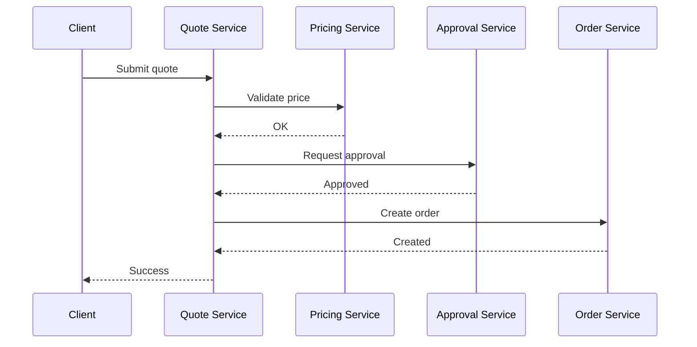
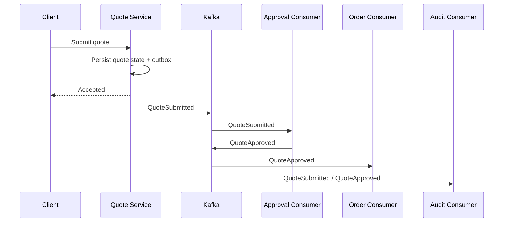
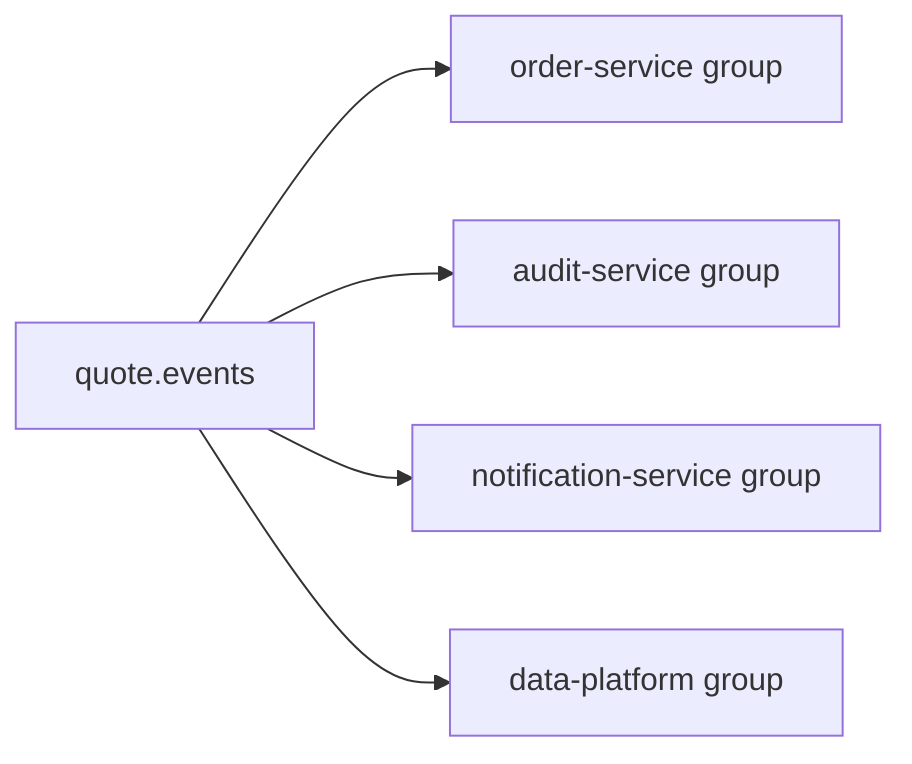
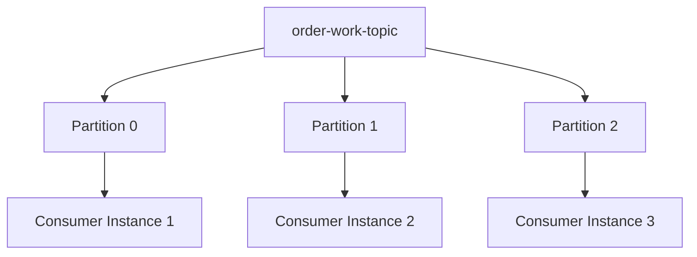
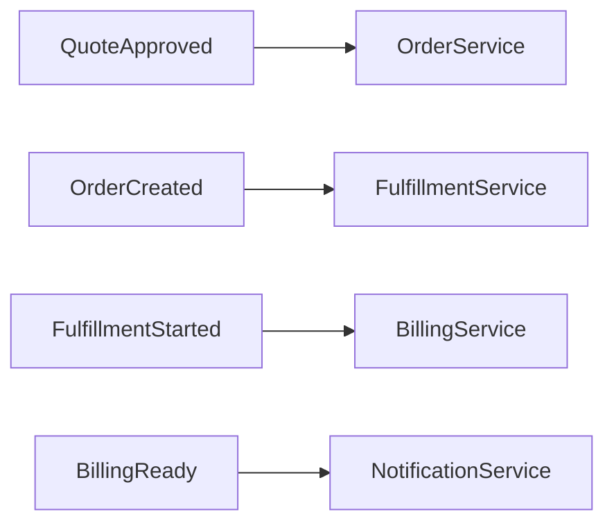
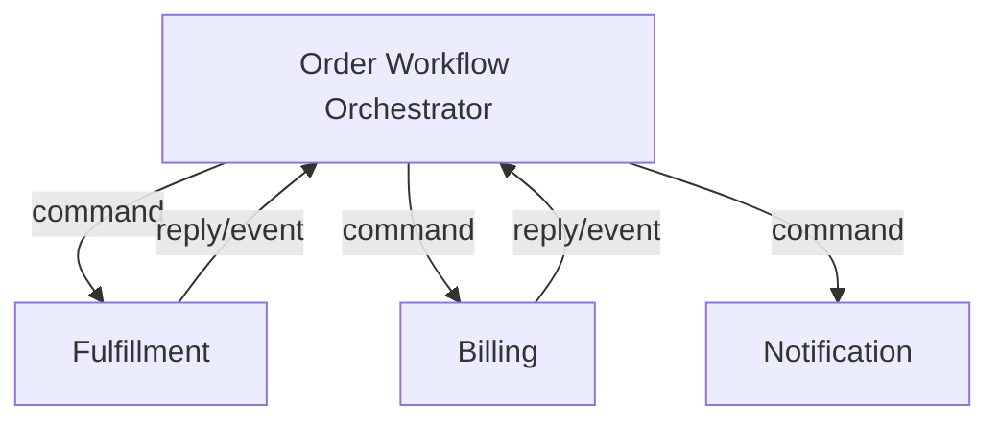
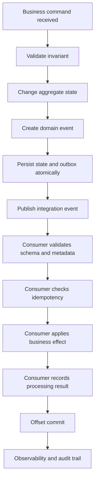

# Part 002 — Event-Driven Architecture Mental Model

## 1. Tujuan Part Ini

Part ini membangun cara berpikir event-driven architecture sebelum masuk lebih dalam ke topic, partition, producer, consumer, schema, outbox, CDC, dan operations.

Kesalahan umum engineer saat mulai memakai Kafka adalah langsung berpikir:

> “Bagaimana cara produce dan consume message?”

Pertanyaan yang lebih penting:

> “Apa fakta bisnis yang perlu disebarkan, siapa yang boleh bereaksi, contract apa yang dijanjikan, dan failure apa yang terjadi jika event terlambat, duplicate, hilang, atau out-of-order?”

Event-driven architecture bukan sekadar mengganti REST call dengan Kafka. EDA mengubah cara service berkoordinasi, cara data menjadi consistent, cara failure dipulihkan, dan cara tim menjaga contract lintas domain.

## 2. Core Mental Model

Dalam sistem synchronous, service sering berkomunikasi seperti ini:



Kelebihan:

- mudah dipahami
- response langsung
- failure terlihat pada request path
- transaction boundary lebih eksplisit

Kekurangan:

- temporal coupling tinggi
- semua downstream harus tersedia
- latency bertambah
- retry bisa menimbulkan side effect
- service upstream tahu terlalu banyak tentang downstream
- perubahan downstream dapat memengaruhi request path upstream

Dalam EDA, flow berubah:



Kelebihan:

- producer tidak harus menunggu semua downstream
- consumer dapat berkembang independen
- event bisa direplay
- sistem lebih cocok untuk long-running workflow
- lebih mudah fan-out ke audit, analytics, notification, projection

Kekurangan:

- consistency menjadi eventual
- debugging lintas service lebih sulit
- duplicate event harus dianggap normal
- ordering tidak selalu global
- schema menjadi public contract
- operational observability wajib
- business state bisa tersebar di banyak projection
- replay dapat menjadi berbahaya jika consumer tidak idempotent

## 3. Event

Event adalah fakta yang sudah terjadi.

Contoh event:

```text
QuoteCreated
QuoteSubmitted
QuoteApproved
OrderCreated
OrderDecomposed
FulfillmentStarted
OrderCancelled
FalloutDetected
```

Ciri event yang baik:

- memakai past tense
- merepresentasikan fakta bisnis
- immutable secara semantic
- punya event ID
- punya event time
- punya aggregate ID
- punya correlation ID
- punya schema version
- cukup untuk consumer memahami konteks
- tidak membocorkan detail internal yang tidak stabil

Event bukan instruksi. Event tidak berkata “lakukan X”. Event berkata “X telah terjadi”.

Buruk:

```text
CreateOrderMessage
ProcessQuoteMessage
DoFulfillment
```

Lebih baik:

```text
QuoteApproved
OrderCreationRequested
OrderCreated
FulfillmentRequested
FulfillmentStarted
```

Catatan: `OrderCreationRequested` terdengar seperti command/request event. Ini bisa valid, tetapi semantic-nya harus jelas. Apakah itu fakta bahwa request dibuat, atau instruksi ke service tertentu? Ambiguitas seperti ini sering menjadi sumber coupling.

## 4. Command

Command adalah permintaan untuk melakukan sesuatu.

Contoh command:

```text
SubmitQuote
ApproveQuote
CreateOrder
CancelOrder
StartFulfillment
```

Command biasanya:

- imperative
- punya target owner
- dapat ditolak
- perlu authorization
- memicu validasi
- mengubah state jika valid

Dalam HTTP/JAX-RS, command sering masuk sebagai request:

```http
POST /quotes/{quoteId}/submit
POST /orders/{orderId}/cancel
```

Dalam Kafka, command topic bisa ada, tetapi perlu disiplin lebih tinggi. Jika service A mengirim command ke service B melalui Kafka, maka coupling tetap ada, hanya transport-nya berubah.

Pertanyaan review:

- Apakah ini benar-benar event atau command?
- Siapa target command?
- Apa response/reply-nya?
- Bagaimana timeout?
- Bagaimana duplicate command ditangani?
- Bagaimana command yang tidak valid dilaporkan?
- Apakah synchronous API lebih sederhana?

## 5. Query

Query adalah permintaan membaca data tanpa side effect.

Contoh:

```http
GET /quotes/{quoteId}
GET /orders/{orderId}/status
GET /customers/{customerId}/active-orders
```

Kafka bukan pengganti query API umum. Kafka bisa dipakai untuk membangun read model/projection, tetapi client tetap membaca melalui API atau database query yang sesuai.

Dalam EDA, query sering membaca projection yang dibangun dari event:

```mermaid
flowchart LR
  Kafka[order.events] --> Projection[Order Status Projection]
  Projection --> API[GET /orders/{id}/status]
  API --> Client
```

Implikasi:

- projection bisa stale
- API harus menjelaskan consistency expectation
- read-your-writes mungkin tidak langsung tersedia
- consumer lag memengaruhi user experience
- reconciliation dibutuhkan untuk memperbaiki drift

## 6. Notification Event

Notification event hanya memberi tahu bahwa sesuatu terjadi, tetapi payload-nya minimal.

Contoh:

```json
{
  "eventId": "evt-123",
  "eventType": "QuoteApproved",
  "quoteId": "Q-1001",
  "eventTime": "2026-07-11T03:10:00Z"
}
```

Consumer yang butuh detail harus memanggil API producer.

Kelebihan:

- payload kecil
- data sensitif lebih sedikit tersebar
- producer schema lebih stabil
- consumer mengambil data terbaru saat dibutuhkan

Kekurangan:

- consumer bergantung pada API producer
- bisa menyebabkan fan-out HTTP call
- data yang dibaca bisa berbeda dari state saat event terjadi
- replay tidak self-contained
- producer bisa menjadi bottleneck

Gunakan notification event jika detail data besar, sensitif, atau lebih baik diambil on-demand.

## 7. Event-Carried State Transfer

Event-carried state transfer membawa sebagian atau seluruh state yang dibutuhkan consumer.

Contoh:

```json
{
  "eventId": "evt-123",
  "eventType": "QuoteApproved",
  "quoteId": "Q-1001",
  "quoteVersion": 7,
  "customerId": "C-88",
  "approvedAt": "2026-07-11T03:10:00Z",
  "currency": "USD",
  "totalAmount": "1299.00",
  "lineItems": [
    {
      "productId": "P-10",
      "quantity": 2,
      "price": "499.50"
    }
  ]
}
```

Kelebihan:

- consumer tidak perlu call back ke producer
- replay lebih self-contained
- projection lebih mudah dibangun
- mengurangi runtime coupling

Kekurangan:

- payload lebih besar
- schema evolution lebih penting
- data sensitif tersebar lebih luas
- consumer bisa bergantung pada banyak field
- event bisa menjadi copy database row yang tidak stabil

Gunakan event-carried state transfer jika consumer membutuhkan snapshot state saat event terjadi dan replay/projection penting.

## 8. Domain Event vs Integration Event

### Domain event

Domain event adalah fakta yang bermakna di dalam bounded context.

Contoh:

```text
QuoteSubmitted
QuoteApproved
PricingCalculated
OrderCancelled
```

Domain event biasanya muncul dari domain model/service layer.

### Integration event

Integration event adalah event yang sengaja dipublikasikan untuk digunakan sistem lain.

Domain event internal bisa berbeda dari integration event publik.

Contoh:

```text
Internal domain event: QuoteApprovalRulePassed
Integration event: QuoteApproved
```

Kenapa dibedakan?

- domain internal boleh berubah lebih cepat
- integration event harus stabil
- tidak semua domain event layak dipublikasikan
- integration event perlu metadata/schema governance
- consumer tidak boleh bergantung pada detail internal domain

Dalam sistem enterprise, event yang keluar ke Kafka topic lintas tim sebaiknya diperlakukan sebagai integration contract, meskipun berasal dari domain event.

## 9. Event Sourcing vs Event Streaming

Event sourcing dan event streaming sering tertukar.

### Event sourcing

State aplikasi dibangun dari event sebagai source of truth.

Contoh:

```text
QuoteCreated
QuoteLineAdded
DiscountApplied
QuoteSubmitted
QuoteApproved
```

Untuk mendapatkan state quote saat ini, sistem replay semua event quote.

### Event streaming

Service tetap punya database state, tetapi mempublikasikan event perubahan untuk integrasi/processing.

Contoh:

```text
PostgreSQL quote table is source of truth
Kafka quote.events distributes changes
```

Kafka dapat dipakai untuk event sourcing, tetapi tidak semua Kafka usage adalah event sourcing.

Pertanyaan penting:

- Apakah database table masih source of truth?
- Apakah event log cukup lengkap untuk rebuild aggregate state?
- Apakah event disimpan selamanya atau hanya sesuai retention?
- Apakah event merepresentasikan semua perubahan state atau hanya integration facts?
- Apakah event schema didesain untuk long-term replay?

Jika jawabannya tidak, jangan klaim memakai event sourcing.

## 10. Pub/Sub

Kafka mendukung pub/sub melalui consumer group.

Satu topic dapat dibaca oleh banyak consumer group:



Setiap group punya offset sendiri. Artinya:

- audit bisa tertinggal tanpa menghentikan order service
- data platform bisa replay sendiri
- consumer baru bisa mulai dari earliest atau latest sesuai kebutuhan
- satu event dapat memicu banyak efek

Risiko:

- producer mungkin tidak tahu semua consumer
- breaking change dapat merusak consumer tersembunyi
- event contract harus dikelola seperti API publik
- topic access perlu governance

## 11. Work Queue

Kafka juga bisa dipakai seperti work queue melalui consumer group.

Jika satu topic dibaca oleh satu consumer group dengan banyak instance, partition dibagi ke instance:



Namun work queue di Kafka punya batas:

- parallelism dibatasi partition count
- ordering hanya per partition
- retry per message tidak sefleksibel queue tradisional
- poison event dapat memblokir partition jika tidak ada strategy
- message tidak hilang setelah diproses
- offset commit bukan sama dengan message ack tradisional

Gunakan Kafka sebagai work queue hanya jika semantics log/replay tetap masuk akal.

## 12. Choreography

Choreography berarti setiap service bereaksi terhadap event tanpa central orchestrator.

Contoh:



Kelebihan:

- loose coupling antar producer/consumer
- service autonomy tinggi
- mudah menambah consumer baru
- tidak ada orchestrator tunggal

Kekurangan:

- flow bisnis sulit dilihat end-to-end
- stuck workflow sulit dideteksi
- compensation tersebar
- timeout sulit dikelola
- ownership saga bisa kabur
- observability wajib kuat

Choreography cocok untuk reaksi event sederhana. Untuk workflow panjang, regulated, banyak compensation, atau human intervention, orchestration sering lebih aman.

## 13. Orchestration

Orchestration berarti ada komponen yang mengatur workflow.

Contoh:



Kelebihan:

- flow end-to-end eksplisit
- timeout lebih mudah
- compensation lebih terpusat
- state workflow terlihat
- cocok untuk long-running business process

Kekurangan:

- orchestrator bisa menjadi coupling point
- orchestrator harus sangat reliable
- perubahan flow terkonsentrasi
- throughput dan state management perlu diperhatikan
- bisa menjadi mini-ESB jika salah desain

Dalam CPQ/order management, orchestration sering relevan untuk order lifecycle, fulfillment, fallout handling, approval, cancellation, dan amendment.

## 14. Saga

Saga adalah pola mengelola transaksi bisnis lintas service tanpa distributed transaction global.

Contoh order saga:

1. quote approved
2. create order
3. reserve resource
4. start fulfillment
5. create billing account
6. notify customer

Jika langkah 4 gagal, sistem mungkin perlu compensation:

- release reserved resource
- cancel order
- mark fallout
- notify human operator

Saga harus punya:

- saga ID
- correlation ID
- state table
- timeout
- retry policy
- compensation policy
- idempotent command/event handling
- observability
- manual intervention path

Saga tanpa observability adalah incident yang menunggu terjadi.

## 15. Compensation

Compensation bukan rollback teknis. Compensation adalah aksi bisnis untuk mengimbangi aksi sebelumnya.

Contoh:

- jika fulfillment gagal, cancel order
- jika billing sudah dibuat tetapi order gagal, close billing account
- jika resource sudah reserved, release resource
- jika notification sudah terkirim, kirim correction notice

Compensation tidak selalu sempurna. Beberapa aksi irreversible:

- email sudah terkirim
- external partner sudah menerima request
- customer sudah melihat status
- order sudah masuk sistem downstream

Karena itu desain event-driven harus membedakan:

- reversible step
- irreversible step
- pending state
- committed state
- manual review state
- fallout state

## 16. Eventual Consistency

Eventual consistency berarti state antar service/projection akan menjadi konsisten setelah beberapa waktu jika tidak ada failure baru.

Contoh:

- Quote service sudah approve quote
- Order service belum memproses `QuoteApproved`
- UI order status belum muncul
- Setelah consumer memproses event, order muncul

Ini bukan bug jika API contract memang asynchronous. Tetapi menjadi bug jika user dijanjikan immediate consistency.

Pertanyaan penting:

- Berapa lama lag yang bisa diterima?
- Apa yang user lihat saat downstream belum selesai?
- Apakah ada status `PENDING`?
- Apakah ada reconciliation?
- Bagaimana jika event gagal diproses?
- Bagaimana jika consumer tertinggal 1 jam?
- Apakah customer impact jelas?

## 17. Temporal Coupling

Temporal coupling terjadi jika service A hanya berhasil jika service B tersedia pada waktu yang sama.

REST synchronous meningkatkan temporal coupling:

```text
Quote submit gagal jika Approval service down.
```

Kafka dapat mengurangi temporal coupling:

```text
QuoteSubmitted disimpan.
Approval service bisa consume saat pulih.
```

Namun Kafka tidak menghilangkan temporal coupling sepenuhnya. Coupling bisa muncul di tempat lain:

- producer butuh Kafka tersedia
- consumer butuh Schema Registry
- consumer butuh database
- consumer butuh downstream external API
- replay butuh retention masih tersedia
- outbox publisher butuh DB dan Kafka

Desain sehat mengurangi coupling di request path, tetapi tetap mengelola coupling operasional.

## 18. Spatial Coupling

Spatial coupling terjadi jika service harus tahu lokasi atau identitas service lain.

Kafka mengurangi spatial coupling karena producer tidak harus tahu consumer. Producer hanya publish ke topic.

Tetapi event schema menciptakan contract coupling:

- consumer tahu event type
- consumer tahu field
- consumer tahu semantic
- consumer tahu ordering expectation
- consumer tahu versioning behavior

Jadi EDA mengubah coupling dari endpoint-level ke contract-level.

Contract-level coupling lebih scalable jika dikelola dengan governance. Tanpa governance, lebih sulit dideteksi daripada REST dependency.

## 19. Producer/Consumer Autonomy

Autonomy producer berarti producer bisa publish event tanpa mengetahui semua consumer.

Autonomy consumer berarti consumer bisa memproses event sesuai kebutuhan tanpa meminta producer membuat endpoint khusus.

Autonomy ini sehat jika:

- event contract stabil
- event metadata cukup
- schema compatibility dijaga
- retention cukup untuk replay
- consumer group isolation benar
- observability tersedia
- ownership jelas

Autonomy rusak jika:

- consumer meminta field internal setiap minggu
- producer mengubah semantic event diam-diam
- consumer mengandalkan ordering yang tidak dijamin
- producer harus menunggu consumer selesai
- replay tidak aman
- event menjadi command terselubung

## 20. Event as Contract

Event yang dipublish ke topic lintas service harus diperlakukan seperti public API.

Contract event mencakup:

- event type
- topic
- key
- payload schema
- headers
- metadata
- semantic meaning
- version
- compatibility rules
- ordering expectation
- retention expectation
- deprecation policy
- owner
- known consumers

Breaking change pada event sama seriusnya dengan breaking change REST API.

Contoh breaking change:

- menghapus required field
- mengubah type field
- mengubah semantic field
- mengganti enum value tanpa kompatibilitas
- mengubah event key
- mengubah event meaning tetapi nama tetap sama
- mengubah ordering assumption
- mengurangi retention tanpa memberi tahu replay consumer

## 21. Business Event Lifecycle

Business event lifecycle tidak dimulai dari Kafka producer. Ia dimulai dari perubahan domain.

Lifecycle sehat:



Key point:

- event creation harus dekat dengan domain state change
- event publication harus aman terhadap DB transaction
- event consumption harus idempotent
- offset commit harus mengikuti processing result
- audit/tracing harus menyambungkan command → event → consumer effect

## 22. EDA di Java/JAX-RS Backend

Dalam JAX-RS service, EDA sering terlihat seperti ini:

```text
Resource method
  -> parse HTTP command
  -> validate request
  -> call service layer
  -> service modifies database
  -> service records event/outbox
  -> returns HTTP response
  -> publisher sends event
```

Anti-pattern:

```text
Resource method langsung create KafkaProducer dan send event.
```

Kenapa buruk?

- resource layer terlalu tahu transport
- transaction boundary kabur
- sulit test
- sulit enforce metadata
- publish bisa terjadi sebelum business commit
- error mapping menjadi kacau
- idempotency HTTP tidak tersambung ke event idempotency

Pattern lebih sehat:

- resource layer menerima command
- service layer mengelola business transaction
- event factory membuat event dari domain result
- outbox menyimpan event atomik dengan database state
- publisher terpisah mengirim ke Kafka
- observability menyambungkan semua langkah

## 23. EDA dan PostgreSQL/MyBatis/JDBC

Dengan PostgreSQL dan MyBatis/JDBC, perhatian utama adalah transaction boundary.

Buruk:

```text
BEGIN
update quote
COMMIT

kafkaProducer.send(QuoteSubmitted)
```

Jika send gagal setelah commit, event hilang.

Juga buruk:

```text
kafkaProducer.send(QuoteSubmitted)

BEGIN
update quote
COMMIT
```

Jika DB commit gagal, event palsu sudah keluar.

Lebih sehat:

```text
BEGIN
update quote
insert outbox event
COMMIT

outbox publisher publishes to Kafka
```

Untuk consumer:

```text
BEGIN
insert processed_event(event_id)
apply business update
COMMIT

commit Kafka offset
```

Jika consumer crash setelah DB commit sebelum offset commit, event akan dibaca ulang. Karena `processed_event(event_id)` unique, duplicate aman.

## 24. EDA di Kubernetes/AWS/Azure/On-Prem

EDA tidak berhenti di code. Deployment environment memengaruhi behavior.

### Kubernetes

- pod restart memicu consumer rebalance
- rolling update dapat menyebabkan rebalance storm
- readiness probe harus mencegah traffic sebelum consumer siap
- graceful shutdown harus memberi waktu commit/stop polling
- HPA harus mempertimbangkan partition count
- CPU throttling dapat memperlambat consumer dan menaikkan lag

### AWS/Azure/cloud-managed Kafka

- network/private endpoint memengaruhi connectivity
- IAM/SASL/TLS config memengaruhi producer/consumer startup
- managed service punya limit throughput, partition, connection, auth
- metrics/logs masuk ke platform observability masing-masing
- cross-zone/cross-region traffic memengaruhi latency dan cost

### On-prem/hybrid

- firewall dan DNS lebih sering menjadi akar masalah
- certificate rotation perlu disiplin
- monitoring harus jelas
- replication dan DR lebih kompleks
- ownership platform/backend harus eksplisit

## 25. Failure Modes EDA

Failure di EDA sering tidak langsung terlihat di request user.

### Event terlambat

Dampak:

- projection stale
- order status belum berubah
- downstream SLA terlambat
- customer melihat status lama

Deteksi:

- consumer lag
- end-to-end latency
- projection lag
- business SLA dashboard

### Event duplicate

Dampak:

- external call ganda
- billing ganda
- notification ganda
- state transition salah

Deteksi:

- duplicate key violation di inbox
- idempotency hit metrics
- business anomaly
- repeated external request ID

### Event hilang

Dampak:

- downstream tidak pernah bereaksi
- order stuck
- audit gap
- reconciliation mismatch

Deteksi:

- outbox unpublished event
- reconciliation job
- missing expected state transition
- trace gap

### Event out-of-order

Dampak:

- cancellation datang sebelum creation diproses
- fulfillment update datang setelah cancellation
- old version overwrite new version

Deteksi:

- aggregate version check
- event time vs processed time
- state transition violation
- ordering anomaly dashboard

### Poison event

Dampak:

- consumer partition stuck
- lag naik
- retry storm
- DLQ spike

Deteksi:

- repeated processing failure
- same offset failing
- DLQ count
- consumer error logs

## 26. Debugging EDA

Debugging EDA perlu mengikuti chain, bukan hanya melihat satu service.

Gunakan pertanyaan berurutan:

1. Command HTTP diterima?
2. Business state berubah?
3. Outbox event dibuat?
4. Outbox event dipublish?
5. Topic dan partition benar?
6. Event schema valid?
7. Consumer group menerima event?
8. Consumer memproses atau gagal?
9. Idempotency menolak duplicate?
10. DB consumer berubah?
11. Offset commit terjadi?
12. Projection/API menunjukkan hasil?
13. Audit/tracing lengkap?

Minimal data yang harus bisa dicari:

- request ID
- correlation ID
- causation ID
- event ID
- aggregate ID
- topic
- partition
- offset
- consumer group
- event type
- event version
- actor/tenant jika relevan

Jika salah satu metadata ini tidak ada, debugging akan menjadi tebakan.

## 27. Trade-Off EDA

EDA memberi:

- service autonomy
- fan-out
- asynchronous workflow
- replay
- resilience terhadap downstream downtime
- audit/event trail
- scalable integration

EDA membayar dengan:

- eventual consistency
- duplicate event
- out-of-order risk
- harder debugging
- schema governance
- operational complexity
- distributed tracing requirement
- replay safety requirement
- contract lifecycle management

EDA bukan default terbaik. Untuk beberapa flow, REST synchronous lebih sederhana dan lebih benar.

Gunakan EDA ketika ada alasan nyata:

- workflow panjang
- downstream banyak
- consumer tidak harus blocking request
- data movement perlu durable/replayable
- state projection dibutuhkan
- domain event penting untuk audit/integration
- temporal decoupling bernilai

## 28. Correctness Concerns

Checklist correctness:

- Event merepresentasikan fakta, bukan niat ambigu.
- Command dan event tidak dicampur tanpa semantic jelas.
- Producer tidak publish event sebelum state valid.
- Event publication aman terhadap DB commit.
- Consumer idempotent.
- Offset commit setelah processing aman.
- Ordering assumption tertulis.
- Replay aman.
- Schema backward compatible.
- Compensation jelas untuk failure lintas service.
- Stuck workflow bisa dideteksi.
- Manual intervention path tersedia.

## 29. Performance Concerns

EDA performance bukan hanya throughput Kafka.

Pertimbangkan:

- event size
- serialization cost
- number of consumers
- partition key skew
- consumer processing time
- external API calls inside consumer
- database contention
- projection rebuild time
- replay volume
- DLQ/retry storm
- saga timeout volume
- cross-region latency

Consumer lambat sering bukan karena Kafka, tetapi karena:

- DB query lambat
- external API lambat
- lock contention
- batch size salah
- max poll interval terlalu kecil
- deserialization mahal
- logging terlalu berat
- CPU throttling di Kubernetes

## 30. Security and Privacy Concerns

EDA memperluas distribusi data. Field yang dulu hanya ada di database service sekarang bisa tersebar ke banyak consumer.

Perhatikan:

- apakah event membawa PII?
- apakah header membawa PII?
- apakah DLQ menyimpan payload sensitif?
- siapa punya ACL topic?
- siapa bisa replay topic?
- apakah logs meredact payload?
- apakah schema direview untuk privacy?
- apakah retention sesuai policy?
- apakah downstream boleh menyimpan salinan data?
- apakah audit evidence tersedia?

Event-carried state transfer harus direview lebih ketat daripada notification event.

## 31. Observability Concerns

EDA butuh observability lintas boundary.

Minimal:

- HTTP request metrics
- outbox lag
- producer success/failure
- topic throughput
- consumer lag
- consumer processing latency
- retry count
- DLQ count
- schema/deserialization error
- saga stuck count
- projection lag
- business state anomaly
- trace across request/event/consumer

Tanpa observability, EDA hanya memindahkan failure dari request path ke background process yang lebih sulit dilihat.

## 32. PR Review Checklist

Saat mereview desain atau PR EDA:

### Semantic

- Apakah ini event, command, atau query?
- Apakah nama event past tense?
- Apakah event semantic jelas?
- Apakah business invariant dijelaskan?
- Apakah event terlalu teknis/internal?

### Contract

- Apakah schema tersedia?
- Apakah event versioning jelas?
- Apakah metadata wajib ada?
- Apakah consumer diketahui?
- Apakah backward compatibility dijaga?

### Consistency

- Apakah ada dual-write problem?
- Apakah outbox/inbox diperlukan?
- Apakah consumer idempotent?
- Apakah replay aman?
- Apakah compensation diperlukan?

### Ordering

- Apakah ordering dibutuhkan?
- Berdasarkan aggregate apa?
- Apakah partition key mendukung ordering tersebut?
- Apa yang terjadi jika event out-of-order?

### Operations

- Apakah lag dimonitor?
- Apakah DLQ dimonitor?
- Apakah retry policy jelas?
- Apakah runbook tersedia?
- Apakah trace/correlation ID tersedia?

### Security/privacy

- Apakah payload mengandung data sensitif?
- Apakah retention sesuai?
- Apakah ACL topic/group benar?
- Apakah DLQ access dibatasi?

## 33. Internal Verification Checklist

Hal yang perlu dicek di internal CSG/team:

- Event apa saja yang dipakai untuk quote, order, catalog, pricing, approval, fulfillment, fallout, amendment, cancellation, audit?
- Mana event yang domain internal dan mana integration/public event?
- Apakah ada event catalog?
- Apakah event punya owner?
- Apakah consumer list diketahui?
- Apakah ada command topic?
- Apakah ada reply topic?
- Apakah saga menggunakan choreography, orchestration, atau hybrid?
- Apakah ada Camunda/custom workflow/orchestrator?
- Apakah ada saga state table?
- Apakah compensation terdokumentasi?
- Apakah stuck workflow punya dashboard?
- Apakah API memakai 202 Accepted untuk async workflow?
- Apakah status endpoint/projection tersedia?
- Apakah outbox digunakan untuk publish event setelah DB transaction?
- Apakah inbox/idempotency digunakan untuk consumer?
- Apakah event schema dikelola dengan Schema Registry/contract registry?
- Apakah replay pernah dilakukan?
- Apakah event replay aman untuk semua consumer?
- Apakah ada incident akibat duplicate, missing, stale, atau out-of-order event?
- Apakah correlation ID dari HTTP request mengalir ke Kafka event?
- Apakah DLQ memiliki owner dan runbook?
- Apakah data sensitif dalam event sudah direview?

## 34. Ringkasan

Event-driven architecture adalah cara mengoordinasikan sistem melalui fakta bisnis yang dipublikasikan sebagai event. Kafka menyediakan infrastructure untuk menyimpan dan mendistribusikan event, tetapi Kafka tidak menyelesaikan semantic, consistency, idempotency, schema, ownership, atau observability secara otomatis.

Untuk senior backend engineer, pertanyaan utamanya bukan:

> “Bagaimana cara consume topic ini?”

Tetapi:

> “Apa fakta bisnis yang dikomunikasikan, siapa owner contract-nya, apa consistency guarantee-nya, bagaimana duplicate/replay/out-of-order ditangani, dan bagaimana kita membuktikan sistem ini benar di production?”

Jika event-driven architecture tidak menjawab pertanyaan itu, Kafka hanya menjadi jalur baru untuk menyebarkan bug secara asynchronous.
