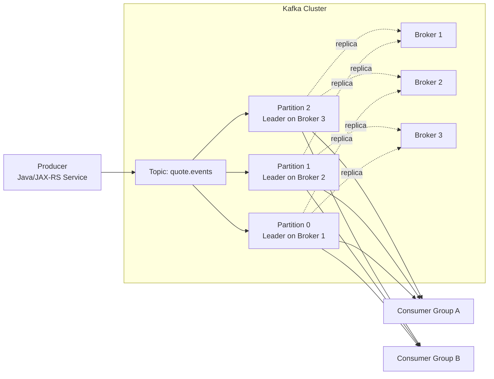
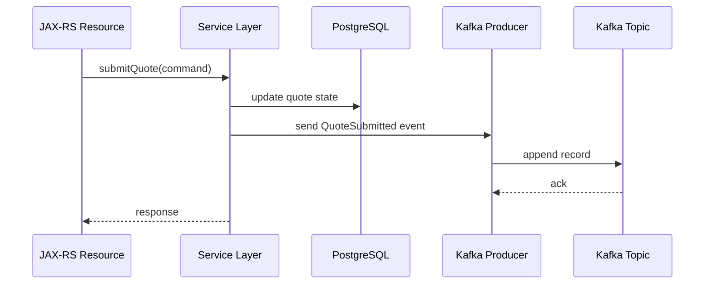
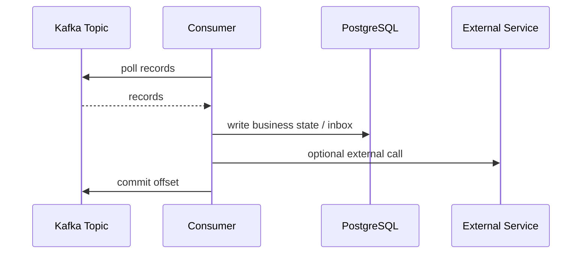
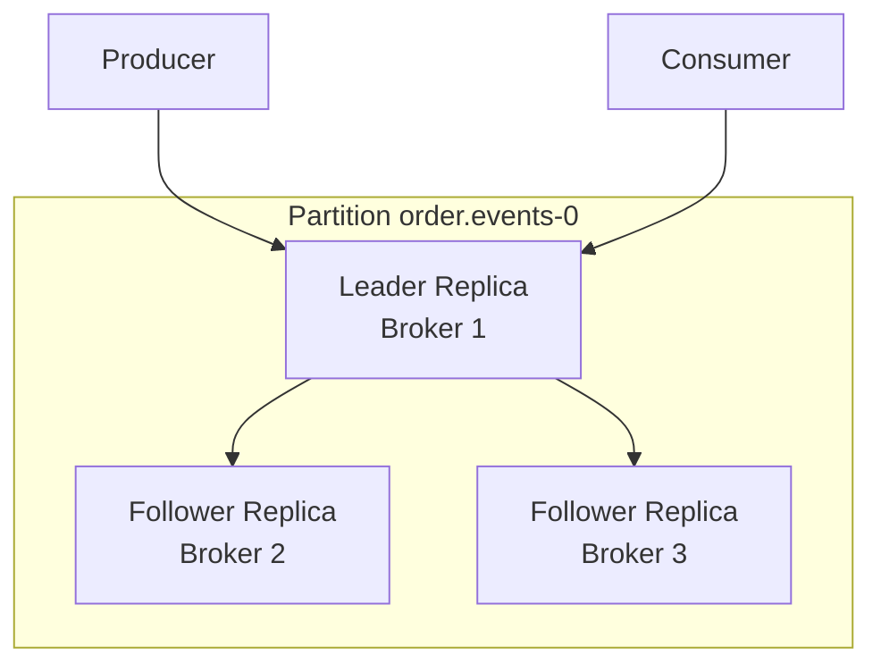
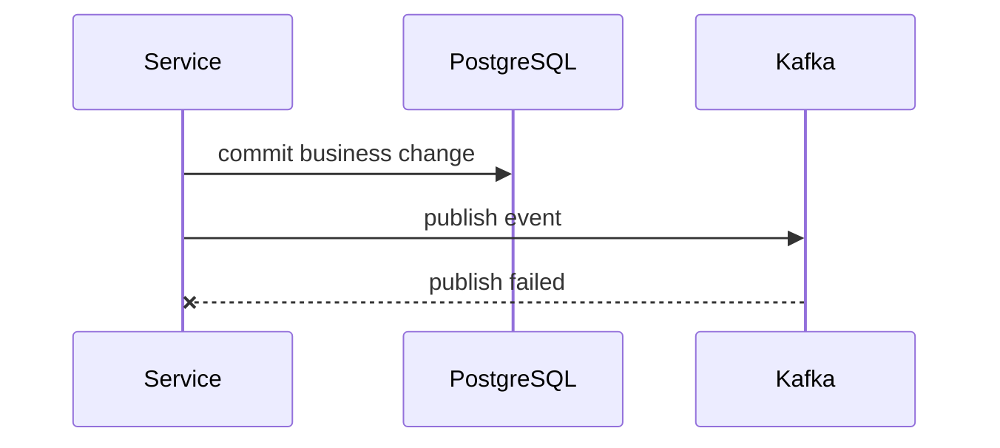

# Part 003 — Kafka Architecture Mental Model

## 1. Tujuan Part Ini

Part ini membangun mental model arsitektur Kafka dari dalam: **broker, cluster, topic, partition, offset, log segment, replication, leader/follower, ISR, controller, metadata, retention, compaction, dan KRaft**.

Tujuan utamanya bukan menghafal istilah. Tujuannya adalah bisa menjawab pertanyaan production seperti:

- kenapa consumer hanya bisa parallel sebanyak jumlah partition tertentu?
- kenapa ordering hanya aman dalam satu partition?
- kenapa consumer lag bisa naik walaupun broker sehat?
- kenapa broker down tidak selalu berarti topic unavailable?
- kenapa replication factor tidak otomatis berarti tidak ada data loss?
- kenapa retention salah bisa menghancurkan replay capability?
- kenapa Kafka tidak berperilaku seperti queue biasa?

Mental model arsitektur Kafka adalah fondasi untuk semua part berikutnya: topic design, partitioning, producer correctness, consumer correctness, retry, DLQ, schema, outbox, CDC, Streams, observability, performance, dan disaster recovery.

## 2. Kafka dalam Satu Gambar Mental

Kafka bisa dipahami sebagai cluster broker yang menyimpan topic. Topic dipecah menjadi partition. Setiap partition adalah log append-only. Producer menulis record ke partition. Consumer membaca record dari offset tertentu.



Dari gambar ini, ada beberapa invariant penting:

- topic bukan satu file tunggal; topic adalah kumpulan partition
- partition adalah unit ordering
- partition adalah unit parallelism consumer
- partition adalah unit replication leadership
- offset unik hanya dalam partition, bukan dalam seluruh topic
- consumer group menyimpan progress baca sendiri
- beberapa consumer group dapat membaca topic yang sama secara independen
- data tidak hilang hanya karena sudah dibaca consumer
- data hilang karena retention/compaction/delete policy atau failure storage/replication

## 3. Broker

Broker adalah server Kafka. Broker menerima request dari producer, consumer, admin client, Kafka Connect, Kafka Streams, dan ksqlDB.

Broker bertanggung jawab untuk:

- menerima record dari producer
- menyimpan record ke disk
- melayani fetch request dari consumer
- mereplikasi partition ke broker lain
- menjaga metadata topic/partition
- menjalankan leader partition tertentu
- mengirim response ack ke producer
- berpartisipasi dalam cluster quorum/controller coordination

Dalam production, broker bukan sekadar “node Kafka”. Broker adalah kombinasi dari:

- CPU
- memory
- disk
- page cache
- network throughput
- broker configuration
- JVM runtime
- storage latency
- replication traffic
- client request traffic

Jika Kafka lambat, root cause bisa berada di producer, consumer, topic design, partition skew, broker disk, broker network, ISR, controller, DNS, TLS, ACL, atau downstream database consumer. Jangan langsung menyimpulkan “Kafka lambat”.

## 4. Cluster

Kafka cluster adalah sekumpulan broker yang bekerja sebagai satu platform event streaming.

Cluster menyediakan:

- horizontal scalability
- fault tolerance
- partition placement
- replication
- metadata management
- client routing

Producer dan consumer tidak harus tahu semua broker secara manual. Mereka biasanya diberi `bootstrap.servers`, lalu client mengambil metadata cluster dari broker bootstrap tersebut.

```text
bootstrap.servers = broker-a:9092,broker-b:9092,broker-c:9092
```

Bootstrap server bukan load balancer semantic. Ia adalah entry point untuk mendapatkan metadata. Setelah metadata didapat, client akan berbicara langsung dengan broker leader partition yang relevan.

Implikasi debugging:

- berhasil connect ke bootstrap server belum tentu bisa connect ke semua broker
- advertised listener yang salah bisa membuat client mendapat alamat broker yang tidak bisa dijangkau
- DNS/NetworkPolicy/firewall/security group bisa membuat sebagian broker unreachable
- TLS hostname mismatch bisa muncul setelah metadata fetch, bukan saat koneksi pertama saja

## 5. Topic

Topic adalah nama log logical tempat record dipublish.

Contoh topic:

```text
quote.events
order.events
catalog.product-events
pricing.price-changed
approval.decision-events
fulfillment.commands
order.retry.5m
order.dlq
```

Topic bukan sekadar channel. Topic adalah contract boundary.

Keputusan topic menentukan:

- siapa owner event
- siapa consumer potensial
- apakah event bisa direplay
- bagaimana retention diterapkan
- apakah compaction diperlukan
- bagaimana partition key dipilih
- bagaimana ACL diterapkan
- bagaimana schema subject dinamai
- bagaimana observability dibangun
- bagaimana blast radius failure dibatasi

Topic design yang buruk biasanya baru terasa saat:

- consumer bertambah banyak
- schema berubah
- replay dibutuhkan
- ordering menjadi penting
- topic terlalu besar untuk diproses ulang
- satu producer membuat semua consumer rusak
- security/privacy review menemukan event payload terlalu luas

## 6. Partition

Partition adalah log append-only fisik/logical di dalam topic.

Jika topic `order.events` memiliki 3 partition, maka Kafka menyimpan log seperti:

```text
order.events-0
order.events-1
order.events-2
```

Setiap partition punya offset sendiri:

```text
order.events-0: offset 0,1,2,3,...
order.events-1: offset 0,1,2,3,...
order.events-2: offset 0,1,2,3,...
```

Offset `10` di partition 0 berbeda dari offset `10` di partition 1.

Partition adalah pusat dari tiga hal:

1. ordering
2. parallelism
3. scaling/storage distribution

### 6.1 Partition sebagai Unit Ordering

Kafka menjamin urutan record dalam satu partition. Kafka tidak menjamin urutan global antar partition.

Jika semua event untuk `orderId=ORD-123` masuk ke partition yang sama, urutan event untuk order tersebut bisa dijaga.

```text
partition 1:
  offset 20 -> OrderCreated(ORD-123)
  offset 21 -> OrderValidated(ORD-123)
  offset 22 -> OrderSubmitted(ORD-123)
```

Namun jika event untuk aggregate yang sama tersebar ke beberapa partition, ordering bisnis bisa rusak.

```text
partition 0:
  offset 10 -> OrderSubmitted(ORD-123)

partition 2:
  offset 8 -> OrderCreated(ORD-123)
```

Consumer yang membaca parallel tidak punya guarantee bahwa `OrderCreated` diproses sebelum `OrderSubmitted`.

### 6.2 Partition sebagai Unit Parallelism

Dalam satu consumer group, satu partition hanya dapat di-assign ke satu consumer instance pada satu waktu.

Jika topic punya 3 partition dan consumer group punya 5 instance:

```text
partition 0 -> consumer A
partition 1 -> consumer B
partition 2 -> consumer C
consumer D -> idle
consumer E -> idle
```

Menambah consumer replica di atas jumlah partition tidak menambah throughput untuk topic tersebut.

Untuk Java/JAX-RS backend di Kubernetes, ini penting:

- HPA consumer tidak selalu menyelesaikan lag
- scaling pod consumer harus dibandingkan dengan partition count
- consumer lambat bisa disebabkan satu hot partition, bukan kurang replica global
- rolling update bisa memicu rebalance group

### 6.3 Partition sebagai Unit Storage Distribution

Partition disebar ke broker. Jika topic punya banyak partition, data dan traffic bisa tersebar. Namun terlalu banyak partition juga menambah overhead:

- metadata lebih besar
- file handle lebih banyak
- recovery lebih berat
- leader election lebih kompleks
- controller/broker overhead naik
- rebalance consumer lebih mahal

Partition count adalah keputusan arsitektur, bukan angka asal.

## 7. Offset

Offset adalah posisi record di dalam partition. Offset bersifat monoton naik.

```text
quote.events-0
  offset 0 -> QuoteCreated
  offset 1 -> QuotePriced
  offset 2 -> QuoteSubmitted
```

Consumer menyimpan offset yang sudah diproses atau akan dibaca berikutnya, tergantung commit strategy.

Poin penting:

- offset bukan ID bisnis
- offset bukan event ID global
- offset bukan bukti processing berhasil secara bisnis
- offset commit bukan transaction commit database
- offset dapat di-reset jika retention masih menyimpan data
- offset out of range terjadi jika consumer mencoba membaca offset yang sudah tidak tersedia

Dalam incident, jangan hanya bertanya:

> “Offset-nya berapa?”

Tanya juga:

- partition mana?
- consumer group mana?
- offset committed atau current position?
- record sudah diproses atau baru dibaca?
- database side effect sudah terjadi?
- event ID/idempotency key apa?
- apakah offset masih dalam retention?

## 8. Log dan Segment

Kafka menyimpan partition sebagai log. Log dibagi menjadi segment file.

```text
partition log:
  segment-00000000000000000000.log
  segment-00000000000000001000.log
  segment-00000000000000002000.log
```

Segment memudahkan Kafka melakukan:

- retention delete
- compaction
- indexing
- recovery
- sequential disk write

Kafka sangat efisien karena memanfaatkan append-only write dan page cache. Namun efisiensi ini bergantung pada storage dan access pattern.

Failure/performance concern:

- disk penuh membuat broker bermasalah
- segment terlalu kecil/terlalu besar memengaruhi cleanup dan recovery
- retention salah bisa menghapus data sebelum consumer mengejar lag
- compaction salah bisa menghapus history yang masih dibutuhkan replay
- storage latency tinggi memengaruhi produce/fetch latency

## 9. Producer

Producer adalah client yang menulis record ke Kafka.

Producer menentukan:

- topic tujuan
- key
- value
- header
- partition target, langsung atau via partitioner
- serializer
- ack requirement
- retry behavior
- batching
- compression
- timeout
- idempotent/transactional behavior

Dalam Java/JAX-RS service, producer biasanya dipanggil dari service layer atau publisher abstraction.

Flow sederhana:



Flow di atas terlihat sederhana tetapi punya dual-write risk: database commit dan Kafka publish tidak berada dalam atomic transaction yang sama. Karena itu producer architecture harus dibahas bersama outbox/CDC, bukan hanya `producer.send()`.

## 10. Consumer

Consumer adalah client yang membaca record dari Kafka.

Consumer menentukan:

- topic subscription
- consumer group
- poll loop
- deserializer
- offset commit strategy
- error handling
- retry/DLQ
- idempotency
- processing concurrency
- shutdown behavior

Consumer bukan sekadar callback. Consumer adalah state machine yang berinteraksi dengan Kafka group coordinator, offset store, heartbeat, partition assignment, database transaction, retry mechanism, dan downstream side effect.

Flow sederhana:



Correctness concern:

- commit sebelum processing selesai dapat menyebabkan lost processing
- commit setelah processing selesai dapat menyebabkan duplicate processing saat crash
- duplicate harus dianggap normal
- idempotency bukan optional
- external call dalam consumer perlu retry/dedup/compensation
- consumer lag tidak selalu berarti Kafka lambat; bisa berarti handler lambat

## 11. Consumer Group

Consumer group adalah sekumpulan consumer instance yang bekerja sama membaca topic.

Dalam satu group:

- setiap partition diassign ke maksimal satu consumer aktif
- offset disimpan per group, per topic, per partition
- group dapat scale horizontal sampai jumlah partition
- rebalance terjadi saat membership berubah atau assignment berubah

Contoh:

```text
Topic: order.events, partitions: 4
Consumer group: billing-service

consumer-1 -> partition 0,1
consumer-2 -> partition 2
consumer-3 -> partition 3
```

Consumer group lain bisa membaca topic yang sama secara independen:

```text
billing-service group       -> reads order.events
fulfillment-service group   -> reads order.events
audit-service group         -> reads order.events
analytics-service group     -> reads order.events
```

Setiap group punya offset masing-masing.

Implikasi:

- menambah consumer group menambah fanout processing
- setiap group bisa punya lag berbeda
- satu slow consumer group tidak menahan group lain
- topic retention harus cukup untuk consumer group paling lambat yang masih penting
- consumer group ID adalah contract operational

## 12. Group Coordinator

Group coordinator adalah broker yang mengelola consumer group tertentu.

Coordinator bertanggung jawab untuk:

- menerima join group
- menerima heartbeat
- memicu rebalance
- menyimpan offset commit ke internal topic `__consumer_offsets`
- melacak membership group

Jika consumer tidak heartbeat tepat waktu, coordinator menganggap consumer mati dan memicu rebalance.

Penyebab umum rebalance storm:

- consumer processing terlalu lama melewati `max.poll.interval.ms`
- pod sering restart
- liveness probe terlalu agresif
- CPU throttling membuat heartbeat/poll terlambat
- deployment rolling update tanpa graceful shutdown
- network issue antara consumer dan broker
- consumer instance count flapping karena HPA

Rebalance bukan sekadar noise. Rebalance dapat menyebabkan:

- stop-the-world processing sementara
- duplicate processing
- latency spike
- lag naik
- state restore untuk Kafka Streams
- batch in-flight gagal diproses konsisten jika shutdown buruk

## 13. Controller

Controller adalah komponen cluster yang mengelola metadata dan leadership partition.

Controller bertugas antara lain:

- menentukan broker mana leader untuk partition
- menangani broker join/leave
- menangani leader election
- mengelola metadata topic/partition
- berkoordinasi dengan cluster quorum

Di Kafka modern, metadata dikelola dengan KRaft. Di Kafka lama, metadata dikelola dengan ZooKeeper.

Sebagai application engineer, Anda tidak selalu perlu mengoperasikan controller. Namun Anda harus paham dampaknya:

- controller instability dapat menyebabkan metadata request lambat
- leader election massal dapat menyebabkan produce/fetch error sementara
- broker restart banyak sekaligus dapat membuat cluster tidak stabil
- topic creation/deletion/config changes bergantung pada metadata path

## 14. Leader Partition dan Follower Replica

Setiap partition punya satu leader dan beberapa follower replica.

Producer dan consumer biasanya berinteraksi dengan leader partition.



Leader menerima write. Follower mereplikasi data dari leader. Jika leader broker gagal, salah satu follower yang eligible dapat dipromosikan menjadi leader.

Correctness bergantung pada:

- replication factor
- min in-sync replicas
- producer acks
- unclean leader election setting
- broker durability
- network stability

Replication factor 3 tidak otomatis berarti tidak ada data loss. Jika producer menggunakan `acks=1`, record bisa dianggap sukses saat leader menerima record, meskipun follower belum mereplikasi. Jika leader gagal sebelum replica sync, data bisa hilang tergantung konfigurasi.

## 15. ISR — In-Sync Replicas

ISR adalah daftar replica yang dianggap cukup up-to-date dengan leader.

Jika partition punya replication factor 3:

```text
leader: broker-1
followers: broker-2, broker-3
ISR: broker-1, broker-2, broker-3
```

Jika broker-3 tertinggal jauh:

```text
ISR: broker-1, broker-2
```

Jika producer menggunakan:

```text
acks=all
min.insync.replicas=2
```

Maka write dianggap sukses jika minimal dua replica in-sync mengakui write.

Jika ISR turun di bawah `min.insync.replicas`, producer bisa menerima error seperti not enough replicas.

Trade-off:

- `acks=all` + min ISR kuat meningkatkan durability
- tetapi availability write bisa turun saat replica bermasalah
- `acks=1` meningkatkan availability/latency tetapi durability lebih lemah

Untuk enterprise order/quote event, durability dan correctness biasanya lebih penting daripada latency mikrodetik.

## 16. Replication Factor

Replication factor menentukan jumlah replica untuk setiap partition.

Jika RF=3, setiap partition punya tiga replica pada broker berbeda.

Tujuan replication:

- broker failure tolerance
- read/write continuity saat leader failover
- data durability

Namun RF bukan magic shield.

Risiko tetap ada jika:

- semua replica ada di node/rack/storage failure domain yang sama
- min ISR terlalu rendah
- producer ack terlalu lemah
- unclean leader election diaktifkan sembarangan
- disk corruption tidak terdeteksi cepat
- operator melakukan rolling restart terlalu agresif
- replication lag tinggi

Internal review harus selalu menghubungkan RF dengan failure domain, bukan hanya angka.

## 17. Retention

Retention menentukan berapa lama record disimpan.

Retention bisa berdasarkan:

- waktu
- ukuran
- kombinasi keduanya

Contoh:

```text
retention.ms = 604800000   # 7 hari
retention.bytes = ...
```

Retention adalah keputusan bisnis dan operasional.

Pertanyaan penting:

- berapa lama consumer boleh tertinggal?
- apakah event perlu direplay untuk rebuild projection?
- apakah audit membutuhkan history lebih lama?
- apakah payload mengandung data sensitif?
- apakah storage capacity cukup?
- apakah retention berbeda per topic?

Jika retention terlalu pendek:

- consumer tertinggal bisa kehilangan data
- replay tidak mungkin
- projection rebuild gagal
- reconciliation lebih sulit

Jika retention terlalu panjang:

- storage cost naik
- privacy/compliance risk naik
- broker disk pressure naik
- recovery lebih berat

## 18. Compaction

Compaction menyimpan record terbaru untuk setiap key, bukan semua history.

Contoh compact topic:

```text
key=product-1 -> ProductCreated(v1)
key=product-1 -> ProductUpdated(v2)
key=product-1 -> ProductUpdated(v3)
```

Setelah compaction, Kafka boleh menyimpan hanya record terbaru untuk key tersebut, plus tombstone rules.

Use case compact topic:

- latest state by key
- lookup table
- materialized reference data
- changelog topic Kafka Streams
- cache reconstruction

Compaction bukan pengganti audit log. Jika Anda butuh seluruh history perubahan order, compact topic bisa menghapus intermediate history yang diperlukan audit.

Correctness concern:

- event harus punya key
- null key tidak berguna untuk compaction state per key
- tombstone perlu dipahami
- consumer baru hanya melihat latest state, bukan semua transition
- replay dari compact topic berbeda dari replay event history lengkap

## 19. KRaft

KRaft adalah mode metadata quorum Kafka modern yang menggantikan ZooKeeper.

Dengan KRaft, Kafka menggunakan internal quorum controller untuk metadata management.

Sebagai backend engineer, hal yang perlu dipahami:

- cluster metadata tidak lagi bergantung pada ZooKeeper pada deployment modern
- controller quorum menjadi komponen critical
- upgrade path dari ZooKeeper ke KRaft adalah tanggung jawab platform/SRE
- debugging metadata issue perlu tahu mode cluster yang digunakan

Jangan mengasumsikan environment internal sudah KRaft atau masih ZooKeeper. Itu harus diverifikasi.

## 20. ZooKeeper Legacy Awareness

Kafka versi lama memakai ZooKeeper untuk metadata, broker coordination, dan controller election.

Anda tidak perlu mendalami ZooKeeper untuk menulis consumer/producer, tetapi perlu mengenali dampaknya jika environment masih legacy:

- ada dependency operasional tambahan
- upgrade Kafka punya constraint berbeda
- metadata issue bisa berasal dari ZooKeeper
- monitoring harus mencakup ZooKeeper health
- security hardening harus mencakup ZooKeeper path

Internal verification harus mencatat mode cluster:

```text
[ ] KRaft
[ ] ZooKeeper legacy
[ ] Managed Kafka abstraction hides this detail
```

## 21. Metadata

Kafka client bergantung pada metadata untuk tahu:

- topic ada atau tidak
- jumlah partition
- leader broker per partition
- broker address
- cluster ID
- feature/protocol capability

Producer dan consumer secara periodik refresh metadata.

Failure yang terlihat seperti application bug kadang sebenarnya metadata issue:

- unknown topic or partition
- stale metadata
- leader not available
- not leader or follower
- broker address tidak reachable karena advertised listener salah
- authorization error untuk describe topic

Debugging harus memisahkan:

- client tidak bisa connect
- client bisa connect tapi tidak bisa fetch metadata
- metadata benar tetapi leader broker tidak reachable
- metadata benar tetapi ACL tidak cukup
- metadata benar tetapi topic belum dibuat

## 22. Cluster Quorum

Cluster quorum menentukan kemampuan cluster membuat keputusan metadata/leadership.

Dalam KRaft, controller quorum sangat penting. Dalam ZooKeeper mode, ZooKeeper ensemble berperan sebagai coordination layer.

Application engineer biasanya tidak mengubah quorum. Namun harus memahami dampak high-level:

- kehilangan quorum dapat mengganggu metadata operations
- broker masih menyimpan data, tetapi cluster management bisa terganggu
- topic creation/config changes bisa gagal
- leader election bisa bermasalah
- incident cluster-level perlu platform/SRE involvement

Jika Kafka adalah backbone CPQ/order event, cluster quorum bukan detail ops kecil. Ia menentukan kemampuan sistem memulihkan diri saat broker/node failure.

## 23. Broker Failure Model

Broker failure bukan satu jenis masalah. Beberapa pola umum:

### 23.1 Broker Hard Down

Broker mati total.

Dampak:

- leader partition di broker tersebut perlu failover
- partition tanpa ISR cukup bisa unavailable
- producer dapat error sementara
- consumer dapat rebalance/metadata refresh

### 23.2 Broker Slow

Broker hidup tetapi lambat.

Penyebab:

- disk latency tinggi
- GC pause
- CPU throttling
- network saturation
- page cache pressure
- TLS overhead
- too many partitions

Dampak broker slow sering lebih berbahaya daripada broker down karena menyebabkan timeout sporadis, retry storm, lag naik, dan diagnosis sulit.

### 23.3 Broker Network Partition

Broker terisolasi sebagian.

Dampak:

- replica tertinggal
- ISR shrink
- client timeout
- metadata inconsistency sementara
- failover behavior tergantung cluster dan config

### 23.4 Disk Pressure

Disk hampir penuh atau latency tinggi.

Dampak:

- append latency naik
- retention cleanup tidak cukup cepat
- broker crash risk
- partition offline risk
- cluster-wide pressure jika replication traffic meningkat

### 23.5 Controller Instability

Controller sering berubah atau lambat.

Dampak:

- metadata request lambat
- leader election delay
- topic operation gagal/lambat
- client error spike

## 24. Kenapa Kafka Berbeda dari Queue System

Queue tradisional sering punya model:

```text
producer -> queue -> consumer -> ack -> message removed
```

Kafka punya model:

```text
producer -> partition log -> consumer reads offset -> offset committed separately -> data retained by policy
```

Perbedaan penting:

| Aspek | Queue Tradisional | Kafka |
|---|---|---|
| Storage model | Queue of messages | Append-only partitioned log |
| Message removal | Biasanya setelah ack | Berdasarkan retention/compaction |
| Replay | Terbatas/tidak natural | Natural selama data retained |
| Consumer progress | Broker-centric ack | Offset per consumer group |
| Fanout | Biasanya via exchange/subscription | Banyak consumer group independen |
| Ordering | Queue/order-specific | Per partition |
| Scaling | Competing consumers | Partition-based parallelism |
| Contract concern | Message route | Event log and schema contract |

Kesalahan besar adalah memperlakukan Kafka seperti queue biasa:

- menganggap message hilang setelah dibaca
- menganggap satu topic punya global ordering
- menganggap retry cukup dengan throw exception terus
- menganggap offset commit sama dengan business success
- menganggap consumer group seperti subscriber individual tanpa konsekuensi partition assignment
- menganggap replay selalu aman

## 25. Dampak ke Java/JAX-RS Backend

Untuk service Java/JAX-RS, arsitektur Kafka memengaruhi desain aplikasi:

### 25.1 Resource Layer Tidak Boleh Menjadi Kafka Boundary Utama

JAX-RS resource harus menangani HTTP contract. Event creation sebaiknya berada di service/domain/application layer agar transaction boundary jelas.

```text
Resource -> Application Service -> Domain/DB Transaction -> Outbox/Event Publisher
```

Jika resource langsung produce event, risiko:

- event publish sebelum business state valid
- metadata HTTP tidak konsisten
- transaction tidak jelas
- retry HTTP dapat menghasilkan duplicate event
- testing sulit

### 25.2 Offset Bukan Business State

Consumer Java harus menyimpan business state sendiri. Jangan mengandalkan offset sebagai satu-satunya bukti bahwa order sudah diproses.

Gunakan:

- event ID
- idempotency key
- inbox table
- processed event table
- state transition guard

### 25.3 Consumer Threading Harus Disiplin

KafkaConsumer tidak boleh dipakai sembarangan lintas thread. Jika processing paralel di executor, offset commit menjadi lebih kompleks.

Pertanyaan review:

- apakah record diproses sequential atau parallel?
- bagaimana offset commit menunggu semua record selesai?
- bagaimana pause/resume diterapkan untuk backpressure?
- apa yang terjadi saat shutdown?

## 26. Dampak ke PostgreSQL, MyBatis, dan JDBC

Kafka architecture memaksa kita memikirkan transaction boundary.

Masalah umum:



Database sudah berubah, event gagal terbit. Downstream tidak tahu perubahan.

Solusi umum:

- transactional outbox
- CDC/Debezium
- reconciliation
- retryable publisher
- idempotent consumer

Dengan MyBatis/JDBC, pastikan:

- mapper call berada dalam transaction yang sama
- insert business row dan outbox row atomic
- connection/transaction management jelas
- exception handling tidak swallow failure
- event payload dibangun dari state final yang committed
- migration outbox/inbox dilakukan sebelum code release yang menggunakannya

## 27. Dampak ke Microservices dan Distributed Consistency

Kafka membuat service lebih loosely coupled secara runtime, tetapi tidak otomatis loosely coupled secara contract.

Kafka mengurangi spatial coupling:

- producer tidak perlu tahu semua consumer
- consumer bisa ditambah tanpa mengubah producer

Namun Kafka dapat menambah contract coupling:

- consumer bergantung pada schema event
- consumer bergantung pada semantic field
- consumer bergantung pada ordering per key
- consumer bergantung pada retention untuk replay
- consumer bergantung pada metadata seperti tenant/correlation ID

Distributed consistency concern:

- event terlambat
- event duplicate
- event out-of-order
- event hilang akibat retention atau publish failure
- consumer gagal di tengah processing
- downstream projection stale
- saga stuck

Kafka bukan penghapus kompleksitas distributed system. Kafka memindahkan kompleksitas dari synchronous call stack ke asynchronous event lifecycle.

## 28. Dampak ke Kubernetes, AWS, Azure, On-Prem

Kafka architecture terlihat berbeda tergantung deployment.

### 28.1 Kafka Client di Kubernetes

Concern utama:

- DNS bootstrap server
- advertised listener reachable dari pod
- NetworkPolicy
- Secret/certificate mount
- rolling update dan rebalance
- graceful shutdown
- CPU throttling pada consumer
- HPA vs partition count

### 28.2 Managed Kafka di Cloud

Concern utama:

- auth mechanism
- private endpoint/VPC/VNet
- broker metrics visibility
- topic/config control terbatas
- upgrade responsibility
- cross-account/cross-region access
- cost model

### 28.3 Self-Managed On-Prem

Concern utama:

- disk layout
- OS tuning
- certificate lifecycle
- firewall
- patching
- broker upgrade
- monitoring stack
- operational ownership

Jangan mengasumsikan satu deployment pattern. Selalu verifikasi environment.

## 29. Failure Mode yang Harus Anda Hafal

### 29.1 Producer Failure

- timeout
- authorization failure
- serialization failure
- not enough replicas
- leader not available
- record too large
- metadata stale
- network unreachable
- broker overloaded

### 29.2 Consumer Failure

- deserialization failure
- poison event
- handler exception
- DB deadlock
- slow processing
- max poll interval exceeded
- rebalance loop
- offset out of range
- commit failed
- duplicate processing

### 29.3 Broker/Cluster Failure

- broker down
- under-replicated partitions
- offline partitions
- ISR shrink
- disk full
- controller instability
- request latency spike
- replication lag

### 29.4 Architecture Failure

- wrong partition key
- topic too broad
- schema breaking change
- retention too short
- event metadata missing
- no idempotency
- no DLQ/replay path
- no owner for event contract

## 30. Cara Mendeteksi Failure

Minimal observability yang harus ada:

- producer send rate
- producer error rate
- producer retry rate
- producer request latency
- consumer lag per group/topic/partition
- consumer processing latency
- consumer poll latency
- rebalance count/rate
- DLQ rate
- broker request latency
- under-replicated partitions
- offline partitions
- ISR shrink/expand
- disk usage
- network throughput
- topic throughput
- partition skew

Untuk Java service:

- structured log dengan event ID, topic, partition, offset, key, correlation ID
- tracing dari HTTP request ke event publish
- tracing dari event consume ke DB write/downstream call
- metric handler duration
- error classification transient/permanent

## 31. Cara Men-debug Failure secara Aman

Urutan debugging yang sehat:

1. Tentukan symptom: lag, error, missing event, duplicate, out-of-order, DLQ spike, timeout.
2. Identifikasi scope: topic, partition, consumer group, service, environment, time window.
3. Cek producer: apakah event benar-benar terkirim?
4. Cek broker/topic: apakah record ada, partition mana, offset berapa?
5. Cek consumer group: lag, assignment, rebalance, committed offset.
6. Cek consumer log: deserialization, handler, DB, external call.
7. Cek idempotency/inbox: apakah event sudah pernah diproses?
8. Cek schema compatibility.
9. Cek network/auth jika error client-level.
10. Jangan reset offset atau replay sebelum tahu idempotency dan blast radius.

Production-safe rule:

> Offset reset, replay, delete topic, change retention, and manual DLQ replay are data-impacting actions. Treat them like production database repair.

## 32. Trade-off Utama

| Keputusan | Benefit | Risiko |
|---|---|---|
| Banyak partition | Parallelism naik | Ordering lebih sulit, overhead naik |
| Retention panjang | Replay/audit lebih kuat | Storage/privacy cost naik |
| `acks=all` | Durability lebih kuat | Latency/error saat ISR turun |
| Compaction | Latest-state efficient | History hilang |
| Banyak consumer group | Fanout mudah | Contract blast radius naik |
| Self-managed Kafka | Kontrol penuh | Operational burden tinggi |
| Managed Kafka | Ops lebih ringan | Control/visibility terbatas |
| Async event flow | Loose runtime coupling | Eventual consistency dan debugging lebih sulit |

## 33. Correctness Concern

Checklist correctness arsitektur Kafka:

- Apakah event punya key yang sesuai aggregate ordering?
- Apakah consumer idempotent?
- Apakah offset commit dilakukan setelah side effect aman?
- Apakah producer aman dari dual-write problem?
- Apakah schema compatible?
- Apakah retention cukup untuk replay dan lag recovery?
- Apakah DLQ punya metadata cukup untuk replay?
- Apakah event metadata cukup untuk traceability?
- Apakah consumer bisa handle duplicate/out-of-order?
- Apakah topology punya owner jelas?

## 34. Performance Concern

Checklist performance:

- partition count cukup untuk throughput?
- ada hot partition?
- producer batching/compression sesuai?
- consumer processing latency lebih besar dari fetch latency?
- broker disk/network/CPU bottleneck?
- replication factor dan min ISR memengaruhi latency?
- payload terlalu besar?
- consumer DB write lambat?
- rebalance sering membuat throughput turun?
- downstream service membuat consumer blocking?

## 35. Security dan Privacy Concern

Checklist security/privacy:

- auth mechanism jelas?
- TLS/mTLS/SASL dikonfigurasi benar?
- ACL topic/group least privilege?
- Schema Registry dan Kafka Connect diamankan?
- event payload mengandung PII?
- header mengandung PII?
- log consumer/producer meredact sensitive field?
- DLQ menyimpan data sensitif?
- retention sesuai privacy requirement?
- replay access dibatasi?

## 36. Observability Concern

Checklist observability:

- bisa trace HTTP request ke event?
- bisa trace event ke consumer side effect?
- log punya topic/partition/offset/key/event ID/correlation ID?
- dashboard consumer lag per partition?
- dashboard producer error/retry?
- alert under-replicated partition?
- alert DLQ spike?
- alert consumer stuck/rebalance storm?
- dashboard outbox/CDC lag jika digunakan?
- runbook terhubung dari alert?

## 37. PR Review Checklist

Gunakan checklist ini saat review perubahan Kafka:

### Event/Topic

- Apakah topic sudah ada atau perlu dibuat?
- Apakah naming mengikuti convention?
- Apakah owner jelas?
- Apakah retention/compaction sesuai use case?
- Apakah partition count cukup dan tidak berlebihan?

### Producer

- Apakah partition key benar?
- Apakah event publish aman terhadap DB transaction?
- Apakah outbox diperlukan?
- Apakah metadata lengkap?
- Apakah retry producer aman?

### Consumer

- Apakah consumer idempotent?
- Apakah offset commit strategy benar?
- Apakah error handling membedakan transient/permanent?
- Apakah DLQ/retry path jelas?
- Apakah graceful shutdown aman?

### Schema

- Apakah schema compatible?
- Apakah field baru punya default/optional semantics?
- Apakah consumer lama tetap bisa membaca?
- Apakah schema test ada di CI?

### Ops

- Apakah metrics/log/tracing cukup?
- Apakah dashboard/alert diperbarui?
- Apakah runbook tersedia?
- Apakah security/ACL diperbarui?
- Apakah deployment Kubernetes aman dari rebalance storm?

## 38. Internal Verification Checklist

Gunakan checklist ini di CSG/team tanpa mengasumsikan detail internal:

### Cluster/Runtime

- Kafka deployment: managed cloud, Kubernetes, VM, on-prem, hybrid?
- Cluster mode: KRaft, ZooKeeper legacy, atau abstraction managed service?
- Broker count dan failure domain?
- Replication factor default?
- `min.insync.replicas` default?
- Unclean leader election policy?
- Retention default?
- Compaction usage?

### Topic/Partition

- Daftar topic production?
- Topic owner?
- Partition count per topic?
- Topic naming convention?
- Topic lifecycle/deprecation policy?
- Retry/DLQ topic convention?

### Client

- Kafka Java client version?
- Producer config baseline?
- Consumer config baseline?
- Shared internal library/wrapper?
- Schema Registry client?
- Observability instrumentation?

### Operations

- Consumer lag dashboard?
- Broker dashboard?
- DLQ dashboard?
- Outbox/CDC lag dashboard?
- Incident notes Kafka?
- Runbook broker/consumer/producer/DLQ/replay?

### Security

- Auth mechanism?
- TLS/mTLS?
- ACL management?
- Secret rotation?
- Schema Registry/Kafka Connect security?

## 39. Kesimpulan

Kafka architecture harus dipahami sebagai kombinasi dari log, partition, offset, replication, metadata, dan client coordination.

Mental model paling penting:

- topic adalah contract boundary
- partition adalah unit ordering dan parallelism
- offset adalah posisi baca, bukan bukti business success
- broker menyimpan log, bukan sekadar melewatkan message
- replication meningkatkan durability tetapi tetap bergantung pada ISR, ack, dan failure domain
- retention/compaction menentukan kemampuan replay dan risiko data loss
- consumer group adalah mekanisme scale dan offset isolation
- Kafka berbeda dari queue karena data tetap ada sampai policy menghapusnya

Sebagai senior backend engineer, Anda tidak perlu menjadi Kafka platform operator penuh. Tetapi Anda harus cukup paham arsitektur Kafka untuk mereview event design, mendeteksi correctness risk, membaca dashboard, men-debug incident, dan bertanya dengan tepat ke platform/SRE/backend/data team.
