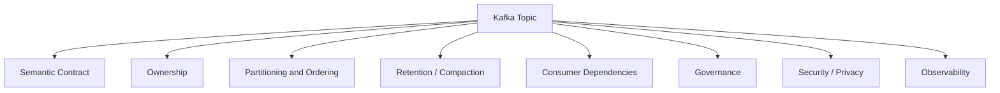
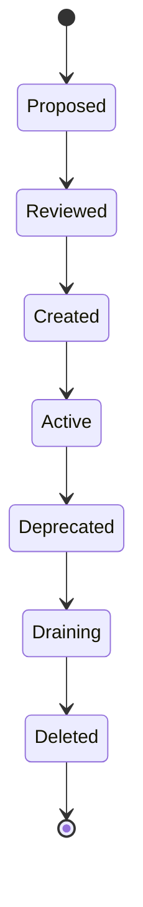

# Part 004 — Topic Design and Event Taxonomy

## 1. Tujuan Part Ini

Part ini membahas **topic design** dan **event taxonomy**. Ini adalah salah satu area paling sering diremehkan dalam Kafka-based systems.

Banyak tim mulai dengan pola sederhana:

```text
service-a-events
service-b-events
all-order-events
event-topic
notification-topic
```

Awalnya berjalan. Masalah muncul saat:

- consumer bertambah banyak
- event schema berubah
- ordering menjadi penting
- retry/DLQ perlu distandardisasi
- retention berbeda per jenis event
- audit dan privacy review masuk
- multi-tenant traffic naik
- satu topic menjadi terlalu besar
- ownership event tidak jelas
- replay merusak state downstream
- beberapa service mengirim event yang mirip tapi maknanya berbeda

Topic bukan hanya tempat menaruh message. Topic adalah **operational, contractual, security, performance, and lifecycle boundary**.

Tujuan part ini adalah membuat Anda mampu mendesain dan mereview topic seperti senior engineer: jelas ownership-nya, jelas semantics-nya, jelas lifecycle-nya, jelas failure mode-nya, dan jelas bagaimana topic tersebut akan dioperasikan di production.

## 2. Core Mental Model

Kafka topic harus menjawab lima pertanyaan utama:

1. **Apa jenis fakta atau intent yang mengalir di topic ini?**
2. **Siapa owner semantic dan schema-nya?**
3. **Siapa consumer yang bergantung pada topic ini?**
4. **Apa policy operational-nya: partition, retention, compaction, security, DLQ?**
5. **Apa lifecycle-nya: creation, evolution, deprecation, deletion?**

Jika sebuah topic tidak bisa menjawab pertanyaan tersebut, topic itu akan menjadi sumber coupling tersembunyi.



Topic design bukan hanya domain modeling. Topic design adalah domain modeling + distributed systems + production operations.

## 3. Topic Naming

Topic naming harus membuat topic mudah dipahami, mudah dicari, mudah diberi ACL, mudah dimonitor, dan mudah dikelola lintas environment.

Contoh pola umum:

```text
<domain>.<entity-or-capability>.<event-kind>
```

Contoh:

```text
quote.lifecycle.events
order.lifecycle.events
catalog.product.events
pricing.price-list.events
approval.decision.events
fulfillment.order.commands
billing.invoice.events
```

Atau jika organisasi memakai environment prefix/suffix:

```text
dev.quote.lifecycle.events
qa.quote.lifecycle.events
prod.quote.lifecycle.events
```

Namun hati-hati: environment naming sering lebih baik dikelola oleh cluster/environment isolation daripada dimasukkan ke nama topic. Ini tergantung platform internal.

Topic naming yang buruk:

```text
events
messages
order
service-a
kafka-topic-1
temp-events
new-events
integration
```

Masalahnya:

- tidak jelas isi event
- tidak jelas domain owner
- tidak jelas apakah command atau event
- tidak jelas lifecycle
- sulit di-search dan di-monitor
- sulit diberi ACL spesifik
- rawan dipakai untuk hal lain karena namanya terlalu generik

## 4. Topic Ownership

Setiap topic harus punya owner.

Owner bukan hanya orang yang membuat topic. Owner bertanggung jawab atas:

- semantic event
- schema evolution
- compatibility
- documentation
- retention requirement
- partition key decision
- privacy/security review
- deprecation policy
- producer correctness
- consumer communication

Dalam enterprise system, ownership bisa berada pada:

- domain team
- platform team
- integration team
- data team
- shared service team

Namun semantic owner sebaiknya tetap domain owner. Platform team bisa mengelola broker/topic provisioning, tetapi tidak selalu memahami arti `QuoteApproved` atau `OrderFalloutDetected`.

Rule of thumb:

> Platform owns Kafka runtime. Domain team owns event meaning.

Internal verification harus membedakan:

```text
Topic operational owner: platform/SRE?
Topic semantic owner: backend/domain team?
Schema owner: producer team?
Consumer owner: downstream team?
```

## 5. Topic Granularity

Topic granularity adalah keputusan seberapa sempit atau luas isi topic.

Ada dua ekstrem:

### 5.1 Topic Terlalu Luas

Contoh:

```text
all.events
enterprise.events
order-and-quote-events
```

Risiko:

- consumer harus filter banyak event tidak relevan
- schema menjadi campuran banyak tipe
- retention tidak bisa disesuaikan per use case
- ACL terlalu luas
- throughput tinggi bercampur dengan event kritis low-volume
- DLQ/retry tidak spesifik
- debugging sulit

### 5.2 Topic Terlalu Sempit

Contoh:

```text
quote-created
quote-updated
quote-submitted
quote-approved
quote-rejected
quote-cancelled
quote-expired
```

Risiko:

- topic sprawl
- operational overhead tinggi
- ACL/schema/topic config terlalu banyak
- consumer perlu subscribe banyak topic
- ordering antar event type sulit jika beda topic
- lifecycle governance berat

### 5.3 Granularity yang Lebih Seimbang

Contoh:

```text
quote.lifecycle.events
order.lifecycle.events
catalog.product.events
approval.decision.events
```

Di dalam topic, event type dibedakan lewat field/header:

```json
{
  "eventType": "QuoteSubmitted",
  "eventVersion": "1",
  "quoteId": "Q-10001",
  "eventId": "..."
}
```

Pendekatan ini cocok jika:

- event berada dalam aggregate/domain lifecycle yang sama
- partition key bisa sama
- retention/ACL relatif sama
- consumer sering tertarik pada lifecycle domain tersebut
- ordering antar event type penting

Tidak ada satu jawaban universal. Yang penting adalah reasoning-nya eksplisit.

## 6. Domain Topic

Domain topic berisi event yang merepresentasikan perubahan/fakta dalam bounded context tertentu.

Contoh:

```text
quote.lifecycle.events
order.lifecycle.events
catalog.product.events
```

Ciri domain topic:

- dimiliki domain team
- event bersifat business meaningful
- schema adalah contract lintas service
- partition key biasanya aggregate ID
- consumer bisa berasal dari domain lain
- retention sering terkait replay/projection/audit

Contoh event:

```text
QuoteCreated
QuotePriced
QuoteSubmitted
QuoteApproved
QuoteRejected
QuoteExpired
```

Domain topic cocok untuk event yang memang menggambarkan fakta bisnis. Jangan memasukkan event teknis internal yang tidak stabil ke domain topic publik.

## 7. Integration Topic

Integration topic digunakan untuk berkomunikasi dengan sistem eksternal atau boundary integrasi.

Contoh:

```text
crm.customer.integration-events
erp.order.integration-events
billing.invoice.integration-events
fulfillment.external-status.events
```

Ciri integration topic:

- sering memiliki schema yang disesuaikan dengan contract eksternal
- bisa punya mapping dari domain event internal
- failure mode mencakup external system outage
- retry/DLQ lebih penting
- auditability lebih ketat
- privacy/security review sering lebih sensitif

Jangan mencampur domain topic internal dengan integration topic eksternal jika semantics dan lifecycle berbeda.

Contoh anti-pattern:

```text
order.events
```

Dipakai sekaligus untuk:

- internal order lifecycle
- external ERP payload
- audit snapshot
- customer notification
- reporting feed

Akibatnya schema akan menjadi kompromi buruk untuk semua consumer.

## 8. Command Topic

Command topic berisi intent untuk melakukan aksi.

Contoh:

```text
fulfillment.order.commands
approval.request.commands
pricing.recalculate.commands
```

Command berbeda dari event.

Command:

```text
ApproveQuote
CreateOrder
CancelOrder
RecalculatePrice
```

Event:

```text
QuoteApproved
OrderCreated
OrderCancelled
PriceRecalculated
```

Command dapat ditolak. Event adalah fakta yang sudah terjadi.

Command topic harus hati-hati karena mudah membuat Kafka menjadi RPC asynchronous yang sulit di-debug.

Command topic cocok jika:

- ada workflow asynchronous
- penerima command jelas
- reply/response event jelas
- timeout jelas
- idempotency command jelas
- compensation jelas

Command topic buruk jika dipakai sebagai pengganti REST hanya karena “semua harus event-driven”.

## 9. Event Topic

Event topic berisi fakta yang sudah terjadi.

Contoh:

```text
quote.lifecycle.events
order.lifecycle.events
approval.decision.events
```

Event topic sebaiknya memenuhi prinsip:

- nama event past tense
- event immutable
- event punya event ID
- event punya event time
- event punya aggregate ID jika relevan
- event punya version/schema
- event punya owner
- event punya metadata traceability

Contoh nama yang baik:

```text
QuoteSubmitted
OrderCreated
CatalogProductRetired
ApprovalDecisionRecorded
```

Nama yang kurang baik:

```text
SubmitQuote
CreateOrder
UpdateStatus
ProcessApproval
```

Karena terdengar seperti command, bukan fakta.

## 10. Audit Topic

Audit topic digunakan untuk kebutuhan audit trail.

Contoh:

```text
quote.audit.events
order.audit.events
user-action.audit.events
```

Audit topic punya requirement berbeda:

- retention lebih panjang
- schema mungkin lebih stabil/ketat
- immutability lebih penting
- access control lebih ketat
- privacy review lebih berat
- replay ke business consumer mungkin tidak boleh

Jangan menganggap domain event topic otomatis cukup untuk audit. Domain event mungkin tidak menyimpan semua informasi yang audit butuhkan. Sebaliknya, audit event mungkin terlalu verbose/sensitif untuk consumer domain umum.

Pertanyaan review:

- apakah audit topic berisi PII?
- siapa boleh consume audit topic?
- berapa retention-nya?
- apakah audit event boleh direplay?
- apakah audit event dipakai untuk business processing? Jika ya, hati-hati coupling.

## 11. Retry Topic

Retry topic digunakan untuk memproses ulang event yang gagal karena transient failure.

Contoh:

```text
order.lifecycle.events.retry.1m
order.lifecycle.events.retry.5m
order.lifecycle.events.retry.30m
```

Atau:

```text
order.retry.short
order.retry.medium
order.retry.long
```

Retry topic harus membawa metadata:

- original topic
- original partition
- original offset
- original key
- original event ID
- retry count
- first failure time
- last failure time
- failure reason
- next attempt time jika digunakan

Retry topic tanpa metadata akan menyulitkan debugging.

Anti-pattern:

```text
failed-events
```

Semua service memasukkan semua event gagal ke satu topic. Akibatnya:

- ownership tidak jelas
- schema campur
- DLQ/replay berbahaya
- alert sulit diklasifikasikan
- privacy blast radius besar

## 12. DLQ Topic

DLQ atau Dead Letter Queue topic menyimpan event yang gagal diproses setelah retry budget habis atau karena permanent failure.

Contoh:

```text
order.lifecycle.events.dlq
quote.lifecycle.events.dlq
pricing.price-list.events.dlq
```

DLQ bukan tempat sampah. DLQ adalah operational queue untuk diagnosis dan recovery.

DLQ event harus menjawab:

- event apa yang gagal?
- gagal di consumer group mana?
- failure reason apa?
- retry sudah berapa kali?
- timestamp failure kapan?
- original topic/partition/offset/key apa?
- schema version apa?
- correlation ID apa?
- apakah aman untuk replay?

DLQ harus punya:

- dashboard
- alert
- owner
- runbook
- replay procedure
- privacy control

DLQ yang tidak dimonitor sama dengan silent data loss dengan langkah ekstra.

## 13. Compact Topic

Compact topic menggunakan log compaction untuk menyimpan latest value per key.

Contoh:

```text
catalog.product.current-state
customer.account.current-state
tenant.configuration.current-state
```

Cocok untuk:

- reference data
- latest state snapshot
- cache rebuild
- materialized lookup
- changelog topic

Tidak cocok untuk:

- audit history
- full lifecycle replay
- event transition analysis
- business process yang membutuhkan semua intermediate state

Compact topic perlu key yang stabil.

Jika key berubah atau null:

- compaction tidak memberi hasil yang diharapkan
- duplicate logical entity bisa muncul
- consumer cache bisa salah

## 14. High-Volume Topic

High-volume topic adalah topic dengan throughput besar.

Contoh:

```text
usage.metering.events
inventory.signal.events
telemetry.events
```

Concern high-volume topic:

- partition count
- producer batching
- compression
- retention cost
- consumer throughput
- broker network/disk
- backpressure
- schema size
- sampling/aggregation
- noisy neighbor effect

Jangan mencampur high-volume low-criticality event dengan low-volume high-criticality event dalam topic yang sama.

Contoh buruk:

```text
order.events
```

Berisi:

- OrderCreated critical event
- OrderViewed telemetry event
- UI click event
- fulfillment audit event

High-volume telemetry bisa mengganggu critical order processing.

## 15. Low-Volume Critical Topic

Low-volume critical topic mungkin tidak membutuhkan throughput besar, tetapi membutuhkan correctness tinggi.

Contoh:

```text
approval.decision.events
order.state-transition.events
billing.invoice-issued.events
```

Concern:

- durability
- idempotency
- ordering
- auditability
- alerting cepat
- strict schema governance
- DLQ manual review
- retention cukup untuk investigation

Jangan menilai criticality dari volume. Event kecil bisa punya dampak bisnis besar.

## 16. Multi-Tenant Topic Design

Dalam sistem enterprise, topic bisa membawa data multi-tenant.

Pilihan umum:

1. satu topic untuk semua tenant
2. topic per tenant
3. topic per tenant tier/region
4. cluster/environment isolation per tenant besar

### 16.1 Satu Topic Multi-Tenant

Contoh:

```text
order.lifecycle.events
```

Payload/header punya `tenantId`.

Benefit:

- operational sederhana
- consumer lebih mudah dikelola
- topic sprawl rendah

Risiko:

- hot tenant bisa membuat partition skew
- ACL tidak bisa mudah dibatasi per tenant di topic level
- replay tenant tertentu perlu filtering
- privacy blast radius lebih besar

### 16.2 Topic per Tenant

Contoh:

```text
tenant-a.order.lifecycle.events
tenant-b.order.lifecycle.events
```

Benefit:

- isolation lebih kuat
- retention/ACL per tenant
- replay tenant-specific lebih mudah

Risiko:

- topic sprawl
- operational overhead
- schema deployment lebih kompleks
- consumer subscription lebih kompleks

### 16.3 Key Design untuk Multi-Tenant

Partition key bisa berupa:

```text
tenantId
orderId
tenantId + orderId
```

Trade-off:

- `tenantId` menjaga ordering per tenant tetapi bisa hot partition
- `orderId` menyebar lebih baik tetapi tidak menjaga ordering global tenant
- composite key bisa menjaga distribution dan aggregate-level ordering jika hashing tepat

Internal design harus tahu business invariant: ordering dibutuhkan per tenant, customer, quote, order, atau item?

## 17. Topic-per-Event vs Topic-per-Domain

Ini keputusan klasik.

### 17.1 Topic-per-Event

Contoh:

```text
quote.created
quote.submitted
quote.approved
quote.rejected
```

Benefit:

- consumer subscribe event spesifik
- schema per topic sederhana
- volume per event mudah dilihat
- ACL bisa spesifik

Risiko:

- terlalu banyak topic
- ordering antar event type sulit
- consumer perlu banyak subscription
- lifecycle governance berat
- event discovery tersebar

### 17.2 Topic-per-Domain

Contoh:

```text
quote.lifecycle.events
```

Benefit:

- lifecycle aggregate terkumpul
- ordering per aggregate lebih mudah
- consumer bisa membangun projection lengkap
- topic count lebih terkendali
- event taxonomy domain lebih jelas

Risiko:

- consumer harus filter event type
- schema union/envelope perlu disiplin
- high-volume event type bisa mengganggu low-volume critical event
- ACL lebih luas

### 17.3 Decision Heuristic

Pilih topic-per-domain jika:

- event berada dalam lifecycle aggregate yang sama
- partition key sama
- retention/ACL mirip
- consumer sering butuh beberapa event type
- ordering antar event type penting

Pilih topic-per-event jika:

- volume sangat berbeda
- retention/security berbeda
- consumer sangat spesifik
- schema sangat berbeda
- event punya lifecycle/owner berbeda

## 18. Environment Naming

Ada beberapa pendekatan environment:

### 18.1 Separate Cluster per Environment

```text
Cluster dev: quote.lifecycle.events
Cluster qa: quote.lifecycle.events
Cluster prod: quote.lifecycle.events
```

Benefit:

- topic name konsisten
- isolation kuat
- config lebih bersih

Risiko:

- perlu cluster management lebih banyak
- cross-env debugging butuh konteks cluster

### 18.2 Prefix/Suffix Environment dalam Topic

```text
dev.quote.lifecycle.events
qa.quote.lifecycle.events
prod.quote.lifecycle.events
```

Benefit:

- bisa dalam shared cluster
- jelas dari nama topic

Risiko:

- topic name lebih panjang
- ACL/schema subject lebih kompleks
- risiko cross-env publish jika config salah

Tidak ada jawaban universal. Yang penting adalah standardisasi dan guardrail agar producer dev tidak menulis ke prod topic.

## 19. Topic Lifecycle

Topic punya lifecycle:



### 19.1 Proposed

Topic diajukan dengan:

- purpose
- owner
- event schema
- partition key
- expected throughput
- retention
- compaction
- security classification
- consumer list

### 19.2 Reviewed

Review mencakup:

- domain semantics
- topic granularity
- schema compatibility
- ordering requirement
- retention/privacy
- operational readiness

### 19.3 Created

Topic dibuat via:

- GitOps/topic-as-code
- platform self-service
- manual admin tool jika belum mature

### 19.4 Active

Topic digunakan production dan dimonitor.

### 19.5 Deprecated

Producer/consumer diberi migration path.

### 19.6 Draining

Consumer lama dihentikan, topic tidak menerima event baru, retention menunggu habis atau arsip dilakukan.

### 19.7 Deleted

Topic dihapus setelah approval dan impact analysis.

Topic deletion harus diperlakukan seperti schema/database destructive change.

## 20. Topic Deprecation

Deprecation topic sulit karena consumer bisa tersembunyi.

Langkah sehat:

1. identifikasi semua producer
2. identifikasi semua consumer group
3. cek consumer owner
4. cek lag dan last consumed timestamp
5. umumkan deprecation timeline
6. publish replacement topic/schema
7. dual-publish sementara jika perlu
8. monitor consumer migration
9. stop producer lama
10. tunggu retention/draining
11. delete dengan approval

Jangan menghapus topic hanya karena “sepertinya tidak dipakai”. Cek metrics dan owner.

## 21. Event Catalog

Event catalog adalah inventory event dan topic.

Minimal field:

- topic name
- event type
- event owner
- producer service
- known consumer service/group
- schema link
- compatibility mode
- partition key
- retention
- compaction
- security classification
- sample payload
- lifecycle status
- documentation link
- runbook link

Event catalog bisa berupa:

- portal internal
- AsyncAPI repository
- schema registry metadata
- markdown docs
- data catalog
- GitOps repo

Tanpa event catalog, Kafka cluster menjadi tribal knowledge.

## 22. Event Taxonomy

Taxonomy membantu membedakan jenis event sehingga tidak semua message diperlakukan sama.

Kategori umum:

| Jenis | Makna | Contoh |
|---|---|---|
| Domain event | Fakta bisnis dalam bounded context | `QuoteApproved` |
| Integration event | Fakta/payload untuk boundary eksternal | `OrderSentToERP` |
| Notification event | Sinyal ringan untuk trigger | `QuoteChanged` |
| State transfer event | Membawa state cukup lengkap | `ProductSnapshotUpdated` |
| Audit event | Bukti aktivitas/perubahan | `UserActionRecorded` |
| Command message | Instruksi melakukan aksi | `CreateOrder` |
| Reply event | Respons async terhadap command | `OrderCreationSucceeded` |
| CDC event | Perubahan database-level | `orders table row updated` |
| Changelog event | Perubahan state internal stream/table | Kafka Streams changelog |

Taxonomy penting karena setiap jenis punya lifecycle dan correctness concern berbeda.

## 23. Domain Event

Domain event adalah fakta bisnis yang meaningful dalam domain.

Contoh:

```text
QuoteSubmitted
ApprovalDecisionRecorded
OrderDecomposed
FulfillmentFalloutDetected
```

Ciri:

- past tense
- domain language
- immutable
- memiliki aggregate ID
- dimiliki bounded context
- bisa dipakai banyak consumer

Domain event sebaiknya tidak terlalu teknis.

Buruk:

```text
QuoteTableUpdated
StatusColumnChanged
MapperCommitted
```

Lebih baik:

```text
QuoteSubmitted
QuoteStatusChanged
```

Namun `StatusChanged` juga bisa terlalu generik jika tidak menjelaskan business transition.

## 24. Integration Event

Integration event adalah event yang dirancang untuk boundary antar sistem atau antar domain yang lebih long-lived.

Ciri:

- lebih stabil daripada internal event
- schema disesuaikan untuk consumer eksternal/domain lain
- tidak bocor detail database internal
- punya compatibility discipline kuat
- sering butuh mapping dari domain model internal

Contoh:

```text
OrderReadyForFulfillment
CustomerAccountProvisioningRequested
InvoiceIssuedForBilling
```

Integration event bukan berarti selalu keluar perusahaan. Dalam enterprise, integration antar bounded context internal juga bisa memakai integration event.

## 25. Notification Event

Notification event memberi tahu bahwa sesuatu berubah, tetapi tidak membawa seluruh state.

Contoh:

```json
{
  "eventType": "QuoteChanged",
  "quoteId": "Q-10001",
  "eventId": "..."
}
```

Consumer perlu fetch detail melalui API atau database/read model.

Benefit:

- payload kecil
- producer tidak perlu expose banyak data
- schema lebih stabil

Risiko:

- consumer melakukan fanout HTTP call
- temporal coupling muncul kembali
- source service overload saat banyak consumer fetch
- read-after-event consistency problem
- replay tidak cukup untuk rebuild state

Notification event cocok jika detail state besar/sensitif atau consumer hanya perlu trigger. Tidak cocok jika consumer perlu autonomous processing tanpa call back.

## 26. Event-Carried State Transfer

Event-carried state transfer membawa data cukup agar consumer bisa memproses tanpa fetch balik ke producer.

Contoh:

```json
{
  "eventType": "QuoteSubmitted",
  "quoteId": "Q-10001",
  "customerId": "C-900",
  "tenantId": "T-1",
  "submittedAt": "2026-07-11T10:00:00Z",
  "totalAmount": 1200000,
  "currency": "IDR",
  "lineItems": [...]
}
```

Benefit:

- consumer lebih autonomous
- replay lebih berguna
- producer tidak overload oleh fetch-back
- projection bisa dibangun dari event

Risiko:

- payload besar
- schema evolution lebih berat
- privacy exposure lebih besar
- data duplication
- stale interpretation jika semantic field berubah

Decision question:

> Apakah consumer perlu fakta lengkap untuk memproses secara mandiri, atau cukup sinyal bahwa sesuatu berubah?

## 27. CDC Event

CDC event berasal dari perubahan database, biasanya melalui Debezium.

Ciri:

- dekat dengan table/row change
- bisa membawa before/after image
- punya metadata database
- sering dipakai untuk outbox atau replication
- tidak selalu sama dengan domain event

CDC raw event seperti `orders table updated` tidak otomatis menjadi domain event `OrderSubmitted`.

Risiko CDC raw event:

- bocor schema database
- consumer coupling ke table internal
- perubahan migration bisa merusak consumer
- event semantic tidak jelas

CDC paling sehat jika digunakan untuk:

- outbox event router
- replication/read model internal
- data pipeline dengan governance jelas

## 28. Retry and DLQ Taxonomy

Retry dan DLQ event bukan domain event biasa.

Mereka adalah operational event/message yang harus membawa failure metadata.

Retry event taxonomy:

```text
original event + retry metadata
```

DLQ event taxonomy:

```text
original event + failure context + replay context
```

Jangan mengubah semantic event saat masuk retry/DLQ. Simpan original payload dan tambahkan envelope failure metadata.

Contoh metadata DLQ:

```json
{
  "originalTopic": "order.lifecycle.events",
  "originalPartition": 2,
  "originalOffset": 88123,
  "consumerGroup": "billing-service",
  "failureClass": "DeserializationException",
  "failureMessage": "Unknown enum value",
  "retryCount": 3,
  "failedAt": "2026-07-11T11:30:00Z",
  "correlationId": "..."
}
```

## 29. Topic Design untuk CPQ/Order Context

Dalam CPQ/order management, topic design harus mengikuti lifecycle bisnis dan invariants.

Kemungkinan domain area:

- quote
- order
- catalog
- pricing
- approval
- fulfillment
- fallout
- billing
- customer/account
- audit

Contoh high-level topic candidate:

```text
quote.lifecycle.events
order.lifecycle.events
catalog.product.events
pricing.price-list.events
approval.decision.events
fulfillment.order.events
order.fallout.events
```

Namun ini hanya contoh konseptual. Nama aktual, schema, ownership, dan topology internal CSG harus diverifikasi.

Pertanyaan domain penting:

- apakah ordering diperlukan per quote, order, customer, tenant, atau product?
- apakah quote dan order berada dalam bounded context berbeda?
- apakah catalog event high-volume atau low-volume critical?
- apakah pricing event perlu snapshot lengkap?
- apakah approval decision perlu audit retention panjang?
- apakah fulfillment event berasal dari eksternal system?
- apakah fallout event perlu human intervention workflow?

## 30. Topic Design dan Partition Key

Topic design tidak bisa dipisahkan dari partition key.

Contoh:

```text
order.lifecycle.events
key = orderId
```

Ini menjaga ordering per order.

Namun jika satu tenant memiliki order sangat besar atau satu order menghasilkan event sangat banyak, bisa terjadi hot partition.

Alternatif:

```text
key = tenantId + orderId
```

Tetap menjaga ordering per order jika key deterministik, sekaligus membantu distribusi jika format hashing efektif.

Jangan memilih key hanya karena field tersedia. Pilih berdasarkan invariant:

- entity apa yang membutuhkan ordering?
- entity apa yang sering menjadi unit idempotency?
- entity apa yang menjadi unit replay/reconciliation?
- entity apa yang menyebabkan hot key?
- apakah consumer butuh join/aggregation berdasarkan key?

## 31. Topic Design dan Schema Governance

Topic dan schema punya hubungan erat.

Model umum:

1. satu schema per topic
2. beberapa event type dalam satu envelope schema
3. subject per event type
4. subject per topic-value
5. Protobuf package/message per event

Jika topic berisi banyak event type, governance harus jelas:

- bagaimana consumer tahu event type?
- bagaimana schema version dikelola?
- apakah semua event type dalam satu compatibility group?
- apakah breaking change satu event type memengaruhi topic lain?
- bagaimana event lama dideprecate?

Envelope pattern sering dipakai:

```json
{
  "metadata": {
    "eventId": "...",
    "eventType": "QuoteSubmitted",
    "eventVersion": "1",
    "eventTime": "...",
    "correlationId": "..."
  },
  "payload": {
    "quoteId": "Q-10001"
  }
}
```

Namun envelope tidak menyelesaikan governance jika payload schema tidak dikelola.

## 32. Topic Design dan Security/Privacy

Topic adalah security boundary.

Jika topic terlalu luas, ACL menjadi terlalu luas.

Contoh buruk:

```text
customer.events
```

Berisi:

- customer profile update
- billing account update
- payment risk flag
- PII correction
- marketing preference

Consumer yang hanya butuh marketing preference mungkin mendapat akses ke data sensitif.

Topic design harus mempertimbangkan:

- data classification
- PII in payload/header
- least privilege ACL
- tenant isolation
- encryption requirement
- retention/privacy policy
- DLQ exposure
- replay access

DLQ sering terlupakan. Jika original topic sensitif, DLQ topic juga sensitif.

## 33. Topic Design dan Observability

Topic design memengaruhi dashboard.

Topic yang baik mudah diamati:

- throughput per topic bermakna
- lag per consumer group bermakna
- DLQ per topic bermakna
- alert bisa diarahkan ke owner yang benar
- partition skew bisa dikaitkan dengan key/domain
- retention/disk usage bisa dijelaskan

Topic yang terlalu campur membuat metrics sulit ditafsirkan.

Contoh:

```text
enterprise.events
```

Lag naik. Apa artinya?

- order consumer lambat?
- catalog event spike?
- pricing schema error?
- audit consumer berhenti?
- satu tenant hot?

Topic yang terlalu generik membuat debugging lebih lambat.

## 34. Topic Design dan Performance

Performance Kafka sangat dipengaruhi topic design.

Concern:

- partition count
- message size
- compression
- key distribution
- producer batching
- consumer fanout
- retention size
- compaction overhead
- high-volume event mixing
- broker placement

Jangan mencampur traffic dengan karakteristik sangat berbeda tanpa alasan kuat:

| Traffic | Karakteristik |
|---|---|
| OrderCreated | low-medium volume, high criticality |
| UI telemetry | very high volume, low business criticality |
| Catalog snapshot | medium volume, large payload |
| Audit event | low volume, long retention |
| CDC raw table update | high volume, internal semantics |

Topic design harus menjaga blast radius.

## 35. Anti-Pattern Topic Design

### 35.1 God Topic

Satu topic untuk semua event.

Masalah:

- coupling besar
- schema kacau
- ACL terlalu luas
- retention kompromi
- consumer filtering berat
- debugging sulit

### 35.2 Topic Sprawl

Terlalu banyak topic kecil tanpa governance.

Masalah:

- operational overhead
- ownership kabur
- monitoring noise
- schema/ACL/config banyak
- consumer subscription kompleks

### 35.3 Service-Owned Technical Topic sebagai Public Contract

Contoh:

```text
quote-service-db-updates
```

Consumer domain lain bergantung ke event teknis service internal.

Masalah:

- refactor internal menjadi breaking change eksternal
- database schema bocor
- domain semantics lemah

### 35.4 Shared DLQ untuk Semua Hal

```text
dlq
failed-events
```

Masalah:

- ownership tidak jelas
- replay berbahaya
- privacy risk besar
- alert tidak actionable

### 35.5 No Deprecation Plan

Topic baru dibuat, topic lama dibiarkan selamanya.

Masalah:

- consumer tidak diketahui
- schema lama tetap hidup
- security surface melebar
- cost naik
- tribal knowledge makin besar

## 36. Topic Design Review Framework

Gunakan framework berikut saat mereview topic baru.

### 36.1 Purpose

- Masalah apa yang diselesaikan topic ini?
- Apakah Kafka memang diperlukan?
- Apakah ini event, command, audit, CDC, retry, atau DLQ?
- Apa yang terjadi jika topic ini tidak ada?

### 36.2 Semantics

- Apa arti event di topic ini?
- Apakah nama event past tense atau command-like?
- Apakah event immutable?
- Apakah event merepresentasikan fakta bisnis atau detail teknis?

### 36.3 Ownership

- Siapa producer owner?
- Siapa schema owner?
- Siapa operational owner?
- Siapa known consumer?
- Siapa approve breaking change?

### 36.4 Partitioning

- Apa partition key?
- Ordering dibutuhkan per apa?
- Ada risiko hot key?
- Partition count awal berapa?
- Apa dampak menaikkan partition count nanti?

### 36.5 Retention/Compaction

- Retention time/size berapa?
- Apakah compaction dibutuhkan?
- Apakah replay/rebuild butuh full history?
- Apakah audit/privacy butuh retention khusus?

### 36.6 Schema

- Format serialization apa?
- Schema Registry digunakan?
- Compatibility mode apa?
- Bagaimana versioning?
- Bagaimana deprecation field/event?

### 36.7 Operations

- Metrics apa?
- Alert apa?
- DLQ topic apa?
- Retry strategy apa?
- Runbook apa?
- Dashboard owner siapa?

### 36.8 Security

- Data classification apa?
- PII ada di payload/header?
- ACL producer/consumer apa?
- Apakah DLQ juga diamankan?
- Apakah replay access dibatasi?

## 37. Topic Creation Checklist

Sebelum topic dibuat, pastikan:

- nama topic mengikuti convention
- purpose jelas
- owner jelas
- producer jelas
- known consumer jelas
- event taxonomy jelas
- schema tersedia
- partition key dipilih sadar
- partition count punya alasan
- retention/compaction punya alasan
- security classification jelas
- ACL plan jelas
- retry/DLQ plan jelas
- dashboard/alert plan jelas
- runbook/replay plan jelas
- lifecycle/deprecation plan minimal ada

## 38. Internal Verification Checklist

Gunakan checklist ini untuk membaca Kafka usage internal CSG/team:

### Topic Inventory

- Daftar semua topic per environment.
- Topic mana production-critical?
- Topic mana high-volume?
- Topic mana compacted?
- Topic mana retry/DLQ?
- Topic mana audit?
- Topic mana CDC/internal?

### Ownership

- Siapa owner setiap topic?
- Apakah owner semantic dan owner operational berbeda?
- Apakah consumer owner terdokumentasi?
- Apakah ada event catalog?

### Naming dan Taxonomy

- Apakah naming convention konsisten?
- Apakah topic membedakan event, command, audit, retry, DLQ, CDC?
- Apakah ada god topic?
- Apakah ada topic sprawl?

### Config

- Partition count per topic.
- Replication factor per topic.
- Retention per topic.
- Cleanup policy per topic.
- Compression/topic-level config jika ada.

### Schema

- Schema Registry digunakan?
- Subject naming strategy apa?
- Compatibility mode apa?
- Schema owner siapa?
- Apakah schema change melalui CI review?

### Security

- ACL per topic.
- Topic berisi PII/sensitive data.
- DLQ topic security.
- Audit topic security.
- Cross-team access review.

### Operations

- Consumer lag dashboard per topic/group.
- DLQ dashboard.
- Retry monitoring.
- Runbook replay.
- Incident notes terkait topic misdesign.

## 39. PR Review Checklist

Saat PR menambah atau mengubah Kafka topic/event, tanyakan:

### Topic/Event Semantics

- Apakah ini benar event atau command?
- Apakah nama event menggambarkan fakta bisnis?
- Apakah event terlalu teknis?
- Apakah topic terlalu luas atau terlalu sempit?
- Apakah ada topic existing yang lebih tepat?

### Contract

- Apakah schema compatible?
- Apakah event owner jelas?
- Apakah consumer yang ada terdampak?
- Apakah dokumentasi/event catalog diperbarui?
- Apakah versioning/deprecation dipikirkan?

### Partition/Ordering

- Apakah partition key benar?
- Ordering dibutuhkan per aggregate apa?
- Ada risiko hot partition?
- Apa dampak replay terhadap ordering?

### Reliability

- Apakah retry/DLQ topic tersedia?
- Apakah DLQ event metadata cukup?
- Apakah replay aman?
- Apakah retention cukup untuk consumer lag/recovery?

### Security/Privacy

- Apakah payload/header mengandung PII?
- Apakah ACL least privilege?
- Apakah DLQ/retry topic juga aman?
- Apakah retention sesuai privacy requirement?

### Operations

- Apakah metric/alert ditambahkan?
- Apakah runbook diperbarui?
- Apakah topic-as-code/schema-as-code digunakan?
- Apakah dashboard perlu update?

## 40. Decision Matrix

Gunakan matrix ini sebagai starting point.

| Kebutuhan | Desain yang Cenderung Cocok | Hati-hati |
|---|---|---|
| Lifecycle aggregate dengan ordering | Topic-per-domain, key=aggregateId | Jangan campur high-volume non-critical event |
| Event sangat sensitif | Topic spesifik dengan ACL ketat | DLQ/retry juga harus sensitif |
| Full audit history | Delete retention panjang, bukan compact-only | Storage/privacy cost |
| Latest state lookup | Compact topic | Tidak cocok untuk full replay history |
| External integration | Integration topic | Jangan bocorkan domain internal/database |
| Async workflow intent | Command topic + reply event | Idempotency, timeout, stuck saga |
| Transient failure | Retry topic bertingkat | Infinite retry/retry storm |
| Permanent failure | DLQ topic per domain/consumer | DLQ harus dimonitor dan replay-safe |
| High-volume telemetry | Topic terpisah | Jangan ganggu critical business event |
| Multi-tenant isolation kuat | Topic/cluster per tenant/tier | Topic sprawl/ops overhead |

## 41. Kesimpulan

Topic design adalah salah satu keputusan arsitektur paling penting dalam Kafka.

Ringkasan mental model:

- topic adalah contract boundary, bukan sekadar channel
- topic harus punya owner semantic dan operational
- topic granularity harus seimbang antara god topic dan topic sprawl
- event taxonomy harus membedakan domain event, integration event, command, audit, CDC, retry, dan DLQ
- partition key dan topic design harus dibahas bersama
- retention dan compaction adalah keputusan business/ops, bukan default teknis
- DLQ/retry topic harus punya metadata, owner, dashboard, dan runbook
- event catalog diperlukan agar Kafka tidak menjadi tribal knowledge
- security/privacy harus dipikirkan sejak topic design, bukan setelah incident

Sebagai senior backend engineer, kemampuan penting bukan hanya membuat topic, tetapi mampu menjelaskan kenapa topic itu ada, siapa yang memilikinya, contract apa yang dijanjikan, failure apa yang mungkin terjadi, dan bagaimana topic tersebut akan hidup aman di production.
