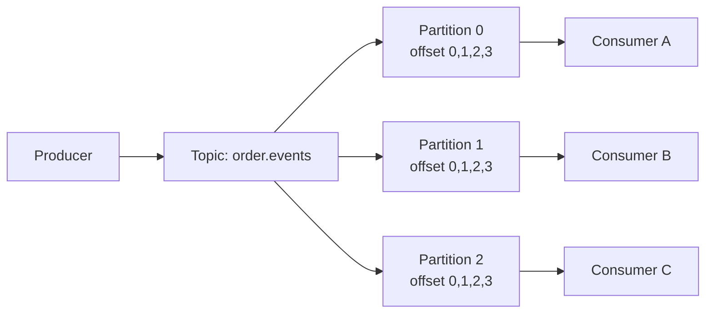
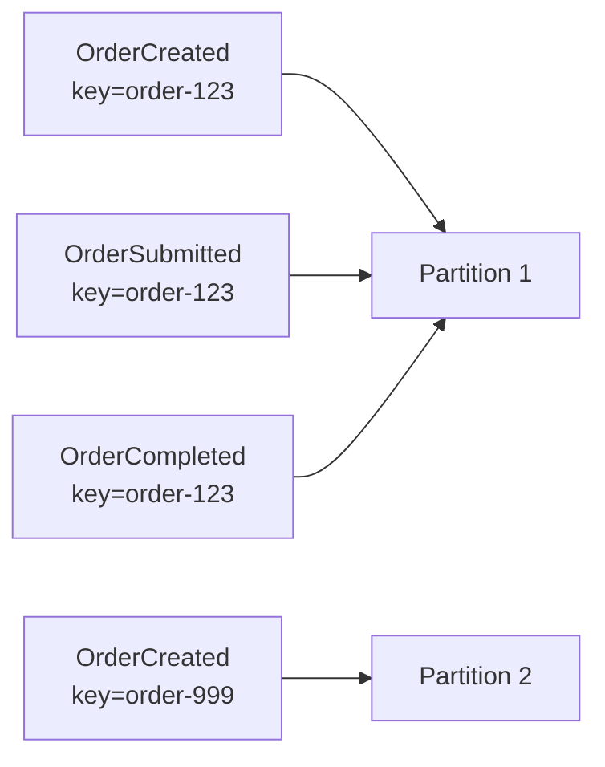

# Part 005 — Partitioning and Ordering

## 1. Tujuan Part Ini

Part ini membangun mental model tentang **partitioning dan ordering** di Kafka.

Dalam sistem enterprise, banyak bug Kafka tidak terjadi karena Kafka gagal. Bug sering terjadi karena engineer salah memahami satu hal sederhana:

> Kafka hanya menjamin ordering di dalam satu partition, bukan di seluruh topic.

Implikasinya besar untuk sistem CPQ, quote management, order management, fulfillment, pricing, approval, dan workflow asynchronous. Jika event untuk aggregate yang sama masuk ke partition berbeda, consumer bisa melihat urutan yang salah. Jika partition key tidak stabil, replay bisa menghasilkan urutan berbeda. Jika partition count dinaikkan, mapping key ke partition bisa berubah untuk event baru. Jika key terlalu kasar, satu partition menjadi panas. Jika key terlalu granular, ordering bisnis bisa pecah.

Tujuan part ini adalah membuat Anda mampu menjawab:

- ordering apa yang sebenarnya dijamin Kafka?
- ordering apa yang sering diasumsikan aplikasi tetapi tidak dijamin Kafka?
- bagaimana memilih partition key untuk quote/order/customer/tenant?
- kapan aggregate ID lebih baik daripada tenant ID?
- kapan tenant ID menciptakan hot partition?
- apa dampak null key?
- apa dampak sticky partitioner?
- kenapa menaikkan partition count bukan operasi netral?
- bagaimana consumer harus bertahan terhadap out-of-order event?
- bagaimana mereview PR yang menyentuh partition key, ordering, dan consumer parallelism?

Part ini adalah jembatan antara topic design dan producer/consumer correctness.

## 2. Mental Model Dasar

Kafka topic dipecah menjadi beberapa partition. Setiap partition adalah log append-only.



Ordering hanya dijamin di dalam masing-masing partition:

- record di `partition-0` offset `10` dibaca sebelum offset `11`
- record di `partition-1` tidak punya urutan global terhadap `partition-0`
- offset `100` di partition 0 tidak berarti lebih baru daripada offset `99` di partition 1 secara global
- consumer group dapat memproses beberapa partition paralel
- parallelism meningkatkan throughput, tetapi mengurangi global ordering

Invariant utamanya:

> Jika dua event harus diproses berurutan, keduanya harus masuk ke partition yang sama dan consumer harus memproses partition itu secara berurutan.

## 3. Partition Key

Partition key adalah nilai yang digunakan producer untuk menentukan partition tujuan suatu record.

Biasanya record Kafka punya struktur konseptual seperti ini:

```text
Topic: order.events
Key:   order-123
Value: { "eventType": "OrderSubmitted", ... }
Headers: correlationId, causationId, traceId, schemaVersion, tenantId
```

Jika key diset, Kafka producer akan memakai partitioner untuk memetakan key ke partition. Dalam banyak kasus, ini berbasis hash key modulo jumlah partition.

Secara konseptual:

```text
partition = hash(key) % partition_count
```

Ini bukan formula yang harus Anda hafal sebagai detail implementasi mutlak, tetapi mental model-nya penting: **key yang sama cenderung masuk ke partition yang sama selama partition count dan partitioner behavior konsisten**.

Jika key tidak diset atau null, Kafka tidak bisa memakai key untuk menjaga co-location event aggregate. Event akan disebar berdasarkan partitioner, sering kali untuk throughput/batching. Ini bagus untuk throughput, buruk untuk ordering per business entity.

## 4. Ordering Guarantee Kafka

Kafka memberi ordering guarantee yang sempit tetapi kuat:

- ordering dijamin per partition
- producer append record ke log partition
- consumer membaca offset secara meningkat
- satu partition dalam satu consumer group hanya ditugaskan ke satu consumer instance pada satu waktu

Kafka tidak menjamin:

- ordering global antar partition
- ordering antar topic
- ordering antar consumer group
- ordering berdasarkan event timestamp
- ordering berdasarkan database commit time jika producer tidak menjaga mapping-nya
- ordering antara event yang dipublish dari service berbeda tanpa koordinasi
- ordering setelah retry topic atau DLQ replay kecuali didesain khusus

Ini berarti kalimat “Kafka preserves order” harus selalu dilengkapi:

> Kafka preserves order **within a partition**.

## 5. Ordering Per Aggregate

Dalam enterprise business system, ordering biasanya dibutuhkan per aggregate, bukan global.

Contoh aggregate:

- Quote
- Order
- Customer
- Subscription
- Account
- Product catalog item
- Approval request
- Fulfillment request

Untuk order lifecycle, event seperti ini harus diproses berurutan untuk order yang sama:

```text
OrderCreated
OrderValidated
OrderSubmitted
OrderDecomposed
OrderFulfillmentStarted
OrderCompleted
```

Jika `OrderCompleted` diproses sebelum `OrderSubmitted`, downstream read model bisa rusak.

Maka key yang umum adalah:

```text
key = orderId
```

Dengan key ini, semua event untuk `order-123` masuk ke partition yang sama.



Dengan model ini:

- ordering untuk `order-123` aman
- order berbeda bisa diproses paralel
- throughput meningkat tanpa mengorbankan invariant per order

## 6. Aggregate ID as Key

Aggregate ID sering menjadi partition key terbaik untuk event lifecycle.

Contoh:

| Event | Partition Key yang Umum | Alasan |
|---|---|---|
| `QuoteCreated` | `quoteId` | Ordering lifecycle quote |
| `QuoteApproved` | `quoteId` | Approval harus setelah quote dibuat |
| `OrderSubmitted` | `orderId` | Lifecycle order |
| `OrderCancelled` | `orderId` | Cancellation harus konsisten dengan status order |
| `CatalogItemUpdated` | `catalogItemId` | Ordering perubahan catalog item |
| `CustomerUpdated` | `customerId` | Latest customer projection |

Keuntungan aggregate ID:

- ordering natural per entity
- consumer bisa memproses aggregate berbeda paralel
- duplicate/replay bisa dikontrol dengan aggregate version
- state transition lebih mudah divalidasi
- projection per aggregate lebih stabil

Risiko aggregate ID:

- aggregate yang sangat aktif bisa menjadi hot key
- aggregate besar bisa menyebabkan satu partition tertinggal
- aggregate yang salah dipilih bisa memecah invariant
- event lintas aggregate tetap tidak punya ordering total

## 7. Tenant ID as Key

Dalam sistem multi-tenant, engineer sering tergoda memakai `tenantId` sebagai key.

Kadang benar, sering berbahaya.

Keuntungan `tenantId` sebagai key:

- semua event tenant yang sama masuk partition sama
- mudah menjaga ordering per tenant
- berguna jika consumer memproses state tenant-level
- membantu isolasi processing secara konseptual

Masalah besar:

- tenant besar dapat membuat hot partition
- parallelism per tenant hilang
- satu tenant noisy dapat menghambat tenant lain di partition yang sama
- ordering terlalu luas dan mahal
- throughput topic dibatasi oleh tenant terbesar

Contoh buruk:

```text
key = tenantId
```

Jika satu tenant enterprise menghasilkan 70% traffic, satu partition akan menerima mayoritas record.

Lebih aman jika ordering sebenarnya hanya dibutuhkan per order:

```text
key = orderId
headers.tenantId = tenantId
```

Dengan demikian tenant tetap dapat difilter/ditrace, tetapi partitioning mengikuti aggregate lifecycle.

## 8. Customer, Order, Quote, atau Tenant sebagai Key?

Pemilihan key harus mengikuti invariant bisnis.

Gunakan pertanyaan ini:

1. Event mana yang harus dilihat consumer secara berurutan?
2. State apa yang akan di-update consumer?
3. Apa aggregate boundary yang paling kecil tetapi masih benar?
4. Apakah ordering tenant-wide benar-benar dibutuhkan?
5. Apakah satu customer/order/tenant bisa menjadi hot key?
6. Apakah downstream consumer join beberapa aggregate?
7. Apakah replay harus mempertahankan ordering yang sama?

Decision guide:

| Kebutuhan | Candidate Key | Catatan |
|---|---|---|
| Lifecycle quote | `quoteId` | Cocok untuk quote state transitions |
| Lifecycle order | `orderId` | Cocok untuk order management |
| Customer profile projection | `customerId` | Cocok untuk customer state |
| Catalog item changes | `catalogItemId` | Cocok untuk item-level catalog update |
| Tenant-level billing cycle | `tenantId` | Hati-hati hot partition |
| Approval workflow | `approvalRequestId` atau `quoteId` | Pilih berdasarkan state owner |
| Fulfillment per order item | `orderItemId` atau `orderId` | Trade-off ordering vs parallelism |
| Cache invalidation per entity | entity ID | Jangan pakai null key jika stale read berbahaya |

Dalam CPQ/order system, `orderId` sering lebih aman daripada `tenantId`. Tetapi untuk event yang benar-benar tenant-level, `tenantId` bisa benar.

## 9. Ordering vs Parallelism Trade-off

Partitioning adalah trade-off antara ordering dan parallelism.

Jika semua event masuk satu partition:

- ordering global kuat
- parallelism consumer buruk
- throughput terbatas
- satu slow event memblokir semua event berikutnya

Jika event tersebar ke banyak partition:

- parallelism baik
- throughput naik
- ordering hanya lokal per partition
- consumer harus tahan out-of-order antar aggregate/topic

Tabel trade-off:

| Desain | Ordering | Parallelism | Risiko |
|---|---:|---:|---|
| 1 partition | Global per topic | Sangat rendah | Bottleneck, lag besar |
| Key by aggregate ID | Per aggregate | Baik | Hot aggregate |
| Key by tenant ID | Per tenant | Sedang/rendah | Hot tenant |
| Null key | Tidak ada ordering entity | Tinggi | State lifecycle rusak |
| Random key | Tidak ada ordering entity | Tinggi | Duplicate/out-of-order sulit |

Senior engineer tidak bertanya “berapa partition yang cepat?”, tetapi:

> Ordering boundary apa yang benar, dan parallelism minimum apa yang dibutuhkan?

## 10. Partition Count

Partition count menentukan jumlah log paralel dalam topic.

Partition count memengaruhi:

- maximum parallelism consumer dalam satu consumer group
- distribusi key
- broker resource usage
- metadata size
- file handles
- recovery time
- rebalance cost
- throughput topic
- operational overhead

Jika topic punya 12 partition, satu consumer group bisa memproses maksimal 12 partition secara paralel. Jika ada 20 pod consumer dalam group yang sama, hanya 12 yang aktif menerima partition; 8 lainnya idle.

```text
Topic partitions: 12
Consumer replicas: 20
Useful active consumers: <= 12
```

Menambah consumer lebih banyak dari jumlah partition tidak otomatis meningkatkan throughput.

## 11. Increasing Partition Count Impact

Menambah partition count terlihat seperti operasi scaling sederhana, tetapi bisa memengaruhi ordering.

Jika mapping key ke partition menggunakan `hash(key) % partition_count`, maka ketika partition count berubah, key baru bisa masuk ke partition berbeda dari sebelumnya.

Contoh konseptual:

```text
Sebelum: partition_count = 6
hash(order-123) % 6 = partition 2

Sesudah: partition_count = 12
hash(order-123) % 12 = partition 8
```

Event lama untuk `order-123` ada di partition 2. Event baru bisa masuk partition 8. Jika consumer memproses replay/history dan live traffic bersamaan, ordering aggregate bisa kacau.

Dampaknya tergantung:

- client partitioner
- Kafka client version
- apakah custom partitioner digunakan
- apakah key-based ordering sedang diandalkan
- apakah topic masih menerima lifecycle event lama untuk aggregate yang sama
- apakah consumer memproses event lintas partition untuk aggregate yang sama

Review rule:

> Jangan menaikkan partition count topic yang mengandalkan strict per-key ordering tanpa analisis dampak.

Alternatif:

- buat topic baru dengan partition count baru dan migrasi terkontrol
- gunakan versioned topic
- pastikan aggregate lifecycle lama tidak lagi aktif
- desain consumer untuk menangani out-of-order
- gunakan custom partitioning strategy jika benar-benar diperlukan

## 12. Null Key Behavior

Null key berarti producer tidak memberi Kafka key untuk menentukan partition berdasarkan entity.

Kapan null key bisa diterima:

- telemetry event tanpa state lifecycle
- log event yang tidak membutuhkan ordering per entity
- fire-and-forget notification yang tidak mengubah state kritis
- high-volume event yang hanya dihitung agregat global

Kapan null key berbahaya:

- order lifecycle event
- quote state transition event
- approval workflow event
- payment/billing-like event
- projection update event
- compacted topic
- cache invalidation event per entity
- event yang akan direplay untuk membangun state

Jika event membawa `orderId` di payload tetapi key null, itu red flag.

```json
{
  "eventType": "OrderSubmitted",
  "orderId": "order-123"
}
```

Jika payload punya aggregate ID, tanya:

> Kenapa aggregate ID tidak menjadi record key?

Mungkin ada alasan valid. Tetapi alasan itu harus eksplisit.

## 13. Sticky Partitioner

Kafka producer modern dapat menggunakan sticky partitioner untuk null-key records agar batching lebih efisien. Idenya: producer menempel sementara ke satu partition untuk mengumpulkan batch, lalu pindah ke partition lain.

Keuntungan:

- batching lebih baik
- throughput lebih tinggi
- latency bisa lebih rendah untuk beban tertentu
- distribusi tetap bisa relatif seimbang dalam jangka waktu tertentu

Risiko jika salah paham:

- sticky partitioner bukan ordering guarantee bisnis
- null-key records tetap tidak punya affinity ke aggregate
- event untuk entity yang sama bisa masuk partition berbeda
- retry/replay tetap harus dianggap tidak menjaga ordering entity

Sticky partitioner adalah optimisasi throughput, bukan desain domain.

## 14. Hashing and Custom Partitioner

Default partitioner cukup untuk banyak sistem. Custom partitioner sebaiknya jarang digunakan.

Custom partitioner mungkin relevan jika:

- perlu tenant-aware placement
- perlu menghindari hot key tertentu
- perlu compatibility dengan legacy mapping
- perlu partitioning berdasarkan composite key
- perlu deterministic routing lintas bahasa/client

Risikonya:

- bug partitioner bisa menyebabkan data skew masif
- upgrade client lebih rumit
- behavior sulit dipahami tim baru
- producer berbeda bisa memakai logic berbeda
- observability harus lebih kuat
- reprocessing dengan tool berbeda bisa tidak konsisten

Jika custom partitioner ada, dokumentasi harus menjawab:

- input key apa yang dipakai?
- algoritma mapping-nya apa?
- apakah kompatibel antar versi?
- bagaimana migration dilakukan?
- bagaimana diuji?
- apa fallback jika partition count berubah?

## 15. Hot Partition

Hot partition terjadi ketika satu partition menerima traffic jauh lebih tinggi daripada partition lain.

Penyebab umum:

- key terlalu kasar, misalnya `tenantId`
- satu aggregate sangat aktif
- null-key sticky behavior menghasilkan imbalance jangka pendek
- custom partitioner buruk
- jumlah key terlalu sedikit dibanding partition
- event high-volume dicampur dengan event critical low-volume
- topic design terlalu luas

Gejala hot partition:

- consumer lag naik hanya pada partition tertentu
- broker leader untuk partition itu lebih sibuk
- produce latency naik untuk topic tertentu
- consumer processing tidak seimbang
- satu pod consumer lebih berat daripada pod lain
- disk/network broker tertentu lebih tinggi

Contoh:

```text
order.events partition lag:
partition-0: 100
partition-1: 80
partition-2: 95
partition-3: 950000  <-- hot partition
partition-4: 75
partition-5: 90
```

Jangan hanya scale consumer replicas. Jika lag terkonsentrasi pada satu partition, menambah consumer tidak membantu karena satu partition hanya bisa diproses oleh satu consumer dalam group.

## 16. Partition Skew

Partition skew adalah distribusi record yang tidak seimbang antar partition.

Skew bisa terjadi pada:

- write throughput
- byte throughput
- consumer processing time
- lag
- key cardinality
- error rate

Skew tidak selalu terlihat dari jumlah message. Satu message bisa jauh lebih besar atau lebih mahal diproses.

Contoh:

| Partition | Messages/sec | Bytes/sec | Avg processing ms | Lag |
|---:|---:|---:|---:|---:|
| 0 | 500 | 2 MB | 10 | 100 |
| 1 | 480 | 2 MB | 11 | 120 |
| 2 | 510 | 25 MB | 90 | 20,000 |

Partition 2 tidak hanya skew dari throughput bytes, tetapi juga processing cost.

Root cause analysis harus melihat:

- key distribution
- payload size
- event type mix
- tenant/customer concentration
- consumer database query cost
- downstream API latency
- partition leader broker
- retry/DLQ pattern

## 17. Ordering Failure Modes

Ordering bisa rusak walaupun Kafka bekerja sesuai desain.

Failure mode umum:

### 17.1 Wrong key

`OrderCreated` key = `orderId`, tetapi `OrderCancelled` key = `customerId`.

Dampak: lifecycle order masuk partition berbeda.

### 17.2 Null key

Event lifecycle tidak punya key.

Dampak: producer menyebar event tanpa aggregate affinity.

### 17.3 Partition count changed

Topic dinaikkan partition count-nya.

Dampak: event baru untuk key lama bisa masuk partition berbeda tergantung partitioner.

### 17.4 Retry topic loses ordering

Event gagal dikirim ke retry topic, sementara event berikutnya sukses diproses.

```text
OrderSubmitted gagal -> retry later
OrderCompleted sukses -> processed first
OrderSubmitted retry -> processed late
```

### 17.5 Multiple topics for same lifecycle

`order.created`, `order.updated`, dan `order.cancelled` ada di topic berbeda.

Dampak: Kafka tidak menjamin ordering antar topic.

### 17.6 Multiple producers for same aggregate

Service A dan Service B publish event untuk aggregate yang sama tanpa koordinasi.

Dampak: ordering tergantung timing producer, bukan invariant bisnis.

### 17.7 Consumer parallelism inside partition

Consumer membaca partition berurutan, tetapi handler memproses event di thread pool paralel tanpa per-key ordering.

Dampak: ordering rusak di aplikasi, bukan di Kafka.

### 17.8 Database transaction time vs publish time

Dua transaksi DB commit dalam urutan tertentu, tetapi event dipublish dalam urutan berbeda karena outbox polling atau retry.

Dampak: downstream melihat state transition yang tampak mundur.

## 18. Consumer-Side Out-of-Order Handling

Consumer harus defensif. Bahkan jika producer berusaha menjaga ordering, event-driven system production tetap bisa menghadapi out-of-order event karena retry, replay, migration, atau bug producer.

Strategi umum:

### 18.1 Version check

Tambahkan aggregate version.

```json
{
  "eventType": "OrderStatusChanged",
  "orderId": "order-123",
  "aggregateVersion": 7,
  "oldStatus": "SUBMITTED",
  "newStatus": "COMPLETED"
}
```

Consumer dapat menolak atau menunda event jika version tidak sesuai.

### 18.2 State transition validation

Consumer memvalidasi transition.

```text
Allowed:
CREATED -> SUBMITTED
SUBMITTED -> COMPLETED
SUBMITTED -> CANCELLED

Not allowed:
CREATED -> COMPLETED
COMPLETED -> SUBMITTED
```

### 18.3 Idempotent upsert with monotonic version

Projection hanya update jika incoming version lebih baru.

```sql
UPDATE order_projection
SET status = :status,
    aggregate_version = :version
WHERE order_id = :orderId
  AND aggregate_version < :version;
```

### 18.4 Buffering

Consumer menyimpan event yang datang terlalu cepat sampai event sebelumnya datang.

Cocok untuk workflow tertentu, tetapi meningkatkan kompleksitas:

- buffer retention
- timeout
- poison event
- memory/disk usage
- operational runbook

### 18.5 Reconciliation

Jika out-of-order tidak bisa diselesaikan inline, gunakan reconciliation job untuk memperbaiki state dari source of truth.

## 19. Ordering and Retry/DLQ

Retry/DLQ dapat merusak ordering jika tidak didesain hati-hati.

Contoh:

```text
offset 10: OrderSubmitted -> failed -> retry topic
offset 11: OrderCompleted -> success
later: OrderSubmitted retry -> processed after completed
```

Pilihan desain:

### Stop partition on failure

Consumer berhenti memproses partition sampai event gagal selesai.

Keuntungan:

- ordering terjaga

Kerugian:

- satu poison event memblokir semua event berikutnya di partition
- consumer lag naik
- blast radius besar jika partition berisi banyak aggregate

### Send to retry topic and continue

Consumer kirim event gagal ke retry topic lalu lanjut.

Keuntungan:

- availability/throughput lebih baik

Kerugian:

- ordering bisa rusak
- consumer harus idempotent dan out-of-order aware

### Per-key blocking

Consumer memblokir key tertentu, tetapi tetap memproses key lain.

Keuntungan:

- ordering per aggregate lebih aman
- blast radius lebih kecil

Kerugian:

- implementasi lebih kompleks
- perlu state tracking per key
- perlu cleanup dan observability

Tidak ada jawaban universal. Keputusan harus berdasarkan business invariant.

## 20. Ordering and Outbox

Outbox pattern membantu menghindari dual-write problem, tetapi tidak otomatis menyelesaikan ordering.

Hal yang harus dicek:

- apakah outbox table punya `aggregate_id`?
- apakah outbox row punya `aggregate_version`?
- apakah publisher mem-publish per aggregate secara berurutan?
- apakah polling query bisa mengambil event aggregate yang sama secara paralel?
- apakah `SKIP LOCKED` menyebabkan event version 8 dipublish sebelum version 7?
- apakah CDC mempertahankan commit order yang dibutuhkan?
- apakah partition key producer menggunakan aggregate ID yang sama?

Contoh outbox fields yang membantu ordering:

```text
id
aggregate_type
aggregate_id
aggregate_version
event_type
payload
headers
created_at
published_at
status
```

Jika publisher paralel mengambil row outbox tanpa memperhatikan aggregate ordering, Kafka bisa menerima event dalam urutan yang salah.

## 21. Ordering and CDC

CDC seperti Debezium membaca perubahan database dari WAL/logical decoding. Ini memberi ordering yang lebih dekat ke commit log database, tetapi tetap perlu desain.

Hal yang perlu dipahami:

- CDC membaca perubahan dari database log
- transaksi database punya ordering commit
- Debezium dapat membawa metadata transaksi jika dikonfigurasi
- outbox event router bisa mengubah row outbox menjadi event Kafka
- topic/partition key tetap harus didesain
- retry connector atau transform failure bisa memengaruhi delivery
- downstream consumer tetap harus idempotent

CDC bukan magic ordering solution. CDC membantu mengurangi dual-write, tetapi ordering antar aggregate, topic, dan consumer masih perlu reasoning.

## 22. Ordering and Kafka Streams

Kafka Streams menjaga ordering per partition pada input stream, tetapi topology bisa melakukan repartition.

Operasi yang dapat memicu repartition:

- `selectKey`
- `groupBy`
- join tertentu
- aggregation berdasarkan key baru

Saat repartition terjadi:

- data ditulis ke internal repartition topic
- key baru menentukan partition baru
- ordering mengikuti partition baru
- state store update bergantung pada key topology

Review Kafka Streams harus bertanya:

- input key apa?
- apakah topology mengubah key?
- internal repartition topic apa yang dibuat?
- apakah join/aggregation membutuhkan ordering tertentu?
- apakah state store update idempotent?
- apakah topology upgrade mengubah partitioning?

## 23. Partitioning in Multi-Tenant Systems

Multi-tenant system menambah layer reasoning.

Dimensi yang sering muncul:

- tenant fairness
- tenant isolation
- hot enterprise tenant
- noisy neighbor
- per-tenant replay
- per-tenant access control
- per-tenant data residency
- per-tenant throttling

Partitioning options:

### Key by aggregate ID

Baik untuk ordering per aggregate dan throughput. Tenant disimpan di header/payload.

### Key by tenant ID

Baik untuk ordering tenant-wide, buruk untuk tenant besar.

### Composite key

Contoh:

```text
tenantId + ':' + orderId
```

Hati-hati: jika composite key unik per order, behavior mirip orderId tetapi tenant tetap tampak di key. Jika hash memakai seluruh string, tenant besar tetap tersebar sepanjang orderId bervariasi.

### Topic per tenant

Jarang cocok kecuali isolasi sangat kuat dibutuhkan. Risiko topic sprawl dan operational overhead.

### Cluster per tenant/tier

Cocok untuk tenant besar/regulasi tertentu, tetapi mahal secara operasional.

## 24. Partition Key and Security/Privacy

Partition key juga data. Jangan sembarangan memasukkan sensitive information ke key.

Risiko:

- key muncul di logs/debug tooling
- key terlihat di Kafka UI
- key masuk DLQ/retry topic
- key bisa bocor lewat metrics/cardinality label jika salah instrumentasi
- key sulit dihapus dari log jika retention panjang

Sebaiknya partition key memakai opaque identifier, bukan data sensitif.

Hindari:

```text
key = customerEmail
key = phoneNumber
key = nationalId
key = fullName
```

Lebih baik:

```text
key = customerId
key = orderId
key = quoteId
```

Jika ID sendiri dianggap sensitive, verifikasi policy internal.

## 25. Partition Key and Event Schema

Partition key adalah bagian dari contract event, walaupun sering tidak terdokumentasi dalam payload schema.

Event contract harus menjelaskan:

- topic name
- key type
- key meaning
- key required atau nullable
- payload schema
- required headers
- ordering guarantee
- partitioning rationale
- compatibility impact jika key berubah

Contoh dokumentasi minimal:

```md
Topic: order.events
Key: orderId, string, required
Ordering: all lifecycle events for the same orderId are published to the same partition
Compatibility: changing key semantics is breaking for consumers relying on ordering
```

Jika event catalog tidak mendokumentasikan key semantics, consumer akan menebak.

## 26. Partition Count Sizing Heuristics

Tidak ada angka universal. Tetapi ada pertanyaan sizing yang lebih berguna:

- target throughput berapa messages/sec dan MB/sec?
- consumer processing cost per message berapa?
- berapa maximum consumer replicas yang realistis?
- ordering boundary apa?
- berapa key cardinality?
- apakah ada hot key?
- berapa retention dan storage cost?
- berapa broker count?
- bagaimana replication factor?
- apakah topic akan dipakai Kafka Streams?
- apakah partition count perlu stabil lama?

Heuristic umum:

- mulai dari throughput dan consumer parallelism, bukan angka random
- jangan terlalu sedikit jika throughput tinggi
- jangan terlalu banyak jika topic kecil dan cluster banyak topic
- sisakan ruang scaling, tetapi hindari over-partitioning
- pikirkan dampak perubahan partition count sejak awal

Over-partitioning juga berbahaya:

- metadata lebih besar
- recovery lebih lambat
- file handle lebih banyak
- controller/broker overhead
- rebalance lebih mahal
- monitoring lebih noisy

## 27. Consumer Parallelism and Partition Assignment

Dalam satu consumer group, satu partition hanya diproses oleh satu consumer pada satu waktu.

Contoh:

```text
Topic partitions: 6
Consumer replicas: 3

Consumer A: partitions 0,1
Consumer B: partitions 2,3
Consumer C: partitions 4,5
```

Jika replicas menjadi 6:

```text
Consumer A: partition 0
Consumer B: partition 1
Consumer C: partition 2
Consumer D: partition 3
Consumer E: partition 4
Consumer F: partition 5
```

Jika replicas menjadi 10:

```text
6 consumers active
4 consumers idle
```

Parallelism internal dalam consumer process harus hati-hati. Jika consumer membaca satu partition lalu memasukkan record ke thread pool paralel, Kafka-level ordering bisa rusak di application-level processing.

Safe pattern:

- proses record partition secara sequential jika ordering penting
- atau gunakan per-key executor/queue
- commit offset setelah semua record sebelumnya selesai
- jangan commit offset melewati record yang belum selesai
- lakukan graceful shutdown menunggu in-flight processing

## 28. Backpressure and Ordering

Backpressure terjadi ketika consumer tidak mampu memproses secepat producer menulis.

Pilihan response:

- scale consumer replicas jika partition tersedia
- optimalkan processing DB/API
- pause/resume partition tertentu
- turunkan `max.poll.records`
- tambah partition jika aman
- pisahkan event high-volume dan critical
- gunakan batching database write
- gunakan rate limiting producer
- gunakan retry/DLQ untuk error permanen

Hati-hati: backpressure yang salah ditangani bisa merusak ordering.

Contoh buruk:

- consumer mengambil 500 record
- submit semua ke executor paralel
- commit offset tertinggi setelah sebagian selesai
- crash
- record yang belum selesai dianggap sudah diproses

Ini bukan hanya ordering bug; ini data loss semantik.

## 29. Replay and Ordering

Replay sering memperlihatkan bug ordering yang tidak muncul di normal traffic.

Saat replay:

- throughput jauh lebih tinggi dari normal
- consumer memproses event lama dan baru
- retry/DLQ bisa ikut masuk
- projection bisa menerima event dengan timestamp lama
- business rule sekarang mungkin berbeda dari saat event dibuat
- aggregate sudah berada di state final
- consumer baru bisa membaca dari offset awal

Consumer replay-safe harus mempertimbangkan:

- event ID deduplication
- aggregate version
- event time vs processing time
- state transition validation
- monotonic update
- schema evolution
- idempotency
- side effect suppression untuk email/API eksternal

Ordering pada replay tidak boleh diasumsikan global. Replay topic multi-partition tetap parallel.

## 30. Debugging Ordering Issue

Symptom umum ordering issue:

- status mundur, misalnya `COMPLETED` menjadi `SUBMITTED`
- projection missing intermediate state
- consumer error “invalid transition”
- duplicate notification
- cancellation diterima setelah fulfillment completed
- approval result diproses sebelum approval requested
- read model berbeda dari source of truth

Debugging flow:

1. Ambil aggregate ID yang bermasalah.
2. Cari semua event untuk aggregate tersebut.
3. Cek topic dan partition setiap event.
4. Cek key yang dipakai producer.
5. Cek offset dan timestamp.
6. Cek producer logs dan outbox rows.
7. Cek retry/DLQ/replay path.
8. Cek consumer processing logs.
9. Cek apakah handler paralel merusak ordering.
10. Cek database state transition history.

Data yang dibutuhkan:

- event ID
- aggregate ID
- partition
- offset
- key
- event timestamp
- processing timestamp
- correlation ID
- causation ID
- producer service/version
- consumer service/version
- retry count
- DLQ origin

## 31. PR Review Checklist

Saat PR menyentuh Kafka event/producer/consumer/topic, tanyakan:

### Key Semantics

- Apa partition key?
- Apakah key required?
- Apakah key sama untuk semua event lifecycle aggregate?
- Apakah key ada di payload tetapi tidak dipakai sebagai Kafka key?
- Apakah key mengandung data sensitive?

### Ordering

- Ordering dibutuhkan per apa: order, quote, customer, tenant, atau global?
- Apakah semua event yang harus ordered masuk topic dan partition yang sama?
- Apakah ada multiple topic yang diasumsikan ordered?
- Apakah retry/DLQ dapat merusak ordering?
- Apakah consumer tahan out-of-order?

### Partition Count

- Berapa partition count topic?
- Bagaimana angka itu dipilih?
- Apakah akan ada kebutuhan scaling?
- Apa dampak jika partition count dinaikkan?
- Apakah consumer replicas sesuai partition count?

### Hot Partition

- Apakah key cardinality cukup tinggi?
- Apakah ada tenant/customer/order yang sangat besar?
- Apakah dashboard partition-level lag tersedia?
- Apakah event high-volume dipisah dari event critical?

### Consumer Processing

- Apakah consumer memproses partition secara sequential?
- Apakah ada thread pool yang bisa merusak ordering?
- Apakah offset commit menunggu processing selesai?
- Apakah graceful shutdown aman untuk in-flight record?

### Replay

- Apakah event replay-safe?
- Apakah aggregate version tersedia?
- Apakah idempotency tersedia?
- Apakah side effect eksternal dicegah saat replay?

## 32. Internal Verification Checklist

Untuk konteks CSG/team, verifikasi hal-hal ini secara eksplisit:

### Topic and Partition

- Daftar topic Kafka yang relevan dengan quote/order/catalog/pricing/approval.
- Partition count setiap topic.
- Replication factor dan min ISR.
- Topic yang compacted vs delete retention.
- Topic yang memiliki retry/DLQ.

### Producer

- Partition key yang digunakan producer.
- Apakah key ditentukan oleh framework internal atau manual.
- Apakah null key pernah digunakan untuk business event.
- Apakah custom partitioner digunakan.
- Apakah producer memiliki idempotence enabled.

### Consumer

- Consumer group untuk setiap topic.
- Jumlah replica consumer vs partition count.
- Apakah consumer memakai thread pool internal.
- Offset commit strategy.
- Pause/resume usage.
- Rebalance metrics.

### Ordering

- Event lifecycle yang membutuhkan ordering.
- Aggregate ID yang dipakai sebagai ordering boundary.
- Out-of-order incident atau invalid state transition incident.
- Retry/DLQ path yang bisa mengubah urutan.
- Replay procedure dan ordering assumption.

### Observability

- Consumer lag per partition.
- Key skew dashboard jika ada.
- Producer throughput per partition.
- Hot partition alert.
- DLQ spike by event type/key.
- Traceability dari HTTP request ke event.

### Architecture and Governance

- Event catalog mencatat key semantics atau tidak.
- ADR tentang topic/partition key.
- Review checklist untuk partitioning.
- Policy menambah partition count.
- Ownership untuk fixing hot partition.

## 33. Common Anti-Patterns

### Anti-pattern 1: Key null untuk state transition

Event lifecycle aggregate tanpa key.

Dampak:

- ordering hilang
- projection mudah rusak
- replay tidak stabil

### Anti-pattern 2: Tenant ID sebagai default key

Semua event multi-tenant memakai tenant ID tanpa analisis.

Dampak:

- hot partition
- noisy neighbor
- parallelism rendah

### Anti-pattern 3: Menaikkan partition count tanpa review

Partition count dinaikkan untuk mengatasi lag, tetapi topic mengandalkan ordering.

Dampak:

- key mapping berubah
- event aggregate bisa terpecah

### Anti-pattern 4: Menganggap retry topic menjaga ordering

Retry topic dipakai tanpa consumer out-of-order handling.

Dampak:

- event lama diproses setelah event baru

### Anti-pattern 5: Parallel handler tanpa offset discipline

Consumer poll sequential tetapi handler parallel dan commit offset terlalu cepat.

Dampak:

- out-of-order processing
- lost processing saat crash

### Anti-pattern 6: Partition key tidak didokumentasikan

Consumer tidak tahu ordering guarantee.

Dampak:

- hidden coupling
- schema tampak compatible tetapi behavior breaking

## 34. Decision Matrix

| Situasi | Rekomendasi Awal | Risiko yang Harus Dicek |
|---|---|---|
| Order lifecycle event | Key by `orderId` | Hot order, retry ordering |
| Quote lifecycle event | Key by `quoteId` | Approval/cancellation ordering |
| Tenant-level operation | Key by `tenantId` | Hot tenant, low parallelism |
| High-volume telemetry | Null key bisa diterima | Tidak untuk stateful projection |
| Cache invalidation entity | Key by entity ID | Stale cache jika ordering rusak |
| Compact topic latest state | Key wajib entity ID | Tombstone semantics |
| Consumer group high throughput | Partition count cukup | Over-partitioning, ordering impact |
| Retry with strict ordering | Stop/per-key block | Lag/blocking risk |
| Retry with high availability | Retry topic + continue | Out-of-order handling wajib |
| Multi-topic lifecycle | Hindari jika ordering penting | Kafka tidak order antar topic |

## 35. Kesimpulan

Partitioning adalah salah satu desain paling menentukan dalam Kafka.

Ringkasan mental model:

- Kafka menjamin ordering hanya per partition
- partition key menentukan co-location event
- ordering yang benar biasanya per aggregate, bukan global
- aggregate ID sering lebih tepat daripada tenant ID
- null key tidak cocok untuk lifecycle event
- sticky partitioner adalah optimisasi batching, bukan ordering guarantee
- partition count menentukan parallelism tetapi perubahan partition count bisa merusak asumsi ordering
- hot partition tidak selesai hanya dengan menambah consumer
- retry, DLQ, replay, outbox, CDC, dan thread pool consumer bisa merusak ordering jika tidak didesain
- consumer production-grade harus idempotent dan defensif terhadap out-of-order event
- key semantics harus menjadi bagian dari event contract

Sebagai senior backend engineer, jangan hanya bertanya “topic ini berapa partition?”. Tanyakan:

> Apa invariant bisnis yang harus ordered, key apa yang menjaganya, dan failure path apa yang bisa merusaknya?
