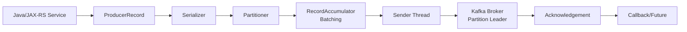

# Part 006 — Producer Fundamentals

## 1. Tujuan Part Ini

Part ini membahas Kafka producer dari sudut pandang backend engineer yang membangun Java/JAX-RS service production.

Producer bukan sekadar kode:

```java
producer.send(record);
```

Producer adalah komponen distributed system yang menentukan:

- event masuk topic mana
- key apa yang menjaga ordering
- serializer apa yang menentukan contract binary/wire format
- header apa yang membawa traceability
- partition mana yang dituju
- kapan record dianggap berhasil
- bagaimana retry dilakukan
- apakah duplicate dapat terjadi
- apakah ordering dapat rusak
- bagaimana batching memengaruhi latency/throughput
- bagaimana error dipantau
- apakah failure publish akan terlihat atau diam-diam hilang

Dalam sistem enterprise seperti CPQ/order management, producer sering berada di path penting:

```text
HTTP request -> JAX-RS resource -> service layer -> PostgreSQL transaction -> outbox/producer -> Kafka -> downstream services
```

Part ini fokus pada fundamental Kafka producer. Correctness producer yang terhubung dengan transaction boundary dan outbox dibahas lebih dalam di Part 007.

## 2. Producer Mental Model

Kafka producer menerima record dari aplikasi, menentukan partition, melakukan serialization, mengumpulkan record ke batch, mengirim batch ke broker leader partition, menunggu acknowledgement, melakukan retry jika perlu, lalu memanggil callback atau mengembalikan result.



Komponen penting:

- application thread membuat record
- serializer mengubah object menjadi bytes
- partitioner memilih partition
- accumulator mengumpulkan batch per topic-partition
- sender thread mengirim request ke broker
- broker menulis record ke log
- broker mengirim ack sesuai konfigurasi
- callback menerima success/failure

Mental model penting:

> `send()` biasanya tidak berarti record sudah tersimpan di Kafka. `send()` berarti record diserahkan ke producer client untuk dikirim secara asynchronous.

## 3. Producer Lifecycle

Lifecycle producer secara umum:

1. Producer dibuat dengan konfigurasi.
2. Producer mengambil metadata cluster/topic.
3. Aplikasi memanggil `send()` dengan `ProducerRecord`.
4. Key/value/header diserialisasi.
5. Partition ditentukan.
6. Record masuk accumulator batch.
7. Sender thread mengirim batch ke broker leader.
8. Broker menulis record dan mengirim ack.
9. Callback dipanggil.
10. Producer flush/close saat shutdown.

Dalam service production, lifecycle producer harus dikelola sebagai singleton/shared component, bukan dibuat setiap request.

Anti-pattern:

```java
@POST
public Response submitOrder(OrderRequest request) {
    KafkaProducer<String, OrderEvent> producer = new KafkaProducer<>(props);
    producer.send(record);
    producer.close();
    return Response.ok().build();
}
```

Masalah:

- connection setup mahal
- metadata fetch berulang
- batching tidak efektif
- throughput buruk
- shutdown/error handling sulit
- resource leak risk

Pattern lebih baik:

- producer dibuat saat service startup
- digunakan ulang oleh service layer/outbox publisher
- metrics diinstrumentasi
- flush/close saat graceful shutdown
- error callback ditangani eksplisit

## 4. ProducerRecord

`ProducerRecord` adalah unit data yang dikirim producer ke Kafka.

Secara konseptual:

```text
ProducerRecord(
  topic,
  partition?,
  timestamp?,
  key,
  value,
  headers
)
```

Field utama:

| Field | Fungsi | Correctness Concern |
|---|---|---|
| topic | tujuan record | topic salah berarti consumer tidak menerima |
| partition | override partition eksplisit | bisa merusak partitioning standard |
| key | partitioning dan ordering | null/wrong key merusak ordering |
| value | payload event | schema/serialization compatibility |
| headers | metadata | traceability, schema, tenant, retry |
| timestamp | event/create time | event-time processing, audit |

Dalam event-driven enterprise system, record bukan cuma payload. Key dan header sama pentingnya dengan value.

## 5. Key

Key punya beberapa peran:

- menentukan partition
- menjaga ordering per aggregate
- menjadi identity untuk compacted topic
- membantu debugging event lineage
- menjadi bagian dari event contract

Contoh:

```text
Topic: quote.events
Key: quoteId
Value: QuoteApproved event
```

Jika key salah, producer bisa menciptakan bug yang baru terlihat di consumer.

Checklist key:

- Apakah key required?
- Apakah key sesuai aggregate boundary?
- Apakah key stabil?
- Apakah key tidak mengandung PII?
- Apakah key sama untuk semua lifecycle event aggregate?
- Apakah key didokumentasikan di event catalog?
- Apakah compacted topic memakai key yang benar?

## 6. Value

Value adalah payload event. Value bisa berupa:

- JSON bytes
- Avro binary
- Protobuf binary
- JSON Schema-validated payload
- String sederhana untuk event tertentu
- envelope internal

Payload harus menjawab:

- event apa yang terjadi?
- entity/aggregate apa yang terdampak?
- state apa yang berubah?
- data apa yang dibutuhkan consumer?
- metadata apa yang sebaiknya di header vs payload?
- apakah payload event-carried state transfer atau notification-only?

Contoh payload event-carried state transfer:

```json
{
  "eventType": "OrderStatusChanged",
  "eventVersion": 1,
  "orderId": "ord-123",
  "oldStatus": "SUBMITTED",
  "newStatus": "COMPLETED",
  "aggregateVersion": 12,
  "eventTime": "2026-07-11T03:10:00Z"
}
```

Payload harus kompatibel dengan schema governance, bukan sekadar Java object internal yang kebetulan diserialisasi.

## 7. Headers

Kafka headers membawa metadata key-value di luar payload.

Headers cocok untuk metadata lintas event:

- correlation ID
- causation ID
- traceparent/span context
- tenant ID
- actor/user ID
- source service
- schema version atau schema ID jika framework memakai header
- idempotency key
- retry count
- original topic/partition/offset untuk DLQ
- event type jika envelope design membutuhkan

Contoh konseptual:

```text
headers:
  correlationId = 7fd4...
  causationId = command-123
  traceparent = 00-...
  tenantId = tenant-abc
  sourceService = quote-service
  eventType = QuoteApproved
```

Header membantu observability, debugging, distributed tracing, replay, dan DLQ analysis.

Hati-hati:

- jangan menaruh PII di header sembarangan
- header juga ikut masuk retry/DLQ
- header bisa muncul di log/tooling
- header standard harus konsisten antar service
- consumer tidak boleh bergantung pada header yang tidak dijamin contract

## 8. Timestamp

Kafka record punya timestamp. Tergantung konfigurasi topic/broker, timestamp bisa berupa create time dari producer atau log append time dari broker.

Untuk event-driven business system, bedakan:

| Waktu | Makna |
|---|---|
| event time | kapan event bisnis terjadi |
| database commit time | kapan transaksi sumber commit |
| publish time | kapan producer mengirim ke Kafka |
| broker append time | kapan broker menulis record |
| processing time | kapan consumer memproses |

Jangan mencampur semuanya.

Contoh:

- `eventTime` di payload/header untuk waktu bisnis
- Kafka timestamp untuk record timestamp
- `created_at` di outbox untuk waktu insert outbox
- consumer processing timestamp untuk observability latency

Jika Kafka Streams/windowing dipakai, event time menjadi sangat penting.

## 9. Serializer

Serializer mengubah key/value object menjadi byte array.

Contoh serializer:

- String serializer
- Byte array serializer
- JSON serializer
- Avro serializer
- Protobuf serializer
- JSON Schema serializer
- custom serializer internal

Serializer adalah boundary contract. Jika serializer berubah, consumer bisa gagal deserialize.

Failure mode serializer:

- class/object tidak sesuai schema
- required field missing
- enum value tidak dikenal
- schema registry unavailable
- incompatible schema
- invalid UTF-8/string format
- custom serializer bug
- payload terlalu besar

Producer harus menangani serialization failure. Serialization failure sering terjadi sebelum record dikirim ke broker, sehingga retry broker tidak membantu.

## 10. Partitioner

Partitioner menentukan partition tujuan record.

Input umum:

- topic
- key bytes
- value bytes
- cluster metadata
- available partitions

Jika key tersedia, partitioner biasanya memakai hash key. Jika key null, producer dapat memakai strategy untuk distribusi/batching.

Hindari override partition eksplisit kecuali sangat perlu:

```java
new ProducerRecord<>(topic, 3, key, value)
```

Risiko explicit partition:

- bypass standard partitioning
- sulit migrate partition count
- meningkatkan hot partition risk
- membuat producer terlalu tahu topology topic
- menyulitkan debugging

Lebih baik key semantics yang benar daripada hard-code partition.

## 11. Batching

Kafka producer efisien karena batching. Producer tidak selalu mengirim satu network request per record. Record dikumpulkan per topic-partition dalam batch.

Batching memengaruhi:

- throughput
- latency
- compression efficiency
- CPU usage
- memory usage
- broker request rate

Konfigurasi terkait:

- `batch.size`
- `linger.ms`
- `buffer.memory`
- `max.request.size`
- `compression.type`

Mental model:

```text
application send records -> accumulator batch -> sender sends batch -> broker append batch
```

Batching bagus untuk throughput, tetapi bisa menambah latency jika `linger.ms` terlalu tinggi.

## 12. Linger

`linger.ms` adalah waktu tunggu producer untuk mengumpulkan lebih banyak record sebelum mengirim batch.

Jika `linger.ms = 0`, producer cenderung mengirim segera ketika batch tersedia.

Jika `linger.ms > 0`, producer dapat menunggu sedikit agar batch lebih penuh.

Trade-off:

| Linger | Keuntungan | Risiko |
|---:|---|---|
| rendah | latency rendah | batch kecil, throughput kurang optimal |
| tinggi | throughput/compression lebih baik | latency naik |

Untuk business command/event critical, latency expectation perlu jelas. Untuk high-throughput integration event, linger kecil tapi non-zero sering bisa membantu throughput.

Jangan tuning `linger.ms` tanpa metrik:

- producer request rate
- batch size average
- record send rate
- request latency
- end-to-end latency
- broker throughput

## 13. Compression

Kafka producer dapat mengompresi batch.

Pilihan umum:

- none
- gzip
- snappy
- lz4
- zstd

Compression trade-off:

| Compression | Kelebihan | Risiko |
|---|---|---|
| none | CPU rendah | network/disk tinggi |
| gzip | rasio bagus | CPU lebih tinggi |
| snappy | cepat | rasio sedang |
| lz4 | cepat dan umum | rasio sedang/baik |
| zstd | rasio bagus dan modern | CPU/config compatibility perlu dicek |

Compression bekerja lebih baik dengan batch yang lebih besar. Jadi `batch.size`, `linger.ms`, dan `compression.type` saling terkait.

Untuk payload JSON besar, compression bisa signifikan. Untuk Avro/Protobuf kecil, efeknya tergantung volume dan batch.

## 14. Acknowledgement

`acks` menentukan kapan broker menganggap produce request berhasil.

Nilai umum:

### `acks=0`

Producer tidak menunggu ack broker.

- latency rendah
- throughput tinggi
- data loss risk tinggi
- tidak cocok untuk business-critical event

### `acks=1`

Leader partition menulis record lalu ack.

- lebih aman dari `acks=0`
- masih bisa kehilangan data jika leader gagal sebelum replica sync

### `acks=all` atau `acks=-1`

Leader menunggu replica in-sync sesuai `min.insync.replicas`.

- durability lebih baik
- latency bisa lebih tinggi
- bergantung pada ISR dan topic config

Untuk enterprise business event, default review posture biasanya:

```text
acks=all
```

Tetapi harus dicek bersama:

- replication factor
- min.insync.replicas
- producer retries
- delivery timeout
- idempotence
- latency SLA

`acks=all` tidak berarti tidak mungkin data loss. Ia hanya bagian dari durability model.

## 15. Retries

Producer retry terjadi saat produce request gagal secara retriable.

Contoh retriable issue:

- temporary network error
- leader election
- broker unavailable sementara
- not enough replicas sementara
- request timeout tertentu

Retry membantu availability, tetapi membawa risiko:

- duplicate record jika idempotence tidak aktif
- ordering issue jika max in-flight terlalu tinggi pada konfigurasi lama/tidak aman
- latency membengkak
- event publish success terlambat setelah HTTP request selesai/gagal
- callback dipanggil jauh setelah service context berubah

Producer retry harus dipahami bersama:

- `retries`
- `delivery.timeout.ms`
- `request.timeout.ms`
- `retry.backoff.ms`
- `enable.idempotence`
- `max.in.flight.requests.per.connection`

Jangan hanya “set retries besar”. Tentukan publish semantics yang diinginkan.

## 16. Delivery Timeout and Request Timeout

Ada beberapa timeout yang sering membingungkan.

### `request.timeout.ms`

Berapa lama producer menunggu response dari broker untuk satu request.

### `delivery.timeout.ms`

Batas total waktu sejak record dikirim ke producer sampai berhasil atau gagal final, termasuk retry.

### `linger.ms`

Waktu tunggu untuk batching sebelum request dikirim.

Mental model:

```text
send() -> wait in accumulator -> send request -> retry if needed -> success/final failure
           |-----------------------------------------------------------|
                              delivery.timeout.ms
```

Jika `delivery.timeout.ms` terlalu pendek:

- producer gagal terlalu cepat saat broker transient issue
- false failure meningkat

Jika terlalu panjang:

- callback failure terlambat
- memory/buffer bisa tertahan
- aplikasi sulit memberi feedback synchronous

Untuk JAX-RS request path, producer timeout harus didesain bersama HTTP timeout. Biasanya event publish critical sebaiknya tidak dilakukan langsung di request thread tanpa outbox.

## 17. Max In-Flight Requests

`max.in.flight.requests.per.connection` mengatur jumlah request yang bisa dikirim tanpa menunggu response sebelumnya.

Nilai lebih tinggi meningkatkan throughput, tetapi historically dapat memengaruhi ordering saat retry jika idempotence tidak aktif.

Dengan idempotent producer modern, Kafka menjaga sequence per partition untuk mengurangi duplicate/order issue dalam batas tertentu. Namun review tetap perlu.

Pertanyaan review:

- Apakah idempotence enabled?
- Berapa max in-flight?
- Apakah ordering ketat dibutuhkan?
- Apakah producer retries aktif?
- Apakah client version mendukung safety yang diharapkan?

Jangan men-tune max in-flight hanya berdasarkan throughput benchmark tanpa correctness review.

## 18. Idempotent Producer

Idempotent producer mengurangi duplicate yang disebabkan retry producer. Producer memberi sequence number sehingga broker dapat mendeteksi duplicate per producer session/partition.

Konsep:

```text
producer sends batch seq=10 -> broker appends -> ack lost
producer retries batch seq=10 -> broker detects duplicate -> no duplicate append
```

Keuntungan:

- retry lebih aman
- duplicate akibat ambiguous broker ack berkurang
- ordering per partition lebih kuat
- cocok sebagai default untuk business event

Batasan:

- tidak membuat consumer idempotent
- tidak menyelesaikan duplicate dari aplikasi/outbox/replay
- tidak menyelesaikan dual-write DB + Kafka
- tidak mencegah user mengirim command dua kali
- tidak menggantikan event ID
- tidak menggantikan inbox pattern

Idempotent producer adalah safety layer producer-broker, bukan exactly-once end-to-end.

## 19. Transactional Producer

Transactional producer memungkinkan producer menulis ke beberapa partition/topic dalam satu Kafka transaction dan, dalam consume-transform-produce pattern, commit offset consumer sebagai bagian dari transaction.

Berguna untuk:

- Kafka-to-Kafka processing
- exactly-once processing dalam boundary Kafka
- Kafka Streams EOS
- atomic write ke beberapa topic dalam Kafka

Tidak menyelesaikan secara langsung:

- atomicity antara PostgreSQL transaction dan Kafka publish
- external API call + Kafka publish
- HTTP response + Kafka publish
- user double submit
- business idempotency

Konsep penting:

- `transactional.id`
- producer fencing
- transaction timeout
- `initTransactions`
- `beginTransaction`
- `send`
- `sendOffsetsToTransaction`
- `commitTransaction`
- `abortTransaction`

Untuk Java/JAX-RS service yang menulis PostgreSQL lalu publish event, transactional producer sering bukan solusi utama. Outbox biasanya lebih tepat.

## 20. Synchronous Send vs Asynchronous Send

Kafka producer API bersifat asynchronous. Tetapi aplikasi bisa menunggu result future.

### Asynchronous send

```java
producer.send(record, callback);
```

Keuntungan:

- throughput lebih baik
- tidak block request thread
- batching efektif

Risiko:

- error bisa terjadi setelah method bisnis selesai
- callback harus benar
- lifecycle/shutdown harus menunggu in-flight record

### Synchronous wait

```java
producer.send(record).get();
```

Keuntungan:

- caller tahu success/failure broker ack
- lebih mudah reasoning sederhana

Risiko:

- latency request naik
- thread blocking
- throughput rendah
- timeout harus ditangani
- tetap tidak menyelesaikan DB dual-write jika DB commit sudah terjadi

Dalam JAX-RS production path, sync send sering tampak aman tetapi bisa menciptakan latency coupling dan tetap tidak atomic dengan database.

## 21. Callback

Callback dipanggil ketika send berhasil atau gagal final.

Callback harus:

- log error dengan context cukup
- expose metrics
- tidak menelan exception diam-diam
- tidak melakukan kerja blocking berat
- tidak mengakses request-scoped object yang sudah invalid
- tidak menganggap success berarti downstream sudah memproses event

Contoh callback konseptual:

```java
producer.send(record, (metadata, exception) -> {
    if (exception != null) {
        metrics.increment("kafka.produce.failure", tags);
        log.error("Failed to publish event topic={} key={} eventId={}",
            topic, key, eventId, exception);
        return;
    }

    metrics.increment("kafka.produce.success", tags);
    log.debug("Published event topic={} partition={} offset={} key={} eventId={}",
        metadata.topic(), metadata.partition(), metadata.offset(), key, eventId);
});
```

Dalam outbox publisher, callback success/failure biasanya digunakan untuk update status outbox atau retry state. Detailnya dibahas di Part 015.

## 22. Producer Error Handling

Producer error terbagi menjadi beberapa kategori.

### Serialization error

Terjadi sebelum request dikirim.

Response:

- jangan retry blindly
- kirim ke outbox error state atau DLQ internal jika desain mendukung
- perbaiki schema/payload
- alert jika schema incompatibility

### Authorization error

Producer tidak punya ACL ke topic.

Response:

- fail fast
- alert platform/security
- jangan infinite retry
- cek principal dan topic permission

### Unknown topic

Topic belum ada atau salah nama.

Response:

- fail startup jika topic wajib
- validasi topic-as-code
- alert deployment/config issue

### Retriable broker/network error

Response:

- biarkan producer retry sesuai config
- monitor retry rate
- cek broker/network health

### Timeout final

Record gagal setelah melewati delivery timeout.

Response:

- treat as ambiguous jika aplikasi tidak punya outbox
- jika outbox, biarkan retry publisher
- jangan menganggap record pasti tidak masuk kecuali semantics jelas

### Record too large

Payload melebihi limit.

Response:

- jangan menaikkan limit sembarangan
- review event design
- pakai reference/blob external jika perlu
- kompresi bukan solusi contract design

## 23. Ambiguous Publish Result

Distributed system sering punya outcome ambigu.

Contoh:

1. Producer kirim record.
2. Broker menulis record.
3. Ack hilang karena network timeout.
4. Producer melihat failure.

Apakah record masuk Kafka? Bisa iya.

Idempotent producer mengurangi duplicate retry, tetapi aplikasi tetap harus menganggap duplicate mungkin terjadi dari sumber lain.

Jika event sudah masuk Kafka tetapi aplikasi mengira gagal, tanpa outbox/inbox desain bisa kacau.

Karena itu business consumer harus:

- idempotent
- memakai event ID
- memakai aggregate version jika perlu
- tahan duplicate
- tahan replay

Producer success/failure bukan satu-satunya sumber kebenaran business state.

## 24. Buffer Memory and Backpressure

Producer menyimpan record sementara di memory sebelum dikirim.

Konfigurasi terkait:

- `buffer.memory`
- `max.block.ms`
- `batch.size`
- `linger.ms`
- broker availability
- network throughput

Jika broker lambat atau unavailable, buffer bisa penuh. Saat buffer penuh, `send()` bisa block sampai `max.block.ms`, lalu gagal.

Gejala:

- request latency naik
- thread pool JAX-RS penuh
- producer `bufferpool-wait-time` naik
- timeout meningkat
- service terlihat lambat padahal bottleneck di Kafka/network

Mitigasi:

- outbox agar request path tidak bergantung langsung pada Kafka
- backpressure di publisher
- alert producer buffer wait
- rate limiting
- capacity planning broker/network
- circuit breaker untuk non-critical event

## 25. Producer Metrics

Producer metrics sangat penting untuk diagnosis.

Metric yang harus dipahami:

| Metric | Makna |
|---|---|
| record-send-rate | jumlah record dikirim per detik |
| record-error-rate | record gagal per detik |
| record-retry-rate | retry producer |
| request-latency-avg/max | latency request ke broker |
| batch-size-avg | ukuran batch rata-rata |
| records-per-request-avg | efisiensi batching |
| compression-rate-avg | efektivitas compression |
| buffer-available-bytes | sisa buffer |
| bufferpool-wait-time | waktu menunggu buffer |
| metadata-age | umur metadata cluster |
| outgoing-byte-rate | throughput keluar |

Dashboard producer minimal:

- send rate by topic
- error rate by topic/error type
- retry rate
- request latency p95/p99
- batch size
- buffer wait
- record size
- outgoing bytes
- correlation dengan broker latency

## 26. Producer Logging

Logging producer harus cukup untuk debugging tanpa membocorkan data sensitive.

Log success biasanya debug/sampled:

```text
published eventType=OrderSubmitted eventId=... topic=order.events partition=3 offset=991 keyHash=... correlationId=...
```

Log failure harus error/warn dengan context:

```text
failed to publish eventType=OrderSubmitted eventId=... topic=order.events keyHash=... correlationId=... exception=TimeoutException
```

Hindari:

- log full payload berisi PII
- log key raw jika sensitive
- log header sensitive
- log setiap success di high-volume topic tanpa sampling
- menelan exception tanpa eventId/correlationId

Untuk debugging, minimal butuh:

- event type
- event ID
- topic
- key atau key hash
- correlation ID
- cause/error class
- producer service version
- partition/offset jika success

## 27. Producer and Schema Registry

Jika Avro/Protobuf/JSON Schema dengan Schema Registry digunakan, producer biasanya:

1. memvalidasi schema
2. register schema baru jika allowed
3. mengambil schema ID
4. serialize payload dengan schema ID
5. mengirim bytes ke Kafka

Failure mode:

- Schema Registry unavailable
- schema incompatible
- auth failure ke registry
- subject naming mismatch
- producer auto-register schema tidak diinginkan
- schema cache stale
- enum/field evolution salah

Review config:

- registry URL
- auth/secret
- auto register schema true/false
- use latest version behavior
- subject naming strategy
- compatibility mode
- schema CI check

Dalam production enterprise, schema registration sebaiknya dikontrol, bukan terjadi diam-diam dari service runtime tanpa review.

## 28. Producer and Topic Metadata

Producer membutuhkan metadata topic/partition/leader.

Jika metadata salah/kedaluwarsa:

- producer bisa gagal menemukan leader
- unknown topic/partition
- not leader or follower error
- leader election delay
- request retry

Konfigurasi/metric terkait:

- `metadata.max.age.ms`
- bootstrap servers
- DNS
- advertised listeners
- topic existence
- ACL describe topic

Troubleshooting metadata issue:

- cek bootstrap server dari pod
- cek DNS resolution
- cek advertised listener
- cek topic exists
- cek ACL describe/write
- cek broker leader status
- cek network policy/firewall

## 29. Producer in JAX-RS Request Path

Producer langsung di HTTP request path terlihat sederhana:

```text
POST /orders -> validate -> save DB -> producer.send -> return 200
```

Masalah:

- jika DB commit berhasil tetapi Kafka publish gagal, terjadi dual-write problem
- jika Kafka lambat, HTTP latency naik
- jika `send()` async dan tidak ditunggu, request bisa success padahal publish gagal
- jika `send().get()` ditunggu, throughput turun dan timeout coupling muncul
- jika retry producer berhasil setelah HTTP timeout, client mungkin retry command dan menciptakan duplicate

Untuk business-critical event, pertimbangkan:

```text
POST /orders -> validate -> DB transaction inserts order + outbox -> return -> publisher sends outbox to Kafka
```

Part 007 akan membahas detail correctness producer dalam Java/JAX-RS service.

## 30. Producer Shutdown

Producer harus ditutup dengan benar saat service shutdown.

Tujuan:

- mengirim record buffered jika masih ada
- menghentikan sender thread
- tidak kehilangan in-flight record secara diam-diam
- tidak memperpanjang shutdown melebihi Kubernetes termination grace period

Pattern:

- stop menerima request baru
- stop scheduler/outbox publisher
- tunggu in-flight send selesai sampai timeout
- flush producer jika sesuai
- close producer dengan timeout
- expose shutdown logs/metrics

Di Kubernetes, producer shutdown terkait dengan:

- SIGTERM
- readiness probe berubah false
- preStop hook
- terminationGracePeriodSeconds
- rolling update
- PodDisruptionBudget

## 31. Producer Configuration Review

Konfigurasi yang umum direview:

```properties
bootstrap.servers=...
client.id=quote-service-producer
key.serializer=...
value.serializer=...
acks=all
enable.idempotence=true
retries=...
delivery.timeout.ms=...
request.timeout.ms=...
linger.ms=...
batch.size=...
compression.type=...
max.in.flight.requests.per.connection=...
max.request.size=...
buffer.memory=...
security.protocol=...
sasl.mechanism=...
ssl.truststore.location=...
```

Review jangan hanya “apakah bisa connect”. Tanyakan efeknya ke:

- durability
- duplicate risk
- ordering
- latency
- throughput
- memory
- security
- observability
- operational recovery

## 32. Producer Configuration Decision Matrix

| Concern | Config/Design | Trade-off |
|---|---|---|
| Durability business event | `acks=all`, RF/min ISR benar | Latency lebih tinggi |
| Retry transient failure | retries + delivery timeout | Duplicate/ambiguous outcome tetap perlu idempotency |
| Reduce producer duplicate | `enable.idempotence=true` | Tidak solve duplicate aplikasi |
| High throughput | batch size, linger, compression | Latency/memory/CPU trade-off |
| Low latency | lower linger, smaller batch | Throughput/compression turun |
| Ordering safety | stable key, idempotence, careful max in-flight | Parallelism terbatas oleh partition |
| Large payload | review design, max request carefully | Payload besar membebani broker/consumer |
| Security | TLS/SASL/ACL | Secret/cert rotation overhead |
| Traceability | headers/correlation/event ID | Header standard wajib konsisten |
| HTTP reliability | outbox pattern | More moving parts, but safer consistency |

## 33. Common Producer Anti-Patterns

### Anti-pattern 1: Fire-and-forget untuk critical event

```java
producer.send(record);
return Response.ok().build();
```

Tanpa callback, outbox, atau error handling.

Dampak:

- publish failure invisible
- data inconsistency
- debugging sulit

### Anti-pattern 2: Producer dibuat per request

Dampak:

- batching buruk
- connection overhead
- memory/resource leak
- latency tinggi

### Anti-pattern 3: Null key untuk lifecycle event

Dampak:

- ordering aggregate rusak
- projection tidak stabil

### Anti-pattern 4: Log full payload

Dampak:

- PII leak
- log cost tinggi
- compliance risk

### Anti-pattern 5: Menganggap ack sukses berarti business process selesai

Kafka ack hanya berarti record diterima Kafka sesuai config. Consumer downstream belum tentu memproses.

### Anti-pattern 6: Auto-register schema di production tanpa governance

Dampak:

- incompatible schema bisa masuk runtime
- consumer rusak
- rollback sulit

### Anti-pattern 7: Retry besar tanpa timeout strategy

Dampak:

- callback sangat terlambat
- buffer penuh
- HTTP thread block
- duplicate command risk

## 34. Producer PR Review Checklist

Saat mereview producer code/config, tanyakan:

### Semantics

- Event apa yang dipublish?
- Apakah ini event, command, atau notification?
- Topic benar?
- Event owner jelas?
- Consumer yang terdampak diketahui?

### Key and Ordering

- Key apa yang digunakan?
- Apakah key sesuai aggregate boundary?
- Apakah null key aman?
- Apakah ordering requirement didokumentasikan?

### Payload and Schema

- Serializer apa?
- Schema compatible?
- Required/optional field benar?
- Schema Registry behavior aman?
- Payload mengandung PII?

### Headers and Traceability

- Event ID ada?
- Correlation ID ada?
- Causation ID ada?
- Trace context dipropagasi?
- Tenant/actor/source service ada jika diperlukan?

### Reliability

- Error callback ditangani?
- Idempotent producer enabled?
- Acks sesuai criticality?
- Retry/timeout masuk akal?
- Outbox diperlukan?
- Ambiguous result dipikirkan?

### Performance

- Batch/linger/compression direview?
- Payload size aman?
- Producer dibuat singleton?
- Metrics tersedia?

### Security/Ops

- ACL write topic tersedia?
- TLS/SASL config aman?
- Secret rotation dipikirkan?
- Dashboard/alert producer ada?
- Runbook publish failure ada?

## 35. Internal Verification Checklist

Untuk konteks CSG/team, verifikasi hal-hal ini:

### Codebase

- Producer dibuat di mana?
- Apakah producer shared singleton atau dibuat per request?
- Apakah ada wrapper/internal library?
- Bagaimana callback ditangani?
- Apakah send sync atau async?
- Apakah producer dipakai langsung dari JAX-RS resource atau service/outbox publisher?

### Configuration

- `acks`
- `enable.idempotence`
- `retries`
- `delivery.timeout.ms`
- `request.timeout.ms`
- `linger.ms`
- `batch.size`
- `compression.type`
- `max.in.flight.requests.per.connection`
- serializers
- security configs

### Event Contract

- Topic target.
- Key semantics.
- Payload schema.
- Header standard.
- Event ID/correlation ID/causation ID.
- Tenant/actor metadata.
- Schema Registry subject naming.

### Transaction Boundary

- Apakah publish terjadi sebelum DB commit?
- Apakah publish terjadi setelah DB commit?
- Apakah outbox digunakan?
- Apakah failure publish bisa menyebabkan inconsistent state?
- Apakah duplicate command/event ditangani?

### Observability

- Producer success/error metrics.
- Retry rate.
- Request latency.
- Buffer wait.
- Serialization failure.
- Authorization failure.
- Per-topic publish rate.
- Correlation dari HTTP request ke Kafka event.

### Operations

- Topic write ACL.
- Schema Registry access.
- Runbook producer failure.
- Incident notes publish failure.
- Alert threshold.
- Kafka client version.
- Secret/cert rotation process.

## 36. Debugging Producer Failure

Symptom: event tidak muncul di consumer.

Debugging sequence:

1. Cek apakah application code benar-benar memanggil producer.
2. Cek log producer dengan event ID/correlation ID.
3. Cek callback success/failure.
4. Cek serialization error.
5. Cek topic name dan environment.
6. Cek ACL write/describe.
7. Cek Schema Registry error.
8. Cek producer metrics: error rate, retry rate, request latency.
9. Cek broker topic partition leader.
10. Cek consumer group; mungkin event ada tetapi consumer gagal.
11. Cek outbox table jika menggunakan outbox.
12. Cek DLQ/internal error table jika publish pipeline punya error state.

Symptom: HTTP request lambat.

Cek:

- apakah request thread menunggu `send().get()`?
- producer buffer wait naik?
- broker request latency naik?
- metadata fetch lambat?
- DNS/TLS/auth issue?
- Kafka unavailable menyebabkan max.block?

Symptom: duplicate event.

Cek:

- client retry tanpa idempotence?
- outbox publisher mempublish row sama dua kali?
- service menerima duplicate HTTP command?
- replay dilakukan?
- producer callback ambiguous?
- consumer tidak idempotent?

## 37. Minimal Production Producer Standard

Untuk business-critical event, standar minimal yang layak dipertimbangkan:

- stable topic naming
- stable partition key
- schema-governed payload
- event ID
- correlation ID
- causation ID jika ada command source
- tenant/source service metadata jika relevan
- idempotent producer enabled
- `acks=all` dengan topic RF/min ISR yang benar
- explicit callback/error handling
- producer metrics
- safe shutdown
- no full payload sensitive logging
- outbox jika publish terkait DB transaction
- schema compatibility check di CI
- topic/ACL/schema managed as code jika platform mendukung

Ini bukan checklist final universal, tetapi baseline review.

## 38. Kesimpulan

Kafka producer adalah boundary antara aplikasi Java/JAX-RS dan event backbone. Kesalahan producer sering berdampak downstream luas.

Ringkasan mental model:

- `send()` bukan guarantee record sudah tersimpan
- key menentukan partition dan ordering
- header membawa traceability dan metadata operasional
- serializer adalah bagian dari event contract
- batching/linger/compression adalah trade-off latency-throughput
- `acks`, retries, timeout, idempotence menentukan durability dan duplicate risk
- transactional producer hanya menyelesaikan problem dalam boundary Kafka tertentu
- producer callback dan metrics wajib untuk production
- producer langsung di HTTP request path berisiko jika ada DB transaction
- outbox sering menjadi desain lebih aman untuk business-critical event
- producer success tidak berarti consumer sudah selesai memproses

Sebagai senior backend engineer, jangan mereview producer dengan pertanyaan “apakah message terkirim?”. Review dengan pertanyaan:

> Jika broker lambat, ack hilang, schema salah, key salah, request retry, DB commit berhasil tetapi publish gagal, atau service shutdown di tengah send, apakah sistem tetap benar dan bisa di-debug?
