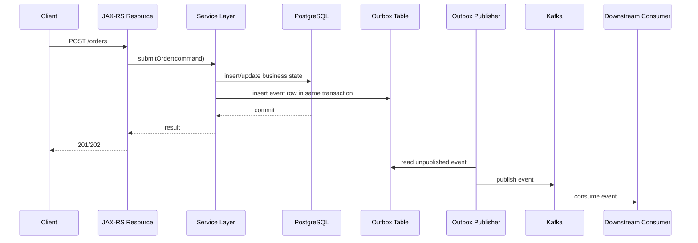

# Part 007 — Producer Correctness in Java/JAX-RS Services

## 1. Tujuan Part Ini

Part ini membahas Kafka producer dari sudut pandang correctness aplikasi Java/JAX-RS production.

Part sebelumnya membahas producer sebagai Kafka client: batching, ack, retry, timeout, serializer, partitioner, dan metrics. Part ini naik satu layer: bagaimana producer ditempatkan di dalam request lifecycle, service layer, transaction boundary, database write, outbox, dan event publication flow.

Dalam sistem enterprise, bug producer jarang sesederhana “kode tidak memanggil `send()`”. Bug yang lebih mahal biasanya berbentuk:

- database commit berhasil, event tidak terpublish
- event terpublish, database rollback
- event terpublish dua kali karena HTTP retry
- event terpublish dengan key salah sehingga ordering rusak
- event terpublish sebelum state bisnis stabil
- event berhasil masuk Kafka tetapi metadata tidak cukup untuk tracing
- producer callback gagal tetapi aplikasi sudah mengembalikan HTTP 200
- event dikonsumsi downstream sebelum transaction lokal benar-benar selesai
- event schema berubah tanpa consumer siap
- retry producer membuat duplicate yang tidak bisa dibedakan consumer

Part ini menjawab pertanyaan utama:

> Jika sebuah HTTP request di Java/JAX-RS mengubah state bisnis dan harus menghasilkan Kafka event, bagaimana memastikan event tersebut benar, konsisten, traceable, idempotent, dan production-debuggable?

## 2. Mental Model: HTTP Command to Event

Di service Java/JAX-RS, Kafka event sering lahir dari command yang datang melalui HTTP API.

Contoh alur konseptual:



Producer correctness tidak hanya berarti `KafkaProducer` berhasil publish. Correctness berarti business state, event contract, metadata, ordering, idempotency, observability, dan failure handling tetap masuk akal di seluruh lifecycle.

## 3. Layer Boundary di Java/JAX-RS

Secara umum, boundary yang perlu dipisahkan:

| Layer | Tanggung Jawab | Hal yang Tidak Boleh Bocor |
|---|---|---|
| JAX-RS Resource | HTTP parsing, validation dasar, auth context, response mapping | Kafka client detail, topic internals |
| Application/Service Layer | business use case, transaction boundary, event decision | HTTP-specific response mechanics |
| Domain/Application Logic | state transition, business invariant, domain event creation | Kafka transport concern |
| Persistence Layer | DB write, outbox insert, idempotency record | Kafka send langsung dari mapper |
| Publisher Layer | read outbox, serialize, publish, mark status | business decision baru |

Anti-pattern umum:

```java
@POST
@Path("/orders")
public Response submitOrder(OrderRequest request) {
    orderMapper.insert(request.toEntity());
    kafkaProducer.send(new ProducerRecord<>("order-created", request.getId(), request));
    return Response.ok().build();
}
```

Masalah:

- transaction boundary tidak eksplisit
- mapper dan producer tidak berada dalam consistency strategy yang jelas
- event payload memakai request object, bukan event contract
- tidak ada event ID/correlation ID
- tidak ada outbox
- error publish bisa terjadi setelah DB write
- retry HTTP dapat membuat duplicate order/event
- resource layer terlalu tahu topic/event detail

Pattern lebih sehat:

```text
JAX-RS Resource
  -> Application Service
      -> validate command
      -> enforce idempotency
      -> execute DB transaction
          -> change business state
          -> create event envelope
          -> insert outbox row
      -> return command result

Outbox Publisher
  -> read pending outbox rows
  -> publish to Kafka
  -> update publication status/attempt
```

## 4. Event Creation Timing

Pertanyaan penting:

> Kapan event dibuat?

Ada beberapa opsi.

### 4.1 Event Dibuat Sebelum DB Write

Flow:

```text
create event -> write DB -> publish event
```

Risiko:

- event merepresentasikan state yang belum berhasil disimpan
- jika DB write gagal, event harus dibuang
- mudah terjadi mismatch antara payload event dan final DB state

Umumnya tidak ideal untuk event yang merepresentasikan committed business fact.

### 4.2 Event Dibuat Setelah DB Write tetapi Sebelum Commit

Flow:

```text
begin transaction -> write DB -> create event -> publish Kafka -> commit DB
```

Risiko:

- event bisa terpublish tetapi DB rollback
- downstream melihat fakta yang tidak pernah committed
- Kafka tidak ikut transaction PostgreSQL

Ini adalah bentuk dual-write problem.

### 4.3 Event Dibuat Setelah Commit dan Dipublish Langsung

Flow:

```text
begin transaction -> write DB -> commit DB -> publish Kafka
```

Risiko:

- DB commit berhasil, publish gagal
- aplikasi crash setelah commit sebelum publish
- tidak ada durable record bahwa event harus dipublish

Ini mengurangi risiko event-before-commit, tetapi masih punya gap besar.

### 4.4 Event Dicatat di Outbox Dalam Transaction yang Sama

Flow:

```text
begin transaction -> write business state -> insert outbox event -> commit -> async publisher sends Kafka
```

Keuntungan:

- DB state dan niat publish event committed bersama
- jika publisher mati, event tetap ada di outbox
- retry publish bisa dilakukan durable
- debugging lebih mudah karena ada publication state
- cocok untuk business-critical event

Trade-off:

- perlu table outbox
- perlu publisher atau CDC pipeline
- eventual publication, bukan immediate publish
- perlu cleanup/retention
- perlu observability outbox lag

Untuk sistem enterprise dengan PostgreSQL dan Kafka, outbox sering menjadi baseline yang lebih aman daripada direct producer call di request transaction.

## 5. Producer Inside Transaction Risk

Salah satu kesalahan klasik:

```java
@Transactional
public void approveQuote(ApproveQuoteCommand command) {
    quoteMapper.updateStatus(command.quoteId(), "APPROVED");
    kafkaProducer.send(quoteApprovedRecord(command));
}
```

Walaupun method diberi `@Transactional`, Kafka publish tidak otomatis ikut transaction DB.

Failure matrix sederhana:

| DB Write | Kafka Publish | DB Commit | Hasil |
|---|---|---|---|
| sukses | sukses | sukses | normal |
| sukses | gagal | rollback | tidak ada state, tidak ada event |
| sukses | sukses | rollback | event palsu terpublish |
| sukses | timeout/unknown | sukses | state committed, event status ambigu |
| sukses | tidak sempat publish | sukses | state committed, event hilang |

Problem paling berbahaya:

> Kafka publish sukses tetapi DB rollback.

Downstream consumer akan memproses event yang merepresentasikan business fact yang tidak pernah terjadi.

## 6. Producing After Commit Risk

Sebagian engineer mencoba memperbaiki masalah di atas dengan publish setelah commit.

Flow:

```java
@Transactional
public QuoteResult approveQuote(command) {
    quoteMapper.updateStatus(...);
    return result;
}

public Response approve(...) {
    QuoteResult result = service.approveQuote(command);
    kafkaProducer.send(eventFrom(result));
    return Response.ok(result).build();
}
```

Ini menghindari event-before-rollback. Tetapi muncul failure baru:

| DB Commit | Publish | Hasil |
|---|---|---|
| sukses | sukses | normal |
| sukses | gagal | state berubah, event hilang |
| sukses | app crash sebelum publish | state berubah, event hilang |
| sukses | publish timeout ambiguous | tidak tahu event masuk Kafka atau tidak |

Tanpa durable outbox, sistem tidak punya sumber kebenaran bahwa event harus dikirim.

## 7. Outbox-Based Publishing

Outbox memindahkan publish intent ke database transaction yang sama dengan business write.

Contoh skema konseptual:

```sql
CREATE TABLE event_outbox (
    id UUID PRIMARY KEY,
    aggregate_type TEXT NOT NULL,
    aggregate_id TEXT NOT NULL,
    event_type TEXT NOT NULL,
    event_version INT NOT NULL,
    topic TEXT NOT NULL,
    partition_key TEXT NOT NULL,
    payload JSONB NOT NULL,
    headers JSONB NOT NULL,
    status TEXT NOT NULL,
    attempt_count INT NOT NULL DEFAULT 0,
    next_attempt_at TIMESTAMPTZ,
    created_at TIMESTAMPTZ NOT NULL,
    published_at TIMESTAMPTZ,
    last_error TEXT
);
```

Dalam transaction bisnis:

```java
@Transactional
public ApproveQuoteResult approveQuote(ApproveQuoteCommand command) {
    Quote quote = quoteRepository.getForUpdate(command.quoteId());
    quote.approve(command.actor());

    quoteRepository.save(quote);

    EventEnvelope event = eventFactory.quoteApproved(quote, command.context());
    outboxRepository.insert(event);

    return ApproveQuoteResult.accepted(quote.id());
}
```

Publisher terpisah:

```java
public void publishPendingOutboxBatch() {
    List<OutboxRow> rows = outboxRepository.claimPendingRows(batchSize);

    for (OutboxRow row : rows) {
        try {
            producer.send(toProducerRecord(row)).get();
            outboxRepository.markPublished(row.id());
        } catch (Exception e) {
            outboxRepository.markFailedForRetry(row.id(), e);
        }
    }
}
```

Catatan penting:

- outbox tidak menghilangkan duplicate sepenuhnya
- producer bisa sukses tetapi mark published gagal
- publisher retry dapat mengirim event yang sama lagi
- consumer tetap harus idempotent
- event ID harus stabil dan disimpan di outbox

Outbox memindahkan problem dari “event bisa hilang” menjadi “event bisa duplicate tetapi durable dan dapat direkonsiliasi”. Dalam Kafka, duplicate lebih mudah ditangani daripada missing event.

## 8. Polling Publisher vs CDC Publisher

Dua model umum outbox publishing:

### 8.1 Polling Publisher

Aplikasi atau worker membaca outbox table secara periodik.

Kelebihan:

- mudah dipahami
- tidak butuh Debezium/Kafka Connect
- kontrol retry/status eksplisit
- mudah debug dari table

Kekurangan:

- perlu locking/concurrency control
- polling interval menambah latency
- beban query ke DB
- perlu cleanup strategy

### 8.2 CDC Publisher

Debezium membaca perubahan outbox table dari WAL dan menerbitkan ke Kafka.

Kelebihan:

- tidak perlu polling query intensif
- event publication mengikuti commit log DB
- cocok untuk throughput tinggi
- mengurangi coupling aplikasi dengan publisher

Kekurangan:

- perlu Kafka Connect/Debezium expertise
- replication slot lag bisa mengancam WAL retention
- operational debugging lebih kompleks
- schema dan routing perlu governance
- connector failure menjadi production concern

Keputusan bukan “mana yang lebih modern”, tetapi:

> Tim mampu mengoperasikan failure mode yang mana?

## 9. Event ID

Setiap event production-grade perlu identity stabil.

Event ID digunakan untuk:

- idempotency consumer
- deduplication
- tracing
- DLQ/replay
- audit
- support investigation
- exactly/effectively-once reasoning di application level

Syarat event ID:

- unik global atau unik dalam boundary yang jelas
- dibuat sekali dan disimpan durable
- tidak berubah saat retry publish
- ikut payload atau header sesuai standar
- muncul di log producer, outbox, consumer, DLQ

Anti-pattern:

```java
// Dibuat ulang setiap retry publish
UUID eventId = UUID.randomUUID();
```

Jika event ID dibuat ulang pada retry, consumer tidak bisa membedakan duplicate publication dari event bisnis baru.

Pattern:

```text
event_id dibuat saat outbox row dibuat
retry publish memakai event_id yang sama
consumer memakai event_id untuk dedup
```

## 10. Correlation ID

Correlation ID menghubungkan event dengan request atau workflow awal.

Contoh:

```text
HTTP Request X-Correlation-Id: corr-123
  -> QuoteApproved event correlation_id=corr-123
  -> PricingUpdated event correlation_id=corr-123
  -> OrderSubmitted event correlation_id=corr-123
```

Fungsi:

- tracing across services
- log search
- incident investigation
- customer support
- reconstruct workflow

Jika request tidak membawa correlation ID, service entrypoint biasanya membuat satu ID baru.

Aturan penting:

- correlation ID tidak boleh berubah antar hop dalam workflow yang sama
- log harus memasukkan correlation ID
- event header/payload harus memasukkan correlation ID sesuai standar
- DLQ event harus mempertahankan correlation ID

## 11. Causation ID

Causation ID menjawab:

> Event ini terjadi karena command/event apa?

Contoh:

```text
Command: ApproveQuote(command_id=cmd-1)
  -> Event: QuoteApproved(event_id=evt-1, causation_id=cmd-1)
  -> Event: OrderEligibilityRequested(event_id=evt-2, causation_id=evt-1)
```

Correlation ID menyatukan workflow. Causation ID membentuk causal chain.

Kegunaan:

- debugging chain of events
- mendeteksi loop event
- menjelaskan kenapa downstream event dibuat
- audit dan compliance
- root cause analysis

Dalam sistem order lifecycle yang panjang, causation ID sering lebih penting daripada log message biasa.

## 12. Trace Context

Modern distributed tracing memakai trace/span context.

Kafka event harus membawa context agar trace HTTP request dapat tersambung ke asynchronous consumer.

Minimal:

- trace ID
- parent/span context sesuai instrumentation
- source service
- event ID
- correlation ID

Tantangan:

- event dikonsumsi lama setelah request selesai
- replay event tidak selalu harus dianggap trace request asli
- batch consumer dapat memproses banyak trace context sekaligus
- instrumentation otomatis tidak selalu menangani Kafka header dengan benar

Guideline:

- propagate trace context dari HTTP ke event
- log event ID + trace ID + correlation ID
- untuk replay, tandai replay metadata agar tidak membingungkan latency trace normal

## 13. Event Metadata

Event metadata adalah bagian dari contract operasional.

Metadata umum:

| Metadata | Fungsi |
|---|---|
| event_id | identity/dedup |
| event_type | routing/handler selection |
| event_version | schema evolution |
| aggregate_type | domain grouping |
| aggregate_id | business identity |
| partition_key | ordering/scaling |
| correlation_id | trace workflow |
| causation_id | causal chain |
| source_service | ownership/debug |
| tenant_id | multi-tenancy |
| actor_id | audit |
| event_time | business occurrence time |
| published_time | broker/publication time |
| schema_id/version | serialization governance |
| idempotency_key | command dedup |

Headers vs payload:

- header cocok untuk operational metadata yang dibutuhkan middleware/consumer framework
- payload cocok untuk business data yang menjadi contract domain
- metadata yang wajib untuk audit/replay sebaiknya tetap tersedia walaupun event diekstrak dari Kafka

Jangan menyimpan metadata penting hanya di log aplikasi.

## 14. Idempotency Key dari HTTP ke Event

HTTP client dapat mengirim idempotency key untuk command seperti create order, submit quote, approve quote, atau create amendment.

Flow:

```text
POST /orders
Idempotency-Key: idem-123

service stores idem-123 -> command result -> event metadata includes command_id/idempotency_key
```

Kegunaan:

- mencegah duplicate command akibat client retry
- mengembalikan response yang sama untuk retry request
- menghubungkan command dengan event
- membantu consumer memahami duplicate bisnis

Tetapi idempotency key HTTP tidak menggantikan event ID.

| Identifier | Scope |
|---|---|
| Idempotency Key | command/request dedup |
| Event ID | event publication/processing dedup |
| Aggregate ID | business entity identity |
| Correlation ID | workflow trace |
| Causation ID | causal relation |

## 15. Event Timestamp

Timestamp event perlu jelas artinya.

Jenis timestamp:

| Timestamp | Arti |
|---|---|
| event_time | kapan business event terjadi |
| created_at | kapan event object/outbox dibuat |
| published_at | kapan event dipublish ke Kafka |
| broker timestamp | timestamp record di Kafka |
| processed_at | kapan consumer memproses |

Kesalahan umum:

- memakai processing time sebagai event time
- memakai broker timestamp untuk audit business event
- tidak membedakan event replay dari event baru
- timestamp berasal dari timezone lokal tidak jelas

Guideline:

- gunakan UTC
- definisikan event_time secara eksplisit
- jangan ubah event_time saat retry publish
- tambahkan replay metadata jika event diproses ulang

## 16. User/Actor Metadata

Untuk sistem enterprise, event sering perlu menjawab:

> Siapa atau proses apa yang menyebabkan perubahan ini?

Actor bisa berupa:

- human user
- system user
- batch job
- integration client
- internal service
- automation/workflow engine

Metadata actor harus hati-hati karena bisa mengandung PII atau security-sensitive data.

Lebih aman:

```json
{
  "actor": {
    "type": "USER",
    "id": "user-123",
    "source": "identity-service"
  }
}
```

Daripada:

```json
{
  "userEmail": "person@example.com",
  "userFullName": "..."
}
```

Kecuali memang ada requirement audit yang jelas dan retention/security policy mendukung.

## 17. Tenant Metadata

Dalam sistem multi-tenant, tenant metadata memengaruhi:

- authorization downstream
- routing
- isolation
- observability
- replay safety
- data repair
- support investigation

Pertanyaan review:

- apakah event selalu membawa tenant ID?
- apakah tenant ID dipakai sebagai partition key?
- apakah tenant ID boleh dipakai sebagai partition key, atau menyebabkan hot partition?
- apakah consumer memvalidasi tenant boundary?
- apakah DLQ/replay tools tenant-aware?

Tenant ID sebagai partition key menjaga ordering per tenant, tetapi dapat menciptakan hot partition jika tenant besar sangat dominan. Untuk order/quote lifecycle, aggregate ID sering lebih baik untuk ordering per entity.

## 18. Event Payload: State, Delta, atau Notification?

Producer harus jelas menerbitkan apa.

### Notification Event

```text
QuoteApproved { quoteId }
```

Kelebihan:

- payload kecil
- tidak banyak duplikasi data

Kekurangan:

- consumer harus call back ke producer/source service
- temporal coupling meningkat
- replay lebih sulit jika state saat ini berbeda dari state saat event terjadi

### Event-Carried State Transfer

```text
QuoteApproved { quoteId, status, approvedAt, customerId, productSummary, ... }
```

Kelebihan:

- consumer lebih autonomous
- replay lebih kuat
- mengurangi synchronous dependency

Kekurangan:

- schema lebih besar
- risiko PII/data leakage
- schema evolution lebih kompleks

### Delta Event

```text
QuoteUpdated { changedFields: [...] }
```

Kelebihan:

- compact
- cocok untuk change log tertentu

Kekurangan:

- consumer harus punya prior state
- ordering lebih kritis
- replay dari tengah sulit

Senior review question:

> Consumer perlu tahu fakta apa untuk bekerja tanpa memanggil balik service asal?

## 19. Partition Key Correctness

Producer correctness sangat bergantung pada key.

Contoh business invariant:

- semua event untuk quote yang sama harus diproses berurutan
- semua event untuk order yang sama harus diproses berurutan
- semua event approval untuk request yang sama harus berurutan

Maka partition key kandidat:

- `quoteId`
- `orderId`
- `approvalRequestId`
- aggregate ID lain

Key buruk:

- random UUID per event jika consumer butuh ordering per aggregate
- null key jika ordering penting
- tenant ID jika tenant besar menciptakan hot partition
- timestamp jika distribusi tidak stabil
- user ID jika workflow sebenarnya per order/quote

Review producer harus selalu bertanya:

> Ordering dibutuhkan per apa?

Bukan:

> Key apa yang paling mudah tersedia?

## 20. Topic Selection Correctness

Producer harus tahu topic mana yang menjadi contract.

Masalah umum:

- topic dipilih dari string literal tersebar di code
- environment prefix hardcoded
- event type berbeda dikirim ke topic yang sama tanpa governance
- command topic dan event topic dicampur
- retry/DLQ topic dipakai sebagai normal topic
- topic name berubah tanpa migration plan

Pattern:

- central topic config
- environment-specific config dari deployment layer
- topic ownership jelas
- topic naming sesuai taxonomy
- schema subject strategy konsisten
- test memastikan event type -> topic mapping benar

## 21. Producer Retry Safety

Producer retry bisa aman atau berbahaya tergantung desain.

Retry aman jika:

- event ID stabil
- partition key stabil
- payload stabil
- idempotent producer enabled untuk retry di Kafka client boundary
- consumer idempotent
- outbox row tidak dibuat ulang untuk command yang sama

Retry berbahaya jika:

- setiap retry membuat event baru
- event ID berubah
- timestamp business berubah
- payload dihitung ulang dari mutable current state
- key berubah
- consumer tidak dedup
- HTTP retry membuat command baru

Poin penting:

> Retry harus mengulangi intent yang sama, bukan menciptakan fakta bisnis baru.

## 22. Duplicate Event Risk

Kafka-based systems harus menganggap duplicate event mungkin terjadi.

Sumber duplicate:

- producer retry setelah timeout ambiguous
- outbox publisher sukses publish tetapi gagal mark published
- application restart di tengah publish
- HTTP client retry command
- replay/backfill
- CDC connector restart/snapshot edge case
- manual operator action

Producer tidak boleh mengandalkan “consumer tidak akan pernah menerima duplicate”. Producer harus menyediakan metadata agar consumer bisa dedup.

Minimal:

- stable event ID
- stable aggregate ID
- stable event type/version
- stable causation/command ID
- deterministic partition key

## 23. Missing Event Risk

Missing event lebih berbahaya daripada duplicate karena sulit dideteksi.

Sumber missing event:

- DB commit berhasil tetapi publish gagal
- publish dilakukan best-effort tanpa callback
- callback error hanya di-log tanpa retry durable
- outbox cleanup terlalu agresif
- CDC connector stuck dan WAL hilang/slot rusak
- topic retention terlalu pendek untuk delayed consumer
- wrong topic/environment
- authorization failure tidak dipantau

Mitigasi:

- outbox/CDC
- publication status
- outbox lag metric
- reconciliation job
- event count reconciliation dengan business table
- DLQ dan producer error alert
- integration test untuk critical flow

## 24. Event Publication Failure

Producer failure harus diklasifikasikan.

| Failure | Contoh | Recovery |
|---|---|---|
| Serialization | schema mismatch, invalid enum | fix code/schema/data, retry setelah aman |
| Authorization | missing ACL | fix permission, retry |
| Unknown topic | topic belum dibuat | provision topic, retry |
| Timeout | broker/network slow | retry dengan budget, monitor |
| Record too large | payload terlalu besar | redesign payload/topic/config |
| Invalid config | bad serializer/security config | deploy fix |
| Broker unavailable | cluster issue | platform/SRE action |

Error handling yang buruk:

```java
producer.send(record); // no callback, no get, no metrics
```

Lebih baik:

```java
producer.send(record, (metadata, exception) -> {
    if (exception != null) {
        log.error("Kafka publish failed eventId={} topic={}", eventId, topic, exception);
        metrics.incrementPublishFailure(topic, exception);
        // direct producer path: trigger explicit failure handling
        // outbox path: status remains retryable
    } else {
        metrics.recordPublishSuccess(topic, metadata.partition(), metadata.offset());
    }
});
```

Namun untuk business-critical DB-backed events, callback saja belum cukup. Perlu durable retry mechanism.

## 25. HTTP Response Semantics

Jika HTTP request menghasilkan asynchronous event, response harus jujur.

### 200/201 Synchronous Success

Cocok jika:

- state lokal sudah committed
- response merepresentasikan state lokal
- downstream processing bukan bagian dari janji response

Risiko:

- client mengira seluruh workflow downstream selesai

### 202 Accepted

Cocok jika:

- command diterima
- processing lanjut asynchronous
- client perlu polling status atau subscribe update

Response sebaiknya menyertakan:

- command ID
- correlation ID
- status URL
- accepted timestamp

Contoh:

```json
{
  "commandId": "cmd-123",
  "correlationId": "corr-123",
  "status": "ACCEPTED",
  "statusUrl": "/orders/commands/cmd-123"
}
```

Jangan mengembalikan response yang memberi ilusi downstream sudah selesai jika event baru masuk outbox.

## 26. Synchronous `send().get()` in Request Path

Kadang engineer memakai:

```java
producer.send(record).get();
```

Tujuannya memastikan event sudah terkirim sebelum HTTP response.

Trade-off:

- request latency bergantung Kafka
- Kafka outage dapat menjatuhkan API
- thread request block
- timeout harus diatur hati-hati
- masih tidak menyelesaikan DB/Kafka transaction mismatch
- jika response gagal karena Kafka timeout, status DB bisa sudah berubah

`send().get()` boleh dipakai untuk use case tertentu, misalnya command gateway yang memang hanya menerima request jika Kafka publish sukses dan tidak ada DB write lokal. Tetapi untuk DB-backed business state, outbox biasanya lebih aman.

## 27. Serialization Boundary

Producer tidak boleh mengirim object internal sembarangan.

Anti-pattern:

```java
producer.send(new ProducerRecord<>(topic, quoteId, quoteEntity));
```

Masalah:

- entity internal bocor sebagai contract publik
- field DB berubah dapat merusak event schema
- lazy-loaded relation bisa muncul/tidak muncul
- PII tidak sengaja terkirim
- schema evolution tidak terkontrol

Pattern:

```java
QuoteApprovedEvent event = QuoteApprovedEvent.fromCommittedState(quote, metadata);
producer.send(toRecord(event));
```

Event DTO harus:

- eksplisit
- versioned
- schema-governed
- tidak bergantung pada entity persistence internal
- punya test serialization compatibility

## 28. Producer Observability

Producer correctness tidak selesai tanpa observability.

Minimal log fields:

- event ID
- event type
- topic
- partition key
- aggregate ID
- correlation ID
- causation ID
- source service
- outbox row ID jika ada
- publish status
- exception class

Minimal metrics:

- publish success count
- publish failure count
- publish latency
- retry count/rate
- serialization failure count
- authorization failure count
- record send rate
- record error rate
- buffer available/wait time
- outbox pending count
- outbox oldest pending age
- DLQ/error table count jika ada

Log sensitive payload full biasanya harus dihindari. Log metadata dan hash/reference lebih aman.

## 29. Producer Shutdown Correctness

Saat service shutdown:

- jangan langsung kill producer
- hentikan menerima traffic jika perlu
- drain in-flight send sesuai grace period
- flush producer jika direct publish
- release publisher locks/claims
- jangan mark outbox published sebelum ack sukses
- pastikan duplicate akibat restart bisa ditangani

Kubernetes concern:

- SIGTERM diterima pod
- readiness harus false sebelum shutdown aktif
- preStop/grace period cukup
- publisher loop berhenti mengambil batch baru
- batch berjalan diselesaikan atau dilepas aman

Shutdown buruk bisa menghasilkan:

- event hilang jika direct async send belum flush
- duplicate jika outbox claim tidak dilepas jelas
- long termination jika producer close timeout terlalu besar

## 30. Producer Configuration in Application Context

Konfigurasi producer harus dipahami dalam konteks service.

Contoh pertanyaan:

- apakah `acks=all` digunakan untuk business-critical event?
- apakah `enable.idempotence=true`?
- apakah `max.in.flight.requests.per.connection` menjaga ordering saat retry?
- apakah `delivery.timeout.ms` selaras dengan retry budget?
- apakah `max.block.ms` dapat memblokir request thread terlalu lama?
- apakah `compression.type` sesuai throughput/CPU?
- apakah `linger.ms` cocok untuk latency SLA?
- apakah `client.id` jelas untuk metrics?
- apakah security config berasal dari Secret, bukan hardcoded?

Producer config bukan sekadar performance tuning. Ia bagian dari correctness envelope.

## 31. Internal Verification Checklist

Saat masuk codebase/team, verifikasi hal berikut.

### Producer Placement

- Di layer mana Kafka producer dipanggil?
- Apakah dipanggil dari JAX-RS resource, service layer, outbox publisher, atau CDC pipeline?
- Apakah ada abstraction/wrapper internal?
- Apakah topic name tersebar sebagai string literal?

### Transaction Boundary

- Apakah business DB write dan event publication berada dalam strategy yang jelas?
- Apakah ada outbox table?
- Apakah outbox row dibuat dalam transaction yang sama dengan business state?
- Apakah direct publish dilakukan sebelum atau setelah commit?
- Apakah ada flow yang publish event tanpa durable retry?

### Event Identity and Metadata

- Apakah setiap event punya stable event ID?
- Apakah event ID dibuat ulang saat retry?
- Apakah correlation ID dari HTTP dipropagasi?
- Apakah causation ID digunakan?
- Apakah trace context masuk header?
- Apakah tenant/actor/source metadata tersedia?

### Schema and Contract

- Apakah event DTO terpisah dari DB entity/request DTO?
- Apakah schema registry digunakan?
- Apakah compatibility check ada di CI?
- Apakah event versioning jelas?
- Apakah field PII terkontrol?

### Partition and Topic

- Apakah partition key eksplisit?
- Apakah key sesuai aggregate ordering?
- Apakah topic ownership jelas?
- Apakah retry/DLQ topic convention ada?
- Apakah environment naming konsisten?

### Failure Handling

- Apakah producer callback menangani error?
- Apakah error hanya di-log atau durable retry?
- Apakah outbox publisher punya retry budget?
- Apakah serialization failure bisa dipulihkan?
- Apakah publish failure punya alert?

### Observability

- Apakah publish success/failure metric ada?
- Apakah outbox lag dashboard ada?
- Apakah producer client metrics diekspos?
- Apakah log bisa dicari berdasarkan event ID/correlation ID?
- Apakah incident notes menyebut producer failure pattern?

## 32. PR Review Checklist

Gunakan checklist ini saat mereview perubahan producer.

### Event Design

- Event merepresentasikan business fact atau sekadar internal notification?
- Event type jelas dan stabil?
- Payload cukup untuk consumer bekerja?
- Tidak membocorkan entity internal?
- Tidak membawa PII tanpa alasan?

### Correctness

- DB write + event publish bebas dual-write gap?
- Outbox digunakan jika event business-critical?
- Event ID stabil?
- HTTP retry tidak membuat duplicate business effect?
- Producer retry tidak mengubah payload/key/event ID?

### Ordering

- Partition key sesuai invariant?
- Null/random key tidak dipakai saat ordering penting?
- Perubahan partition count dipertimbangkan?

### Metadata

- correlation ID ada?
- causation ID ada jika workflow panjang?
- trace context ada?
- tenant/actor/source metadata ada?
- event time jelas?

### Operational Readiness

- producer metric ada?
- failure alert ada?
- log tidak berisi payload sensitif?
- DLQ/outbox error handling jelas?
- runbook tersedia?

## 33. Failure Scenario Walkthrough

### Scenario A: DB Commit Sukses, Kafka Down

Direct publish after commit:

- event hilang kecuali ada retry durable
- HTTP response mungkin gagal atau sukses ambigu
- downstream tidak tahu state berubah

Outbox:

- event row tetap pending
- publisher retry saat Kafka pulih
- outbox lag naik dan bisa di-alert
- consumer tetap harus idempotent

### Scenario B: Kafka Publish Sukses, Mark Published Gagal

Outbox publisher:

- row masih pending/claimed
- retry publish dapat mengirim duplicate
- event ID sama
- consumer dedup dengan inbox/processed event table

Ini expected failure mode. Jangan menganggap duplicate sebagai bug fatal jika idempotency benar.

### Scenario C: HTTP Client Timeout Lalu Retry

Tanpa idempotency key:

- command bisa diproses dua kali
- event bisa dua kali dengan business effect berbeda

Dengan idempotency key:

- service mengenali duplicate command
- response lama bisa dikembalikan
- event tidak dibuat ulang sebagai business event baru

### Scenario D: Schema Serialization Failure Setelah Commit

Jika event payload dibuat dan disimpan di outbox sebagai JSONB valid tetapi serializer gagal saat publish:

- outbox row masuk failed/retry state
- butuh fix schema/data/serializer
- setelah fix, row bisa dipublish

Jika event dibuat langsung saat publish tanpa outbox:

- failure bisa hilang sebagai log saja
- business state committed tanpa durable event

## 34. Minimal Production Standard

Untuk producer di Java/JAX-RS enterprise system, baseline minimum:

- producer tidak tersebar langsung di resource method
- event DTO terpisah dari request/entity DTO
- topic dan partition key eksplisit
- stable event ID
- correlation ID propagation
- causation ID untuk workflow/event chain
- trace context propagation
- tenant/actor/source metadata bila relevan
- schema governance
- idempotent producer enabled untuk producer client correctness
- outbox untuk DB-backed business-critical event
- callback/error handling eksplisit
- producer metrics
- outbox lag monitoring jika outbox digunakan
- retry behavior terdokumentasi
- consumer idempotency diasumsikan wajib
- logging aman dan traceable
- PR checklist untuk event design dan producer correctness

## 35. Kesalahan Umum yang Harus Dihindari

- publish Kafka langsung dari JAX-RS resource tanpa transaction reasoning
- publish sebelum DB commit
- publish setelah DB commit tanpa outbox untuk event penting
- menganggap Kafka transaction menyelesaikan transaction PostgreSQL
- memakai request DTO/entity sebagai event schema
- event ID dibuat ulang setiap retry
- partition key null padahal ordering penting
- correlation ID tidak dipropagasi
- producer callback diabaikan
- producer error hanya di-log tanpa alert/retry
- payload full sensitif di-log
- tidak ada dashboard publish failure/outbox lag
- tidak ada replay/reconciliation plan

## 36. Kesimpulan

Producer correctness adalah tentang menjaga hubungan antara command, state change, event publication, metadata, ordering, dan failure recovery.

Ringkasan prinsip:

- Kafka producer bukan transaction manager database.
- Direct publish dari request path harus dipakai dengan sangat hati-hati.
- Business-critical DB-backed event umumnya butuh outbox atau CDC strategy.
- Duplicate event harus diasumsikan mungkin terjadi.
- Missing event harus dicegah dengan durable publication intent.
- Event ID, correlation ID, causation ID, tenant, actor, trace context, dan event time adalah bagian dari production contract.
- Producer retry harus mengulang intent yang sama, bukan menciptakan event baru.
- HTTP response harus jujur terhadap asynchronous lifecycle.
- Observability producer wajib, bukan tambahan.

Pertanyaan senior engineer saat review bukan hanya:

> Apakah event dikirim ke Kafka?

Tetapi:

> Jika request retry, DB rollback, Kafka timeout, app crash, schema error, outbox retry, atau consumer replay terjadi, apakah event tetap benar, dedupable, traceable, dan dapat dipulihkan?
