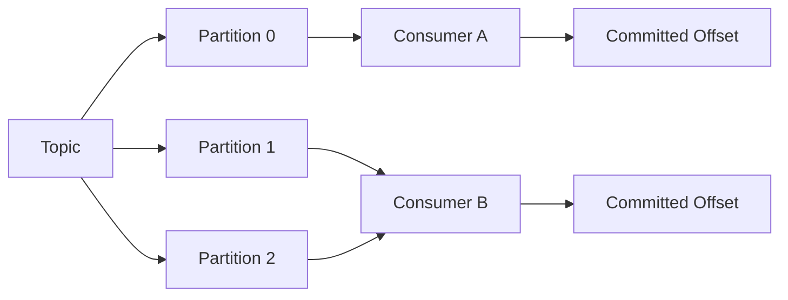
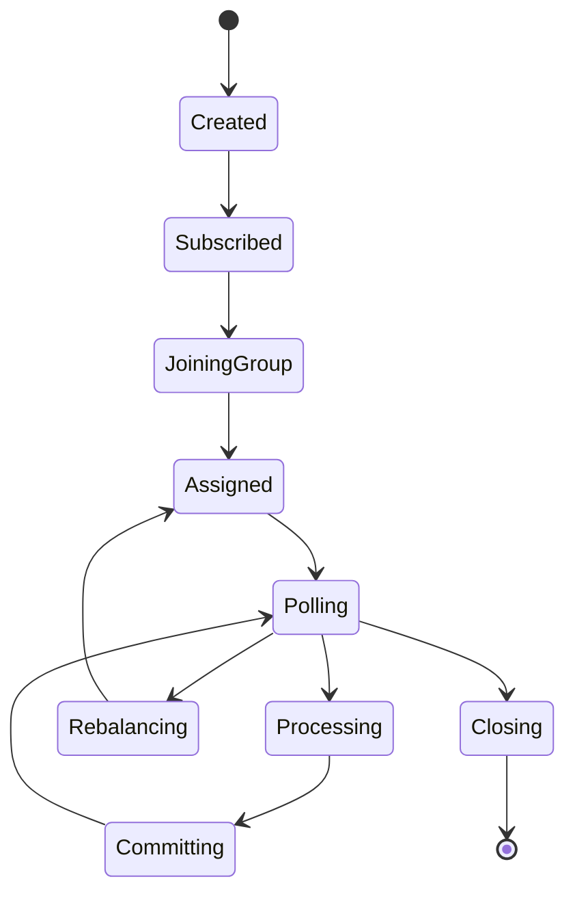

# Part 008 — Consumer Fundamentals

## 1. Tujuan Part Ini

Part ini membahas Kafka consumer dari sudut pandang backend engineer yang harus membangun dan mengoperasikan consumer Java production.

Consumer bukan sekadar:

```java
while (true) {
    ConsumerRecords<K, V> records = consumer.poll(Duration.ofMillis(1000));
}
```

Consumer adalah komponen distributed system yang menentukan:

- partition mana yang diproses instance tertentu
- offset mana yang sudah dianggap selesai
- kapan message boleh diproses ulang
- kapan duplicate bisa terjadi
- kapan consumer group rebalance
- kapan lag naik
- kapan consumer dianggap mati
- kapan processing terlalu lama membuat partition ditarik consumer lain
- bagaimana backpressure dilakukan
- bagaimana shutdown dilakukan tanpa data loss atau duplicate berlebihan

Part ini fokus pada fundamental Kafka consumer. Correctness dan idempotency consumer dibahas lebih dalam di Part 009.

## 2. Consumer Mental Model

Kafka consumer membaca record dari topic partition. Consumer tidak menghapus record dari topic. Kafka menyimpan log sesuai retention. Consumer menyimpan posisi baca melalui offset.



Mental model utama:

> Kafka consumer tidak “mengambil dan menghapus” message. Consumer membaca log dan mengatur offset sebagai checkpoint progress.

Konsekuensi:

- record dapat dibaca ulang jika offset di-reset
- consumer berbeda dapat membaca topic yang sama dengan consumer group berbeda
- offset commit adalah keputusan correctness
- retention topic menentukan seberapa jauh consumer bisa replay

## 3. Consumer vs Queue Worker

Dalam queue tradisional, message sering dianggap “diambil” lalu di-ack/nack. Dalam Kafka, record tetap berada di log.

| Aspek | Queue Worker | Kafka Consumer |
|---|---|---|
| Storage | queue menyimpan message sampai ack/delete | topic log menyimpan record sesuai retention |
| Progress | per-message ack | offset commit per partition/group |
| Replay | sering tidak natural | natural selama retention masih ada |
| Fanout | queue/exchange binding | consumer group berbeda |
| Parallelism | worker bersaing atas queue | partition dibagi ke consumer dalam group |
| Ordering | tergantung queue/consumer | dijamin per partition |

Ini alasan consumer Kafka perlu dipikirkan sebagai log reader + checkpoint manager, bukan worker queue biasa.

## 4. Consumer Lifecycle

Lifecycle consumer umum:

1. Consumer dibuat dengan config.
2. Consumer subscribe topic atau assign partition manual.
3. Consumer join consumer group.
4. Group coordinator melakukan partition assignment.
5. Consumer menjalankan poll loop.
6. Records diproses.
7. Offset di-commit sesuai strategy.
8. Consumer mengirim heartbeat agar dianggap alive.
9. Jika membership berubah, rebalance terjadi.
10. Saat shutdown, consumer berhenti polling, commit jika perlu, lalu close.



Setiap transisi punya failure mode.

## 5. Consumer Group

Consumer group adalah sekumpulan consumer yang bekerja sama membaca topic.

Aturan penting:

- satu partition hanya bisa diproses oleh satu consumer dalam consumer group pada satu waktu
- satu consumer bisa memproses banyak partition
- consumer group berbeda membaca topic secara independen
- offset disimpan per consumer group + topic + partition

Contoh:

```text
Topic orders.events, 6 partitions
Consumer group order-projection-service, 3 consumers

Consumer A -> partitions 0,1
Consumer B -> partitions 2,3
Consumer C -> partitions 4,5
```

Jika consumer menjadi 6:

```text
Consumer A -> partition 0
Consumer B -> partition 1
Consumer C -> partition 2
Consumer D -> partition 3
Consumer E -> partition 4
Consumer F -> partition 5
```

Jika consumer menjadi 10, hanya 6 yang aktif memproses partition. Empat sisanya idle untuk topic itu.

## 6. Consumer Group Naming

Consumer group ID adalah identitas aplikasi/projection/workflow consumer.

Group ID buruk:

- `test`
- `consumer-1`
- `my-service`
- random per deployment
- berubah setiap release tanpa alasan

Group ID yang lebih baik:

```text
order-service.order-state-projector.v1
quote-service.approval-event-handler.v1
billing-integration.order-submitted-consumer.v1
```

Pertimbangan:

- stable across deployment
- mencerminkan owner dan purpose
- tidak berubah kecuali ingin reset/rebuild consumption line
- versioning hanya jika consumer behavior/state model benar-benar berbeda

Jika group ID berubah, consumer akan mulai sebagai group baru dan membaca sesuai `auto.offset.reset` jika belum ada committed offset. Ini bisa memicu replay besar.

## 7. Topic Subscription vs Manual Assignment

Consumer bisa membaca partition dengan dua model.

### Subscribe

```java
consumer.subscribe(List.of("orders.events"));
```

Consumer ikut group management dan Kafka otomatis assign partition.

Cocok untuk:

- service consumer normal
- horizontal scaling
- rebalance otomatis
- deployment Kubernetes

### Manual Assign

```java
consumer.assign(List.of(new TopicPartition("orders.events", 0)));
```

Aplikasi mengatur partition sendiri.

Cocok untuk:

- tooling admin
- replay utility
- migration script
- diagnostic reader
- special-purpose processor

Untuk production microservice biasa, `subscribe` lebih umum.

## 8. Poll Loop

Poll loop adalah jantung consumer.

Struktur sederhana:

```java
while (running) {
    ConsumerRecords<String, Event> records = consumer.poll(Duration.ofMillis(500));
    for (ConsumerRecord<String, Event> record : records) {
        handle(record);
    }
    consumer.commitSync();
}
```

Tetapi production poll loop harus mempertimbangkan:

- deserialization error
- processing error
- retry/DLQ
- manual offset commit
- batch vs per-record processing
- pause/resume
- shutdown
- rebalance listener
- metrics
- max poll interval
- backpressure

Poll loop tidak boleh diperlakukan sebagai while-loop biasa. Ia adalah coordination mechanism dengan Kafka group protocol.

## 9. Poll Does More Than Fetch

`poll()` tidak hanya mengambil data.

Ia juga:

- mengirim heartbeat pada konfigurasi tertentu
- menjalankan group coordination
- menangani rebalance callback
- mengambil metadata
- mengembalikan records dari fetch buffer
- menjaga membership consumer group

Jika aplikasi terlalu lama tidak memanggil `poll()`, Kafka dapat menganggap consumer tidak sehat atau tidak mampu memproses assignment.

Akibat:

- partition dicabut
- rebalance terjadi
- record yang belum commit bisa diproses ulang oleh consumer lain
- lag naik
- duplicate processing terjadi

## 10. Offset

Offset adalah posisi record dalam partition.

Contoh:

```text
orders.events partition 0
offset: 0  1  2  3  4  5  6
record: A  B  C  D  E  F  G
```

Offset bersifat:

- monotonically increasing per partition
- tidak global antar partition
- tidak merepresentasikan timestamp
- tidak selalu contiguous dalam semua kondisi compaction/retention visibility
- digunakan consumer group untuk checkpoint

Consumer membaca record pada offset tertentu, lalu commit offset berikutnya sebagai posisi lanjut.

Jika record offset 5 selesai diproses, committed offset biasanya 6.

## 11. Committed Offset

Committed offset adalah posisi terakhir yang dianggap aman oleh consumer group.

Penting:

> Commit offset berarti consumer mengatakan: record sebelum offset ini tidak perlu dikirim lagi kepada group ini.

Jika commit dilakukan terlalu awal, data bisa hilang secara logis dari perspektif consumer.

Jika commit dilakukan terlambat, data bisa diproses ulang.

Kafka tidak tahu apakah business processing berhasil. Kafka hanya tahu offset yang di-commit.

## 12. Auto Commit

Auto commit dikontrol oleh:

```properties
enable.auto.commit=true
auto.commit.interval.ms=5000
```

Dengan auto commit, consumer client dapat commit offset periodik berdasarkan records yang sudah dikembalikan oleh poll, bukan selalu berdasarkan business processing yang benar-benar selesai.

Risiko:

- record dipoll
- offset auto-committed
- aplikasi crash sebelum processing selesai
- setelah restart, record tidak dibaca ulang
- business event hilang dari perspektif consumer

Auto commit cocok untuk:

- non-critical analytics ringan
- logging/metrics consumer yang toleran loss
- prototype

Untuk business-critical consumer, manual commit biasanya lebih aman.

## 13. Manual Commit

Manual commit memberi aplikasi kontrol kapan offset dianggap selesai.

```properties
enable.auto.commit=false
```

Pattern:

```java
while (running) {
    ConsumerRecords<String, Event> records = consumer.poll(timeout);
    process(records);
    consumer.commitSync();
}
```

Lebih baik, commit setelah processing sukses.

Tetapi manual commit bukan solusi lengkap. Jika processing batch sebagian sukses dan sebagian gagal, commit batch penuh bisa salah.

Pertanyaan review:

- commit dilakukan per record, per partition, atau per batch?
- jika record ketiga gagal dalam batch, offset mana yang di-commit?
- apakah processing idempotent jika batch diulang?
- apakah error masuk retry/DLQ atau memblokir partition?

## 14. Sync Commit

`commitSync()` memblokir sampai commit sukses atau error.

Kelebihan:

- lebih sederhana
- failure commit langsung diketahui
- cocok saat shutdown atau checkpoint penting

Kekurangan:

- menambah latency
- throughput lebih rendah jika terlalu sering
- dapat memperlambat poll loop

Pattern umum:

- gunakan commit sync saat shutdown
- gunakan commit sync untuk boundary batch yang kritis
- hindari commit sync per record jika throughput tinggi kecuali volume rendah dan correctness lebih penting

## 15. Async Commit

`commitAsync()` tidak memblokir.

Kelebihan:

- throughput lebih baik
- poll loop tidak tertahan commit

Risiko:

- commit bisa gagal diam-diam jika callback tidak diperiksa
- callback bisa datang out of order
- retry commit async yang lama bisa menimpa offset lebih baru jika tidak hati-hati

Contoh risk:

```text
commitAsync(offset 100) -> lambat/gagal
commitAsync(offset 200) -> sukses
retry offset 100 -> sukses setelahnya
```

Jika tidak dikelola, committed offset bisa mundur secara logis dalam cara yang membingungkan.

Praktik umum:

- callback async commit harus log/metric error
- saat shutdown lakukan commitSync terakhir
- jangan retry async commit secara naif tanpa mempertimbangkan ordering

## 16. Per-Partition Offset Commit

Untuk batch multi-partition, commit offset global bisa terlalu kasar.

Kafka memungkinkan commit map offset per TopicPartition.

Konsep:

```java
Map<TopicPartition, OffsetAndMetadata> offsets = new HashMap<>();
offsets.put(tp0, new OffsetAndMetadata(lastProcessedOffsetTp0 + 1));
offsets.put(tp1, new OffsetAndMetadata(lastProcessedOffsetTp1 + 1));
consumer.commitSync(offsets);
```

Ini penting jika:

- batch berisi records dari banyak partition
- salah satu partition gagal
- partition lain sukses dan ingin di-commit
- processing per partition independen

Namun harus hati-hati menjaga ordering per partition.

## 17. Partition Assignment

Partition assignment menentukan consumer mana memproses partition mana.

Assignment strategy umum:

- RangeAssignor
- RoundRobinAssignor
- StickyAssignor
- CooperativeStickyAssignor

Dampak assignment:

- distribusi load
- jumlah partition pindah saat rebalance
- cache/state locality
- rebalance disruption

Untuk Kafka Streams, assignment lebih kompleks karena task/state store. Untuk plain consumer, assignment tetap penting jika partition memiliki load tidak merata.

## 18. Rebalance

Rebalance terjadi saat consumer group membership atau topic metadata berubah.

Penyebab:

- consumer instance start
- consumer instance stop
- pod restart
- deployment rolling update
- consumer crash
- max poll interval terlewati
- session timeout
- partition count berubah
- subscription topic berubah

Saat rebalance:

- partition dapat dicabut dari consumer lama
- partition diberikan ke consumer baru
- consumer perlu commit offset sebelum kehilangan partition
- processing in-flight harus dikendalikan

Rebalance bukan error. Rebalance adalah bagian normal Kafka. Tetapi rebalance storm adalah problem production.

## 19. Rebalance Failure Mode

Failure mode umum:

### 19.1 Long Processing

Consumer memproses record terlalu lama dan tidak poll.

Akibat:

- max poll interval terlewati
- consumer dianggap stuck
- rebalance
- record diproses ulang oleh instance lain

### 19.2 Rolling Deployment Terlalu Agresif

Banyak pod restart bersamaan.

Akibat:

- consumer group sering rebalance
- lag naik
- throughput turun
- duplicate processing meningkat

### 19.3 Consumer Crash Loop

Consumer crash setelah menerima assignment.

Akibat:

- partition terus berpindah
- lag naik
- DLQ/retry tidak sempat stabil

### 19.4 Slow Shutdown

Consumer tidak commit/revoke dengan benar sebelum mati.

Akibat:

- duplicate lebih banyak
- offset checkpoint tertinggal

## 20. Cooperative Rebalance

Cooperative rebalance mengurangi stop-the-world behavior dengan memindahkan partition secara bertahap.

Dengan eager rebalance, semua consumer dapat mencabut semua partition lalu assign ulang.

Dengan cooperative rebalance, hanya partition yang perlu dipindah yang dicabut.

Keuntungan:

- downtime processing lebih rendah
- lebih stabil saat rolling deploy
- lebih baik untuk state/cache locality

Namun cooperative rebalance tetap membutuhkan consumer code yang benar:

- handle partition revoked
- commit offset saat revoked
- hentikan processing partition yang dicabut
- jangan memproses record dari partition yang sudah bukan miliknya

## 21. Group Coordinator

Group coordinator adalah broker yang mengelola consumer group tertentu.

Tugasnya:

- menerima join group
- memilih group leader
- menjalankan assignment protocol
- menerima heartbeat
- menyimpan offset commit ke internal topic `__consumer_offsets`
- mendeteksi member timeout

Jika coordinator bermasalah:

- commit offset bisa gagal
- rebalance bisa lambat
- consumer log penuh coordinator error
- lag bisa naik

Sebagai application engineer, tidak selalu perlu tahu broker mana coordinator-nya, tetapi perlu mengenali symptom group coordination issue.

## 22. Heartbeat

Heartbeat memberi tahu coordinator bahwa consumer masih hidup.

Config terkait:

```properties
heartbeat.interval.ms
session.timeout.ms
```

Guideline umum:

- heartbeat interval harus lebih kecil dari session timeout
- session timeout terlalu kecil membuat consumer sensitif terhadap GC pause/network jitter
- session timeout terlalu besar membuat failure detection lambat

Catatan penting:

Sejak Kafka consumer modern, heartbeat dapat berjalan di background thread, tetapi `max.poll.interval.ms` tetap membatasi jarak antar poll untuk memastikan aplikasi tidak stuck processing.

## 23. Session Timeout

`session.timeout.ms` menentukan berapa lama coordinator menunggu heartbeat sebelum consumer dianggap mati.

Terlalu rendah:

- rebalance mudah terjadi karena jitter
- GC pause bisa dianggap failure
- deployment tidak stabil

Terlalu tinggi:

- consumer mati lambat terdeteksi
- partition idle lebih lama
- failover lebih lambat

Session timeout harus disesuaikan dengan network, runtime, dan operasional deployment.

## 24. Max Poll Interval

`max.poll.interval.ms` menentukan maksimum waktu antara dua `poll()`.

Jika processing satu batch lebih lama dari max poll interval, consumer dianggap tidak responsif meskipun heartbeat masih berjalan.

Contoh:

```properties
max.poll.interval.ms=300000 # 5 menit
max.poll.records=500
```

Jika memproses 500 records butuh 10 menit, consumer bisa dikeluarkan dari group.

Solusi:

- kurangi `max.poll.records`
- perbaiki processing latency
- gunakan pause/resume
- pindahkan processing berat ke worker dengan kontrol offset hati-hati
- naikkan max poll interval jika memang realistis
- gunakan batch size sesuai SLA

## 25. Max Poll Records

`max.poll.records` membatasi jumlah record yang dikembalikan per poll.

Terlalu besar:

- processing batch lama
- max poll interval risk
- memory pressure
- commit granularity kasar
- shutdown lambat

Terlalu kecil:

- throughput rendah
- overhead poll/commit lebih tinggi

Untuk consumer bisnis yang melakukan DB write atau external call, `max.poll.records` harus diuji berdasarkan processing latency p95/p99, bukan ditebak.

## 26. Fetch Size and Fetch Wait

Config fetch memengaruhi throughput dan latency.

Beberapa config:

- `fetch.min.bytes`
- `fetch.max.bytes`
- `max.partition.fetch.bytes`
- `fetch.max.wait.ms`

Trade-off:

- fetch lebih besar meningkatkan throughput
- fetch lebih kecil menurunkan latency untuk low-volume topic
- record besar dapat gagal jika max partition fetch terlalu kecil
- memory consumer harus cukup untuk fetch batch

Untuk high-volume topic, fetch tuning dapat signifikan. Untuk low-volume critical event, correctness dan latency biasanya lebih penting.

## 27. Pause and Resume

Consumer dapat pause partition untuk sementara.

Use case:

- downstream DB sedang overload
- external API rate limit
- retry delay per partition
- backpressure internal queue penuh
- isolate poison event handling

Contoh konseptual:

```java
consumer.pause(List.of(topicPartition));
// continue polling to keep heartbeat/group membership
// later
consumer.resume(List.of(topicPartition));
```

Poin penting:

- pause bukan stop polling total
- consumer tetap perlu poll agar group membership hidup
- pause terlalu lama bisa membuat lag naik
- pause harus terlihat di metrics/log

## 28. Backpressure

Backpressure adalah cara consumer tidak mengambil/memproses lebih banyak daripada kapasitas downstream.

Sumber bottleneck:

- PostgreSQL slow query/lock
- external API latency
- Redis unavailable
- thread pool penuh
- CPU throttling Kubernetes
- serialization/deserialization cost
- slow schema registry

Strategi:

- batasi `max.poll.records`
- pause partition
- bounded worker queue
- rate limit processing
- circuit breaker untuk external dependency
- retry topic daripada blocking partition terlalu lama
- scale consumer sesuai partition count

Anti-pattern:

- poll besar lalu taruh semua records ke unbounded queue
- commit offset sebelum worker selesai
- terus poll saat downstream mati
- sleep panjang tanpa poll sampai rebalance

## 29. Consumer Shutdown

Shutdown consumer harus graceful.

Target:

- berhenti menerima work baru
- selesaikan processing yang aman diselesaikan
- commit offset untuk record yang sudah benar-benar selesai
- jangan commit record yang belum selesai
- close consumer agar leave group jelas

Pattern:

```java
Runtime.getRuntime().addShutdownHook(new Thread(() -> {
    running.set(false);
    consumer.wakeup();
}));
```

`wakeup()` membuat thread yang sedang poll keluar dengan `WakeupException`.

Flow:

```text
SIGTERM -> set running=false -> wakeup poll -> finish/abort safe -> commit final offsets -> close consumer
```

Kubernetes concern:

- readiness false dulu agar traffic berhenti
- terminationGracePeriodSeconds cukup
- rolling update jangan mematikan terlalu banyak pod sekaligus
- cooperative rebalance membantu mengurangi disruption

## 30. Deserialization Failure

Deserialization bisa gagal sebelum handler menerima record.

Penyebab:

- schema tidak compatible
- corrupt payload
- wrong serializer/deserializer
- event type tidak sesuai topic
- unknown schema ID
- Schema Registry unavailable

Failure ini berbahaya karena consumer mungkin tidak bisa membaca record untuk menentukan DLQ payload jika deserializer melempar exception terlalu awal.

Pattern mitigasi:

- error-handling deserializer jika framework mendukung
- consume raw bytes lalu deserialize di handler boundary untuk kontrol DLQ
- schema compatibility check di CI
- alert deserialization failure
- DLQ dengan raw payload + metadata jika aman

## 31. Processing Model: Single Thread vs Worker Pool

### Single Thread Poll and Process

Sederhana:

```text
poll -> process records -> commit -> poll
```

Kelebihan:

- offset reasoning mudah
- ordering per partition lebih mudah dijaga
- failure handling jelas

Kekurangan:

- throughput terbatas
- long processing memengaruhi poll interval

### Worker Pool

```text
poll thread -> dispatch records to workers -> workers process -> commit when safe
```

Kelebihan:

- throughput lebih tinggi
- processing parallel

Risiko:

- offset commit jauh lebih kompleks
- ordering per partition bisa rusak
- worker queue bisa unbounded
- partition revoked saat worker masih memproses
- commit record yang belum selesai

Jika memakai worker pool, pastikan:

- ordering requirement jelas
- commit hanya sampai contiguous processed offset per partition
- partition pause saat terlalu banyak in-flight
- revoke callback menunggu/membatalkan work dengan aman
- metrics in-flight per partition ada

## 32. Consumer Metrics

Minimal metrics yang perlu diamati:

### Lag Metrics

- consumer group lag
- partition lag
- max lag per partition
- lag age jika tersedia

### Poll Metrics

- poll rate
- poll latency
- time between polls
- records per poll
- bytes consumed rate

### Processing Metrics

- processing latency p50/p95/p99
- processing success/failure count
- retry count
- DLQ count
- DB/external call latency

### Rebalance Metrics

- rebalance count/rate
- partition revoked/assigned count
- time spent in rebalance

### Commit Metrics

- commit latency
- commit failure count
- last committed offset

### Resource Metrics

- CPU
- memory
- GC pause
- thread pool queue depth
- DB connection pool usage

Consumer lag saja tidak cukup. Lag naik adalah symptom, bukan root cause.

## 33. Consumer Lag

Consumer lag adalah selisih antara latest offset di partition dan committed/current offset consumer group.

Lag naik bisa berarti:

- producer throughput naik
- consumer processing melambat
- consumer mati
- consumer stuck pada poison event
- rebalance storm
- DB/external dependency lambat
- partition hot/skew
- consumer replicas kurang
- partition count membatasi parallelism

Lag tidak selalu buruk. Lag harus dibaca dengan konteks:

- apakah topic high-volume analytics?
- apakah event critical low-latency?
- apakah lag age melanggar SLA?
- apakah lag hanya satu partition?
- apakah lag terjadi setelah deployment?

Senior debugging:

> Jangan hanya bertanya “berapa lag?”. Tanya “lag di partition mana, sejak kapan, setelah perubahan apa, dan bottleneck downstream apa?”

## 34. Auto Offset Reset

`auto.offset.reset` digunakan jika consumer group belum punya committed offset atau offset lama sudah tidak valid.

Nilai umum:

- `earliest`
- `latest`
- `none`

`earliest`:

- consumer baru membaca dari offset paling awal yang masih tersedia
- bisa memicu replay besar

`latest`:

- consumer baru hanya membaca record baru
- bisa melewatkan historical data

`none`:

- error jika offset tidak ada
- lebih eksplisit untuk production tertentu

Config ini tidak digunakan setiap startup jika committed offset sudah ada.

Risiko production:

- group ID berubah tidak sengaja + `earliest` => replay masif
- group ID berubah tidak sengaja + `latest` => data historis terlewat
- retention menghapus offset lama => offset out of range

## 35. Offset Out of Range

Offset out of range terjadi saat committed offset tidak lagi tersedia di topic, biasanya karena retention.

Contoh:

```text
Consumer committed offset 100
Topic retention sekarang mulai dari offset 500
Consumer restart -> offset 100 tidak tersedia
```

Dengan `auto.offset.reset=earliest`, consumer mulai dari 500. Records 100–499 sudah hilang.

Dengan `latest`, consumer mulai dari end dan melewatkan lebih banyak.

Dengan `none`, consumer error dan operator harus memutuskan.

Untuk business-critical event, offset out of range adalah incident serius karena replay penuh mungkin tidak lagi mungkin dari Kafka.

## 36. Consumer Configuration Review

Config penting:

| Config | Review Concern |
|---|---|
| `bootstrap.servers` | environment, networking, DNS |
| `group.id` | stable identity |
| `enable.auto.commit` | correctness risk |
| `auto.offset.reset` | new group/replay behavior |
| `max.poll.records` | processing batch size |
| `max.poll.interval.ms` | long processing risk |
| `session.timeout.ms` | failure detection |
| `heartbeat.interval.ms` | group stability |
| `fetch.min.bytes` | latency/throughput |
| `fetch.max.bytes` | memory/large record |
| `max.partition.fetch.bytes` | large event handling |
| `isolation.level` | transaction visibility |
| `client.id` | metrics/debugging |
| deserializer config | schema/error handling |
| security config | auth/TLS/ACL |

Config harus direview bersama processing model, bukan terpisah.

## 37. Isolation Level

Consumer punya config:

```properties
isolation.level=read_uncommitted
# atau
isolation.level=read_committed
```

Jika Kafka transaction digunakan, `read_committed` membuat consumer hanya membaca committed transactional records.

Catatan:

- default biasanya `read_uncommitted`
- `read_committed` relevan jika producer transactional
- ini tidak membuat database transaction consumer exactly-once
- ini tidak menggantikan idempotency

Untuk Kafka Streams EOS atau transactional producer, isolation level perlu dipahami. Untuk producer biasa, efeknya terbatas.

## 38. Rebalance Listener

Consumer dapat memakai rebalance listener untuk menangani partition revoked/assigned.

Use case:

- commit offset sebelum partition dicabut
- cleanup state per partition
- stop worker untuk partition revoked
- initialize state saat partition assigned
- log assignment untuk debugging

Konsep:

```java
consumer.subscribe(topics, new ConsumerRebalanceListener() {
    public void onPartitionsRevoked(Collection<TopicPartition> partitions) {
        commitProcessedOffsets(partitions);
        stopWorkersFor(partitions);
    }

    public void onPartitionsAssigned(Collection<TopicPartition> partitions) {
        initializePartitionState(partitions);
    }
});
```

Tanpa listener, simple consumer masih bisa berjalan. Tetapi untuk consumer production dengan in-flight processing, listener sering penting.

## 39. Common Anti-Patterns

- `enable.auto.commit=true` untuk business-critical consumer tanpa memahami risiko
- commit offset sebelum DB write selesai
- unbounded worker queue setelah poll
- processing lama tanpa pause/resume atau max poll tuning
- sleep lama di poll thread saat error
- group ID random per deployment
- tidak punya shutdown hook/wakeup
- tidak menangani rebalance revoke
- log tanpa topic/partition/offset/event ID
- menganggap lag selalu karena Kafka broker
- reset offset production tanpa replay plan
- consumer replicas lebih banyak dari partition lalu bingung kenapa idle
- partition key tidak sesuai tetapi consumer mengandalkan ordering

## 40. Internal Verification Checklist

Saat masuk codebase/team, cek hal berikut.

### Consumer Inventory

- Service apa saja yang consume Kafka?
- Topic apa yang dikonsumsi?
- Consumer group ID apa?
- Owner service/team siapa?
- Consumer plain Java, framework internal, Kafka Streams, atau connector?

### Offset Strategy

- Auto commit atau manual commit?
- Commit per batch, per record, atau per partition?
- Commit dilakukan sebelum atau setelah business processing?
- Apakah commit error ditangani?
- Apakah ada offset reset procedure?

### Rebalance and Scaling

- Berapa partition topic?
- Berapa replica pod consumer?
- Apakah ada consumer idle?
- Apakah rolling deploy menyebabkan rebalance storm?
- Apakah cooperative rebalance digunakan?
- Apakah rebalance listener ada?

### Processing Model

- Single-thread atau worker pool?
- Apakah ordering per partition dijaga?
- Apakah ada bounded queue?
- Apakah ada pause/resume?
- Apakah max poll interval cocok dengan processing latency?

### Failure Handling

- Apa yang terjadi jika handler gagal?
- Retry inline, retry topic, DLQ, atau stop consumer?
- Apa yang terjadi jika DB write sukses lalu commit offset gagal?
- Apa yang terjadi jika commit offset sukses lalu downstream side effect gagal?
- Apakah consumer idempotent?

### Observability

- Consumer lag dashboard ada?
- Lag per partition terlihat?
- Processing latency terlihat?
- Rebalance metrics terlihat?
- Commit failure terlihat?
- DLQ/retry metrics terlihat?
- Log punya topic/partition/offset/event ID/correlation ID?

### Operations

- Ada runbook lag?
- Ada runbook offset reset?
- Ada runbook poison event?
- Ada replay procedure?
- Ada incident notes consumer stuck/rebalance storm?

## 41. Production Debugging Sequence

Symptom: consumer lag naik.

Urutan cek:

1. Cek apakah semua consumer instance hidup.
2. Cek lag per partition, bukan hanya total lag.
3. Cek producer throughput apakah naik drastis.
4. Cek processing latency consumer.
5. Cek DB/external dependency latency.
6. Cek rebalance rate.
7. Cek error/retry/DLQ rate.
8. Cek partition skew/hot partition.
9. Cek CPU/memory/GC/pod throttling.
10. Cek max poll interval warning.
11. Cek recent deployment/config change.
12. Cek broker/network issue jika banyak consumer terdampak.

Symptom: duplicate processing.

Cek:

- commit offset setelah processing atau sebelum?
- consumer crash setelah processing sebelum commit?
- rebalance saat processing in-flight?
- outbox/replay mengirim duplicate?
- idempotency table ada?
- event ID stabil?

Symptom: consumer tidak menerima message.

Cek:

- topic benar?
- environment benar?
- group ID benar?
- ACL read/group permission?
- offset sudah di end?
- `auto.offset.reset` behavior?
- deserialization error?
- consumer assigned partition?
- producer benar-benar publish ke topic itu?

## 42. Minimal Production Consumer Standard

Untuk business-critical consumer, baseline minimum:

- stable group ID
- manual offset commit atau framework equivalent yang jelas
- commit setelah processing sukses
- idempotent processing design
- explicit retry/DLQ policy
- bounded processing model
- max poll records sesuai processing latency
- graceful shutdown dengan wakeup/close
- rebalance handling jika ada in-flight processing
- topic/partition/offset/event ID logging
- consumer lag per partition dashboard
- processing latency metrics
- commit failure metrics
- DLQ/retry metrics
- offset reset/replay runbook
- no random group ID in deployment
- no unbounded worker queue
- no blind auto commit untuk critical state

## 43. Kesimpulan

Kafka consumer adalah log reader, group member, offset checkpoint manager, dan business processor sekaligus. Banyak incident consumer terjadi karena engineer hanya fokus pada handler logic, bukan lifecycle consumer.

Ringkasan mental model:

- offset commit adalah correctness decision
- auto commit bisa berbahaya untuk business-critical processing
- consumer group parallelism dibatasi partition count
- satu partition hanya diproses satu consumer dalam group
- rebalance normal, rebalance storm adalah problem
- long processing harus diseimbangkan dengan max poll interval
- pause/resume adalah alat backpressure
- shutdown harus graceful
- lag adalah symptom, bukan root cause
- consumer harus dirancang untuk duplicate dan replay

Pertanyaan senior engineer saat review:

> Jika consumer crash setelah DB write tetapi sebelum offset commit, jika rebalance terjadi saat record masih diproses, jika lag naik di satu partition, atau jika offset di-reset untuk replay, apakah sistem tetap benar dan dapat dipulihkan?
