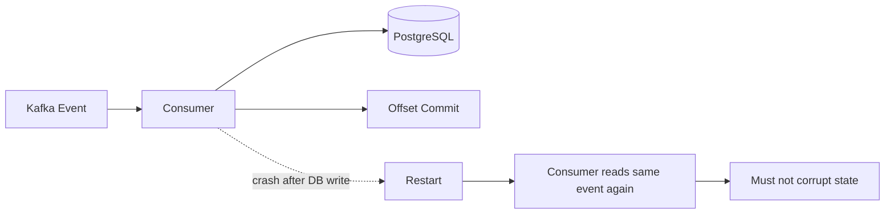
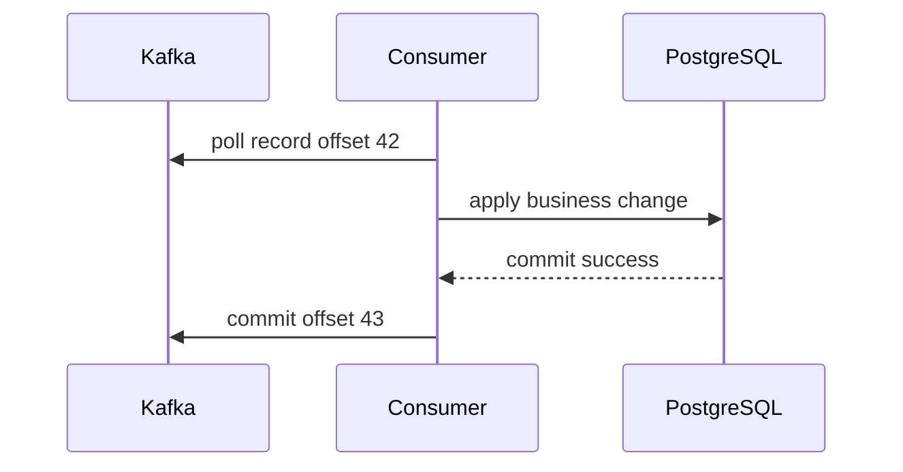
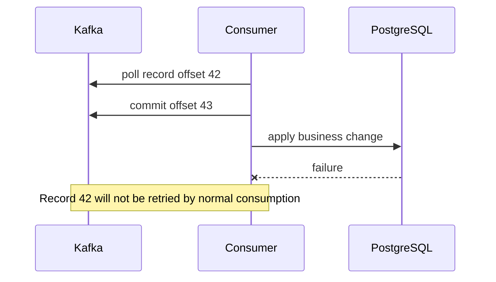
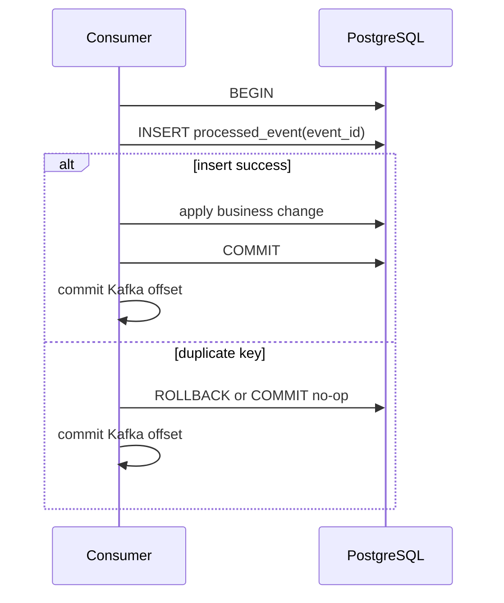
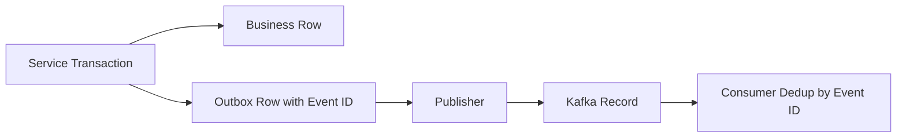
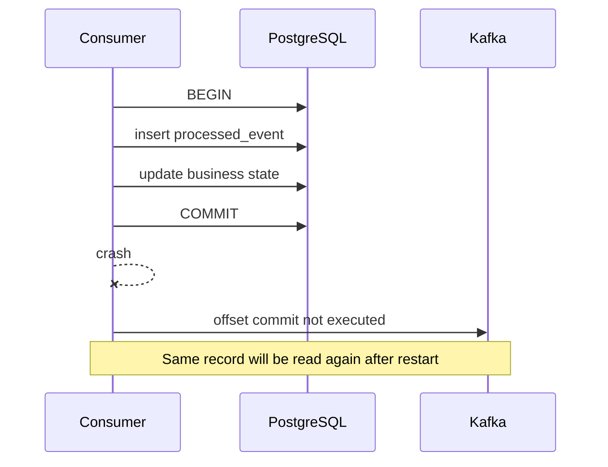
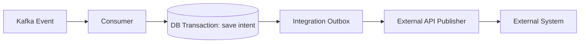

# Part 009 — Consumer Correctness and Idempotency

## 1. Tujuan Part Ini

Part ini membahas correctness consumer Kafka dalam konteks Java/JAX-RS backend system yang memproses event untuk mengubah state bisnis, menulis ke PostgreSQL, memanggil service lain, memperbarui Redis, atau membangun read model.

Consumer yang “berjalan” belum tentu consumer yang benar.

Consumer yang benar harus tetap aman saat:

- message dikirim lebih dari sekali
- consumer crash setelah DB write
- consumer crash sebelum offset commit
- rebalance terjadi saat processing masih berjalan
- retry menjalankan event yang sama berkali-kali
- event direplay dari offset lama
- downstream API timeout tetapi sebenarnya sudah memproses request
- projection dibangun ulang
- deployment restart di tengah batch
- duplicate event masuk dari producer/outbox/CDC

Fokus part ini bukan Kafka API dasar. Fokusnya adalah:

> bagaimana membuat consumer tetap benar dalam dunia at-least-once, duplicate, crash, retry, replay, dan distributed consistency.

## 2. Core Mental Model

Kafka consumer harus diasumsikan menerima event minimal satu kali, bukan tepat satu kali.

Artinya:

```text
same event may be processed more than once
```

Maka rule utama:

> Consumer correctness tidak boleh bergantung pada asumsi “event hanya diproses satu kali”.

Consumer production harus dirancang supaya duplicate event tidak merusak state.



Jika event yang sama diproses ulang dan hasilnya berbeda/merusak, consumer belum production-ready.

## 3. Apa Itu Idempotency

Idempotency berarti operasi yang sama dapat dijalankan berkali-kali dengan hasil akhir yang sama seperti dijalankan sekali.

Contoh idempotent:

```sql
UPDATE orders
SET status = 'APPROVED'
WHERE order_id = :orderId
  AND status = 'PENDING_APPROVAL';
```

Jika event approval yang sama datang dua kali, update kedua tidak mengubah state lagi.

Contoh tidak idempotent:

```sql
UPDATE account_balance
SET amount = amount + :delta
WHERE account_id = :accountId;
```

Jika event yang sama diproses dua kali, saldo berubah dua kali.

Di Kafka consumer, idempotency bukan nice-to-have. Ini adalah requirement dasar untuk at-least-once processing.

## 4. Tiga Jenis Idempotency

### 4.1 Technical Idempotency

Technical idempotency mencegah event ID yang sama diproses dua kali.

Biasanya memakai:

- event ID
- idempotency key
- processed event table
- inbox table
- unique constraint

Contoh:

```sql
CREATE TABLE processed_kafka_event (
  consumer_name TEXT NOT NULL,
  event_id TEXT NOT NULL,
  topic TEXT NOT NULL,
  partition_no INT NOT NULL,
  offset_no BIGINT NOT NULL,
  processed_at TIMESTAMPTZ NOT NULL DEFAULT now(),
  PRIMARY KEY (consumer_name, event_id)
);
```

Jika insert gagal karena duplicate key, consumer tahu event sudah pernah diproses.

### 4.2 Business Idempotency

Business idempotency memastikan state transition tidak salah walaupun event duplicate.

Contoh:

```text
OrderSubmitted duplicate -> order tetap Submitted, tidak membuat order baru
PaymentCaptured duplicate -> payment tetap captured sekali
QuoteApproved duplicate -> approval history tidak double-count
```

Business idempotency biasanya butuh domain invariant.

Misalnya:

- order tidak boleh dikirim dua kali ke fulfillment untuk command yang sama
- approval yang sama tidak boleh dihitung dua kali
- cancellation event tidak boleh membuka ulang order
- catalog price update lama tidak boleh overwrite versi lebih baru

### 4.3 Natural Idempotency

Natural idempotency terjadi saat operasi secara alami set-based, bukan increment-based.

Contoh natural idempotent:

```sql
UPDATE quote_projection
SET status = :status,
    version = :version,
    updated_at = :eventTime
WHERE quote_id = :quoteId
  AND version < :version;
```

Jika event versi sama datang lagi, tidak berubah.

Contoh non-natural:

```sql
INSERT INTO notification_outbox (...) VALUES (...);
```

Tanpa unique key, duplicate event membuat duplicate notification.

## 5. Duplicate Message Bukan Edge Case

Duplicate message dapat terjadi karena banyak jalur.

### Dari Consumer

- consumer crash setelah processing sukses tetapi sebelum offset commit
- commit offset gagal karena network timeout
- rebalance memindahkan partition saat processing belum selesai
- deployment restart saat batch belum commit
- manual offset reset
- replay untuk rebuild projection

### Dari Producer

- retry producer tanpa idempotent producer
- ambiguous send result
- producer timeout padahal broker sudah menerima record
- application retry membuat event baru dengan event ID berbeda

### Dari Outbox/CDC

- publisher crash setelah publish sebelum mark published
- Debezium connector restart
- snapshot + streaming overlap jika tidak dikonfigurasi benar
- outbox polling mengambil row yang sama karena locking salah

### Dari Operations

- replay topic
- consumer group baru
- backfill event
- manual publish ulang dari DLQ
- recovery setelah incident

Kesimpulan:

> Duplicate bukan bug Kafka. Duplicate adalah konsekuensi normal dari sistem yang mengutamakan durability dan recoverability.

## 6. Offset Commit Setelah Processing

Untuk at-least-once consumer, offset commit dilakukan setelah processing sukses.



Offset yang di-commit adalah offset berikutnya, bukan offset record terakhir.

Jika record offset 42 selesai, committed offset menjadi 43.

### Kenapa Setelah Processing?

Karena jika commit dilakukan sebelum processing, lalu processing gagal, Kafka menganggap record sudah selesai.



Ini bisa menghasilkan missing business effect.

## 7. At-Least-Once Trade-Off

Commit after processing menghasilkan at-least-once behavior.

Failure matrix:

| Skenario | DB write | Offset commit | Akibat |
|---|---:|---:|---|
| sukses semua | sukses | sukses | event selesai |
| DB gagal | gagal | tidak commit | event akan dicoba ulang |
| DB sukses, commit gagal | sukses | gagal | event bisa diproses ulang |
| DB sukses, consumer crash sebelum commit | sukses | tidak commit | event bisa diproses ulang |
| commit dulu, DB gagal | gagal | sukses | event hilang secara logis |

At-least-once memilih risiko duplicate daripada risiko kehilangan efek bisnis.

Itu pilihan yang masuk akal hanya jika consumer idempotent.

## 8. Offset Commit Bukan Business Transaction

Offset commit disimpan di Kafka. Business state disimpan di PostgreSQL, Redis, external API, atau service lain.

Mereka bukan satu atomic transaction.

```text
PostgreSQL transaction != Kafka offset commit transaction
```

Tanpa Kafka transaction khusus pun, consumer biasanya menghadapi gap ini:

1. Apply business change di DB.
2. Commit DB transaction.
3. Commit Kafka offset.

Ada crash window di antara langkah 2 dan 3.

Maka idempotency tetap wajib.

## 9. Processed Event Table

Processed event table adalah mekanisme sederhana untuk technical deduplication.

Contoh schema:

```sql
CREATE TABLE processed_event (
  consumer_name TEXT NOT NULL,
  event_id UUID NOT NULL,
  aggregate_id TEXT NULL,
  event_type TEXT NOT NULL,
  event_version INT NOT NULL,
  topic TEXT NOT NULL,
  partition_no INT NOT NULL,
  offset_no BIGINT NOT NULL,
  correlation_id TEXT NULL,
  processed_at TIMESTAMPTZ NOT NULL DEFAULT now(),
  PRIMARY KEY (consumer_name, event_id)
);
```

Pattern umum:



Kunci penting:

- insert processed event dan business change harus dalam transaction yang sama
- unique constraint harus menjadi guardrail utama
- duplicate key harus dianggap sukses idempotent, bukan fatal error

## 10. Inbox Pattern

Inbox pattern adalah versi lebih kaya dari processed event table.

Inbox tidak hanya menyimpan bahwa event sudah diproses, tetapi juga status processing.

Contoh:

```sql
CREATE TABLE event_inbox (
  inbox_id BIGSERIAL PRIMARY KEY,
  consumer_name TEXT NOT NULL,
  event_id UUID NOT NULL,
  event_type TEXT NOT NULL,
  aggregate_id TEXT NULL,
  topic TEXT NOT NULL,
  partition_no INT NOT NULL,
  offset_no BIGINT NOT NULL,
  payload JSONB NOT NULL,
  headers JSONB NULL,
  status TEXT NOT NULL,
  attempt_count INT NOT NULL DEFAULT 0,
  last_error TEXT NULL,
  received_at TIMESTAMPTZ NOT NULL DEFAULT now(),
  processed_at TIMESTAMPTZ NULL,
  UNIQUE (consumer_name, event_id)
);
```

Status bisa:

```text
RECEIVED
PROCESSING
PROCESSED
FAILED_RETRYABLE
FAILED_PERMANENT
DLQ_SENT
IGNORED_DUPLICATE
```

Inbox berguna ketika:

- processing kompleks
- perlu audit event yang diterima
- perlu replay dari DB inbox
- perlu track poison event
- perlu retry state internal
- perlu debugging event payload lama

Trade-off:

- storage lebih besar
- retention perlu diatur
- payload bisa mengandung PII
- schema perlu governance
- query cleanup perlu hati-hati

## 11. Inbox dengan PostgreSQL Transaction

Pattern consumer dengan inbox:

```text
poll Kafka
for each record:
  begin transaction
  insert inbox row if absent
  if duplicate and already processed:
    commit transaction
    commit offset
    continue
  apply business logic
  mark inbox PROCESSED
  commit transaction
  commit Kafka offset
```

Pseudo-code Java:

```java
void handle(ConsumerRecord<String, OrderSubmitted> record) {
    EventMetadata meta = metadataFrom(record);

    transactionTemplate.executeWithoutResult(tx -> {
        boolean inserted = inboxRepository.insertIfAbsent(meta, record.value());

        if (!inserted && inboxRepository.isProcessed(meta.consumerName(), meta.eventId())) {
            return;
        }

        orderService.applyOrderSubmitted(record.value(), meta);
        inboxRepository.markProcessed(meta.consumerName(), meta.eventId());
    });

    offsetManager.commit(record);
}
```

Hal yang harus dijaga:

- `insertIfAbsent` harus benar-benar atomic
- tidak boleh check-then-insert tanpa unique constraint
- transaction harus membungkus inbox dan business update
- offset commit dilakukan setelah transaction sukses

## 12. Check-Then-Act Race Condition

Pattern buruk:

```java
if (!processedEventRepository.exists(eventId)) {
    applyBusinessChange(event);
    processedEventRepository.insert(eventId);
}
```

Ini race-prone jika dua consumer memproses duplicate pada waktu bersamaan, misalnya karena replay utility, manual run, atau consumer group berbeda yang menulis resource sama.

Pattern lebih aman:

```sql
INSERT INTO processed_event (consumer_name, event_id, ...)
VALUES (:consumerName, :eventId, ...)
ON CONFLICT DO NOTHING;
```

Lalu cek affected rows.

Atau gunakan unique constraint sebagai source of truth.

## 13. Consumer Name dalam Dedup Key

Dedup key biasanya bukan hanya `event_id`, tetapi `(consumer_name, event_id)`.

Kenapa?

Karena event yang sama mungkin harus diproses oleh consumer berbeda.

Contoh:

```text
event_id = 123
Consumer A = order-projection-service
Consumer B = billing-integration-service
Consumer C = audit-indexer-service
```

Jika unique key hanya `event_id`, consumer B dan C bisa dianggap duplicate padahal mereka punya efek bisnis berbeda.

Gunakan:

```sql
PRIMARY KEY (consumer_name, event_id)
```

atau:

```sql
UNIQUE (consumer_name, idempotency_key)
```

## 14. Event ID Harus Stabil

Idempotency bergantung pada event ID yang stabil.

Event ID buruk:

```text
generated by consumer when record received
```

Karena duplicate record akan menghasilkan ID baru dan dedup gagal.

Event ID lebih baik:

```text
generated once by producer/outbox when event is created
stored in event payload/header
preserved across retry, DLQ, replay, CDC, and reprocessing
```

Untuk outbox, event ID harus dibuat saat insert outbox row, bukan saat publisher membaca row.



## 15. Idempotency Key vs Event ID

Event ID mengidentifikasi event instance.

Idempotency key mengidentifikasi logical operation yang tidak boleh dieksekusi dua kali.

Contoh:

```text
event_id: 1a5e...
idempotency_key: approve-quote:QUOTE-123:approval-request-789
```

Jika sistem mengirim event baru untuk operation yang sama karena retry application-level, event ID bisa berbeda tetapi idempotency key sama.

Gunakan event ID untuk duplicate record.

Gunakan idempotency key untuk duplicate business operation.

Keduanya bisa diperlukan.

## 16. Idempotent State Transition

Untuk sistem quote/order, state transition harus guarded.

Pattern buruk:

```sql
UPDATE orders
SET status = 'FULFILLED'
WHERE order_id = :orderId;
```

Ini tidak memvalidasi previous state.

Pattern lebih aman:

```sql
UPDATE orders
SET status = 'FULFILLED',
    fulfilled_at = :eventTime
WHERE order_id = :orderId
  AND status = 'FULFILLMENT_IN_PROGRESS';
```

Jika affected rows = 0, kemungkinan:

- event duplicate
- event out-of-order
- state sudah lebih maju
- state tidak valid
- order tidak ada

Consumer harus membedakan mana no-op idempotent dan mana anomaly.

## 17. Version-Based Idempotency

Untuk event-carried state transfer, gunakan aggregate version.

Event:

```json
{
  "eventId": "...",
  "eventType": "QuoteUpdated",
  "quoteId": "Q-1001",
  "quoteVersion": 17,
  "status": "PRICED"
}
```

Projection update:

```sql
UPDATE quote_projection
SET status = :status,
    quote_version = :quoteVersion,
    updated_at = :eventTime
WHERE quote_id = :quoteId
  AND quote_version < :quoteVersion;
```

Behavior:

- duplicate version 17 tidak mengubah ulang
- old version 16 tidak overwrite version 17
- version 18 akan diterima

Ini sangat berguna untuk read model/projection.

## 18. Sequence-Based Guard

Jika ordering penting per aggregate, event bisa membawa sequence number.

```json
{
  "orderId": "O-99",
  "sequence": 41,
  "eventType": "OrderItemAdded"
}
```

Consumer menyimpan last processed sequence:

```sql
UPDATE order_projection
SET last_sequence = :sequence,
    payload = :newPayload
WHERE order_id = :orderId
  AND last_sequence = :sequence - 1;
```

Jika sequence tidak sesuai:

- duplicate: sequence <= last_sequence
- gap: sequence > last_sequence + 1
- out-of-order: sequence tidak dapat diterapkan sekarang

Trade-off:

- lebih kuat untuk ordering
- butuh handling gap
- butuh storage sequence
- replay perlu hati-hati

## 19. Duplicate vs Out-of-Order

Duplicate dan out-of-order berbeda.

| Kondisi | Contoh | Respons |
|---|---|---|
| Duplicate | event version 10 datang dua kali | no-op idempotent |
| Old event | version 9 datang setelah version 10 | ignore atau audit |
| Future/gap | version 12 datang saat last version 10 | retry, park, reconcile |
| Invalid transition | Cancelled -> Approved | reject/anomaly |

Consumer yang baik tidak hanya “ignore kalau gagal update”. Ia mengklasifikasikan kondisi.

## 20. Partial Failure

Partial failure terjadi ketika sebagian side effect sukses, sebagian gagal.

Contoh consumer:

1. Write PostgreSQL sukses.
2. Update Redis gagal.
3. Commit offset belum dilakukan.

Jika event diproses ulang:

- DB write harus idempotent
- Redis update bisa dicoba ulang
- final state harus konsisten

Pattern yang lebih aman:

- DB sebagai source of truth
- Redis sebagai derived cache
- cache update boleh retry/rebuild
- jangan menjadikan Redis satu-satunya dedup source untuk critical state

## 21. Database Write Then Crash

Skenario umum:



Saat restart, consumer membaca event yang sama.

Jika processed event table benar:

```text
insert processed_event -> duplicate key -> no-op -> commit offset
```

Jika tidak ada idempotency:

```text
business state may be applied twice
```

## 22. External Call Then Crash

Lebih sulit:

1. Consumer menerima event.
2. Consumer memanggil external API.
3. External API sukses.
4. Consumer crash sebelum menyimpan status/commit offset.
5. Event diproses ulang.
6. External API terpanggil lagi.

Solusi tergantung external API:

- gunakan idempotency key saat call external API
- simpan outgoing request/outbox dulu
- gunakan saga state table
- jangan panggil external API langsung dari Kafka handler tanpa idempotency
- pisahkan command dispatch ke outbox integration

Pattern lebih aman:



Consumer menyimpan intent secara idempotent. Publisher lain menangani external call dengan retry dan idempotency key.

## 23. Redis sebagai Idempotency Store

Redis bisa dipakai untuk dedup ringan.

Contoh:

```text
SET processed:{consumer}:{eventId} 1 NX EX 86400
```

Kelebihan:

- cepat
- sederhana
- cocok untuk high-throughput short-window dedup

Risiko:

- key expiry membuat event lama bisa diproses ulang
- Redis flush/failure membuat dedup hilang
- tidak atomic dengan PostgreSQL business transaction
- tidak cocok sebagai satu-satunya guardrail untuk critical financial/order state

Rule praktis:

> Untuk state bisnis kritis, idempotency utama sebaiknya berada di storage transaksional yang sama dengan business state.

Redis boleh menjadi optimization, bukan source of correctness utama.

## 24. Idempotency dengan MyBatis/JDBC

Dalam MyBatis/JDBC, correctness bergantung pada transaction boundary.

Pastikan:

- insert inbox/processed event dan business update memakai connection/transaction yang sama
- transaction dikelola di service boundary, bukan tersebar di mapper
- unique violation ditangani sebagai duplicate idempotent
- affected rows dari guarded update dicek
- commit DB selesai sebelum commit Kafka offset

Pseudo-code:

```java
public void process(OrderSubmitted event, EventMetadata meta) {
    transactionManager.execute(() -> {
        int inserted = inboxMapper.insertIgnore(meta, event);

        if (inserted == 0 && inboxMapper.isProcessed(meta.consumerName(), meta.eventId())) {
            return;
        }

        int changed = orderMapper.markSubmittedIfValid(event.orderId(), event.orderVersion());

        if (changed == 0) {
            domainAnomalyService.classifyAndRecord(meta, event);
        }

        inboxMapper.markProcessed(meta.consumerName(), meta.eventId());
    });
}
```

Jangan melakukan offset commit di dalam DB transaction. Kafka offset commit bukan bagian dari PostgreSQL transaction.

## 25. Batch Processing Concern

Consumer sering memproses batch records dari `poll()`.

Masalah muncul jika:

- sebagian record sukses
- satu record gagal
- offset commit dilakukan untuk seluruh batch

Contoh:

```text
records: offsets 10, 11, 12, 13
10 success
11 success
12 failure
13 success
```

Jika commit offset 14, offset 12 hilang secara logis.

Pilihan strategi:

### Stop on First Failure

Proses sequential per partition. Jika offset 12 gagal, hentikan partition itu dan jangan commit melewati 12.

Kelebihan:

- menjaga ordering
- tidak skip failed record

Kekurangan:

- poison event bisa memblokir partition

### Retry/DLQ Failed Record

Jika offset 12 gagal permanen, kirim ke DLQ lalu commit melewati 12.

Kelebihan:

- consumer tidak stuck

Kekurangan:

- harus ada DLQ governance dan replay process
- business impact harus dipahami

### Per-Record Transaction + Careful Offset Tracking

Commit hanya sampai offset tertinggi yang contiguous sukses.

Ini lebih kompleks tetapi lebih aman untuk batch parallel.

## 26. Parallel Processing dan Ordering

Jika consumer memproses record dari partition yang sama secara parallel, ordering bisa rusak.

```text
Partition 0:
offset 10: OrderCreated
offset 11: OrderCancelled
```

Jika offset 11 selesai lebih dulu, state bisa salah.

Rule:

> Jika ordering per aggregate/partition penting, jangan memproses record dari partition yang sama secara out-of-order tanpa sequence guard.

Pattern aman:

- single-thread per partition
- worker pool keyed by aggregate ID
- pause partition saat in-flight terlalu banyak
- commit offset hanya setelah contiguous offsets selesai
- gunakan version/sequence guard di DB

## 27. Rebalance Saat Processing

Rebalance dapat terjadi saat record masih diproses.

Risiko:

- partition ditarik dari consumer lama
- consumer baru mulai memproses dari committed offset terakhir
- consumer lama masih menyelesaikan processing
- duplicate side effect terjadi

Mitigasi:

- cooperative rebalance jika cocok
- pause/resume saat overload
- commit offset setelah processing
- handle partition revoked callback
- hentikan menerima work baru saat revoke
- tunggu in-flight selesai atau batalkan dengan aman
- idempotency tetap wajib

Rebalance bukan alasan untuk tidak idempotent.

## 28. Retry Safety

Retry aman jika menjalankan operasi yang sama berkali-kali tidak merusak state.

Retry tidak aman jika:

- insert tanpa unique key
- increment counter tanpa dedup
- call external API tanpa idempotency key
- append history tanpa dedup key
- publish downstream event baru setiap retry tanpa stable causation/idempotency key

Retry policy harus ditentukan bersama idempotency design.

Tidak cukup menulis:

```text
retry 3 times then DLQ
```

Pertanyaan senior engineer:

> Apa yang terjadi jika ketiga retry sebenarnya sudah sebagian sukses?

## 29. Idempotent Downstream Event Publication

Consumer kadang memproses event lalu menghasilkan event baru.

Contoh:

```text
OrderSubmitted consumed
-> reserve inventory
-> publish OrderReservationRequested
```

Risiko:

- input event duplicate
- consumer crash setelah publish output event sebelum commit offset
- output event terkirim dua kali

Solusi:

- gunakan outbox untuk output event
- output event ID/idempotency key deterministik berdasarkan input event
- simpan mapping input event -> output event
- downstream consumer juga idempotent

Pattern:

```text
consume input event
begin DB transaction
insert processed input event
apply business state
insert output outbox event with deterministic key
commit DB
publisher sends output event
commit input offset
```

## 30. Poison Event dan Idempotency

Poison event adalah event yang selalu gagal diproses karena payload invalid, schema incompatible, missing reference, atau business invariant violation.

Idempotency tidak menyelesaikan poison event, tetapi mencegah retry poison event membuat kerusakan tambahan.

Poison handling perlu:

- klasifikasi error retryable vs permanent
- retry budget
- DLQ/parking lot
- error metadata
- observability
- manual repair/replay
- business owner decision

Jangan infinite retry poison event sambil memblokir partition critical tanpa alert.

## 31. Missing Reference Problem

Consumer bisa menerima event yang mereferensikan entity yang belum tersedia.

Contoh:

```text
OrderLineSubmitted references Product P-99
Product projection has not received ProductCreated yet
```

Penyebab:

- event antar topic tidak punya global ordering
- consumer projection lag
- replay sebagian topic
- dependency data belum sync

Strategi:

- retry dengan backoff
- park event sementara
- fetch source of truth synchronously jika acceptable
- design event-carried state transfer supaya tidak butuh lookup
- gunakan reconciliation job
- gunakan sequence/version jika satu aggregate

Jangan menganggap semua dependency event akan tiba sebelum event utama kecuali ada guarantee eksplisit.

## 32. Consumer Crash Matrix

Gunakan matrix ini saat review.

| Crash Point | Kemungkinan Akibat | Guardrail |
|---|---|---|
| sebelum DB transaction | event dibaca ulang | aman |
| setelah insert inbox sebelum business update | duplicate/incomplete state | transaction rollback atau status recovery |
| setelah business update sebelum inbox processed | event dibaca ulang | transaction same boundary, status handling |
| setelah DB commit sebelum offset commit | duplicate processing | processed event/inbox idempotency |
| setelah offset commit sebelum external call | missing side effect | jangan commit sebelum side effect atau simpan intent dulu |
| setelah external call sebelum DB commit | duplicate external call | idempotency key/outbox/saga |
| saat rebalance | duplicate/in-flight conflict | idempotency + revoke handling |

## 33. Idempotency Table Retention

Processed event/inbox table bisa tumbuh besar.

Retention harus mempertimbangkan:

- Kafka topic retention
- replay window maksimum
- audit requirement
- duplicate window dari producer/outbox
- compliance/privacy requirement
- storage cost
- query performance

Jika Kafka retention 7 hari tetapi processed event retention 1 hari, replay dari 3 hari lalu bisa memproses duplicate sebagai baru.

Rule:

> Dedup retention harus setidaknya menutupi realistic replay/duplicate window untuk consumer tersebut.

Untuk business-critical event, bisa perlu lebih lama dari Kafka retention karena manual reprocessing/backfill bisa datang dari DLQ atau archive.

## 34. Unique Constraint sebagai Safety Net

Application-level check tidak cukup.

Gunakan database constraint:

```sql
ALTER TABLE event_inbox
ADD CONSTRAINT uq_event_inbox_consumer_event
UNIQUE (consumer_name, event_id);
```

Untuk business idempotency:

```sql
ALTER TABLE fulfillment_request
ADD CONSTRAINT uq_fulfillment_request_command
UNIQUE (order_id, command_id);
```

Untuk notification:

```sql
ALTER TABLE notification_request
ADD CONSTRAINT uq_notification_idempotency
UNIQUE (recipient_id, notification_type, idempotency_key);
```

Constraint adalah guardrail saat bug aplikasi, retry, dan race condition terjadi.

## 35. Idempotency dan Audit History

Audit/history table sering tidak idempotent karena sifatnya append-only.

Pattern buruk:

```sql
INSERT INTO order_status_history(order_id, status, changed_at)
VALUES (:orderId, :status, :eventTime);
```

Duplicate event membuat duplicate history.

Pattern lebih baik:

```sql
INSERT INTO order_status_history(order_id, status, source_event_id, changed_at)
VALUES (:orderId, :status, :eventId, :eventTime)
ON CONFLICT (source_event_id) DO NOTHING;
```

Atau:

```sql
UNIQUE(order_id, status, source_event_id)
```

Audit harus append-only, tetapi bukan berarti boleh duplicate.

## 36. Idempotency dan Redis Cache Invalidation

Event duplicate untuk cache invalidation biasanya aman.

Contoh:

```text
DEL quote:Q-123
DEL quote:Q-123
```

Ini idempotent.

Namun event duplicate untuk cache warm/update bisa tidak aman jika membawa stale payload.

Contoh risiko:

```text
Event version 10 updates cache
Event version 9 arrives late and overwrites cache
```

Gunakan version guard:

- simpan version di value cache
- update only if incoming version newer
- atau invalidate, bukan overwrite

Untuk Redis cache, invalidation sering lebih aman daripada update state penuh jika ordering tidak kuat.

## 37. Idempotency dan Metrics

Hati-hati dengan metrics berbasis counter.

Jika consumer duplicate memproses event lalu increment metric bisnis, angka bisa double-count.

Contoh buruk:

```text
orders_submitted_total++ inside handler after every event receive
```

Jika metric adalah technical receive count, boleh.
Jika metric adalah business count, harus dedup.

Pisahkan:

- `consumer_records_received_total`
- `consumer_records_duplicate_total`
- `business_orders_submitted_unique_total`
- `consumer_records_processed_total`
- `consumer_records_failed_total`

## 38. Logging untuk Duplicate Debugging

Log minimal saat memproses event:

```text
consumerName
consumerGroup
topic
partition
offset
eventId
idempotencyKey
aggregateId
eventType
eventVersion
correlationId
causationId
traceId
processingResult
```

Contoh:

```text
Processed Kafka event consumer=order-projector group=order-projector.v1 topic=order.events partition=3 offset=88127 eventId=... aggregateId=O-123 result=PROCESSED durationMs=42
```

Untuk duplicate:

```text
Duplicate Kafka event ignored consumer=order-projector eventId=... topic=order.events partition=3 offset=88128 originalProcessedAt=...
```

Jangan log payload penuh jika mengandung PII/sensitive data.

## 39. Observability untuk Idempotency

Metrics yang berguna:

- processed event count
- duplicate event count
- duplicate rate
- idempotent no-op count
- invalid transition count
- out-of-order event count
- inbox insert conflict count
- inbox table size
- inbox processing latency
- retry count
- DLQ count
- replay mode count
- consumer lag
- processing latency
- DB transaction latency

Alert tidak selalu perlu untuk setiap duplicate. Duplicate bisa normal saat deploy/retry.

Alert perlu jika:

- duplicate rate melonjak tajam
- invalid transition meningkat
- out-of-order event meningkat
- poison event meningkat
- retry loop terjadi
- inbox table cleanup gagal

## 40. Consumer PR Review Checklist

### Event Identity

- Apakah event punya stable event ID?
- Apakah idempotency key diperlukan selain event ID?
- Apakah event ID dipertahankan saat retry/DLQ/replay?
- Apakah aggregate ID/event version tersedia jika dibutuhkan?

### Offset Safety

- Apakah offset commit dilakukan setelah processing sukses?
- Apakah auto commit dimatikan untuk critical consumer?
- Apa yang terjadi jika DB commit sukses tetapi offset commit gagal?
- Apa yang terjadi saat rebalance?

### Idempotency

- Apakah ada processed event table atau inbox pattern?
- Apakah unique constraint benar?
- Apakah insert dan business update dalam transaction yang sama?
- Apakah duplicate key dianggap no-op sukses?
- Apakah business state transition idempotent?

### Database Correctness

- Apakah guarded update menggunakan previous state/version?
- Apakah affected rows dicek?
- Apakah audit/history table dedup by source event?
- Apakah transaction boundary jelas di service layer?
- Apakah MyBatis/JDBC mapper tidak membuat hidden transaction?

### External Side Effects

- Apakah consumer memanggil external API?
- Apakah external call punya idempotency key?
- Apakah side effect disimpan sebagai outbox/intent dulu?
- Apa yang terjadi jika external call sukses tetapi consumer crash?

### Retry/DLQ

- Apakah retry aman?
- Apakah retry budget ada?
- Apakah poison event masuk DLQ/parking lot?
- Apakah DLQ event membawa metadata cukup untuk replay?

### Observability

- Apakah log punya event ID/topic/partition/offset/correlation ID?
- Apakah duplicate metrics ada?
- Apakah invalid transition/out-of-order metrics ada?
- Apakah inbox lag/size dimonitor?

## 41. Internal Verification Checklist

Gunakan checklist ini saat masuk codebase/team CSG. Jangan mengasumsikan detail internal; verifikasi secara eksplisit.

### Codebase

- Cari consumer implementation utama.
- Cek apakah menggunakan plain Kafka Java client, framework internal, Spring Kafka, Quarkus, atau library lain.
- Cek offset commit strategy.
- Cek apakah auto commit aktif.
- Cek handler error model.
- Cek shutdown/rebalance handling.

### PostgreSQL/MyBatis/JDBC

- Cari tabel inbox, processed event, idempotency, dedup, atau event processing log.
- Cek unique constraint.
- Cek transaction boundary antara inbox dan business update.
- Cek mapper yang melakukan state transition.
- Cek affected rows handling.
- Cek migration untuk idempotency table.

### Event Schema

- Cek apakah event punya event ID.
- Cek aggregate ID, correlation ID, causation ID, tenant ID, event version.
- Cek idempotency key jika operation-level dedup diperlukan.
- Cek apakah DLQ/retry mempertahankan metadata.

### Operations

- Cek duplicate event incidents.
- Cek replay runbook.
- Cek DLQ replay procedure.
- Cek consumer lag dashboard.
- Cek duplicate/idempotency metrics.
- Cek postmortem terkait consumer crash/rebalance.

### Team Discussion

Tanyakan ke platform/SRE/backend/data team:

- Apa policy consumer offset reset?
- Apakah replay sering dilakukan?
- Bagaimana duplicate ditangani?
- Apa standard event metadata internal?
- Apakah inbox/outbox pattern distandarkan?
- Apa retry/DLQ convention internal?

## 42. Common Anti-Patterns

### Anti-Pattern 1: “Kafka Guarantees Exactly Once, Jadi Aman”

Kafka punya fitur exactly-once di konteks tertentu, tetapi tidak otomatis membuat PostgreSQL write, Redis update, dan external API call exactly-once.

### Anti-Pattern 2: Commit Offset Sebelum Processing

Ini menukar duplicate risk menjadi missing effect risk. Untuk business-critical event, ini biasanya salah.

### Anti-Pattern 3: Idempotency Hanya di Memory

Set in-memory hilang saat restart dan tidak bekerja lintas pod.

### Anti-Pattern 4: Redis sebagai Satu-Satunya Dedup untuk Critical State

Redis cepat, tetapi tidak atomic dengan DB transaction dan bisa kehilangan key.

### Anti-Pattern 5: Check-Then-Insert Tanpa Unique Constraint

Race condition akan muncul saat duplicate/replay/parallelism.

### Anti-Pattern 6: Audit Table Duplicate

Append-only bukan berarti duplicate-safe.

### Anti-Pattern 7: Retry Tanpa Idempotency

Retry memperbesar kerusakan jika operation tidak idempotent.

### Anti-Pattern 8: Replay Tanpa Replay Safety

Replay bisa mengirim ulang email, fulfillment request, billing request, atau state transition lama jika consumer tidak dirancang untuk replay.

## 43. Production Debugging Sequence

### Symptom: Duplicate Processing

Cek urutan:

1. Apakah event ID sama atau berbeda?
2. Apakah duplicate berasal dari producer, outbox, CDC, retry, replay, atau consumer?
3. Apakah processed event/inbox table mencatat event itu?
4. Apakah unique constraint ada dan aktif?
5. Apakah consumer group pernah restart/rebalance?
6. Apakah offset commit gagal?
7. Apakah DLQ/replay mengirim ulang event?
8. Apakah idempotency key berubah saat retry?
9. Apakah operation bisnis idempotent?
10. Apakah duplicate merusak state atau hanya no-op?

### Symptom: Missing Business Effect

Cek:

- apakah offset sudah committed sebelum processing?
- apakah handler swallow exception?
- apakah DLQ menerima event?
- apakah event masuk topic yang benar?
- apakah consumer group membaca topic/partition benar?
- apakah schema/deserialization failure membuat record skip?
- apakah business update affected rows = 0 tanpa alert?

### Symptom: Invalid State Transition

Cek:

- event out-of-order?
- duplicate lama?
- aggregate version tersedia?
- partition key sesuai aggregate?
- consumer group lain memodifikasi state sama?
- replay event lama?
- state machine guard lemah?

## 44. Minimal Production Standard

Untuk consumer yang mengubah state bisnis penting, baseline minimum:

- stable event ID
- stable consumer group ID
- manual or controlled offset commit
- commit offset setelah DB transaction sukses
- processed event table atau inbox pattern
- unique constraint untuk dedup
- guarded state transition
- affected rows handling
- duplicate treated as idempotent success
- retry/DLQ policy eksplisit
- no external API call tanpa idempotency key atau outbox intent
- replay safety documented
- log topic/partition/offset/event ID/correlation ID
- metrics duplicate/invalid transition/retry/DLQ
- retention policy untuk dedup table
- runbook untuk replay dan data repair

## 45. Kesimpulan

Consumer correctness adalah disiplin distributed systems, bukan sekadar handler code.

Ringkasan mental model:

- duplicate event adalah kondisi normal
- offset commit adalah checkpoint, bukan business transaction
- at-least-once membutuhkan idempotency
- processed event table/inbox pattern adalah guardrail utama
- technical idempotency dan business idempotency berbeda
- DB unique constraint lebih kuat daripada check di aplikasi
- state transition harus guarded
- external side effect butuh idempotency key/outbox/saga
- replay safety harus didesain sejak awal
- retry tanpa idempotency memperbesar kerusakan

Pertanyaan utama senior engineer:

> Jika event yang sama diproses dua kali, jika consumer crash setelah DB commit tetapi sebelum offset commit, jika event lama direplay, dan jika external API sukses tetapi consumer restart, apakah state akhir sistem tetap benar?
