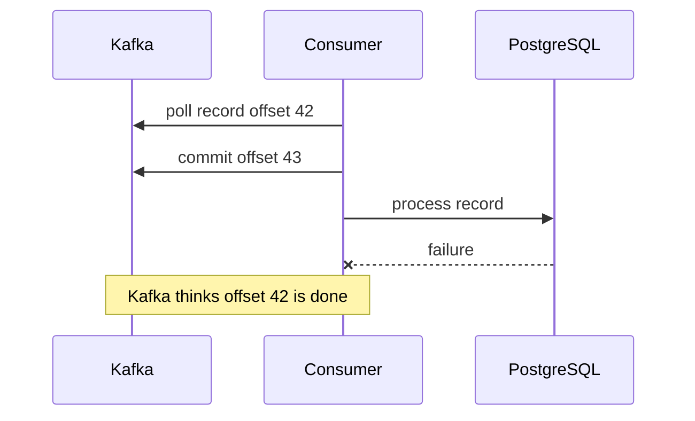
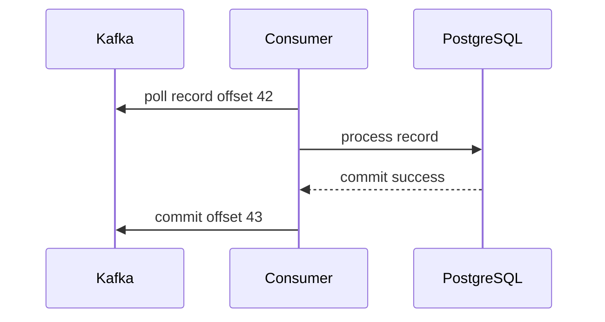
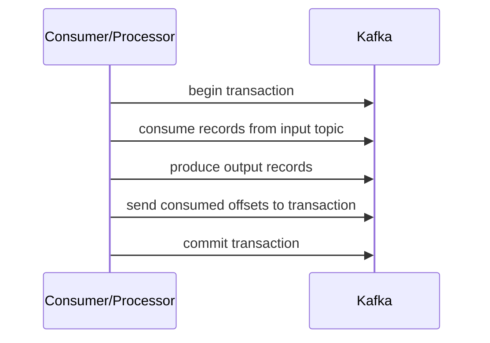
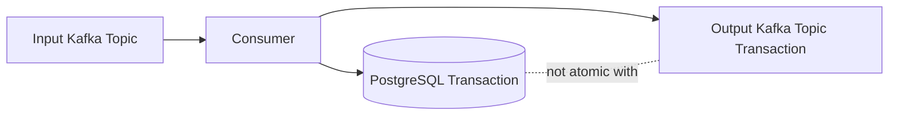

# Part 010 — Delivery Semantics

## 1. Tujuan Part Ini

Part ini membahas delivery semantics Kafka dari sudut pandang senior backend engineer yang membangun sistem Java/JAX-RS dengan PostgreSQL, MyBatis/JDBC, Redis, CDC, outbox, consumer, retry, DLQ, dan workflow microservices.

Delivery semantics menjawab pertanyaan:

> Ketika event dikirim, dibaca, diproses, di-commit, di-retry, atau direplay, guarantee apa yang benar-benar dimiliki sistem?

Banyak incident event-driven system terjadi karena tim salah memahami guarantee.

Contoh klaim berbahaya:

```text
Kafka itu exactly-once, jadi consumer tidak perlu idempotent.
```

atau:

```text
Producer sudah retry, berarti event pasti sampai dan tidak duplicate.
```

atau:

```text
Offset sudah commit, berarti business process sukses.
```

Part ini membongkar klaim-klaim tersebut secara praktis.

## 2. Tiga Level Delivery Semantics

Secara umum ada tiga istilah utama:

| Semantics | Arti sederhana | Risiko utama |
|---|---|---|
| At-most-once | diproses 0 atau 1 kali | bisa hilang secara logis |
| At-least-once | diproses 1 atau lebih kali | bisa duplicate |
| Exactly-once | diproses tepat 1 kali dalam boundary tertentu | sering disalahpahami |

Namun dalam sistem enterprise, kita perlu membedakan beberapa boundary:

- producer to Kafka broker
- Kafka broker storage
- consumer poll
- consumer processing
- PostgreSQL transaction
- Redis update
- external API call
- downstream event publish
- offset commit
- replay/reprocessing

Guarantee di satu boundary tidak otomatis berlaku di boundary lain.

## 3. Kafka Record Delivery vs Business Effect

Kafka bisa mengatur delivery record ke broker dan consumption dari log.

Tetapi business effect bisa berada di luar Kafka.

Contoh business effect:

- insert/update PostgreSQL row
- create fulfillment request
- update Redis cache
- call billing service
- send notification
- create audit history
- publish downstream integration event

Delivery semantics yang penting bukan hanya:

```text
apakah record sampai ke Kafka?
```

Tetapi:

```text
apakah business effect terjadi benar, tidak hilang, tidak double, dan bisa direcover?
```

## 4. At-Most-Once

At-most-once berarti record diproses maksimal satu kali, tetapi bisa tidak diproses sama sekali.

Consumer at-most-once biasanya commit offset sebelum processing.



Jika DB write gagal setelah offset commit, record tidak otomatis diproses ulang oleh consumer group normal.

### Kapan At-Most-Once Masuk Akal?

At-most-once bisa diterima untuk:

- non-critical metrics
- approximate analytics
- ephemeral telemetry
- debug-only event
- best-effort notification tertentu

Tidak cocok untuk:

- order state transition
- quote approval
- fulfillment request
- billing/payment
- audit/compliance event
- integration event yang menjadi source of truth downstream

## 5. At-Least-Once

At-least-once berarti record akan diproses satu kali atau lebih.

Pattern consumer umum:

1. Poll record.
2. Process record.
3. Commit offset setelah processing sukses.



Jika consumer crash setelah DB commit tetapi sebelum offset commit:

```text
record offset 42 akan diproses ulang
```

Ini menyebabkan duplicate, tetapi tidak kehilangan record.

At-least-once adalah default mental model paling aman untuk business-critical Kafka consumer, asalkan consumer idempotent.

## 6. Duplicate adalah Harga At-Least-Once

At-least-once tidak gratis.

Harga yang dibayar adalah duplicate.

Duplicate bisa terjadi karena:

- producer retry
- consumer retry
- offset commit failure
- consumer crash
- rebalance
- replay
- DLQ reprocessing
- outbox publisher retry
- CDC connector restart

Maka at-least-once harus selalu dipasangkan dengan:

- stable event ID
- idempotent producer jika relevan
- idempotent consumer
- inbox/processed event table
- retry/DLQ discipline
- replay safety
- observability duplicate rate

Tanpa itu, at-least-once berarti “kerusakan bisa terjadi lebih dari sekali”.

## 7. Exactly-Once: Istilah yang Sering Menyesatkan

Exactly-once sering terdengar seperti:

```text
Event pasti diproses tepat satu kali di seluruh sistem.
```

Itu bukan guarantee umum yang otomatis diberikan Kafka.

Kafka exactly-once semantics berlaku dalam boundary tertentu, terutama ketika:

- producer menggunakan idempotence/transaction
- consumer offset dikirim ke transaction
- output ditulis kembali ke Kafka
- processing berada dalam Kafka transactional boundary
- Kafka Streams menggunakan EOS configuration

Boundary ini tidak otomatis mencakup:

- PostgreSQL transaction
- MyBatis/JDBC write
- Redis update
- external REST API call
- email sending
- third-party system
- human workflow

Maka istilah yang lebih sehat untuk aplikasi enterprise adalah:

> effectively-once business outcome melalui idempotency, transactional outbox/inbox, compensation, dan reconciliation.

## 8. Producer-Side Semantics

Producer delivery dipengaruhi oleh:

- `acks`
- `retries`
- `enable.idempotence`
- `max.in.flight.requests.per.connection`
- `delivery.timeout.ms`
- `request.timeout.ms`
- `transactional.id`
- partition key
- broker replication/min ISR

Producer dapat gagal dalam beberapa cara:

| Skenario | Record masuk Kafka? | Producer tahu? | Risiko |
|---|---:|---:|---|
| send sukses | ya | ya | normal |
| send gagal sebelum broker terima | tidak | ya | missing jika tidak retry |
| timeout setelah broker terima | ya | tidak yakin | duplicate jika retry |
| broker leader failover | mungkin | mungkin tidak | duplicate/missing tergantung config |
| serialization failure | tidak | ya | event tidak pernah dikirim |

Producer retry meningkatkan durability, tetapi bisa membuat duplicate jika idempotence tidak benar.

## 9. Acknowledgement Semantics

Producer `acks` menentukan kapan broker menganggap write sukses.

### `acks=0`

Producer tidak menunggu acknowledgement broker.

Risiko:

- event bisa hilang tanpa diketahui
- tidak cocok untuk critical business event

### `acks=1`

Leader partition mengakui write setelah menulis record.

Risiko:

- jika leader gagal sebelum replica catch up, data bisa hilang

### `acks=all`

Leader menunggu in-sync replicas sesuai config sebelum ack.

Lebih kuat untuk durability.

Untuk event bisnis penting, baseline biasanya:

```properties
acks=all
enable.idempotence=true
```

Tetapi tetap perlu cek `min.insync.replicas` di broker/topic.

## 10. Idempotent Producer

Idempotent producer mencegah duplicate akibat retry producer dalam satu producer session ke partition yang sama.

Ia memakai producer ID dan sequence number.

Mental model:

```text
producer sends record seq=10
network timeout
producer retries seq=10
broker recognizes duplicate seq=10
broker stores once
```

Kelebihan:

- mengurangi duplicate dari producer retry
- menjaga ordering lebih baik dengan config yang benar
- aman sebagai default untuk producer penting

Batasan:

- tidak menyelesaikan duplicate application-level
- tidak menyelesaikan consumer duplicate
- tidak membuat DB write + Kafka publish atomic
- tidak menggantikan outbox
- tidak menjamin external side effect exactly-once

## 11. Transactional Producer

Transactional producer memungkinkan beberapa write ke Kafka topic dan offset commit consumer dilakukan secara atomic dalam Kafka.

Use case:

```text
consume from topic A
process
produce to topic B
commit consumed offset
```

Dengan Kafka transaction:



Jika transaction abort, output record tidak visible bagi `read_committed` consumer dan offset tidak dianggap committed.

Ini berguna untuk Kafka-to-Kafka processing.

## 12. Kafka Transaction Tidak Menyelesaikan DB Transaction

Masalah umum enterprise:

```text
consume Kafka event
write PostgreSQL
produce Kafka event
commit offset
```

Kafka transaction tidak otomatis membuat PostgreSQL write atomic bersama Kafka transaction.



Jika DB commit sukses tetapi Kafka transaction abort, state DB dan event output bisa tidak sinkron.

Jika Kafka transaction commit tetapi DB rollback, output event bisa mengklaim state yang tidak terjadi.

Solusi umum:

- transactional outbox
- inbox pattern
- CDC
- saga state
- reconciliation
- idempotent downstream

Kafka transaction membantu boundary Kafka, bukan semua boundary distributed system.

## 13. Effectively-Once

Effectively-once berarti hasil akhir bisnis seolah-olah event hanya diterapkan sekali, walaupun secara teknis event bisa diproses berkali-kali.

Dibangun dengan kombinasi:

- at-least-once delivery
- idempotent producer
- stable event ID
- idempotent consumer
- inbox/processed event table
- guarded state transition
- outbox pattern
- deterministic downstream event ID
- retry/DLQ discipline
- replay safety
- reconciliation

Contoh:

```text
OrderSubmitted event processed twice
processed_event unique key catches duplicate
order status remains SUBMITTED once
fulfillment request unique command key prevents double request
projection version guard prevents stale overwrite
```

System technically processed duplicate, but business outcome is effectively once.

## 14. Delivery Semantics per Boundary

Jangan tanya “sistem ini exactly-once?” secara global.

Tanya per boundary.

| Boundary | Typical guarantee | Guardrail |
|---|---|---|
| Java service -> Kafka broker | at-least-once with retry/idempotent producer | acks, idempotence, callback handling |
| DB transaction -> Kafka publish | unsafe dual-write unless outbox/CDC | transactional outbox |
| Kafka broker storage | durable within replication/retention config | replication factor, min ISR, retention |
| Kafka topic -> consumer poll | log read by offset | offset management |
| Consumer -> PostgreSQL | at-least-once processing | idempotent DB transaction/inbox |
| Consumer -> Redis | best effort unless designed | rebuild/invalidate/version guard |
| Consumer -> external API | unknown unless API idempotent | idempotency key/saga/outbox |
| Consumer -> downstream Kafka | at-least-once or Kafka transaction | outbox or transactional producer |
| Replay | duplicate by design | replay-safe consumer |

## 15. Missing Event Handling

Delivery semantics juga harus membahas missing event.

Missing event bisa terjadi karena:

- producer tidak mengirim event karena application crash
- dual-write failure setelah DB commit sebelum Kafka publish
- serialization failure after DB commit
- outbox publisher stuck
- CDC connector stopped
- retention terlalu pendek sebelum consumer membaca
- topic salah/environment salah
- ACL failure yang tidak dimonitor
- handler swallow exception lalu commit offset

Mitigasi:

- outbox pattern
- CDC monitoring
- producer callback/error logging
- schema validation sebelum commit DB jika perlu
- consumer lag alert
- reconciliation job
- business audit comparing source table vs event/projection

## 16. Duplicate Handling

Duplicate handling harus ada di beberapa layer.

### Producer Layer

- idempotent producer
- stable event ID
- outbox row ID sebagai event ID
- deterministic idempotency key

### Broker/Topic Layer

Kafka log tidak dedup arbitrary business duplicate. Kafka menyimpan record.

Log compaction bukan general duplicate removal. Compaction hanya mempertahankan latest record per key pada compacted topic dan tidak cocok untuk semua event history.

### Consumer Layer

- inbox/processed event table
- unique constraint
- state version guard
- idempotent side effect

### Operations Layer

- DLQ replay preserves event ID
- replay tool tidak membuat event ID baru kecuali memang semantic event baru
- manual backfill diberi idempotency key yang jelas

## 17. Replay Safety

Replay adalah fitur kuat Kafka, tetapi hanya aman jika consumer replay-safe.

Replay bisa terjadi lewat:

- offset reset
- new consumer group
- projection rebuild
- backfill
- DLQ replay
- topic copy
- MirrorMaker failover

Replay risk:

- duplicate DB inserts
- duplicate external calls
- duplicate notifications
- stale event overwrite
- old business transition diterapkan ulang
- audit history double
- cache state mundur

Replay-safe consumer harus:

- idempotent
- version-aware
- able to distinguish old/duplicate/future event
- avoid direct non-idempotent external side effects
- have replay mode if behavior berbeda
- produce downstream event carefully

## 18. Exactly-Once Illusion di Java/JAX-RS System

Dalam JAX-RS service, flow umum:

```text
HTTP request
-> validate command
-> write PostgreSQL via MyBatis/JDBC
-> publish Kafka event
-> return HTTP response
```

Jika publish langsung setelah DB write tanpa outbox:

| Failure | Akibat |
|---|---|
| DB commit sukses, publish gagal | state berubah tetapi event hilang |
| publish sukses, HTTP response gagal | client retry bisa membuat duplicate command |
| publish timeout, retry command | duplicate event mungkin terjadi |
| service crash antara DB dan Kafka | dual-write inconsistency |

Kafka exactly-once tidak menyelesaikan flow ini.

Correct pattern biasanya:

```text
HTTP request
-> begin DB transaction
-> write business state
-> insert outbox event
-> commit DB
-> outbox publisher/CDC publishes to Kafka
```

Lalu consumer downstream tetap idempotent.

## 19. Delivery Semantics dan Outbox Pattern

Outbox mengubah problem:

Dari:

```text
DB write + Kafka publish as two independent writes
```

Menjadi:

```text
DB write + outbox insert in one DB transaction
Kafka publish happens later from durable outbox
```

Outbox memberi guarantee:

- jika business transaction commit, event intent tersimpan
- jika publisher crash, event bisa dipublish ulang
- jika publish duplicate, event ID tetap sama

Tetapi outbox tidak otomatis menjamin:

- consumer tidak duplicate
- ordering global
- external side effect exactly-once
- schema compatibility
- retry/DLQ correctness

Outbox adalah solusi dual-write, bukan solusi seluruh EDA correctness.

## 20. Delivery Semantics dan CDC/Debezium

CDC membaca perubahan database dari WAL/logical decoding dan mengirim ke Kafka.

Guarantee yang diberikan:

- perubahan DB yang committed dapat ditangkap dari log
- connector offset melacak progress CDC
- restart connector bisa melanjutkan dari offset

Risiko:

- replication slot lag
- WAL retention membengkak
- snapshot overlap
- connector stopped
- schema change incompatible
- tombstone/delete semantics salah dipahami
- outbox event router config salah

CDC membantu mengurangi dual-write, tetapi consumer tetap harus idempotent.

## 21. Delivery Semantics dan Retry

Retry mengubah probability success tetapi juga meningkatkan duplicate risk.

Producer retry:

- meningkatkan peluang record masuk Kafka
- bisa duplicate tanpa idempotent producer

Consumer retry:

- meningkatkan peluang processing sukses
- bisa mengulang partial side effect

External API retry:

- bisa double-create resource tanpa idempotency key

Retry policy harus dijawab bersama:

- operation idempotent atau tidak?
- retryable error apa saja?
- retry berapa lama?
- kapan DLQ?
- apakah retry mempertahankan event ID/idempotency key?
- apakah retry mengubah ordering?

## 22. DLQ dan Delivery Semantics

DLQ bukan tempat sampah. DLQ adalah bagian dari delivery semantics.

Saat event masuk DLQ, sistem memutuskan:

```text
mainline processing will skip this event for now
```

Itu punya konsekuensi bisnis.

Untuk event tertentu, skip bisa diterima:

- analytics enrichment gagal
- optional notification
- non-critical projection

Untuk event lain, skip bisa berbahaya:

- order state transition
- fulfillment command
- billing event
- audit event

DLQ event harus menyimpan:

- original topic/partition/offset
- event ID
- event type/version
- payload
- headers
- error type
- stack/error message terkontrol
- retry count
- failed consumer
- failed timestamp
- correlation/trace ID

Replay dari DLQ harus preserve identity kecuali secara eksplisit membuat semantic event baru.

## 23. Offset Commit dan Exactly-Once Illusion

Offset commit hanya berarti:

```text
consumer group menyatakan telah membaca sampai offset tertentu
```

Offset commit tidak berarti:

- DB update sukses
- external API sukses
- downstream event sukses
- user workflow selesai
- business invariant terpenuhi

Jika offset commit dilakukan terlalu agresif, record bisa hilang secara logis.

Jika offset commit dilakukan setelah processing, duplicate bisa terjadi.

Karena itu offset commit strategy harus dikaitkan dengan idempotency.

## 24. Read Committed vs Read Uncommitted

Kafka consumer dapat dikonfigurasi dengan isolation level.

```properties
isolation.level=read_committed
```

Dengan `read_committed`, consumer tidak membaca record dari aborted Kafka transaction.

Dengan `read_uncommitted`, consumer bisa membaca record yang nantinya aborted.

Ini relevan jika producer menggunakan Kafka transaction.

Namun, isolation level Kafka tidak mengatur PostgreSQL transaction atau external API state.

## 25. Consumer Offset Transaction

Dalam Kafka transaction, processor bisa mengirim consumed offset ke transaction.

Pseudo-flow:

```java
producer.beginTransaction();
try {
    ConsumerRecords<K, V> records = consumer.poll(...);

    for (ConsumerRecord<K, V> record : records) {
        ProducerRecord<K2, V2> output = transform(record);
        producer.send(output);
    }

    producer.sendOffsetsToTransaction(offsets, consumerGroupMetadata);
    producer.commitTransaction();
} catch (Exception e) {
    producer.abortTransaction();
}
```

Ini membuat output Kafka records dan offset commit atomic dalam Kafka.

Cocok untuk:

- stream processing custom
- Kafka input to Kafka output
- no external transactional dependency

Tidak cukup untuk:

- Kafka input to PostgreSQL state
- Kafka input to external REST call
- Kafka input to Redis as source of truth

## 26. Kafka Streams EOS

Kafka Streams dapat menggunakan exactly-once processing mode.

Kegunaannya:

- output topic dan changelog topic transactional
- offset commit dalam transaction
- state store changelog consistent dengan processing

Tetapi jika Kafka Streams app melakukan side effect keluar Kafka, misalnya write DB atau call API, EOS Kafka Streams tidak otomatis mencakup side effect itu.

Rule:

> Kafka Streams EOS kuat untuk Kafka-in/Kafka-out/state-store boundary, bukan untuk semua external side effect.

## 27. Compaction Bukan Exactly-Once

Log compaction mempertahankan latest value per key pada compacted topic.

Ini tidak berarti event duplicate tidak pernah ada.

Consumer bisa tetap membaca duplicate sebelum compaction terjadi.

Compaction juga tidak cocok untuk event history yang butuh semua transition.

Contoh compacted topic cocok:

```text
customer-current-state
product-current-price
feature-flag-state
```

Kurang cocok:

```text
order-lifecycle-events requiring complete audit trail
payment-transaction-events requiring immutable history
```

## 28. Ordering dan Delivery Semantics

Delivery guarantee tidak sama dengan ordering guarantee.

Kafka menjamin ordering per partition.

Namun duplicate/retry/replay/out-of-order bisa muncul dalam sistem jika:

- partition key salah
- event untuk aggregate yang sama masuk partition berbeda
- partition count dinaikkan
- multi-topic dependency diasumsikan ordered
- retry topic mengubah urutan mainline event
- DLQ replay event lama setelah event baru

Idempotency harus sering digabung dengan version/sequence guard untuk menghadapi ordering issue.

## 29. Semantics untuk Command vs Event

Command dan event punya implication berbeda.

### Command

```text
ReserveInventory
CancelOrder
GenerateInvoice
```

Command meminta action. Duplicate command bisa menjalankan action dua kali jika tidak ada idempotency key.

Command biasanya perlu:

- command ID
- idempotency key
- reply/correlation
- timeout
- compensation
- status tracking

### Event

```text
OrderSubmitted
InventoryReserved
InvoiceGenerated
```

Event menyatakan sesuatu telah terjadi. Duplicate event harus diabaikan atau di-apply idempotently.

Event biasanya perlu:

- event ID
- aggregate ID
- event version/time
- schema version
- source service
- correlation/causation ID

Jangan mencampur command dan event semantics dalam satu topic tanpa governance.

## 30. Semantics untuk Notification Event

Notification event memberi tahu bahwa sesuatu berubah, tetapi consumer mungkin perlu fetch detail.

Contoh:

```json
{
  "eventType": "QuoteChanged",
  "quoteId": "Q-123"
}
```

Risiko:

- consumer fetch state terbaru, bukan state saat event terjadi
- event duplicate mungkin hanya menyebabkan fetch ulang
- event lost bisa membuat cache/projection stale

Notification event cocok untuk cache invalidation atau lightweight trigger.

Tidak cocok jika downstream butuh historical transition detail.

## 31. Semantics untuk Event-Carried State Transfer

Event-carried state transfer membawa data cukup untuk consumer update state tanpa fetch source.

Contoh:

```json
{
  "eventType": "QuotePriced",
  "quoteId": "Q-123",
  "quoteVersion": 12,
  "totalAmount": "150.00",
  "currency": "USD",
  "status": "PRICED"
}
```

Kelebihan:

- consumer lebih autonomous
- mengurangi synchronous dependency
- lebih replay-friendly

Risiko:

- payload lebih besar
- schema governance lebih penting
- stale/out-of-order event harus ditangani dengan version guard

## 32. Semantics untuk Audit Event

Audit event biasanya punya requirement khusus:

- tidak boleh hilang
- tidak boleh diubah
- retention panjang
- access controlled
- payload perlu privacy review
- duplicate audit harus bisa dikenali

Untuk audit, jangan hanya mengandalkan best-effort async publish.

Pertimbangkan:

- outbox
- acks=all
- replication/min ISR benar
- dedicated audit topic
- strict schema governance
- monitoring publish failure
- reconciliation antara business table dan audit stream

## 33. Failure Matrix: HTTP Request to Kafka Event

Flow:

```text
JAX-RS endpoint -> service -> PostgreSQL -> outbox -> Kafka
```

| Failure Point | Tanpa Outbox | Dengan Outbox |
|---|---|---|
| validation gagal | no event | no event |
| DB rollback | no event jika publish setelah commit | no event |
| DB commit sukses, Kafka publish gagal | event hilang | outbox row tetap ada |
| service crash setelah DB commit | event hilang | publisher/CDC lanjutkan |
| publisher duplicate | duplicate event mungkin | same event ID, consumer dedup |
| schema serialization gagal | bisa setelah business commit | outbox stuck/failed perlu alert |

Outbox tidak menghilangkan semua failure, tetapi membuat failure recoverable.

## 34. Failure Matrix: Kafka Event to DB State

Flow:

```text
Kafka topic -> consumer -> PostgreSQL -> offset commit
```

| Failure Point | Akibat | Guardrail |
|---|---|---|
| deserialization gagal | record tidak bisa diproses | schema governance, DLQ |
| DB transient failure | retry | backoff, no commit |
| DB permanent constraint violation | poison/business anomaly | classify, DLQ/parking |
| DB commit sukses, offset gagal | duplicate | inbox/idempotency |
| offset commit sukses, DB gagal | missing effect | avoid commit-before-processing |
| replay old event | stale overwrite | version guard |
| duplicate event | double effect | processed event table |

## 35. Failure Matrix: Consumer to External API

| Failure Point | Risiko | Guardrail |
|---|---|---|
| API timeout before processing | retry safe if idempotency key | idempotency key |
| API timeout after success | duplicate external effect | idempotency key/status query |
| consumer crash after API success | duplicate on replay | save intent/state, outbox integration |
| API success, DB update fails | inconsistent state | saga/reconciliation |
| API permanent reject | stuck workflow | DLQ/manual intervention |

Jika external API tidak mendukung idempotency, jangan mengasumsikan exactly-once. Desain compensation atau manual reconciliation.

## 36. Delivery Semantics dan Saga

Saga tidak membuat distributed transaction menjadi atomic. Saga membuat distributed workflow recoverable melalui state, command, reply, timeout, dan compensation.

Saga delivery concern:

- command duplicate
- reply duplicate
- reply lost
- timeout firing after late success
- compensation duplicate
- saga state update race
- event out-of-order

Saga butuh:

- saga ID
- command ID
- idempotency key
- correlation ID
- state machine guard
- timeout policy
- compensation idempotency
- observability

## 37. Delivery Semantics dan PostgreSQL/MyBatis/JDBC

Dalam Java service dengan MyBatis/JDBC, hal penting:

- transaction boundary harus jelas
- jangan publish Kafka event di tengah DB transaction tanpa memahami rollback behavior
- jangan commit Kafka offset sebelum DB transaction selesai
- gunakan unique constraint untuk idempotency
- gunakan outbox untuk event output
- gunakan affected rows/version untuk state transition
- tangani SQL transient vs permanent error berbeda

Pseudo-flow aman consumer:

```text
poll Kafka
begin PostgreSQL transaction
insert inbox/processed event
apply guarded state transition
insert outbox event if needed
commit PostgreSQL transaction
commit Kafka offset
```

## 38. Delivery Semantics dan Redis

Redis sering berada di luar transactional boundary.

Use cases:

- cache invalidation
- dedup short window
- rate limiting
- distributed lock
- projection cache

Guarantee Redis berbeda dari Kafka dan PostgreSQL.

Risiko:

- Redis update sukses tetapi DB gagal
- DB sukses tetapi Redis invalidation gagal
- duplicate event memperbarui cache dengan stale version
- lock expired saat processing masih berjalan
- key expired sehingga dedup hilang

Untuk critical correctness, Redis sebaiknya bukan source of truth utama.

## 39. Delivery Semantics dan Kubernetes Deployment

Kubernetes memengaruhi delivery semantics lewat lifecycle:

- pod restart saat processing
- rolling update memicu rebalance
- HPA scaling consumer replicas
- SIGTERM grace period terlalu pendek
- CPU throttling membuat max poll interval terlewati
- liveness probe membunuh pod saat processing lambat

Akibat:

- duplicate processing
- lag spike
- rebalance storm
- partial processing

Guardrail:

- graceful shutdown
- readiness yang benar
- liveness tidak agresif
- preStop hook jika perlu
- resource request/limit realistis
- max poll interval sesuai worst-case processing
- idempotent consumer

## 40. Semantics di Cloud-Managed Kafka

Managed Kafka seperti Amazon MSK atau platform cloud lain mengurangi beban operasi broker, tetapi tidak menghilangkan application semantics.

Yang masih tanggung jawab aplikasi/tim:

- event schema
- producer config
- consumer idempotency
- retry/DLQ
- partition key
- outbox/inbox
- replay safety
- security principal/ACL usage
- observability client-side

Managed Kafka membantu:

- broker provisioning
- patching sebagian
- metrics integration
- scaling/broker operations tertentu

Jangan menganggap managed Kafka menyelesaikan dual-write dan idempotency.

## 41. Choosing Semantics by Use Case

| Use Case | Recommended Semantics | Pattern |
|---|---|---|
| quote/order state transition | at-least-once + effectively-once outcome | outbox + inbox + state guard |
| audit event | durable at-least-once + dedup audit ID | outbox + strict retention |
| cache invalidation | at-least-once acceptable, duplicate OK | invalidation idempotent |
| analytics clickstream | at-least-once or at-most-once depending tolerance | batch/stream analytics dedup if needed |
| external fulfillment command | at-least-once with idempotency key | saga/outbox integration |
| projection rebuild | replay by design | idempotent/versioned projection |
| notification email | depends on business impact | idempotency key + send log |

## 42. Decision Checklist

Saat mendesain flow Kafka, jawab:

1. Apa business effect yang tidak boleh hilang?
2. Apa business effect yang tidak boleh double?
3. Apakah event punya stable event ID?
4. Apakah operation punya idempotency key?
5. Apakah producer bisa duplicate?
6. Apakah consumer bisa duplicate?
7. Apa yang terjadi jika DB commit sukses tetapi Kafka publish gagal?
8. Apa yang terjadi jika DB commit sukses tetapi offset commit gagal?
9. Apa yang terjadi jika external API sukses tetapi consumer crash?
10. Apakah replay aman?
11. Apakah DLQ skip event boleh secara bisnis?
12. Apakah ordering dibutuhkan?
13. Apakah event schema compatible?
14. Apakah retention cukup untuk recovery?
15. Apakah observability bisa membedakan missing vs duplicate vs stuck?

## 43. Internal Verification Checklist

Gunakan checklist ini untuk memverifikasi CSG/team implementation, bukan untuk mengasumsikan detail internal.

### Producer Semantics

- Cek `acks`, `retries`, `enable.idempotence`, `delivery.timeout.ms`.
- Cek apakah transactional producer digunakan.
- Cek producer callback handling.
- Cek apakah event ID dibuat saat event intent dibuat.
- Cek apakah outbox digunakan untuk DB + Kafka flow.

### Consumer Semantics

- Cek auto commit/manual commit.
- Cek commit dilakukan sebelum atau setelah processing.
- Cek inbox/processed event table.
- Cek unique constraint.
- Cek state transition guard.
- Cek retry/DLQ behavior.

### Database Boundary

- Cek MyBatis/JDBC transaction boundary.
- Cek business write + outbox write satu transaction.
- Cek consumer DB write + inbox write satu transaction.
- Cek external API call dilakukan di mana.
- Cek repair/reconciliation job.

### Kafka Runtime

- Cek topic replication factor.
- Cek `min.insync.replicas`.
- Cek retention policy.
- Cek compaction policy jika digunakan.
- Cek consumer lag dan under-replicated partition dashboard.

### Operations

- Cek offset reset policy.
- Cek replay runbook.
- Cek DLQ replay procedure.
- Cek duplicate incident history.
- Cek missing event incident history.
- Cek postmortem terkait dual-write.

## 44. Common Misunderstandings

### Misunderstanding 1: “At-Least-Once Berarti Event Tidak Pernah Hilang”

At-least-once consumer tidak menyelesaikan producer-side missing event atau dual-write failure sebelum event masuk Kafka.

### Misunderstanding 2: “Exactly-Once Kafka Berarti Exactly-Once Business”

Kafka transaction tidak mencakup PostgreSQL, Redis, external API, atau manusia.

### Misunderstanding 3: “DLQ Menyelesaikan Failure”

DLQ memindahkan failure dari mainline ke operational workflow. Jika tidak dimonitor dan tidak bisa replay, DLQ hanya menyembunyikan data loss.

### Misunderstanding 4: “Retry Membuat Sistem Lebih Reliable”

Retry tanpa idempotency bisa memperbesar kerusakan.

### Misunderstanding 5: “Offset Commit Sama dengan Processing Success”

Offset commit hanya checkpoint Kafka consumer group. Business success harus dibuktikan oleh business state/transaction.

### Misunderstanding 6: “Compaction Menghapus Duplicate”

Compaction bukan dedup guarantee untuk consumer dan bukan audit history.

## 45. Production Debugging Sequence

### Symptom: User Melapor Order Hilang dari Downstream

Cek:

1. Apakah source DB state berubah?
2. Apakah outbox row dibuat?
3. Apakah outbox row dipublish?
4. Apakah event ada di Kafka topic?
5. Apakah key/partition benar?
6. Apakah consumer group lag?
7. Apakah consumer menerima/deserialisasi event?
8. Apakah event masuk retry/DLQ?
9. Apakah consumer commit offset sebelum failure?
10. Apakah projection/read model stale?
11. Apakah reconciliation menemukan gap?

### Symptom: Duplicate Fulfillment Request

Cek:

1. Apakah input event duplicate atau command duplicate?
2. Apakah event ID/idempotency key sama?
3. Apakah consumer punya inbox?
4. Apakah fulfillment request punya unique command key?
5. Apakah external API dipanggil langsung dari handler?
6. Apakah consumer crash/rebalance terjadi?
7. Apakah DLQ replay/manual retry dilakukan?
8. Apakah output outbox deterministic?

### Symptom: Projection Mundur ke State Lama

Cek:

1. Apakah event lama direplay?
2. Apakah projection update punya version guard?
3. Apakah partition key berubah?
4. Apakah event dari retry topic datang setelah mainline event baru?
5. Apakah cache overwrite tanpa version?
6. Apakah compacted topic digunakan salah?

## 46. Minimal Production Standard

Untuk event bisnis penting, minimal:

- producer `acks=all` jika sesuai platform policy
- idempotent producer enabled jika tidak ada alasan kuat sebaliknya
- stable event ID dari producer/outbox
- transactional outbox untuk DB + Kafka publish
- consumer at-least-once dengan commit setelah processing
- inbox/processed event table
- unique constraint untuk event/idempotency key
- guarded state transition
- retry/DLQ policy eksplisit
- DLQ replay preserves event identity
- external call memakai idempotency key atau integration outbox
- replay safety documented
- schema compatibility checks
- consumer lag and DLQ observability
- reconciliation untuk critical flows
- runbook missing/duplicate event

## 47. How to Explain This in Architecture Review

Kalimat ringkas yang sehat:

> Kafka memberi kita durable log dan delivery guarantee dalam boundary Kafka. Untuk business correctness, kita membangun effectively-once outcome dengan outbox, inbox, idempotency, state guards, retry/DLQ governance, dan reconciliation.

Kalimat yang perlu ditolak:

```text
Kafka exactly-once sudah cukup, tidak perlu idempotency.
```

Pertanyaan yang harus diajukan:

- Boundary exactly-once yang dimaksud apa?
- Apakah mencakup PostgreSQL write?
- Apakah mencakup external API?
- Apa failure matrix-nya?
- Apa duplicate guardrail-nya?
- Apa recovery path untuk missing event?
- Bagaimana replay dilakukan dengan aman?

## 48. Kesimpulan

Delivery semantics adalah cara berpikir tentang failure, bukan label marketing.

Ringkasan:

- at-most-once menghindari duplicate tetapi bisa kehilangan effect
- at-least-once menghindari missing effect tetapi butuh idempotency
- exactly-once Kafka hanya berlaku dalam boundary tertentu
- effectively-once business outcome adalah target realistis enterprise system
- offset commit bukan business transaction
- Kafka transaction tidak otomatis mencakup PostgreSQL/Redis/external API
- outbox menyelesaikan DB + Kafka dual-write secara recoverable
- inbox/idempotency menyelesaikan duplicate consumer secara praktis
- retry/DLQ/replay harus mempertahankan event identity
- reconciliation tetap diperlukan untuk flow kritis

Pertanyaan utama senior engineer:

> Untuk setiap boundary dalam flow ini, apakah kita tahu guarantee sebenarnya, failure window-nya, duplicate/missing behavior-nya, dan recovery mechanism-nya?
