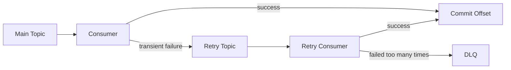
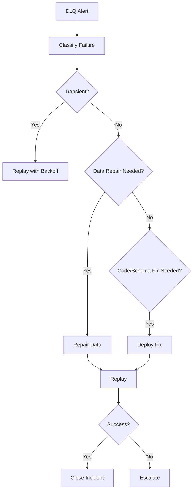
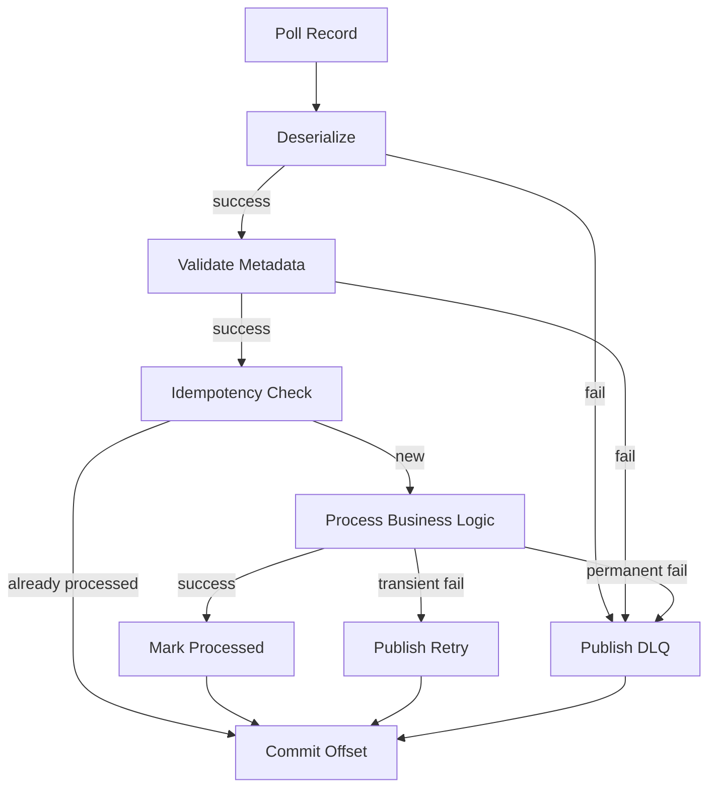

# Part 011 — Retry, DLQ, and Poison Event Handling

## 1. Tujuan Part Ini

Part ini membahas cara menangani kegagalan consumer Kafka secara production-grade.

Fokusnya bukan hanya:

```text
kalau error, retry beberapa kali lalu kirim ke DLQ
```

Fokus yang benar adalah:

```text
ketika event gagal diproses, bagaimana sistem membedakan failure sementara, failure permanen, poison event, ordering risk, duplicate risk, business impact, dan recovery path yang aman?
```

Dalam sistem Java/JAX-RS enterprise, consumer Kafka sering melakukan kombinasi operasi berikut:

- membaca event dari Kafka
- melakukan deserialization
- validasi schema dan metadata
- membaca/menulis PostgreSQL melalui MyBatis/JDBC
- mengubah state bisnis
- memanggil service lain
- menulis Redis/cache/idempotency store
- mem-publish event lanjutan
- commit offset

Setiap langkah bisa gagal.

Retry dan DLQ adalah mekanisme untuk mengendalikan failure, bukan pengganti desain idempotent, observability, dan runbook.

## 2. Mental Model Utama

Retry/DLQ harus menjawab lima pertanyaan:

| Pertanyaan | Kenapa penting |
|---|---|
| Apakah error transient atau permanent? | menentukan apakah retry masuk akal |
| Apakah event valid atau poison? | menentukan apakah event boleh diproses ulang |
| Apakah processing idempotent? | menentukan apakah retry aman |
| Apakah ordering penting? | menentukan apakah boleh skip event |
| Siapa yang memperbaiki dan bagaimana? | menentukan runbook dan ownership |

Tanpa jawaban ini, retry hanya memindahkan failure dari satu tempat ke tempat lain.

## 3. Definisi: Transient Failure

Transient failure adalah kegagalan yang mungkin hilang jika dicoba lagi.

Contoh:

- koneksi database timeout
- Redis unavailable sementara
- network timeout
- downstream service 503
- broker metadata temporarily unavailable
- connection pool exhausted sementara
- deadlock database yang bisa diulang
- rate limit sementara
- pod restart di tengah processing

Untuk transient failure, retry biasanya valid.

Namun retry tetap harus punya batas.

Tanpa batas, sistem bisa menghasilkan:

- retry storm
- consumer lag naik tajam
- downstream makin overload
- thread pool habis
- koneksi database habis
- DLQ terlambat terlihat
- SLA recovery tidak jelas

## 4. Definisi: Permanent Failure

Permanent failure adalah kegagalan yang tidak akan selesai hanya dengan mencoba ulang event yang sama.

Contoh:

- schema tidak kompatibel
- field wajib hilang
- enum value tidak dikenali
- event type tidak dikenal
- tenant ID tidak valid
- aggregate ID tidak ditemukan dan memang tidak boleh dibuat otomatis
- business state transition ilegal
- authorization rule gagal
- data referensi tidak ada
- bug deterministic pada consumer

Untuk permanent failure, retry berkali-kali biasanya hanya membuang waktu dan memperbesar lag.

Permanent failure butuh:

- DLQ
- parking lot
- manual triage
- data repair
- schema fix
- code fix
- replay terkontrol

## 5. Definisi: Poison Event

Poison event adalah event yang selalu membuat consumer gagal ketika diproses.

Ciri-ciri poison event:

- gagal secara deterministic
- retry tidak mengubah hasil
- sering memblokir partition jika tidak ditangani
- bisa menyebabkan consumer restart loop
- bisa menyebabkan lag naik untuk event setelahnya
- biasanya membutuhkan intervensi manusia atau code fix

Contoh poison event:

```json
{
  "eventId": "evt-123",
  "eventType": "OrderSubmitted",
  "schemaVersion": 3,
  "payload": {
    "orderId": null,
    "status": "UNKNOWN_STATUS"
  }
}
```

Jika `orderId` wajib dan `UNKNOWN_STATUS` tidak dikenal, retry tidak membantu.

## 6. Kenapa Poison Event Berbahaya di Kafka

Kafka menjaga ordering per partition.

Jika consumer berhenti pada poison event di offset tertentu, event setelahnya di partition yang sama tidak diproses.

Contoh:

```text
partition-0:
  offset 100: valid
  offset 101: poison
  offset 102: valid
  offset 103: valid
```

Jika offset 101 terus gagal dan consumer tidak punya strategi DLQ/skip, offset 102 dan 103 tertahan.

Ini menciptakan trade-off:

| Pilihan | Dampak |
|---|---|
| Stop pada poison event | menjaga ordering, tetapi lag naik |
| Skip ke DLQ | pipeline lanjut, tetapi ordering/business invariant bisa rusak |
| Manual intervention | aman, tetapi lambat |
| Automated replay later | perlu idempotency dan audit |

Tidak ada pilihan yang selalu benar.

Pilihan harus bergantung pada business criticality topic tersebut.

## 7. Retry Bukan Pengganti Idempotency

Retry berarti operasi yang sama bisa dijalankan lebih dari sekali.

Maka consumer harus aman terhadap duplicate.

Contoh consumer tidak aman:

```text
on PaymentCaptured:
  insert ledger row
  send notification
  commit offset
```

Jika consumer crash setelah insert ledger row tetapi sebelum commit offset, event yang sama akan diproses ulang.

Tanpa idempotency, ledger bisa double.

Retry hanya aman jika ada salah satu:

- idempotency table
- inbox table
- unique constraint bisnis
- state transition idempotent
- external API idempotency key
- deduplication key
- compensation/reconciliation

## 8. Retry Bukan Pengganti Backpressure

Jika downstream overload, retry agresif bisa memperburuk keadaan.

Misalnya PostgreSQL lambat karena lock contention.

Consumer lalu retry cepat:

```text
retry immediately, retry immediately, retry immediately
```

Efeknya:

- connection pool makin penuh
- lock makin lama
- latency naik
- consumer thread terblokir
- rebalance bisa terjadi karena max.poll.interval.ms terlampaui

Dalam kondisi overload, consumer sering perlu:

- pause/resume partition
- reduce concurrency
- exponential backoff
- retry topic dengan delay
- circuit breaker
- rate limit
- autoscaling yang sadar partition count
- alert dan manual mitigation

## 9. Retry Level dalam Kafka Consumer

Ada beberapa level retry.

| Level | Contoh | Cocok untuk | Risiko |
|---|---|---|---|
| In-memory retry | try 3 times dalam handler | error sangat singkat | block poll loop |
| Local delayed retry | sleep/backoff di consumer | low volume | max poll interval breach |
| Pause/resume | pause partition lalu resume | menjaga assignment | implementasi lebih kompleks |
| Retry topic | publish ke topic retry | delay panjang | ordering berubah |
| DLQ | publish gagal permanen | triage/manual replay | butuh ownership/runbook |
| Parking lot | isolasi event berbahaya | butuh investigasi | bisa terlupakan |

Tidak semua sistem membutuhkan semua level.

Namun sistem production biasanya minimal membutuhkan:

- bounded retry
- DLQ
- observability
- replay runbook
- idempotency

## 10. Inline Retry

Inline retry adalah retry langsung dalam proses consumer.

Contoh:

```text
poll event
try process
if fail:
  wait 100ms
  try again
if fail:
  wait 500ms
  try again
if fail:
  send to DLQ or retry topic
commit offset only after safe decision
```

Keunggulan:

- sederhana
- tidak butuh topic tambahan
- cocok untuk failure sangat pendek

Kelemahan:

- memblokir partition
- bisa melanggar max.poll.interval.ms
- tidak cocok untuk delay panjang
- tidak cocok untuk volume tinggi
- tidak menyelesaikan poison event

Inline retry sebaiknya dibatasi kecil.

Contoh batas wajar:

```text
attempts: 2-3
initial delay: 100ms-1s
max total time: jauh lebih kecil dari max.poll.interval.ms
```

Angka aktual harus diverifikasi di internal team.

## 11. Sleep di Consumer: Anti-Pattern yang Sering Terjadi

Kode seperti ini sering terlihat:

```java
try {
    handler.handle(record);
} catch (Exception ex) {
    Thread.sleep(60_000);
    handler.handle(record);
}
```

Masalahnya:

- consumer berhenti polling terlalu lama
- heartbeat bisa terganggu tergantung model implementasi
- max.poll.interval.ms bisa terlampaui
- group rebalance terjadi
- event bisa diproses ulang oleh instance lain
- lag membesar
- shutdown menjadi lambat

Delay panjang sebaiknya dipindahkan ke retry topic, scheduler, atau mekanisme retry yang tidak membekukan poll loop.

## 12. Pause/Resume Partition

Kafka consumer dapat `pause` partition tertentu dan `resume` nanti.

Mental model:

```text
poll records
if downstream overload for partition P:
  pause(P)
  continue polling other partitions if possible
  resume(P) after backoff
```

Keunggulan:

- lebih terkendali daripada sleep panjang
- bisa menjaga group membership
- bisa menghindari retry agresif

Risiko:

- implementasi lebih kompleks
- perlu state backoff per partition
- perlu shutdown handling
- perlu metric paused partition
- bisa menyembunyikan lag jika tidak dimonitor

Pause/resume cocok jika consumer framework internal cukup matang.

## 13. Retry Topic Pattern

Retry topic pattern memindahkan event gagal ke topic lain untuk dicoba ulang nanti.

Contoh topic:

```text
order.events
order.events.retry.5s
order.events.retry.1m
order.events.retry.10m
order.events.dlq
```

Flow:



Keunggulan:

- delay panjang tidak memblokir main partition
- retry budget lebih jelas
- monitoring retry terpisah
- consumer utama tetap bergerak

Kelemahan:

- ordering bisa berubah
- topic bertambah
- metadata retry harus konsisten
- replay semakin kompleks
- perlu DLQ/replay tooling

## 14. Delayed Retry di Kafka

Kafka tidak memiliki native per-message delay seperti beberapa queue system.

Delayed retry biasanya dibuat dengan pola:

- retry topic per delay bucket
- consumer retry yang hanya memproses record setelah timestamp tertentu
- scheduler service
- Kafka Streams/ksqlDB-based delay logic jika benar-benar diperlukan
- external delay queue jika platform mengizinkan

Contoh delay bucket:

```text
retry-10s
retry-1m
retry-5m
retry-30m
```

Setiap gagal, event naik ke bucket berikutnya.

Contoh:

```text
main -> retry-10s -> retry-1m -> retry-5m -> dlq
```

## 15. Retry Header Standard

Event retry harus membawa metadata.

Minimal header retry:

| Header | Fungsi |
|---|---|
| original-topic | topic asal |
| original-partition | partition asal |
| original-offset | offset asal |
| retry-count | jumlah retry |
| first-failure-time | waktu gagal pertama |
| last-failure-time | waktu gagal terakhir |
| failure-class | tipe exception/error |
| failure-message | ringkasan error aman |
| retry-reason | alasan retry |
| next-visible-at | kapan boleh dicoba lagi |
| correlation-id | trace bisnis |
| event-id | dedup/replay |

Jangan memasukkan data sensitif penuh ke header failure.

Header sering ikut masuk ke log, dashboard, DLQ browser, atau support tooling.

## 16. Retry Budget

Retry budget adalah batas total percobaan.

Contoh policy:

```yaml
retryPolicy:
  maxAttempts: 5
  schedule:
    - 10s
    - 1m
    - 5m
    - 30m
  finalDestination: DLQ
```

Retry budget mencegah infinite retry.

Hal yang harus ditentukan:

- max attempts
- total retry duration
- delay sequence
- error yang boleh retry
- error yang langsung DLQ
- owner DLQ
- alert threshold
- replay rule

Tanpa retry budget, sistem bisa mengulang event rusak selamanya.

## 17. Error Classification

Consumer harus mengklasifikasikan error.

Contoh klasifikasi:

| Error | Class | Action |
|---|---|---|
| DB timeout | transient | retry |
| optimistic lock conflict | transient/semantic | retry terbatas |
| invalid schema | permanent | DLQ |
| unknown event type | permanent | DLQ |
| tenant not found | tergantung domain | verify |
| downstream 503 | transient | retry/backoff |
| downstream 400 | permanent | DLQ/manual |
| duplicate key processed_event_id | success/idempotent | commit |
| illegal state transition | semantic/permanent | DLQ/manual |

Klasifikasi tidak boleh hanya berbasis `Exception` generic.

Desain yang baik punya error taxonomy eksplisit.

## 18. DLQ Mental Model

DLQ adalah tempat event gagal yang tidak bisa diproses secara normal.

DLQ bukan tempat sampah.

DLQ adalah:

- evidence store
- triage queue
- debugging input
- replay source
- compliance-sensitive storage
- ownership boundary

Jika tidak ada proses triage, DLQ hanya menjadi kuburan event.

## 19. Apa yang Harus Masuk ke DLQ

DLQ event sebaiknya menyimpan:

- original key
- original value
- original headers
- original topic
- original partition
- original offset
- consumer group
- failure time
- failure class
- sanitized failure message
- stack trace ringkas jika aman
- retry count
- service name
- service version
- schema ID/version
- correlation ID
- trace ID
- tenant ID jika aman
- actor/user ID jika aman
- processing attempt metadata

Contoh schema DLQ konseptual:

```json
{
  "deadLetterId": "dlq-001",
  "original": {
    "topic": "order.events",
    "partition": 4,
    "offset": 912384,
    "key": "order-123",
    "headers": {
      "event-id": "evt-abc",
      "correlation-id": "corr-xyz"
    },
    "payload": {}
  },
  "failure": {
    "consumerGroup": "order-projection-service",
    "serviceVersion": "1.42.0",
    "failureClass": "IllegalStateTransition",
    "message": "Order cannot move from CANCELLED to SUBMITTED",
    "failedAt": "2026-07-11T10:00:00Z",
    "retryCount": 4
  }
}
```

Detail aktual harus mengikuti standar internal.

## 20. DLQ Topic Naming

Contoh naming convention:

```text
<domain>.<event-stream>.dlq
<domain>.<event-stream>.retry.<delay>
<source-topic>.dlq
```

Yang penting bukan nama spesifiknya, tetapi konsistensi.

Checklist naming:

- mudah menemukan DLQ dari main topic
- jelas environment-nya
- jelas owner-nya
- jelas retention-nya
- jelas access control-nya
- jelas schema-nya

## 21. Parking Lot Topic

Parking lot topic adalah tempat event yang sengaja dipisahkan untuk investigasi lebih lama.

Bedanya dengan DLQ:

| DLQ | Parking Lot |
|---|---|
| event gagal setelah retry | event butuh isolasi/investigasi |
| sering masih bisa direplay | mungkin perlu repair/manual decision |
| alert operasional | alert operasional + bisnis |

Contoh event yang cocok ke parking lot:

- event valid secara schema tetapi melanggar invariant bisnis
- event dari tenant tertentu yang sedang incident
- event yang membutuhkan approval manual
- event yang bisa menyebabkan side effect besar jika replay otomatis

## 22. Skip vs Stop Decision

Ketika event gagal, consumer punya pilihan:

- stop processing partition
- retry inline
- kirim ke retry topic
- kirim ke DLQ lalu commit offset
- skip tanpa DLQ
- crash dan biarkan orchestrator restart

Skip tanpa DLQ hampir selalu buruk.

Stop juga tidak selalu benar.

Decision matrix:

| Kondisi | Preferensi |
|---|---|
| ordering absolut wajib | stop/manual intervention |
| event independent | DLQ + continue |
| transient infra failure | retry/backoff |
| schema invalid | DLQ |
| business invariant violation | DLQ/parking lot/manual |
| external service down | retry topic/backoff |
| duplicate already processed | commit as success |

## 23. Ordering Impact dari Retry Topic

Retry topic bisa merusak ordering.

Contoh:

```text
Main topic order for key order-123:
  offset 10: OrderCreated
  offset 11: OrderApproved
```

Jika `OrderCreated` gagal lalu masuk retry topic, tetapi `OrderApproved` diproses dulu dari main topic, downstream bisa melihat state yang mustahil.

Solusi bergantung domain:

- process per aggregate strictly ordered
- stop partition pada failure
- use inbox state machine that rejects future state until prerequisite exists
- use retry topic but consumer checks causal dependency
- use projection rebuild/reconciliation
- separate topics by event type only jika invariant aman

Tidak ada solusi gratis.

## 24. Retry dan Consumer Lag

Retry strategy memengaruhi consumer lag.

Inline retry panjang:

```text
lag naik di main topic
```

Retry topic:

```text
lag main topic lebih sehat
lag retry topic perlu dimonitor terpisah
```

DLQ:

```text
lag main topic turun
DLQ count naik
business failure belum selesai
```

Karena itu dashboard harus menampilkan:

- main topic lag
- retry topic lag
- DLQ rate
- DLQ age
- retry age
- oldest failed event age
- failure class distribution

## 25. Retry dan Offset Commit

Consumer tidak boleh commit offset secara sembarangan.

Jika processing gagal dan event belum disimpan ke retry/DLQ, commit offset berarti event hilang secara logis.

Flow aman:

```text
poll event
process fails
publish to retry/DLQ succeeds
commit original offset
```

Flow berbahaya:

```text
poll event
commit offset
process fails
publish to DLQ fails
```

Akibatnya event tidak diproses dan tidak ada di DLQ.

Ini missing event.

## 26. DLQ Publish Failure

Apa yang terjadi jika consumer gagal mem-publish ke DLQ?

Pilihan:

- jangan commit offset
- retry publish DLQ
- crash consumer
- alert critical

Jangan commit offset jika event belum aman disimpan di tempat lain.

Jika DLQ publish gagal lalu offset di-commit, event hilang dari processing path.

## 27. Retry/DLQ dan Outbox

Jika consumer mem-publish retry/DLQ event, publish itu sendiri adalah side effect.

Untuk sistem kritis, pertimbangkan:

- publish retry/DLQ sebelum commit offset
- transactional producer jika hanya Kafka-to-Kafka boundary
- outbox untuk DLQ/retry metadata jika butuh DB transaction
- idempotent DLQ publish key

Namun jangan over-engineer.

Minimal production standard:

```text
failure is either retried, stored in DLQ, or offset is not committed
```

## 28. Retry/DLQ dan PostgreSQL/MyBatis/JDBC

Consumer yang menulis PostgreSQL harus membedakan:

- error sebelum transaction dimulai
- error di tengah transaction
- commit DB sukses tetapi offset belum commit
- DB commit sukses tetapi publish event lanjutan gagal
- unique constraint idempotency hit
- deadlock/serialization failure

Contoh policy:

| DB outcome | Action |
|---|---|
| connection timeout | retry |
| deadlock detected | retry terbatas |
| unique processed_event_id | treat as already processed |
| foreign key missing | DLQ/manual, tergantung domain |
| illegal state transition | DLQ/parking lot |
| commit success, offset fail | safe if idempotent on retry |

MyBatis/JDBC transaction boundary harus eksplisit.

Jangan sampai retry mengulangi partial side effect yang sudah commit.

## 29. Retry/DLQ dan External API Call

External API call adalah failure boundary berbahaya.

Contoh:

```text
consumer receives event
calls downstream billing API
billing succeeds
consumer crashes before commit offset
event reprocessed
billing called again
```

Mitigasi:

- external idempotency key
- local outbox for outbound API command
- state machine before/after call
- reconciliation with downstream
- avoid direct external call inside Kafka consumer if workflow critical
- use saga/orchestration for long-running interaction

Retry external call tanpa idempotency key sangat berisiko.

## 30. Retry/DLQ dan Redis

Redis sering dipakai untuk:

- dedup cache
- idempotency key
- rate limiter
- distributed lock
- temporary retry state

Risiko:

- Redis data expired sebelum replay
- Redis unavailable menyebabkan false duplicate/failure
- distributed lock expired saat processing masih berjalan
- cache dedup hilang setelah restart/eviction
- Redis tidak sama durability-nya dengan PostgreSQL

Untuk correctness kuat, Redis sebaiknya bukan satu-satunya source of truth idempotency.

Gunakan PostgreSQL unique constraint/inbox table untuk event bisnis kritis.

## 31. Retry/DLQ dan Kubernetes

Di Kubernetes, retry/DLQ berinteraksi dengan pod lifecycle.

Failure mode:

- pod terminated saat processing event
- graceful shutdown tidak cukup lama
- rebalance saat rolling update
- HPA menambah consumer melebihi partition count
- CPU throttling membuat processing lambat
- memory pressure menyebabkan OOM sebelum offset commit
- readiness probe menandai pod ready sebelum Kafka consumer siap

Checklist Kubernetes:

- graceful shutdown handler
- stop polling before shutdown
- finish in-flight record atau store state safely
- commit only after safe processing
- preStop hook jika dibutuhkan
- terminationGracePeriodSeconds cukup
- metrics for rebalance and shutdown

## 32. Retry/DLQ dan Cloud/On-Prem Deployment

Cloud-managed Kafka dan on-prem punya failure mode berbeda.

Cloud-managed:

- auth token/credential expiry
- managed service throttling/limits
- private endpoint/network issue
- regional degradation
- metric delay

On-prem:

- broker disk full
- certificate expiry
- firewall change
- DNS/internal routing issue
- storage latency
- manual upgrade risk

Retry policy harus mempertimbangkan deployment environment.

Misalnya network transient di hybrid deployment mungkin lebih sering daripada single VPC deployment.

## 33. Observability untuk Retry/DLQ

Minimal metrics:

| Metric | Fungsi |
|---|---|
| retry event rate | melihat kenaikan retry |
| DLQ event rate | melihat failure permanen |
| retry age | melihat event tertahan |
| DLQ age | melihat backlog triage |
| retry count distribution | melihat retry storm |
| failure class count | root cause grouping |
| oldest DLQ event age | SLA triage |
| replay success/failure | recovery quality |
| consumer lag main topic | pipeline utama |
| consumer lag retry topic | pipeline retry |

Alert yang berguna:

- DLQ count > 0 untuk critical topic
- DLQ rate spike
- oldest DLQ event age melewati SLA
- retry topic lag naik terus
- retry storm untuk failure class yang sama
- DLQ publish failure

## 34. Logging untuk Failure Event

Log harus cukup untuk debugging tetapi aman untuk privacy.

Log minimal:

```text
eventId
correlationId
topic
partition
offset
consumerGroup
failureClass
retryCount
actionTaken
```

Hindari log payload penuh jika mengandung PII atau data kontrak sensitif.

Gunakan redaction.

## 35. Tracing untuk Retry/DLQ

Trace ideal menunjukkan:

```text
HTTP request / upstream event
  -> producer
  -> Kafka topic
  -> consumer attempt 1
  -> retry publish
  -> retry consumer attempt 2
  -> DLQ
  -> manual replay
  -> success
```

Jika trace context hilang saat retry/DLQ, debugging menjadi jauh lebih sulit.

Header yang perlu dipertahankan:

- traceparent atau format trace internal
- correlation-id
- causation-id
- event-id
- source-service
- tenant-id jika aman

## 36. DLQ Triage Workflow

DLQ harus punya workflow.

Contoh workflow:



DLQ bukan selesai ketika event masuk DLQ.

DLQ selesai ketika event diputuskan:

- replayed successfully
- intentionally ignored with approval
- repaired manually
- compensated
- escalated as business exception

## 37. Replay dari DLQ

Replay harus aman.

Sebelum replay:

- cek event idempotent atau tidak
- cek apakah state bisnis sudah berubah
- cek apakah consumer version sudah fixed
- cek apakah schema compatible
- cek apakah event masih relevan
- cek apakah replay bisa mengirim notification/customer-facing side effect
- cek apakah replay perlu dry-run
- cek approval jika topic critical

Replay bukan sekadar produce ulang payload lama.

Replay adalah operasi produksi.

## 38. Manual Replay vs Automated Replay

Manual replay cocok untuk:

- event kritis
- low volume
- butuh approval
- business invariant kompleks
- data repair sebelum replay

Automated replay cocok untuk:

- failure transient jelas
- event idempotent
- high volume
- error class terkontrol
- replay path tested

Automated replay tanpa guardrail bisa menjadi incident kedua.

## 39. DLQ Retention

DLQ retention harus cukup lama untuk investigasi dan replay.

Namun jangan terlalu lama tanpa alasan karena:

- payload bisa berisi data sensitif
- storage bertambah
- schema lama sulit diproses
- replay lama bisa berbahaya
- compliance retention bisa dilanggar

Pertanyaan desain:

- berapa lama DLQ disimpan?
- siapa boleh membaca DLQ?
- apakah payload terenkripsi/masked?
- apakah ada archive?
- apakah ada deletion procedure?
- bagaimana DLQ lama direplay jika schema berubah?

## 40. Retry/DLQ untuk Compact Topic

Compact topic berbeda dari event stream biasa.

Jika retry/DLQ memakai key yang sama dan compacted, record lama bisa hilang.

Untuk DLQ, biasanya perlu preserve setiap failure attempt.

Maka DLQ topic sering lebih cocok dengan cleanup policy `delete`, bukan compact.

Namun jika DLQ didesain sebagai latest failure state per event ID, compaction mungkin masuk akal.

Keputusan ini harus eksplisit.

## 41. Retry/DLQ untuk Command Topic

Command topic lebih sensitif.

Duplicate command bisa menyebabkan side effect.

Contoh:

- activate service
- cancel order
- provision product
- charge payment

Retry command harus memiliki:

- command ID
- idempotency key
- command state table
- reply/correlation ID
- timeout handling
- compensation strategy

Jangan retry command seperti retry notification event.

## 42. Retry/DLQ untuk Notification Event

Notification event biasanya lebih toleran.

Contoh:

- send email
- refresh cache
- notify dashboard

Tetap perlu idempotency, tetapi business risk biasanya lebih rendah dibanding command.

Policy bisa lebih sederhana:

```text
bounded retry -> DLQ -> optional manual replay
```

Namun hati-hati jika notification berdampak customer-facing, misalnya email invoice atau SMS aktivasi.

## 43. Retry/DLQ untuk Event-Carried State Transfer

Event-carried state transfer membawa state terbaru.

Jika event lama gagal tetapi event baru sudah diproses, replay event lama bisa menurunkan state.

Mitigasi:

- payload punya version atau sequence
- consumer melakukan monotonic update
- ignore event lebih lama
- compare event time/version
- state table menyimpan last processed version

Replay event lama harus memeriksa freshness.

## 44. Retry/DLQ untuk Audit Event

Audit event biasanya tidak boleh hilang.

Jika audit consumer gagal, pilihan skip lebih berbahaya.

Audit flow perlu:

- durable storage
- strict alert
- DLQ dengan retention memadai
- replay tested
- immutable audit semantics
- compliance owner

Audit event bisa punya policy berbeda dari event operasional biasa.

## 45. Failure Matrix: Consumer Processing

Contoh failure matrix:

| Step | Failure | Safe action |
|---|---|---|
| deserialize | schema invalid | DLQ, commit after DLQ publish |
| validate metadata | missing event ID | DLQ/parking lot |
| idempotency check | DB timeout | retry |
| business update | deadlock | retry bounded |
| business update | illegal state | DLQ/manual |
| external call | timeout | retry with idempotency key |
| publish next event | broker timeout | retry/outbox |
| commit offset | commit fail | retry processing safe only if idempotent |

Matrix seperti ini harus dibuat untuk consumer kritis.

## 46. Production-Safe Consumer Error Flow

Contoh flow konseptual:



Catatan penting:

- commit offset hanya setelah event diproses, di-retry, atau di-DLQ secara aman
- duplicate harus dianggap success jika sudah diproses
- DLQ publish failure tidak boleh disembunyikan

## 47. Java Implementation Sketch

Contoh pseudo-code:

```java
public void handle(ConsumerRecord<String, byte[]> record) {
    ProcessingDecision decision;

    try {
        EventEnvelope event = deserializer.deserialize(record);
        validator.validate(event);

        decision = idempotencyService.executeOnce(event.eventId(), () -> {
            businessHandler.handle(event);
            return ProcessingDecision.success();
        });
    } catch (TransientFailure ex) {
        decision = retryPolicy.toRetry(record, ex);
    } catch (PermanentFailure ex) {
        decision = dlqPolicy.toDeadLetter(record, ex);
    } catch (Exception ex) {
        decision = errorClassifier.classify(record, ex);
    }

    switch (decision.type()) {
        case SUCCESS -> offsetManager.commit(record);
        case RETRY -> {
            retryPublisher.publish(decision.retryRecord());
            offsetManager.commit(record);
        }
        case DEAD_LETTER -> {
            dlqPublisher.publish(decision.deadLetterRecord());
            offsetManager.commit(record);
        }
        case STOP -> throw decision.exception();
    }
}
```

Ini hanya sketch.

Di production, detail threading, commit batching, transaction boundary, metrics, dan shutdown harus lebih hati-hati.

## 48. Anti-Patterns

Anti-pattern umum:

- retry infinite
- sleep panjang di poll loop
- commit offset sebelum processing aman
- skip event tanpa DLQ
- DLQ tanpa alert
- DLQ tanpa owner
- DLQ tanpa replay path
- payload full PII di DLQ
- semua exception dianggap transient
- semua exception dianggap permanent
- retry external API tanpa idempotency key
- mengandalkan Redis-only dedup untuk event kritis
- retry topic tanpa mempertimbangkan ordering
- replay DLQ langsung ke main topic tanpa validasi

## 49. PR Review Checklist

Saat review consumer retry/DLQ, tanyakan:

- Apa error taxonomy-nya?
- Error mana yang transient?
- Error mana yang permanent?
- Apa retry budget-nya?
- Apa backoff policy-nya?
- Apa DLQ schema-nya?
- Apakah DLQ publish terjadi sebelum offset commit?
- Apa yang terjadi jika DLQ publish gagal?
- Apakah consumer idempotent?
- Apakah replay aman?
- Apakah ordering bisa rusak karena retry topic?
- Apakah external API call punya idempotency key?
- Apakah retry metrics dan DLQ metrics tersedia?
- Apakah ada alert?
- Siapa owner DLQ?
- Apakah ada runbook?

## 50. Internal Verification Checklist

Untuk konteks CSG/team, verifikasi:

- daftar retry topic dan DLQ topic aktual
- naming convention retry/DLQ
- retry count/header standard
- DLQ event schema
- DLQ retention policy
- DLQ access control
- DLQ monitoring dashboard
- DLQ alert threshold
- DLQ owner per topic/domain
- replay tooling dan approval flow
- consumer framework internal untuk retry/DLQ
- offset commit policy setelah retry/DLQ
- handling jika retry/DLQ publish gagal
- poison event incident notes
- runbook consumer lag dan DLQ
- schema compatibility failure history
- retry policy untuk external API call
- idempotency/inbox table usage
- Kubernetes shutdown behavior untuk consumer

## 51. Production Debugging Sequence

Jika DLQ spike terjadi:

1. Identifikasi topic, consumer group, service version.
2. Group by failure class.
3. Cek apakah deploy baru terjadi.
4. Cek schema change baru.
5. Cek downstream dependency health.
6. Cek consumer lag main topic dan retry topic.
7. Cek apakah hanya tenant/domain tertentu.
8. Cek sample event metadata, bukan langsung payload penuh.
9. Tentukan transient vs permanent.
10. Stop automated replay jika memperburuk kondisi.
11. Jika code/schema bug, deploy fix.
12. Jika data issue, lakukan repair dengan approval.
13. Replay batch kecil dulu.
14. Monitor duplicate, lag, dan business state.
15. Dokumentasikan root cause dan prevention.

## 52. Minimal Production Standard

Untuk consumer Kafka production, minimal:

- bounded retry
- explicit error classification
- DLQ untuk permanent failure
- no offset commit before safe outcome
- idempotent processing
- retry/DLQ metrics
- alert untuk DLQ dan retry storm
- replay runbook
- DLQ retention and access policy
- correlation ID/event ID preserved
- safe shutdown in Kubernetes

Jika salah satu tidak ada, consumer tersebut belum production-ready.

## 53. Kesimpulan

Retry dan DLQ bukan detail tambahan.

Retry dan DLQ adalah bagian dari correctness model event-driven system.

Desain yang matang tidak bertanya:

```text
berapa kali kita retry?
```

Desain yang matang bertanya:

```text
failure jenis apa ini, apakah retry aman, apakah ordering terjaga, apakah event idempotent, apakah offset aman di-commit, siapa yang melihat DLQ, bagaimana replay dilakukan, dan bagaimana kita membuktikan business state tetap benar?
```

Part berikutnya membahas schema dan serialization, karena banyak poison event dan DLQ spike berasal dari contract/schema evolution yang buruk.
